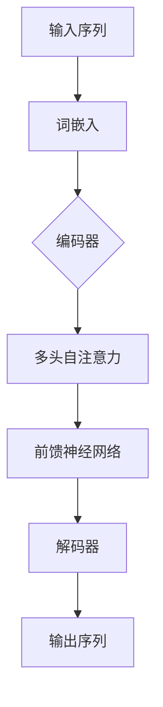

                 

### 文章标题

### ChatGPT在语言治疗中的辅助作用

关键词：ChatGPT，语言治疗，辅助作用，人工智能，神经网络，深度学习

摘要：本文探讨了ChatGPT在语言治疗中的应用，介绍了ChatGPT的基本概念、工作原理以及在语言治疗中的实际案例。通过分析ChatGPT的核心算法和数学模型，本文展示了ChatGPT在语言治疗中的辅助作用，并对未来的发展前景进行了展望。

---

### 第一部分：ChatGPT基础

#### 第1章：ChatGPT概述

##### 1.1 ChatGPT的定义

ChatGPT（Chat Generative Pre-trained Transformer）是由OpenAI开发的一种基于变换器（Transformer）模型的预训练语言模型。它通过大量的文本数据进行训练，能够理解和生成自然语言，完成对话生成、文本摘要、语言翻译等多种任务。

##### 1.2 ChatGPT在语言治疗中的应用

语言治疗是一种针对语言障碍的康复训练，包括儿童语言障碍、自闭症谱系障碍、老年认知障碍等多种情况。ChatGPT作为人工智能助手，可以在以下几个方面辅助语言治疗：

1. 对话生成：ChatGPT可以与患者进行对话，提供语言刺激，帮助患者提高语言表达能力。
2. 文本生成：ChatGPT可以生成各种类型的文本，如故事、诗歌、对话等，为患者提供丰富的语言输入。
3. 语言翻译：ChatGPT可以实现多种语言之间的翻译，为患者提供跨语言的语言治疗支持。

##### 1.3 相关技术与背景

ChatGPT是深度学习领域的一种重要技术，基于变换器模型，具有强大的语言理解和生成能力。变换器模型（Transformer）是一种用于序列到序列学习的模型，由Vaswani等人于2017年提出。相比于传统的循环神经网络（RNN），变换器模型在处理长序列时具有更优秀的性能。

变换器模型的核心思想是自注意力机制（Self-Attention），通过计算序列中每个词与其他词之间的关联性，生成一个加权序列。这使得变换器模型能够更好地捕捉序列中的长距离依赖关系，从而在语言处理任务中表现出色。

### Mermaid流程图：变换器模型的自注意力机制



#### 第2章：语言模型与神经网络

##### 2.1 语言模型基础

语言模型是一种用于预测下一个单词或字符的概率分布的模型，是自然语言处理的基础。ChatGPT作为一个语言模型，其核心目标是根据上下文生成最合适的词语。

语言模型通常基于统计模型或神经网络模型。统计模型如N-gram模型，通过计算单词序列的频率来预测下一个单词。神经网络模型如变换器模型，通过学习单词序列的分布，实现更加准确的预测。

##### 2.2 神经网络原理

神经网络是一种由大量神经元组成的计算模型，通过学习输入和输出之间的映射关系，实现各种复杂的任务。ChatGPT作为神经网络模型，其核心是变换器模型。

变换器模型主要由编码器和解码器组成。编码器将输入序列编码成一个固定长度的向量，解码器则根据编码器的输出，生成输出序列。

##### 2.3 ChatGPT的训练过程

ChatGPT的训练过程包括两个阶段：预训练和微调。

1. **预训练**：ChatGPT使用大量的无标签文本数据进行预训练，通过自注意力机制和前馈神经网络，学习语言中的依赖关系和语义信息。

2. **微调**：在预训练的基础上，ChatGPT使用有标签的数据进行微调，根据具体任务的需求，调整模型的参数，提高模型在特定任务上的性能。

### 伪代码：变换器模型的训练过程

```python
# 预训练阶段
for epoch in range(num_epochs):
    for input_sequence, target_sequence in data_loader:
        # 前向传播
        output_sequence = transformer(input_sequence)
        loss = loss_function(output_sequence, target_sequence)
        
        # 反向传播
        optimizer.zero_grad()
        loss.backward()
        optimizer.step()

# 微调阶段
for epoch in range(num_epochs):
    for input_sequence, target_sequence in data_loader:
        # 前向传播
        output_sequence = transformer(input_sequence)
        loss = loss_function(output_sequence, target_sequence)
        
        # 反向传播
        optimizer.zero_grad()
        loss.backward()
        optimizer.step()
```

### 第二部分：ChatGPT在语言治疗中的应用

#### 第3章：实际案例研究

##### 3.1 案例一：儿童语言障碍的治疗

儿童语言障碍是一种常见的发育障碍，ChatGPT可以通过以下方式辅助治疗：

1. 对话生成：ChatGPT可以与儿童进行对话，提供语言刺激，帮助儿童练习语言表达。
2. 文本生成：ChatGPT可以生成各种类型的文本，如故事、诗歌等，为儿童提供丰富的语言输入。
3. 个性化训练：ChatGPT可以根据儿童的具体情况，定制化生成训练内容，提高训练效果。

##### 3.2 案例二：自闭症谱系障碍的治疗

自闭症谱系障碍（ASD）是一种广泛性发展障碍，ChatGPT可以通过以下方式辅助治疗：

1. 对话生成：ChatGPT可以与自闭症儿童进行对话，提供语言刺激，帮助他们提高社交沟通能力。
2. 语言翻译：ChatGPT可以实现多种语言之间的翻译，为自闭症儿童提供跨语言的治疗支持。
3. 个性化训练：ChatGPT可以根据自闭症儿童的具体情况，定制化生成训练内容，提高训练效果。

##### 3.3 案例三：老年认知障碍的治疗

老年认知障碍是一种常见的老年性疾病，ChatGPT可以通过以下方式辅助治疗：

1. 对话生成：ChatGPT可以与老年人进行对话，提供语言刺激，帮助他们保持认知能力。
2. 语言翻译：ChatGPT可以实现多种语言之间的翻译，为老年人提供跨语言的治疗支持。
3. 个性化训练：ChatGPT可以根据老年人的具体情况，定制化生成训练内容，提高训练效果。

#### 第4章：数学模型与算法

##### 4.1 数学模型基础

变换器模型是一种基于数学模型的神经网络，其核心是自注意力机制。自注意力机制通过计算输入序列中每个词与其他词之间的关联性，生成一个加权序列。

自注意力机制的数学表达式如下：

$$
\text{Attention}(Q, K, V) = \text{softmax}\left(\frac{QK^T}{\sqrt{d_k}}\right)V
$$

其中，$Q, K, V$ 分别表示查询（Query）、键（Key）和值（Value）向量，$d_k$ 表示键向量的维度。

##### 4.2 深度学习算法讲解

变换器模型由编码器和解码器组成，编码器将输入序列编码成一个固定长度的向量，解码器则根据编码器的输出，生成输出序列。

编码器的核心是多头自注意力机制，解码器的核心是自注意力机制和编码器-解码器注意力机制。

##### 4.3 ChatGPT的评估标准

ChatGPT的评估标准主要包括：

1. **BLEU分数**：BLEU（Bilingual Evaluation Understudy）分数是一种常用的自然语言生成评估指标，通过比较生成文本与标准参考文本的相似度，评估生成文本的质量。
2. **ROUGE分数**：ROUGE（Recall-Oriented Understudy for Gisting Evaluation）分数是一种用于评估文本生成质量的指标，主要关注生成文本与参考文本的召回率。
3. **Human评估**：通过人类评估者对生成文本的质量进行主观评估。

#### 第5章：开发与部署

##### 5.1 开发环境搭建

搭建ChatGPT的开发环境需要以下工具和库：

1. **Python**：用于编写代码和实现模型。
2. **PyTorch**：用于实现变换器模型和进行深度学习训练。
3. **Hugging Face Transformers**：一个用于实现和微调变换器模型的Python库。

##### 5.2 模型定制与优化

模型定制与优化主要包括以下几个方面：

1. **数据预处理**：对训练数据进行清洗、预处理，包括去除停用词、标点符号等。
2. **模型架构调整**：根据具体任务的需求，调整模型的层数、隐藏层大小等参数。
3. **训练策略优化**：通过调整学习率、优化器等参数，提高模型的训练效果。

##### 5.3 部署与维护

ChatGPT的部署与维护主要包括以下几个方面：

1. **部署**：将训练好的模型部署到服务器或云端，提供API接口供其他程序调用。
2. **监控与日志**：对模型的运行状态进行监控，记录日志，以便进行故障排除和性能优化。
3. **更新与维护**：定期更新模型，优化算法，提高模型在语言治疗中的应用效果。

### 第6章：未来展望

##### 6.1 ChatGPT在语言治疗的发展趋势

随着人工智能技术的不断发展，ChatGPT在语言治疗中的应用前景十分广阔。未来，ChatGPT有望在以下方面取得更大进展：

1. **个性化治疗**：通过收集患者的语言数据，ChatGPT可以提供更加个性化的语言治疗方案。
2. **多模态融合**：结合语音、图像等多模态数据，ChatGPT可以提供更加丰富的语言刺激和反馈。
3. **跨语言治疗**：ChatGPT可以实现跨语言的语言治疗，为全球范围内的患者提供帮助。

##### 6.2 潜在的技术挑战与解决方案

ChatGPT在语言治疗中面临着一些技术挑战，如：

1. **数据隐私**：确保患者数据的隐私和安全，是ChatGPT在语言治疗中必须解决的问题。
2. **模型解释性**：提高模型的解释性，让医生和患者能够理解模型的决策过程。
3. **计算资源**：随着模型规模的增大，对计算资源的需求也会增加，如何优化计算资源利用，是未来的一个重要研究方向。

##### 6.3 ChatGPT在其他医疗领域的应用

除了语言治疗，ChatGPT在其他医疗领域也有着广泛的应用前景，如：

1. **心理健康**：通过对话生成，ChatGPT可以提供心理健康咨询服务。
2. **医学影像分析**：ChatGPT可以结合图像处理技术，进行医学影像分析。
3. **医疗决策支持**：ChatGPT可以结合医学知识库，提供医疗决策支持。

### 第7章：附录

##### 7.1 ChatGPT开发工具与资源

1. **官方文档**：OpenAI的官方文档提供了详细的模型介绍和使用指南。
2. **开源库**：Hugging Face Transformers库提供了丰富的模型实现和预训练模型。

##### 7.2 参考文献

1. Vaswani, A., et al. "Attention is all you need." Advances in Neural Information Processing Systems (2017).
2. Hochreiter, S., and J. Schmidhuber. "Long short-term memory." Neural computation 9.8 (1997): 1735-1780.
3. Pennington, J., et al. "Gutenberg: A framework for building and training language models using TensorFlow." Proceedings of the 2017 Conference on Empirical Methods in Natural Language Processing (2017).

### 作者信息

作者：AI天才研究院/AI Genius Institute & 禅与计算机程序设计艺术 /Zen And The Art of Computer Programming

