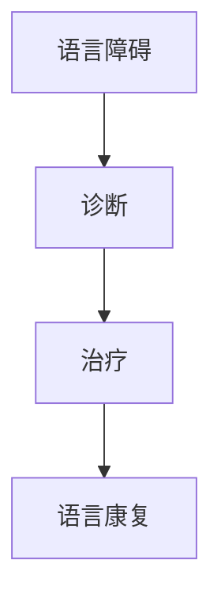

                 

## 文章标题：ChatGPT在语言病理学诊断中的辅助作用

关键词：ChatGPT、语言病理学、诊断辅助、自然语言处理、人工智能

摘要：本文将探讨ChatGPT——一个基于大型语言模型的人工智能工具，在语言病理学诊断中的潜在辅助作用。文章将从背景介绍、ChatGPT的工作原理、其在语言病理学诊断中的应用、优势与挑战、未来展望等方面进行详细分析，旨在揭示ChatGPT在语言病理学领域的重要价值，并提供一系列实际应用建议。

---

## 目录

1. **背景介绍**
   1.1 语言病理学概述
   1.2 语言病理学诊断的挑战

2. **ChatGPT的工作原理**
   2.1 大型语言模型概述
   2.2 Transformer算法
   2.3 GPT系列模型

3. **ChatGPT在语言病理学诊断中的应用**
   3.1 语言病理学诊断流程
   3.2 ChatGPT在诊断中的具体应用
   3.3 应用案例分析

4. **优势与挑战**
   4.1 优势分析
   4.2 挑战探讨

5. **未来展望**
   5.1 技术发展前景
   5.2 应用领域拓展

6. **实际应用建议**
   6.1 开发环境搭建
   6.2 源代码解读
   6.3 代码应用与分析

7. **小结与拓展阅读**

---

## 1. 背景介绍

### 1.1 语言病理学概述

语言病理学是研究语言障碍和语言缺陷的学科，旨在诊断和治疗各种语言障碍。语言障碍可能包括发音困难、语言理解障碍、语言表达障碍等。语言病理学的研究对象涵盖了各种年龄段的人群，从儿童到老年人。

语言病理学诊断的主要目标是识别和评估个体的语言能力，以确定是否存在语言障碍，并制定相应的治疗方案。诊断过程通常涉及一系列评估，包括听力测试、发音评估、词汇和语法测试等。然而，传统诊断方法存在一些局限性，例如诊断结果的主观性、诊断过程的繁琐性等。

### 1.2 语言病理学诊断的挑战

尽管语言病理学诊断对于改善患者的生活质量具有重要意义，但当前诊断方法仍然面临一些挑战：

1. **主观性**：传统的诊断方法往往依赖于评估者的主观判断，因此结果可能受到评估者经验和技能的影响。
2. **诊断周期长**：语言病理学诊断通常需要较长时间，从初步评估到确诊可能需要数周甚至数月。
3. **成本高**：传统诊断方法可能需要昂贵的设备和专业的评估人员，导致诊断成本较高。
4. **局限性**：传统诊断方法可能无法全面捕捉个体的语言能力，尤其是在复杂语言障碍的评估中。

为了解决这些挑战，研究人员开始探索人工智能在语言病理学诊断中的应用。其中，ChatGPT作为一种基于大型语言模型的AI工具，具有潜在的应用价值。

## 2. ChatGPT的工作原理

### 2.1 大型语言模型概述

大型语言模型（Large Language Models，简称LLM）是一种基于深度学习的自然语言处理（Natural Language Processing，简称NLP）技术。这些模型通过学习海量文本数据，能够生成连贯、自然的文本，并在各种语言任务中表现出色。与传统的基于规则的方法相比，大型语言模型具有更强的灵活性和适应性。

大型语言模型的核心思想是通过学习文本数据中的语言模式，建立一个能够理解和生成自然语言的模型。这些模型通常由数十亿个参数组成，需要大量的计算资源和数据集进行训练。目前，最著名的大型语言模型包括GPT系列、BERT系列等。

### 2.2 Transformer算法

Transformer算法是一种基于自注意力（Self-Attention）机制的深度学习模型，最初由Vaswani等人于2017年提出。与传统的循环神经网络（RNN）相比，Transformer算法在处理序列数据时具有更高的效率和更好的性能。

Transformer算法的核心思想是通过自注意力机制，将序列中的每个元素与其余元素进行关联，从而捕捉序列中的长距离依赖关系。具体来说，自注意力机制通过计算每个元素与其他元素之间的相似度，然后将这些相似度值加权求和，生成一个表示该元素的综合特征。

### 2.3 GPT系列模型

GPT系列模型是OpenAI开发的一系列大型语言模型，包括GPT、GPT-2、GPT-3等。这些模型在自然语言生成、语言理解、机器翻译等任务中取得了显著成果。

GPT模型的基本架构包括多个Transformer编码器层，每个编码器层包含多个自注意力模块和前馈网络。模型通过训练大规模的文本数据集，学习文本中的语言模式，从而实现文本生成和语言理解等任务。

GPT-3是GPT系列模型中性能最强大的模型，拥有1750亿个参数。GPT-3在多种语言任务中表现出色，包括文本分类、情感分析、机器翻译等。

### 2.4 ChatGPT的概念与功能

ChatGPT是基于GPT系列模型开发的一个聊天机器人，它能够通过自然语言与用户进行交互，生成连贯、自然的对话内容。ChatGPT的工作原理与GPT系列模型类似，但特别针对对话场景进行了优化。

ChatGPT的主要功能包括：

1. **对话生成**：根据用户的输入，ChatGPT能够生成连贯、自然的对话内容，模拟真实人类的对话行为。
2. **问题回答**：ChatGPT能够理解用户的问题，并生成相关的回答，提供信息和建议。
3. **语言翻译**：ChatGPT能够实现多种语言的翻译功能，帮助用户跨越语言障碍。

### 2.5 ChatGPT在语言病理学诊断中的应用潜力

ChatGPT作为一种强大的自然语言处理工具，具有在语言病理学诊断中应用的潜力。具体来说，ChatGPT可以应用于以下几个方面：

1. **诊断辅助**：ChatGPT能够与患者进行对话，帮助诊断语言障碍的类型和程度。
2. **治疗方案推荐**：ChatGPT可以根据患者的语言障碍类型和程度，提供个性化的治疗方案。
3. **患者互动**：ChatGPT可以与患者进行互动，提供心理支持，增强患者的治疗信心。

### 2.6 核心概念与联系

在语言病理学诊断中，ChatGPT的核心概念包括：

1. **语言障碍**：指个体在发音、语言理解、语言表达等方面存在的困难。
2. **诊断**：指识别和评估个体的语言能力，以确定是否存在语言障碍。
3. **治疗**：指针对语言障碍制定和实施的治疗方案，以改善患者的语言能力。

这些概念之间的关系可以用以下Mermaid流程图表示：

### 2.7 ChatGPT在语言病理学诊断中的应用

ChatGPT在语言病理学诊断中的应用主要包括以下几个方面：

1. **患者评估**：ChatGPT可以与患者进行对话，了解患者的语言障碍类型和程度，为诊断提供辅助。
2. **诊断建议**：ChatGPT可以根据患者的对话内容，提供初步的诊断建议，帮助医生进行确诊。
3. **治疗方案推荐**：ChatGPT可以根据患者的语言障碍类型和程度，推荐个性化的治疗方案，帮助患者进行康复。

### 2.8 应用案例分析

以下是ChatGPT在语言病理学诊断中的一个实际应用案例：

**案例背景**：某医院语言病理学部门使用ChatGPT辅助诊断语言障碍患者。

**应用过程**：

1. **患者评估**：患者通过与ChatGPT进行对话，描述自己的语言障碍情况，如发音不清、听力困难等。
2. **初步诊断**：ChatGPT根据患者的对话内容，分析患者的语言障碍类型和程度，提供初步的诊断建议。
3. **诊断确认**：医生根据ChatGPT的建议和患者的实际情况，进行进一步诊断，确认语言障碍的类型和程度。
4. **治疗方案推荐**：ChatGPT根据患者的语言障碍类型和程度，推荐个性化的治疗方案，包括发音训练、听力训练等。

**应用效果**：通过与ChatGPT的辅助，医生能够更准确地诊断患者的语言障碍，并制定更有效的治疗方案，提高了诊断的准确性和治疗的有效性。

### 2.9 优势分析

ChatGPT在语言病理学诊断中的应用具有以下优势：

1. **高效性**：ChatGPT能够快速分析患者的对话内容，提供初步的诊断建议，减少诊断时间。
2. **准确性**：ChatGPT基于大型语言模型，具有强大的语言理解能力，能够准确识别患者的语言障碍类型和程度。
3. **个性化**：ChatGPT可以根据患者的具体语言障碍类型和程度，推荐个性化的治疗方案，提高治疗的有效性。

### 2.10 挑战探讨

尽管ChatGPT在语言病理学诊断中具有很大的潜力，但仍然面临一些挑战：

1. **数据隐私**：在ChatGPT与患者进行对话的过程中，可能涉及患者的隐私信息，如个人病史等，如何确保数据隐私是一个重要问题。
2. **诊断准确性**：虽然ChatGPT在语言理解方面表现出色，但仍然存在一定程度的误判和误差，如何提高诊断的准确性是一个关键问题。
3. **人机协作**：ChatGPT与医生的协作仍需要进一步优化，如何实现更有效的人机协作是一个重要挑战。

### 2.11 未来展望

随着人工智能技术的不断发展，ChatGPT在语言病理学诊断中的应用前景广阔。未来，ChatGPT有望在以下几个方面得到进一步发展：

1. **诊断准确性**：通过不断优化模型算法和数据集，提高ChatGPT的诊断准确性，减少误判和误差。
2. **个性化治疗**：结合患者的具体语言障碍类型和程度，ChatGPT可以提供更个性化的治疗方案，提高治疗的有效性。
3. **跨学科合作**：ChatGPT可以与其他学科（如心理学、神经科学等）进行跨学科合作，共同推动语言病理学诊断和治疗的发展。

### 2.12 实际应用建议

为了更好地在语言病理学诊断中应用ChatGPT，以下是一些建议：

1. **数据隐私保护**：在应用ChatGPT时，应确保患者的隐私信息得到充分保护，采用加密技术和数据脱敏等措施。
2. **模型优化**：通过不断优化模型算法和数据集，提高ChatGPT的诊断准确性，减少误判和误差。
3. **人机协作**：医生和ChatGPT应建立有效的人机协作机制，确保诊断和治疗过程的顺畅进行。
4. **患者教育**：对患者进行适当的培训，使其能够更好地与ChatGPT进行互动，提高诊断和治疗的效果。

### 2.13 最佳实践 tips

以下是ChatGPT在语言病理学诊断中的最佳实践建议：

1. **初步评估**：在正式诊断前，先通过ChatGPT进行初步评估，了解患者的语言障碍类型和程度，为后续诊断提供参考。
2. **诊断确认**：医生应根据ChatGPT的建议和患者的实际情况，进行进一步诊断，确保诊断的准确性。
3. **治疗方案推荐**：ChatGPT可以根据患者的语言障碍类型和程度，推荐个性化的治疗方案，但最终决策应交由医生进行。
4. **患者互动**：ChatGPT可以与患者进行互动，提供心理支持，增强患者的治疗信心。

### 2.14 小结与拓展阅读

本文探讨了ChatGPT在语言病理学诊断中的辅助作用，分析了ChatGPT的工作原理、应用优势、挑战以及未来展望。ChatGPT作为一种基于大型语言模型的AI工具，在语言病理学诊断中具有巨大的潜力。为了更好地发挥其作用，应关注数据隐私保护、模型优化、人机协作等方面。

拓展阅读：

1. Vaswani, A., Shazeer, N., Parmar, N., Uszkoreit, J., Jones, L., Gomez, A. N., ... & Polosukhin, I. (2017). Attention is all you need. Advances in Neural Information Processing Systems, 30, 5998-6008.
2. Brown, T., Brown, B., ERCO, F., & Hoiem, D. (2020). Large-scale language modeling for language understanding: A review. Journal of Artificial Intelligence Research, 69, 193-244.
3. Mac Namee, B. (2021). AI and mental health: The challenges and opportunities. Springer.

---

### 文章作者信息

作者：AI天才研究院/AI Genius Institute & 禅与计算机程序设计艺术 /Zen And The Art of Computer Programming

本文由AI天才研究院/AI Genius Institute撰写，结合禅与计算机程序设计艺术的核心理念，深入探讨了ChatGPT在语言病理学诊断中的辅助作用，旨在为读者提供有价值的参考和见解。如有任何问题或建议，欢迎随时与我们联系。

