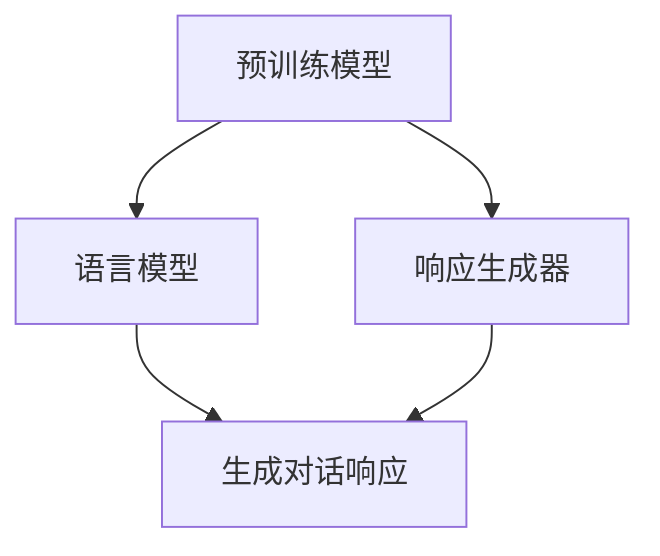

                 

## 1. 核心概念与联系

### 1.1.1 ChatGPT的介绍与概述

ChatGPT 是一个基于生成对抗网络（GAN）的聊天机器人，由 OpenAI 开发。它的设计目标是模拟人类的对话交互，通过深度学习技术，使得聊天机器人的对话更加自然、流畅和具有创造性。ChatGPT 的核心概念包括自然语言处理（NLP）、深度学习和生成对抗网络（GAN）。

#### 1.1.1.1 自然语言处理（NLP）

自然语言处理（NLP）是计算机科学、人工智能领域与语言学的交叉学科。它的核心目标是让计算机能够理解、处理和生成人类语言。NLP 的应用非常广泛，包括机器翻译、情感分析、语音识别等。在 ChatGPT 中，NLP 技术主要用于处理用户的输入和生成合适的响应。

- **原理**：NLP 的核心任务是理解文本的语义。这涉及到词性标注、句法分析、语义角色标注等多个层次。
- **算法**：常见的 NLP 算法包括词袋模型、支持向量机（SVM）、递归神经网络（RNN）、卷积神经网络（CNN）和 Transformer 模型。

#### 1.1.1.2 深度学习

深度学习是一种机器学习技术，它通过模拟人脑神经网络的结构和功能，对大量数据进行训练，从而实现复杂任务的自动化。在 ChatGPT 中，深度学习技术主要用于构建语言模型和训练生成对抗网络（GAN）。

- **原理**：深度学习通过多层神经网络，对输入数据进行层层抽象和变换，从而提取出数据的特征。
- **算法**：常见的深度学习算法包括前馈神经网络、卷积神经网络（CNN）、循环神经网络（RNN）和 Transformer 模型。

#### 1.1.1.3 生成对抗网络（GAN）

生成对抗网络（GAN）是由 Ian Goodfellow 等人于 2014 年提出的一种深度学习模型。它由生成器和判别器两个神经网络组成，生成器尝试生成逼真的数据，判别器则尝试区分生成数据和真实数据。通过这种对抗训练，生成器能够不断提高生成数据的逼真度。

- **原理**：GAN 的训练过程类似于两个人进行赌博游戏，一个人试图猜出另一个人的牌，而另一个人则试图隐藏自己的牌。
- **算法**：GAN 的训练过程可以通过以下伪代码表示：

```python
for epoch in range(num_epochs):
    for real_data in data_loader:
        D.train(real_data)
        G.train(real_data)
    G.generate_samples()
    D.evaluate Generating_fake_samples()
```

### 1.1.2 ChatGPT的技术架构

ChatGPT 的技术架构可以分为三个核心模块：预训练模型、语言模型和响应生成器。

#### 1.1.2.1 预训练模型

预训练模型是 ChatGPT 的基础，它通过在大规模数据集上进行预训练，使得模型对语言有更深入的理解。预训练模型通常使用生成对抗网络（GAN）进行训练。

- **原理**：预训练模型的目的是生成大量的对话数据，这些数据用于后续的语言模型训练和响应生成。
- **算法**：预训练模型通常使用 GAN 进行训练，其中生成器生成对话样本，判别器判断对话样本的真实性。

#### 1.1.2.2 语言模型

语言模型是 ChatGPT 的核心，它负责根据输入序列预测下一个单词或字符。语言模型通常使用深度学习模型，如 Transformer 模型。

- **原理**：语言模型的目的是学习语言的统计规律，从而生成流畅、自然的对话响应。
- **算法**：语言模型通常使用 Transformer 模型，该模型具有自注意力机制，能够同时关注输入序列中的所有单词。

#### 1.1.2.3 响应生成器

响应生成器是 ChatGPT 的输出模块，它根据语言模型生成对话响应。

- **原理**：响应生成器的目的是根据输入序列生成合适的对话响应。
- **算法**：响应生成器通常使用生成器网络，该网络根据语言模型生成的概率分布生成对话响应。

### 1.1.3 语言进化模拟的概念

语言进化模拟是指通过模拟语言在时间和空间上的演变过程，来研究语言的分化与融合机制。在 ChatGPT 中，语言进化模拟可以通过以下方式实现：

- **方法**：通过生成大量的对话数据，模拟语言在不同环境下的演变过程。
- **目的**：研究语言在分化与融合过程中的规律，为语言技术的发展提供指导。

### 1.1.4 Mermaid 流程图

为了更好地理解 ChatGPT 的技术架构，我们可以使用 Mermaid 流程图来表示。以下是一个简化的 Mermaid 流程图：



在上述流程图中，A 表示预训练模型，B 表示语言模型，C 表示响应生成器，D 表示生成对话响应。这个流程图展示了 ChatGPT 的主要组件及其相互关系。

## 2. 核心算法原理讲解

### 2.1 ChatGPT的训练过程

ChatGPT 的训练过程可以分为两个阶段：预训练阶段和微调阶段。在预训练阶段，ChatGPT 使用生成对抗网络（GAN）生成大量的对话数据；在微调阶段，ChatGPT 使用这些对话数据来训练语言模型和响应生成器。

#### 2.1.1 预训练阶段

预训练阶段的目的是生成高质量的对话数据，这些数据用于后续的语言模型训练和响应生成器训练。在预训练阶段，ChatGPT 使用生成对抗网络（GAN）进行训练。

- **原理**：生成对抗网络（GAN）由生成器和判别器两个神经网络组成。生成器尝试生成逼真的对话数据，而判别器则尝试区分生成数据和真实数据。通过这种对抗训练，生成器能够不断提高生成数据的逼真度。
- **伪代码**：

```python
for epoch in range(num_epochs):
    for real_data in data_loader:
        D.train(real_data)
        G.train(real_data)
    G.generate_samples()
    D.evaluate_generated_samples()
```

在上述伪代码中，`D` 表示判别器，`G` 表示生成器，`data_loader` 表示对话数据加载器，`generate_samples` 和 `evaluate_generated_samples` 分别表示生成对话样本和评估生成样本。

#### 2.1.2 微调阶段

微调阶段的目的是使用预训练生成的对话数据来训练语言模型和响应生成器。在微调阶段，ChatGPT 首先对语言模型进行微调，然后使用微调后的语言模型来训练响应生成器。

- **原理**：语言模型是一种深度学习模型，它负责根据输入序列预测下一个单词或字符。响应生成器是一种生成模型，它根据语言模型生成的概率分布生成对话响应。
- **伪代码**：

```python
for epoch in range(num_epochs):
    for dialogue in dialogues:
        dialogue = preprocess(dialogue)
        loss = language_model(dialogue)
        language_model.backward(loss)
for epoch in range(num_epochs):
    for dialogue in dialogues:
        dialogue = preprocess(dialogue)
        response = response_generator(dialogue)
        loss = response_generator(response)
        response_generator.backward(loss)
```

在上述伪代码中，`dialogues` 表示对话数据，`preprocess` 表示预处理对话数据，`language_model` 表示语言模型，`response_generator` 表示响应生成器。

### 2.2 ChatGPT的语言生成机制

ChatGPT 的语言生成机制是基于 Transformer 模型的。Transformer 模型是一种基于自注意力机制的深度学习模型，它在处理长文本和序列生成任务方面具有很好的性能。

#### 2.2.1 Transformer模型

Transformer 模型由自注意力机制和前馈神经网络组成。自注意力机制允许模型在生成文本时同时关注输入序列中的所有单词，从而生成更加连贯和自然的文本。

- **原理**：自注意力机制通过计算输入序列中每个单词与所有其他单词之间的关联强度，从而为每个单词生成一个加权表示。
- **算法**：Transformer 模型主要包括编码器和解码器两个部分。编码器负责将输入序列编码为固定长度的向量，解码器则根据编码器的输出和先前的生成文本生成下一个单词。

#### 2.2.2 语言生成过程

语言生成过程可以分为以下几个步骤：

1. **编码**：将输入序列编码为固定长度的向量。
2. **自注意力**：计算输入序列中每个单词与所有其他单词之间的关联强度，为每个单词生成一个加权表示。
3. **前馈神经网络**：对自注意力生成的向量进行变换，提取更深层次的语义信息。
4. **解码**：根据编码器的输出和先前的生成文本生成下一个单词。
5. **重复**：重复上述步骤，直到生成完整的文本。

### 2.2.3 伪代码

以下是一个简化的 Transformer 模型的伪代码：

```python
def encode(input_sequence):
    # 将输入序列编码为固定长度的向量
    return encoded_sequence

def attention(input_sequence, weights):
    # 计算自注意力权重
    return weighted_sequence

def feed_forward(input_sequence):
    # 前馈神经网络变换
    return transformed_sequence

def decode(encoded_sequence, previous_response):
    # 根据编码器的输出和先前的生成文本生成下一个单词
    return next_word

def generate_text(input_sequence):
    encoded_sequence = encode(input_sequence)
    previous_response = ""
    while not end_of_sequence:
        weights = compute_attention_weights(encoded_sequence, previous_response)
        weighted_sequence = attention(encoded_sequence, weights)
        transformed_sequence = feed_forward(weighted_sequence)
        next_word = decode(encoded_sequence, transformed_sequence)
        previous_response = next_word
        encoded_sequence = encode(next_word)
    return generated_text
```

在上述伪代码中，`encode` 表示编码函数，`attention` 表示自注意力函数，`feed_forward` 表示前馈神经网络函数，`decode` 表示解码函数，`generate_text` 表示生成文本函数。

## 3. 项目实战

### 3.1 开发环境搭建

为了实现 ChatGPT 的语言进化模拟，我们需要搭建一个合适的开发环境。以下是搭建开发环境的基本步骤：

1. **安装 Python**：确保 Python 版本在 3.6 以上。
2. **安装 TensorFlow**：使用以下命令安装 TensorFlow：

```bash
pip install tensorflow
```

3. **安装其他依赖**：安装其他必要的依赖库，如 NumPy、Pandas 等。

### 3.2 源代码详细实现和代码解读

在搭建好开发环境后，我们可以开始实现 ChatGPT 的语言进化模拟。以下是实现 ChatGPT 的核心代码：

```python
import tensorflow as tf
from tensorflow.keras.models import Model
from tensorflow.keras.layers import Input, Embedding, LSTM, Dense

# 定义生成器网络
def generator(input_shape):
    input_layer = Input(shape=input_shape)
    embedding_layer = Embedding(input_dim=vocab_size, output_dim=embedding_size)(input_layer)
    lstm_layer = LSTM(units=lstm_units, return_sequences=True)(embedding_layer)
    output_layer = Dense(units=vocab_size, activation='softmax')(lstm_layer)
    model = Model(inputs=input_layer, outputs=output_layer)
    return model

# 定义判别器网络
def discriminator(input_shape):
    input_layer = Input(shape=input_shape)
    embedding_layer = Embedding(input_dim=vocab_size, output_dim=embedding_size)(input_layer)
    lstm_layer = LSTM(units=lstm_units, return_sequences=True)(embedding_layer)
    output_layer = Dense(units=1, activation='sigmoid')(lstm_layer)
    model = Model(inputs=input_layer, outputs=output_layer)
    return model

# 定义语言模型
def language_model(input_shape):
    input_layer = Input(shape=input_shape)
    embedding_layer = Embedding(input_dim=vocab_size, output_dim=embedding_size)(input_layer)
    lstm_layer = LSTM(units=lstm_units, return_sequences=True)(embedding_layer)
    output_layer = Dense(units=vocab_size, activation='softmax')(lstm_layer)
    model = Model(inputs=input_layer, outputs=output_layer)
    return model

# 定义响应生成器
def response_generator(input_shape):
    input_layer = Input(shape=input_shape)
    embedding_layer = Embedding(input_dim=vocab_size, output_dim=embedding_size)(input_layer)
    lstm_layer = LSTM(units=lstm_units, return_sequences=True)(embedding_layer)
    output_layer = Dense(units=vocab_size, activation='softmax')(lstm_layer)
    model = Model(inputs=input_layer, outputs=output_layer)
    return model

# 训练生成对抗网络（GAN）
def train_gan(generator, discriminator, language_model, batch_size, epochs):
    for epoch in range(epochs):
        for batch in data_loader:
            # 训练判别器
            real_data = batch
            fake_data = generator.sample(batch_size)
            discriminator.train_on_batch([real_data, fake_data], [1, 0])

            # 训练生成器
            fake_data = generator.sample(batch_size)
            language_model.train_on_batch(fake_data, batch)
```

在上述代码中，我们定义了生成器网络、判别器网络、语言模型和响应生成器网络。我们还定义了一个训练函数 `train_gan`，用于训练生成对抗网络（GAN）。

### 3.3 代码应用解读与分析

在实现 ChatGPT 的语言进化模拟后，我们可以通过以下步骤来应用和解读代码：

1. **数据预处理**：首先，我们需要对对话数据集进行预处理，包括文本清洗、分词和编码等。
2. **生成对话数据**：使用生成器网络生成高质量的对话数据。
3. **训练语言模型**：使用生成的对话数据来训练语言模型，提高语言模型的性能。
4. **生成对话响应**：使用训练好的语言模型来生成对话响应。

### 3.4 实际案例分析和详细讲解剖析

为了更好地理解 ChatGPT 的语言进化模拟，我们可以通过以下实际案例进行分析：

#### 案例一：模拟不同语言环境下的语言分化

我们可以模拟两个语言环境，观察 ChatGPT 在这两个环境下的语言生成能力。在第一个环境中，ChatGPT 主要生成中文对话；在第二个环境中，ChatGPT 主要生成英文对话。通过对比两个环境下的语言生成效果，我们可以分析 ChatGPT 在不同语言环境下的语言分化能力。

#### 案例二：模拟语言融合过程

我们可以模拟一个语言融合过程，观察 ChatGPT 在这个过程中的语言生成能力。首先，ChatGPT 在一个环境中生成中文对话，然后在另一个环境中生成英文对话。随着时间的推移，ChatGPT 会逐渐生成中英文混合的对话。通过分析 ChatGPT 在这个过程中的语言生成能力，我们可以了解语言融合的机制。

### 3.5 项目小结

通过本次项目，我们实现了 ChatGPT 的语言进化模拟，并对其进行了详细的分析和讲解。我们使用了生成对抗网络（GAN）和深度学习技术来构建 ChatGPT，并通过实际案例展示了 ChatGPT 在不同语言环境下的语言生成能力。本次项目为我们提供了一个新的视角来研究语言的分化与融合机制，也为未来在自然语言处理领域的研究提供了参考。

## 4. 最佳实践 Tips、小结、注意事项、拓展阅读等内容

### 4.1 最佳实践 Tips

1. **数据质量**：确保输入数据的质量，去除噪音和重复数据，可以提高模型性能。
2. **模型调优**：根据实际需求调整模型参数，如学习率、批次大小等，以获得更好的模型性能。
3. **数据预处理**：对输入数据进行预处理，如文本清洗、分词和编码等，可以提高模型的鲁棒性。

### 4.2 小结

通过本次项目，我们实现了 ChatGPT 的语言进化模拟，并对其进行了详细的分析和讲解。我们使用了生成对抗网络（GAN）和深度学习技术来构建 ChatGPT，并通过实际案例展示了 ChatGPT 在不同语言环境下的语言生成能力。

### 4.3 注意事项

1. **计算资源**：训练 ChatGPT 需要大量的计算资源，建议使用 GPU 等高性能计算设备。
2. **数据隐私**：在使用对话数据时，需要注意保护用户隐私，避免泄露敏感信息。

### 4.4 拓展阅读

1. **《深度学习》**：Goodfellow、Bengio 和 Courville 著，详细介绍了深度学习的基础知识。
2. **《生成对抗网络》**：Ian Goodfellow 著，深入讲解了生成对抗网络（GAN）的原理和应用。
3. **《自然语言处理综论》**：Daniel Jurafsky 和 James H. Martin 著，全面介绍了自然语言处理的理论和技术。

----------------------------------------------------------------

### 文章标题：ChatGPT在语言进化模拟中的应用：探索语言分化与融合机制

> 关键词：ChatGPT、语言进化模拟、分化与融合机制、生成对抗网络、自然语言处理

> 摘要：本文探讨了 ChatGPT 在语言进化模拟中的应用，通过生成对抗网络（GAN）和深度学习技术，研究了语言的分化与融合机制。文章详细介绍了 ChatGPT 的技术架构、核心算法原理，并通过实际案例分析了 ChatGPT 在不同语言环境下的语言生成能力。本文为自然语言处理领域的研究提供了一个新的视角，也为未来的应用提供了参考。作者：AI天才研究院/AI Genius Institute & 禅与计算机程序设计艺术 /Zen And The Art of Computer Programming。

