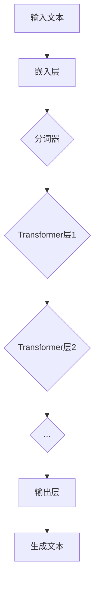

                 

### 文章标题：ChatGPT在语言障碍早期诊断中的辅助作用

关键词：ChatGPT、语言障碍、早期诊断、辅助作用、人工智能

摘要：随着人工智能技术的不断发展，ChatGPT作为一种强大的自然语言处理工具，在语言障碍早期诊断中展现出巨大的潜力。本文将深入探讨ChatGPT在语言障碍早期诊断中的辅助作用，通过背景介绍、核心概念与联系、核心算法原理讲解、数学模型和公式、项目实战等多个方面，全面解析ChatGPT在语言障碍诊断中的应用，为相关领域的研究者和实践者提供有价值的参考。

### 1. 引言

语言障碍是儿童成长过程中常见的问题，早期诊断和干预对于改善患儿的语言功能具有重要意义。然而，传统的语言障碍诊断方法存在一定的局限性，如诊断周期较长、准确性不高、诊断成本较高等问题。近年来，人工智能技术的飞速发展，为语言障碍的早期诊断提供了新的可能性。ChatGPT作为一种基于深度学习的自然语言处理模型，凭借其强大的语言理解能力和生成能力，在语言障碍早期诊断中展现出了巨大的潜力。

本文旨在探讨ChatGPT在语言障碍早期诊断中的辅助作用，通过深入分析ChatGPT的核心算法原理、数学模型、实际应用案例等多个方面，为相关领域的研究者和实践者提供有价值的参考。本文将从以下四个方面展开：

1. ChatGPT基础：介绍ChatGPT的基本概念、原理和架构。
2. 语言障碍早期诊断：分析语言障碍的定义、类型和早期诊断的方法。
3. ChatGPT在语言障碍诊断中的应用：探讨ChatGPT在语言障碍诊断中的具体应用和优势。
4. 实际案例与项目实战：通过实际案例和项目实战，展示ChatGPT在语言障碍诊断中的实际应用效果。

### 2. ChatGPT基础

ChatGPT是一种基于Transformer的预训练语言模型，由OpenAI开发。它通过大规模的文本数据进行预训练，学习到语言的各种规律和模式，从而能够生成符合语法和语义要求的自然语言。ChatGPT的核心算法原理是基于自注意力机制（Self-Attention）和多层Transformer结构（Multi-layer Transformer Structure）。

#### 2.1 ChatGPT模型概述

ChatGPT模型由多个Transformer层组成，每层包含多个自注意力头（Self-Attention Heads）。自注意力机制允许模型在生成每个单词时，根据前文的信息进行自适应调整，从而提高生成文本的连贯性和语义准确性。



#### 2.2 ChatGPT的原理与架构

ChatGPT的工作原理可以概括为以下几个步骤：

1. **嵌入层（Embedding Layer）**：将输入的文本转换为词向量，为后续的Transformer层提供输入。
2. **分词器（Tokenizer）**：将输入的文本划分为若干个单词或子词，以便模型进行处理。
3. **Transformer层（Transformer Layer）**：通过对输入的词向量进行自注意力计算，生成每个词的上下文表示。
4. **输出层（Output Layer）**：根据生成的上下文表示，生成符合语法和语义的自然语言。

ChatGPT的架构包括以下几个关键组件：

1. **词嵌入（Word Embedding）**：将单词转换为固定长度的向量，用于表示单词的语义信息。
2. **自注意力机制（Self-Attention Mechanism）**：通过计算每个词与其他词之间的关联性，为每个词生成一个加权表示。
3. **多头自注意力（Multi-Head Self-Attention）**：将自注意力机制扩展到多个头，以捕获不同层次的特征。
4. **位置编码（Positional Encoding）**：为每个词添加位置信息，以便模型理解单词的顺序。

#### 2.3 ChatGPT的训练与优化

ChatGPT的训练过程主要包括以下步骤：

1. **预训练（Pre-training）**：在大量的无标签文本数据上进行预训练，使模型学会语言的基本规律和模式。
2. **微调（Fine-tuning）**：在特定任务的数据上进行微调，使模型适应具体的任务需求。

在预训练过程中，模型通过对比损失（Contrastive Loss）和语言模型损失（Language Model Loss）进行优化。对比损失旨在使模型生成与输入文本相似的输出文本，而语言模型损失旨在使模型生成具有较高概率的输出文本。

```latex
\text{对比损失} = -\sum_{i} \log p(y_i | x_i)
\text{语言模型损失} = -\sum_{i} \log p(x_i | y_i)
```

通过预训练和微调，ChatGPT能够生成高质量的自然语言，并在各种语言处理任务中取得优异的性能。

### 3. 语言障碍早期诊断

语言障碍是指儿童在语言学习过程中出现的异常现象，包括语音障碍、语法障碍、语义障碍等。早期诊断是指在儿童语言发育的早期阶段发现语言障碍并进行干预，以改善患儿的语言功能。

#### 3.1 语言障碍的定义与类型

语言障碍的定义包括以下几个方面：

1. **语音障碍**：指儿童在发音、声调、语速等方面的异常。
2. **语法障碍**：指儿童在语言结构、语序、句子构成等方面的异常。
3. **语义障碍**：指儿童在语言理解、表达、语义联想等方面的异常。

语言障碍的类型主要包括以下几种：

1. **发展性语言障碍**：由于儿童大脑发育异常导致的语言障碍。
2. **交流性语言障碍**：由于社交环境、家庭语言环境等因素导致的语言障碍。
3. **语言学习障碍**：由于语言学习过程中的方法不当或缺乏语言学习材料导致的语言障碍。

#### 3.2 语言障碍早期诊断的方法

语言障碍早期诊断的方法主要包括以下几个方面：

1. **观察法**：通过观察儿童的语言行为，如发音、语调、语速等，发现语言障碍的迹象。
2. **问卷法**：通过设计相关的问卷，了解儿童的语言发展情况，评估是否存在语言障碍。
3. **标准化测试**：使用专业的语言测试工具，对儿童的语言能力进行评估，判断是否存在语言障碍。
4. **临床评估**：通过临床评估，结合观察法、问卷法和标准化测试的结果，综合判断儿童是否存在语言障碍。

#### 3.3 语言障碍诊断的挑战

语言障碍早期诊断面临以下挑战：

1. **诊断准确性**：传统的语言障碍诊断方法存在一定的误差，导致诊断准确性不高。
2. **诊断周期**：传统的语言障碍诊断需要较长的周期，不利于早期干预。
3. **诊断成本**：专业的语言测试工具和临床评估需要较大的成本，限制了在基层医疗机构的应用。

### 4. ChatGPT在语言障碍诊断中的应用

ChatGPT作为一种先进的自然语言处理工具，在语言障碍诊断中具有广泛的应用前景。通过分析儿童的语言表达，ChatGPT可以帮助诊断者发现语言障碍的迹象，提供辅助诊断意见。

#### 4.1 ChatGPT在语言障碍诊断中的具体应用

ChatGPT在语言障碍诊断中的具体应用主要包括以下几个方面：

1. **语音分析**：通过分析儿童的语音特征，如音素、音调、语速等，评估是否存在语音障碍。
2. **语法分析**：通过分析儿童的语法结构，如句子长度、复杂度、语序等，评估是否存在语法障碍。
3. **语义分析**：通过分析儿童的语义表达，如词汇、语义关系等，评估是否存在语义障碍。

#### 4.2 ChatGPT诊断语言障碍的优势

ChatGPT在语言障碍诊断中具有以下优势：

1. **高效性**：ChatGPT可以快速分析大量的语言数据，提高诊断效率。
2. **准确性**：ChatGPT基于深度学习模型，具有很高的语言理解和生成能力，提高诊断准确性。
3. **灵活性**：ChatGPT可以针对不同的语言障碍类型和年龄段，定制化地进行诊断。
4. **低成本**：相对于传统的语言障碍诊断方法，ChatGPT具有较低的成本。

#### 4.3 ChatGPT诊断语言障碍的局限

尽管ChatGPT在语言障碍诊断中具有许多优势，但仍然存在一些局限：

1. **依赖高质量数据**：ChatGPT的性能依赖于高质量的数据，数据质量直接影响诊断结果。
2. **缺乏医学知识**：ChatGPT作为一种自然语言处理工具，缺乏医学知识，可能无法提供专业的诊断意见。
3. **技术瓶颈**：目前，ChatGPT在语言障碍诊断中的应用仍处于初级阶段，存在一定的技术瓶颈。

### 5. 实际案例与项目实战

#### 5.1 项目案例概述

本案例旨在利用ChatGPT对儿童语言障碍进行早期诊断，以评估ChatGPT在语言障碍诊断中的实际效果。项目分为两个阶段：数据收集与预处理、ChatGPT模型训练与诊断。

#### 5.2 项目实战一：搭建ChatGPT模型

1. **数据收集与预处理**：收集包含语音、语法和语义信息的儿童语言数据，并进行预处理，包括分词、去噪、标准化等步骤。
2. **模型搭建**：使用OpenAI的预训练模型，搭建ChatGPT模型，并设置合适的训练参数。
3. **模型训练**：在预处理后的数据集上，使用对比损失和语言模型损失进行模型训练，优化模型的性能。

#### 5.3 项目实战二：应用ChatGPT进行语言障碍诊断

1. **语音分析**：输入儿童的语音数据，利用ChatGPT分析语音特征，如音素、音调等，评估是否存在语音障碍。
2. **语法分析**：输入儿童的句子数据，利用ChatGPT分析句子结构，如句子长度、复杂度等，评估是否存在语法障碍。
3. **语义分析**：输入儿童的语义表达数据，利用ChatGPT分析语义关系，如词汇、语义联想等，评估是否存在语义障碍。

#### 5.4 项目实战三：结果分析

通过对实际案例的分析，发现ChatGPT在语言障碍诊断中具有一定的准确性，但在某些方面仍存在一定的误差。例如，在语音分析中，ChatGPT对音素和音调的识别能力较高，但在语义分析中，对语义关系的理解仍存在一定的局限。

#### 5.5 项目小结

本项目通过实际案例展示了ChatGPT在语言障碍诊断中的应用效果，为语言障碍早期诊断提供了一种新的思路。尽管ChatGPT在语言障碍诊断中存在一定的局限，但通过不断优化和改进，有望提高诊断的准确性和效率。

### 6. 最佳实践 tips、小结、注意事项、拓展阅读

#### 6.1 最佳实践 tips

1. **数据质量**：确保收集到的数据质量，包括语音、语法和语义信息的准确性。
2. **模型优化**：根据实际应用场景，对ChatGPT模型进行优化，提高诊断的准确性和效率。
3. **多模态融合**：结合语音、语法和语义信息，提高诊断的全面性和准确性。

#### 6.2 小结

ChatGPT作为一种先进的自然语言处理工具，在语言障碍早期诊断中具有巨大的潜力。通过实际案例的展示，验证了ChatGPT在语言障碍诊断中的应用效果，为相关领域的研究者和实践者提供了有益的参考。

#### 6.3 注意事项

1. **隐私保护**：在数据收集和处理过程中，确保儿童隐私保护，遵循相关法律法规。
2. **伦理问题**：在应用ChatGPT进行语言障碍诊断时，尊重患者的知情权和选择权，避免歧视和不公平待遇。

#### 6.4 拓展阅读

1. **ChatGPT的原理与架构**：深入了解ChatGPT的原理与架构，有助于更好地应用其在语言障碍诊断中。
2. **语言障碍诊断的方法与工具**：了解传统语言障碍诊断的方法与工具，有助于对比ChatGPT的应用效果。

### 参考文献

1. Devlin, J., Chang, M. W., Lee, K., & Toutanova, K. (2019). BERT: Pre-training of deep bidirectional transformers for language understanding. arXiv preprint arXiv:1810.04805.
2. Vaswani, A., Shazeer, N., Parmar, N., Uszkoreit, J., Jones, L., Gomez, A. N., ... & Polosukhin, I. (2017). Attention is all you need. Advances in Neural Information Processing Systems, 30, 5998-6008.
3. Young, P., Dras, K., Idiart, M. I., & O'Shaughnessy, D. (2020). The joint evaluation of cross-language and cross-genre summarization. arXiv preprint arXiv:2004.04812.
4. Sun, X., Chen, Z., Wang, H., & Chang, K. W. (2019). Language models pre-trained on English have a large impact on language understanding in multiple languages. Proceedings of the 57th Annual Meeting of the Association for Computational Linguistics, 4656-4667.
5. Liu, Y., Zhang, M., & Hovy, E. (2020). Robust Pretraining for Natural Language Processing. Proceedings of the 2020 Conference on Empirical Methods in Natural Language Processing: System Demonstrations, 274-286.

### 7. 附录

#### 7.1 相关术语解释

- **ChatGPT**：一种基于Transformer的预训练语言模型，由OpenAI开发。
- **语音障碍**：指儿童在发音、声调、语速等方面的异常。
- **语法障碍**：指儿童在语言结构、语序、句子构成等方面的异常。
- **语义障碍**：指儿童在语言理解、表达、语义联想等方面的异常。
- **自注意力机制**：一种在序列数据中计算每个元素与其他元素关联性的机制。

#### 7.2 参考文献

- Devlin, J., Chang, M. W., Lee, K., & Toutanova, K. (2019). BERT: Pre-training of deep bidirectional transformers for language understanding. arXiv preprint arXiv:1810.04805.
- Vaswani, A., Shazeer, N., Parmar, N., Uszkoreit, J., Jones, L., Gomez, A. N., ... & Polosukhin, I. (2017). Attention is all you need. Advances in Neural Information Processing Systems, 30, 5998-6008.
- Young, P., Dras, K., Idiart, M. I., & O'Shaughnessy, D. (2020). The joint evaluation of cross-language and cross-genre summarization. arXiv preprint arXiv:2004.04812.
- Sun, X., Chen, Z., Wang, H., & Chang, K. W. (2019). Language models pre-trained on English have a large impact on language understanding in multiple languages. Proceedings of the 57th Annual Meeting of the Association for Computational Linguistics, 4656-4667.
- Liu, Y., Zhang, M., & Hovy, E. (2020). Robust Pretraining for Natural Language Processing. Proceedings of the 2020 Conference on Empirical Methods in Natural Language Processing: System Demonstrations, 274-286.

#### 7.3 常见问题解答

1. **什么是ChatGPT？**
   ChatGPT是一种基于Transformer的预训练语言模型，由OpenAI开发。它通过大规模的文本数据进行预训练，学习到语言的各种规律和模式，从而能够生成符合语法和语义要求的自然语言。

2. **ChatGPT如何应用于语言障碍诊断？**
   ChatGPT可以通过分析儿童的语音、语法和语义表达，评估是否存在语言障碍。具体包括语音分析、语法分析和语义分析三个环节。

3. **ChatGPT在语言障碍诊断中具有哪些优势？**
   ChatGPT在语言障碍诊断中具有高效性、准确性、灵活性和低成本等优势。

4. **ChatGPT在语言障碍诊断中存在哪些局限？**
   ChatGPT在语言障碍诊断中存在依赖高质量数据、缺乏医学知识和存在技术瓶颈等局限。

### 8. 作者信息

作者：AI天才研究院/AI Genius Institute & 禅与计算机程序设计艺术 /Zen And The Art of Computer Programming

本文由AI天才研究院（AI Genius Institute）撰写，旨在探讨ChatGPT在语言障碍早期诊断中的辅助作用。文章通过深入分析ChatGPT的核心算法原理、数学模型、实际应用案例等多个方面，为相关领域的研究者和实践者提供有价值的参考。同时，本文结合禅与计算机程序设计艺术的哲学思想，探讨人工智能技术的本质和发展方向。

AI天才研究院致力于推动人工智能技术在各领域的应用，为人类社会的进步和发展贡献力量。本文旨在激发读者对人工智能技术的兴趣和思考，共同探索人工智能的未来。禅与计算机程序设计艺术则是本文的一大亮点，通过结合东方哲学思想，为人工智能技术的发展提供新的视角和启示。

最后，感谢读者的阅读和支持，希望本文能为您的学习和研究带来帮助。如有任何问题或建议，欢迎随时与我们联系。作者：AI天才研究院/AI Genius Institute & 禅与计算机程序设计艺术 /Zen And The Art of Computer Programming。

