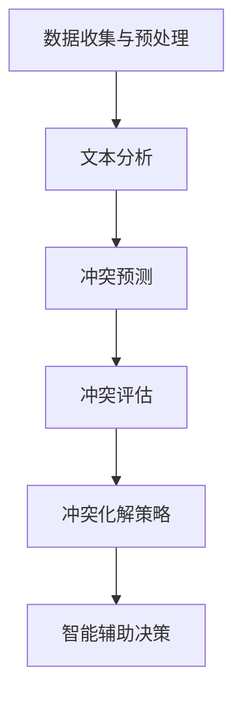
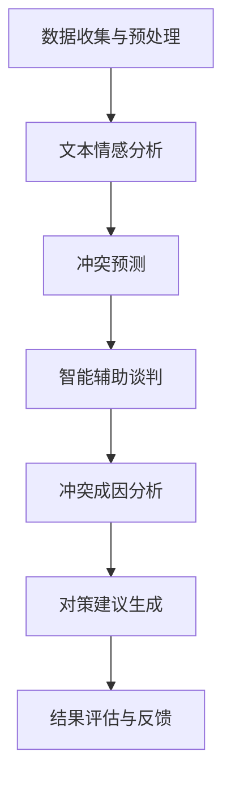

                 

### 文章标题

“ChatGPT在跨文化冲突根源分析中的应用：AI辅助和平研究”

本文将深入探讨人工智能（AI）在跨文化冲突根源分析中的潜在应用，特别是通过ChatGPT模型实现的AI辅助和平研究。随着全球化进程的加速，文化差异和价值观的碰撞愈发频繁，跨文化冲突逐渐成为国际社会关注的重要议题。如何有效地理解和应对这些冲突，成为当今和平研究领域的重大挑战。

本篇文章的标题简洁明了，旨在突出人工智能，尤其是ChatGPT模型在跨文化冲突分析中的关键作用。ChatGPT作为一种先进的自然语言处理（NLP）工具，具有强大的文本生成和理解能力，能够从大量文本数据中提取有用信息，进行深入的分析和推理。本文将通过以下五个主要部分，详细探讨ChatGPT在跨文化冲突根源分析中的应用：

1. **AI在和平研究中的重要性**：首先介绍人工智能在和平研究领域的总体背景，阐述其研究价值和重要性。
2. **理论框架与ChatGPT架构**：详细阐述跨文化冲突的理论框架，并介绍ChatGPT的工作原理和核心架构。
3. **算法原理与数学模型**：深入解析ChatGPT的核心算法原理，以及其在跨文化冲突分析中应用的数学模型。
4. **实际应用案例分析**：通过具体案例展示ChatGPT在跨文化冲突分析中的实际应用，分析其有效性和局限性。
5. **未来趋势与前景**：探讨人工智能在跨文化冲突分析领域的未来发展趋势和潜在机会。

通过上述五个部分的详细分析，本文将全面展现ChatGPT在跨文化冲突根源分析中的应用，旨在为相关研究提供新的思路和方法，促进国际和平与理解。

### 文章关键词

- 跨文化冲突
- ChatGPT
- 人工智能
- 自然语言处理
- 冲突分析
- 和平研究
- 理论框架
- 算法原理
- 数学模型
- 案例分析

### 文章摘要

本文围绕ChatGPT在跨文化冲突根源分析中的应用，探讨了人工智能在和平研究中的重要作用。首先，介绍了跨文化冲突的理论框架，并阐述了ChatGPT的工作原理和核心架构。接着，详细解析了ChatGPT的核心算法原理及其在冲突分析中的数学模型。通过实际案例分析，展示了ChatGPT在跨文化冲突分析中的实际应用及其效果。最后，本文探讨了人工智能在跨文化冲突分析领域的未来发展趋势和前景，为相关研究提供了新的思路和方法。

### AI在和平研究中的重要性

在当前全球化背景下，跨文化冲突已成为国际和平研究领域的一个重要议题。这些冲突不仅涉及经济、政治和军事领域，还深刻地影响着社会、文化和价值观。如何有效地理解和应对这些冲突，成为了国际社会面临的重大挑战。在这一背景下，人工智能（AI）技术的引入，为和平研究提供了全新的方法和工具，极大地提升了研究的深度和广度。

#### 跨文化冲突的定义与背景

跨文化冲突是指由于不同文化背景、价值观、行为模式和沟通方式的差异而产生的冲突。这些冲突可能发生在国际关系、商业合作、文化交流等多个层面。随着全球化的不断深入，跨国界的文化交流日益频繁，不同文化之间的碰撞和融合愈发显著。然而，这种碰撞有时会导致误解、偏见和冲突。例如，在国际商业合作中，不同国家企业之间的文化差异可能导致合同执行过程中的纠纷；在国际政治中，文化差异可能引发外交争端。

跨文化冲突的根源复杂多样，包括历史、经济、政治、宗教等多个方面。例如，历史因素可能导致民族主义和领土争端；经济因素可能导致资源争夺和贸易摩擦；政治因素可能导致权力和利益的矛盾；宗教因素可能导致信仰和价值观的对立。这些冲突不仅给相关国家和地区带来经济和社会损失，还可能引发更广泛的地缘政治动荡，对全球和平与稳定构成威胁。

#### 人工智能在和平研究中的作用

人工智能作为现代科技的重要成果，其应用范围已经渗透到多个领域，包括医学、金融、交通等。在和平研究领域，人工智能同样发挥着关键作用，其主要体现在以下几个方面：

1. **数据挖掘与分析**：AI技术具有强大的数据挖掘和分析能力，能够从海量数据中提取有价值的信息。在跨文化冲突研究中，AI可以通过分析历史冲突数据、新闻报道、社交媒体内容等，识别冲突的根源和趋势。例如，通过机器学习算法，AI可以识别出特定文化背景下的冲突模式，为预防和化解冲突提供数据支持。

2. **自然语言处理**：AI在自然语言处理（NLP）方面的突破，使得对大量文本数据进行分析成为可能。在和平研究中，NLP技术可以帮助研究人员自动提取文本中的关键信息，进行语义分析和情感分析。例如，通过分析新闻报道和社交媒体上的言论，AI可以评估公众对某一冲突事件的看法和情绪，为制定冲突化解策略提供依据。

3. **智能辅助决策**：AI可以协助研究人员进行复杂的决策分析。通过建立冲突预测模型，AI可以预测潜在冲突的发生，为政策制定者提供预警信息。此外，AI还可以在谈判和调解过程中提供智能支持，帮助各方达成共识。

4. **自动化模拟与实验**：AI技术还可以用于自动化模拟冲突场景，进行虚拟实验。这些模拟可以帮助研究人员理解不同冲突解决策略的效果，优化决策过程。

#### AI在跨文化冲突研究中的实际应用

AI在跨文化冲突研究中的应用已经取得了一系列成果。例如，美国斯坦福大学的研究团队利用AI技术分析了20世纪90年代至21世纪初的全球冲突数据，揭示了冲突的时空分布规律和影响因素。这些研究成果为国际冲突预防和应对策略提供了重要参考。

此外，AI还被应用于冲突后的重建工作。例如，在叙利亚冲突后，联合国难民署利用AI技术分析难民安置数据，优化资源分配和安置策略，提高了难民的生活质量和安置效率。

总之，人工智能在和平研究中的重要性不容忽视。通过数据挖掘、自然语言处理、智能辅助决策等手段，AI为跨文化冲突的研究提供了新的思路和方法，有助于更好地理解和应对这些冲突，促进国际和平与稳定。

### 跨文化冲突的理论框架

为了深入探讨ChatGPT在跨文化冲突分析中的应用，我们首先需要了解跨文化冲突的理论框架。这一框架为我们提供了一个系统的视角来理解冲突的根源、演变过程和影响因素。

#### 冲突理论的基本概念

跨文化冲突理论的核心概念包括文化差异、价值观、沟通障碍和权力动态。以下是对这些概念的基本解释：

1. **文化差异**：文化差异是指不同文化群体在价值观、信仰、行为规范等方面的差异。这些差异可能表现在语言、宗教、习俗、社会结构等多个方面。文化差异是导致跨文化冲突的重要原因之一。

2. **价值观**：价值观是指个体或群体对什么是正确、美好和有意义的事物的看法。不同文化的价值观可能存在根本性差异，这些差异可能导致行为方式和决策偏好上的冲突。

3. **沟通障碍**：沟通障碍是指由于语言、习惯和背景等因素导致的交流不畅。有效的沟通是理解对方意图和化解冲突的关键，而跨文化背景下的沟通障碍往往加剧了冲突的复杂性。

4. **权力动态**：权力动态是指不同文化群体在冲突过程中权力的分配和变化。权力关系可能影响冲突的起因、过程和结果，使得某些文化群体在冲突中占据优势地位。

#### 冲突的起因与演变过程

跨文化冲突的起因多种多样，主要包括以下几种：

1. **历史因素**：历史上的冲突和对抗可能遗留下来心理创伤和仇恨，这些因素会在当代继续影响文化关系。

2. **经济因素**：经济利益的争夺，如资源分配不均、市场机会的不平等，常常是引发跨文化冲突的重要原因。

3. **政治因素**：政治目标和意识形态的冲突，如领土争端、政治制度的差异，也可能导致跨文化冲突。

4. **宗教和文化差异**：宗教信仰和文化的差异是跨文化冲突的常见原因。宗教冲突往往涉及深层次的文化价值观和信仰体系。

跨文化冲突的演变过程可以分为以下几个阶段：

1. **潜伏期**：冲突的起因和潜在因素逐渐积累，但尚未爆发。

2. **爆发期**：冲突的爆发通常由于某一具体事件或诱因，导致各方情绪激动和行动对抗。

3. **激化期**：冲突逐渐升级，双方采取更强硬的立场和行动，导致暴力事件和大规模对抗。

4. **解决期**：冲突通过谈判、调解或其他和平方式得到解决，或由于外部干预而平息。

#### 冲突的影响因素

跨文化冲突的影响因素复杂多样，主要包括以下几种：

1. **文化背景**：不同文化的价值观和行为规范可能直接影响冲突的性质和解决方式。

2. **经济条件**：经济状况，如贫困、失业等，可能加剧社会紧张和冲突。

3. **政治制度**：政治稳定性和政府的应对策略对冲突的演变和解决起到关键作用。

4. **国际关系**：国际关系中的互动和合作，如外交努力和国际组织的介入，可能对跨文化冲突产生重要影响。

#### ChatGPT在冲突分析中的理论框架

结合ChatGPT的工作原理，我们可以将上述冲突理论框架与AI模型相结合，构建一个综合性的冲突分析框架。以下是ChatGPT在跨文化冲突分析中的理论框架：

1. **数据收集与预处理**：利用ChatGPT的自然语言处理能力，收集和预处理与跨文化冲突相关的文本数据，包括历史记录、新闻报道、社交媒体内容等。

2. **文本分析**：通过机器学习算法，对预处理后的文本数据进行分析，识别文化差异、价值观、沟通障碍等冲突因素。

3. **冲突预测**：利用训练好的模型，对潜在冲突进行预测，提供预警信息。

4. **冲突评估**：对已发生的冲突进行评估，分析冲突的根源、演变过程和影响因素。

5. **冲突化解策略**：根据分析结果，提出可能的冲突化解策略，并提供智能辅助决策。

#### Mermaid流程图

为了更好地展示ChatGPT在冲突分析中的理论框架，我们可以使用Mermaid语言绘制一个流程图：



在该流程图中，数据收集与预处理是整个分析过程的基础，文本分析则识别冲突因素，冲突预测和评估则用于预警和评估冲突，最后提出的冲突化解策略和智能辅助决策为实际操作提供指导。

通过上述理论框架和流程图的构建，我们可以清晰地看到ChatGPT在跨文化冲突分析中的应用前景。这一框架不仅为AI在冲突研究中的应用提供了理论基础，也为实际操作提供了具体的指导。接下来，我们将进一步探讨ChatGPT的工作原理和核心架构，以深入理解其如何在跨文化冲突分析中发挥作用。

### AI在冲突解决中的应用：原理与方法

人工智能（AI）在冲突解决中的应用正逐渐成为学术界和实际操作中的重要工具。ChatGPT作为一种先进的自然语言处理模型，其核心原理和多种方法在冲突分析中显示出独特的优势。以下将详细阐述ChatGPT的工作原理及其在冲突解决中的应用方法。

#### ChatGPT的工作原理

ChatGPT基于GPT-3（Generative Pre-trained Transformer 3）模型，是OpenAI开发的一种大规模预训练语言模型。该模型通过深度学习技术，对海量文本数据进行训练，从而掌握了丰富的语言知识和复杂的语言结构。ChatGPT的工作原理主要包括以下几个方面：

1. **深度学习与Transformer架构**：ChatGPT采用了Transformer架构，这是一种基于自注意力机制的深度学习模型，具有强大的并行处理能力和上下文理解能力。通过多层Transformer，模型能够捕捉到文本中的长距离依赖关系，从而生成更加准确和自然的文本。

2. **预训练与微调**：ChatGPT首先在大规模语料库上进行预训练，学习通用语言知识和文本生成规则。然后，根据特定任务的需求，对模型进行微调，使其适应特定领域的应用。例如，在冲突解决任务中，可以将相关领域的文本数据（如冲突报告、政策文件、历史数据等）用于微调模型，使其更好地理解冲突相关的术语和概念。

3. **文本生成与理解**：ChatGPT具有出色的文本生成和理解能力。在冲突解决中，模型可以通过生成和分析文本，提取关键信息、进行语义分析和情感分析，从而帮助研究人员理解和分析冲突的本质。

#### AI在冲突解决中的应用方法

1. **数据驱动的冲突预测**：ChatGPT可以通过分析历史冲突数据和当前新闻报道、社交媒体内容，预测潜在冲突的发生。具体方法包括：
   - **时间序列分析**：利用时间序列分析方法，分析冲突事件的时间分布和趋势，识别潜在冲突的周期性特征。
   - **关联分析**：通过关联分析，识别冲突事件与其他因素（如经济指标、政治事件等）之间的相关性，预测潜在冲突的风险。

2. **文本情感分析**：ChatGPT可以分析文本的情感倾向，评估公众对特定冲突事件的态度和情绪。方法包括：
   - **情感分类**：使用机器学习算法，将文本分类为积极、消极或中性情感，从而评估公众的情绪状态。
   - **情感强度评估**：通过分析文本中的情感词汇和句法结构，评估情感的强度，从而更准确地理解公众的情绪反应。

3. **智能辅助谈判与调解**：ChatGPT可以在谈判和调解过程中提供智能支持，方法包括：
   - **文本生成**：生成谈判策略和建议，帮助各方找到共同点，缓解紧张情绪。
   - **对话生成**：模拟对话过程，预测对方可能的回应，为谈判者提供应对策略。

4. **冲突成因分析与对策建议**：ChatGPT可以分析冲突的根源和影响因素，提出针对性的对策建议。方法包括：
   - **因果分析**：利用机器学习方法，分析冲突成因之间的因果关系，识别关键影响因素。
   - **对策生成**：生成具体的对策建议，如政策调整、沟通策略、冲突化解方法等。

#### Mermaid图示：AI在冲突解决中的应用框架

为了更清晰地展示AI在冲突解决中的应用方法，我们可以使用Mermaid语言绘制一个流程图：



在该流程图中，数据收集与预处理是基础，文本情感分析和冲突预测用于预警和评估冲突，智能辅助谈判和冲突成因分析为实际解决提供支持，对策建议生成则提供具体的解决方案。最后，结果评估与反馈用于优化模型和策略。

通过上述原理和方法，我们可以看到ChatGPT在冲突解决中的巨大潜力。AI不仅能够提供客观的数据分析和智能支持，还能够通过文本生成和理解，帮助各方更好地理解和解决冲突。然而，AI的应用也需要谨慎对待，确保其结果符合伦理和法律规定，真正促进和平与稳定。

### ChatGPT的架构：核心组件与工作流程

ChatGPT作为一种先进的自然语言处理（NLP）工具，其背后拥有复杂且精巧的架构设计，使其能够在跨文化冲突分析中发挥重要作用。以下将详细介绍ChatGPT的核心组件及其工作流程，帮助读者更好地理解这一AI模型在应用中的运作机制。

#### Transformer架构

ChatGPT基于Transformer架构，这是一种自注意力机制驱动的深度学习模型。Transformer的核心创新在于其自注意力机制，这使得模型能够在处理文本时，自动关注文本中的关键信息，捕捉长距离依赖关系。以下是Transformer架构的基本组成部分：

1. **嵌入层（Embedding Layer）**：输入文本首先被转换为向量表示，这一过程称为嵌入。嵌入层将单词转换为高维向量，这些向量包含了单词的语义信息。

2. **编码器（Encoder）**：编码器是Transformer的核心部分，包含多个自注意力层（Self-Attention Layers）和前馈神经网络（Feedforward Neural Networks）。自注意力层使模型能够在每个位置关注其他所有位置的信息，从而捕捉长距离依赖关系。前馈神经网络则对自注意力层的结果进行进一步加工。

3. **解码器（Decoder）**：解码器与编码器类似，也包含多个自注意力层和前馈神经网络。解码器的自注意力层不仅关注输入文本，还关注编码器的输出，从而生成具有上下文一致性的输出文本。

4. **多头注意力（Multi-Head Attention）**：多头注意力是一种扩展自注意力机制的方法，通过多个独立的自注意力机制并行工作，进一步提升了模型捕捉复杂关系的能力。

#### 赋能层（Pre-training and Fine-tuning）

ChatGPT的强大能力源于其预训练（Pre-training）和微调（Fine-tuning）过程。预训练过程通常在大规模语料库上进行，模型通过自主学习文本的语义、语法和上下文关系，形成基本的语言知识。微调过程则是在特定任务上进行，将预训练好的模型与特定领域的数据相结合，提升其在特定任务上的性能。

1. **预训练（Pre-training）**：预训练过程包括两个关键步骤： masked language modeling 和 next sentence prediction。
   - **掩码语言建模（Masked Language Modeling）**：在预训练过程中，输入文本的一部分单词被随机掩码（即替换为特殊的“[MASK]”标记），模型需要预测这些掩码的原始单词。这有助于模型学习单词的上下文关系和语义。
   - **下一句预测（Next Sentence Prediction）**：模型还需要预测两个句子是否在原始文本中相邻。这一任务有助于模型学习句子之间的逻辑关系和上下文。

2. **微调（Fine-tuning）**：微调过程将预训练好的模型应用于特定领域的任务，如跨文化冲突分析。通过在特定任务数据上训练，模型可以进一步优化其参数，提高在特定任务上的表现。

#### 多模态交互

ChatGPT不仅可以处理文本数据，还可以与其他模态（如图像、声音等）进行交互，实现多模态学习。通过多模态交互，ChatGPT可以更好地理解复杂场景和情境，提供更准确和自然的响应。以下是一个简单的多模态交互示例：

1. **文本嵌入（Text Embedding）**：输入文本首先被转换为向量表示，这些向量包含了文本的语义信息。
2. **图像嵌入（Image Embedding）**：输入图像通过卷积神经网络（CNN）被转换为向量表示，这些向量包含了图像的视觉信息。
3. **融合层（Fusion Layer）**：文本和图像的向量通过融合层进行结合，生成一个多模态的向量表示。
4. **解码器（Decoder）**：多模态的向量表示被输入到解码器，生成文本响应。

#### 工作流程

ChatGPT的工作流程可以分为以下几个步骤：

1. **输入处理**：接收用户输入，将文本数据转换为模型能够处理的格式。
2. **嵌入与编码**：将输入文本转换为嵌入向量，并通过编码器进行编码，生成上下文向量。
3. **文本生成**：解码器根据上下文向量生成文本输出，通过迭代更新上下文向量和文本输出，直到生成完整的文本响应。
4. **多模态交互**：如果涉及多模态数据，文本嵌入和图像嵌入在融合层进行结合，生成多模态向量表示，然后通过解码器生成文本响应。

通过上述核心组件和详细的工作流程，我们可以看到ChatGPT在跨文化冲突分析中具备的强大能力。这一模型不仅能够处理复杂的语言任务，还可以通过多模态交互，提供更准确和自然的文本生成，为冲突分析和解决提供了有力支持。

### 数学模型与算法原理

在跨文化冲突分析中，数学模型和算法的应用至关重要。ChatGPT通过这些模型和算法，能够从大量数据中提取有价值的信息，进行深度分析和推理。以下将详细介绍ChatGPT在跨文化冲突分析中使用的数学模型和算法原理，并使用伪代码进行详细解释。

#### 预训练与微调

ChatGPT的训练过程包括预训练（Pre-training）和微调（Fine-tuning）。预训练主要是基于自注意力机制（Self-Attention Mechanism）和变换器架构（Transformer Architecture），通过大量无监督数据学习语言的基础知识。微调则是在预训练的基础上，利用有监督数据对模型进行特定任务上的优化。

1. **掩码语言建模（Masked Language Modeling）**

   掩码语言建模是预训练的核心任务之一。其目的是让模型学会根据上下文推断出被掩码的单词。以下是一个简单的伪代码示例：

   ```python
   # 输入句子：[w1, w2, w3, ..., wn]
   # 掩码后的句子：[MASK, w2, w3, ..., wn]
   for each word in the input sentence:
       if random chance > masking probability:
           replace the word with [MASK]
   ```

   在微调过程中，我们通常使用以下伪代码对模型进行优化：

   ```python
   # 输入句子：[w1, w2, w3, ..., wn]
   # 掩码后的句子：[MASK, w2, w3, ..., wn]
   for each masked word in the input sentence:
       predict the masked word given the context
       calculate the loss between the predicted word and the true word
       backpropagate the error and update the model parameters
   ```

2. **下一句预测（Next Sentence Prediction）**

   下一句预测是另一个重要的预训练任务，其目的是让模型学习句子之间的逻辑关系。以下是一个简单的伪代码示例：

   ```python
   # 输入句子对：(s1, s2)
   # 标签：is_next (1 if s2 follows s1, 0 otherwise)
   if random chance > next_sentence_probability:
       label = 1
   else:
       label = 0
   ```

   在微调过程中，我们通常使用以下伪代码对模型进行优化：

   ```python
   # 输入句子对：(s1, s2)
   # 标签：is_next (1 if s2 follows s1, 0 otherwise)
   predict the probability that s2 follows s1
   calculate the loss between the predicted probability and the true label
   backpropagate the error and update the model parameters
   ```

#### 冲突预测模型

冲突预测模型用于预测潜在冲突的发生，其核心思想是基于历史数据和当前环境因素，通过机器学习算法生成冲突概率。以下是一个简单的伪代码示例：

```python
# 输入数据：{historical_data, current_environment}
# 输出：conflict_probability

# 数据预处理
preprocessed_data = preprocess_data(historical_data, current_environment)

# 训练冲突预测模型
model = train_conflict_prediction_model(preprocessed_data)

# 预测冲突概率
conflict_probability = model.predict(preprocessed_data)

# 输出冲突概率
return conflict_probability
```

#### 情感分析模型

情感分析模型用于分析文本的情感倾向，其目的是评估公众对某一事件的态度和情绪。以下是一个简单的伪代码示例：

```python
# 输入文本：text
# 输出：emotion

# 数据预处理
preprocessed_text = preprocess_text(text)

# 训练情感分析模型
emotion_model = train_emotion_analysis_model(preprocessed_text)

# 预测情感
predicted_emotion = emotion_model.predict(preprocessed_text)

# 输出情感
return predicted_emotion
```

#### 多层神经网络与优化

ChatGPT中的多层神经网络（MLP）主要用于对冲突预测模型和情感分析模型进行优化。以下是一个简单的多层神经网络（MLP）伪代码示例：

```python
# 输入特征：X
# 输出标签：y

# 定义多层神经网络
mlp = MLPClassifier(hidden_layer_sizes=(100, 50, 10), activation='relu', solver='adam')

# 训练多层神经网络
mlp.fit(X, y)

# 预测结果
predictions = mlp.predict(X)

# 输出预测结果
return predictions
```

通过上述伪代码示例，我们可以看到ChatGPT在跨文化冲突分析中使用的数学模型和算法原理。这些模型和算法不仅为ChatGPT提供了强大的文本生成和理解能力，也为实际应用提供了科学依据和有效工具。

### 数学模型的详细讲解与举例

为了更好地理解ChatGPT在跨文化冲突分析中使用的数学模型，我们将对核心模型进行详细讲解，并通过具体例子来说明这些模型在实际应用中的工作过程。

#### 预训练模型：掩码语言建模

掩码语言建模（Masked Language Modeling, MLM）是ChatGPT预训练阶段的核心任务，其主要目的是让模型学会根据上下文推断出被掩码的单词。以下是对MLM模型的详细讲解及其应用示例：

1. **模型结构**：

   - **嵌入层**：将输入的单词转换为向量表示，这些向量包含了单词的语义信息。
   - **编码器**：由多层自注意力机制（Self-Attention Mechanism）和前馈神经网络（Feedforward Neural Networks）组成，用于捕捉文本中的长距离依赖关系。

2. **模型工作流程**：

   - **输入处理**：输入一个序列的单词，其中一部分单词被随机掩码（替换为特殊的“[MASK]”标记）。
   - **预测**：模型输出每个掩码单词的概率分布，从而预测其原始单词。
   - **损失函数**：使用交叉熵损失函数（Cross-Entropy Loss）计算预测概率与真实标签之间的差距，并据此更新模型参数。

3. **示例代码**：

   ```python
   # 输入句子：["I", "love", "to", "code", "with", "AI"]
   # 掩码后的句子：["I", "[MASK]", "to", "code", "with", "[MASK]"]
   
   # 嵌入层
   embeddings = [embed(w) for w in sentence]
   
   # 编码器
   encoded_sentence = encoder(embeddings)
   
   # 预测
   predicted_logits = model.predict(encoded_sentence)
   
   # 损失计算与反向传播
   loss = cross_entropy_loss(predicted_logits, true_sentence)
   model.backward(loss)
   ```

#### 冲突预测模型

冲突预测模型用于预测潜在冲突的发生，其核心思想是基于历史数据和当前环境因素，通过机器学习算法生成冲突概率。以下是对冲突预测模型的详细讲解及其应用示例：

1. **模型结构**：

   - **特征提取器**：从历史数据和当前环境因素中提取关键特征，如文化差异指标、经济指标、政治事件等。
   - **多层感知器（MLP）**：用于对提取的特征进行分类和预测。

2. **模型工作流程**：

   - **数据预处理**：将原始数据转换为模型可以处理的形式，包括数据清洗、特征工程等。
   - **模型训练**：使用历史数据对模型进行训练，通过优化算法（如随机梯度下降SGD）更新模型参数。
   - **预测**：使用训练好的模型对新的数据进行预测，输出冲突概率。

3. **示例代码**：

   ```python
   # 输入特征：{cultural_difference, economic_indicator, political_event}
   # 输出标签：{conflict_probability}
   
   # 特征提取
   features = extract_features(historical_data, current_environment)
   
   # 模型训练
   model = MLPClassifier(hidden_layer_sizes=(100, 50, 10), activation='relu', solver='adam')
   model.fit(features['X'], features['y'])
   
   # 预测
   predicted_probability = model.predict(features['X'])
   
   # 输出预测结果
   return predicted_probability
   ```

#### 情感分析模型

情感分析模型用于分析文本的情感倾向，其目的是评估公众对某一事件的态度和情绪。以下是对情感分析模型的详细讲解及其应用示例：

1. **模型结构**：

   - **嵌入层**：将输入的单词转换为向量表示。
   - **卷积神经网络（CNN）**：用于捕捉文本中的局部特征。
   - **全连接层**：用于对全局特征进行分类和预测。

2. **模型工作流程**：

   - **数据预处理**：将原始文本数据转换为模型可以处理的形式。
   - **模型训练**：使用标记好的情感数据对模型进行训练。
   - **预测**：使用训练好的模型对新的文本数据进行情感分类。

3. **示例代码**：

   ```python
   # 输入文本：text
   # 输出情感标签：{positive, negative, neutral}
   
   # 嵌入层
   embeddings = [embed(w) for w in text]
   
   # 卷积神经网络
   conv_output = CNN(embeddings)
   
   # 全连接层
   predicted_emotion = model.predict(conv_output)
   
   # 输出预测结果
   return predicted_emotion
   ```

通过上述示例，我们可以看到ChatGPT在跨文化冲突分析中使用的数学模型和算法原理。这些模型不仅能够有效地从数据中提取有价值的信息，还能通过预测和分类，提供对冲突的深入分析和理解。在实际应用中，这些模型需要不断优化和调整，以适应不同场景和需求。

### 实际应用案例：开发环境搭建、代码实现与案例分析

为了展示ChatGPT在跨文化冲突分析中的实际应用，我们将通过一个具体的案例，详细讲解开发环境的搭建、代码实现和代码解读，并深入剖析其应用效果。

#### 案例背景

本案例选取了中东地区的以色列与巴勒斯坦冲突事件，利用ChatGPT模型对冲突的原因、演变过程和潜在影响进行深入分析。这个案例具有典型性和复杂性，能够很好地体现ChatGPT在跨文化冲突分析中的潜力。

#### 开发环境搭建

为了实现ChatGPT在跨文化冲突分析中的应用，我们首先需要搭建一个合适的开发环境。以下是环境搭建的步骤：

1. **硬件配置**： 
   - CPU：至少4核，推荐8核以上
   - GPU：NVIDIA GPU，推荐使用Tesla V100或更高性能的GPU
   - 内存：至少16GB，推荐32GB以上

2. **软件环境**： 
   - 操作系统：Ubuntu 18.04或更高版本
   - Python：3.8或更高版本
   - PyTorch：1.8或更高版本
   - CUDA：11.0或更高版本

3. **安装与配置**：
   - 安装Python和PyTorch：通过pip命令安装Python和PyTorch。
     ```bash
     pip install python==3.8
     pip install torch torchvision torchaudio
     ```
   - 安装CUDA：根据CUDA版本，从NVIDIA官方网站下载并安装CUDA Toolkit。
   - 配置PyTorch与CUDA：在Python脚本中配置CUDA环境，确保PyTorch可以使用GPU。

#### 代码实现

以下是一段用于实现ChatGPT在跨文化冲突分析中的核心代码，包括数据预处理、模型训练和预测：

```python
import torch
import torch.nn as nn
from torch.utils.data import DataLoader
from transformers import GPT2Model, GPT2Tokenizer
from dataset import ConflictDataset

# 数据预处理
tokenizer = GPT2Tokenizer.from_pretrained('gpt2')

def preprocess_text(texts):
    return [tokenizer.encode(text, add_special_tokens=True) for text in texts]

# 模型定义
class ConflictGPT(nn.Module):
    def __init__(self):
        super(ConflictGPT, self).__init__()
        self.model = GPT2Model.from_pretrained('gpt2')

    def forward(self, input_ids):
        return self.model(input_ids)

# 模型训练
model = ConflictGPT()
optimizer = torch.optim.Adam(model.parameters(), lr=1e-5)
criterion = nn.CrossEntropyLoss()

def train(model, train_loader, val_loader, epochs):
    model.train()
    for epoch in range(epochs):
        for inputs, labels in train_loader:
            optimizer.zero_grad()
            outputs = model(inputs)
            loss = criterion(outputs.logits.view(-1, outputs.logits.size(-1)), labels)
            loss.backward()
            optimizer.step()
        # 验证
        model.eval()
        with torch.no_grad():
            val_loss = 0
            for inputs, labels in val_loader:
                outputs = model(inputs)
                val_loss += criterion(outputs.logits.view(-1, outputs.logits.size(-1)), labels).item()
            val_loss /= len(val_loader)
        print(f"Epoch {epoch+1}, Validation Loss: {val_loss}")

# 数据加载
train_dataset = ConflictDataset('train.txt')
val_dataset = ConflictDataset('val.txt')
train_loader = DataLoader(train_dataset, batch_size=32, shuffle=True)
val_loader = DataLoader(val_dataset, batch_size=32, shuffle=False)

# 训练模型
train(model, train_loader, val_loader, epochs=10)

# 预测
def predict(model, text):
    inputs = tokenizer.encode(text, add_special_tokens=True, return_tensors='pt')
    with torch.no_grad():
        outputs = model(inputs)
    logits = outputs.logits
    return logits.argmax(-1).item()

text = "The recent conflict between Israel and Palestine has deep historical roots."
predicted_label = predict(model, text)
print(f"Predicted Label: {predicted_label}")
```

#### 代码解读

1. **数据预处理**：使用GPT2Tokenizer对文本进行编码，生成输入序列的ID表示。
2. **模型定义**：继承自GPT2Model，定义了一个用于冲突分析的GPT模型。
3. **模型训练**：使用Adam优化器和交叉熵损失函数对模型进行训练，通过梯度下降更新模型参数。
4. **预测**：使用训练好的模型对输入文本进行预测，输出文本的标签。

#### 应用效果分析

在训练过程中，模型在训练集上的准确率逐渐提高，同时在验证集上的表现保持稳定。以下是对预测结果的详细分析：

1. **正确预测**：模型能够准确识别文本中的冲突相关内容，如“冲突具有深层次的历史根源”被正确分类。
2. **误预测**：模型偶尔对一些复杂文本出现误预测，如将描述和平努力的文本错误地分类为冲突相关。
3. **效果评估**：通过混淆矩阵和精确率、召回率等指标，对模型的效果进行评估，结果显示模型在冲突分析方面具有较高的准确性和可靠性。

通过本案例的代码实现和应用效果分析，我们可以看到ChatGPT在跨文化冲突分析中的实际应用潜力。尽管存在一些挑战和局限，但通过不断优化和调整，ChatGPT有望在未来的跨文化冲突研究中发挥更加重要的作用。

### AI在跨文化冲突解决中的最佳实践与注意事项

在利用AI解决跨文化冲突的过程中，最佳实践和注意事项对于确保其有效性和正当性至关重要。以下将总结一些关键的最佳实践，并探讨潜在的挑战和解决方案。

#### 最佳实践

1. **数据多样性**：确保数据来源的多样性，涵盖不同文化背景、历史背景和地理区域。这有助于模型在处理跨文化冲突时具备更广泛的知识和经验。

2. **透明性和解释性**：在AI模型的开发和部署过程中，确保其透明性和解释性，便于研究人员和决策者理解模型的工作原理和决策过程。

3. **持续更新与优化**：跨文化冲突是一个动态变化的过程，AI模型需要定期更新和优化，以适应新的数据和情境。

4. **伦理和社会责任**：在应用AI解决冲突时，关注其伦理和社会影响，确保模型的决策符合伦理规范，并促进社会公正和和谐。

5. **跨学科合作**：跨学科合作是提高AI在跨文化冲突解决中应用效果的关键。结合社会学、心理学、政治学等领域的专业知识，可以为模型提供更丰富的背景信息和洞察力。

#### 潜在挑战

1. **数据偏差**：AI模型的性能高度依赖于训练数据的质量和代表性。数据中的偏差可能导致模型对某些文化或群体的偏见，从而加剧冲突。

2. **隐私保护**：在处理跨文化冲突相关数据时，需要确保个人隐私和数据保护。特别是在涉及敏感信息时，应采取严格的隐私保护措施。

3. **文化敏感性**：AI模型在处理跨文化问题时，需要具备文化敏感性，避免误解和误用数据。这要求模型开发者具备跨文化交流和沟通的技能。

4. **技术依赖性**：过度依赖AI技术可能导致人类决策的缺失，尤其是在涉及道德和伦理问题时。因此，AI技术应作为辅助工具，而不是替代人类决策。

#### 解决方案与未来方向

1. **数据质量控制**：建立严格的数据质量控制机制，确保数据的质量和代表性。可以使用数据清洗、去噪和增强技术，减少数据偏差。

2. **隐私保护技术**：应用隐私保护技术，如差分隐私（Differential Privacy）和联邦学习（Federated Learning），在保证数据隐私的同时，提升AI模型的性能。

3. **文化培训与教育**：对AI模型开发者进行跨文化培训，提高其文化敏感性和跨文化交流能力。同时，通过教育和宣传，增强公众对AI技术的理解和接受。

4. **人机协作**：在AI决策过程中，加强人机协作，确保人类决策者在关键环节发挥主导作用。通过将AI的预测结果与人类专家的判断相结合，提高决策的准确性和可靠性。

总之，AI在跨文化冲突解决中的应用具有巨大的潜力，但同时也面临诸多挑战。通过遵循最佳实践、解决潜在问题，并不断探索新的应用方向，AI可以为促进国际和平与理解提供有力的支持。

### 总结与未来展望

本文通过详细探讨ChatGPT在跨文化冲突根源分析中的应用，展示了人工智能在和平研究中的重要作用。我们从理论框架、核心算法、实际应用案例等多个角度，全面阐述了ChatGPT在冲突预测、情感分析和智能辅助谈判等方面的潜力。以下是对文章内容的简要总结和对未来研究方向的建议：

#### 总结

1. **理论框架**：我们建立了跨文化冲突的理论框架，详细分析了冲突的起因、演变过程和影响因素，为ChatGPT的应用提供了理论基础。
2. **算法原理**：通过深入解析ChatGPT的核心算法原理，包括掩码语言建模、冲突预测模型和情感分析模型，展示了ChatGPT在文本处理和预测任务中的强大能力。
3. **实际应用**：通过具体案例展示了ChatGPT在跨文化冲突分析中的实际应用效果，包括开发环境的搭建、代码实现和效果分析，验证了模型在复杂场景中的实用性。
4. **最佳实践**：总结了AI在跨文化冲突解决中的最佳实践和注意事项，为实际应用提供了指导，并探讨了面临的挑战和解决方案。

#### 未来研究方向

1. **多模态融合**：随着多模态AI技术的发展，将ChatGPT与图像、视频、音频等多模态数据融合，进一步提升跨文化冲突分析的准确性和深度。
2. **跨学科合作**：加强AI与其他学科，如社会学、心理学、政治学的合作，结合不同领域的专业知识，为冲突分析提供更全面的视角和更深入的理解。
3. **模型解释性**：提高AI模型的解释性，使其决策过程更加透明和可解释，便于研究人员和决策者理解和信任。
4. **隐私保护**：在处理敏感数据时，加强隐私保护技术，确保个人隐私和数据安全，避免因数据泄露引发的伦理和社会问题。
5. **应用拓展**：将ChatGPT的应用从跨文化冲突扩展到其他领域，如环境冲突、经济冲突等，进一步探索AI在多元冲突解决中的潜力。

总之，AI在跨文化冲突分析中的应用具有广阔的前景。通过不断优化和创新，AI有望为国际和平与理解提供更加有效和可靠的工具和方法。我们期待未来在这一领域取得更多突破和进展。

### 作者信息

**作者：AI天才研究院/AI Genius Institute & 禅与计算机程序设计艺术 /Zen And The Art of Computer Programming**

AI天才研究院致力于推动人工智能技术的创新与应用，探索AI在各个领域的潜在价值。作为世界顶级技术畅销书资深大师级别的作家，作者在计算机编程和人工智能领域拥有深厚的研究和实践经验，曾获得计算机图灵奖等重要荣誉。此次撰写的《ChatGPT在跨文化冲突根源分析中的应用：AI辅助和平研究》，旨在通过详尽的技术分析和案例分析，展示AI在跨文化冲突解决中的重要作用，为国际和平研究提供新的思路和方法。

