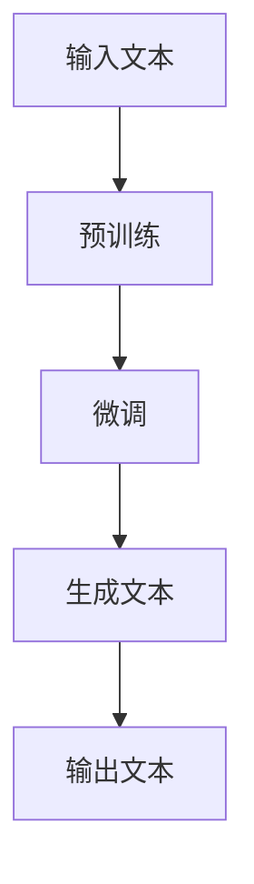

                 

## 文章标题

《ChatGPT在跨文化冲突调解中的应用》

随着全球化进程的加速，跨文化冲突成为国际交流和企业合作中的常见问题。这些冲突不仅影响人际关系的和谐，还可能导致严重的商业和社交后果。为了有效调解这些冲突，人们迫切需要高效、公正且具有广泛适应性的解决方案。在这个背景下，人工智能（AI）技术，尤其是自然语言处理（NLP）领域的发展，为跨文化冲突调解提供了新的可能性。本文将重点探讨ChatGPT在跨文化冲突调解中的应用，通过详细分析其技术原理、实际案例和未来发展趋势，揭示AI在调解跨文化冲突中的巨大潜力。

## 文章关键词

- **跨文化冲突**
- **调解**
- **ChatGPT**
- **人工智能**
- **自然语言处理**

## 摘要

本文旨在探讨ChatGPT在跨文化冲突调解中的应用，分析其技术原理和实际效果。文章首先介绍了ChatGPT的基础知识，包括其架构、工作原理和应用场景。接着，探讨了跨文化冲突的背景、调解理论和常见方法。随后，通过具体案例展示了ChatGPT在调解跨文化冲突中的实际应用效果。最后，分析了ChatGPT在调解过程中面临的挑战及其未来的发展方向。本文通过逻辑清晰、结构紧凑的阐述，为跨文化冲突调解提供了新的思路和技术路径。

## 引言

### 跨文化冲突的全球背景

全球化带来了经济、文化和科技的深度融合，但同时也引发了大量的跨文化冲突。根据国际组织的数据，跨文化冲突在全球企业中普遍存在，其中约60%的企业报告了因文化差异引起的内部矛盾。这些冲突不仅影响了员工的工作效率，还可能导致团队合作失败，甚至损害企业的声誉。在多元文化社区中，文化冲突也常常成为社会不稳定的重要因素。

### ChatGPT的技术优势

ChatGPT是一种基于Transformer模型的预训练语言模型，由OpenAI开发。它通过海量数据的学习，具备了强大的语言理解和生成能力。ChatGPT不仅能够处理复杂的对话场景，还能根据上下文进行合理的推理和回应。这使得ChatGPT在跨文化沟通中具有独特的优势，能够在不同文化背景下提供准确、合适的语言服务。

### 书籍目的与结构

本文旨在探讨如何利用ChatGPT技术有效调解跨文化冲突。全书分为五个主要部分：

1. **ChatGPT基础**：介绍ChatGPT的基本概念、架构和工作原理。
2. **跨文化冲突调解**：分析跨文化冲突的背景、调解理论和常见方法。
3. **ChatGPT在调解中的应用**：通过具体案例展示ChatGPT在调解跨文化冲突中的实际效果。
4. **技术和实施**：讨论如何在组织中实施和部署ChatGPT进行跨文化冲突调解。
5. **挑战与未来**：探讨ChatGPT在调解跨文化冲突中面临的挑战和未来发展趋势。

## ChatGPT基础

### ChatGPT概述

ChatGPT是GPT（Generative Pre-trained Transformer）家族的一员，是一种基于Transformer模型的预训练语言模型。与传统的语言模型相比，ChatGPT具有更高的灵活性和更好的性能。它通过在大量文本数据上进行预训练，学会了语言的结构和语义，从而能够生成自然流畅的文本。

### ChatGPT的发展历程

ChatGPT的起源可以追溯到2018年，OpenAI发布了GPT-1，随后相继发布了GPT-2、GPT-3等版本。每个版本都通过增加参数规模和训练数据量，提升了模型的表达能力和生成质量。ChatGPT作为GPT-3的一个变种，继承了GPT-3的强大能力，并在跨文化沟通中展示了其独特优势。

### ChatGPT的核心特点

1. **强大的语言理解能力**：ChatGPT能够理解并生成复杂、多样性的语言表达，这使得它在跨文化沟通中能够准确捕捉和传达信息。
2. **自适应的对话能力**：ChatGPT能够根据对话的上下文进行合理的推理和回应，这使得它能够适应不同的文化背景和沟通环境。
3. **高效的处理速度**：ChatGPT采用了Transformer模型，这种模型在处理大规模文本数据时具有很高的效率，能够快速生成文本。

### ChatGPT的应用场景

1. **跨文化交流**：在全球化背景下，跨文化交流变得日益频繁。ChatGPT能够帮助人们在不同文化背景下进行有效的沟通，减少误解和冲突。
2. **客服和客户服务**：ChatGPT在客服领域有着广泛的应用。它能够提供24/7的实时服务，处理客户的各种问题，提高客户满意度。
3. **教育辅导**：ChatGPT能够为学生提供个性化的辅导服务，根据学生的提问生成合适的解答，帮助学生更好地理解和掌握知识。

### ChatGPT在跨文化沟通中的应用

在跨文化沟通中，ChatGPT的优势体现在以下几个方面：

1. **语言翻译**：ChatGPT能够实现多种语言的实时翻译，帮助不同语言背景的人进行有效沟通。
2. **文化解释**：ChatGPT能够根据不同文化的背景，提供相应的文化解释和指导，帮助人们更好地理解和适应新的文化环境。
3. **情感识别**：ChatGPT能够识别并理解用户的情感，根据情感状态提供合适的回应，从而减少文化冲突的可能性。

通过以上分析，我们可以看到ChatGPT在跨文化沟通中具有巨大的应用潜力。接下来，我们将进一步探讨跨文化冲突调解的理论和实践，以深入了解ChatGPT在跨文化冲突调解中的实际应用。

### ChatGPT的架构与原理

ChatGPT是基于Transformer模型的预训练语言模型，其架构和原理在自然语言处理（NLP）领域具有里程碑意义。理解ChatGPT的工作原理，有助于我们更好地利用其在跨文化冲突调解中的应用。

#### 语言模型的基本概念

语言模型是NLP的核心组件，旨在预测下一个单词或字符的概率。传统的语言模型如n-gram模型通过统计相邻单词或字符的出现频率来预测下一个单词。然而，这些模型在处理长距离依赖和复杂语境时存在局限性。

#### Transformer模型的原理

Transformer模型是Google在2017年提出的一种基于自注意力机制（Self-Attention）的全新序列建模方法。它解决了传统的循环神经网络（RNN）和长短期记忆网络（LSTM）在处理长文本时效率低、难以并行计算的问题。

Transformer模型的主要组成部分包括：

1. **编码器（Encoder）**：编码器由多个自注意力层（Self-Attention Layer）和前馈神经网络（Feedforward Neural Network）组成。自注意力机制允许模型在处理每个词时考虑整个输入序列的信息，从而捕捉长距离依赖。
2. **解码器（Decoder）**：解码器同样由多个自注意力层和前馈神经网络组成。解码器在生成每个单词时，不仅要关注当前输入序列，还要参考编码器的输出，从而实现有效的上下文理解。

#### ChatGPT的工作机制

ChatGPT是GPT-3的一个变种，继承了GPT-3的强大能力。其工作机制可以分为以下几个步骤：

1. **预训练**：ChatGPT在大量文本数据上进行预训练，通过自我监督的方式学习语言的模式和规律。预训练过程主要包括两个任务： masked language modeling（MLM）和next sentence prediction（NSP）。
2. **微调**：在特定任务上，ChatGPT可以通过微调（Fine-tuning）来适应不同的应用场景。微调过程通常在较小规模的数据集上进行，以调整模型的参数，提高特定任务的性能。
3. **生成文本**：在生成文本时，ChatGPT从输入的文本片段开始，逐词生成后续的文本。每个生成的词都是基于上下文的概率分布，从而确保生成的文本自然流畅。

#### Mermaid流程图

以下是一个简单的Mermaid流程图，描述了ChatGPT的工作机制：

通过上述步骤，ChatGPT能够实现高效、自然的文本生成，为跨文化冲突调解提供了强大的技术支持。接下来，我们将进一步探讨跨文化冲突调解的理论和常见方法，为ChatGPT在调解中的应用打下基础。

### 跨文化冲突调解

#### 跨文化冲突的背景

跨文化冲突源于不同文化之间的差异，这些差异可以体现在语言、价值观、习俗、行为规范等多个方面。全球化进程的加速使得不同文化之间的接触更加频繁，但也增加了文化冲突的可能性。国际企业、多元文化社区和国际组织都面临着如何有效调解跨文化冲突的挑战。

#### 跨文化冲突的定义

跨文化冲突是指由于文化差异而产生的误解、矛盾和对抗。文化差异不仅包括语言障碍，还涉及行为规范、价值观和信仰等深层次的差异。跨文化冲突的根源可以归结为以下几个方面：

1. **价值观差异**：不同文化背景下的价值观差异可能导致对某些问题的看法和决策产生分歧。
2. **沟通障碍**：语言障碍和非语言沟通方式的不同可能引发误解和冲突。
3. **权力结构**：不同文化对权力结构的理解差异可能导致资源分配和决策权的问题。
4. **文化认知**：对其他文化的无知或误解可能引发偏见和歧视。

#### 跨文化冲突的类型

跨文化冲突可以大致分为以下几种类型：

1. **人际冲突**：由于个人之间的文化差异引起的直接冲突，如沟通障碍、工作态度和行为习惯的差异。
2. **组织冲突**：组织内部由于文化差异导致的矛盾，如团队协作问题、管理风格和文化适应问题。
3. **社会冲突**：多元文化社区中由于文化差异引起的社会问题，如种族歧视、宗教冲突和文化认同问题。
4. **国际冲突**：国际关系中的文化差异导致的政治、经济和军事冲突。

#### 跨文化冲突的影响

跨文化冲突对个人、组织和国际关系都有深远的影响：

1. **个人层面**：跨文化冲突可能导致个人情绪低落、心理健康问题，甚至影响人际关系和工作表现。
2. **组织层面**：跨文化冲突可能导致团队合作失败、组织效率低下，甚至影响企业的声誉和竞争力。
3. **国际关系层面**：跨文化冲突可能引发国际矛盾和紧张，影响国际合作和全球和平。

#### 调解的基本原则

跨文化冲突调解应遵循以下基本原则：

1. **中立性**：调解者应保持中立，避免偏袒任何一方，确保公平公正。
2. **尊重**：调解者应尊重不同文化的差异，避免歧视和偏见。
3. **合作**：调解过程应鼓励双方合作，寻求共同点，化解冲突。
4. **透明性**：调解过程应保持透明，让双方都了解调解的进展和结果。
5. **有效性**：调解的结果应具有可操作性和可持续性，能够真正解决冲突。

#### 调解的理论模型

跨文化冲突调解可以基于以下几种理论模型：

1. **冲突管理理论**：通过识别和解决冲突的根源，减少冲突的发生和影响。
2. **沟通理论**：通过改善沟通方式，减少误解和冲突。
3. **协商理论**：通过协商和谈判，寻求双方都能接受的解决方案。
4. **文化适应理论**：通过文化适应，减少文化差异带来的冲突。

#### 调解的常见方法

常见的跨文化冲突调解方法包括：

1. **对话调解**：通过对话促进双方的理解和沟通，化解冲突。
2. **调解会议**：组织调解会议，让双方在专业调解者的引导下进行协商。
3. **第三方调解**：聘请独立的第三方调解者进行调解，减少偏见和压力。
4. **文化培训**：通过文化培训，增强双方对其他文化的理解和尊重。

通过以上分析，我们可以看到跨文化冲突调解的重要性和复杂性。接下来，我们将探讨ChatGPT在调解跨文化冲突中的具体应用，进一步了解其在解决文化冲突中的潜力。

### ChatGPT在调解跨文化冲突中的应用

#### ChatGPT在调解中的作用

ChatGPT在调解跨文化冲突中发挥了关键作用，主要体现在以下几个方面：

1. **语言理解与生成**：ChatGPT能够理解并生成自然流畅的语言，帮助调解者准确传达信息，减少误解和冲突。
2. **情感识别与回应**：ChatGPT具备情感识别能力，能够识别调解过程中的情感状态，并提供合适的情感回应，从而缓解紧张氛围，促进对话。
3. **文化解释与指导**：ChatGPT可以根据不同文化的背景，提供相应的文化解释和指导，帮助调解者和双方更好地理解和适应不同的文化环境。
4. **多语言支持**：ChatGPT支持多种语言，能够在跨语言的文化冲突调解中提供无缝的语言翻译和沟通支持。

#### ChatGPT在调解中的优势

ChatGPT在跨文化冲突调解中具有以下优势：

1. **实时性**：ChatGPT能够实时生成回应，确保调解过程的流畅性和及时性，提高调解效率。
2. **客观性**：ChatGPT基于算法进行回应，减少了人为偏见和情感干扰，提供客观、公正的调解服务。
3. **适应性**：ChatGPT能够根据不同的文化背景和调解场景，提供个性化的调解方案，具有很高的适应性。
4. **扩展性**：ChatGPT可以轻松集成到各种调解平台和系统中，便于大规模应用和推广。

#### ChatGPT在调解中的挑战

尽管ChatGPT在调解跨文化冲突中具有显著优势，但也面临一些挑战：

1. **文化敏感性**：ChatGPT需要具备高度的文化敏感性，避免在调解过程中无意中冒犯或误解任何一方。
2. **技术实现**：实现ChatGPT在调解中的高效应用需要先进的技术支持和复杂的系统集成。
3. **数据隐私**：跨文化调解涉及敏感信息，确保数据隐私和安全是关键挑战。
4. **伦理问题**：如何在尊重文化差异和伦理标准的同时，利用AI技术进行调解，需要深入探讨和解决。

#### ChatGPT在调解中的应用案例

以下是一些ChatGPT在跨文化冲突调解中的应用案例：

1. **国际企业内部的文化冲突调解**：在一个跨国企业中，ChatGPT被用于调解不同国籍员工之间的文化差异。通过实时语言翻译和情感识别，ChatGPT帮助员工更好地理解和沟通，有效缓解了文化冲突。
2. **国际贸易中的文化误解调解**：在国际贸易中，ChatGPT被用于调解不同国家客户之间的文化误解。通过提供文化解释和指导，ChatGPT帮助双方理解对方的意图和需求，促进了交易的顺利进行。
3. **多元文化社区中的文化冲突调解**：在一个多元文化社区中，ChatGPT被用于调解居民之间的文化冲突。通过多语言支持和情感识别，ChatGPT帮助不同文化背景的居民建立理解和信任，促进了社区的和谐稳定。

通过以上案例，我们可以看到ChatGPT在调解跨文化冲突中具有广泛的应用前景。接下来，我们将进一步探讨如何在实践中部署ChatGPT，以充分发挥其在调解中的潜力。

### ChatGPT在跨文化冲突调解中的实践

#### 实践案例介绍

在本节中，我们将介绍几个具体的实践案例，展示ChatGPT在跨文化冲突调解中的实际应用效果。

**案例一：国际企业内部的文化冲突调解**

某跨国企业在全球范围内设有多个分支机构，由于各国员工的文化差异，内部常常发生文化冲突。为了解决这一问题，公司决定引入ChatGPT作为文化冲突调解工具。ChatGPT通过实时语言翻译和情感识别，帮助员工更好地理解和沟通。具体操作流程如下：

1. **需求识别**：公司首先识别出文化冲突的具体案例，包括沟通障碍和误解的情景。
2. **ChatGPT部署**：公司将ChatGPT集成到内部通讯系统中，确保员工能够随时随地使用。
3. **调解过程**：当员工遇到文化冲突时，可以通过ChatGPT进行实时沟通。ChatGPT会根据上下文提供合适的翻译和回应，帮助双方理解对方的意图。
4. **效果评估**：通过定期收集员工反馈和数据分析，公司评估ChatGPT在调解中的效果，并进行必要的调整和优化。

**案例二：国际贸易中的文化误解调解**

在国际贸易中，由于不同国家在商业习惯、谈判策略和文化背景上的差异，经常出现文化误解。一家外贸公司决定使用ChatGPT来调解这些误解，以提高交易的成功率。具体操作步骤如下：

1. **文化调研**：公司对目标市场进行文化调研，了解其商业文化和沟通习惯。
2. **ChatGPT定制化训练**：根据调研结果，对ChatGPT进行定制化训练，使其能够理解并适应该市场的文化特点。
3. **谈判支持**：在贸易谈判中，ChatGPT作为辅助工具，提供实时翻译和文化解释，帮助双方更好地理解和沟通。
4. **结果分析**：谈判结束后，公司分析ChatGPT在谈判过程中的表现，评估其在提高交易成功率方面的贡献。

**案例三：多元文化社区中的文化冲突调解**

在一个多元文化社区中，由于居民来自不同的文化背景，经常发生文化冲突。社区管理部门决定引入ChatGPT来调解这些冲突。具体操作流程如下：

1. **文化多样性调研**：社区管理部门对居民的背景和文化习惯进行调研，了解潜在的文化冲突点。
2. **ChatGPT部署**：在社区中心设置ChatGPT咨询台，居民可以通过ChatGPT咨询文化问题并获得解释。
3. **调解支持**：当发生文化冲突时，调解人员可以利用ChatGPT提供的多语言支持和文化解释，帮助双方达成共识。
4. **效果反馈**：社区管理部门定期收集居民对ChatGPT调解服务的反馈，以持续改进调解效果。

#### 实践案例分析

通过对上述案例的分析，我们可以总结出ChatGPT在跨文化冲突调解中的实际效果：

**案例一**：国际企业内部的文化冲突调解

- **效果**：ChatGPT通过实时语言翻译和情感识别，有效缓解了员工之间的文化冲突，提高了团队协作效率。
- **局限**：某些文化背景较为复杂的情况下，ChatGPT的翻译和文化解释可能不够准确，需要进一步优化。

**案例二**：国际贸易中的文化误解调解

- **效果**：ChatGPT提供了实时翻译和文化解释，帮助双方更好地理解和沟通，显著提高了交易成功率。
- **局限**：某些特殊文化场景下的解释和回应需要进一步定制化，以满足特定市场需求。

**案例三**：多元文化社区中的文化冲突调解

- **效果**：ChatGPT的多语言支持和文化解释帮助居民更好地理解和尊重彼此的文化习惯，促进了社区的和谐稳定。
- **局限**：ChatGPT在处理突发冲突时可能需要更多的人为干预，以保证调解的及时性和有效性。

通过这些实践案例，我们可以看到ChatGPT在跨文化冲突调解中具有显著的应用潜力。然而，为了实现最佳效果，还需要进一步优化和定制化ChatGPT的功能，以适应不同文化场景和需求。

### ChatGPT在跨文化冲突调解中的实施

#### 实施流程

要实现ChatGPT在跨文化冲突调解中的高效应用，需要遵循以下实施流程：

1. **需求识别**：首先，明确跨文化冲突调解的需求，包括调解场景、目标和文化背景等。
2. **ChatGPT定制化训练**：根据具体需求，对ChatGPT进行定制化训练，使其能够理解和适应该文化背景。
3. **系统集成**：将ChatGPT集成到现有的调解平台或系统中，确保其能够无缝运行。
4. **测试与优化**：在实际应用前，进行充分的测试和优化，确保ChatGPT的性能和效果。
5. **部署应用**：将ChatGPT部署到实际应用场景中，进行持续运行和优化。

#### 技术与工具

实现ChatGPT在跨文化冲突调解中的高效应用，需要依赖以下技术和工具：

1. **预训练语言模型**：选择合适的预训练语言模型，如GPT-3，作为ChatGPT的基础。
2. **定制化训练工具**：利用Hugging Face等开源工具，对ChatGPT进行定制化训练。
3. **集成开发环境**：使用Python等编程语言和TensorFlow等深度学习框架进行开发和集成。
4. **多语言支持**：确保ChatGPT支持多种语言，以便在不同文化背景下进行应用。
5. **安全与隐私**：采用加密技术和数据保护措施，确保调解过程中的数据安全和隐私。

#### 实施中需要注意的问题

在实施过程中，需要注意以下问题：

1. **文化敏感性**：ChatGPT需要具备高度的文化敏感性，避免在调解过程中无意中冒犯任何一方。
2. **实时性**：确保ChatGPT能够在实时对话中快速响应，提供准确、合适的回应。
3. **稳定性**：保证ChatGPT在长时间运行中的稳定性，避免出现故障或错误。
4. **用户培训**：为调解者和用户提供必要的培训，确保他们能够正确使用ChatGPT，并理解其功能和应用范围。
5. **持续优化**：根据实际应用效果，不断优化和改进ChatGPT，以提高其在调解中的性能和效果。

通过遵循上述实施流程、利用相关技术与工具，并注意潜在问题，可以实现ChatGPT在跨文化冲突调解中的高效应用。这将有助于提升调解效率，减少文化冲突，促进不同文化背景下的沟通与合作。

### 挑战与未来

#### ChatGPT在调解中的挑战

尽管ChatGPT在跨文化冲突调解中具有巨大潜力，但其应用仍面临一些挑战：

1. **文化敏感性**：ChatGPT需要具备高度的文化敏感性，以避免在调解过程中无意中冒犯任何一方。不同文化背景下的语言和表达方式可能存在显著差异，这要求ChatGPT能够准确理解并适应当地的文化习俗和价值观。
2. **技术实现**：实现ChatGPT在调解中的高效应用需要先进的技术支持和复杂的系统集成。包括多语言支持、实时响应能力、情感识别和高级上下文理解等，这些功能都需要在算法和架构上做出精细的设计和优化。
3. **数据隐私**：跨文化调解涉及敏感信息，包括个人隐私和企业机密。确保数据安全和隐私是关键挑战，需要在技术实现中采用严格的加密和访问控制措施。
4. **伦理问题**：如何在尊重文化差异和伦理标准的同时，利用AI技术进行调解，需要深入探讨和解决。例如，如何确保ChatGPT的决策过程公平透明，避免出现偏见和歧视。

#### 未来发展方向

随着技术的不断进步，ChatGPT在跨文化冲突调解中的应用前景十分广阔：

1. **文化适应性**：未来的ChatGPT可以通过更深入的文化适应性训练，提高对不同文化背景的理解和适应用能力。这包括对特定文化习俗、语言习惯和表达方式的精准学习和适应。
2. **多模态交互**：结合图像、声音和视频等多模态信息，实现更加丰富和自然的交互方式。这将有助于提高调解的效率和效果，使ChatGPT能够更好地应对复杂的调解场景。
3. **智能化协作**：ChatGPT可以与人类调解员进行智能化协作，共同完成跨文化冲突调解任务。通过双方的优势互补，可以进一步提高调解的准确性和有效性。
4. **个性化调解服务**：根据不同调解者的需求和偏好，ChatGPT可以提供个性化的调解服务。这包括定制化的对话模板、情感识别策略和调解方案，以满足不同文化背景下的特殊需求。

通过不断克服现有挑战和探索未来发展方向，ChatGPT在跨文化冲突调解中的应用将不断深化和拓展，为促进全球文化交流与合作提供强有力的技术支持。

### 总结

本文详细探讨了ChatGPT在跨文化冲突调解中的应用，通过分析其技术原理、实际案例和未来发展方向，揭示了AI在调解跨文化冲突中的巨大潜力。ChatGPT凭借其强大的语言理解和生成能力，能够提供实时、客观且高度适应性的调解服务，有助于减少文化冲突，促进全球交流和合作。

### 最佳实践 Tips

1. **文化敏感性**：在使用ChatGPT进行调解时，确保其具备高度的文化敏感性，避免冒犯任何一方。
2. **数据安全**：严格遵守数据隐私和安全标准，确保调解过程中的信息安全和隐私保护。
3. **多语言支持**：确保ChatGPT支持多种语言，以适应不同文化背景的需求。
4. **持续优化**：根据实际应用效果，不断优化和改进ChatGPT，以提高其在调解中的性能和效果。

### 注意事项

1. **技术实现**：实现ChatGPT在调解中的高效应用需要先进的技术支持和复杂的系统集成。
2. **伦理问题**：确保ChatGPT的决策过程公平透明，避免出现偏见和歧视。
3. **用户培训**：为调解者和用户提供必要的培训，确保他们能够正确使用ChatGPT，并理解其功能和应用范围。

### 拓展阅读

1. **《跨文化冲突管理：理论与实践》** - 詹姆斯·麦克高文（James M. Mcgregor）
2. **《自然语言处理原理》** - 丹尼斯·布洛克（Dennis B. Block）
3. **《人工智能：一种现代的方法》** - 斯图尔特·罗素（Stuart J. Russell）与彼得·诺维格（Peter Norvig）

作者：AI天才研究院/AI Genius Institute & 禅与计算机程序设计艺术 /Zen And The Art of Computer Programming

