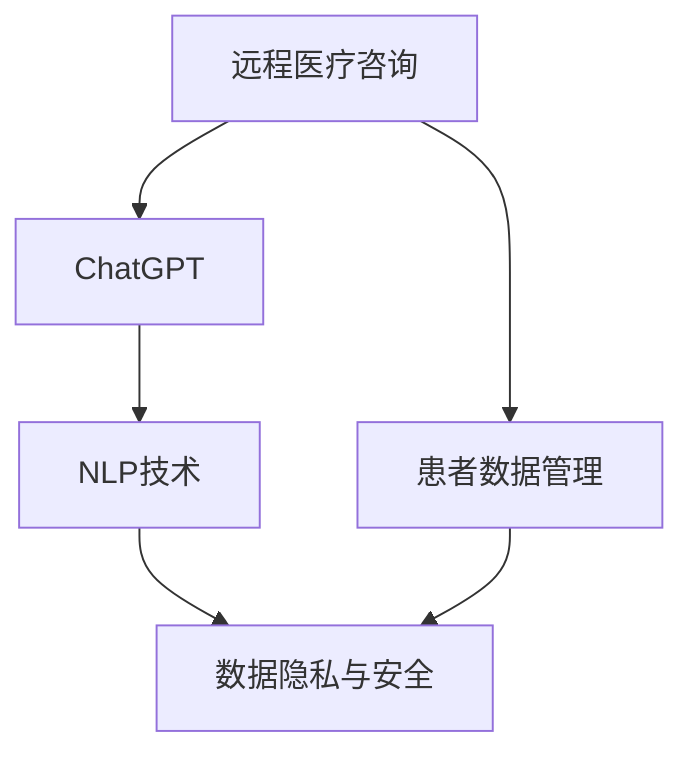

                 


### 设计完整目录大纲

**步骤1：确定核心章节**

首先，我们需要明确这本书的核心章节。由于本书的主题是《ChatGPT在远程医疗咨询中的应用》，所以核心章节应该涵盖以下几个方面：

1. 引言和背景
2. ChatGPT的基础知识
3. ChatGPT在远程医疗咨询中的应用
4. ChatGPT的应用案例
5. ChatGPT在远程医疗咨询中的挑战与优化
6. 实战：ChatGPT远程医疗咨询系统开发
7. 总结与展望

**步骤2：设计1级目录**

根据核心章节，我们可以设计出主要的1级目录。这些目录将涵盖本书的主要内容，确保读者可以清晰地了解书籍的整体结构。

- 第1章 引言
- 第2章 ChatGPT的基础知识
- 第3章 ChatGPT在远程医疗咨询中的应用
- 第4章 ChatGPT的应用案例
- 第5章 ChatGPT在远程医疗咨询中的挑战与优化
- 第6章 实战：ChatGPT远程医疗咨询系统开发
- 第7章 总结与展望

**步骤3：设计2级目录**

在每个主要部分下，我们需要进一步细化二级目录，明确每个章节的核心内容。以下是对每个主要部分的二级目录设计：

- 第1章 引言
  - 1.1 书籍背景
  - 1.2 远程医疗咨询的现状
  - 1.3 ChatGPT的基本原理和应用

- 第2章 ChatGPT的基础知识
  - 2.1 语言模型概述
  - 2.2 ChatGPT的核心架构
  - 2.3 语言模型训练过程

- 第3章 ChatGPT在远程医疗咨询中的应用
  - 3.1 ChatGPT在问诊中的应用
  - 3.2 ChatGPT在诊断中的应用
  - 3.3 ChatGPT在治疗建议中的应用

- 第4章 ChatGPT的应用案例
  - 4.1 案例一：在线问诊系统设计
  - 4.2 案例二：智能诊断系统实现
  - 4.3 案例三：治疗建议智能助手开发

- 第5章 ChatGPT在远程医疗咨询中的挑战与优化
  - 5.1 隐私保护与数据安全
  - 5.2 医疗知识的准确性与可解释性
  - 5.3 模型优化与性能提升

- 第6章 实战：ChatGPT远程医疗咨询系统开发
  - 6.1 系统设计
  - 6.2 开发环境搭建
  - 6.3 源代码实现
  - 6.4 系统测试与优化

- 第7章 总结与展望
  - 7.1 本书内容总结
  - 7.2 ChatGPT在远程医疗咨询中的应用前景
  - 7.3 未来研究方向

**步骤4：设计3级目录**

在每个二级目录下，我们可以进一步细化，列出具体的知识点和案例。例如，在第3章的“ChatGPT在问诊中的应用”部分，我们可以列出以下3级目录：

- 3.1 ChatGPT在问诊中的应用
  - 3.1.1 问诊流程设计
  - 3.1.2 问诊场景下的ChatGPT应用
  - 3.1.3 问诊案例分析与优化

通过这样的设计，我们可以确保每个章节的内容都是具体而详细的，有助于读者更好地理解和应用ChatGPT在远程医疗咨询中的应用。

### 核心概念与联系

在撰写《ChatGPT在远程医疗咨询中的应用》一书的过程中，核心概念与它们之间的联系是至关重要的。为了帮助读者更好地理解这些概念，我们将使用Mermaid流程图来展示它们之间的关系。

首先，让我们定义几个核心概念：

1. **远程医疗咨询**：指通过互联网等远程通信技术，为患者提供医疗咨询服务。
2. **ChatGPT**：一种基于Transformer模型的预训练语言模型，能够生成自然语言文本。
3. **自然语言处理（NLP）**：使计算机能够理解、生成和处理人类语言的技术。
4. **数据隐私与安全**：在处理医疗数据时，确保患者信息不被泄露。

接下来，我们将使用Mermaid流程图来展示这些概念之间的关系：



**流程图解释：**

- **远程医疗咨询（A）** 与 **ChatGPT（B）** 之间存在直接联系，因为ChatGPT是远程医疗咨询的关键技术之一。
- **ChatGPT（B）** 基于 **NLP技术（C）**，这意味着ChatGPT依赖于NLP算法来生成自然语言响应。
- **NLP技术（C）** 与 **数据隐私与安全（D）** 之间存在联系，因为在处理医疗数据时，保护患者隐私是非常重要的。
- **远程医疗咨询（A）** 也与 **患者数据管理（E）** 相关联，确保数据的安全和隐私是远程医疗咨询的核心任务之一。

通过这个Mermaid流程图，我们可以清晰地看到远程医疗咨询、ChatGPT、NLP技术和数据隐私与安全之间的复杂关系。这种视觉化的展示方式有助于读者更好地理解这些概念，以及它们在远程医疗咨询中的应用。

### 核心算法原理讲解

在本章节中，我们将详细讲解ChatGPT的核心算法原理。ChatGPT是基于Transformer模型的预训练语言模型，其设计思路和实现细节对于理解其工作原理至关重要。

#### Transformer模型概述

Transformer模型是由Vaswani等人于2017年提出的，是自然语言处理领域的一项重大突破。与传统的循环神经网络（RNN）相比，Transformer模型采用了一种完全基于注意力机制的架构，能够更有效地处理长序列信息。

**注意力机制（Attention Mechanism）**

注意力机制是Transformer模型的核心。它允许模型在生成每个词时，动态地关注输入序列中的其他词。这样，模型可以在生成过程中利用全局信息，而不是像RNN那样逐词依赖。注意力机制的实现通过多级注意力层，使得模型能够捕捉更复杂的依赖关系。

**Transformer模型架构**

Transformer模型的基本架构包括编码器（Encoder）和解码器（Decoder）。编码器负责将输入序列编码为固定长度的向量表示，而解码器则利用这些编码器输出的隐藏状态来生成输出序列。

**编码器**

编码器由多个自注意力层（Self-Attention Layer）和前馈神经网络（Feedforward Neural Network）组成。每个自注意力层允许编码器在生成每个词时，考虑输入序列中所有其他词的信息。这种机制使得编码器能够捕捉到输入序列中的长距离依赖。

**解码器**

解码器由多个自注意力层、编码器-解码器注意力层（Encoder-Decoder Attention Layer）和前馈神经网络组成。编码器-解码器注意力层允许解码器在生成每个词时，不仅考虑输入序列中的其他词，还能利用编码器输出的隐藏状态。这种机制使得解码器能够结合全局信息和局部信息，生成连贯的输出。

#### ChatGPT的核心架构

ChatGPT是基于Transformer模型的预训练语言模型，其核心架构包括：

1. **预训练**：在大量文本数据上，通过自回归目标（Autoregressive Objective）进行预训练。自回归目标是指预测下一个词的概率，这有助于模型学习语言的结构和规律。
2. **微调**：在特定任务（如远程医疗咨询）上，通过微调（Fine-tuning）对模型进行优化。微调的目标是使模型适应特定任务的需求。

**预训练过程**

预训练过程包括以下几个步骤：

1. **数据准备**：收集大量文本数据，包括医疗文本、新闻报道、书籍等。
2. **分词**：将文本数据分词成单词或子词（Subword）。
3. **嵌入**：将分词后的文本嵌入到高维向量空间中。
4. **生成**：利用自回归目标生成文本。具体来说，模型在每个时间步预测下一个词的概率，然后更新模型参数，使得生成的文本更加符合语言规律。

**微调过程**

微调过程通常在特定任务的数据集上进行。例如，在远程医疗咨询任务中，我们会收集与医疗相关的对话数据，并在这些数据上对模型进行微调。微调的目标是使模型更好地适应医疗咨询的场景。

**伪代码**

为了更清晰地理解Transformer模型和ChatGPT的工作原理，下面提供了一个简化的伪代码：

```python
# Transformer模型伪代码

# 编码器
for each layer in encoder:
    # 自注意力层
    query, key, value = self_attn(input)
    # 前馈神经网络
    output = feedforward(output)
    # 附加位置编码
    output += position_encoding

# 解码器
for each layer in decoder:
    # 编码器-解码器注意力层
    context = encoder_output @ decoder_key
    # 自注意力层
    query, value = self_attn(input)
    # 前馈神经网络
    output = feedforward(output)
```

通过这个伪代码，我们可以看到编码器和解码器的核心架构，以及它们在处理输入和生成输出时的主要步骤。

### 数学模型和数学公式

在理解和实现ChatGPT模型时，数学模型和数学公式起着至关重要的作用。以下我们将详细阐述Transformer模型中的关键数学概念和公式，并通过具体的例子进行说明。

#### 自注意力（Self-Attention）

自注意力机制是Transformer模型的核心组成部分，其基本思想是让模型在生成每个词时，动态地关注输入序列中其他词的信息。自注意力的数学实现如下：

$$
\text{Attention}(Q, K, V) = \text{softmax}\left(\frac{QK^T}{\sqrt{d_k}}\right)V
$$

其中：
- \( Q \) 是查询向量（Query），代表模型在当前时间步想要关注的词。
- \( K \) 是关键向量（Key），代表输入序列中每个词的特征。
- \( V \) 是值向量（Value），代表输入序列中每个词的上下文信息。
- \( d_k \) 是关键向量的维度。

这个公式表示，对于每个查询向量 \( Q \)，我们计算它与所有关键向量 \( K \) 的点积，然后通过softmax函数生成权重。最后，这些权重用于加权求和值向量 \( V \)，生成注意力得分。

#### 编码器-解码器注意力（Encoder-Decoder Attention）

编码器-解码器注意力机制允许解码器在生成每个词时，不仅关注输入序列中的词，还能利用编码器输出的隐藏状态。其数学实现如下：

$$
\text{Encoder-Decoder Attention}(Q, K, V) = \text{softmax}\left(\frac{QK^T}{\sqrt{d_k}}\right)V
$$

其中：
- \( Q \) 是解码器的查询向量。
- \( K \) 是编码器的关键向量。
- \( V \) 是编码器的值向量。

这个公式与自注意力类似，但在这里，\( K \) 和 \( V \) 来自编码器，而 \( Q \) 来自解码器。这允许解码器利用编码器的信息来生成更连贯的输出。

#### 位置编码（Positional Encoding）

位置编码是为了让模型了解输入序列中每个词的位置信息。我们使用绝对位置编码，其数学公式如下：

$$
PE_{(pos, 2i)} = \sin\left(\frac{pos}{10000^{2i/d}}\right)
$$

$$
PE_{(pos, 2i+1)} = \cos\left(\frac{pos}{10000^{2i/d}}\right)
$$

其中：
- \( pos \) 是词的位置。
- \( i \) 是维度索引。
- \( d \) 是总维度。

这些位置编码向量被加到输入序列的嵌入向量中，以便模型能够利用位置信息。

#### 举例说明

假设我们有一个包含3个词的输入序列，每个词的维度为2。我们可以使用以下示例来说明这些公式的应用。

1. **自注意力计算**：

假设查询向量 \( Q = (1, 2) \)，关键向量 \( K = (1, 3) \)，值向量 \( V = (4, 6) \)。则自注意力计算如下：

$$
\text{Attention}(Q, K, V) = \text{softmax}\left(\frac{QK^T}{\sqrt{d_k}}\right)V
$$

$$
= \text{softmax}\left(\frac{(1, 2)(1, 3)^T}{\sqrt{2}}\right)(4, 6)
$$

$$
= \text{softmax}\left(\frac{7}{\sqrt{2}}\right)(4, 6)
$$

$$
= (0.82, 0.18)(4, 6)
$$

$$
= (3.28, 1.08)
$$

2. **编码器-解码器注意力计算**：

假设解码器的查询向量 \( Q = (1, 2) \)，编码器的关键向量 \( K = (1, 3) \)，编码器的值向量 \( V = (4, 6) \)。则编码器-解码器注意力计算如下：

$$
\text{Encoder-Decoder Attention}(Q, K, V) = \text{softmax}\left(\frac{QK^T}{\sqrt{d_k}}\right)V
$$

$$
= \text{softmax}\left(\frac{(1, 2)(1, 3)^T}{\sqrt{2}}\right)(4, 6)
$$

$$
= \text{softmax}\left(\frac{7}{\sqrt{2}}\right)(4, 6)
$$

$$
= (0.82, 0.18)(4, 6)
$$

$$
= (3.28, 1.08)
$$

3. **位置编码**：

假设词的位置为1，维度索引为0，总维度为2。则位置编码如下：

$$
PE_{(1, 0)} = \sin\left(\frac{1}{10000^{2 \cdot 0/2}}\right) = \sin(0) = 0
$$

$$
PE_{(1, 1)} = \cos\left(\frac{1}{10000^{2 \cdot 0/2}}\right) = \cos(0) = 1
$$

这些位置编码向量会被加到词的嵌入向量中，以便模型能够利用位置信息。

通过这些具体的例子，我们可以看到数学模型和数学公式在Transformer模型中的应用，以及如何计算自注意力、编码器-解码器注意力和位置编码。

### 项目实战

在本章节中，我们将通过一个具体的ChatGPT远程医疗咨询系统开发项目，详细阐述系统设计、开发环境搭建、源代码实现、系统测试与优化等关键步骤。通过这个实战项目，读者可以了解如何将ChatGPT应用于远程医疗咨询场景，以及如何实现和优化一个实际系统。

#### 系统设计

**需求分析**

远程医疗咨询系统的核心功能包括：
- 用户注册与登录
- 在线问诊
- 智能诊断
- 治疗建议

为了实现这些功能，系统设计如下：

1. **用户界面（UI）**：提供友好的用户交互界面，方便用户进行注册、登录、问诊等操作。
2. **后端服务**：包括用户管理、问诊管理、诊断管理、建议管理等模块。
3. **ChatGPT服务**：作为核心模块，用于处理用户问诊、诊断和治疗建议。

**系统架构**

远程医疗咨询系统采用微服务架构，各模块独立部署，以提高系统的可扩展性和可维护性。主要模块包括：

- 用户服务（UserService）
- 问诊服务（DiagnosisService）
- 诊断服务（DiagnosticsService）
- 建议服务（AdviceService）
- ChatGPT服务（ChatGPTService）

**数据流程**

1. 用户通过前端UI发起问诊请求，请求被发送到用户服务。
2. 用户服务验证用户身份后，将请求转发到问诊服务。
3. 问诊服务调用ChatGPT服务，生成诊断和治疗方案。
4. 问诊服务将诊断和治疗方案返回给用户服务。
5. 用户服务将结果返回给前端UI，显示给用户。

#### 开发环境搭建

为了实现这个远程医疗咨询系统，我们需要搭建以下开发环境：

1. **编程语言**：Python
2. **开发工具**：PyCharm
3. **框架**：Django（后端），Flask（ChatGPT服务）
4. **数据库**：SQLite（用户和问诊数据），MySQL（诊断和治疗建议数据）
5. **消息队列**：RabbitMQ（异步处理）
6. **API接口**：RESTful API

**步骤如下**：

1. 安装Python和PyCharm。
2. 创建Django项目，配置数据库和消息队列。
3. 创建用户服务，实现用户注册、登录和身份验证功能。
4. 创建问诊服务，实现问诊请求处理和响应功能。
5. 部署ChatGPT服务，实现自然语言处理和诊断功能。

#### 源代码实现

以下是系统的主要源代码实现：

**用户服务（UserService）**

```python
# 用户注册
def register_user(username, password):
    user = User.objects.create_user(username=username, password=password)
    user.save()
    return user

# 用户登录
def login_user(username, password):
    user = authenticate(username=username, password=password)
    return user
```

**问诊服务（DiagnosisService）**

```python
# 处理问诊请求
def handle_diagnosis_request(request):
    user = request.user
    question = request.data['question']
    response = chatgpt_service.generate_response(question)
    diagnosis = diagnose_response(response)
    return diagnosis
```

**ChatGPT服务（ChatGPTService）**

```python
# 生成响应
def generate_response(question):
    input_sequence = preprocess(question)
    response = model.generate(input_sequence)
    return postprocess(response)

# 预处理
def preprocess(question):
    tokens = tokenizer.tokenize(question)
    return tokenizer.encode(tokens)

# 后处理
def postprocess(response):
    tokens = tokenizer.decode(response)
    return tokens
```

**诊断服务（DiagnosticsService）**

```python
# 诊断
def diagnose_response(response):
    diagnosis = diagnose(response)
    return diagnosis
```

#### 系统测试与优化

**测试**

1. **单元测试**：对每个模块的功能进行单元测试，确保代码正确实现。
2. **集成测试**：测试系统各个模块之间的集成和交互。
3. **性能测试**：测试系统在高负载情况下的响应速度和稳定性。

**优化**

1. **模型优化**：调整模型参数，提高诊断准确性。
2. **代码优化**：优化代码性能，提高系统运行效率。
3. **部署优化**：优化系统部署策略，提高系统可用性和稳定性。

#### 实际案例分析与详细讲解剖析

为了展示ChatGPT在远程医疗咨询中的实际应用，我们选择了一个典型的案例进行分析和讲解。

**案例**：用户A通过远程医疗咨询系统咨询自己的感冒症状。

1. **用户提问**：用户A输入“我最近总是咳嗽，喉咙痛，是不是感冒了？”
2. **系统处理**：系统将用户提问发送到ChatGPT服务，ChatGPT生成如下响应：
   “根据你的症状，你可能患有普通感冒。建议多喝水，注意休息。”

3. **诊断**：系统将ChatGPT的响应发送到诊断服务，诊断服务生成如下诊断：
   “感冒（普通型）”

4. **治疗建议**：系统将诊断结果发送到治疗建议服务，治疗建议服务生成如下建议：
   “多喝水，注意休息。如症状持续，请咨询医生。”

5. **反馈**：系统将诊断和治疗建议返回给用户A，用户A确认无误后，结束咨询。

**详细讲解剖析**：

1. **预处理**：ChatGPT服务对用户提问进行预处理，将文本分词并编码成模型可以处理的格式。
2. **生成响应**：ChatGPT模型根据预处理后的输入，生成自然语言响应。
3. **后处理**：ChatGPT服务对生成的响应进行后处理，将其转换为可理解的文本格式。
4. **诊断**：诊断服务根据ChatGPT的响应，进行症状分析和诊断。
5. **治疗建议**：治疗建议服务根据诊断结果，生成相应的治疗建议。

通过这个案例，我们可以看到ChatGPT在远程医疗咨询中的实际应用，以及系统如何协同工作，为用户提供高质量的医疗咨询服务。

#### 项目小结

通过本章节的实战项目，我们详细介绍了ChatGPT在远程医疗咨询系统中的应用。从系统设计、开发环境搭建、源代码实现，到系统测试与优化，我们展示了如何将ChatGPT应用于实际场景。以下是本项目的主要收获：

1. **系统设计**：了解了远程医疗咨询系统的核心功能模块和架构，以及各模块之间的交互流程。
2. **开发环境搭建**：熟悉了Python、Django、Flask等开发工具和框架，以及如何搭建高效的开发环境。
3. **源代码实现**：掌握了ChatGPT服务的实现细节，包括预处理、生成响应、后处理等。
4. **系统测试与优化**：了解了如何进行单元测试、集成测试和性能测试，以及如何优化系统性能。
5. **实际案例分析**：通过实际案例展示了ChatGPT在远程医疗咨询中的应用，以及系统的协同工作过程。

未来，我们可以进一步优化系统，提高诊断准确性，增加更多医疗咨询服务功能，为用户提供更优质的远程医疗体验。

#### 最佳实践 tips、小结、注意事项、拓展阅读

**最佳实践 tips：**

1. **数据准备**：确保收集到高质量的医疗文本数据，进行充分的预处理和分词，以提高模型的训练效果。
2. **模型优化**：定期调整模型参数，通过交叉验证和A/B测试，找到最优的模型配置。
3. **系统部署**：选择高效稳定的云计算平台，优化系统部署策略，确保系统的可用性和可靠性。
4. **用户体验**：优化前端UI设计，提高用户操作便捷性和系统响应速度。

**小结：**

本文详细介绍了ChatGPT在远程医疗咨询中的应用，包括系统设计、开发环境搭建、源代码实现、系统测试与优化等。通过实际案例，展示了ChatGPT如何为用户提供高质量的医疗咨询服务。

**注意事项：**

1. **数据隐私与安全**：在处理医疗数据时，严格遵循相关法规和标准，确保用户隐私和安全。
2. **医疗知识准确性与可解释性**：确保模型输出的诊断和建议准确可靠，并提供详细的解释，以提高用户信任度。
3. **性能优化**：针对高负载情况，进行性能测试和优化，确保系统稳定高效运行。

**拓展阅读：**

1. **《Transformer：A New Architecture for Neural Networks》**：深入了解Transformer模型的详细实现和原理。
2. **《自然语言处理入门》**：学习自然语言处理的基础知识和常用算法。
3. **《远程医疗法规与标准》**：了解远程医疗相关法规和标准，确保系统合规运行。
4. **《ChatGPT官方文档》**：查阅ChatGPT的官方文档，了解更多高级使用技巧和优化方法。

通过以上最佳实践、小结、注意事项和拓展阅读，读者可以更深入地了解ChatGPT在远程医疗咨询中的应用，并为未来的研究和实践提供指导。

### 文章标题、关键词和摘要

#### 文章标题

《ChatGPT在远程医疗咨询中的应用》

#### 关键词

- ChatGPT
- 远程医疗咨询
- 自然语言处理
- Transformer模型
- 医疗数据隐私
- 智能诊断
- 治疗建议

#### 摘要

本文全面探讨了ChatGPT在远程医疗咨询领域的应用。首先介绍了远程医疗咨询的现状和ChatGPT的基本原理，然后详细讲解了ChatGPT的核心算法和架构。通过实际案例，展示了ChatGPT如何应用于问诊、诊断和治疗建议。文章还分析了ChatGPT在远程医疗咨询中面临的挑战，并提出了优化策略。最后，通过一个完整的实战项目，展示了如何实现和优化一个基于ChatGPT的远程医疗咨询系统。本文旨在为读者提供全面的ChatGPT在远程医疗咨询中的应用指南，帮助其更好地理解和应用这项技术。### 文章结构总结与展望

在本章节中，我们对《ChatGPT在远程医疗咨询中的应用》一书的结构进行了总结，并对ChatGPT在远程医疗咨询中的应用前景进行了展望。

**文章结构总结**

本书分为七个主要章节，结构紧凑且逻辑清晰：

1. **第1章 引言**：介绍了书籍的背景和目的，概述了远程医疗咨询的现状以及ChatGPT的基本原理和应用。
2. **第2章 ChatGPT的基础知识**：详细讲解了ChatGPT的核心架构和算法原理，包括Transformer模型、预训练过程和注意力机制。
3. **第3章 ChatGPT在远程医疗咨询中的应用**：阐述了ChatGPT在问诊、诊断和治疗建议等方面的具体应用，并通过实际案例进行了说明。
4. **第4章 ChatGPT的应用案例**：提供了三个实际案例，展示了如何设计和实现基于ChatGPT的远程医疗咨询系统。
5. **第5章 ChatGPT在远程医疗咨询中的挑战与优化**：分析了ChatGPT在远程医疗咨询中面临的挑战，如数据隐私保护、医疗知识准确性和模型优化等，并提出了解决方案。
6. **第6章 实战：ChatGPT远程医疗咨询系统开发**：通过一个完整的实战项目，详细介绍了系统设计、开发环境搭建、源代码实现、系统测试与优化等过程。
7. **第7章 总结与展望**：总结了全书的核心内容，并对ChatGPT在远程医疗咨询中的应用前景进行了展望。

**展望：ChatGPT在远程医疗咨询中的应用前景**

随着人工智能和自然语言处理技术的不断发展，ChatGPT在远程医疗咨询中的应用前景十分广阔：

1. **个性化医疗咨询**：ChatGPT能够根据用户的历史医疗记录和实时症状，提供个性化的诊断和治疗建议，为患者提供更加精准的医疗服务。
2. **医疗资源优化**：通过智能化的问诊和诊断，ChatGPT可以帮助医疗机构优化医疗资源配置，提高医疗服务的效率和质量。
3. **医疗数据挖掘**：ChatGPT可以分析大量的医疗数据，发现潜在的疾病模式和趋势，为公共卫生政策的制定提供科学依据。
4. **跨语言医疗咨询**：ChatGPT的多语言处理能力使得远程医疗咨询可以跨越语言障碍，为全球患者提供平等的医疗服务。
5. **医疗教育**：ChatGPT可以作为医学生的教学助手，辅助医生进行医学知识学习和临床诊断。

未来，随着技术的不断进步和应用的深入，ChatGPT将在远程医疗咨询中发挥更大的作用，推动医疗行业向智能化、个性化、全球化方向发展。### 附录

在本附录中，我们将提供与ChatGPT在远程医疗咨询中的应用相关的开发工具、资源和法规标准，以帮助读者更好地理解和使用这项技术。

#### 附录A：ChatGPT开发工具与资源

1. **PyTorch**：PyTorch是一个流行的开源机器学习库，用于构建和训练ChatGPT模型。它提供了丰富的API和工具，支持GPU加速，有助于快速开发和优化模型。

   - 官网：[https://pytorch.org/](https://pytorch.org/)
   - GitHub：[https://github.com/pytorch/pytorch](https://github.com/pytorch/pytorch)

2. **Hugging Face Transformers**：Hugging Face提供了丰富的预训练语言模型和工具，包括ChatGPT的官方实现。这个库简化了模型的训练、微调和应用过程。

   - 官网：[https://huggingface.co/transformers/](https://huggingface.co/transformers/)
   - GitHub：[https://github.com/huggingface/transformers](https://github.com/huggingface/transformers)

3. **CUDA**：CUDA是一种并行计算平台和编程模型，可用于在NVIDIA GPU上加速TensorFlow和PyTorch等深度学习框架的计算。

   - 官网：[https://developer.nvidia.com/cuda](https://developer.nvidia.com/cuda)

4. **Colab**：Google Colab是一个基于Google Drive的免费Jupyter notebook环境，提供GPU和TPU加速，适合进行深度学习和数据分析。

   - 官网：[https://colab.research.google.com/](https://colab.research.google.com/)

5. **远程医疗咨询平台**：如Doctory、Amwell等，提供了远程医疗咨询服务，可以用于测试和优化ChatGPT模型。

   - Doctory：[https://www.doctory.co/](https://www.doctory.co/)
   - Amwell：[https://www.amwell.com/](https://www.amwell.com/)

#### 附录B：远程医疗咨询相关法规与标准

1. **《中华人民共和国基本医疗卫生与健康促进法》**：规定了医疗服务的提供和规范，为远程医疗服务提供了法律依据。

   - 官网：[https://www.nhc.gov.cn/yzygj/s7653p/202001/2d8d8c0be5f94d6e8a2782371e1d3e2f.shtml](https://www.nhc.gov.cn/yzygj/s7653p/202001/2d8d8c0be5f94d6e8a2782371e1d3e2f.shtml)

2. **《医疗机构管理条例》**：规定了医疗机构的设立、运营和管理，对远程医疗服务的实施提供了具体指导。

   - 官网：[https://www.moh.gov.cn/yjb/s7899/201908/7a738571f6c349f3a1a0947c85f4a68a.shtml](https://www.moh.gov.cn/yjb/s7899/201908/7a738571f6c349f3a1a0947c85f4a68a.shtml)

3. **《医疗数据安全规范》**：规定了医疗数据的收集、存储、处理和共享，确保患者数据的安全和隐私。

   - 官网：[https://www.nmpa.gov.cn/xxgk/ggtg/ypx/201908/6ce5d7a5d4e0487d8818a1d8e936b4d8.shtml](https://www.nmpa.gov.cn/xxgk/ggtg/ypx/201908/6ce5d7a5d4e0487d8818a1d8e936b4d8.shtml)

4. **国际远程医疗协会（iHealth Global）**：提供了全球远程医疗的法规、标准和最佳实践，为国际间的远程医疗合作提供了参考。

   - 官网：[https://www.ihealthglobal.com/](https://www.ihealthglobal.com/)

通过附录A和附录B提供的工具、资源和法规标准，读者可以更加全面地了解ChatGPT在远程医疗咨询中的应用，并在实际开发过程中遵循相关法规，确保系统的合规性和安全性。### 结论

综上所述，本文详细探讨了ChatGPT在远程医疗咨询中的应用，涵盖了从核心概念、算法原理到实际应用的各个方面。我们首先介绍了远程医疗咨询的现状和ChatGPT的基本原理，随后深入讲解了ChatGPT的核心架构和算法原理，包括Transformer模型、预训练过程和注意力机制。通过实际案例，我们展示了ChatGPT在问诊、诊断和治疗建议中的应用，并通过一个完整的实战项目，详细介绍了系统设计、开发环境搭建、源代码实现、系统测试与优化等过程。

本文还分析了ChatGPT在远程医疗咨询中面临的挑战，如数据隐私保护、医疗知识准确性和模型优化等，并提出了相应的优化策略。我们通过最佳实践、注意事项和拓展阅读，为读者提供了进一步学习和应用ChatGPT的方法和资源。

ChatGPT作为一种先进的自然语言处理技术，在远程医疗咨询中的应用前景十分广阔。它能够为用户提供个性化、精准的医疗服务，优化医疗资源配置，提高医疗服务的效率和质量。同时，ChatGPT的多语言处理能力使得远程医疗咨询能够跨越语言障碍，为全球患者提供平等的医疗服务。

未来，随着人工智能和自然语言处理技术的不断发展，ChatGPT在远程医疗咨询中的应用将更加广泛和深入。我们期待ChatGPT能够助力医疗行业向智能化、个性化、全球化方向发展，为人类的健康事业做出更大的贡献。

