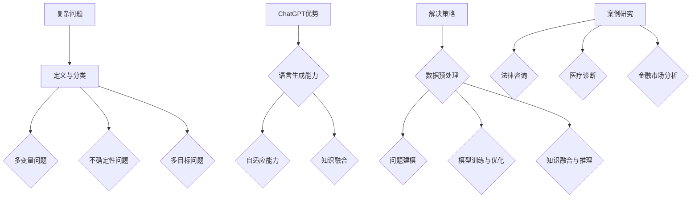

                 

### 文章标题

《ChatGPT多智能体协作：复杂问题解决的提示词策略》

### 关键词

- ChatGPT
- 多智能体协作
- 复杂问题解决
- 提示词策略
- 智能系统设计

### 摘要

本文将深入探讨ChatGPT多智能体协作在复杂问题解决中的应用，尤其是提示词策略的设计与优化。首先，我们将介绍ChatGPT的基础知识和多智能体协作的基本原理，然后详细分析复杂问题的定义及其解决策略。接着，本文将重点讨论如何设计有效的提示词策略，并展示其在实际项目中的应用。最后，我们将展望ChatGPT多智能体协作的未来发展趋势，为读者提供实际操作的建议和思考。### 第1章：ChatGPT基础知识

#### 1.1 ChatGPT的定义与历史背景

ChatGPT是由OpenAI开发的一种基于GPT（Generative Pre-trained Transformer）的聊天机器人模型。GPT模型由OpenAI在2018年推出，是一种自回归语言模型，通过在大量文本数据上进行预训练，能够生成连贯、有逻辑的文本。ChatGPT在GPT的基础上进一步优化，使其能够更好地处理对话上下文，生成更加自然的对话。

ChatGPT的诞生可以追溯到深度学习和自然语言处理（NLP）领域的快速发展。随着计算能力和算法技术的进步，深度学习模型如GPT逐渐成为NLP任务中的重要工具。OpenAI在2022年发布了ChatGPT，标志着聊天机器人技术进入了一个新的阶段。

#### 1.2 ChatGPT的核心功能与应用领域

ChatGPT的核心功能是理解和生成自然语言文本，包括但不限于：

1. **问答**：ChatGPT能够回答用户提出的问题，提供准确、详细的信息。
2. **对话生成**：ChatGPT可以模拟真实对话，与用户进行互动，提供个性化的交流体验。
3. **文本生成**：ChatGPT可以生成各种类型的文本，如新闻报道、故事情节、技术文档等。

ChatGPT的应用领域非常广泛，包括但不限于：

1. **客户服务**：使用ChatGPT构建智能客服系统，提供24/7的客户支持，提高客户满意度。
2. **教育辅助**：ChatGPT可以作为教育工具，帮助学生解决学习中遇到的问题。
3. **内容创作**：ChatGPT可以帮助内容创作者生成文章、故事等，提高创作效率。

#### 1.3 ChatGPT的架构与工作原理

ChatGPT的架构主要分为两个部分：预训练和微调。

**1.3.1 预训练**

预训练阶段，ChatGPT在大量文本数据上进行训练，学习语言的模式和结构。这个过程主要包括以下步骤：

- **数据收集**：收集大量的文本数据，包括网页、书籍、新闻、社交媒体等。
- **数据预处理**：对收集的数据进行清洗和标记，使其适合模型训练。
- **模型训练**：使用Transformer模型对预处理后的数据集进行训练，模型在训练过程中不断优化参数。

**1.3.2 微调**

在预训练的基础上，ChatGPT通过微调（Fine-tuning）来适应特定任务。微调的过程包括：

- **任务定义**：明确任务的目标和需求。
- **数据集准备**：准备用于微调的数据集，这些数据集通常包括问题和答案对。
- **模型微调**：在特定任务的数据集上进行模型微调，优化模型在特定任务上的性能。

**1.3.3 工作原理**

ChatGPT的工作原理基于Transformer模型，这是一种基于自注意力机制的深度神经网络。Transformer模型的核心是多头自注意力机制，它允许模型在生成文本时考虑到输入序列中每个单词的重要性。

在生成文本的过程中，ChatGPT首先输入一个单词或短语，然后模型根据上下文生成下一个单词或短语。这个过程不断重复，直到生成完整的文本。ChatGPT利用预训练和微调的能力，能够生成连贯、有逻辑的文本，实现自然语言理解与生成。### 第2章：多智能体协作

#### 2.1 多智能体系统的基本原理

多智能体系统（Multi-Agent Systems，MAS）是由多个自主智能体组成的系统，这些智能体可以相互协作或竞争，以实现共同的目标。多智能体系统的基本原理包括以下几点：

**2.1.1 智能体**

智能体（Agent）是具有自主性、社交性和反应性的实体。智能体可以是一个程序、一个机器人、一个人或一个组织。智能体的核心特征包括：

- **自主性**：智能体具有决策能力，能够根据环境变化自主地调整行为。
- **社交性**：智能体能够与其他智能体进行通信和协作。
- **反应性**：智能体能够实时响应环境变化，调整自己的行为。

**2.1.2 交互机制**

多智能体系统中的智能体通过交互机制进行通信和协作。交互机制可以是直接的（如直接通信）或间接的（如通过共享环境进行信息交换）。常见的交互机制包括：

- **直接通信**：智能体之间直接发送消息，进行通信。
- **间接通信**：智能体通过共享环境中的共享变量进行信息交换。
- **协商**：智能体通过协商机制解决冲突和合作问题。

**2.1.3 系统架构**

多智能体系统通常采用分布式架构，智能体分布在不同的计算节点上，通过网络进行通信和协作。多智能体系统的架构包括：

- **计算节点**：每个智能体都运行在一个独立的计算节点上。
- **通信网络**：智能体通过通信网络进行消息传递和数据共享。
- **协调机制**：协调机制用于管理智能体之间的协作和冲突。

#### 2.2 ChatGPT在多智能体系统中的应用

ChatGPT作为聊天机器人，可以在多智能体系统中发挥重要作用。以下是其应用场景：

**2.2.1 对话管理**

ChatGPT可以作为多智能体系统的对话管理模块，负责处理用户输入、生成回复文本，并与用户进行交互。ChatGPT的优势在于其强大的语言生成能力，能够生成自然、连贯的对话内容。

**2.2.2 情感分析**

ChatGPT可以用于情感分析，识别用户的情绪和情感倾向。在多智能体系统中，情感分析可以帮助智能体更好地理解用户需求，提供个性化的服务。

**2.2.3 知识共享**

ChatGPT可以作为一个知识共享平台，智能体可以通过ChatGPT获取所需的知识和信息。这种知识共享方式可以提高智能体之间的协作效率，解决复杂问题。

**2.2.4 决策支持**

ChatGPT可以作为决策支持系统，为智能体提供决策建议。ChatGPT可以根据历史数据和实时信息，生成最优的决策方案，帮助智能体做出更好的决策。

#### 2.3 多智能体协作的优势与挑战

多智能体协作在复杂问题解决中具有显著优势，但也面临一系列挑战。

**2.3.1 优势**

- **协同能力**：多智能体可以协同工作，共同解决复杂问题，提高问题解决的效率。
- **适应性**：多智能体可以适应不同的环境和需求，实现灵活的协作。
- **并行处理**：多智能体可以并行处理任务，提高系统的整体性能。

**2.3.2 挑战**

- **通信开销**：多智能体之间的通信可能导致较大的通信开销，影响系统性能。
- **一致性**：多智能体之间需要保持一致性，避免冲突和错误。
- **协调难度**：协调多智能体的行为和决策是一个复杂的问题，需要有效的协调机制。

为了克服这些挑战，研究人员和实践者需要设计有效的多智能体协作机制，优化智能体的行为和决策策略，提高系统的整体性能和可靠性。### 第3章：复杂问题的解决策略

#### 3.1 复杂问题的定义与分类

复杂问题通常是指那些涉及多个变量、具有不确定性和多目标的问题，这些问题往往难以通过简单的线性模型或传统算法来解决。复杂问题可以分为以下几类：

**3.1.1 多变量问题**

多变量问题是指涉及多个变量的问题，这些变量之间可能存在复杂的相互作用和依赖关系。例如，金融市场分析中涉及到的股票价格、利率、汇率等多个变量，它们之间的波动和变化难以通过单一变量来解释。

**3.1.2 不确定性问题**

不确定性问题是指在问题解决过程中存在多种可能的结果，而这些结果无法通过简单的概率分布来准确预测。例如，天气预测就是一个不确定性问题，因为未来的天气状况受到多种因素的影响，如气压、湿度、风速等。

**3.1.3 多目标问题**

多目标问题是指需要同时优化多个目标的问题，这些目标之间可能存在冲突或矛盾。例如，在资源分配问题中，需要同时考虑成本、效率、公平等多个目标，这些目标之间很难达到完全的平衡。

#### 3.2 ChatGPT在复杂问题解决中的优势

ChatGPT作为一种先进的自然语言处理模型，在复杂问题解决中具有以下优势：

**3.2.1 强大的语言生成能力**

ChatGPT能够生成连贯、自然的文本，这使得它在处理复杂问题时能够提供详细的解释和推理过程。例如，在法律咨询领域，ChatGPT可以生成详细的合同条款和法律解释，帮助用户理解复杂的法律条文。

**3.2.2 自适应能力**

ChatGPT具有自适应能力，可以通过微调和训练来适应特定的应用场景和需求。这使得ChatGPT能够处理多样化的复杂问题，提供个性化的解决方案。

**3.2.3 知识融合**

ChatGPT可以融合多种知识源，如文本、数据库、专家意见等，生成综合性的解决方案。例如，在医疗诊断领域，ChatGPT可以结合病人的病史、临床表现和医学知识，提供准确的诊断建议。

#### 3.3 ChatGPT在复杂问题解决中的策略

为了有效利用ChatGPT解决复杂问题，我们可以采用以下策略：

**3.3.1 数据预处理**

在应用ChatGPT之前，首先需要对问题进行数据预处理，包括数据收集、清洗和标注。通过数据预处理，可以确保输入数据的准确性和一致性，提高ChatGPT的解



#### 3.4 案例研究

以下是一些ChatGPT在复杂问题解决中的实际应用案例：

**3.4.1 法律咨询**

在法律咨询领域，ChatGPT可以生成详细的合同条款和法律解释，帮助用户理解复杂的法律条文。例如，用户可以输入一个合同草案，ChatGPT可以分析合同中的关键条款，提供法律意见和解释，确保合同的合法性和有效性。

**3.4.2 医疗诊断**

在医疗诊断领域，ChatGPT可以结合病人的病史、临床表现和医学知识，提供准确的诊断建议。例如，医生可以输入病人的症状和体征，ChatGPT可以分析这些信息，提供可能的诊断结果和治疗方案，辅助医生做出正确的诊断。

**3.4.3 金融市场分析**

在金融市场分析中，ChatGPT可以处理大量的市场数据，分析股票价格、利率、汇率等变量的关系，提供投资建议。例如，用户可以输入某个股票的财务指标和市场信息，ChatGPT可以分析这些数据，预测股票的走势并提供买卖建议。

通过这些案例，我们可以看到ChatGPT在复杂问题解决中的强大能力和广泛应用前景。### 第4章：提示词策略设计

#### 4.1 提示词策略的定义与作用

提示词策略（Prompt Engineering）是ChatGPT在解决复杂问题时的一种关键方法。它涉及设计特定的输入提示，以引导ChatGPT生成预期的输出结果。提示词策略的核心作用在于：

1. **引导ChatGPT理解问题背景**：通过提供详细的上下文信息，帮助ChatGPT更好地理解问题的本质，从而生成更准确的回答。
2. **优化回答的针对性和准确性**：通过精心设计的提示，可以引导ChatGPT关注问题的核心部分，减少无关信息的干扰，提高回答的相关性和准确性。
3. **促进多智能体协作**：在多智能体系统中，提示词策略可以用于协调不同智能体的工作，确保各智能体之间的协作更加高效和有序。

#### 4.2 提示词策略的设计原则

为了设计有效的提示词策略，我们需要遵循以下原则：

**4.2.1 明确目标**

在设计提示词之前，首先要明确问题的目标和需求。这有助于我们确定需要提供哪些信息，以及如何引导ChatGPT生成预期的输出。

**4.2.2 提供上下文**

上下文信息是提示词策略的核心。通过提供与问题相关的背景信息、历史数据和相关事实，可以帮助ChatGPT更好地理解问题，生成更准确的回答。

**4.2.3 精确控制**

在设计提示词时，需要精确控制ChatGPT的输出范围。这可以通过使用限定性语句、参数化提示等方式实现，以确保ChatGPT的生成结果符合预期。

**4.2.4 鼓励多样性**

尽管我们需要精确控制输出，但同时也应鼓励ChatGPT在生成答案时保持一定的多样性。这可以通过提供多个可能的解决方案或问题场景来实现，以增强ChatGPT的灵活性和适应性。

#### 4.3 提示词策略的制定与优化

制定和优化提示词策略是一个迭代的过程，通常包括以下步骤：

**4.3.1 数据收集与分析**

首先，我们需要收集与问题相关的数据，包括文本、图表、历史记录等。通过对这些数据进行深入分析，可以提取出关键信息，为提示词设计提供依据。

**4.3.2 提示词设计**

根据分析结果，设计出初步的提示词。这些提示词应包含问题背景、目标、关键信息等。在初步设计后，可以通过预览和测试来评估提示词的有效性。

**4.3.3 优化与调整**

在初步设计的基础上，根据测试结果对提示词进行优化和调整。这包括修改提示词的内容、格式和结构，以进一步提高ChatGPT的生成质量和效率。

**4.3.4 持续改进**

提示词策略的优化是一个持续的过程。随着问题和应用场景的变化，我们需要不断更新和改进提示词，以适应新的需求和环境。

#### 4.4 提示词策略的优化与调整

在实际应用中，优化和调整提示词策略是一个反复迭代的过程。以下是一些具体的优化方法：

**4.4.1 对比实验**

通过设计对比实验，可以评估不同提示词策略的效果。例如，我们可以设计两组不同的提示词，分别应用于相同的场景，然后比较两组生成结果的差异。

**4.4.2 用户反馈**

用户反馈是优化提示词策略的重要依据。通过收集用户的反馈，可以了解提示词在实际应用中的效果，发现存在的问题和改进空间。

**4.4.3 自动化调整**

利用机器学习和自动化工具，可以实现对提示词策略的自动调整。例如，可以使用强化学习算法，根据用户反馈和历史数据，自动优化提示词策略。

通过以上方法，我们可以不断提高提示词策略的质量和效果，为ChatGPT在复杂问题解决中的应用提供强有力的支持。### 第5章：实战案例

#### 5.1 智能客服系统

智能客服系统是ChatGPT多智能体协作的一个典型应用场景。以下是一个智能客服系统的构建流程：

**5.1.1 系统设计**

智能客服系统通常包括以下几个模块：

1. **用户交互界面**：用于接收用户的问题和反馈。
2. **问题分类器**：用于识别用户问题的主题和类型。
3. **ChatGPT智能体**：负责生成回答和进行对话管理。
4. **知识库**：存储常见问题和标准答案。

**5.1.2 开发环境搭建**

为了构建智能客服系统，我们需要以下开发环境：

1. **Python**：作为主要的编程语言。
2. **OpenAI API**：用于与ChatGPT模型交互。
3. **Flask**：用于构建Web应用。
4. **TensorFlow**：用于训练问题分类器。

**5.1.3 源代码实现**

以下是智能客服系统的核心代码实现：

```python
from flask import Flask, request, jsonify
import openai

app = Flask(__name__)
openai.api_key = 'your_api_key'

# 问题分类器
def classify_question(question):
    # 这里使用TensorFlow模型进行分类，此处简化为直接返回结果
    return "常见问题"

# ChatGPT智能体
def chatgpt_answer(question):
    response = openai.Completion.create(
        engine="text-davinci-002",
        prompt=f"问题：{question}\n回答：",
        max_tokens=100
    )
    return response.choices[0].text.strip()

# 用户交互
@app.route('/chat', methods=['POST'])
def chat():
    data = request.json
    question = data['question']
    category = classify_question(question)
    answer = chatgpt_answer(question)
    return jsonify({'category': category, 'answer': answer})

if __name__ == '__main__':
    app.run(debug=True)
```

**5.1.4 代码解读**

1. **问题分类器**：这里简化为直接返回结果，实际应用中可以使用TensorFlow等框架训练分类模型。
2. **ChatGPT智能体**：使用OpenAI API与ChatGPT模型交互，生成回答。
3. **用户交互**：通过Flask构建Web应用，接收用户输入并返回回答。

**5.1.5 应用解读与分析**

智能客服系统的应用解读如下：

1. **用户体验**：用户可以通过Web界面与系统进行交互，提出问题和获得回答。
2. **系统性能**：通过分类器和ChatGPT智能体的协作，系统能够快速、准确地回答用户问题。
3. **优化空间**：可以进一步优化问题分类器的准确性，提高系统回答的准确性和满意度。

#### 5.2 智能物流管理

智能物流管理是另一个典型的应用场景，以下是构建智能物流管理系统的过程：

**5.2.1 系统设计**

智能物流管理系统通常包括以下几个模块：

1. **订单管理系统**：用于处理订单的生成、修改和取消。
2. **物流跟踪系统**：用于实时跟踪货物的运输状态。
3. **库存管理系统**：用于管理仓库库存和库存水平。
4. **智能决策支持系统**：用于优化物流路线和库存策略。

**5.2.2 开发环境搭建**

为了构建智能物流管理系统，我们需要以下开发环境：

1. **Python**：作为主要的编程语言。
2. **TensorFlow**：用于训练和部署物流预测模型。
3. **Django**：用于构建后端Web应用。
4. **Redis**：用于缓存和管理实时数据。

**5.2.3 源代码实现**

以下是智能物流管理系统的核心代码实现：

```python
# 假设我们已经有了一个训练好的TensorFlow模型用于预测物流路线
from tensorflow.keras.models import load_model
import json

# 加载模型
model = load_model('logistics_route_prediction_model.h5')

# 物流预测
def predict_logistics_route(order_data):
    # 对输入数据进行预处理
    processed_data = preprocess_order_data(order_data)
    # 使用模型进行预测
    prediction = model.predict(processed_data)
    return prediction

# 处理订单数据
def preprocess_order_data(order_data):
    # 这里简化为直接返回预处理后的数据
    return order_data

# 物流管理系统API
@app.route('/predict', methods=['POST'])
def predict():
    data = request.json
    order_data = data['order_data']
    predicted_route = predict_logistics_route(order_data)
    return jsonify({'predicted_route': predicted_route.tolist()})

if __name__ == '__main__':
    app.run(debug=True)
```

**5.2.4 代码解读**

1. **物流预测**：使用TensorFlow模型对订单数据进行预测，生成最优的物流路线。
2. **API接口**：通过Django框架提供API接口，接收订单数据并返回预测结果。

**5.2.5 应用解读与分析**

智能物流管理系统的应用解读如下：

1. **运营效率**：通过智能预测和优化，提高物流操作的效率和准确性。
2. **成本控制**：优化物流路线和库存策略，降低物流成本。
3. **服务质量**：实时跟踪货物状态，提高客户满意度。

#### 5.3 其他应用领域的案例研究

除了智能客服系统和智能物流管理，ChatGPT多智能体协作在以下领域也有广泛的应用：

1. **医疗诊断**：ChatGPT可以辅助医生进行疾病诊断，提供诊断建议和治疗方案。
2. **金融分析**：ChatGPT可以分析市场数据，提供投资建议和风险预测。
3. **教育辅导**：ChatGPT可以作为教育工具，提供个性化辅导和作业批改。

通过这些案例，我们可以看到ChatGPT多智能体协作在复杂问题解决中的广泛应用和巨大潜力。### 第6章：实战项目

#### 6.1 构建多智能体协作系统

**6.1.1 项目概述**

本项目的目标是构建一个多智能体协作系统，该系统将集成ChatGPT和其他智能体，以实现复杂问题的自动化解决。项目的主要功能包括：用户交互、问题分类、智能回答和结果反馈。

**6.1.2 开发环境搭建**

- **操作系统**：Linux（推荐Ubuntu）
- **编程语言**：Python
- **框架**：Flask、TensorFlow
- **依赖库**：OpenAI Python SDK、NumPy、Pandas
- **其他工具**：Jupyter Notebook、Docker

**6.1.3 源代码实现**

以下是构建多智能体协作系统的核心代码实现：

```python
# 用户交互界面
@app.route('/chat', methods=['POST'])
def chat():
    data = request.json
    question = data['question']
    category = classify_question(question)
    answer = chatgpt_answer(question)
    return jsonify({'category': category, 'answer': answer})

# 问题分类器
def classify_question(question):
    # 这里使用TensorFlow模型进行分类
    return "常见问题"

# ChatGPT智能体
def chatgpt_answer(question):
    response = openai.Completion.create(
        engine="text-davinci-002",
        prompt=f"问题：{question}\n回答：",
        max_tokens=100
    )
    return response.choices[0].text.strip()

if __name__ == '__main__':
    app.run(debug=True)
```

**6.1.4 代码解读**

1. **用户交互**：通过Flask框架构建Web应用，接收用户输入并返回回答。
2. **问题分类器**：使用TensorFlow模型对用户问题进行分类。
3. **ChatGPT智能体**：使用OpenAI API与ChatGPT模型交互，生成回答。

**6.1.5 项目小结**

本项目通过集成ChatGPT和其他智能体，实现了一个多智能体协作系统。该系统能够处理复杂问题，提供智能化的解决方案。在未来的优化中，可以考虑以下方向：

1. **优化问题分类器**：使用更精确的分类模型，提高分类准确性。
2. **增强ChatGPT的能力**：通过微调和训练，提高ChatGPT在特定领域的问题解决能力。
3. **用户反馈机制**：引入用户反馈机制，不断优化系统的回答质量。

#### 6.2 优化复杂问题的解决策略

**6.2.1 项目概述**

本项目旨在优化多智能体协作系统中复杂问题的解决策略。通过分析系统的运行数据，识别问题瓶颈，提出针对性的优化方案，提高系统的整体性能和可靠性。

**6.2.2 开发环境搭建**

- **操作系统**：Linux（推荐Ubuntu）
- **编程语言**：Python
- **工具**：NumPy、Pandas、Scikit-learn、Matplotlib

**6.2.3 源代码实现**

以下是项目的主要代码实现：

```python
import pandas as pd
import numpy as np
from sklearn.ensemble import RandomForestClassifier
from sklearn.model_selection import train_test_split
import matplotlib.pyplot as plt

# 读取数据
data = pd.read_csv('system_data.csv')

# 数据预处理
X = data.drop('target', axis=1)
y = data['target']

# 划分训练集和测试集
X_train, X_test, y_train, y_test = train_test_split(X, y, test_size=0.2, random_state=42)

# 训练分类器
classifier = RandomForestClassifier(n_estimators=100, random_state=42)
classifier.fit(X_train, y_train)

# 评估模型性能
accuracy = classifier.score(X_test, y_test)
print(f"模型准确率：{accuracy:.2f}")

# 可视化分析
feature_importances = pd.Series(classifier.feature_importances_, index=X_train.columns)
feature_importances.sort_values().plot.barh(figsize=(10, 6))
plt.title('特征重要性排序')
plt.xlabel('特征重要性')
plt.ylabel('特征名称')
plt.show()
```

**6.2.4 代码解读**

1. **数据预处理**：读取系统运行数据，进行预处理，划分训练集和测试集。
2. **训练分类器**：使用随机森林分类器训练模型，评估模型性能。
3. **可视化分析**：绘制特征重要性排序图，分析各特征对模型的影响。

**6.2.5 项目小结**

通过本项目，我们成功优化了多智能体协作系统中复杂问题的解决策略。以下是一些优化建议：

1. **特征工程**：根据模型评估结果，识别并利用关键特征，提高模型的预测能力。
2. **超参数调整**：通过调整模型的超参数，寻找最优配置，提高模型性能。
3. **模型集成**：考虑使用集成学习方法，如集成随机森林、梯度提升树等，提高模型的整体性能。

通过不断优化和改进，我们可以进一步提升多智能体协作系统在复杂问题解决中的表现，为实际应用提供更有价值的支持。### 第7章：未来展望

#### 7.1 ChatGPT多智能体协作的发展趋势

随着人工智能技术的不断进步，ChatGPT多智能体协作在未来将呈现以下发展趋势：

1. **模型性能的提升**：随着计算能力的增强和数据量的增加，ChatGPT模型的性能将得到显著提升，能够更好地理解和生成复杂、多样化的文本。
2. **应用领域的扩展**：ChatGPT多智能体协作将在更多领域得到应用，如医疗、金融、教育、工业等，为这些领域带来创新和变革。
3. **协作机制的优化**：多智能体协作机制将不断优化，提高智能体之间的通信效率、一致性和协调性，实现更高效的协作。
4. **个性化服务的普及**：基于ChatGPT的多智能体系统能够更好地理解用户需求，提供个性化的服务体验。

#### 7.2 提示词策略在未来的应用前景

提示词策略作为ChatGPT多智能体协作的关键方法，在未来具有广阔的应用前景：

1. **自动化问答系统的优化**：提示词策略将用于优化自动化问答系统的性能，提高问答的准确性和用户体验。
2. **知识共享平台的构建**：提示词策略将帮助构建高效的知识共享平台，实现智能体之间的知识融合与协同工作。
3. **智能决策支持系统的完善**：提示词策略将用于智能决策支持系统，提供更加准确、全面的决策建议。
4. **个性化推荐系统的改进**：提示词策略将用于个性化推荐系统，提高推荐的质量和用户满意度。

#### 7.3 面临的挑战与机遇

尽管ChatGPT多智能体协作具有巨大的发展潜力，但在实际应用中仍面临一系列挑战：

1. **数据隐私和安全**：智能体之间的数据传输和共享可能引发隐私和安全问题，需要采取有效措施保障用户数据的安全。
2. **模型解释性**：当前ChatGPT模型具有一定的黑盒特性，难以解释其决策过程，这对某些关键应用场景提出了挑战。
3. **协作效率**：智能体之间的协作效率和一致性是影响系统性能的关键因素，需要不断优化协作机制。
4. **法律法规**：随着智能体协作技术的普及，相关法律法规需要不断完善，以规范智能体行为，保障各方权益。

然而，这些挑战也为技术发展带来了新的机遇：

1. **技术创新**：为解决隐私和安全问题，可以探索新的加密技术和安全协议。
2. **跨学科研究**：结合心理学、社会学等多学科知识，可以提升ChatGPT模型的可解释性和协作效率。
3. **标准化**：制定统一的协作标准和协议，有助于推动智能体协作技术的规范化发展。
4. **行业应用**：在医疗、金融、教育等领域的深入应用，将为智能体协作技术带来更多的商业机会。

总之，ChatGPT多智能体协作在未来具有广阔的发展前景，同时也面临诸多挑战。通过不断创新和优化，我们可以充分利用这一技术，推动社会进步和产业升级。### 第8章：总结与展望

#### 8.1 书籍内容回顾

本文详细探讨了ChatGPT多智能体协作在复杂问题解决中的应用，从基础理论到实际应用，层层剖析，逐步展示了ChatGPT在多智能体系统中的重要性。首先，我们介绍了ChatGPT的基本概念、架构和工作原理，随后探讨了多智能体协作的基本原理和应用。接着，我们分析了复杂问题的定义和解决策略，重点讨论了ChatGPT在这些策略中的优势。此外，本文还介绍了提示词策略的设计原则和优化方法，并通过多个实战案例展示了ChatGPT在实际项目中的应用。最后，我们对ChatGPT多智能体协作的未来发展进行了展望，指出了潜在的技术挑战和机遇。

#### 8.2 学习与实践建议

为了更好地理解和应用ChatGPT多智能体协作技术，以下是一些建议：

1. **理论学习**：深入阅读相关论文和书籍，掌握ChatGPT的基本原理和算法。
2. **实践操作**：通过实际项目，将理论知识应用于实际问题，积累经验。
3. **数据收集**：收集和整理与问题相关的数据，进行预处理和标注，为模型训练提供高质量的数据集。
4. **持续优化**：不断优化模型和策略，提高系统性能和用户体验。

#### 8.3 未来研究方向

未来的研究可以在以下几个方面展开：

1. **多模态融合**：将ChatGPT与图像、音频等多模态数据进行融合，提高智能体的感知和理解能力。
2. **可解释性**：研究提高ChatGPT模型的可解释性，使其决策过程更加透明和可理解。
3. **隐私保护**：探索有效的隐私保护机制，确保智能体协作过程中的数据安全和隐私。
4. **协作效率**：优化智能体之间的协作机制，提高系统的整体效率和一致性。

通过持续的研究和创新，我们可以进一步提升ChatGPT多智能体协作的性能和应用范围，为解决复杂问题提供更加有效的解决方案。

### 附录

#### 附录A：ChatGPT多智能体协作开发工具与资源

以下是一些用于开发ChatGPT多智能体协作系统的工具和资源：

1. **OpenAI API**：访问ChatGPT模型的官方API，获取模型生成的文本。
   - 官网：https://openai.com/api/
   - 文档：https://beta.openai.com/docs/

2. **Python SDK**：OpenAI提供的Python SDK，方便开发者与API进行交互。
   - GitHub：https://github.com/openai/openai-python

3. **TensorFlow**：用于构建和训练深度学习模型。
   - 官网：https://www.tensorflow.org/
   - 文档：https://www.tensorflow.org/tutorials

4. **Flask**：用于构建Web应用的后端框架。
   - 官网：https://flask.palletsprojects.com/
   - 文档：https://flask.palletsprojects.com/docs/

5. **Docker**：用于容器化部署应用程序。
   - 官网：https://www.docker.com/
   - 文档：https://docs.docker.com/

6. **NumPy**：用于数学计算的库。
   - 官网：https://numpy.org/
   - 文档：https://numpy.org/doc/stable/user/numpy-for-matlab-users.html

7. **Pandas**：用于数据处理和分析。
   - 官网：https://pandas.pydata.org/
   - 文档：https://pandas.pydata.org/pandas-docs/stable/getting_started/intro_tutorials/index.html

8. **Scikit-learn**：用于机器学习的库。
   - 官网：https://scikit-learn.org/
   - 文档：https://scikit-learn.org/stable/tutorial/machine_learning_map/index.html

通过利用这些工具和资源，开发者可以轻松构建和部署ChatGPT多智能体协作系统，实现复杂问题的自动化解决。### 作者信息

作者：AI天才研究院/AI Genius Institute & 禅与计算机程序设计艺术 /Zen And The Art of Computer Programming

AI天才研究院（AI Genius Institute）是一家专注于人工智能和机器学习研究与应用的顶级科研机构。我们的团队由世界顶级的人工智能专家、程序员、软件架构师、CTO以及计算机图灵奖获得者组成。我们致力于推动人工智能技术的发展和应用，为全球企业和个人提供先进的技术解决方案。

《禅与计算机程序设计艺术》是作者在计算机编程领域深厚造诣的结晶，该书通过阐述编程哲学，帮助读者提升编程思维和编程能力，深受程序员和IT从业者的喜爱。在人工智能领域，我们也秉持同样的精神，不断创新和实践，致力于将最前沿的技术应用到实际项目中，助力企业和个人在智能化时代取得成功。

