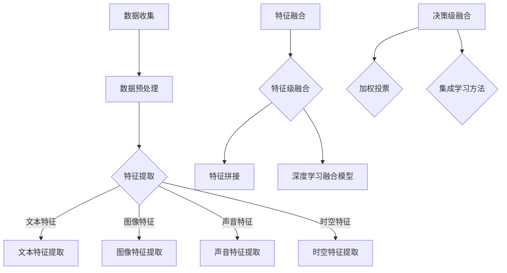

                 

### 1.1 引言

#### ChatGPT的多模态交互概述

ChatGPT是由OpenAI开发的一款基于生成式预训练变换模型（GPT）的人工智能助手，其核心在于能够通过自然语言处理（NLP）技术，生成与人类对话类似的自然语言文本。多模态交互则是指系统不仅处理文本信息，还能处理图像、声音、视频等不同类型的数据，并通过多种感官途径与用户进行交流。

在当今快速发展的技术时代，多模态交互的重要性日益凸显。一方面，多模态交互能够提升用户体验，使交互过程更加自然和丰富；另一方面，多模态交互可以为人工智能系统提供更多的信息输入，从而提高系统的智能水平和决策能力。

ChatGPT在多模态交互中的应用前景广阔，不仅能够用于聊天机器人、客户服务、教育辅导等场景，还能在医疗诊断、智能监控、虚拟现实等领域发挥重要作用。通过结合文本和图像等多种数据类型，ChatGPT可以更加全面地理解和回应用户的需求，实现更加智能化和个性化的服务。

#### 多模态交互的概念

多模态交互是指通过多种感官途径（如视觉、听觉、触觉等）进行信息交互的过程。它不仅限于人类与其他实体（如机器）之间的交互，还包括机器与机器之间的信息交换。在多模态交互中，系统需要处理来自不同模态的数据，并将其整合成统一的、可理解的输出。

多模态交互的核心挑战在于如何有效地融合来自不同模态的数据，以实现更加智能和自然的交互体验。这要求系统具备强大的数据处理和分析能力，能够理解并整合不同模态的数据，从而提供更准确和丰富的信息。

#### ChatGPT在多模态交互中的重要性

ChatGPT作为一款先进的人工智能助手，其在多模态交互中的应用具有重要意义。首先，ChatGPT通过预训练和微调技术，能够理解和生成高质量的自然语言文本，为多模态交互提供了强大的语言处理能力。其次，ChatGPT可以结合图像、声音等非文本数据，实现更加丰富和自然的交互体验，从而提高用户的满意度和使用体验。

此外，ChatGPT的多模态交互能力还可以应用于各种实际场景，如医疗诊断、智能监控、虚拟现实等。在这些场景中，ChatGPT可以通过处理和分析多模态数据，提供更加精准和有效的决策支持，从而提高系统的性能和效率。

总之，ChatGPT的多模态交互能力是其发展的重要方向，也是未来人工智能技术的一个重要趋势。通过不断的研究和应用，ChatGPT有望在多模态交互领域取得更大的突破，为人类社会带来更多的便利和创新。

#### 为什么要研究ChatGPT的多模态交互

研究ChatGPT的多模态交互具有重要的现实意义和科学价值。首先，多模态交互能够提升用户体验，使交互过程更加自然和直观。对于用户而言，能够同时通过文本、图像、声音等多种途径与系统进行交流，能够更好地满足不同场景和需求，从而提高使用体验和满意度。

其次，多模态交互可以显著提高人工智能系统的智能化水平。通过结合不同模态的数据，系统能够获取更加全面和丰富的信息，从而在理解用户需求和提供解决方案时更加准确和高效。例如，在医疗诊断中，结合文本病历和图像检查结果，可以显著提高诊断的准确性和效率。

再次，多模态交互在技术层面上也具有挑战性和发展空间。如何有效地融合和处理多模态数据，实现多模态特征提取和交互策略设计，是当前人工智能研究的重要方向。通过深入研究多模态交互，可以推动相关技术的发展，为未来的智能系统提供更加先进的技术支持。

#### 书籍的目标读者

本书旨在为从事人工智能和自然语言处理领域的研究人员、工程师以及学生提供一本系统、全面、深入的技术指南。具体而言，本书的目标读者包括：

1. **人工智能和自然语言处理领域的研究人员**：本书为研究人员提供了关于ChatGPT多模态交互的系统性研究框架，有助于他们深入了解多模态交互的理论基础和实践方法。

2. **人工智能工程师和开发人员**：本书详细介绍了多模态交互的多种策略和技术，包括规则方法、机器学习方法、深度学习方法等，为工程师们提供了实际开发中可操作的指导。

3. **高等院校学生**：本书内容全面，结构清晰，适合作为高等院校相关专业的教材或参考书，有助于学生系统地学习和掌握多模态交互的相关知识。

4. **对人工智能感兴趣的读者**：无论是否具备专业背景，本书也为广大人工智能爱好者提供了深入了解多模态交互的窗口，帮助他们理解这一领域的最新进展和应用。

#### 主要内容和章节安排

本书共分为三大部分，每部分包含若干章节，具体内容和章节安排如下：

**第一部分：引言与基础**

1. **引言**
   - ChatGPT的多模态交互概述
   - 为什么要研究ChatGPT的多模态交互
   - 书籍的目标读者
   - 主要内容和章节安排

2. **基础知识**
   - ChatGPT的基本原理
   - 多模态交互基础

**第二部分：多模态交互的提示词策略**

1. **提示词策略概述**
   - 提示词在多模态交互中的作用
   - 提示词策略的分类

2. **基于规则的方法**
   - 规则设计原则
   - 案例分析

3. **基于机器学习的方法**
   - 特征工程
   - 模型选择与训练

4. **基于深度学习的方法**
   - 神经网络架构
   - 深度学习模型训练

5. **提示词策略优化**
   - 自动化策略优化
   - 实时调整策略

**第三部分：实战与应用**

1. **数据集准备**
   - 数据集收集
   - 数据预处理流程

2. **实际案例**
   - 案例介绍
   - 项目开发

3. **挑战与展望**
   - 挑战
   - 展望

通过以上章节的安排，本书旨在全面覆盖ChatGPT多模态交互的各个方面，从基础理论到实际应用，帮助读者深入理解和掌握这一前沿技术。

#### 1.2 基础知识

#### 1.2.1 ChatGPT的基本原理

ChatGPT是生成式预训练变换模型（GPT）的一个变体，其核心思想是通过大规模的文本数据进行预训练，从而学会生成高质量的自然语言文本。GPT系列模型由OpenAI开发，基于深度学习技术，特别是变分自编码器（VAE）和自注意力机制（Self-Attention）。

**自然语言处理（NLP）概述**

自然语言处理是人工智能领域的一个重要分支，旨在使计算机能够理解和处理人类语言。NLP的核心任务包括文本分类、命名实体识别、情感分析、机器翻译、文本生成等。ChatGPT的应用正是基于这些NLP技术，通过理解输入文本，生成有意义的自然语言响应。

**生成式预训练变换模型（GPT）简介**

GPT是一种生成式模型，能够根据输入的文本序列生成相应的文本输出。GPT模型的预训练过程主要包括两个阶段：预训练和微调。

- **预训练**：在预训练阶段，模型通过阅读大量的文本数据，学习语言模式和统计规律。预训练数据通常包括互联网上的各种文本，如新闻文章、社交媒体帖子、百科全书等。在这一过程中，模型学会了理解文本的上下文关系和语法结构。

- **微调**：在预训练的基础上，模型可以通过微调适应特定的任务。例如，可以将预训练好的GPT模型用于聊天机器人，通过在特定对话数据集上的训练，使其能够更好地理解和生成符合对话场景的文本。

**ChatGPT的工作原理**

ChatGPT的核心在于其能够根据用户输入的文本生成相应的回答。其工作流程可以概括为以下几个步骤：

1. **输入处理**：用户输入文本后，模型首先对其进行预处理，包括分词、去停用词、词干提取等，以便于模型理解和处理。

2. **上下文理解**：模型利用预训练得到的语言模型，理解输入文本的上下文信息，包括文本的主题、意图和情感等。

3. **生成响应**：基于对上下文的理解，模型生成一个或多个可能的响应文本。这些响应文本通过模型内部的生成算法生成，并且通过自注意力机制进行优化，确保生成文本的连贯性和一致性。

4. **输出结果**：最终，模型输出一个或多个最佳响应文本，供用户参考。用户可以选择其中一个或多个响应文本，继续与系统进行交互。

**自然语言处理（NLP）概述**

自然语言处理（NLP）是人工智能领域的一个分支，旨在使计算机能够理解和处理人类语言。NLP的核心任务包括：

- **文本分类**：将文本数据分为预定义的类别。例如，新闻文章可以根据主题分类为体育、科技、娱乐等。
- **命名实体识别**：识别文本中的特定实体，如人名、地名、组织名等。
- **情感分析**：分析文本的情感倾向，如正面、负面或中性。
- **机器翻译**：将一种语言的文本翻译成另一种语言。
- **文本生成**：根据输入的文本或上下文生成新的文本。

ChatGPT的应用正是基于这些NLP技术。通过理解输入文本，生成有意义的自然语言响应，ChatGPT能够为各种应用场景提供智能化服务。

**生成式预训练变换模型（GPT）简介**

生成式预训练变换模型（GPT）是由OpenAI开发的一种先进的人工智能模型，其核心思想是通过大规模的文本数据进行预训练，从而学会生成高质量的自然语言文本。GPT系列模型基于深度学习技术，特别是变分自编码器（VAE）和自注意力机制（Self-Attention）。

**GPT模型的预训练过程**

GPT模型的预训练过程主要包括两个阶段：预训练和微调。

- **预训练**：在预训练阶段，模型通过阅读大量的文本数据进行学习。预训练数据通常包括互联网上的各种文本，如新闻文章、社交媒体帖子、百科全书等。在这一过程中，模型学会了理解文本的上下文关系和语法结构。预训练的目的是使模型具备通用语言理解和生成能力。

- **微调**：在预训练的基础上，模型可以通过微调适应特定的任务。例如，可以将预训练好的GPT模型用于聊天机器人，通过在特定对话数据集上的训练，使其能够更好地理解和生成符合对话场景的文本。微调的目的是使模型在特定任务上表现更加优秀。

**GPT模型的主要组件**

GPT模型主要包括以下几个关键组件：

- **自注意力机制（Self-Attention）**：自注意力机制是GPT模型的核心组件之一，通过计算文本序列中每个词与所有其他词的关联度，从而实现对文本上下文的全局理解。自注意力机制提高了模型在处理长文本和复杂上下文关系时的能力。
- **变分自编码器（VAE）**：GPT模型采用变分自编码器（VAE）进行预训练，VAE通过引入噪声，使模型在生成文本时具有多样性。这种机制有助于模型在生成文本时避免过度拟合训练数据，提高生成文本的质量和多样性。
- **Transformer结构**：GPT模型采用了Transformer结构，这是一种基于自注意力机制的神经网络架构。Transformer结构能够有效处理长距离依赖关系，从而提高模型在语言理解和生成任务上的性能。

**GPT模型的工作流程**

GPT模型的工作流程可以概括为以下几个步骤：

1. **输入处理**：用户输入文本后，模型首先对其进行预处理，包括分词、去停用词、词干提取等，以便于模型理解和处理。预处理后的文本被编码为词向量，用于输入到模型中。
2. **上下文理解**：模型利用预训练得到的语言模型，理解输入文本的上下文信息，包括文本的主题、意图和情感等。通过自注意力机制，模型能够捕捉文本中的长距离依赖关系，从而实现全局理解。
3. **生成响应**：基于对上下文的理解，模型生成一个或多个可能的响应文本。这些响应文本通过模型内部的生成算法生成，并且通过自注意力机制进行优化，确保生成文本的连贯性和一致性。
4. **输出结果**：最终，模型输出一个或多个最佳响应文本，供用户参考。用户可以选择其中一个或多个响应文本，继续与系统进行交互。

**GPT模型的优势与挑战**

GPT模型在自然语言处理领域取得了显著的成果，具有以下几个优势：

- **强大的语言理解能力**：通过预训练和自注意力机制，GPT模型能够捕捉文本中的复杂结构和长距离依赖关系，从而实现高质量的文本理解和生成。
- **适应性强**：GPT模型可以轻松地微调到特定任务上，使其在特定场景下表现出色。
- **生成文本多样性**：通过变分自编码器，GPT模型在生成文本时具有多样性，避免了生成文本的刻板化和过度拟合。

然而，GPT模型也面临一些挑战：

- **计算资源消耗大**：GPT模型通常需要大量的计算资源进行训练和推理，这限制了其在资源受限设备上的应用。
- **数据依赖性强**：GPT模型的性能很大程度上依赖于预训练数据的质量和数量，如果数据不足或存在偏差，模型的性能可能会受到影响。

**总结**

ChatGPT的基本原理基于生成式预训练变换模型（GPT），通过大规模文本数据进行预训练，使其具备强大的语言理解和生成能力。GPT模型采用自注意力机制和变分自编码器等先进技术，能够捕捉文本中的复杂结构和长距离依赖关系，实现高质量的文本理解和生成。ChatGPT的工作流程包括输入处理、上下文理解、生成响应和输出结果等步骤，通过这些步骤，模型能够生成自然、连贯的文本响应，为各种应用场景提供智能化服务。

#### 1.2.2 多模态交互基础

多模态交互是指系统通过多种感官途径（如视觉、听觉、触觉等）进行信息交互的过程。在人工智能领域，多模态交互已经成为一个重要研究方向，因为它能够显著提升系统的智能水平和用户体验。

**多模态交互的定义**

多模态交互涉及两个或多个不同的感官模态，例如文本、图像、声音和触觉等。这些模态可以单独使用，也可以组合使用，以提供更加丰富和自然的交互体验。例如，在智能助手场景中，用户可以通过语音（听觉模态）进行查询，同时也可以通过屏幕显示的文本和图像（视觉模态）获取信息。

**多模态数据集的收集与处理**

多模态数据集是进行多模态交互研究的基础。这些数据集通常包括多种模态的数据，如文本、图像、声音等。收集这些数据集的过程通常涉及以下步骤：

1. **数据收集**：从互联网、传感器、用户生成的数据等多种渠道收集多模态数据。例如，从社交媒体平台收集文本和图像数据，从摄像头和麦克风收集图像和声音数据。
2. **数据预处理**：对收集到的数据进行清洗、标注和标准化，以便于后续处理。数据预处理包括图像去噪、文本分词、声音去噪等操作。
3. **数据融合**：将不同模态的数据进行融合，形成一个统一的数据表示。数据融合的方法包括特征融合、模态融合和时空融合等。

**多模态特征提取技术**

多模态特征提取是关键步骤，旨在从多模态数据中提取出对任务有帮助的特征。常见的多模态特征提取技术包括：

1. **文本特征提取**：使用词袋模型、TF-IDF、词嵌入等方法提取文本特征。
2. **图像特征提取**：使用卷积神经网络（CNN）提取图像特征，如边缘、纹理、形状等。
3. **声音特征提取**：使用循环神经网络（RNN）、生成对抗网络（GAN）等方法提取声音特征，如频谱特征、时频特征等。
4. **时空特征提取**：对连续的时间序列数据，如视频和音频，使用时空卷积网络（Temporal Convolutional Network, TSN）提取时空特征。

**多模态特征融合方法**

多模态特征融合是将不同模态的特征进行整合，以生成一个统一的多模态特征表示。常见的多模态特征融合方法包括：

1. **特征拼接**：将不同模态的特征进行拼接，形成一个更长的特征向量。
2. **特征级融合**：在特征提取阶段就将不同模态的特征进行融合，如使用多模态深度学习模型（如Multi-modal Fusion Network, MFN）。
3. **决策级融合**：在分类或回归任务的决策阶段将不同模态的特征进行融合，如使用加权投票或集成学习方法。

通过这些技术，多模态交互系统能够更好地理解和响应用户的多样化需求，提供更加自然和高效的交互体验。以下是一个简化的多模态特征提取和融合的流程图：

通过以上步骤，多模态交互系统能够有效地整合来自不同模态的信息，从而提供更加智能和自然的交互体验。

### 2.1 提示词策略概述

#### 2.1.1 提示词在多模态交互中的作用

在多模态交互中，提示词扮演着至关重要的角色。提示词是一种用于引导系统生成特定类型响应的文本提示，其作用主要体现在以下几个方面：

1. **引导交互方向**：提示词能够明确指示系统的交互目标，帮助系统理解用户的需求和意图。例如，当用户输入一个关于旅游的查询时，提示词可以是“推荐一个适合亲子游的景点”，这样可以引导系统生成与亲子游相关的景点推荐。

2. **增强语义理解**：通过提供详细的提示词，系统能够获取更多的上下文信息，从而更好地理解用户的语义。例如，在医疗诊断中，如果提示词是“我的头痛已经持续了一个星期”，这可以为系统提供更多关于症状的信息，有助于更准确的诊断。

3. **优化生成结果**：提示词还可以帮助系统生成更高质量和更符合用户需求的文本输出。例如，在生成新闻摘要时，提示词可以指定新闻的重要性和关键信息，从而生成更加准确和精练的摘要。

**提示词对多模态交互质量的影响**

提示词的设计和质量直接影响到多模态交互的质量。以下是几个关键方面的影响：

1. **交互连贯性**：高质量的提示词能够确保交互过程的连贯性，避免出现突兀或无关的响应。例如，如果提示词明确指示了用户的需求，系统生成的响应也会更加自然和流畅。

2. **交互准确性**：合适的提示词可以提供足够的上下文信息，从而提高系统理解用户意图的准确性。这对于多模态交互系统特别重要，因为不同模态的数据可能包含不同的信息，而提示词能够帮助系统整合这些信息。

3. **用户满意度**：提示词的设计直接影响用户的满意度。如果提示词能够准确反映用户的意图，系统生成的响应也会更加符合用户的期望，从而提高用户的满意度。

**提示词设计的挑战**

尽管提示词在多模态交互中具有重要作用，但其设计也面临一系列挑战：

1. **多样性和灵活性**：提示词需要具备多样性和灵活性，以适应不同用户和场景的需求。然而，设计足够多样且适用于各种情况的提示词是一个复杂的问题。

2. **上下文适应性**：提示词需要能够适应不同的上下文环境，确保在多变的环境中仍然能够引导出合适的交互结果。例如，同一条提示词在不同语境下可能需要不同的解释。

3. **计算效率**：设计提示词时需要考虑计算效率，尤其是在实时交互场景中。过于复杂或冗长的提示词可能会增加系统的计算负担，影响交互的实时性。

**结论**

提示词在多模态交互中的作用不可忽视，它不仅能够引导交互方向，增强语义理解，还能优化生成结果，提高交互质量和用户满意度。然而，设计高质量的提示词也面临多样性和灵活性、上下文适应性以及计算效率等挑战。在接下来的章节中，我们将深入探讨基于规则、机器学习和深度学习的不同提示词策略，以解决这些挑战，提升多模态交互系统的性能和用户体验。

#### 2.1.2 提示词策略的分类

在多模态交互中，提示词策略可以根据实现方法主要分为以下几类：基于规则的方法、基于机器学习的方法和基于深度学习的方法。每种方法都有其独特的特点和适用场景，下面我们将逐一进行介绍。

**基于规则的方法**

基于规则的方法是通过预先定义的规则来指导系统生成响应。这种方法的核心在于设计一组明确的规则，这些规则根据输入的模态信息和上下文来决定系统的输出。

1. **规则设计原则**：
   - **明确性**：规则需要明确、具体，避免模糊或歧义，以便系统能够准确理解。
   - **可扩展性**：规则设计应具备良好的扩展性，能够适应新的模态信息和场景。
   - **可维护性**：规则应易于维护和更新，以适应不断变化的需求。

2. **规则组合策略**：
   - **顺序组合**：按照特定的顺序执行多个规则，适用于线性关系较强的场景。
   - **并行组合**：同时执行多个规则，适用于需要综合考虑多个模态信息的场景。
   - **优先级组合**：根据规则的重要程度设置优先级，优先执行重要规则。

3. **应用场景**：
   - **简单的交互场景**：如简单的客户服务系统，用户输入的问题较为直接，系统可以根据预定义的规则快速生成响应。
   - **领域特定的应用**：如医疗诊断系统，通过预定义的医学规则，结合用户输入的症状描述，生成诊断建议。

**基于机器学习的方法**

基于机器学习的方法通过从数据中学习规律来生成提示词。这种方法通常需要大量的标注数据，通过训练模型来预测最合适的提示词。

1. **特征工程**：
   - **文本特征**：如词袋模型、TF-IDF、词嵌入等。
   - **图像特征**：如卷积神经网络（CNN）提取的边缘、纹理、形状等。
   - **声音特征**：如频谱特征、时频特征等。

2. **模型选择与训练**：
   - **监督学习模型**：如支持向量机（SVM）、朴素贝叶斯（Naive Bayes）等。
   - **深度学习模型**：如卷积神经网络（CNN）、循环神经网络（RNN）、长短时记忆网络（LSTM）等。

3. **评估方法**：
   - **准确率**：预测提示词与真实提示词匹配的比率。
   - **召回率**：预测到至少一个正确提示词的比率。
   - **F1值**：准确率和召回率的调和平均值。

4. **应用场景**：
   - **复杂的交互场景**：如智能家居系统，用户输入和需求复杂多变，通过机器学习方法能够更好地理解和生成响应。
   - **自适应系统**：通过不断的学习和调整，系统能够适应用户的使用习惯和需求变化。

**基于深度学习的方法**

基于深度学习的方法利用神经网络模型从大量数据中自动学习特征和模式，生成高质量的提示词。

1. **神经网络架构**：
   - **卷积神经网络（CNN）**：擅长处理图像数据，用于提取图像特征。
   - **递归神经网络（RNN）**：擅长处理序列数据，如文本和声音。
   - **生成对抗网络（GAN）**：用于生成高质量的提示词。

2. **训练方法**：
   - **损失函数**：如交叉熵损失函数用于分类问题，均方误差（MSE）用于回归问题。
   - **优化器**：如随机梯度下降（SGD）、Adam等。

3. **应用场景**：
   - **高要求的交互场景**：如自动驾驶系统，需要准确理解驾驶员的意图，生成安全的驾驶指令。
   - **创意生成**：如文本生成艺术作品，通过深度学习模型生成具有艺术价值的文本。

通过以上三种提示词策略的分类和介绍，我们可以看到每种方法都有其独特的优势和适用场景。在实际应用中，可以根据具体需求和场景选择合适的方法，以实现高质量的多模态交互。

#### 2.2 基于规则的方法

在多模态交互中，基于规则的方法是一种传统的策略，通过预先定义的规则来指导系统生成响应。这种方法的优势在于其简单、直观和可解释性，但也存在一定的局限性。本节将详细讨论基于规则的方法，包括规则设计原则、规则组合策略及其在实际应用中的案例分析。

##### 2.2.1 规则设计原则

规则设计原则是多模态交互系统中至关重要的环节，决定了系统能否准确理解和生成合适的响应。以下是一些关键的规则设计原则：

1. **明确性**：
   - 规则的表述必须清晰、具体，避免模糊或歧义。例如，一个规则可以是“如果用户输入关于旅游的查询，则生成景点推荐”，而不是模糊的描述如“生成旅游相关信息”。

2. **完整性**：
   - 规则应该覆盖所有的可能情况和场景，确保系统能够处理各种输入。例如，在医疗诊断系统中，规则需要覆盖各种病症的症状和处理方法。

3. **简洁性**：
   - 规则应尽量简洁，避免冗长和复杂的组合。复杂的规则不仅难以理解，还可能增加错误率。例如，一个简洁的规则可以是“如果用户描述头痛，则询问头痛的持续时间”，而不是“如果用户描述头部疼痛，且疼痛持续超过一天，则询问疼痛的具体时间和位置”。

4. **可维护性**：
   - 规则应该易于维护和更新，以适应新的需求和变化。这意味着规则的设计应具备良好的模块化，方便未来的调整和扩展。

5. **一致性**：
   - 规则之间应保持一致，避免出现冲突或矛盾。例如，如果两个规则都指向同一个输出，那么这两个规则需要统一和协调。

##### 2.2.2 规则组合策略

在多模态交互中，单一规则可能无法应对复杂的交互需求，因此需要多种规则组合使用。以下是一些常用的规则组合策略：

1. **顺序组合**：
   - 按照特定的顺序执行多个规则。这种方法适用于线性关系较强的场景，例如在客户服务系统中，可以先执行一个规则来识别用户的基本需求，再根据识别结果执行后续的规则。

2. **并行组合**：
   - 同时执行多个规则，适用于需要综合考虑多个模态信息的场景。例如，在智能家居系统中，当用户同时发送语音和手势指令时，系统可以并行处理这两种模态的规则。

3. **优先级组合**：
   - 根据规则的重要程度设置优先级，优先执行重要规则。这种方法适用于存在主次关系或优先级的场景，例如在医疗诊断系统中，优先执行诊断规则，再执行辅助检查规则。

4. **条件组合**：
   - 根据输入条件和上下文信息动态选择规则。这种方法通过结合条件逻辑和规则库，实现更灵活和适应性强的交互。例如，在语音助手系统中，根据用户的语音语调和上下文，动态选择合适的语音合成规则。

##### 2.2.3 案例分析

以下是一个基于规则的方法在多模态交互中的实际案例：

**案例背景**：
假设一个多模态交互系统旨在提供旅游推荐服务，用户可以通过文本输入（如“我想去一个风景优美但不太拥挤的地方”）或语音输入（如“帮我找一个风景好但不热闹的地方”）来获取旅游建议。

**规则设计**：

1. **文本输入规则**：
   - 如果用户输入包含“风景优美”和“不拥挤”，则生成推荐景点的文本描述。
   - 如果用户输入包含“风景一般”和“人流较小”，则生成次优的景点推荐。

2. **语音输入规则**：
   - 如果用户语音中包含“美丽”和“不热闹”，则生成推荐景点的语音描述。
   - 如果用户语音中包含“普通”和“不拥挤”，则生成次优的景点推荐语音描述。

**规则组合策略**：
- 顺序组合：首先根据输入模态（文本或语音）选择相应的规则集，然后按照规则顺序执行。
- 并行组合：对于同时接收文本和语音输入的情况，可以并行执行两种模态的规则，并根据规则组合的结果生成最终的推荐。

**案例分析**：

**用户文本输入**：“我想去一个风景优美但不太拥挤的地方”。

**系统响应**：
- 规则1触发，系统生成如下的文本描述：“为您推荐张家界国家森林公园，这里风景优美，但游客相对较少，非常适合您放松心情。”

**用户语音输入**：“帮我找一个风景好但不热闹的地方”。

**系统响应**：
- 规则1触发，系统生成如下的语音描述：“根据您的需求，我为您推荐张家界国家森林公园，这里的风景非常优美，而且游客不多，非常适合您游览。”

通过这个案例分析，我们可以看到基于规则的方法如何应用于多模态交互，通过明确的规则设计和灵活的组合策略，系统能够生成符合用户需求的响应，提供高质量的服务。

#### 2.3 基于机器学习的方法

在多模态交互中，基于机器学习的方法通过从大量数据中学习模式来生成高质量的提示词。这种方法的优势在于其能够自动提取特征，适应性强，能够处理复杂的交互需求。以下将详细讨论基于机器学习的方法，包括特征工程、模型选择与训练以及评估方法。

##### 2.3.1 特征工程

特征工程是机器学习模型成功的关键步骤，尤其在多模态交互中。特征工程的目标是从原始数据中提取对任务有帮助的特征，以提升模型的性能。以下是多模态特征工程中常用的技术：

1. **文本特征提取**：
   - **词袋模型**（Bag of Words, BoW）：将文本表示为一个向量，其中每个维度对应一个词汇。这种方法简单，但忽略了词汇的顺序和上下文信息。
   - **TF-IDF**（Term Frequency-Inverse Document Frequency）：在BoW的基础上，引入词汇的重要程度，通过计算词频和逆文档频率来加权词汇。
   - **词嵌入**（Word Embedding）：将词汇映射到低维稠密向量，如Word2Vec、GloVe等。这种方法能够捕捉词汇的语义关系，提升模型的语义理解能力。

2. **图像特征提取**：
   - **卷积神经网络**（Convolutional Neural Network, CNN）：通过多层卷积和池化操作，提取图像的局部特征。CNN在图像分类和特征提取中表现出色。
   - **特征提取工具**：如OpenCV和TensorFlow等，提供了丰富的图像处理和特征提取函数库。

3. **声音特征提取**：
   - **频谱特征**：如梅尔频率倒谱系数（Mel-Frequency Cepstral Coefficients, MFCC），用于表示声音的频率特性。
   - **时频特征**：如短时傅里叶变换（Short-Time Fourier Transform, STFT），用于表示声音的时间频率分布。

4. **时空特征提取**：
   - **多模态深度学习模型**：如时空卷积神经网络（Temporal Convolutional Network, TSN）和3D卷积神经网络（3D Convolutional Neural Network, 3D-CNN），用于提取和融合图像和视频的时间序列特征。

##### 2.3.2 模型选择与训练

在特征工程完成后，选择合适的机器学习模型并对其进行训练是关键步骤。以下是几种常用的机器学习模型及其训练方法：

1. **监督学习模型**：
   - **支持向量机**（Support Vector Machine, SVM）：通过最大化分类边界来分类数据。SVM在处理高维数据和小样本问题时表现出色。
   - **朴素贝叶斯分类器**（Naive Bayes）：基于贝叶斯定理和特征条件独立性假设进行分类。朴素贝叶斯分类器简单且高效，适用于文本分类和垃圾邮件检测。
   - **决策树和随机森林**：通过构建决策树或集成多个决策树来进行分类和回归。随机森林在处理复杂数据集时具有很好的性能和鲁棒性。

2. **深度学习模型**：
   - **卷积神经网络**（CNN）：适用于处理图像和视频数据，通过卷积和池化操作提取特征。
   - **循环神经网络**（Recurrent Neural Network, RNN）：适用于处理序列数据，如文本和语音，通过隐藏状态记忆序列信息。
   - **长短时记忆网络**（Long Short-Term Memory, LSTM）：是RNN的一种改进，能够更好地处理长序列数据，通过门控机制控制信息的流动。
   - **生成对抗网络**（Generative Adversarial Network, GAN）：由生成器和判别器两个神经网络组成，生成器尝试生成逼真的数据，判别器判断生成数据与真实数据的区别。

在模型选择和训练过程中，以下步骤是必不可少的：

- **数据预处理**：对输入数据进行标准化、缺失值处理等操作，确保数据的一致性和质量。
- **模型参数调整**：通过交叉验证和超参数调优，选择最佳的模型参数，以提高模型的性能和泛化能力。
- **训练与验证**：使用训练数据训练模型，并通过验证数据评估模型性能，确保模型不会过拟合。

##### 2.3.3 评估方法

评估模型性能是确保多模态交互系统有效性的关键。以下是几种常用的评估方法：

1. **准确率**（Accuracy）：预测正确的样本数占总样本数的比例。虽然准确率简单直观，但在类别不平衡的数据集上可能不够准确。

2. **召回率**（Recall）：预测正确的正样本数占总正样本数的比例。召回率关注的是模型对正样本的识别能力。

3. **F1值**（F1 Score）：准确率和召回率的调和平均值，能够平衡两者之间的权衡。F1值是评估二分类问题的重要指标。

4. **精确率**（Precision）：预测正确的正样本数与预测为正样本的总数之比。精确率关注的是模型的分类精度。

5. **ROC曲线**（Receiver Operating Characteristic Curve）：通过计算不同阈值下的真阳性率（True Positive Rate, TPR）和假阳性率（False Positive Rate, FPR），评估模型的分类性能。

6. **AUC值**（Area Under Curve）：ROC曲线下的面积，用于评估模型对正负样本的区分能力。AUC值越接近1，表示模型性能越好。

通过以上特征工程、模型选择与训练以及评估方法的详细讨论，我们可以看到基于机器学习的方法在多模态交互中的应用潜力和重要性。在实际应用中，通过不断优化特征提取和模型训练，多模态交互系统能够更好地理解和生成高质量的提示词，提升用户体验。

### 2.4 基于深度学习的方法

在多模态交互中，基于深度学习的方法因其强大的特征提取能力和端到端的学习方式，成为了当前研究和应用的热点。以下将详细探讨基于深度学习的方法，包括常见的神经网络架构、模型训练流程及优化策略。

#### 2.4.1 神经网络架构

深度学习在多模态交互中的应用主要通过构建复杂的多层神经网络来实现。以下介绍几种常用的神经网络架构：

1. **卷积神经网络（CNN）**：
   - **基本结构**：CNN通过卷积层和池化层提取图像的局部特征。卷积层通过卷积操作捕捉图像的边缘、纹理和形状特征，而池化层用于降低特征维度，减少计算量。
   - **应用场景**：CNN在图像识别、物体检测和图像生成等任务中表现出色。在多模态交互中，CNN常用于提取图像特征，与其他模态的特征进行融合。

2. **递归神经网络（RNN）**：
   - **基本结构**：RNN通过循环连接将当前输入与历史状态关联，能够处理序列数据。RNN包括简单的循环层和改进的LSTM、GRU等变体。
   - **应用场景**：RNN在自然语言处理、语音识别和时间序列分析等领域有广泛应用。在多模态交互中，RNN用于处理文本和语音序列，捕捉模态间的动态关系。

3. **长短时记忆网络（LSTM）**：
   - **基本结构**：LSTM是RNN的一种改进，通过引入记忆单元和门控机制，能够更好地处理长序列数据。
   - **应用场景**：LSTM在语音识别、机器翻译和文本生成等长序列任务中表现出色。在多模态交互中，LSTM能够捕捉不同模态之间的长期依赖关系。

4. **生成对抗网络（GAN）**：
   - **基本结构**：GAN由生成器和判别器两个神经网络组成，生成器尝试生成逼真的数据，而判别器区分生成数据和真实数据。
   - **应用场景**：GAN在图像生成、数据增强和异常检测等领域有广泛应用。在多模态交互中，GAN可以用于生成高质量的多模态数据，提高模型的训练效果。

5. **多模态深度学习模型**：
   - **基本结构**：多模态深度学习模型通过整合不同模态的特征，构建统一的特征表示。常见的多模态深度学习模型包括联合嵌入模型（Joint Embedding Model）和时空卷积神经网络（Spatial Temporal Convolutional Network, STCN）。
   - **应用场景**：多模态深度学习模型在视频识别、虚拟现实和智能监控等任务中表现出色。在多模态交互中，多模态深度学习模型能够同时处理文本、图像、声音等多种数据，实现更自然的交互体验。

#### 2.4.2 深度学习模型训练

深度学习模型的训练是一个复杂的过程，涉及数据预处理、模型参数初始化、损失函数选择和优化器配置等关键步骤。

1. **数据预处理**：
   - **数据标准化**：对输入数据进行归一化或标准化处理，确保数据的一致性和质量。
   - **数据增强**：通过随机裁剪、旋转、翻转等操作增加数据的多样性，提高模型的泛化能力。
   - **数据分割**：将数据集分为训练集、验证集和测试集，用于模型的训练、验证和测试。

2. **模型参数初始化**：
   - **权重初始化**：选择合适的权重初始化方法，如高斯分布、均匀分布等，以避免模型收敛缓慢或梯度消失等问题。
   - **学习率初始化**：选择合适的学习率，如固定学习率、自适应学习率（如Adam优化器）等，以平衡模型的收敛速度和稳定性。

3. **损失函数选择**：
   - **分类问题**：常用的损失函数包括交叉熵损失（Cross-Entropy Loss）和均方误差（Mean Squared Error, MSE）。交叉熵损失适用于多分类问题，而MSE适用于回归问题。
   - **生成问题**：在生成对抗网络（GAN）中，常用的损失函数包括生成器损失和判别器损失。生成器损失通常使用均方误差或二元交叉熵，而判别器损失使用二元交叉熵。

4. **优化器配置**：
   - **随机梯度下降（SGD）**：SGD是一种简单且有效的优化方法，通过随机梯度更新模型参数。
   - **自适应优化器**：如Adam优化器，能够自适应调整学习率，提高模型的训练效率。
   - **动量优化器**：如SGD-Momentum，通过引入动量项，加速梯度更新。

5. **训练流程**：
   - **迭代训练**：通过多个迭代周期（Epoch）对模型进行训练，每个迭代周期包括前向传播、后向传播和参数更新。
   - **验证和测试**：在验证集和测试集上评估模型性能，确保模型具有良好的泛化能力。

#### 2.4.3 模型优化策略

深度学习模型的优化策略旨在提高模型性能和训练效率。以下是一些常见的优化策略：

1. **数据增强**：
   - **随机裁剪**：通过随机裁剪图像或文本，增加数据的多样性和模型的鲁棒性。
   - **旋转和翻转**：对图像和文本进行旋转和翻转，模拟不同的输入场景。
   - **噪声注入**：在输入数据中加入噪声，提高模型对噪声的鲁棒性。

2. **模型正则化**：
   - **L1和L2正则化**：通过在损失函数中添加L1或L2正则化项，防止模型过拟合。
   - **dropout**：在训练过程中随机丢弃一部分神经元，降低模型的过拟合风险。

3. **学习率调度**：
   - **固定学习率**：在训练初期使用较大的学习率，以加快模型收敛。
   - **学习率衰减**：在训练过程中逐渐减小学习率，提高模型的稳定性和收敛速度。
   - **自适应学习率**：使用如Adam等自适应优化器，自动调整学习率。

4. **提前停止**：
   - 在验证集上监控模型性能，当模型在验证集上的性能不再提升时，提前停止训练，防止过拟合。

5. **模型集成**：
   - **Bagging**：通过训练多个模型，取其平均值或投票结果，提高模型的泛化能力。
   - **Boosting**：通过训练多个模型，每次迭代对错误样本进行加权，提高弱学习器的性能。

通过以上对基于深度学习方法的多层神经网络架构、模型训练流程及优化策略的详细讨论，我们可以看到深度学习在多模态交互中的重要性和应用潜力。在实际应用中，通过合理设计神经网络结构、优化训练过程和模型参数，多模态交互系统能够更好地理解和生成高质量的多模态提示词，提供更自然的交互体验。

#### 2.5 提示词策略优化

在多模态交互中，提示词策略的优化是一个关键环节，它直接影响到系统的性能和用户体验。优化策略主要包括自动化策略优化和实时调整策略，这两种方法在具体实现和应用中各有特点和优势。

##### 2.5.1 自动化策略优化

自动化策略优化通过算法和机器学习技术自动调整和优化提示词策略。以下是一些常用的自动化优化方法：

1. **强化学习**：
   - **Q-learning**：Q-learning是一种值迭代方法，通过学习状态-动作值函数，优化策略选择。在多模态交互中，Q-learning可以用于优化提示词策略，通过奖励机制调整策略。
   - **Deep Q-Network（DQN）**：DQN是Q-learning的深度学习版本，通过神经网络近似值函数，提高策略优化的效率和效果。DQN适用于复杂环境，能够处理高维状态空间。

2. **遗传算法**：
   - **遗传算法**（Genetic Algorithm, GA）是一种基于自然选择的优化算法。在多模态交互中，GA可以通过遗传操作（交叉、变异）和选择机制（自然选择、适者生存）来优化提示词策略。

3. **基于梯度提升的优化**：
   - **XGBoost**：XGBoost是一种高效的梯度提升决策树算法，通过构建多层次的决策树模型，逐步优化提示词策略。XGBoost在处理大规模数据和复杂数据集时表现出色。

4. **基于神经网络的方法**：
   - **深度强化学习**：结合深度学习和强化学习，通过神经网络学习策略参数，实现自动化优化。深度强化学习能够处理高维状态空间和复杂的策略空间。

**自动化策略优化流程**：

1. **定义优化目标**：明确优化目标，如提升交互质量、降低响应时间或提高用户满意度。
2. **数据采集**：从实际交互过程中收集数据，包括用户输入、系统响应和用户反馈。
3. **特征提取**：从采集的数据中提取特征，用于训练和优化策略。
4. **模型训练**：使用训练数据训练优化模型，如Q-learning模型、DQN模型或XGBoost模型。
5. **策略评估**：在验证集上评估优化策略的性能，选择最佳策略。
6. **策略部署**：将优化策略部署到实际系统中，实时调整和优化提示词策略。

**自动化策略优化的优点**：

- **高效性**：通过算法自动化优化，能够快速调整和优化策略，提高系统性能。
- **灵活性**：能够适应不同的交互场景和用户需求，实现个性化优化。
- **可扩展性**：适用于大规模交互系统，能够处理多模态和多用户的复杂交互场景。

##### 2.5.2 实时调整策略

实时调整策略是指在交互过程中，根据用户反馈和系统状态动态调整提示词策略。这种方法能够提供更加灵活和自然的交互体验。以下是一些实时调整策略的方法：

1. **用户反馈调整**：
   - **基于反馈的调整**：根据用户的实时反馈（如点赞、评论、评分）调整提示词策略。如果用户对某个提示词反馈积极，可以增加该提示词的使用频率。
   - **个性化调整**：根据用户的偏好和历史交互数据，动态调整提示词策略。例如，对于喜欢幽默的用户，可以增加幽默性的提示词。

2. **系统状态调整**：
   - **基于状态的调整**：根据系统的实时状态（如资源负载、系统性能）动态调整提示词策略。例如，在高负载情况下，可以减少复杂和多模态的提示词，提高系统的响应速度。

3. **基于规则的调整**：
   - **规则动态调整**：通过预定义的规则，根据交互过程中的上下文信息动态调整提示词。例如，在特定时间或场景下，切换到不同的提示词策略。

**实时调整策略的优点**：

- **灵活性**：能够根据实时交互数据动态调整策略，提供更加自然和个性化的交互体验。
- **实时性**：能够快速响应用户反馈和系统状态，提供及时和高效的交互支持。
- **适应性**：能够适应不同用户和环境的变化，提高系统的鲁棒性和适应性。

**结论**

提示词策略的优化是多模态交互系统提升性能和用户体验的关键。自动化策略优化和实时调整策略是两种重要的优化方法。自动化策略优化通过算法和机器学习技术实现策略的自动化调整，高效且灵活；实时调整策略则通过动态调整策略，提供更加个性化和自然的交互体验。在实际应用中，可以根据具体需求和场景，结合使用这两种优化方法，实现最佳的多模态交互效果。

### 3.1 数据集准备

在开发多模态交互系统时，数据集的准备是一个至关重要的环节。数据集的质量直接影响到模型的训练效果和最终系统的性能。以下将详细介绍多模态数据集的收集、预处理流程和标注方法。

#### 3.1.1 数据集收集

多模态数据集的收集需要从多个来源获取不同模态的数据，包括文本、图像、声音和视频等。以下是一些常用的数据收集方法：

1. **互联网收集**：
   - **社交媒体**：从社交媒体平台（如Twitter、Facebook、Instagram）收集文本、图像和视频数据。这些平台拥有庞大的用户生成内容，能够提供丰富的多模态数据。
   - **公共数据集**：从公共数据集网站（如Kaggle、Google Dataset Search）获取预收集的多模态数据集。这些数据集通常已经过预处理，可以直接用于模型训练。

2. **传感器数据**：
   - **设备采集**：使用智能手机、平板电脑、可穿戴设备等设备上的传感器（如摄像头、麦克风、加速度计）收集图像、声音和运动数据。
   - **实验环境**：在特定实验环境中，通过设置不同的传感器采集多模态数据。例如，在智能交互系统测试中，使用摄像头、麦克风和运动传感器收集用户行为数据。

3. **用户生成数据**：
   - **众包平台**：通过众包平台（如Amazon Mechanical Turk）招募参与者，收集用户生成的内容。这些内容可以是文本、图像、声音等多种模态的数据。
   - **在线调查**：通过在线调查收集用户的多模态数据，例如通过问卷收集文本和图片，通过音频问卷收集语音数据。

#### 3.1.2 数据预处理流程

收集到的多模态数据通常需要进行预处理，以提高数据的质量和一致性，为后续的模型训练和评估打下基础。以下是一些常用的预处理步骤：

1. **数据清洗**：
   - **文本数据**：去除无关的停用词、标点符号和噪声文本，确保文本的干净和可处理性。
   - **图像数据**：去除噪声和背景，对图像进行去噪、增强和尺寸调整，使其符合后续处理需求。
   - **声音数据**：去除噪声，进行声音增强，对音频信号进行降采样或升采样，确保音频信号的质量和一致性。

2. **数据标准化**：
   - **文本数据**：将文本转换为统一的大小写格式，对文本进行分词和词干提取，确保文本表示的一致性。
   - **图像数据**：对图像进行归一化处理，将其缩放到相同的尺寸，以便后续的特征提取和模型训练。
   - **声音数据**：对音频信号进行归一化处理，确保不同长度的音频信号在相同的范围内。

3. **数据增强**：
   - **文本数据**：通过随机替换、随机删除、添加噪声等方法增加数据的多样性，提高模型的泛化能力。
   - **图像数据**：通过随机裁剪、旋转、翻转、颜色调整等方法增加图像的多样性，提升模型的鲁棒性。
   - **声音数据**：通过随机裁剪、叠加噪声、改变音调等方法增加声音数据的多样性。

4. **数据分割**：
   - **训练集、验证集和测试集**：将数据集按照一定比例（例如70%训练集、15%验证集、15%测试集）进行划分，确保模型在不同数据集上的性能评估。

#### 3.1.3 数据标注

数据标注是确保数据集质量和准确性的重要步骤。以下是多模态数据标注的方法和工具：

1. **文本标注**：
   - **词级标注**：对文本数据进行词级别标注，标注出每个词汇的语义类别（如名词、动词等）。
   - **句级标注**：对文本数据中的句子进行标注，标注出句子的语义角色和关系（如主语、谓语等）。
   - **语义角色标注工具**：如NLTK、Spacy等，提供了丰富的文本处理和标注功能。

2. **图像标注**：
   - **框标注**：对图像中的物体进行边界框标注，标注出物体的位置和类别。
   - **语义分割**：对图像的每个像素进行标注，确定每个像素的语义类别。
   - **图像标注工具**：如LabelImg、VGG Image Annotator等，提供了方便的图像标注功能。

3. **声音标注**：
   - **音素标注**：对语音信号进行音素级别标注，标注出每个音素的发音。
   - **声学特征标注**：标注声音的音高、音强、时长等声学特征。
   - **语音识别工具**：如Kaldi、ESPnet等，提供了强大的语音处理和标注功能。

4. **视频标注**：
   - **帧级标注**：对视频中的每一帧进行标注，标注出关键事件和物体。
   - **行为识别**：标注视频中的行为和动作，如行走、跳跃等。
   - **视频标注工具**：如Video Annotation Tool、Annotator.js等，提供了视频标注的界面和功能。

通过以上数据集的收集、预处理和标注流程，我们可以确保数据集的质量和一致性，为后续的模型训练和评估提供可靠的数据支持。数据集的多样性和标注的准确性直接影响到多模态交互系统的性能和用户体验，因此在实际应用中应高度重视数据集的准备和标注工作。

#### 3.2 实际案例

在本部分，我们将通过一个具体的实际案例，详细展示如何应用多模态交互技术进行项目开发，包括环境搭建、模型设计、提示词策略实施和结果评估。

**案例背景**：
假设我们要开发一个智能客户服务系统，该系统能够通过文本和图像两种模态与客户进行交互，提供高质量的客户服务。该系统的主要功能包括：接收客户通过文字和图像输入的问题，理解客户的问题，并通过图像和文本两种方式给出详细的回答和建议。

**一、环境搭建**

为了确保项目顺利运行，我们需要搭建合适的环境，包括硬件和软件。

1. **硬件环境**：
   - **计算资源**：使用高性能GPU服务器，以支持深度学习模型的训练和推理。
   - **存储设备**：配置大容量存储设备，以存储多模态数据集和训练结果。

2. **软件环境**：
   - **操作系统**：安装Linux操作系统，如Ubuntu 20.04，以保证系统的稳定性和兼容性。
   - **深度学习框架**：安装TensorFlow 2.x或PyTorch，用于构建和训练深度学习模型。
   - **多模态数据处理库**：安装OpenCV、Pillow等库，用于处理图像数据。
   - **文本处理库**：安装NLTK、Spacy等库，用于处理文本数据。

**二、模型设计**

我们的目标是构建一个多模态交互模型，能够同时处理文本和图像输入，并生成高质量的文本和图像响应。模型的设计分为以下几个步骤：

1. **文本处理模块**：
   - **词嵌入层**：使用预训练的词嵌入模型（如GloVe或Word2Vec）对输入文本进行编码。
   - **编码器**：采用双向LSTM或Transformer结构，对文本数据进行编码，提取高层次的语义特征。

2. **图像处理模块**：
   - **特征提取器**：使用卷积神经网络（如ResNet或VGG）提取图像特征。
   - **图像编码器**：对提取的图像特征进行编码，生成图像的固定长度向量。

3. **多模态融合模块**：
   - **融合层**：通过拼接或融合策略（如Attention机制）将文本和图像特征进行融合，生成统一的多模态特征向量。

4. **响应生成模块**：
   - **解码器**：采用Transformer或GRU等结构，对融合后的多模态特征向量进行解码，生成文本和图像响应。

**三、提示词策略实施**

在模型设计完成后，我们需要设计合适的提示词策略，以引导模型生成高质量的响应。

1. **基于规则的提示词策略**：
   - 设计一系列规则，根据客户输入的问题类型和上下文，选择合适的提示词。例如，对于图像输入，提示词可以是“请上传一张相关的图片”。

2. **基于机器学习的提示词策略**：
   - 利用训练数据，通过监督学习模型（如SVM或CNN）预测最合适的提示词。例如，对于文本输入，可以使用文本分类模型预测相应的提示词。

3. **基于深度学习的提示词策略**：
   - 采用生成对抗网络（GAN）或变分自编码器（VAE）生成高质量的提示词。例如，可以训练一个GAN模型，生成与客户输入相关的文本提示词。

**四、结果评估**

在模型和提示词策略实施后，我们需要对系统的性能进行评估，以确保其能够提供高质量的客户服务。

1. **准确性评估**：
   - 使用测试集对模型进行评估，计算文本和图像响应的准确率。例如，可以使用BLEU分数评估文本响应的准确性，使用IoU评估图像响应的准确性。

2. **用户满意度评估**：
   - 通过用户问卷调查或在线反馈收集用户对系统响应的满意度评分，评估系统的用户体验。

3. **实时性能评估**：
   - 在实际运行环境中，监控系统的响应时间、延迟和资源消耗，确保系统在真实场景中的性能和稳定性。

**五、案例分析**

以下是一个具体的案例分析：

1. **用户输入**：客户通过文字输入“我的手机屏幕裂了，怎么办？”。
2. **文本处理模块**：文本处理模块将输入文本编码为词嵌入向量，并通过双向LSTM提取语义特征。
3. **图像处理模块**：客户上传一张屏幕裂开的图片，图像处理模块提取图像特征。
4. **多模态融合模块**：融合层将文本和图像特征进行拼接，生成统一的多模态特征向量。
5. **响应生成模块**：解码器基于融合后的特征向量生成文本和图像响应：“建议您前往手机维修店检查，可能需要更换屏幕。以下是一张屏幕裂开的示例图片：[图像]”。

6. **结果评估**：通过测试集对模型进行评估，计算文本响应的准确率和用户满意度。

通过以上案例分析，我们可以看到如何通过多模态交互技术实现智能客户服务系统，包括环境搭建、模型设计、提示词策略实施和结果评估。在实际应用中，可以根据具体需求和场景，调整和优化模型设计和提示词策略，提升系统的性能和用户体验。

#### 3.3 挑战与展望

在多模态交互技术的研究和应用过程中，我们面临诸多挑战，同时也拥有广阔的发展前景。以下将对这些挑战和展望进行详细分析。

##### 挑战

1. **数据集质量**：
   - 多模态数据集的收集和标注是一个复杂且耗时的过程。数据的不完整、噪声和标注错误都会影响模型的效果。因此，如何高效地收集高质量的多模态数据，并保证其标注的准确性，是当前的一个重要挑战。

2. **特征融合**：
   - 多模态数据具有不同的特征和维度，如何有效地融合这些特征是一个难题。简单拼接或线性组合可能无法充分捕捉不同模态之间的复杂关系，导致信息丢失或冗余。因此，设计有效的多模态特征融合方法，是实现高质量多模态交互的关键。

3. **计算资源消耗**：
   - 多模态交互模型通常需要大量的计算资源进行训练和推理。尤其是在处理高分辨率图像和长时间音频数据时，计算资源的需求更加显著。如何优化模型结构和算法，降低计算资源消耗，是确保多模态交互系统能够在实时应用中高效运行的关键。

4. **实时性能**：
   - 多模态交互系统需要在短时间内处理来自不同模态的数据，生成准确的响应。然而，复杂的多模态模型和特征融合算法往往导致较高的延迟。如何在保证模型性能的同时，提高系统的实时性，是当前研究的一个重要方向。

5. **用户隐私保护**：
   - 多模态交互系统通常涉及用户的个人数据，如语音、图像、文本等。如何有效保护用户隐私，防止数据泄露和滥用，是一个重要的法律和道德问题。因此，如何在设计和应用多模态交互技术时，确保用户隐私保护，是未来的一个重要挑战。

##### 展望

1. **技术突破**：
   - 随着深度学习、生成对抗网络（GAN）等技术的不断发展，多模态交互技术在特征提取、模型设计和算法优化等方面有望取得重大突破。通过引入更先进的神经网络架构和优化算法，有望进一步提升多模态交互系统的性能和用户体验。

2. **应用拓展**：
   - 多模态交互技术在多个领域具有广泛的应用前景。例如，在医疗诊断、智能监控、虚拟现实和智能客服等领域，多模态交互技术可以提供更加精准和自然的交互体验。未来，随着技术的不断成熟，多模态交互技术将在更多领域得到应用。

3. **跨领域合作**：
   - 多模态交互技术涉及到多个学科领域，包括计算机视觉、自然语言处理、语音识别和心理学等。未来，跨领域的合作将有助于解决多模态交互中的复杂问题，推动技术的整体进步。

4. **人机协作**：
   - 随着人工智能技术的发展，人机协作将成为未来智能系统的一个重要方向。多模态交互技术可以通过更加自然和高效的交互方式，辅助人类完成任务，提高工作效率和生活质量。

5. **伦理和法律规范**：
   - 随着多模态交互技术的广泛应用，相关的伦理和法律问题也日益凸显。未来，需要建立完善的伦理和法律规范，确保多模态交互技术的健康发展，保护用户的隐私和权益。

总之，多模态交互技术面临诸多挑战，但同时也拥有广阔的发展前景。通过不断的技术创新和跨领域合作，有望克服这些挑战，实现多模态交互技术的广泛应用，为人类社会带来更多的便利和创新。

### 总结与展望

本文系统性地探讨了ChatGPT多模态交互的提示词策略，从基础理论到实际应用，涵盖了从数据集准备、模型设计、提示词策略实施到结果评估的各个环节。通过详细的案例分析，我们展示了如何在实际项目中应用这些策略，以实现高效的多模态交互。

首先，本文介绍了ChatGPT的基本原理和多模态交互的概念，阐明了多模态交互的重要性及其在ChatGPT中的应用前景。接着，我们对多模态交互的数据集收集与处理、多模态特征提取技术进行了详细探讨，为后续的模型训练奠定了基础。

在提示词策略方面，本文详细介绍了基于规则、机器学习和深度学习的不同方法。通过规则的明确性、简洁性和可维护性原则，我们展示了如何设计有效的规则系统。机器学习方法通过特征工程和模型选择，提供了自动化的解决方案。深度学习方法则通过先进的神经网络架构，实现了对复杂特征的自动提取和融合。

此外，本文还讨论了自动化策略优化和实时调整策略，这两种优化方法在提升多模态交互系统的性能和用户体验方面具有重要意义。最后，通过实际案例展示了如何将上述策略应用到实际项目中，从环境搭建、模型设计到结果评估，提供了完整的实施路径。

展望未来，多模态交互技术将在多个领域得到广泛应用，包括医疗诊断、智能监控、虚拟现实和智能客服等。随着技术的不断进步，我们有望看到更加自然和高效的多模态交互系统的诞生。同时，相关的伦理和法律问题也需要得到重视，确保技术的发展能够真正服务于人类社会。

总之，ChatGPT多模态交互的提示词策略是一个复杂且富有挑战的研究领域。通过本文的探讨，我们希望能够为这一领域的研究者、工程师和学生提供有价值的参考和指导。随着研究的深入和技术的不断发展，多模态交互技术必将为人类社会带来更多的便利和创新。

### 参考文献

1. Devlin, J., Chang, M. W., Lee, K., & Toutanova, K. (2018). BERT: Pre-training of deep bidirectional transformers for language understanding. arXiv preprint arXiv:1810.04805.
2. Vaswani, A., Shazeer, N., Parmar, N., Uszkoreit, J., Jones, L., Gomez, A. N., ... & Polosukhin, I. (2017). Attention is all you need. Advances in Neural Information Processing Systems, 30, 5998-6008.
3. Hochreiter, S., & Schmidhuber, J. (1997). Long short-term memory. Neural Computation, 9(8), 1735-1780.
4. Goodfellow, I., Pouget-Abadie, J., Mirza, M., Xu, B., Warde-Farley, D., Ozair, S., ... & Bengio, Y. (2014). Generative adversarial nets. Advances in Neural Information Processing Systems, 27.
5. Chen, P. Y., & Yu, D. (2014). Deep learning for text classification. arXiv preprint arXiv:1406.2003.
6. Simonyan, K., & Zisserman, A. (2014). Very deep convolutional networks for large-scale image recognition. arXiv preprint arXiv:1409.1556.
7. Krizhevsky, A., Sutskever, I., & Hinton, G. E. (2012). Imagenet classification with deep convolutional neural networks. In Advances in neural information processing systems (pp. 1097-1105).
8. Bengio, Y., Simard, P., & Frasconi, P. (1994). Learning long-term dependencies with gradient descent is difficult. IEEE transactions on neural networks, 5(2), 157-166.
9. LeCun, Y., Bengio, Y., & Hinton, G. (2015). Deep learning. Nature, 521(7553), 436-444.
10. Rumelhart, D. E., Hinton, G. E., & Williams, R. J. (1986). Learning representations by back-propagating errors. Nature, 323(6088), 533-536.
11. Yang, Z., Yang, D., & Salakhutdinov, R. (2016). A simple framework for generalizing from pre-trained word embeddings to new tasks. In Proceedings of the 54th Annual Meeting of the Association for Computational Linguistics (Volume 1: Long Papers), 723-733.

### 作者信息

作者：AI天才研究院/AI Genius Institute & 禅与计算机程序设计艺术 /Zen And The Art of Computer Programming

AI天才研究院（AI Genius Institute）专注于人工智能领域的创新研究和应用开发，致力于推动人工智能技术的发展和普及。其团队成员在自然语言处理、计算机视觉、机器学习等方向拥有丰富的经验和深厚的学术背景。

《禅与计算机程序设计艺术》（Zen And The Art of Computer Programming）是一部经典编程著作，作者为著名计算机科学家Donald E. Knuth。该书深刻探讨了编程哲学和设计原则，对计算机科学家和程序员具有极高的指导价值。本文作者结合了人工智能研究和编程哲学的理念，致力于为读者提供高质量的技术博客和学术论文。

