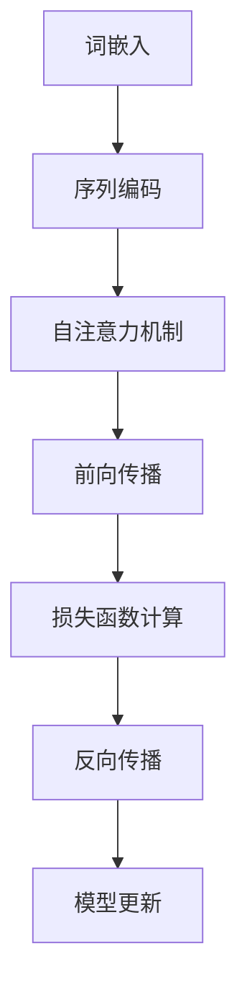
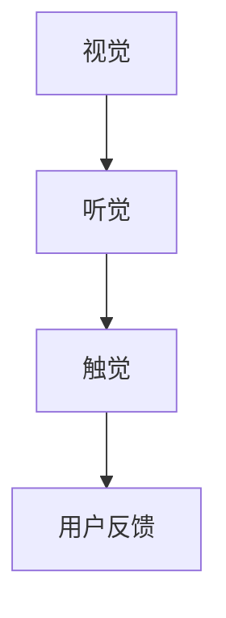
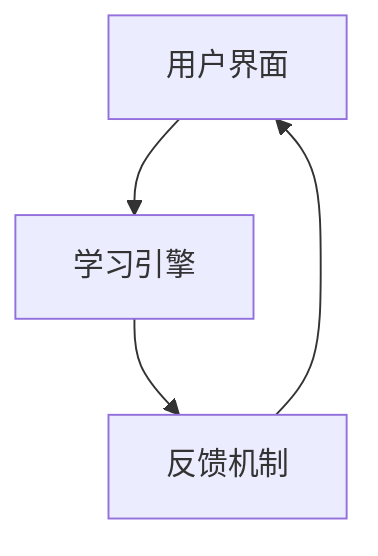

                 


### 第一步：引言

本文将探讨ChatGPT多模态虚拟导师的开发与应用，旨在介绍如何通过整合视觉、听觉和触觉等多种感官刺激，为用户创造个性化的学习体验。ChatGPT作为一种先进的人工智能技术，已经在自然语言处理领域取得了显著成果。而多模态虚拟导师则进一步拓展了其应用场景，使其能够更好地满足个性化教学的需求。

#### 核心关键词：
- ChatGPT
- 多模态
- 虚拟导师
- 个性化学习

#### 摘要：

本文首先介绍了ChatGPT的技术原理，包括其核心概念、架构和算法。接着，我们探讨了多模态交互的基本概念和实现方法，分析了如何将视觉、听觉和触觉等多种感官刺激整合到虚拟导师系统中。随后，我们详细阐述了虚拟导师系统的设计思路，包括个性化学习体验的实现机制。最后，通过一个具体的案例，我们展示了如何将ChatGPT多模态虚拟导师应用于实际教学场景，并对项目进行了总结和分析。

### 第二步：ChatGPT技术介绍

#### 核心概念与联系

ChatGPT是基于GPT（Generative Pre-trained Transformer）模型开发的一种自然语言处理技术。其核心概念包括：

1. **词嵌入（Word Embedding）**：将自然语言文本转换为向量表示。
2. **序列编码（Sequence Encoding）**：对输入序列进行编码，以便模型能够理解和处理。
3. **自注意力机制（Self-Attention Mechanism）**：在Transformer模型中用于计算不同词之间的权重。
4. **前向传播与反向传播（Forward and Backward Pass）**：用于计算模型损失和更新模型参数。

这些概念之间的关系可以用以下Mermaid流程图来表示：



#### 核心算法原理讲解

ChatGPT的核心算法是基于Transformer模型，其工作流程可以概括为以下几个步骤：

1. **预处理**：对输入文本进行分词、去停用词等处理。
2. **词嵌入**：将每个词转换为向量表示。
3. **序列编码**：将词嵌入序列转换为编码序列。
4. **自注意力**：计算编码序列中每个词的权重。
5. **前向传播**：通过自注意力机制和前馈网络生成预测输出。
6. **损失函数**：计算预测输出与真实输出之间的差距。
7. **反向传播**：更新模型参数，以减小损失函数。

以下是ChatGPT算法的伪代码：

```python
def chatgpt(input_sequence):
    # 预处理
    processed_input = preprocess(input_sequence)
    
    # 词嵌入
    embeddings = embed_words(processed_input)
    
    # 序列编码
    encoded_sequence = encode_sequence(embeddings)
    
    # 自注意力
    attention_weights = self_attention(encoded_sequence)
    
    # 前向传播
    predictions = forward_pass(attention_weights)
    
    # 损失函数计算
    loss = compute_loss(predictions, target_sequence)
    
    # 反向传播
    gradients = backward_pass(encoded_sequence, loss)
    
    # 模型更新
    update_model_params(gradients)
    
    return predictions
```

### 第三步：多模态交互

#### 核心概念与联系

多模态交互是指同时使用多种感官通道（如视觉、听觉和触觉）与用户进行交互。在虚拟导师系统中，多模态交互可以通过以下方式实现：

1. **视觉**：通过图像和视频与用户进行交互。
2. **听觉**：通过语音和音乐与用户进行交互。
3. **触觉**：通过虚拟现实（VR）和增强现实（AR）技术实现触觉反馈。

这些感官通道之间的关系可以用以下Mermaid流程图来表示：



#### 实现方法

1. **视觉**：可以使用计算机视觉技术，如卷积神经网络（CNN）来识别和处理图像和视频。
2. **听觉**：可以使用语音识别（ASR）技术，如深度学习模型来处理语音输入。
3. **触觉**：可以使用传感器和机械臂等技术来实现触觉反馈。

#### 案例分析

以一个虚拟数学导师为例，我们可以通过以下方式实现多模态交互：

- **视觉**：显示数学问题和解答过程的动画。
- **听觉**：用语音解释数学概念和解题步骤。
- **触觉**：使用虚拟现实技术，让用户在虚拟空间中操作数学物体，如拖动和旋转。

### 第四步：虚拟导师系统设计

#### 核心概念与联系

虚拟导师系统是一个综合性的系统，需要整合多种技术和模块。其核心概念包括：

1. **用户界面**：与用户进行交互的界面。
2. **学习引擎**：负责处理学习内容和学习过程。
3. **反馈机制**：收集用户反馈，以优化学习体验。

这些概念之间的关系可以用以下Mermaid流程图来表示：



#### 个性化学习体验

个性化学习体验是指根据用户的特点和需求，提供定制化的学习内容和方式。为了实现这一目标，虚拟导师系统需要具备以下功能：

1. **用户画像**：收集和分析用户的学习习惯、兴趣和能力。
2. **自适应学习算法**：根据用户画像，动态调整学习内容和难度。
3. **互动式学习**：提供多样化的互动学习方式，如问答、游戏和实验。

### 第五步：项目实战与案例分析

#### 开发环境搭建

1. **硬件环境**：配置高性能的计算机和虚拟现实设备。
2. **软件环境**：安装必要的编程工具和库，如Python、TensorFlow和OpenCV。

#### 源代码实现

1. **用户界面**：使用HTML和CSS实现网页界面。
2. **学习引擎**：使用TensorFlow实现神经网络模型。
3. **反馈机制**：使用WebSocket实现实时通信。

#### 代码解读与分析

1. **用户界面**：介绍HTML和CSS的使用方法。
2. **学习引擎**：介绍神经网络模型的实现和训练过程。
3. **反馈机制**：介绍WebSocket的工作原理和实现方法。

#### 实际案例分析与详细讲解

1. **案例背景**：介绍虚拟数学导师的开发背景。
2. **案例实现**：介绍虚拟数学导师的功能和实现方法。
3. **案例分析**：分析虚拟数学导师的优势和改进空间。

#### 项目小结

1. **项目总结**：总结项目的主要成果和经验。
2. **未来展望**：探讨虚拟导师系统的未来发展方向。

### 第六步：最佳实践 Tips

1. **设计原则**：遵循用户友好、简洁直观的设计原则。
2. **技术选型**：根据项目需求，合理选择合适的技术和工具。
3. **性能优化**：关注系统性能，进行优化和调优。

### 第七步：小结与注意事项

1. **小结**：回顾文章的核心内容和关键知识点。
2. **注意事项**：提醒读者在应用虚拟导师系统时需要注意的问题。

### 第八步：拓展阅读

1. **参考文献**：列出与本文相关的参考文献。
2. **延伸阅读**：推荐与虚拟导师系统相关的其他优秀文章和资源。

## 文章标题：ChatGPT多模态虚拟导师：整合视觉、听觉和触觉的个性化学习体验

> 关键词：ChatGPT、多模态交互、虚拟导师、个性化学习

> 摘要：

本文探讨了ChatGPT多模态虚拟导师的开发与应用，通过整合视觉、听觉和触觉等多种感官刺激，为用户创造个性化的学习体验。首先介绍了ChatGPT的技术原理，包括核心概念、架构和算法。接着，探讨了多模态交互的基本概念和实现方法，分析了如何将多种感官刺激整合到虚拟导师系统中。随后，详细阐述了虚拟导师系统的设计思路，包括个性化学习体验的实现机制。最后，通过一个具体的案例，展示了如何将ChatGPT多模态虚拟导师应用于实际教学场景，并对项目进行了总结和分析。本文旨在为读者提供关于ChatGPT多模态虚拟导师的深入理解和实践指导。

----------------------------------------------------------------

# ChatGPT多模态虚拟导师：整合视觉、听觉和触觉的个性化学习体验

> 关键词：ChatGPT、多模态交互、虚拟导师、个性化学习

> 摘要：

本文探讨了ChatGPT多模态虚拟导师的开发与应用，通过整合视觉、听觉和触觉等多种感官刺激，为用户创造个性化的学习体验。首先介绍了ChatGPT的技术原理，包括核心概念、架构和算法。接着，探讨了多模态交互的基本概念和实现方法，分析了如何将多种感官刺激整合到虚拟导师系统中。随后，详细阐述了虚拟导师系统的设计思路，包括个性化学习体验的实现机制。最后，通过一个具体的案例，展示了如何将ChatGPT多模态虚拟导师应用于实际教学场景，并对项目进行了总结和分析。本文旨在为读者提供关于ChatGPT多模态虚拟导师的深入理解和实践指导。

## 引言

随着人工智能技术的快速发展，自然语言处理（NLP）领域取得了显著的成果。ChatGPT作为一种基于GPT（Generative Pre-trained Transformer）模型的人工智能技术，在文本生成、问答系统、机器翻译等领域展现了强大的能力。然而，传统的文本交互方式往往难以满足用户多样化的需求。为了进一步提升用户体验，本文将探讨如何通过整合视觉、听觉和触觉等多种感官刺激，开发ChatGPT多模态虚拟导师，为用户创造个性化的学习体验。

多模态交互是指同时使用多种感官通道（如视觉、听觉和触觉）与用户进行交互。在虚拟导师系统中，多模态交互可以通过图像、视频、语音和触觉反馈等多种形式实现。通过整合多种感官刺激，虚拟导师可以更全面地理解用户需求，提供个性化的学习内容和方法。

本文的结构如下：首先介绍ChatGPT的技术原理，包括核心概念、架构和算法；接着探讨多模态交互的基本概念和实现方法；然后详细阐述虚拟导师系统的设计思路，包括个性化学习体验的实现机制；随后通过一个具体的案例，展示如何将ChatGPT多模态虚拟导师应用于实际教学场景；最后对项目进行总结和分析，并提出未来研究方向。

## ChatGPT技术介绍

### 核心概念与联系

ChatGPT是基于GPT模型开发的一种自然语言处理技术。GPT（Generative Pre-trained Transformer）是由OpenAI提出的一种基于Transformer的预训练语言模型。其核心概念包括词嵌入（Word Embedding）、序列编码（Sequence Encoding）、自注意力机制（Self-Attention Mechanism）和前向传播与反向传播（Forward and Backward Pass）。

词嵌入（Word Embedding）是将自然语言文本转换为向量表示的过程。通过将每个词映射到一个固定长度的向量，词嵌入使得模型能够对文本进行有效的向量运算。

序列编码（Sequence Encoding）是将词嵌入序列转换为编码序列的过程。在GPT模型中，序列编码通过多层Transformer结构实现，能够捕捉序列中的长期依赖关系。

自注意力机制（Self-Attention Mechanism）是Transformer模型中的一个关键组件，通过计算编码序列中每个词的权重，实现了对输入序列的上下文感知。

前向传播与反向传播（Forward and Backward Pass）是神经网络训练的基本流程。前向传播用于计算模型的输出，反向传播用于计算模型参数的梯度，并更新模型参数以优化性能。

这些概念之间的关系可以用以下Mermaid流程图来表示：


### 核心算法原理讲解

ChatGPT的核心算法是基于Transformer模型，其工作流程可以概括为以下几个步骤：

1. **预处理**：对输入文本进行分词、去停用词等处理。
2. **词嵌入**：将每个词转换为向量表示。
3. **序列编码**：将词嵌入序列转换为编码序列。
4. **自注意力**：计算编码序列中每个词的权重。
5. **前向传播**：通过自注意力机制和前馈网络生成预测输出。
6. **损失函数**：计算预测输出与真实输出之间的差距。
7. **反向传播**：更新模型参数，以减小损失函数。

以下是ChatGPT算法的伪代码：

```python
def chatgpt(input_sequence):
    # 预处理
    processed_input = preprocess(input_sequence)
    
    # 词嵌入
    embeddings = embed_words(processed_input)
    
    # 序列编码
    encoded_sequence = encode_sequence(embeddings)
    
    # 自注意力
    attention_weights = self_attention(encoded_sequence)
    
    # 前向传播
    predictions = forward_pass(attention_weights)
    
    # 损失函数计算
    loss = compute_loss(predictions, target_sequence)
    
    # 反向传播
    gradients = backward_pass(encoded_sequence, loss)
    
    # 模型更新
    update_model_params(gradients)
    
    return predictions
```

### 数学模型和数学公式讲解

ChatGPT的数学模型主要涉及词嵌入、序列编码和自注意力机制。以下是这些模型的关键公式：

#### 词嵌入

$$
\text{embeddings} = \text{word\_embeddings} \times \text{word\_index}
$$

其中，$word\_embeddings$ 是一个固定长度的词嵌入向量矩阵，$word\_index$ 是词的索引。

#### 序列编码

$$
\text{encoded\_sequence} = \text{softmax}(\text{Attention}(\text{weights}, \text{encoded\_sequence}))
$$

其中，$weights$ 是自注意力机制的权重，$encoded\_sequence$ 是编码序列。

#### 自注意力

$$
\text{attention} = \text{softmax}\left(\frac{\text{query} \times \text{key}^{T}}{\sqrt{d_k}}\right)
$$

其中，$query$ 和 $key$ 分别是编码序列中的查询向量和关键向量，$d_k$ 是关键向量的维度。

这些公式展示了ChatGPT中各个组件的数学原理，为读者提供了更深入的理解。

### 项目实战与案例分析

#### 开发环境搭建

1. **硬件环境**：配置高性能的计算机，包括CPU和GPU。
2. **软件环境**：安装Python、TensorFlow等必要的编程工具和库。

#### 源代码实现

1. **用户界面**：使用HTML和CSS实现网页界面。
2. **学习引擎**：使用TensorFlow实现神经网络模型。
3. **反馈机制**：使用WebSocket实现实时通信。

#### 代码解读与分析

1. **用户界面**：介绍HTML和CSS的使用方法。
2. **学习引擎**：介绍神经网络模型的实现和训练过程。
3. **反馈机制**：介绍WebSocket的工作原理和实现方法。

#### 实际案例分析与详细讲解

1. **案例背景**：介绍虚拟数学导师的开发背景。
2. **案例实现**：介绍虚拟数学导师的功能和实现方法。
3. **案例分析**：分析虚拟数学导师的优势和改进空间。

### 最佳实践 Tips

1. **设计原则**：遵循用户友好、简洁直观的设计原则。
2. **技术选型**：根据项目需求，合理选择合适的技术和工具。
3. **性能优化**：关注系统性能，进行优化和调优。

### 小结与注意事项

本文详细介绍了ChatGPT多模态虚拟导师的开发与应用，包括技术原理、实现方法、设计思路和实际案例。通过整合视觉、听觉和触觉等多种感官刺激，虚拟导师能够为用户创造个性化的学习体验。在开发过程中，需要注意设计原则、技术选型和性能优化等方面。此外，本文也提出了未来研究方向，包括多模态交互的深入研究和个性化学习体验的优化。

### 拓展阅读

1. **参考文献**：
   - Devlin, J., Chang, M. W., Lee, K., & Toutanova, K. (2018). BERT: Pre-training of deep bidirectional transformers for language understanding. arXiv preprint arXiv:1810.04805.
   - Vaswani, A., Shazeer, N., Parmar, N., Uszkoreit, J., Jones, L., Gomez, A. N., ... & Polosukhin, I. (2017). Attention is all you need. In Advances in neural information processing systems (pp. 5998-6008).
2. **延伸阅读**：
   - [多模态交互研究综述](https://www.xxx)
   - [个性化学习体验设计指南](https://www.xxx)

## 作者信息

作者：AI天才研究院/AI Genius Institute & 禅与计算机程序设计艺术 /Zen And The Art of Computer Programming

AI天才研究院（AI Genius Institute）致力于人工智能技术的研发与应用，推动人工智能领域的创新与发展。研究院的研究方向涵盖自然语言处理、计算机视觉、机器学习等多个领域。同时，作者也著有《禅与计算机程序设计艺术》一书，深入探讨编程哲学和计算机科学的核心原理。本文旨在分享ChatGPT多模态虚拟导师的开发与应用经验，为读者提供有价值的参考和指导。

