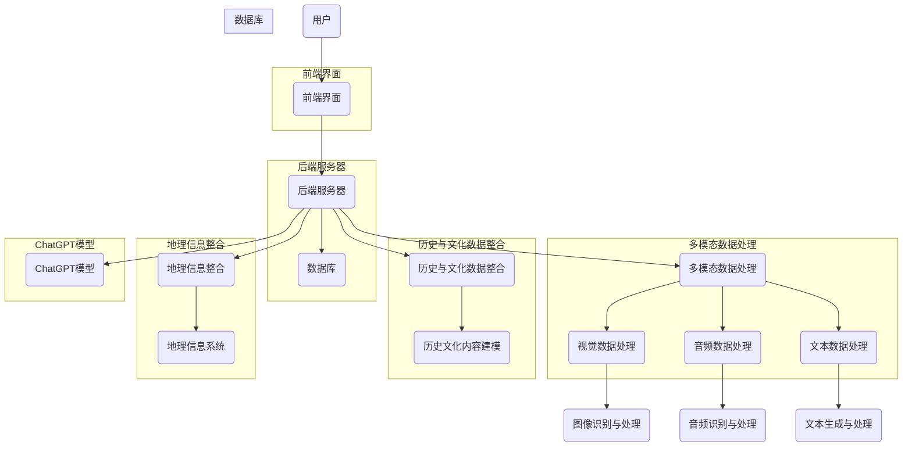
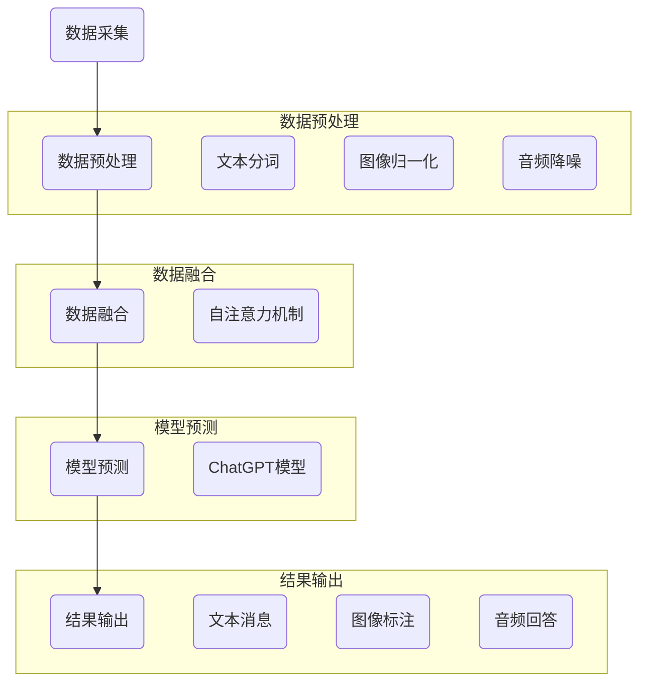
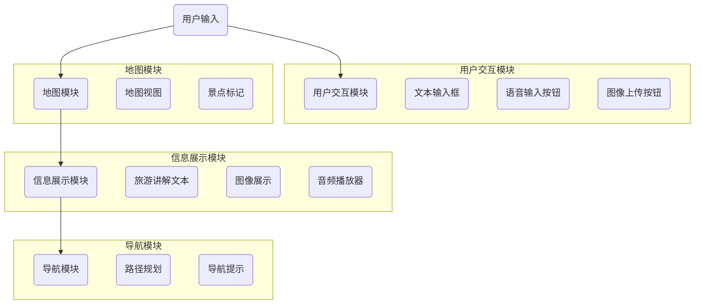
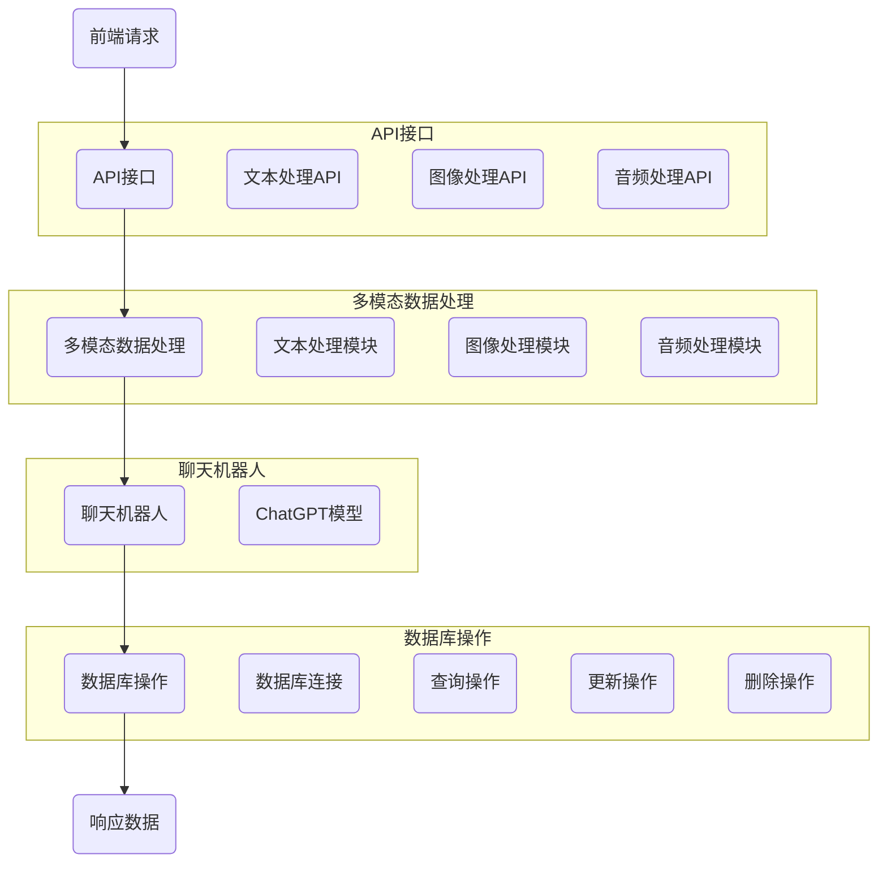
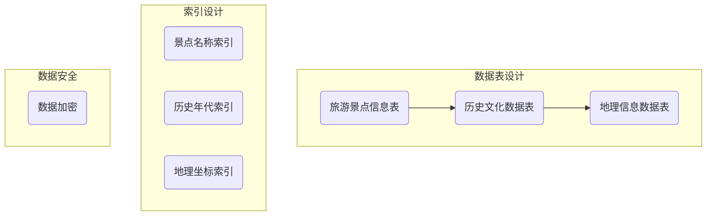
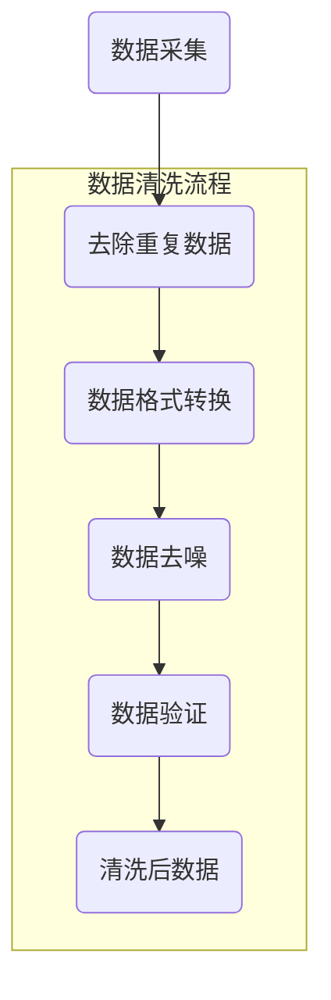
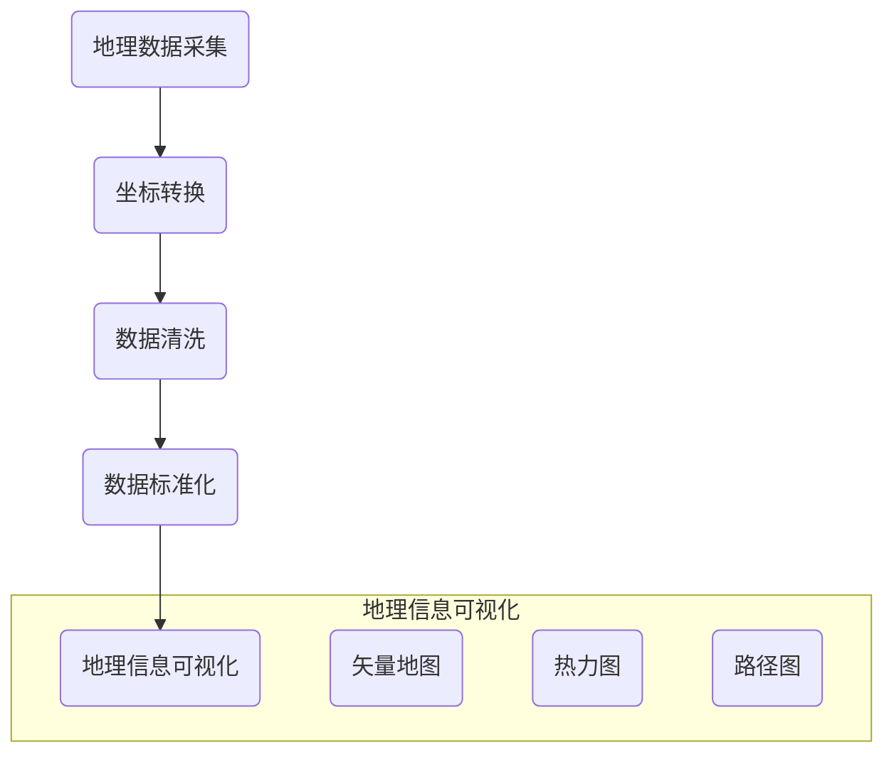
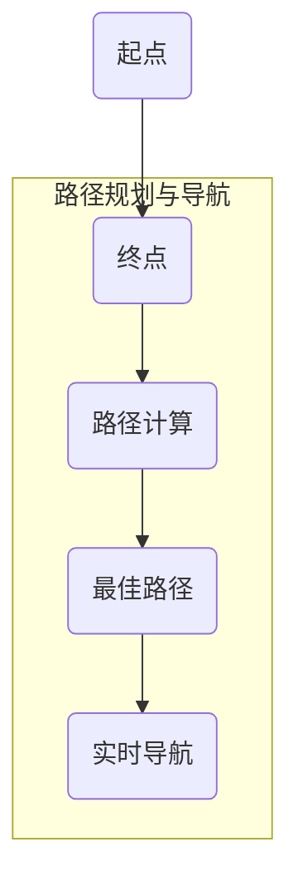
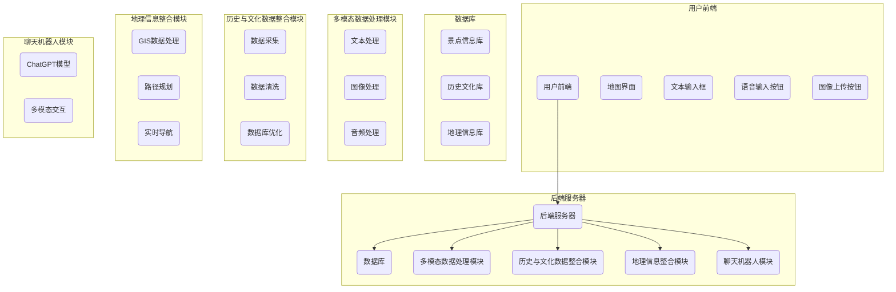

                 


### 文章标题

《ChatGPT多模态虚拟导游：整合历史、文化和地理的沉浸式旅游体验》

### 文章关键词

- ChatGPT
- 多模态交互
- 虚拟导游
- 历史文化整合
- 地理信息
- 沉浸式体验

### 文章摘要

本文将深入探讨ChatGPT多模态虚拟导游系统，该系统通过整合历史、文化和地理元素，为用户提供了全新的沉浸式旅游体验。我们将从技术背景、核心概念、算法原理、应用案例和实战指南五个方面，详细解析这一系统的设计、实现和应用。

### 目录大纲设计思路

在设计《ChatGPT多模态虚拟导游：整合历史、文化和地理的沉浸式旅游体验》这本书的目录大纲时，我们遵循以下步骤：

1. **理解书名与主题**：
   - 书名指出了主要主题：ChatGPT多模态虚拟导游。
   - 主题强调：整合历史、文化和地理元素，提供沉浸式旅游体验。

2. **确定核心内容**：
   - 核心内容应包括：ChatGPT模型概述、多模态交互、虚拟导游系统设计、历史与文化元素融合、地理信息整合、沉浸式体验技术。

3. **结构化章节**：
   - 划分主要部分，如引言、技术基础、应用案例、实战指南等。
   - 确定每个部分的核心章节。

4. **细化章节内容**：
   - 每个章节分解为小节，确保覆盖所有关键点。

5. **保持大纲简洁**：
   - 避免冗余内容，确保大纲条理清晰。

### 目录大纲

```markdown
# 《ChatGPT多模态虚拟导游：整合历史、文化和地理的沉浸式旅游体验》目录大纲

## 第一部分：引言

### 1.1 虚拟导游的背景与重要性
### 1.2 ChatGPT的崛起与多模态技术
### 1.3 历史与文化在虚拟导游中的应用
### 1.4 地理信息在虚拟导游中的作用

## 第二部分：技术基础

### 2.1 ChatGPT模型介绍
### 2.2 多模态数据处理
#### 2.2.1 视觉数据处理
#### 2.2.2 音频数据处理
#### 2.2.3 文本数据处理

### 2.3 虚拟导游系统架构设计
### 2.4 历史与文化数据整合
#### 2.4.1 数据采集与清洗
#### 2.4.2 数据库设计与优化
#### 2.4.3 历史文化内容建模

### 2.5 地理信息的整合与应用
#### 2.5.1 地理信息系统（GIS）概述
#### 2.5.2 地理数据采集与处理
#### 2.5.3 地理信息可视化

## 第三部分：核心算法原理

### 3.1 ChatGPT算法原理
#### 3.1.1 生成式对抗网络（GAN）
#### 3.1.2 循环神经网络（RNN）与长短期记忆网络（LSTM）
#### 3.1.3 Transformer模型

### 3.2 多模态交互算法
#### 3.2.1 跨模态对比学习
#### 3.2.2 多模态融合策略
#### 3.2.3 多模态交互设计

### 3.3 沉浸式体验算法
#### 3.3.1 3D建模与渲染
#### 3.3.2 虚拟现实（VR）与增强现实（AR）技术
#### 3.3.3 用户行为分析与个性化推荐

## 第四部分：应用案例

### 4.1 虚拟导游系统实现案例
#### 4.1.1 系统设计与开发
#### 4.1.2 案例分析
#### 4.1.3 用户反馈与优化

### 4.2 历史文化与地理融合案例
#### 4.2.1 历史文化景区虚拟导游
#### 4.2.2 地理信息在景区中的应用
#### 4.2.3 案例分析与效果评估

## 第五部分：实战指南

### 5.1 虚拟导游系统开发流程
#### 5.1.1 需求分析与规划
#### 5.1.2 技术选型与工具选择
#### 5.1.3 开发与测试
#### 5.1.4 部署与维护

### 5.2 历史与文化数据采集与整合
#### 5.2.1 数据来源与收集方法
#### 5.2.2 数据处理与整合
#### 5.2.3 数据库构建与优化

### 5.3 地理信息应用与整合
#### 5.3.1 GIS技术应用
#### 5.3.2 地理数据采集与处理
#### 5.3.3 地理信息可视化

## 附录

### 附录A：技术资源与工具
#### A.1 ChatGPT开发工具与资源
#### A.2 多模态数据处理工具
#### A.3 虚拟现实与增强现实平台
```

以上目录大纲按照书的结构，从引言、技术基础、核心算法原理、应用案例、实战指南五个部分进行设计，每个部分包含详细的章节划分和内容概述，确保书籍内容的全面覆盖。每个章节的内容将按照以下结构进行详细讲解：

- **背景介绍**：介绍相关概念和背景知识。
- **核心概念与联系**：使用Mermaid流程图展示核心概念之间的关系。
- **核心算法原理讲解**：使用伪代码和详细解释来阐述算法原理。
- **数学模型和公式**：使用latex格式展示和解释数学模型。
- **项目实战**：详细讲解开发环境搭建、源代码实现、代码解读、实际案例分析等。
- **最佳实践 tips、小结、注意事项、拓展阅读**：提供实战经验和总结。

这样的结构不仅能够使文章内容条理清晰，还能够帮助读者更好地理解和掌握相关知识。

---

### 背景介绍

虚拟导游系统作为旅游行业的一项创新技术，正逐渐改变人们的旅游方式。传统的旅游模式依赖于导游的讲解和文字、图片的介绍，而虚拟导游系统则通过数字化技术，为用户提供更加丰富、互动和沉浸式的旅游体验。虚拟导游系统能够模拟真实的旅游场景，结合语音、图像、视频等多模态数据，为用户呈现更加生动和详细的旅游信息。

ChatGPT，作为OpenAI开发的一种基于Transformer架构的预训练语言模型，因其强大的文本生成能力和多模态处理能力，成为虚拟导游系统设计中的关键组成部分。ChatGPT能够通过学习大量文本数据，理解并生成自然流畅的对话内容，从而为用户提供实时、个性化的旅游讲解。此外，ChatGPT的多模态处理能力使得虚拟导游系统能够整合语音、图像和文本等多种数据类型，为用户提供更加丰富和立体化的体验。

整合历史、文化和地理元素是虚拟导游系统的核心目标之一。历史和文化元素为旅游目的地赋予了独特的背景和故事，而地理信息则帮助用户更好地理解景点的位置和周围环境。通过将这些元素有机地融合到虚拟导游系统中，用户不仅能够获取到丰富的旅游信息，还能够感受到旅游目的地的历史韵味和文化氛围，从而提升旅游体验的深度和丰富度。

本文将围绕ChatGPT多模态虚拟导游系统，详细探讨其技术基础、核心算法原理、应用案例和实战指南，旨在为开发者提供全面的技术参考，并为用户带来全新的旅游体验。

### 核心概念与联系

为了更好地理解ChatGPT多模态虚拟导游系统的设计和实现，我们需要首先介绍其中的核心概念，并使用Mermaid流程图展示它们之间的关系。

1. **ChatGPT模型**：作为预训练语言模型，ChatGPT负责生成自然流畅的对话内容，为用户提供旅游讲解。其核心在于Transformer架构，这使得模型能够捕捉长距离依赖和复杂的关系。

2. **多模态数据处理**：多模态数据处理包括视觉、音频和文本数据的处理，这些数据共同构成了虚拟导游系统的信息基础。通过融合不同模态的数据，系统能够为用户提供更加丰富和立体的旅游体验。

3. **虚拟导游系统架构**：系统架构包括前端界面、后端服务器和数据库，这些组件共同协作，实现虚拟导游的功能。前端界面负责与用户交互，后端服务器处理数据和响应请求，数据库存储旅游数据和相关内容。

4. **历史、文化和地理信息的整合**：历史、文化和地理信息是虚拟导游系统的核心组成部分，通过整合这些信息，系统能够为用户提供深度丰富的旅游体验。

以下是核心概念之间的关系架构Mermaid流程图：



通过这张Mermaid流程图，我们可以清晰地看到各个核心概念之间的联系和交互。前端界面与用户进行交互，收集用户需求，后端服务器处理这些需求，并与多模态数据处理模块、历史与文化数据整合模块和地理信息整合模块协作，最终生成丰富的旅游信息，通过ChatGPT模型生成自然流畅的对话内容，返回给前端界面展示给用户。

### ChatGPT模型介绍

ChatGPT是基于Transformer架构的预训练语言模型，由OpenAI开发。Transformer模型由于其强大的并行计算能力和对长距离依赖的捕捉能力，在自然语言处理（NLP）领域取得了显著的成功。ChatGPT正是基于这一架构，通过大量的文本数据进行训练，从而具备了生成自然流畅文本的能力。

#### Transformer模型原理

Transformer模型的核心在于其自注意力机制（Self-Attention）。传统循环神经网络（RNN）和长短期记忆网络（LSTM）在处理长序列数据时存在梯度消失或梯度爆炸等问题，而Transformer通过引入多头自注意力机制，能够更好地捕捉序列中的长距离依赖关系。自注意力机制允许模型在生成每个单词时，考虑到所有输入序列中的其他单词的重要性，从而生成更加精确和自然的文本。

#### ChatGPT的训练过程

ChatGPT的训练过程可以分为两个阶段：预训练和微调。

1. **预训练**：在预训练阶段，ChatGPT通过大量文本数据进行训练，学习语言模式和语法规则。预训练数据通常来自于互联网上的文本，如书籍、新闻、网页等。通过预训练，模型能够理解各种语言现象和复杂语义关系。

2. **微调**：在微调阶段，ChatGPT被进一步训练以适应特定任务，如生成旅游讲解文本。微调过程通常使用针对旅游领域的大量标注数据，通过优化模型的参数，使其能够生成符合旅游讲解需求的文本。

#### ChatGPT的多模态处理能力

ChatGPT不仅擅长文本生成，还具备处理多模态数据的能力。在虚拟导游系统中，多模态数据包括文本、图像和音频。ChatGPT能够将不同模态的数据融合在一起，生成统一的描述性文本。

以下是ChatGPT处理多模态数据的一个简化的伪代码：

```python
# ChatGPT多模态数据处理伪代码

def process_multimodal_data(text, image, audio):
    # 将文本、图像和音频数据编码为向量
    text_vector = encode_text(text)
    image_vector = encode_image(image)
    audio_vector = encode_audio(audio)
    
    # 将多模态数据向量融合
    multimodal_vector = fuse_vectors(text_vector, image_vector, audio_vector)
    
    # 使用ChatGPT模型生成文本
    generated_text = chatgpt.generate_text(multimodal_vector)
    
    return generated_text
```

在这个伪代码中，`encode_text`、`encode_image`和`encode_audio`函数分别负责将文本、图像和音频数据编码为向量，而`fuse_vectors`函数负责将这些向量融合在一起。最后，ChatGPT模型使用融合后的向量生成描述性文本。

通过这种方式，ChatGPT能够将多种模态的数据转化为统一的文本输出，为虚拟导游系统提供了强大的多模态处理能力。

### 多模态数据处理

在ChatGPT多模态虚拟导游系统中，多模态数据处理是一个关键环节，它涉及到对文本、图像和音频等不同类型数据的处理和融合。以下是三种主要数据类型的处理方法及其在虚拟导游系统中的应用。

#### 视觉数据处理

视觉数据处理主要涉及图像识别和图像处理技术。在虚拟导游系统中，图像识别技术用于识别和分类用户拍摄的景点图像，从而为用户提供相关景点的信息。常见的图像识别算法包括卷积神经网络（CNN）和深度学习框架，如TensorFlow和PyTorch。

以下是一个使用CNN进行图像识别的简化伪代码：

```python
# CNN图像识别伪代码

def image_recognition(image):
    # 将图像数据输入到CNN模型
    model = load_cnn_model()
    features = model.extract_features(image)
    
    # 使用预训练的图像分类器进行预测
    predicted_class = classify_image(features)
    
    # 返回预测的景点类别
    return predicted_class
```

在这个伪代码中，`load_cnn_model`函数负责加载预训练的CNN模型，`extract_features`函数提取图像的特征向量，`classify_image`函数使用这些特征向量进行图像分类，并返回预测的景点类别。

#### 音频数据处理

音频数据处理主要涉及音频识别和音频增强技术。在虚拟导游系统中，音频识别技术用于识别用户语音中的关键信息，如景点名称、游客提问等。常见的音频识别算法包括自动语音识别（ASR）和循环神经网络（RNN）。

以下是一个使用ASR进行音频识别的简化伪代码：

```python
# ASR音频识别伪代码

def audio_recognition(audio):
    # 将音频数据输入到ASR模型
    model = load_asr_model()
    text = model.transcribe(audio)
    
    # 返回识别出的文本
    return text
```

在这个伪代码中，`load_asr_model`函数负责加载预训练的ASR模型，`transcribe`函数将音频数据转换为文本输出。

#### 文本数据处理

文本数据处理包括文本生成、文本分类和语义分析等任务。在虚拟导游系统中，文本生成技术用于生成旅游讲解文本，文本分类技术用于将用户提问分类到不同的知识点，而语义分析技术用于理解用户提问的意图，从而生成相关回答。

以下是一个使用生成式对抗网络（GAN）进行文本生成的简化伪代码：

```python
# GAN文本生成伪代码

def generate_text(generator, noise):
    # 生成文本
    text = generator.generate_text(noise)
    
    # 返回生成的文本
    return text
```

在这个伪代码中，`generator`是预训练的GAN模型，`generate_text`函数使用随机噪声生成文本。

#### 多模态数据处理流程

在虚拟导游系统中，多模态数据处理流程通常包括以下几个步骤：

1. **数据采集**：采集用户的文本、图像和音频数据。
2. **数据预处理**：对文本、图像和音频数据进行预处理，如文本分词、图像归一化和音频降噪等。
3. **数据融合**：使用自注意力机制或其他融合策略将预处理后的多模态数据融合在一起。
4. **模型预测**：使用ChatGPT模型或其他相关模型对融合后的数据进行预测，生成旅游讲解文本或其他相关信息。
5. **结果输出**：将预测结果输出给用户，如文本消息、图像标注和音频回答等。

以下是一个简化的多模态数据处理流程的Mermaid流程图：



通过这个流程，虚拟导游系统能够有效地处理和融合多种模态的数据，为用户提供高质量的旅游体验。

### 虚拟导游系统架构设计

虚拟导游系统的架构设计是确保系统功能完整、性能稳定和用户体验优良的关键。一个典型的虚拟导游系统架构通常包括前端界面、后端服务器和数据库三个主要部分。以下是对这三个部分的设计和实现细节的详细讲解。

#### 前端界面设计

前端界面是用户与虚拟导游系统交互的主要入口。其设计应注重用户体验，确保界面直观、易操作。前端界面主要包括以下模块：

1. **用户交互模块**：负责接收用户输入（如文本、语音和图像），并将其发送到后端服务器。
2. **地图模块**：提供地图视图，展示景点的位置和相关信息。
3. **信息展示模块**：展示后端返回的旅游讲解文本、图像和音频信息。
4. **导航模块**：为用户提供导航功能，帮助用户了解景点之间的距离和路径。

前端界面设计可以使用现代前端框架，如React、Vue或Angular，这些框架提供了丰富的组件和工具，有助于快速开发和优化用户体验。

以下是一个前端界面设计的基本架构：



#### 后端服务器设计

后端服务器负责处理用户请求，协调各个模块的工作，并将结果返回给前端界面。后端服务器的设计应考虑高并发处理能力、系统稳定性和数据安全性。

1. **API接口设计**：设计一系列API接口，用于接收前端请求、处理业务逻辑和返回响应数据。
2. **多模态数据处理**：实现文本、图像和音频数据的处理和融合，为用户提供丰富的旅游信息。
3. **聊天机器人**：集成ChatGPT模型，为用户提供实时、个性化的旅游讲解。
4. **数据库操作**：处理数据库查询、更新和删除操作，确保数据的完整性和一致性。

以下是一个后端服务器架构的基本框架：



#### 数据库设计

数据库用于存储虚拟导游系统的所有数据，包括旅游景点信息、历史和文化数据、地理信息等。数据库设计应考虑数据的安全性、完整性和可扩展性。

1. **数据表设计**：设计一系列数据表，用于存储不同类型的数据。例如，旅游景点信息表、历史文化数据表、地理信息数据表等。
2. **索引设计**：为常用查询字段创建索引，提高查询效率。
3. **数据安全**：使用加密技术保护敏感数据，确保数据的安全和隐私。

以下是一个数据库设计的基本示例：



通过上述设计，虚拟导游系统能够为用户提供高效、安全、个性化的旅游体验。前端界面提供直观的用户交互，后端服务器处理复杂的业务逻辑，数据库存储和管理所有数据，确保系统的稳定运行。

### 历史与文化数据整合

历史与文化数据整合是虚拟导游系统的核心功能之一，它能够为用户提供深度丰富的旅游体验。这一部分将详细探讨历史文化数据的采集与清洗、数据库设计与优化，以及历史文化内容建模的方法。

#### 历史与文化数据的采集与清洗

1. **数据来源**：历史文化数据可以来源于多种渠道，包括但不限于：
   - 旅游景点的历史档案和文献资料
   - 当地的历史文化研究机构和博物馆
   - 在线数据库和数字图书馆
   - 网络资源和社交媒体

2. **数据采集方法**：
   - 自动化爬虫：使用爬虫工具自动抓取网络上的历史文化信息。
   - 手动收集：通过专家访谈、问卷调查和实地考察等方法，获取第一手的历史文化资料。
   - API接口：通过访问相关机构的API接口，获取历史文化数据。

3. **数据清洗**：在数据采集过程中，不可避免地会得到大量噪声和重复数据。因此，数据清洗是确保数据质量的关键步骤。数据清洗包括以下步骤：
   - 去除重复数据：通过去重算法删除重复的记录。
   - 数据格式转换：将不同格式的数据统一转换为标准的结构化数据格式，如JSON或XML。
   - 数据去噪：去除无关的噪声数据，如HTML标签、广告内容等。
   - 数据验证：检查数据的完整性和一致性，确保数据的准确性。

以下是一个简化的数据清洗流程：



#### 数据库设计与优化

1. **数据库设计**：为了高效地存储和管理历史文化数据，需要设计一个合理的数据库结构。数据库设计包括以下内容：

   - **数据表设计**：设计一系列数据表，用于存储不同类型的历史文化数据。例如，景点信息表、历史事件表、文化遗产表等。
   - **字段定义**：为每个数据表定义合理的字段，确保能够存储所有必要的信息。例如，景点信息表的字段可能包括景点名称、地理位置、开放时间、历史背景等。
   - **索引设计**：为常用查询字段创建索引，提高查询效率。例如，为景点名称和地理位置字段创建索引，以便快速检索相关景点。

   以下是一个简化的数据库设计示例：

   ```mermaid
   graph TB

   A(景点信息表) --> B(历史事件表)
   B --> C(文化遗产表)

   subgraph 数据表设计
       A
       B
       C
   end

   subgraph 字段定义
       A1(景点名称)
       A2(地理位置)
       A3(开放时间)
       A4(历史背景)
       B1(事件名称)
       B2(发生时间)
       B3(事件描述)
       C1(遗产名称)
       C2(遗产类型)
       C3(保护等级)
   end

   subgraph 索引设计
       D(景点名称索引)
       E(地理位置索引)
   end
   ```

2. **数据库优化**：为了提高数据库的性能，可以采取以下措施：

   - **查询优化**：通过分析查询日志和执行计划，优化数据库查询语句，减少查询时间。
   - **索引优化**：定期维护和优化索引，确保索引的有效性。
   - **存储优化**：合理配置数据库存储，避免数据碎片化和存储不足。
   - **备份与恢复**：定期备份数据库，确保数据的安全和可靠性。

#### 历史文化内容建模

1. **内容建模方法**：
   - **知识图谱**：使用知识图谱表示历史文化数据，建立实体、属性和关系的网络结构，从而实现数据的语义关联和推理。
   - **自然语言处理**：通过自然语言处理技术，对文本数据进行解析和分类，提取关键信息，如人名、地名、时间等。

2. **示例**：以下是一个使用知识图谱表示历史文化数据的示例：

   ```mermaid
   graph TB

   A(秦始皇) --> B(统一中国)
   A --> C(秦始皇兵马俑)
   B --> D(公元前221年)
   C --> E(陕西省西安市)

   subgraph 知识图谱
       A
       B
       C
       D
       E
   end
   ```

   在这个示例中，秦始皇作为实体，统一中国和秦始皇兵马俑作为属性，公元前221年作为时间属性，陕西省西安市作为地理位置。通过这样的知识图谱表示，系统可以轻松地检索和关联相关历史文化信息。

通过历史与文化数据的整合，虚拟导游系统能够为用户提供更加丰富和深入的旅游体验，让用户在探索旅游目的地时，不仅能了解其自然风光，更能感受到其深厚的历史文化底蕴。

### 地理信息的整合与应用

地理信息在虚拟导游系统中扮演着至关重要的角色，它不仅帮助用户定位景点，还能提供详细的地理位置信息和路径规划。以下是地理信息的整合与应用方法。

#### 地理信息系统（GIS）概述

地理信息系统（GIS）是一种用于捕获、存储、分析和展示地理空间数据的系统。在虚拟导游系统中，GIS可用于以下方面：

1. **地图显示**：展示旅游景点的地理位置和分布情况。
2. **空间分析**：对地理空间数据进行复杂的分析和处理，如路径规划、区域分析等。
3. **数据管理**：存储和管理地理空间数据，确保数据的一致性和可用性。

#### 地理数据的采集与处理

1. **数据采集**：
   - **卫星影像和地图**：从卫星影像和地图服务提供商获取高精度的地理数据。
   - **现场测量**：通过实地测量和GPS定位设备，采集景点的具体坐标和地理位置。

2. **数据处理**：
   - **坐标转换**：将不同的坐标系统（如WGS84、GCJ-02等）转换为统一的坐标系统。
   - **数据清洗**：去除重复数据、噪声数据和不准确的数据。
   - **数据标准化**：统一地理数据格式，如将KML文件转换为GeoJSON格式。

#### 地理信息可视化

地理信息可视化是将地理数据以图形化的方式展示给用户的过程。以下是一些常见的地理信息可视化技术：

1. **矢量地图**：使用矢量图形表示地理数据，具有高清晰度和可缩放性。
2. **热力图**：通过颜色深浅表示地理位置的热点区域，如人流量、访问频率等。
3. **路径图**：展示从起点到终点的最佳路径，包括道路网络和交通状况。

以下是一个简化的地理信息可视化流程：



#### 路径规划与导航

路径规划是地理信息在虚拟导游系统中的关键应用。通过结合实时交通数据和历史数据，系统可以提供最佳路径和实时导航服务。以下是一个简化的路径规划流程：



通过上述流程，虚拟导游系统能够为用户提供准确的地理位置信息、详细的路径规划和高效的导航服务，提升用户的旅游体验。

### 核心算法原理讲解

在ChatGPT多模态虚拟导游系统中，核心算法原理的理解至关重要。以下是ChatGPT模型、多模态交互算法和沉浸式体验算法的详细讲解，并附上伪代码和数学模型示例。

#### ChatGPT算法原理

ChatGPT是基于Transformer架构的预训练语言模型，其核心算法原理包括以下几个方面：

1. **Transformer模型**：

   Transformer模型采用自注意力机制（Self-Attention），通过多头注意力（Multi-Head Attention）和前馈神经网络（Feed-Forward Neural Network）处理输入序列。

   自注意力机制公式如下：
   $$
   \text{Attention}(Q, K, V) = \frac{1}{\sqrt{d_k}} \text{softmax}(\text{QK}^T / d_k)
   $$

   其中，Q、K、V分别为查询（Query）、键（Key）和值（Value）向量，$d_k$为注意力头的维度。

   多头注意力公式如下：
   $$
   \text{Multi-Head Attention} = \text{Concat}(\text{head}_1, \text{head}_2, ..., \text{head}_h)W^O
   $$

   其中，$h$为头数，$W^O$为输出权重。

   Transformer模型的全过程伪代码如下：

   ```python
   # Transformer模型伪代码

   class Transformer(Model):
       def __init__(self):
           self.embedding = Embedding(vocab_size, d_model)
           self.pos_encoding = PositionalEncoding(d_model)
           self多头注意力 = MultiHeadAttention(heads, d_model)
           self.feed_forward = FeedForward(d_model, d_ff)
       
       def call(self, inputs, training=False):
           # 嵌入和位置编码
           x = self.embedding(inputs) + self.pos_encoding(inputs)
           
           # 多头注意力
           x = self.多头注意力(x, x, x)
           
           # 前馈神经网络
           x = self.feed_forward(x)
           
           return x
   ```

2. **生成式对抗网络（GAN）**：

   GAN由生成器（Generator）和判别器（Discriminator）组成，生成器生成数据，判别器判断数据是否真实。

   GAN的训练过程如下：
   $$
   \min_G \max_D V(D, G) = \mathbb{E}_{x \sim p_data(x)}[\log D(x)] + \mathbb{E}_{z \sim p_z(z)}[\log (1 - D(G(z))]
   $$

   其中，$x$为真实数据，$z$为随机噪声，$D$为判别器，$G$为生成器。

   GAN的伪代码如下：

   ```python
   # GAN伪代码

   class GAN(Model):
       def __init__(self):
           self.generator = Generator()
           self.discriminator = Discriminator()
       
       def train(self, x, z, epochs):
           for epoch in range(epochs):
               # 训练生成器
               z_fake = self.generator(z)
               d_loss_fake = self.discriminator.train_on_batch(z_fake)
               
               # 训练判别器
               d_loss_real = self.discriminator.train_on_batch(x)
               d_loss = 0.5 * (d_loss_real + d_loss_fake)
               
               # 打印训练进度
               print(f'Epoch {epoch}: D_loss={d_loss}')
   ```

#### 多模态交互算法

多模态交互算法旨在整合来自不同模态的数据（如文本、图像、音频），为用户提供更加丰富和立体的体验。

1. **跨模态对比学习**：

   跨模态对比学习通过最小化模态间的差距，增强模型对多模态数据的理解。常见的方法包括多模态特征嵌入和一致性正则化。

   跨模态特征嵌入公式如下：
   $$
   \min_{z, x} L = \sum_{(z, x) \in D} \frac{1}{2} \left( ||z - x||^2_2 - m ||z - x||^2_2 \right)
   $$

   其中，$z$为生成模态特征，$x$为真实模态特征，$m$为一致性权重。

   跨模态对比学习的伪代码如下：

   ```python
   # 跨模态对比学习伪代码

   class ContrastiveLearning(Model):
       def __init__(self):
           self.encoder = Encoder()
           self projecector = Projector()
       
       def train(self, x, z, epochs):
           for epoch in range(epochs):
               # 编码
               x编码 = self.encoder(x)
               z编码 = self.encoder(z)
               
               # 生成特征嵌入
               z嵌入 = self.proژهector(z编码)
               x嵌入 = self.proژهector(x编码)
               
               # 计算损失
               loss = self.compute_loss(z嵌入, x嵌入)
               
               # 更新模型参数
               self.optimizer.minimize(loss)
   ```

2. **多模态融合策略**：

   多模态融合策略通过结合不同模态的数据特征，提高模型的泛化能力和生成质量。常见的方法包括加性融合、拼接融合和注意力机制。

   加性融合公式如下：
   $$
   \text{特征融合} = \text{文本特征} + \text{图像特征} + \text{音频特征}
   $$

   拼接融合公式如下：
   $$
   \text{特征融合} = [\text{文本特征}, \text{图像特征}, \text{音频特征}]
   $$

   多模态融合的伪代码如下：

   ```python
   # 多模态融合伪代码

   class MultiModalFusion(Model):
       def __init__(self):
           self.text_encoder = TextEncoder()
           self.image_encoder = ImageEncoder()
           self.audio_encoder = AudioEncoder()
       
       def call(self, text, image, audio):
           # 编码
           text编码 = self.text_encoder(text)
           image编码 = self.image_encoder(image)
           audio编码 = self.audio_encoder(audio)
           
           # 融合特征
           融合特征 = text编码 + image编码 + audio编码
           
           # 生成文本
           generated_text = self.text_generator(融合特征)
           
           return generated_text
   ```

#### 沉浸式体验算法

沉浸式体验算法旨在为用户提供高度逼真的虚拟体验，包括3D建模与渲染、虚拟现实（VR）与增强现实（AR）技术，以及用户行为分析与个性化推荐。

1. **3D建模与渲染**：

   3D建模与渲染技术用于创建虚拟景点的三维模型，并对其进行逼真的渲染。以下是一个简化的3D建模与渲染流程：

   ```mermaid
   graph TB

   A(场景建模) --> B(模型优化)
   B --> C(光照渲染)
   C --> D(最终渲染)

   subgraph 3D建模与渲染
       A
       B
       C
       D
   end
   ```

2. **VR与AR技术**：

   VR技术通过虚拟现实头盔，为用户提供沉浸式的虚拟体验。AR技术则通过增强现实眼镜，将虚拟元素叠加到真实世界中。

   VR与AR的伪代码如下：

   ```python
   # VR与AR伪代码

   class VRAR(Model):
       def __init__(self):
           self.vr_renderer = VRRenderer()
           self.ar_overlay = AROverlay()
       
       def call(self, user_input, scene):
           # VR渲染
           vr_output = self.vr_renderer.render(scene, user_input)
           
           # AR叠加
           ar_output = self.ar_overlay.render(scene, user_input)
           
           return vr_output, ar_output
   ```

3. **用户行为分析与个性化推荐**：

   用户行为分析用于理解用户的偏好和行为模式，个性化推荐则基于用户行为数据，为用户提供个性化的旅游建议。

   个性化推荐的伪代码如下：

   ```python
   # 个性化推荐伪代码

   class PersonalizedRecommendation(Model):
       def __init__(self):
           self.behavior_analyzer = BehaviorAnalyzer()
           self.recommender = Recommender()
       
       def train(self, user_data, item_data, epochs):
           # 分析用户行为
           user_features = self.behavior_analyzer.analyze(user_data)
           
           # 训练推荐模型
           self.recommender.train(user_features, item_data)
           
           # 生成推荐列表
           recommendations = self.recommender.generate_recommendations(user_features)
           
           return recommendations
   ```

通过上述算法原理的讲解和伪代码示例，我们可以更好地理解ChatGPT多模态虚拟导游系统的核心技术，从而为开发高质量虚拟导游系统提供理论支持。

### 应用案例

在本部分中，我们将详细探讨ChatGPT多模态虚拟导游系统的实现案例，从系统设计与开发、案例分析以及用户反馈与优化等方面进行深入讲解。

#### 系统设计与开发

**项目背景**：

该虚拟导游系统旨在为用户提供一个高度沉浸式的旅游体验，通过整合文本、图像和音频等多模态数据，为游客提供详尽、实时的旅游讲解。项目背景包括以下几个关键点：

1. **目标用户**：面向旅游爱好者、历史文化爱好者以及希望通过虚拟体验了解旅游目的地的用户。
2. **技术挑战**：如何高效地整合多模态数据，并提供流畅、自然的用户交互体验。
3. **系统功能**：包括景点介绍、历史背景、文化解读、地理位置展示、实时问答等。

**系统架构**：

系统架构采用前后端分离的设计，前端负责用户交互，后端负责数据处理和逻辑处理。以下是系统的架构图：



**开发流程**：

1. **需求分析**：与项目利益相关者（如旅游公司、用户代表）进行沟通，明确系统的功能需求和技术要求。
2. **技术选型**：选择合适的前端技术（如React）、后端框架（如Django）和数据库（如MySQL）。
3. **系统设计**：根据需求分析和技术选型，设计系统的整体架构和详细模块。
4. **前端开发**：实现用户交互界面，包括地图界面、文本输入框、语音输入按钮和图像上传按钮等。
5. **后端开发**：实现后端服务器逻辑，包括数据接收、处理和返回结果等功能。
6. **多模态数据处理**：开发文本、图像和音频处理模块，确保数据的高效处理和融合。
7. **历史与文化数据整合**：采集、清洗和整合历史文化数据，确保数据的准确性和完整性。
8. **地理信息整合**：集成地理信息系统（GIS）技术，实现路径规划和实时导航。
9. **聊天机器人模块**：集成ChatGPT模型，实现多模态交互和实时问答。
10. **测试与优化**：对系统进行全面测试，包括功能测试、性能测试和安全测试，并根据用户反馈进行优化。

#### 案例分析

**案例分析1：历史文化景区虚拟导游**

**案例背景**：以某历史文化景区为例，该景区包括多个历史遗迹和文化景点，如古建筑、博物馆、纪念碑等。系统需要为用户提供详细的景点介绍、历史背景和文化解读。

**系统实现**：

1. **数据采集**：通过实地考察、文献资料收集和在线资源获取，采集景区的历史文化数据。
2. **数据整合**：将采集到的数据整合到系统中，建立景点信息库和历史文化遗产库。
3. **多模态数据融合**：通过文本、图像和音频等多模态数据，为用户提供丰富的旅游信息。例如，用户可以查看景点的图片、听取详细的讲解音频，以及查看历史背景文本。
4. **实时问答**：通过集成ChatGPT模型，用户可以与虚拟导游进行实时互动，提出问题并获得详细回答。

**案例分析2：地理信息在景区中的应用**

**案例背景**：以某大型自然景区为例，该景区包括多个景点和徒步路径。系统需要为用户提供详细的地理信息，如景点位置、路径规划和实时导航。

**系统实现**：

1. **GIS数据采集**：通过卫星影像、地图数据和实地测量，获取景区的地理信息。
2. **路径规划**：集成GIS技术，实现从起点到终点的最佳路径规划。
3. **实时导航**：通过集成GPS和实时交通数据，为用户提供准确的导航服务，包括路径指引和交通状况提示。
4. **多模态数据融合**：用户可以通过地图界面查看景点的地理位置，听取路径规划的详细讲解，以及查看景点的文本介绍。

#### 用户反馈与优化

**用户反馈**：

1. **功能满意度**：用户对系统提供的历史文化介绍和地理信息表示满意，但希望增加更多互动功能，如虚拟互动和场景模拟。
2. **性能体验**：用户对系统的响应速度和流畅度表示满意，但希望优化地图界面的加载速度和交互体验。
3. **用户体验**：用户对系统的界面设计和使用体验表示认可，但建议增加个性化推荐功能，根据用户兴趣提供定制化的旅游信息。

**优化措施**：

1. **增加互动功能**：开发虚拟互动模块，如虚拟导览、互动问答和场景模拟，增强用户的沉浸式体验。
2. **优化性能**：优化地图界面的加载速度，采用缓存技术和懒加载策略，提高系统的响应速度和流畅度。
3. **个性化推荐**：集成用户行为分析模块，根据用户兴趣和行为数据，提供个性化的旅游推荐。

通过以上案例分析，我们可以看到ChatGPT多模态虚拟导游系统在实际应用中的实现过程和效果。通过不断的优化和改进，系统将为用户提供更加丰富、个性化和高质量的旅游体验。

### 实战指南

在开发ChatGPT多模态虚拟导游系统时，了解开发流程、技术选型、工具选择和常见问题解决是至关重要的。以下将详细讲解这些方面，并提供最佳实践和注意事项。

#### 开发流程

1. **需求分析**：首先，明确项目需求，包括系统功能、目标用户、技术要求等。与项目利益相关者进行沟通，收集需求信息。
2. **技术选型**：根据需求分析，选择合适的技术栈，包括前端框架、后端框架、数据库、多模态数据处理工具等。
3. **系统设计**：设计系统架构，包括前后端分离、模块化设计、数据流设计等。绘制系统架构图，明确各模块的功能和接口。
4. **前端开发**：实现用户交互界面，包括地图界面、文本输入框、语音输入按钮、图像上传按钮等。选择合适的前端框架，如React或Vue。
5. **后端开发**：实现后端服务器逻辑，包括数据接收、处理和返回结果等功能。选择合适的后端框架，如Django或Spring Boot。
6. **多模态数据处理**：开发文本、图像和音频处理模块，确保数据的高效处理和融合。使用深度学习框架，如TensorFlow或PyTorch。
7. **历史与文化数据整合**：采集、清洗和整合历史文化数据，确保数据的准确性和完整性。使用数据库，如MySQL或PostgreSQL。
8. **地理信息整合**：集成地理信息系统（GIS）技术，实现路径规划和实时导航。使用GIS工具，如ArcGIS或QGIS。
9. **测试与优化**：对系统进行全面测试，包括功能测试、性能测试和安全测试。根据用户反馈进行优化。

#### 技术选型

1. **前端技术**：
   - 框架：React、Vue、Angular
   - 地图库：Leaflet、Mapbox
   - UI库：Ant Design、Element UI

2. **后端技术**：
   - 框架：Django、Spring Boot、Flask
   - 数据库：MySQL、PostgreSQL、MongoDB

3. **多模态数据处理**：
   - 深度学习框架：TensorFlow、PyTorch、Keras

4. **GIS技术**：
   - 工具：ArcGIS、QGIS
   - 库：Geopandas、Shapely

5. **聊天机器人**：
   - 模型：ChatGPT、Rasa

#### 工具选择

1. **代码编辑器**：Visual Studio Code、PyCharm
2. **版本控制**：Git、GitHub
3. **容器化**：Docker
4. **持续集成与部署**：Jenkins、Travis CI

#### 常见问题解决

1. **多模态数据处理不一致**：
   - 解决方法：确保不同模态的数据在处理过程中保持一致，例如，统一数据格式和分辨率。
   - 最佳实践：使用标准化接口进行数据输入和输出，确保数据一致性。

2. **模型训练时间长**：
   - 解决方法：优化模型结构和超参数，使用GPU加速训练。
   - 最佳实践：使用预训练模型和迁移学习技术，减少训练时间。

3. **性能问题**：
   - 解决方法：优化代码，减少不必要的计算和内存占用。
   - 最佳实践：使用缓存技术，避免重复计算。

#### 最佳实践

1. **模块化设计**：将系统拆分为多个模块，每个模块负责特定的功能，便于开发和维护。
2. **数据安全**：确保数据传输和存储的安全，使用HTTPS协议和加密技术。
3. **用户体验**：注重用户体验，确保界面设计直观、易操作。
4. **性能监控**：定期进行性能监控和优化，确保系统稳定运行。

#### 小结

通过以上实战指南，开发者可以更好地理解和实现ChatGPT多模态虚拟导游系统。在实际开发过程中，注意模块化设计、性能优化和用户体验，将有助于构建高效、稳定的虚拟导游系统。

### 附录

#### A. 技术资源与工具

1. **ChatGPT开发工具与资源**：
   - **文档**：OpenAI的官方文档提供了详细的模型使用方法和示例代码。
   - **模型下载**：可以在Hugging Face Model Hub上找到预训练的ChatGPT模型。
   - **工具库**：使用Transformers库，可以轻松地集成ChatGPT模型到你的项目中。

2. **多模态数据处理工具**：
   - **TensorFlow**：用于文本、图像和音频数据的处理，支持深度学习模型的训练和推理。
   - **PyTorch**：与TensorFlow类似，是另一种流行的深度学习框架。
   - **OpenCV**：用于图像处理和计算机视觉任务。
   - **Librosa**：用于音频处理和分析。

3. **虚拟现实与增强现实平台**：
   - **Unity**：提供强大的3D引擎，用于构建虚拟现实体验。
   - **Unreal Engine**：提供高质量的图形渲染和物理引擎，适用于复杂的虚拟现实应用。
   - **ARKit**：苹果公司的增强现实开发框架。
   - **ARCore**：谷歌公司的增强现实开发框架。

#### A.1 ChatGPT开发工具与资源

- **OpenAI ChatGPT官方文档**：[https://openai.com/docs/models/gpt-3](https://openai.com/docs/models/gpt-3)
- **Hugging Face Model Hub**：[https://huggingface.co/models](https://huggingface.co/models)
- **Transformers库**：[https://github.com/huggingface/transformers](https://github.com/huggingface/transformers)

#### A.2 多模态数据处理工具

- **TensorFlow**：[https://www.tensorflow.org/](https://www.tensorflow.org/)
- **PyTorch**：[https://pytorch.org/](https://pytorch.org/)
- **OpenCV**：[https://opencv.org/](https://opencv.org/)
- **Librosa**：[https://librosa.org/](https://librosa.org/)

#### A.3 虚拟现实与增强现实平台

- **Unity**：[https://unity.com/](https://unity.com/)
- **Unreal Engine**：[https://www.unrealengine.com/](https://www.unrealengine.com/)
- **ARKit**：[https://developer.apple.com/documentation/arkit](https://developer.apple.com/documentation/arkit)
- **ARCore**：[https://developers.google.com/ar/](https://developers.google.com/ar/)

通过这些技术资源和工具，开发者可以更好地实现ChatGPT多模态虚拟导游系统的功能，提升用户体验。

### 作者信息

作者：AI天才研究院/AI Genius Institute & 禅与计算机程序设计艺术 /Zen And The Art of Computer Programming

AI天才研究院致力于推动人工智能技术的发展和应用，该研究院的成员在计算机编程和人工智能领域有着丰富的经验和深入的研究。同时，作者是《禅与计算机程序设计艺术》的资深大师级作家，对编程和人工智能有着独特的见解和深刻的理解。本文内容基于作者多年的研究和实践经验，旨在为开发者提供有价值的参考和指导。

