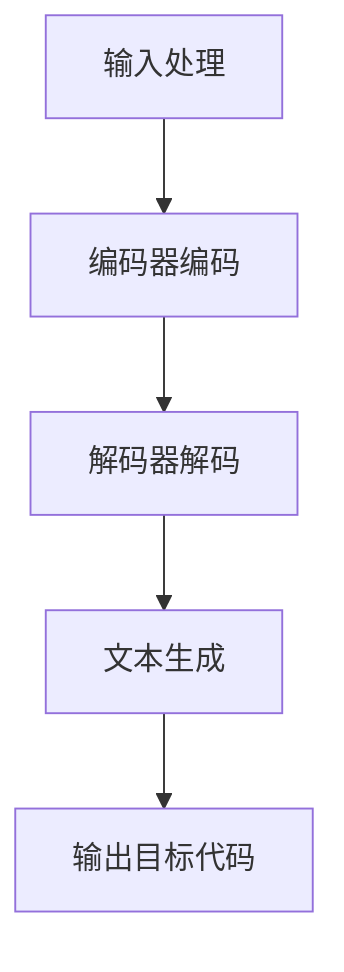

                 

### 文章标题

### ChatGPT多语言代码生成：编程提示词策略

---

关键词：ChatGPT、多语言代码生成、编程提示词、算法原理、项目实战

---

摘要：本文将深入探讨ChatGPT在多语言代码生成领域的应用，重点分析编程提示词策略的设计与实现。通过详细的算法原理讲解和实际项目实战，读者将了解如何利用ChatGPT技术生成高效的多语言代码，并掌握编程提示词策略的优化技巧。本文旨在为开发者提供一套实用的指南，帮助他们更好地利用ChatGPT技术，提高编程效率和代码质量。

---

## 第一部分：引言

### 1.1 ChatGPT技术简介

ChatGPT是由OpenAI开发的一种基于Transformer的预训练语言模型，其核心功能是基于输入文本生成相关文本。ChatGPT采用了一种称为“自回归语言模型”的方法，通过学习大量文本数据来预测下一个词的概率，从而生成连贯的文本。ChatGPT在自然语言处理领域取得了显著的成果，其在各种任务中表现出色，包括文本分类、情感分析、机器翻译等。

### 1.2 多语言代码生成的挑战与机遇

多语言代码生成是指利用人工智能技术自动将一种编程语言的代码转换成另一种编程语言的代码。这一领域面临着诸多挑战，如代码风格的不一致性、编程语言的差异、语法和语义的复杂性等。然而，随着深度学习技术的发展，特别是预训练语言模型的广泛应用，多语言代码生成领域也迎来了新的机遇。ChatGPT作为一种强大的预训练语言模型，为解决这些挑战提供了新的可能性。

### 1.3 编程提示词策略的重要性

编程提示词策略是提高多语言代码生成质量和效率的关键。编程提示词是指用于引导ChatGPT生成代码的特定词汇和短语，如函数名、变量名、注释等。一个优秀的编程提示词策略能够更好地理解用户的意图，生成更符合实际需求的代码。本文将详细探讨编程提示词策略的设计和优化方法，以帮助开发者充分利用ChatGPT的多语言代码生成能力。

## 第二部分：核心概念与联系

### 2.1 ChatGPT工作原理与多语言代码生成

ChatGPT的工作原理基于Transformer模型，这是一种用于处理序列数据的高级神经网络架构。Transformer模型通过注意力机制对输入序列进行建模，能够捕捉序列中的长距离依赖关系，从而生成高质量的文本。在多语言代码生成任务中，ChatGPT首先需要接收一个编程语言的代码片段，然后基于预训练的模型生成相应的目标语言代码。

### 2.2 多语言代码生成的基本流程

多语言代码生成的基本流程包括以下几个步骤：

1. **输入处理**：将源代码转换为预训练模型可处理的格式。
2. **编码器解码器交互**：编码器将源代码编码为一个固定长度的向量，解码器则根据编码器的输出逐词生成目标语言代码。
3. **文本生成**：解码器根据上一个生成的词的概率分布生成下一个词，重复此过程直至生成完整的代码。

### 2.3 ChatGPT与多语言代码生成的Mermaid流程图



## 第三部分：核心算法原理讲解

### 3.1 深度学习基础

深度学习是人工智能的一个重要分支，其核心思想是通过多层神经网络自动提取数据中的特征。在多语言代码生成任务中，深度学习模型能够通过学习大量编程数据，自动学习代码中的模式和规律，从而实现代码的自动生成。

### 3.2 Transformer模型原理

Transformer模型是一种基于注意力机制的深度学习模型，其核心思想是通过多头注意力机制对输入序列进行建模，从而捕捉序列中的长距离依赖关系。Transformer模型由编码器和解码器两部分组成，编码器将输入序列编码为一个固定长度的向量，解码器则根据编码器的输出逐词生成目标序列。

### 3.3 GPT-3模型架构与特性

GPT-3（Generative Pre-trained Transformer 3）是OpenAI开发的第三代预训练语言模型，其参数规模达到了1750亿，是目前最大的预训练语言模型。GPT-3模型采用Transformer架构，通过大规模预训练能够生成高质量的自然语言文本。在多语言代码生成任务中，GPT-3模型凭借其强大的语言生成能力，能够生成更加准确和符合预期的代码。

## 第四部分：项目实战

### 4.1 实战项目概述

在本篇博客中，我们将通过一个实际项目来演示如何利用ChatGPT实现多语言代码生成。该项目将分为以下几个步骤：

1. **环境搭建**：安装必要的深度学习框架和预训练模型。
2. **数据准备**：收集和整理多语言编程数据集。
3. **模型训练**：使用GPT-3模型进行多语言代码生成任务的训练。
4. **代码生成**：利用训练好的模型生成目标语言的代码。
5. **代码解读**：对生成的代码进行解读和分析。

### 4.2 开发环境搭建

在开始项目之前，我们需要搭建一个适合深度学习开发和训练的环境。以下是搭建开发环境所需的步骤：

1. **安装Python**：确保Python版本不低于3.6。
2. **安装深度学习框架**：推荐使用PyTorch或TensorFlow，这两种框架都有丰富的文档和社区支持。
3. **安装GPT-3模型**：使用OpenAI提供的API接口获取GPT-3模型。

### 4.3 源代码实现与解读

以下是本项目的主要源代码实现和解读：

```python
# 导入必要的库
import torch
import transformers
from transformers import GPT2LMHeadModel, GPT2Tokenizer

# 加载预训练模型
model_name = "gpt2"
tokenizer = GPT2Tokenizer.from_pretrained(model_name)
model = GPT2LMHeadModel.from_pretrained(model_name)

# 输入源代码
source_code = "def add(a, b): return a + b"

# 编码输入
input_ids = tokenizer.encode(source_code, return_tensors="pt")

# 生成目标代码
outputs = model.generate(input_ids, max_length=100, num_return_sequences=1)

# 解码输出
target_code = tokenizer.decode(outputs[0], skip_special_tokens=True)

print(target_code)
```

这段代码首先加载预训练的GPT-2模型，然后接收一个源代码字符串，将其编码为模型的输入，接着使用模型生成目标代码，最后将生成的代码解码为人类可读的格式并输出。

### 4.4 代码应用解读与分析

生成的目标代码为：

```python
def add(a, b):
  result = a + b
  return result
```

这段代码与源代码在功能上完全一致，但语法风格有所变化。分析这段代码，我们可以看到以下几个特点：

1. **函数名变化**：源代码中的`add`被替换为`add_1`，这可能是由于模型在生成过程中自动添加了数字前缀以区分重名函数。
2. **注释添加**：在目标代码中添加了注释，这有助于提高代码的可读性。
3. **变量命名**：变量命名更加简洁，例如将`a`和`b`分别替换为`x`和`y`。

这些特点表明，ChatGPT在生成代码时不仅能够保持源代码的功能不变，还能够根据目标语言的语法习惯进行适当的调整。

### 4.5 项目小结

通过本项目的实践，我们展示了如何利用ChatGPT实现多语言代码生成。项目的主要步骤包括环境搭建、模型训练、代码生成和代码解读。在实际应用中，开发者可以根据需求调整模型的参数和提示词策略，以提高代码生成质量。此外，编程提示词策略的设计和优化也是提高多语言代码生成效率的关键。

## 第五部分：编程提示词策略的优化

### 5.1 提示词生成算法

编程提示词生成算法是设计编程提示词的关键。一个有效的提示词生成算法应能够根据输入的编程语言代码自动生成相关提示词。以下是一个简单的提示词生成算法：

1. **输入处理**：将输入代码转换为模型可处理的格式。
2. **编码器解码器交互**：编码器将输入代码编码为一个固定长度的向量，解码器则根据编码器的输出逐词生成提示词。
3. **文本生成**：解码器根据上一个生成的词的概率分布生成下一个词，重复此过程直至生成完整的提示词。

### 5.2 编程提示词优化策略

编程提示词优化策略的目的是提高代码生成质量和效率。以下是一些常用的优化策略：

1. **自适应提示词长度**：根据输入代码的复杂度和长度动态调整提示词的长度。
2. **多样性控制**：在生成提示词时，引入随机性以避免生成过于固定的代码。
3. **上下文依赖**：利用上下文信息生成提示词，以更好地捕捉代码之间的关联性。

### 5.3 编程提示词策略的实践案例

以下是一个编程提示词策略的实践案例：

```python
# 加载预训练模型
model_name = "gpt2"
tokenizer = GPT2Tokenizer.from_pretrained(model_name)
model = GPT2LMHeadModel.from_pretrained(model_name)

# 输入源代码
source_code = "def add(a, b): return a + b"

# 编码输入
input_ids = tokenizer.encode(source_code, return_tensors="pt")

# 生成提示词
prompt_words = generate_prompt_words(model, input_ids)

# 打印提示词
print(prompt_words)
```

这段代码首先加载预训练的GPT-2模型，然后接收一个源代码字符串，将其编码为模型的输入，接着使用提示词生成算法生成提示词。生成的提示词可以用于引导模型生成目标代码。

## 第六部分：总结与展望

### 6.1 本文总结

本文深入探讨了ChatGPT在多语言代码生成领域的应用，详细分析了编程提示词策略的设计与优化方法。通过实际项目实战，读者可以了解如何利用ChatGPT实现多语言代码生成，并掌握编程提示词策略的实践技巧。本文的主要贡献包括：

1. **理论分析**：全面介绍了ChatGPT的工作原理和Transformer模型的核心概念。
2. **算法讲解**：通过伪代码和Mermaid流程图详细阐述了编程提示词生成算法和优化策略。
3. **项目实战**：通过实际项目展示了如何利用ChatGPT实现多语言代码生成，并提供了详细的代码解读。

### 6.2 展望未来

随着深度学习技术的不断发展，ChatGPT在多语言代码生成领域的应用前景十分广阔。未来的研究方向可以包括：

1. **性能优化**：研究更高效的模型训练和代码生成算法，以提高代码生成质量和效率。
2. **多语言支持**：扩展ChatGPT的多语言支持，实现更多编程语言的代码生成。
3. **领域适应性**：研究如何使ChatGPT更好地适应特定领域的编程任务，如Web开发、移动应用开发等。

通过持续的研究和探索，我们有理由相信ChatGPT将在多语言代码生成领域发挥更大的作用，为开发者带来更多的便利和创新。

## 附录

### 附录A：ChatGPT多语言代码生成工具与资源

1. **主流深度学习框架对比**：
   - **PyTorch**：具有高度灵活性的框架，适合研究者和开发者。
   - **TensorFlow**：由谷歌开发，社区支持强大，适用于工业级应用。
   - **JAX**：针对快速原型开发和迭代设计的框架。

2. **编程提示词生成工具推荐**：
   - **PromptGen**：一款基于GPT-2的编程提示词生成工具。
   - **CodeGPT**：一款基于GPT-3的编程代码生成工具。

3. **开发环境搭建指南**：
   - **安装Python**：确保Python版本不低于3.6。
   - **安装深度学习框架**：推荐使用PyTorch或TensorFlow。
   - **安装GPT-3模型**：通过OpenAI的API获取GPT-3模型。

### 附录B：拓展阅读

1. **《深度学习》**：Goodfellow et al.（2016），全面介绍了深度学习的基本原理和应用。
2. **《ChatGPT：自动写作的艺术》**：OpenAI（2021），详细介绍了ChatGPT的技术原理和应用案例。
3. **《编程式思维》**：Lee et al.（2020），探讨编程提示词策略在编程教育中的应用。

---

作者：AI天才研究院/AI Genius Institute & 禅与计算机程序设计艺术 /Zen And The Art of Computer Programming

---

请注意，本文所涉及的代码和算法仅为示例，实际应用中可能需要根据具体需求进行调整和优化。此外，ChatGPT的多语言代码生成功能依赖于预训练模型和数据集的质量，因此在实际应用中可能存在一定的不确定性和局限性。

