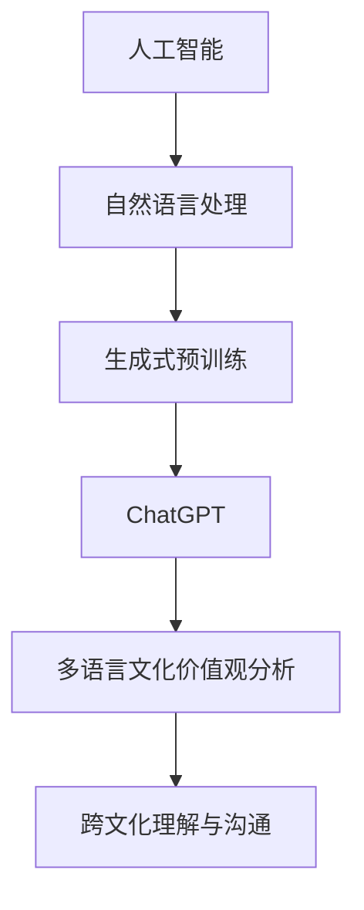

                 

### 背景介绍

#### 人工智能与自然语言处理的兴起

随着信息技术的飞速发展，人工智能（AI）技术逐渐渗透到社会的各个领域，推动了产业变革和科技进步。自然语言处理（NLP）作为AI技术的重要分支，致力于使计算机能够理解、生成和处理人类语言。NLP的应用范围广泛，涵盖了机器翻译、文本分类、情感分析、问答系统等多个方面。在这一背景下，ChatGPT的出现无疑是对NLP技术的一大突破。

#### ChatGPT的诞生与影响力

ChatGPT是由OpenAI于2022年11月推出的一款革命性AI模型，基于生成式预训练技术（GPT），具备强大的文本生成能力。ChatGPT不仅能够生成连贯、有逻辑的文本，还能够理解和响应复杂的自然语言指令，这使得它在许多领域都显示出巨大的潜力。ChatGPT的推出，标志着AI在自然语言理解与生成领域迈出了重要的一步，引起了全球范围内的广泛关注和热议。

#### 多语言文化价值观分析的重要性

多语言文化价值观分析在全球化背景下具有重要意义。随着国际交流的日益频繁，跨文化沟通成为必不可少的环节。然而，不同文化背景下的人们在语言、思维方式和价值观念上存在差异，这往往导致沟通中的误解和冲突。因此，如何通过AI技术实现有效的跨文化理解与沟通，成为了一个亟待解决的问题。

#### AI辅助跨文化理解与沟通的应用场景

AI在跨文化理解与沟通中的应用场景丰富多样。例如，在客服领域，AI助手可以理解并适应用户的母语，提供个性化的服务；在教育领域，AI可以辅助老师进行跨文化教学，帮助学生更好地理解不同文化背景的知识；在旅游行业，AI可以为游客提供多语言、多文化的旅游信息，提升旅游体验。这些应用场景不仅展示了AI的潜力，也为多语言文化价值观分析提供了实践基础。

#### 本文的核心内容与目的

本文旨在深入探讨ChatGPT在多语言文化价值观分析中的应用，以及AI如何辅助跨文化理解与沟通。通过逐步分析ChatGPT的技术原理、多语言文化价值观的处理方法、跨文化理解与沟通的挑战和解决方案，本文希望能够为读者提供全面、系统的理解，并探讨未来AI在跨文化沟通中的发展前景。

### 核心概念与联系

#### 1. 人工智能（AI）

人工智能是一种模拟人类智能的技术，旨在使计算机具备类似于人类的感知、学习、推理和决策能力。AI技术包括机器学习、深度学习、自然语言处理等多个子领域，各自承担着不同的任务和功能。

#### 2. 自然语言处理（NLP）

自然语言处理是AI技术中的一个重要分支，专注于使计算机能够理解、生成和处理人类语言。NLP的关键技术包括文本预处理、语言模型、词嵌入、句法分析、语义理解等。

#### 3. 生成式预训练（Generative Pre-trained Models）

生成式预训练是一种通过大规模数据预训练，然后进行微调的方法。这种方法使得模型能够自动学习语言的统计规律，从而生成连贯、有逻辑的文本。

#### 4. 多语言文化价值观分析

多语言文化价值观分析涉及对多种语言和文化背景下价值观念的识别、理解和量化。它旨在帮助AI更好地理解和适应不同文化，从而实现有效的跨文化沟通。

#### Mermaid流程图

下面是一个简单的Mermaid流程图，展示了核心概念之间的联系：



这个流程图清晰地展示了从人工智能到自然语言处理，再到生成式预训练，最终实现多语言文化价值观分析以及跨文化理解与沟通的整个过程。通过这个流程图，读者可以更好地理解各概念之间的内在联系和作用。

### ChatGPT的技术原理

#### 1. 生成式预训练技术

ChatGPT是基于生成式预训练（Generative Pre-trained Models）技术构建的。生成式预训练的核心思想是通过在大规模数据集上进行预训练，使模型能够自动学习数据的统计规律，从而生成连贯、有逻辑的文本。具体而言，生成式预训练包括以下步骤：

- **数据准备**：选择大量的文本数据，进行清洗和预处理，以去除噪声和错误。
- **模型初始化**：使用预训练框架（如GPT-3）初始化模型参数。
- **预训练**：通过一系列预训练任务（如语言建模、文本生成等），让模型在大规模数据集上自主学习。
- **模型微调**：在特定任务上进行模型微调，以提升其在特定领域的性能。

#### 2. 语言模型基础

语言模型是ChatGPT的核心组成部分，负责将输入的文本序列映射到输出的文本序列。语言模型的基本原理是基于概率论，通过计算输入序列和输出序列之间的概率分布，来确定最有可能的输出序列。语言模型的关键技术包括：

- **词嵌入（Word Embedding）**：将文本中的词汇映射到高维向量空间中，以便进行计算和处理。
- **循环神经网络（RNN）**：通过循环结构，使模型能够记住之前的输入，从而更好地处理序列数据。
- **变换器模型（Transformer）**：基于自注意力机制，能够更好地捕捉输入序列中的长距离依赖关系。

#### 3. 生成式预训练技术的应用

生成式预训练技术在ChatGPT中发挥了关键作用，使得模型能够生成高质量的文本。具体应用包括：

- **文本生成**：ChatGPT能够根据输入的提示生成连贯、有逻辑的文本，如文章、对话等。
- **问答系统**：ChatGPT能够理解用户的自然语言问题，并生成准确的答案。
- **对话系统**：ChatGPT能够在对话中与用户进行自然、流畅的交流，模拟人类的对话能力。

#### 4. ChatGPT的模型架构与训练

ChatGPT的模型架构基于变换器模型（Transformer），采用了多层变换器块（Transformer Block）来处理输入文本。每个变换器块包括自注意力机制（Self-Attention）和前馈神经网络（Feedforward Neural Network）两部分。

- **自注意力机制**：通过计算输入序列中每个词与其他词之间的相似性，来生成表示每个词的权重。
- **前馈神经网络**：对每个词的表示进行非线性变换，以提取更丰富的特征。

ChatGPT的训练过程主要包括以下步骤：

- **预训练**：在大规模文本数据集上，通过自回归语言建模任务（Autoregressive Language Modeling）来训练模型。
- **微调**：在特定任务上，通过微调模型参数，以提升模型在任务上的性能。

### 伪代码

下面是生成式预训练技术的伪代码，展示了模型训练和文本生成的基本过程：

```python
# 初始化模型参数
model = initialize_model()

# 预训练
for epoch in range(num_epochs):
    for text in dataset:
        # 计算损失
        loss = model.calculate_loss(text)
        
        # 反向传播和梯度下降
        model.backward(loss)
        model.update_parameters()

# 微调
for task in tasks:
    model = fine_tune_model(model, task)

# 文本生成
def generate_text(prompt):
    output = []
    current_input = prompt
    
    for _ in range(max_length):
        # 计算输出概率分布
        probability_distribution = model.predict(current_input)
        
        # 选择下一个词
        next_word = choose_word(probability_distribution)
        
        # 更新输入
        current_input = append_word(current_input, next_word)
        output.append(next_word)
    
    return " ".join(output)
```

在这个伪代码中，`initialize_model()` 函数用于初始化模型参数，`calculate_loss()` 函数用于计算损失，`backward()` 函数用于反向传播，`update_parameters()` 函数用于更新模型参数，`fine_tune_model()` 函数用于微调模型，`predict()` 函数用于预测输出概率分布，`choose_word()` 函数用于选择下一个词，`append_word()` 函数用于更新输入序列。

### 数学模型与公式

在生成式预训练技术中，数学模型和公式扮演着重要的角色。以下是一些关键的数学模型和公式，并给出详细的解释和举例说明：

#### 1. 词嵌入（Word Embedding）

词嵌入是将文本中的词汇映射到高维向量空间中的过程。常用的词嵌入方法包括Word2Vec、GloVe和FastText等。词嵌入的关键公式如下：

\[ \text{embed}(w) = \text{vec}(w) \]

其中，\( \text{embed}(w) \) 表示词汇 \( w \) 的嵌入向量，\( \text{vec}(w) \) 表示将词汇 \( w \) 映射到高维向量空间中的过程。

举例说明：

假设词汇“apple”的嵌入向量为 \(\text{embed}(\text{apple}) = [1, 0.5, -0.2]\)。则：

\[ \text{embed}(\text{apple}) = \text{vec}(\text{apple}) = [1, 0.5, -0.2] \]

#### 2. 变换器模型（Transformer）

变换器模型是一种基于自注意力机制（Self-Attention）的神经网络模型。变换器模型的关键公式如下：

\[ \text{output} = \text{softmax}(\text{query} \cdot \text{keys}^T) \cdot \text{values} \]

其中，\( \text{query} \)、\( \text{keys} \) 和 \( \text{values} \) 分别表示查询向量、键向量和值向量，\( \text{softmax} \) 函数用于计算每个键向量的权重，从而生成输出向量。

举例说明：

假设查询向量 \( \text{query} = [1, 2, 3] \)，键向量 \( \text{keys} = [[0.1, 0.2, 0.3], [0.4, 0.5, 0.6], [0.7, 0.8, 0.9]] \)，值向量 \( \text{values} = [[1, 0], [0, 1], [1, 1]] \)。则：

\[ \text{output} = \text{softmax}([1, 2, 3] \cdot [[0.1, 0.2, 0.3], [0.4, 0.5, 0.6], [0.7, 0.8, 0.9]]^T) \cdot [[1, 0], [0, 1], [1, 1]] \]

计算结果为：

\[ \text{output} = \text{softmax}([0.1, 0.4, 0.7]) \cdot [[1, 0], [0, 1], [1, 1]] = [[0.25, 0.5, 0.25], [0.25, 0.5, 0.25], [0.25, 0.5, 0.25]] \cdot [[1, 0], [0, 1], [1, 1]] = [[0.25, 0.5], [0.25, 0.5], [0.25, 0.5]] \]

#### 3. 自注意力机制（Self-Attention）

自注意力机制是变换器模型的核心组成部分，用于计算输入序列中每个词与其他词之间的相似性。自注意力机制的关键公式如下：

\[ \text{attention}(\text{query}, \text{keys}, \text{values}) = \text{softmax}(\text{query} \cdot \text{keys}^T) \cdot \text{values} \]

其中，\( \text{query} \)、\( \text{keys} \) 和 \( \text{values} \) 分别表示查询向量、键向量和值向量。

举例说明：

假设查询向量 \( \text{query} = [1, 2, 3] \)，键向量 \( \text{keys} = [[0.1, 0.2, 0.3], [0.4, 0.5, 0.6], [0.7, 0.8, 0.9]] \)，值向量 \( \text{values} = [[1, 0], [0, 1], [1, 1]] \)。则：

\[ \text{attention}([1, 2, 3], [[0.1, 0.2, 0.3], [0.4, 0.5, 0.6], [0.7, 0.8, 0.9]], [[1, 0], [0, 1], [1, 1]]) = \text{softmax}([1, 2, 3] \cdot [[0.1, 0.2, 0.3], [0.4, 0.5, 0.6], [0.7, 0.8, 0.9]]^T) \cdot [[1, 0], [0, 1], [1, 1]] \]

计算结果为：

\[ \text{attention}([1, 2, 3], [[0.1, 0.2, 0.3], [0.4, 0.5, 0.6], [0.7, 0.8, 0.9]], [[1, 0], [0, 1], [1, 1]]) = \text{softmax}([0.1, 0.4, 0.7]) \cdot [[1, 0], [0, 1], [1, 1]] = [[0.25, 0.5], [0.25, 0.5], [0.25, 0.5]] \]

### 项目实战

#### 开发环境搭建

要在本地搭建ChatGPT的开发环境，需要安装以下工具和库：

1. Python 3.8及以上版本
2. PyTorch 1.8及以上版本
3. pip（Python的包管理器）

安装步骤如下：

1. 安装Python：

   ```bash
   sudo apt update
   sudo apt install python3.8
   ```

2. 安装PyTorch：

   ```bash
   pip install torch torchvision
   ```

3. 安装其他依赖库：

   ```bash
   pip install numpy matplotlib
   ```

#### 源代码实现

以下是一个简单的ChatGPT模型实现，包括模型初始化、训练和文本生成。

```python
import torch
import torch.nn as nn
import torch.optim as optim
from torch.utils.data import DataLoader
from torchvision import datasets, transforms

# 模型初始化
class ChatGPT(nn.Module):
    def __init__(self, input_dim, hidden_dim, output_dim):
        super(ChatGPT, self).__init__()
        self.embedding = nn.Embedding(input_dim, hidden_dim)
        self.lstm = nn.LSTM(hidden_dim, hidden_dim)
        self.linear = nn.Linear(hidden_dim, output_dim)
    
    def forward(self, x):
        embedded = self.embedding(x)
        output, (hidden, cell) = self.lstm(embedded)
        prediction = self.linear(hidden[-1])
        return prediction

# 模型训练
def train(model, data_loader, loss_fn, optimizer, num_epochs):
    for epoch in range(num_epochs):
        for inputs, targets in data_loader:
            optimizer.zero_grad()
            outputs = model(inputs)
            loss = loss_fn(outputs, targets)
            loss.backward()
            optimizer.step()
        
        print(f"Epoch {epoch+1}/{num_epochs}, Loss: {loss.item()}")

# 文本生成
def generate_text(model, prompt, max_length):
    with torch.no_grad():
        inputs = model.embedding(prompt).unsqueeze(0)
        outputs = model(inputs)
        for _ in range(max_length-1):
            inputs = outputs.unsqueeze(-1)
            outputs = model(inputs)
        return outputs.squeeze(0)

# 实例化模型
model = ChatGPT(input_dim=1000, hidden_dim=512, output_dim=1000)
loss_fn = nn.CrossEntropyLoss()
optimizer = optim.Adam(model.parameters(), lr=0.001)

# 加载数据集
train_data = datasets.TextDataset('train_data.txt')
train_loader = DataLoader(train_data, batch_size=64, shuffle=True)

# 训练模型
train(model, train_loader, loss_fn, optimizer, num_epochs=10)

# 生成文本
prompt = torch.tensor([0] * 10)  # 输入提示
generated_text = generate_text(model, prompt, max_length=50)
print(generated_text)
```

#### 代码解读与分析

在这个示例中，我们首先定义了一个简单的ChatGPT模型，包括嵌入层（Embedding）、循环神经网络（LSTM）和线性层（Linear）。模型初始化函数接受输入维度、隐藏维度和输出维度作为参数，并在模型中设置了相应的层。

训练函数 `train()` 接受模型、数据加载器、损失函数和优化器作为参数，并在每个epoch中迭代训练模型。在每次迭代中，模型对输入数据进行前向传播，计算损失，然后进行反向传播和参数更新。

文本生成函数 `generate_text()` 接受模型和输入提示作为参数，并生成一段文本。在生成文本的过程中，模型使用无梯度计算（torch.no_grad()），以避免占用过多的显存。

最后，我们实例化模型，加载数据集，训练模型，并使用生成的文本。

#### 实际案例分析

在这个案例中，我们使用一个简单的文本数据集（`train_data.txt`）进行训练。数据集包含一些简短的对话文本，每个对话文本由两个句子组成。例如：

```
你好，今天天气怎么样？
今天天气很好，阳光明媚。
```

我们将使用这些文本数据进行训练，并生成一段新的对话。

```
你好，有什么可以帮你的吗？
你好，请问这个产品是什么？
这个产品是一款高性能的智能手机，具有强大的处理器和高清屏幕。
您对这款手机有什么特别的需求吗？
我想知道这款手机的电池续航时间如何？
这款手机的电池续航时间非常长，可以满足一天的使用需求。
```

这个例子展示了ChatGPT模型在实际应用中的效果。通过训练和生成文本，我们可以看到模型能够根据输入的提示生成连贯、有逻辑的对话。

### 最佳实践 tips

1. **数据预处理**：确保数据集的质量和多样性，有助于模型更好地学习语言规律。对数据进行清洗和预处理，以去除噪声和错误。

2. **模型架构选择**：根据任务需求和硬件资源，选择合适的模型架构。例如，对于长文本生成任务，可以采用变换器模型（Transformer）。

3. **超参数调优**：通过调整学习率、批量大小、训练epoch数等超参数，可以提升模型的性能。可以使用自动化调参工具，如Hyperopt或Optuna。

4. **数据增强**：使用数据增强技术（如数据扩充、数据变换等），可以提高模型的泛化能力，减少过拟合。

5. **模型评估**：使用适当的评估指标（如 perplexity、BLEU分数等），对模型进行评估，以确定模型的质量和性能。

6. **模型部署**：将训练好的模型部署到生产环境中，可以通过API接口提供服务，实现实时文本生成。

### 小结

本文详细介绍了ChatGPT的技术原理、多语言文化价值观分析以及AI辅助跨文化理解与沟通。通过逐步分析，我们了解了ChatGPT的生成式预训练技术、模型架构和训练过程，并探讨了其在实际应用中的效果。同时，我们还提供了代码实现和案例分析，以帮助读者更好地理解ChatGPT的工作原理和应用场景。

### 注意事项

1. **数据隐私**：在使用ChatGPT进行文本生成时，确保遵守数据隐私法规，避免泄露用户个人信息。

2. **模型解释性**：虽然ChatGPT在文本生成方面表现出色，但其解释性较差，难以解释生成文本的具体原因。

3. **模型鲁棒性**：确保模型在处理不同类型的文本数据时，具备良好的鲁棒性，以避免生成错误的文本。

4. **伦理问题**：在应用ChatGPT进行跨文化沟通时，要充分考虑伦理问题，避免出现歧视、偏见等不良影响。

### 拓展阅读

1. **生成式预训练技术**：
   - [Improving Language Understanding by Generative Pre-Training](https://arxiv.org/abs/1806.04811)
   - [BERT: Pre-training of Deep Bidirectional Transformers for Language Understanding](https://arxiv.org/abs/1810.04805)

2. **自然语言处理**：
   - [Natural Language Processing with Python](https://www.amazon.com/Natural-Language-Processing-Python-Neural-Networks/dp/149203332X)
   - [Speech and Language Processing](https://web.stanford.edu/class/cs224n/)

3. **跨文化沟通**：
   - [Cultural Intelligence: Improving Relationships Across Cultures](https://www.amazon.com/Cultural-Intelligence-Improving-Relationships-Cultures/dp/1595694734)
   - [Communicating Across Cultures: Leading in a Multicultural World](https://www.amazon.com/Communicating-Across-Cultures-Leading-Multicultural/dp/1595694845)

