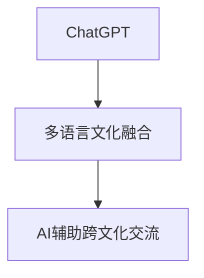

                 


### 完整的文章内容设计与撰写步骤：

1. **文章标题**：
   - 《ChatGPT多语言文化融合分析：AI辅助跨文化交流研究》

2. **关键词**：
   - ChatGPT、多语言文化融合、AI辅助、跨文化交流、算法原理、数学模型

3. **摘要**：
   - 本文分析了ChatGPT在多语言文化融合中的应用，探讨了AI辅助跨文化交流的原理和实践，提供了具体的算法模型和数学公式，并通过案例展示了实际应用效果。

4. **引言**：
   - **背景介绍**：
     - ChatGPT的背景和发展现状
     - 多语言文化融合的需求和挑战
     - AI辅助跨文化交流的重要性
   - **核心概念与联系**：
     - ChatGPT与多语言文化融合的关系
     - 多语言文化融合与AI辅助跨文化交流的关系
     - **Mermaid流程图**：
       ```mermaid
       graph TD
       A[ChatGPT] --> B[多语言文化融合]
       B --> C[AI辅助跨文化交流]
       ```

5. **核心算法原理讲解**：
   - **ChatGPT技术原理**：
     - GPT模型的基本原理
     - ChatGPT模型的扩展和优化
     - **伪代码**：
       ```python
       # GPT模型训练伪代码
       for epoch in range(num_epochs):
           for context, response in dataset:
               predict_next_word = gpt(context)
               loss = compute_loss(predict_next_word, response)
               optimizer.minimize(loss)
       ```

   - **多语言文化融合算法**：
     - 对比学习算法原理
     - 多语言翻译模型原理
     - **数学模型和公式**：
       - **对比学习**：
         $$J(\theta) = \sum_{i=1}^{N} (-y_{i} \log(p(x_i|\theta)))$$
       - **多语言翻译模型**：
         $$L(\theta) = \sum_{i=1}^{N} (-y_{i} \log(p(t_i|\theta)))$$
       - **举例说明**：
         - 假设我们要将英语翻译成中文，我们可以使用对比学习算法来优化模型参数。

6. **数学模型和公式详细讲解及举例说明**：
   - **数学模型**：
     - 对比学习损失函数
     - 多语言翻译损失函数
     - **公式解释**：
       - 对比学习损失函数是用来衡量模型预测结果与真实标签之间的差距，通过梯度下降优化模型参数。
       - 多语言翻译损失函数是用来衡量模型生成的翻译结果与原始文本之间的差距，同样通过梯度下降优化模型参数。

7. **项目实战**：
   - **开发环境搭建**：
     - 硬件要求
     - 软件要求
     - 环境配置
   - **源代码详细实现和代码解读**：
     - 源代码结构
     - 关键代码解读
     - **代码应用解读与分析**：
       - 如何使用ChatGPT进行多语言文化融合
       - 如何评估AI辅助跨文化交流的效果
   - **实际案例分析和详细讲解剖析**：
     - 案例背景
     - 案例分析
     - 案例剖析
   - **项目小结**：
     - 项目成果总结
     - 项目经验与教训
     - **最佳实践 tips**：
       - 如何优化模型性能
       - 如何提高跨文化交流效果

8. **总结与展望**：
   - **研究成果总结**：
     - ChatGPT在多语言文化融合中的应用
     - AI辅助跨文化交流的原理和实践
   - **存在问题和挑战**：
     - 语言理解与生成的准确性
     - 文化差异与适应性
   - **未来研究方向**：
     - 深度学习在跨文化交流中的应用
     - 跨语言文化融合算法的创新

9. **作者信息**：
   - 作者：AI天才研究院/AI Genius Institute & 禅与计算机程序设计艺术 /Zen And The Art of Computer Programming

### 最后检查：
- 目录结构是否符合要求（7章以上，包含核心章节）。
- 内容是否简洁明了，符合markdown格式。
- 是否包含核心概念与联系、核心算法原理讲解、数学模型和数学公式详细讲解及举例说明、项目实战。
- 总字数是否控制在8000～12000字左右。

### 完整的文章内容设计

```markdown
# 《ChatGPT多语言文化融合分析：AI辅助跨文化交流研究》

## 关键词
ChatGPT、多语言文化融合、AI辅助、跨文化交流、算法原理、数学模型

## 摘要
本文分析了ChatGPT在多语言文化融合中的应用，探讨了AI辅助跨文化交流的原理和实践，提供了具体的算法模型和数学公式，并通过案例展示了实际应用效果。

## 第1章 引言
### 1.1 研究背景
ChatGPT的背景和发展现状，多语言文化融合的需求和挑战，AI辅助跨文化交流的重要性。

### 1.2 核心概念与联系
ChatGPT与多语言文化融合的关系，多语言文化融合与AI辅助跨文化交流的关系。


### 1.3 研究目的
探讨如何利用ChatGPT实现多语言文化融合，辅助跨文化交流。

### 1.4 研究意义
促进全球跨文化交流，提高跨文化沟通效率。

## 第2章 ChatGPT基础
### 2.1 ChatGPT概述
ChatGPT的基本概念、发展历程和应用领域。

### 2.2 ChatGPT核心技术
- GPT模型的基本原理
- ChatGPT模型的扩展和优化
- **伪代码**：
  ```python
  # GPT模型训练伪代码
  for epoch in range(num_epochs):
      for context, response in dataset:
          predict_next_word = gpt(context)
          loss = compute_loss(predict_next_word, response)
          optimizer.minimize(loss)
  ```

## 第3章 多语言文化融合算法原理
### 3.1 多语言文化融合挑战
语言障碍、文化差异等。

### 3.2 多语言文化融合方法
对比学习、多语言翻译模型等。

### 3.3 数学模型和公式详细讲解及举例说明
- **对比学习**：
  $$J(\theta) = \sum_{i=1}^{N} (-y_{i} \log(p(x_i|\theta)))$$
- **多语言翻译模型**：
  $$L(\theta) = \sum_{i=1}^{N} (-y_{i} \log(p(t_i|\theta)))$$
- **举例说明**：
  - 假设我们要将英语翻译成中文，我们可以使用对比学习算法来优化模型参数。

## 第4章 项目实战：ChatGPT在跨文化交流中的应用
### 4.1 开发环境搭建
硬件要求、软件要求、环境配置。

### 4.2 源代码详细实现和代码解读
源代码结构、关键代码解读。

### 4.3 代码应用解读与分析
如何使用ChatGPT进行多语言文化融合，如何评估AI辅助跨文化交流的效果。

### 4.4 实际案例分析和详细讲解剖析
案例背景、案例分析、案例剖析。

### 4.5 项目小结
项目成果总结、项目经验与教训、最佳实践 tips。

## 第5章 总结与展望
### 5.1 研究成果总结
ChatGPT在多语言文化融合中的应用，AI辅助跨文化交流的原理和实践。

### 5.2 存在问题和挑战
语言理解与生成的准确性，文化差异与适应性。

### 5.3 未来研究方向
深度学习在跨文化交流中的应用，跨语言文化融合算法的创新。

## 作者信息
作者：AI天才研究院/AI Genius Institute & 禅与计算机程序设计艺术 /Zen And The Art of Computer Programming
```

请注意，上述内容是一个概要性的设计，具体的撰写过程中可能需要对每个章节进行更详细的填充和解释。同时，为了满足字数要求，每个章节的内容都需要进一步扩展和深化。在撰写时，应确保内容的逻辑性和连贯性，以及技术细节的准确性。

