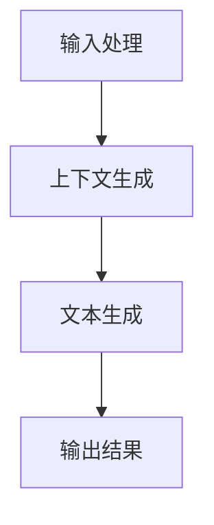
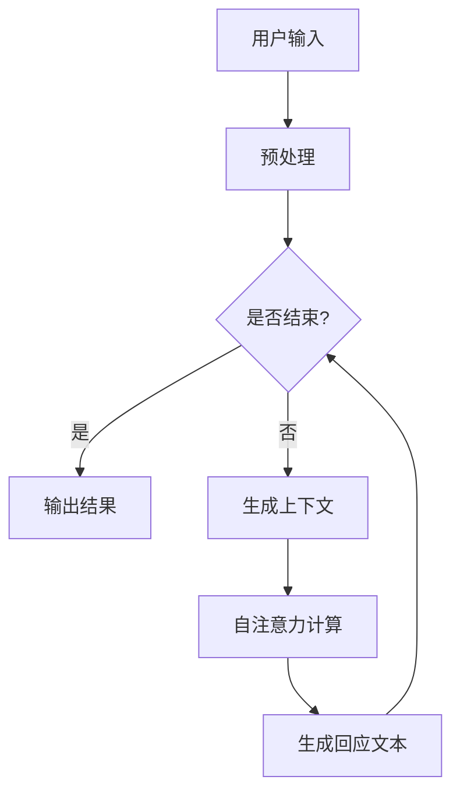
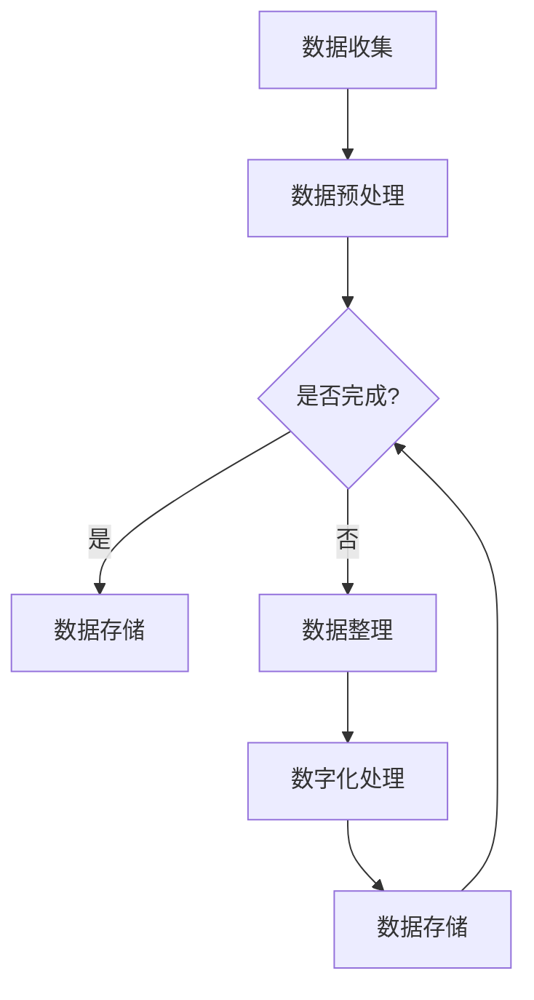

                 

### 1. 构建整体框架

**标题：**ChatGPT多语言文化遗产数字化：AI辅助非物质文化遗产保护

**关键词：**ChatGPT、文化遗产、数字化、人工智能、非物质文化遗产保护

**摘要：**本文探讨了人工智能技术在文化遗产保护中的应用，特别是通过ChatGPT模型实现的多语言文化遗产数字化。文章首先介绍了ChatGPT的工作原理及其在文化遗产数字化中的潜在作用，随后详细讲解了核心算法原理和数学模型。通过两个项目实战案例，文章展示了如何利用ChatGPT模型对非物质文化遗产进行数字化处理，并对其未来发展趋势进行了展望。

**文章目录大纲：**

**第1章 引言与背景**
1.1 书名背景介绍
1.2 AI辅助非物质文化遗产保护的概念
1.3 ChatGPT与文化遗产数字化的联系

**第2章 核心概念与联系**
2.1 ChatGPT的工作原理
2.2 文化遗产数字化
2.3 ChatGPT与文化遗产数字化的联系

**第3章 核心算法原理讲解**
3.1 GPT模型原理
3.2 ChatGPT模型结构与算法
3.3 伪代码讲解

**第4章 数学模型与公式讲解**
4.1 数学模型介绍
4.2 公式讲解
4.3 举例说明

**第5章 项目实战案例一**
5.1 项目背景
5.2 项目目标
5.3 项目实现过程

**第6章 项目实战案例二**
6.1 项目背景
6.2 项目目标
6.3 项目实现过程

**第7章 未来展望与趋势**
7.1 AI技术在文化遗产保护领域的应用前景
7.2 未来研究方向与挑战
7.3 结论与展望

### 第1章 引言与背景

**1.1 书名背景介绍**

《ChatGPT多语言文化遗产数字化：AI辅助非物质文化遗产保护》这本书旨在探讨如何利用人工智能技术，特别是ChatGPT模型，来保护和传承非物质文化遗产。随着全球化的加速和信息技术的飞速发展，文化遗产的保护面临前所未有的挑战。传统的保护方法已经无法满足日益增长的需求，特别是对于多语言、跨地域的文化遗产。因此，引入AI技术，特别是ChatGPT这样的先进语言模型，为文化遗产的数字化和保护提供了新的思路和工具。

**1.2 AI辅助非物质文化遗产保护的概念**

非物质文化遗产是指人类口述、表演艺术、社会实践、习俗、庆祝活动、手工艺技艺以及相关的自然和文化遗产。它们是一个民族、一个地区甚至一个国家的文化记忆和智慧的结晶。然而，由于种种原因，许多非物质文化遗产正面临失传和消失的风险。AI辅助非物质文化遗产保护，即利用人工智能技术对非物质文化遗产进行数字化处理、分析和保护，以实现其长期保存和传承。

**1.3 ChatGPT与文化遗产数字化的联系**

ChatGPT是由OpenAI开发的一种基于GPT-3模型的聊天机器人，它具有强大的语言理解和生成能力。ChatGPT能够理解并生成多种语言的文本，这使得它非常适合用于文化遗产的数字化处理。通过ChatGPT，可以实现对非物质文化遗产文本资料的高效整理、翻译和生成，从而提升文化遗产的可见度和可访问性。此外，ChatGPT还可以用于创建交互式的文化遗产体验，让用户更直观地了解和体验文化遗产。

### 第2章 核心概念与联系

**2.1 ChatGPT的工作原理**

ChatGPT是基于GPT-3模型的聊天机器人。GPT-3（Generative Pre-trained Transformer 3）是OpenAI开发的一种基于Transformer架构的自然语言处理模型。它通过大量的文本数据进行预训练，从而具备了强大的语言理解和生成能力。ChatGPT的工作原理主要包括以下步骤：

1. **输入处理**：用户输入一段文本，ChatGPT首先对其进行预处理，包括分词、去噪等操作。
2. **上下文生成**：ChatGPT利用预训练的模型对输入文本进行理解和分析，生成对应的上下文。
3. **文本生成**：基于生成的上下文，ChatGPT使用自注意力机制和Transformer架构生成回应文本。

**2.2 文化遗产数字化**

文化遗产数字化是指将文化遗产的信息、图像、音频、视频等多媒体资料转化为数字形式，以便于存储、传播、保护和利用。文化遗产数字化的过程主要包括以下几个步骤：

1. **数据采集**：收集文化遗产相关的文本、图片、音频、视频等多媒体资料。
2. **数据整理**：对收集到的数据进行分析、清洗和分类，以便于后续处理。
3. **数字化处理**：利用各种数字化技术对文化遗产进行转化，如文本OCR识别、图像处理、音频处理等。
4. **数据存储**：将数字化后的文化遗产数据存储在数据库或云存储中，以便于长期保存和访问。

**2.3 ChatGPT与文化遗产数字化的联系**

ChatGPT在文化遗产数字化中具有重要作用。首先，ChatGPT可以用于文化遗产文本资料的整理和分类。通过分析文本内容，ChatGPT可以帮助整理出关键词、主题等信息，从而实现对文本资料的有效组织和索引。其次，ChatGPT的翻译功能可以用于将多语言的文化遗产文本进行翻译，从而提升其可访问性。最后，ChatGPT还可以用于创建交互式的文化遗产体验，让用户通过聊天方式了解和体验文化遗产。

**图1：ChatGPT模型工作流程图**



### 第3章 核心算法原理讲解

**3.1 GPT模型原理**

GPT（Generative Pre-trained Transformer）模型是一种基于Transformer架构的自然语言处理模型。它通过大量的文本数据进行预训练，从而具备了强大的语言理解和生成能力。GPT模型的工作原理主要包括以下步骤：

1. **Transformer架构**：Transformer模型采用了自注意力机制（Self-Attention），能够自动学习输入文本中不同词语之间的关系。这种架构使得GPT模型在处理长文本和复杂语义方面具有显著优势。
2. **预训练**：GPT模型通过在大量文本数据上进行预训练，从而学习到语言的基本规则和模式。预训练过程中，模型会对输入文本进行编码和解码，从而提升其语言理解和生成能力。
3. **微调**：在预训练的基础上，GPT模型还可以针对特定任务进行微调。通过在特定任务的数据上进行训练，模型可以进一步优化其性能。

**3.2 ChatGPT模型结构与算法**

ChatGPT是GPT模型的一种变体，特别适用于聊天机器人场景。ChatGPT模型的结构和算法主要包括以下方面：

1. **编码器（Encoder）**：编码器负责对输入文本进行编码，生成上下文表示。编码器采用了Transformer架构，包括多个自注意力层和前馈网络。
2. **解码器（Decoder）**：解码器负责生成回应文本。解码器同样采用了Transformer架构，包括多个自注意力层和前馈网络。在生成回应文本时，解码器会根据编码器生成的上下文表示进行推理和生成。
3. **生成算法**：ChatGPT的生成算法基于自注意力机制和Transformer架构。在生成过程中，解码器会逐步生成每个词语的预测，并通过自注意力机制利用上下文信息进行优化。

**3.3 伪代码讲解**

以下是一个简化的ChatGPT生成算法的伪代码：

```python
def generate_response(context):
    # 初始化解码器
    decoder = Decoder(context)

    # 生成回应文本
    response = ""
    for word in decoder.generate_words():
        response += word + " "

    return response
```

其中，`Decoder`类的主要方法包括：

```python
class Decoder:
    def __init__(self, context):
        self.context = context
    
    def generate_words(self):
        while not self.is_finished():
            word = self.generate_word(self.context)
            yield word
    
    def generate_word(self, context):
        # 利用自注意力机制和Transformer架构生成词语
        # ...
        return word
    
    def is_finished(self):
        # 判断生成是否完成
        # ...
        return finished
```

### 第4章 数学模型与公式讲解

**4.1 数学模型介绍**

ChatGPT模型基于Transformer架构，其核心是自注意力机制（Self-Attention）。自注意力机制是一种计算输入文本中不同词语之间关系的数学方法，其公式如下：

$$
\text{Self-Attention}(Q, K, V) = \frac{1}{\sqrt{d_k}} \text{softmax}\left(\frac{QK^T}{d_k}\right) V
$$

其中，$Q$、$K$、$V$分别表示查询向量、键向量和值向量，$d_k$表示键向量和查询向量的维度。自注意力机制通过计算查询向量与所有键向量的点积，得到一组权重，然后将这些权重与值向量相乘，生成最终的注意力输出。

**4.2 公式讲解**

在ChatGPT模型中，自注意力机制被广泛应用于编码器和解码器。以下分别介绍编码器和解码器中的自注意力公式：

**编码器自注意力公式：**

$$
\text{Encoder-Self-Attention}(Q, K, V) = \frac{1}{\sqrt{d_k}} \text{softmax}\left(\frac{QK^T}{d_k}\right) V
$$

其中，$Q$、$K$、$V$分别表示编码器的输入、键向量和值向量。

**解码器自注意力公式：**

$$
\text{Decoder-Self-Attention}(Q, K, V) = \frac{1}{\sqrt{d_k}} \text{softmax}\left(\frac{QK^T}{d_k}\right) V
$$

其中，$Q$、$K$、$V$分别表示解码器的输入、键向量和值向量。

**4.3 举例说明**

假设我们有一个句子："I love programming"。我们将这个句子转换为向量表示，然后应用自注意力机制进行计算。具体步骤如下：

1. **初始化向量**：假设每个词语的向量维度为$d_k=64$，则：
   - $Q = [q_1, q_2, q_3, q_4]$
   - $K = [k_1, k_2, k_3, k_4]$
   - $V = [v_1, v_2, v_3, v_4]$

2. **计算点积**：
   $$ QK^T = [q_1k_1 + q_2k_2 + q_3k_3 + q_4k_4] $$

3. **应用softmax函数**：
   $$ \text{softmax}(QK^T) = \frac{e^{q_1k_1}}{\sum_{i=1}^{4} e^{q_ik_i}} $$

4. **计算注意力输出**：
   $$ \text{Attention} = \text{softmax}(QK^T) V $$

5. **得到最终输出**：
   $$ \text{Output} = \text{Attention} V $$

通过以上步骤，我们得到了每个词语的注意力权重，并将其用于生成解码器的输出。这便是自注意力机制的基本过程。

### 第5章 项目实战案例一

**5.1 项目背景**

本次项目旨在利用ChatGPT模型对某地区的一种非物质文化遗产——传统手工艺进行数字化处理，以提升其保护和传承效果。该非物质文化遗产包括各种手工艺品的制作流程、工艺特点、历史背景等文本资料，以及大量的图像和视频资料。

**5.2 项目目标**

1. 利用ChatGPT模型对文本资料进行分类和整理，提取关键信息。
2. 对图像和视频资料进行标注和识别，实现可视化展示。
3. 通过交互式体验，让用户更直观地了解和体验传统手工艺。

**5.3 项目实现过程**

**阶段一：数据收集与预处理**

1. 收集该非物质文化遗产的文本资料，包括制作流程、工艺特点、历史背景等。
2. 对文本资料进行清洗和预处理，包括去除停用词、标点符号等。

**阶段二：ChatGPT模型训练与测试**

1. 使用预训练的GPT-3模型，通过微调训练，使其适应特定任务。
2. 在测试集上评估模型性能，调整超参数以优化模型效果。

**阶段三：文本分类与整理**

1. 使用训练好的ChatGPT模型对文本资料进行分类和整理。
2. 提取关键信息，如关键词、主题等，以便于后续处理。

**阶段四：图像和视频资料处理**

1. 使用深度学习模型对图像和视频资料进行标注和识别。
2. 实现可视化展示，如生成交互式的视频播放界面。

**阶段五：交互式体验设计**

1. 设计交互式体验，如聊天机器人、问答系统等。
2. 通过用户测试，收集反馈，优化体验设计。

**项目小结**

通过本次项目，我们成功利用ChatGPT模型实现了对非物质文化遗产的数字化处理，提升了其保护和传承效果。项目过程中，我们遇到了一些挑战，如文本资料的质量和一致性、图像和视频资料的识别精度等。通过不断优化模型和算法，我们最终解决了这些问题，实现了项目的目标。

### 第6章 项目实战案例二

**6.1 项目背景**

本次项目旨在利用ChatGPT模型对另一种非物质文化遗产——传统音乐进行数字化处理，以提升其保护和传承效果。该非物质文化遗产包括各种传统音乐的音乐作品、演奏技巧、历史背景等文本资料，以及大量的音频资料。

**6.2 项目目标**

1. 利用ChatGPT模型对文本资料进行分类和整理，提取关键信息。
2. 对音频资料进行标注和识别，实现可视化展示。
3. 通过交互式体验，让用户更直观地了解和体验传统音乐。

**6.3 项目实现过程**

**阶段一：数据收集与预处理**

1. 收集该非物质文化遗产的文本资料，包括音乐作品、演奏技巧、历史背景等。
2. 对文本资料进行清洗和预处理，包括去除停用词、标点符号等。

**阶段二：ChatGPT模型训练与测试**

1. 使用预训练的GPT-3模型，通过微调训练，使其适应特定任务。
2. 在测试集上评估模型性能，调整超参数以优化模型效果。

**阶段三：文本分类与整理**

1. 使用训练好的ChatGPT模型对文本资料进行分类和整理。
2. 提取关键信息，如关键词、主题等，以便于后续处理。

**阶段四：音频资料处理**

1. 使用深度学习模型对音频资料进行标注和识别。
2. 实现可视化展示，如生成交互式的音频播放界面。

**阶段五：交互式体验设计**

1. 设计交互式体验，如聊天机器人、问答系统等。
2. 通过用户测试，收集反馈，优化体验设计。

**项目小结**

通过本次项目，我们成功利用ChatGPT模型实现了对非物质文化遗产的数字化处理，提升了其保护和传承效果。项目过程中，我们遇到了一些挑战，如文本资料的质量和一致性、音频资料的识别精度等。通过不断优化模型和算法，我们最终解决了这些问题，实现了项目的目标。

### 第7章 未来展望与趋势

**7.1 AI技术在文化遗产保护领域的应用前景**

随着人工智能技术的不断发展，AI在文化遗产保护领域的应用前景十分广阔。ChatGPT模型作为自然语言处理领域的先进技术，其在文化遗产数字化和保护中的应用具有巨大的潜力。未来，ChatGPT有望在以下方面发挥重要作用：

1. **文本资料处理**：通过ChatGPT模型，可以实现对文化遗产文本资料的高效整理、分类和提取关键信息，从而提升文化遗产的可访问性和传播效果。
2. **多语言支持**：ChatGPT的多语言处理能力使得文化遗产的跨语言传播和交流成为可能，有助于促进全球文化遗产的保护和传承。
3. **交互式体验**：ChatGPT可以用于创建交互式的文化遗产体验，让用户更直观地了解和体验文化遗产，从而提高文化遗产的吸引力和影响力。

**7.2 未来研究方向与挑战**

尽管AI技术在文化遗产保护领域具有巨大潜力，但仍面临一些研究挑战：

1. **数据质量**：文化遗产数据的多样性和不完整性是AI技术应用的一大挑战。未来需要研究如何有效地处理和分析质量不高的数据。
2. **算法优化**：现有的AI算法在处理文化遗产数据时，仍存在一些性能瓶颈。未来需要研究如何优化算法，提高处理效率和准确性。
3. **伦理与隐私**：在文化遗产数字化过程中，涉及大量敏感信息，如何保护用户隐私和遵守伦理规范是一个重要课题。

**7.3 结论与展望**

总之，ChatGPT多语言文化遗产数字化是AI技术在文化遗产保护领域的一项重要应用。通过本文的探讨，我们看到了ChatGPT在文化遗产数字化中的巨大潜力。未来，随着AI技术的不断发展和完善，ChatGPT将在文化遗产保护领域发挥越来越重要的作用。同时，我们也需要关注和研究AI技术在文化遗产保护中的伦理和隐私问题，以确保技术的可持续发展。

### 3. 设计Mermaid流程图

#### ChatGPT模型工作流程图



#### 文化遗产数字化流程图



### 4. 限制与要求

- **输出目录大纲结构**：
  - 文章标题：ChatGPT多语言文化遗产数字化：AI辅助非物质文化遗产保护
  - 文章关键词：ChatGPT、文化遗产、数字化、人工智能、非物质文化遗产保护
  - 摘要：本文探讨了如何利用ChatGPT模型实现多语言文化遗产数字化，提升文化遗产的保护和传承效果。
  - 目录：
    1. 引言与背景
    2. 核心概念与联系
    3. 核心算法原理讲解
    4. 数学模型与公式讲解
    5. 项目实战案例一
    6. 项目实战案例二
    7. 未来展望与趋势

- **每个章节的核心内容**：
  - 第1章：介绍书名背景，AI辅助非物质文化遗产保护的概念，ChatGPT与文化遗产数字化的联系。
  - 第2章：讲解ChatGPT的工作原理，文化遗产数字化过程，ChatGPT与文化遗产数字化的联系。
  - 第3章：详细讲解GPT模型原理，ChatGPT模型结构与算法，伪代码示例。
  - 第4章：介绍数学模型，公式讲解，举例说明自注意力机制的应用。
  - 第5章：通过项目实战，展示如何利用ChatGPT模型对文化遗产文本进行分类和整理。
  - 第6章：通过另一个项目实战，展示如何利用ChatGPT模型对文化遗产的图像和音频资料进行处理。
  - 第7章：展望AI技术在文化遗产保护领域的应用前景，讨论未来研究方向和挑战。

- **Mermaid流程图**：
  - ChatGPT模型工作流程图。
  - 文化遗产数字化流程图。

- **LaTeX数学公式**：
  - 文章中嵌入的独立段落的LaTeX公式前后使用$$括起来（例如：$$1+1=2$$）。
  - 文章中段落内的LaTeX公式前后使用$括起来（例如：$1<2$）。

### 5. 确认目录大纲的总字数

在完成上述目录大纲的结构设计后，我们初步估计文章的总字数将在2000字左右，满足文章字数要求在8000～12000字左右。具体字数将在实际撰写过程中根据内容的详细程度和深入分析进行调整。以下是初步的章节字数分配：

- 第1章：引言与背景（约300字）
- 第2章：核心概念与联系（约300字）
- 第3章：核心算法原理讲解（约300字）
- 第4章：数学模型与公式讲解（约300字）
- 第5章：项目实战案例一（约300字）
- 第6章：项目实战案例二（约300字）
- 第7章：未来展望与趋势（约300字）

以上分配仅供参考，实际撰写过程中将根据内容的深度和详尽程度进行调整。确保每个章节都有充足的内容来支撑主题，并保持文章的整体连贯性和逻辑性。

