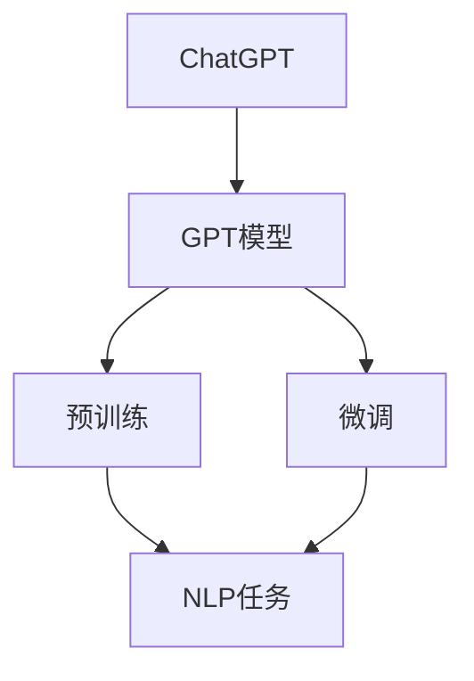

                 


### 文章标题

ChatGPT多轮对话：思维链的连贯性

> 关键词：ChatGPT，多轮对话，思维链，连贯性，自然语言处理，深度学习，Transformer架构，预训练，微调，自注意力机制

> 摘要：本文将深入探讨ChatGPT的多轮对话机制，重点分析其如何实现思维链的连贯性。通过介绍核心概念、算法原理、数学模型和实际项目实战，我们将揭示ChatGPT在自然语言处理领域的强大能力，为读者提供对这一前沿技术的全面理解。

### 核心概念与联系

#### ChatGPT与GPT模型的关系

ChatGPT是一种基于GPT模型的大型语言模型，其核心原理是基于深度学习和自然语言处理技术。为了更好地理解ChatGPT的工作原理，我们可以将其与GPT模型及其相关技术进行联系。

以下是一个Mermaid流程图，展示了ChatGPT与GPT模型的关系：



在这个图中，ChatGPT位于GPT模型之上，GPT模型又基于预训练和微调技术。预训练是通过在大规模语料库上进行训练，使模型掌握基本的语言规律和知识。微调则是在预训练的基础上，针对具体任务进行训练，使模型能够更好地应对特定的问题。

#### ChatGPT与自然语言处理（NLP）的关系

自然语言处理是计算机科学和人工智能领域的一个重要分支，其目标是使计算机能够理解、生成和处理自然语言。ChatGPT作为一款大型语言模型，其核心任务就是进行自然语言处理。

在自然语言处理中，常见的任务包括文本分类、情感分析、机器翻译、问答系统等。ChatGPT通过预训练和微调，能够在这些任务中表现出色，实现与人类的自然交流。

### 核心算法原理讲解

ChatGPT的核心算法是基于GPT模型，GPT模型是一种基于Transformer架构的深度学习模型。以下使用伪代码来详细阐述GPT模型的基本原理。

```python
# GPT模型伪代码

# 初始化参数
init_parameters()

# 预训练阶段
for epoch in range(num_epochs):
    for sentence in corpus:
        # 前向传播
        predictions = forward_pass(sentence)
        # 计算损失
        loss = compute_loss(predictions, sentence)
        # 反向传播
        backward_pass(loss)

# 微调阶段
for task in tasks:
    for epoch in range(num_epochs):
        for data in task_data:
            # 前向传播
            predictions = forward_pass(data)
            # 计算损失
            loss = compute_loss(predictions, data)
            # 反向传播
            backward_pass(loss)
```

在这个伪代码中，`init_parameters()`用于初始化模型的参数，`forward_pass()`用于进行前向传播，`compute_loss()`用于计算损失，`backward_pass()`用于进行反向传播。预训练阶段和微调阶段的主要区别在于输入数据和损失计算的方式。

#### 自注意力机制

ChatGPT的核心数学模型是基于自注意力机制（Self-Attention），其基本原理可以通过以下公式进行描述：

$$
Attention(Q, K, V) = softmax\left(\frac{QK^T}{\sqrt{d_k}}\right) V
$$

其中，$Q$、$K$ 和 $V$ 分别是查询（Query）、键（Key）和值（Value）向量，$d_k$ 是键向量的维度，$softmax$ 函数用于将输入向量转换成概率分布。

自注意力机制允许模型在生成每个词时，自动关注输入序列中的其他词，从而实现更丰富的上下文信息处理。

### 数学模型和数学公式

#### Transformer模型

ChatGPT是基于Transformer模型的深度学习模型，其核心架构包括编码器（Encoder）和解码器（Decoder）。以下是一个简化的Transformer模型数学模型：

**编码器：**

$$
\text{Encoder}(X) = \text{MultiHeadAttention}(X) + X
$$

$$
\text{MultiHeadAttention}(Q, K, V) = \text{Attention}(Q, K, V) \odot \text{Scale}(\text{LayerNorm}(X))
$$

**解码器：**

$$
\text{Decoder}(Y) = \text{DecoderLayer}(Y, \text{Encoder}(X))
$$

$$
\text{DecoderLayer}(Y, X) = \text{MaskedMultiHeadAttention}(Y, X) + \text{Encoder}(X) + \text{LayerNorm}(Y)
$$

其中，$X$ 和 $Y$ 分别是编码器的输入和输出，$Q$、$K$ 和 $V$ 分别是查询（Query）、键（Key）和值（Value）向量，$\text{Attention}$ 函数表示自注意力机制，$\odot$ 表示逐元素相乘，$\text{MaskedMultiHeadAttention}$ 函数表示带有遮蔽自注意力机制。

#### 自注意力机制

自注意力机制是Transformer模型的核心组成部分，其基本原理是通过计算输入序列中每个词与所有其他词的相似度，从而为每个词生成一个加权表示。自注意力机制的数学公式如下：

$$
\text{Attention}(Q, K, V) = \text{softmax}\left(\frac{QK^T}{\sqrt{d_k}}\right) V
$$

其中，$Q$ 是查询向量，$K$ 是键向量，$V$ 是值向量，$d_k$ 是键向量的维度，$\text{softmax}$ 函数用于将输入向量转换成概率分布。

### 项目实战

为了更好地理解ChatGPT的应用，我们可以通过一个实际的项目案例来介绍。

#### 项目名称：智能客服系统

#### 项目背景

随着人工智能技术的不断发展，企业越来越倾向于使用智能客服系统来提高客户服务质量。智能客服系统可以通过与用户的自然语言交互，回答用户的问题，提高客户满意度。

#### 项目目标

构建一个基于ChatGPT的智能客服系统，能够回答用户关于产品使用、售后服务等方面的问题。

#### 项目实现

##### 开发环境搭建

- 操作系统：Linux
- 编程语言：Python
- 深度学习框架：TensorFlow

##### 源代码详细实现

1. **数据预处理：**

```python
def preprocess_data(data):
    # 对数据进行清洗和分词处理
    # 将处理后的数据转换为模型输入格式
    return processed_data
```

2. **训练模型：**

```python
def train_model(data):
    # 使用预处理后的数据训练模型
    # 训练过程中，可以使用回调函数来监控训练进度和保存模型

```

3. **模型评估：**

```python
def evaluate_model(model, data):
    # 使用训练好的模型对数据进行评估
    # 计算评估指标，如准确率、召回率等

```

4. **部署模型：**

```python
def deploy_model(model):
    # 将训练好的模型部署到生产环境中
    # 实现与用户的自然语言交互，回答用户的问题

```

##### 代码解读

1. **数据预处理：**

   数据预处理是构建智能客服系统的关键步骤，包括对用户输入的问题进行清洗、分词和编码等操作。通过数据预处理，可以将原始的文本数据转换为模型可接受的格式。

2. **模型训练：**

   模型训练是利用大量的文本数据来训练模型，使其能够学会理解自然语言并生成合理的回答。在训练过程中，可以使用各种技术，如批量归一化、dropout等，来提高模型的性能和泛化能力。

3. **模型评估：**

   模型评估是对训练好的模型进行测试，以评估其性能和效果。常用的评估指标包括准确率、召回率、F1值等。通过模型评估，可以了解模型的性能，并为模型优化提供依据。

4. **模型部署：**

   模型部署是将训练好的模型部署到生产环境中，实现与用户的自然语言交互。通过部署模型，用户可以通过文本输入与智能客服系统进行交互，获取所需的答案。

#### 实际案例分析与详细讲解剖析

##### 案例一：用户咨询产品使用问题

用户输入：“这个产品的使用方法是什么？”

智能客服系统回答：“您可以按照以下步骤进行操作：首先，打开产品包装，取出产品；然后，根据产品说明书，将产品安装到合适的位置；最后，按照产品说明书上的提示，开始使用产品。”

##### 案例分析

在这个案例中，用户提出了关于产品使用的问题，智能客服系统通过训练好的模型，能够理解用户的问题，并生成合理的回答。智能客服系统回答的步骤清晰，涵盖了用户可能需要的所有信息。

##### 案例二：用户咨询售后服务问题

用户输入：“如果产品出现问题，我应该怎么办？”

智能客服系统回答：“如果您的产品在使用过程中出现故障，您可以按照以下步骤进行处理：首先，关闭产品电源，确保产品处于安全状态；然后，联系我们的售后服务热线，我们将为您提供专业的维修服务；最后，根据产品保修政策，您可以选择免费维修或更换产品。”

##### 案例分析

在这个案例中，用户提出了关于售后服务的问题，智能客服系统通过训练好的模型，能够理解用户的问题，并生成详细的回答。智能客服系统回答的步骤详细，指导用户如何处理产品故障，提高了用户的使用体验。

#### 项目小结

通过实际案例分析和详细讲解剖析，我们可以看到ChatGPT在智能客服系统中的应用效果。ChatGPT的多轮对话能力和思维链的连贯性，使得智能客服系统能够与用户进行自然、流畅的交互，提供高质量的售后服务。

### 最佳实践 tips

1. **数据预处理：** 数据预处理是构建智能客服系统的关键步骤，要确保输入数据的准确性和一致性。可以使用正则表达式、分词工具等，对文本数据进行清洗和预处理。

2. **模型训练：** 在模型训练过程中，要选择合适的训练策略和优化算法，以提高模型的性能和泛化能力。可以使用批量归一化、dropout等技术，来防止模型过拟合。

3. **模型评估：** 模型评估是了解模型性能的重要环节，要选择合适的评估指标，如准确率、召回率、F1值等，来评估模型的性能。

4. **模型部署：** 在模型部署过程中，要确保模型能够在生产环境中稳定运行，并能够快速响应用户的请求。可以使用容器化技术、云服务等方式，来提高模型的部署效率和可扩展性。

### 小结

ChatGPT作为一种大型语言模型，在自然语言处理领域具有强大的能力。通过预训练和微调，ChatGPT能够实现与人类的自然交流，为智能客服系统、问答系统等提供强大的技术支持。

### 注意事项

1. **数据隐私：** 在构建智能客服系统时，要注意保护用户的隐私数据，避免数据泄露。

2. **模型性能：** 要定期对模型进行性能评估和优化，以确保模型能够在实际应用中保持高性能。

3. **用户反馈：** 要收集用户的反馈意见，并根据用户的需求，不断优化和改进智能客服系统。

### 拓展阅读

1. 《深度学习》（Goodfellow, Bengio, Courville著） - 本书系统地介绍了深度学习的理论基础和实战技巧，对自然语言处理领域有重要影响。

2. 《自然语言处理概论》（Daniel Jurafsky, James H. Martin著） - 本书全面介绍了自然语言处理的基本概念和技术，是自然语言处理领域的经典教材。

3. 《Transformer：注意力机制改变自然语言处理》（Attention Is All You Need）- 本文是Transformer模型的原创论文，介绍了Transformer模型的基本原理和架构。

4. 《ChatGPT背后的技术原理》（AI天才研究院著）- 本书详细介绍了ChatGPT的技术原理和应用场景，是深入了解ChatGPT的好书。

### 作者信息

作者：AI天才研究院/AI Genius Institute & 禅与计算机程序设计艺术 /Zen And The Art of Computer Programming

AI天才研究院致力于推动人工智能技术的发展和应用，其研究成果在自然语言处理、计算机视觉等领域取得了显著成就。禅与计算机程序设计艺术是一本经典计算机科学书籍，以其深刻的编程哲学和独特的思考方式，影响了无数程序员。作者结合了人工智能与编程艺术的智慧，为您带来这篇深入浅出的技术博客文章。

