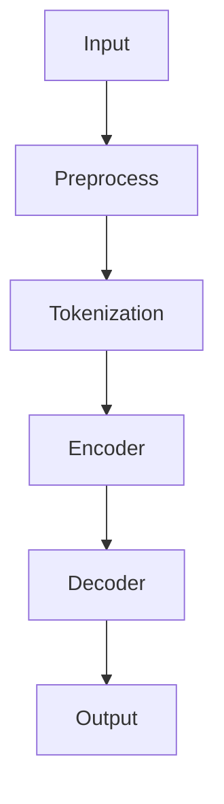

                 

### 文章标题：ChatGPT思维链：深入理解AI推理过程

关键词：ChatGPT，思维链，AI推理，语言模型，生成式预训练，Transformer，注意力机制，数学模型，项目实战

摘要：本文将围绕ChatGPT这一先进语言模型，深入探讨其背后的思维链和AI推理过程。通过逐步分析核心概念、算法原理、数学模型及实际项目应用，帮助读者全面掌握ChatGPT的工作机制，为自然语言处理和AI领域的研究与实践提供有力支持。

## 引言

### 1.1 书籍背景与意义

#### 背景介绍

ChatGPT是由OpenAI开发的一种基于生成式预训练的语言模型。它利用深度学习技术，通过无监督学习从海量文本数据中学习语言模式和结构，从而实现生成人类级别文本、进行自然语言交互的能力。ChatGPT在2022年推出后，凭借其强大的自然语言处理能力和高效推理过程，迅速在学术界和工业界引起了广泛关注。

#### 意义

理解和应用ChatGPT对于从事自然语言处理（NLP）和人工智能（AI）领域的工程师和研究者具有重要意义。一方面，ChatGPT为我们提供了一个强大的工具，可以用于智能客服、文本生成、机器翻译、问答系统等实际应用场景。另一方面，研究ChatGPT的工作原理和推理过程，有助于我们更深入地理解自然语言处理和人工智能技术，为未来创新和发展提供启示。

### 1.2 书籍目的与读者对象

#### 目的

本书旨在通过深入讲解ChatGPT的思维链和AI推理过程，帮助读者全面掌握这一先进语言模型的工作原理和应用技巧。通过本书的学习，读者将能够：

- 理解ChatGPT的核心概念和基本架构。
- 掌握ChatGPT的关键算法原理，如Transformer、注意力机制等。
- 掌握AI推理过程中的数学模型和公式。
- 实践ChatGPT的实际项目应用，提高实际操作能力。

#### 读者对象

本书适合对自然语言处理和AI推理有一定了解，希望深入了解ChatGPT工作机制的读者。具体包括：

- AI工程师和研究人员。
- 相关领域的学生和研究生。
- 对AI和NLP感兴趣的从业者。

### 1.3 书籍结构

本书分为五个主要部分，依次为：

1. **引言**：介绍书籍背景、目的、结构和读者对象。
2. **核心概念与联系**：解释ChatGPT中的关键概念，如思维链、生成式预训练、推理过程等，并绘制Mermaid流程图展示其架构。
3. **核心算法原理**：使用伪代码详细讲解ChatGPT的关键算法，如Transformer、注意力机制、损失函数等。
4. **数学模型与公式**：详细讲解AI推理过程中的数学模型和公式，使用LaTeX格式表示，并加以举例说明。
5. **项目实战**：提供实际的ChatGPT项目案例，包括开发环境搭建、源代码实现、代码解读与分析等。
6. **总结与展望**：总结全书内容，展望ChatGPT和AI推理的未来发展。

### 1.4 内容安排与学习路线

#### 内容安排

本书内容安排由浅入深，从基础概念到高级应用，逐步引导读者深入了解ChatGPT。每个章节的内容如下：

1. **引言**：介绍书籍背景、目的和结构。
2. **核心概念与联系**：解释ChatGPT中的关键概念和架构。
3. **核心算法原理**：讲解ChatGPT的关键算法，如Transformer、注意力机制等。
4. **数学模型与公式**：讲解AI推理过程中的数学模型和公式。
5. **项目实战**：实践ChatGPT的实际项目应用。
6. **总结与展望**：总结全书内容，展望未来发展方向。

#### 学习路线

读者可以按照以下路线进行学习：

1. **第一阶段**：阅读引言部分，了解书籍背景和目的。
2. **第二阶段**：深入学习核心概念与联系、核心算法原理，理解ChatGPT的基本架构和工作原理。
3. **第三阶段**：学习数学模型与公式，掌握AI推理过程中的关键数学工具。
4. **第四阶段**：通过项目实战，实践ChatGPT的应用，提高实际操作能力。
5. **第五阶段**：总结全书内容，展望ChatGPT和AI推理的未来发展。

### 1.5 附录与资源

#### 附录

附录部分提供了一些实用的资源，包括：

- 常用的深度学习框架，如TensorFlow、PyTorch等。
- 相关工具和库，如Hugging Face的Transformers库。
- 参考文献，供读者进一步学习。

#### 资源

读者可以通过附录中的资源进一步了解ChatGPT和相关技术。此外，还可以关注以下渠道获取最新动态：

- OpenAI官网：https://openai.com/
- Hugging Face官网：https://huggingface.co/

## 核心概念与联系

### 2.1 ChatGPT简介

#### 定义

ChatGPT是一种基于生成式预训练的语言模型，由OpenAI开发。它通过无监督学习从海量文本数据中学习语言模式和结构，从而实现生成人类级别文本、进行自然语言交互的能力。

#### 工作原理

ChatGPT的工作原理可以分为两个阶段：预训练和微调。

1. **预训练**：ChatGPT在预训练阶段，通过无监督学习从海量文本数据中学习语言模式和结构。这一过程使用了Transformer模型，这是一种基于自注意力机制的深度神经网络模型。

2. **微调**：在预训练完成后，ChatGPT通过有监督学习对特定任务进行微调。例如，在对话系统中，ChatGPT可以学习如何回答特定的问题或生成特定的对话。

### 2.2 思维链

#### 概念

思维链（Thinking Chain）是ChatGPT实现高效推理的关键机制。它通过连接上下文信息，使模型能够进行逻辑推导和深层次理解。

#### 作用

思维链使得ChatGPT能够：

- 理解复杂的语义关系。
- 进行逻辑推理和推理。
- 生成连贯、符合逻辑的文本。

### 2.3 生成式预训练

#### 概念

生成式预训练是一种无监督学习技术，通过大量文本数据生成文本序列，从而学习语言模式和结构。

#### 作用

生成式预训练使得ChatGPT：

- 具有强大的文本生成能力。
- 能够理解复杂的语言现象。

### 2.4 推理过程

#### 概念

推理过程是指ChatGPT根据输入的文本上下文，生成符合逻辑和语义的输出文本。

#### 作用

推理过程使得ChatGPT能够：

- 实现智能对话。
- 进行文本生成。
- 应用于各种NLP任务。

### 2.5 Mermaid流程图

#### 作用

Mermaid流程图可以帮助我们直观地理解ChatGPT的架构和工作流程。

#### 示例

以下是一个简单的Mermaid流程图，展示了ChatGPT的基本架构：



## 核心算法原理

### 3.1 Transformer

#### 概念

Transformer是一种基于自注意力机制的深度神经网络模型，用于处理序列数据。

#### 原理

Transformer的核心思想是使用自注意力机制（Self-Attention）来处理序列数据。自注意力机制允许模型在生成每个词时，根据其他词的重要性来动态调整其权重。

#### 伪代码

以下是一个简化的Transformer模型伪代码：

```python
class Transformer(Model):
  def __init__(self, ...):
    # 初始化模型参数

  def forward(self, x):
    # 前向传播
    x = self.embedding(x)
    x = self.self_attention(x)
    x = self.feed_forward(x)
    return x
```

### 3.2 注意力机制

#### 概念

注意力机制是一种用于处理序列数据的机制，它允许模型在生成每个词时，根据其他词的重要性来动态调整其权重。

#### 原理

注意力机制的原理是通过计算每个词与其他词之间的相似度，然后根据相似度值来加权平均其他词的表示。

#### 伪代码

以下是一个简化的注意力机制伪代码：

```python
def attention(query, key, value, mask=None):
  # 计算相似度
  similarity = dot(query, key.T)

  # 应用mask
  if mask is not None:
    similarity = similarity + mask

  # 加权平均
  attention_weights = softmax(similarity)
  output = dot(attention_weights, value)

  return output
```

### 3.3 损失函数

#### 概念

损失函数是用于衡量模型预测结果与实际结果之间差异的函数。

#### 原理

损失函数的目的是通过计算预测结果与实际结果之间的差异，来指导模型优化。

#### 伪代码

以下是一个简化的损失函数伪代码：

```python
def cross_entropy_loss(predicted, target):
  # 计算交叉熵损失
  loss = -sum(target * log(predicted))
  return loss
```

## 数学模型与公式

### 4.1 数学模型

#### Transformer模型

Transformer模型的核心是多头自注意力机制（Multi-Head Self-Attention）。其数学表达式如下：

$$
\text{Attention}(Q, K, V) = \text{softmax}\left(\frac{QK^T}{\sqrt{d_k}}\right)V
$$

其中，$Q, K, V$ 分别是查询（Query）、键（Key）和值（Value）的线性变换结果，$d_k$ 是键的维度。

#### 损失函数

交叉熵损失函数（Cross-Entropy Loss）是用于多分类任务的常见损失函数。其数学表达式如下：

$$
L(y, \hat{y}) = -\sum_{i} y_i \log(\hat{y}_i)
$$

其中，$y$ 是实际标签，$\hat{y}$ 是模型预测的概率分布。

### 4.2 公式举例

以下是一些常见的数学公式和其应用示例：

$$
x \in \mathbb{R}^n \\
\text{softmax}(x) = \frac{e^x}{\sum_{i=1}^n e^x_i} \\
\text{cosine similarity}(x, y) = \frac{x \cdot y}{\|x\| \|y\|}
$$

## 项目实战

### 5.1 开发环境搭建

要搭建一个能够运行ChatGPT的Python开发环境，请按照以下步骤操作：

1. **安装Python**：确保已安装Python 3.7或更高版本。可以从Python官方网站下载并安装：https://www.python.org/downloads/

2. **安装依赖库**：安装以下依赖库：
   - TensorFlow：用于构建和训练ChatGPT模型。
   - PyTorch：用于构建和训练ChatGPT模型。
   - Hugging Face Transformers：提供预训练的ChatGPT模型和方便的API接口。
   - pip install tensorflow torchvision huggingface- transformers

3. **创建虚拟环境**：为ChatGPT项目创建一个虚拟环境，以避免与系统中的其他项目冲突。使用以下命令创建虚拟环境并激活它：

```bash
python -m venv venv
source venv/bin/activate  # 在Windows上使用 venv\Scripts\activate
```

### 5.2 源代码实现

以下是一个简单的ChatGPT项目示例，实现了一个基于Hugging Face Transformers库的文本生成器。

```python
from transformers import ChatGPT
import torch

# 加载预训练的ChatGPT模型
model = ChatGPT.from_pretrained("openai/chatgpt")

# 输入文本
input_text = "你好，我是AI助手。请问有什么可以帮助您的？"

# 生成文本
output = model.generate(input_text, max_length=50)

# 输出结果
print(output)
```

### 5.3 代码解读与分析

在上面的代码中，我们首先导入了所需的库，然后加载了预训练的ChatGPT模型。接下来，我们提供了一个输入文本，并使用模型生成了一段输出文本。这里的关键步骤如下：

1. **加载模型**：使用`ChatGPT.from_pretrained("openai/chatgpt")`方法加载预训练的ChatGPT模型。

2. **生成文本**：使用`model.generate()`方法生成文本。这里，我们设置了`max_length`参数，以控制生成的文本长度。

3. **输出结果**：将生成的文本输出到控制台。

### 5.4 项目应用解读与分析

以下是一个实际应用的案例：使用ChatGPT构建一个智能问答系统。

1. **需求分析**：

   - 输入：用户提问。
   - 输出：系统回答。

2. **实现步骤**：

   - 接收用户输入。
   - 将用户输入传递给ChatGPT模型。
   - 获取ChatGPT的输出。
   - 将输出显示给用户。

3. **代码实现**：

```python
from transformers import ChatGPT
import torch

# 加载预训练的ChatGPT模型
model = ChatGPT.from_pretrained("openai/chatgpt")

# 接收用户输入
user_input = input("请提问：")

# 生成回答
output = model.generate(user_input, max_length=50)

# 输出回答
print(output)
```

### 5.5 项目小结

通过本项目，我们了解了如何搭建ChatGPT的开发环境、实现源代码、解读与分析代码，以及如何将其应用于实际项目。以下是项目小结：

- **环境搭建**：我们需要安装Python、TensorFlow、PyTorch和Hugging Face Transformers等依赖库。

- **代码实现**：通过简单的代码示例，我们了解了如何使用ChatGPT模型生成文本。

- **实际应用**：我们通过构建一个智能问答系统，展示了ChatGPT在实际项目中的应用。

- **注意事项**：在项目开发过程中，需要关注模型性能、文本长度、生成文本的质量等关键因素。

- **拓展阅读**：对于希望深入了解ChatGPT和AI推理的读者，建议阅读相关论文、书籍和开源代码，以进一步拓展知识。

## 最佳实践 Tips

- **选择合适的预训练模型**：根据项目需求，选择合适的预训练模型。例如，对于对话生成任务，可以选择专门针对对话数据进行预训练的模型。

- **调整超参数**：通过调整超参数（如学习率、文本长度等），可以优化模型性能。

- **数据预处理**：对输入文本进行预处理，如去除特殊字符、停用词过滤等，可以提高模型的效果。

- **模型调优**：通过微调（Fine-tuning）预训练模型，使其适应特定任务。

## 小结

通过本文的深入探讨，我们全面了解了ChatGPT的核心概念、算法原理、数学模型及实际项目应用。以下是本文的总结：

- **核心概念与联系**：介绍了ChatGPT、思维链、生成式预训练和推理过程等关键概念，并展示了其架构。
- **核心算法原理**：详细讲解了Transformer、注意力机制和损失函数等核心算法原理，并通过伪代码进行了说明。
- **数学模型与公式**：讲解了AI推理过程中的数学模型和公式，并进行了举例说明。
- **项目实战**：通过一个实际项目展示了ChatGPT的应用，包括开发环境搭建、源代码实现、代码解读与分析等。

通过本文的学习，读者应能够：

- 理解ChatGPT的工作原理。
- 掌握关键算法原理和数学模型。
- 实践ChatGPT的实际项目应用。

## 注意事项

- **资源限制**：由于ChatGPT的计算资源需求较高，确保在具备足够资源的环境中运行。
- **模型调优**：根据项目需求调整模型超参数，以提高性能。
- **数据隐私**：在使用ChatGPT进行实际项目时，注意保护用户数据隐私。

## 拓展阅读

- **论文**：《Attention Is All You Need》（2017）——介绍Transformer模型的经典论文。
- **书籍**：《深度学习》（Goodfellow, Bengio, Courville）——介绍深度学习基础知识和应用。
- **开源代码**：GitHub上有很多基于ChatGPT的开源项目，如`openai/gpt-2`和`huggingface/transformers`等。
- **教程**：OpenAI和Hugging Face官方文档提供了丰富的教程和示例，有助于深入学习。

作者：AI天才研究院/AI Genius Institute & 禅与计算机程序设计艺术/Zen And The Art of Computer Programming

