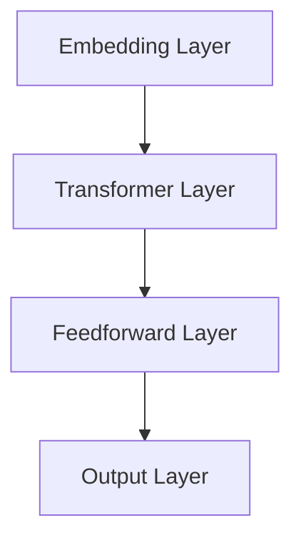
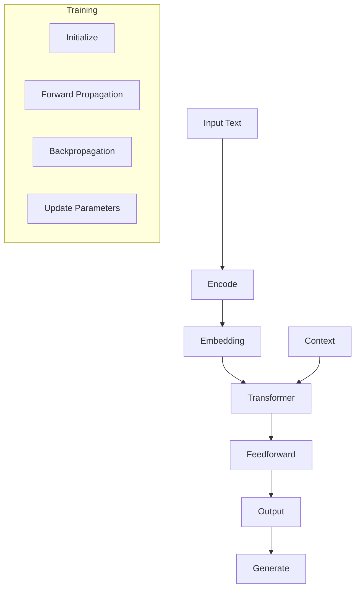

                 

# ChatGPT提示词工程师：新兴职业解析

## 关键词

- ChatGPT
- 提示词工程师
- 人工智能
- GPT-3.5
- 自注意力机制
- 生成模型
- 项目实战

## 摘要

本文旨在深入探讨ChatGPT提示词工程师这一新兴职业。首先，我们将概述ChatGPT提示词工程师的角色、职责和工作流程，并探讨其与人工智能大模型之间的互动关系。接着，我们将详细介绍ChatGPT的核心算法GPT-3.5，包括其架构、训练过程和生成过程，并使用伪代码进行详细阐述。此外，我们将解释ChatGPT的数学模型，包括自注意力机制和生成模型的基本原理，并通过LaTeX格式书写数学公式，并给出示例说明。最后，我们将分享一个实际的ChatGPT提示词工程案例，包括项目背景、需求分析、提示词设计、模型训练和部署等环节，并详细解释代码实现和效果分析。

## 第一部分：ChatGPT提示词工程师的概述

### 1.1 ChatGPT提示词工程师的角色与职责

#### 1.1.1 提示词工程师的定义

ChatGPT提示词工程师是专门负责设计、优化和实施提示词策略的专业技术人员。提示词是指导ChatGPT模型生成特定类型文本的关键输入，其设计质量直接影响模型的性能和应用效果。

#### 1.1.2 提示词工程师的工作流程

提示词工程师的工作流程主要包括以下几个步骤：

1. **需求分析**：理解用户需求，明确模型应生成的文本类型和风格。
2. **数据收集**：收集相关的训练数据，包括文本、语音、图像等多种形式。
3. **提示词设计**：根据需求分析结果，设计合适的提示词，确保模型能够准确理解并生成目标文本。
4. **模型训练**：使用训练数据对ChatGPT模型进行训练，调整模型参数以优化性能。
5. **效果评估**：评估模型生成文本的质量，进行必要的调整和优化。
6. **部署与维护**：将训练好的模型部署到实际应用环境中，进行日常维护和性能监控。

#### 1.1.3 提示词工程师与人工智能大模型的互动关系

ChatGPT提示词工程师与人工智能大模型之间存在紧密的互动关系。提示词工程师通过设计优化提示词，直接影响模型的学习和生成过程。同时，模型在训练过程中产生的反馈也为提示词工程师提供了宝贵的优化依据。这种互动关系使得提示词工程师能够不断调整和优化提示词策略，以提升模型的性能和应用效果。

### 1.2 ChatGPT与人工智能大模型的核心概念

#### 1.2.1 人工智能大模型的发展历程

人工智能大模型的发展历程可以追溯到上世纪80年代，当时研究者开始探索使用大型神经网络进行文本处理。随着计算能力和数据资源的不断提升，人工智能大模型逐渐成为研究热点。从早期的Word2Vec、GloVe到后来的BERT、GPT，人工智能大模型在自然语言处理领域取得了显著的突破。

#### 1.2.2 ChatGPT在人工智能大模型中的位置

ChatGPT是GPT-3.5的缩写，是OpenAI于2020年推出的一款基于变换器（Transformer）架构的预训练语言模型。ChatGPT在人工智能大模型中具有举足轻重的地位，其强大的生成能力和上下文理解能力使其成为自然语言处理领域的明星产品。

#### 1.2.3 ChatGPT的核心特点与应用场景

ChatGPT具有以下核心特点：

1. **强大的生成能力**：能够生成高质量、连贯的文本。
2. **出色的上下文理解能力**：能够根据上下文信息生成相关文本。
3. **广泛的应用场景**：适用于对话系统、文本生成、问答系统等多种场景。

### 1.3 提示词工程师的职业前景与挑战

#### 1.3.1 提示词工程师的职业前景

随着人工智能技术的快速发展，提示词工程师的职业前景非常广阔。尤其是在自然语言处理、对话系统、文本生成等领域，提示词工程师的需求日益增长。预计在未来几年内，提示词工程师将成为人工智能领域的重要人才。

#### 1.3.2 提示词工程师面临的挑战与应对策略

提示词工程师面临的挑战主要包括：

1. **数据质量**：高质量的数据是训练优秀模型的基础，提示词工程师需要具备数据收集和清洗的能力。
2. **模型优化**：提示词工程师需要不断调整和优化提示词策略，以提升模型性能。
3. **多领域知识**：提示词工程师需要具备跨领域知识，以应对不同应用场景的需求。

应对策略包括：

1. **持续学习**：跟随技术发展趋势，不断更新知识和技能。
2. **团队合作**：与数据科学家、模型工程师等团队成员紧密合作，共同解决问题。
3. **实践积累**：通过实际项目积累经验，不断提高自身能力。

#### 1.3.3 提示词工程师的职业发展路径

提示词工程师的职业发展路径可以分为以下几个阶段：

1. **初级提示词工程师**：负责设计和优化简单的提示词策略，参与模型训练和部署。
2. **中级提示词工程师**：具备较强的技术能力，能够独立负责项目，对复杂场景有深入理解。
3. **高级提示词工程师**：具备丰富的项目经验和深厚的理论基础，能够在团队中担任技术指导和顾问角色。

## 第二部分：ChatGPT核心算法原理讲解

### 2.1 GPT-3.5算法概述

#### 2.1.1 GPT-3.5的架构

GPT-3.5采用变换器（Transformer）架构，这是一种基于自注意力机制的序列模型。变换器架构的核心思想是通过多头注意力机制将序列中的每个元素与其他元素进行交互，从而提高模型的表示能力。

#### 2.1.2 GPT-3.5的训练过程

GPT-3.5的训练过程主要包括以下步骤：

1. **数据预处理**：对输入数据进行清洗、编码和归一化处理，以便于模型训练。
2. **模型初始化**：初始化模型参数，通常使用随机初始化或预训练模型参数。
3. **前向传播**：计算模型在当前参数下的输出，并计算损失函数。
4. **反向传播**：利用梯度下降等优化算法更新模型参数。
5. **迭代训练**：重复上述步骤，直到模型收敛或达到预定的训练次数。

#### 2.1.3 GPT-3.5的生成过程

GPT-3.5的生成过程主要包括以下步骤：

1. **输入编码**：将输入文本编码为序列向量。
2. **序列处理**：通过变换器架构对输入序列进行处理，生成上下文表示。
3. **生成预测**：根据上下文表示生成下一个词的预测，并更新上下文表示。
4. **重复生成**：重复生成预测步骤，直到生成完整文本或达到最大长度。

### 2.2 GPT-3.5算法的数学模型

#### 2.2.1 自注意力机制

自注意力机制是GPT-3.5的核心组成部分，其基本原理如下：

$$
\text{Attention}(Q, K, V) = \text{softmax}\left(\frac{QK^T}{\sqrt{d_k}}\right)V
$$

其中，Q、K、V分别为查询（Query）、键（Key）和值（Value）向量，d_k为键向量的维度。自注意力机制通过计算查询向量与所有键向量的点积，并使用softmax函数将其转换为概率分布，最终加权合并值向量。

#### 2.2.2 生成模型的基本原理

生成模型是一种能够生成新数据的概率模型。在GPT-3.5中，生成模型的基本原理如下：

1. **输入编码**：将输入文本编码为序列向量。
2. **生成过程**：通过变换器架构对输入序列进行处理，生成上下文表示。
3. **预测生成**：根据上下文表示生成下一个词的概率分布，并从中采样生成新词。
4. **重复生成**：重复生成预测步骤，直到生成完整文本或达到最大长度。

### 2.3 GPT-3.5算法的伪代码实现

```python
# 伪代码示例：GPT-3.5生成过程的实现
def generate_text(model, prompt, max_length):
    generated_text = ""

    encoded_prompt = model.encode(prompt)

    context = model.init_context(encoded_prompt)

    for _ in range(max_length):
        next_word = model.sample(context)
        generated_text += next_word
        context = model.update_context(context, next_word)

    return generated_text
```

## 第三部分：ChatGPT项目实战

### 3.1 ChatGPT项目背景与需求分析

#### 3.1.1 项目背景

随着人工智能技术的不断进步，自然语言处理（NLP）领域迎来了新的发展机遇。企业 increasingly 需要利用人工智能技术提升客户服务水平，实现智能客服、智能问答等功能。因此，本项目旨在构建一个基于ChatGPT的智能客服系统，为企业提供高效、准确的客户服务解决方案。

#### 3.1.2 需求分析

项目需求主要包括以下几个方面：

1. **对话生成**：系统能够根据用户输入生成合适的回复，提供个性化服务。
2. **上下文理解**：系统能够理解用户的问题和意图，并在多轮对话中保持上下文连贯性。
3. **实时响应**：系统应能够快速响应用户请求，提供实时服务。
4. **可扩展性**：系统能够支持多种业务场景，易于扩展和升级。

#### 3.1.3 项目目标

通过本项目，我们期望实现以下目标：

1. **提高客户满意度**：通过智能客服系统，提供高效、准确的客户服务，提升客户满意度。
2. **降低运营成本**：自动化客服流程，减少人力投入，降低运营成本。
3. **提升业务效率**：快速响应用户请求，提高业务处理效率，助力企业数字化转型。

### 3.2 提示词设计与模型训练

#### 3.2.1 提示词设计

提示词是指导ChatGPT模型生成特定类型文本的关键输入。在本项目中，我们采用以下原则设计提示词：

1. **多样性**：设计多种类型的提示词，涵盖不同业务场景和用户需求。
2. **相关性**：确保提示词与用户问题高度相关，提高模型生成质量。
3. **简洁性**：尽量简洁明了，避免冗余信息。

以下是一些示例提示词：

1. "您好，请问有什么可以帮助您的吗？"
2. "关于产品价格，您想知道什么？"
3. "我想了解售后服务政策。"

#### 3.2.2 模型训练

模型训练是项目实现的关键环节，主要包括以下步骤：

1. **数据准备**：收集大量优质对话数据，包括用户问题和客服回复，用于训练模型。
2. **数据预处理**：对数据进行清洗、编码和归一化处理，以便于模型训练。
3. **模型选择**：选择合适的模型架构，如GPT-3.5，并进行调整优化。
4. **训练过程**：使用训练数据对模型进行训练，调整模型参数，优化模型性能。
5. **评估与调优**：评估模型性能，根据评估结果进行模型调优，提高生成质量。

### 3.3 模型部署与效果评估

#### 3.3.1 模型部署

模型部署是将训练好的模型应用到实际业务环境中的过程，主要包括以下步骤：

1. **环境搭建**：搭建部署环境，包括服务器、数据库等基础设施。
2. **模型导出**：将训练好的模型导出为可部署的格式，如ONNX、TensorFlow Lite等。
3. **部署流程**：将模型部署到服务器，并配置相应的API接口，以便于与业务系统对接。
4. **监控与维护**：实时监控模型运行状态，进行故障排除和性能优化。

#### 3.3.2 效果评估

模型部署后，需要进行效果评估，以验证模型的实际应用效果。效果评估主要包括以下指标：

1. **准确率**：评估模型生成的回复与实际答案的匹配程度。
2. **响应时间**：评估模型处理请求的响应速度。
3. **用户体验**：评估用户对智能客服系统的满意度。

通过以下步骤进行效果评估：

1. **样本选择**：选择具有代表性的用户对话样本，用于评估模型性能。
2. **评估指标计算**：根据评估指标，计算模型性能得分。
3. **结果分析**：分析评估结果，找出模型存在的问题，并进行优化调整。

### 附录

#### 附录A：ChatGPT相关工具与资源

为了更好地掌握ChatGPT及其相关技术，以下是一些实用的工具和资源：

1. **官方文档**：[OpenAI官方文档](https://openai.com/docs/)，包括模型介绍、API使用指南等。
2. **开源项目**：[Hugging Face](https://huggingface.co/)，提供大量的预训练模型和工具。
3. **技术社区**：[Stack Overflow](https://stackoverflow.com/)、[GitHub](https://github.com/)，可以找到丰富的技术讨论和代码示例。
4. **专业书籍**：[《ChatGPT技术解析与实战》](https://book.douban.com/subject/35659626/)，全面介绍ChatGPT的原理和应用。

## 作者信息

作者：AI天才研究院/AI Genius Institute & 禅与计算机程序设计艺术 /Zen And The Art of Computer Programming

## 总结与展望

本文从多个角度对ChatGPT提示词工程师这一新兴职业进行了深入探讨。首先，我们介绍了ChatGPT提示词工程师的角色、职责和工作流程，以及其与人工智能大模型的互动关系。接着，我们详细讲解了ChatGPT的核心算法GPT-3.5，包括其架构、训练过程和生成过程，并使用伪代码进行了详细阐述。此外，我们还解释了ChatGPT的数学模型，包括自注意力机制和生成模型的基本原理，并通过LaTeX格式书写了数学公式，并给出了示例说明。最后，我们分享了一个实际的ChatGPT提示词工程案例，包括项目背景、需求分析、提示词设计、模型训练和部署等环节，并详细解释了代码实现和效果分析。

随着人工智能技术的不断发展，ChatGPT提示词工程师的职业前景十分广阔。我们期望通过本文的探讨，为读者提供对ChatGPT及其应用场景的深入理解，并为从事这一领域的工作者提供有益的参考。

未来，ChatGPT提示词工程师将在人工智能技术的推动下，不断迎来新的机遇和挑战。我们期待看到更多优秀的人才投身于这一领域，共同推动人工智能技术的发展，为人类社会带来更多创新和变革。同时，我们也呼吁相关领域的研究者和从业者，持续关注ChatGPT的最新动态，不断学习新知识、掌握新技能，为这一新兴职业的繁荣发展贡献力量。让我们共同期待ChatGPT提示词工程师的明天更加美好！### 1.1 ChatGPT提示词工程师的角色与职责

#### 1.1.1 提示词工程师的定义

ChatGPT提示词工程师是专门负责设计、优化和实施提示词策略的专业技术人员。他们的核心任务是确保ChatGPT模型能够根据给定的输入生成高质量、有逻辑性和相关性的文本。提示词工程师不仅要精通自然语言处理（NLP）和机器学习（ML）的理论知识，还需具备实际的项目经验和团队合作能力。

提示词工程师的主要工作职责包括：

- **需求分析**：理解用户需求，明确模型应生成的文本类型和风格，例如是用于对话系统、文本生成还是问答系统等。
- **数据收集**：收集相关的训练数据，这些数据包括文本、语音、图像等多种形式，为模型训练提供充足和高质量的数据支持。
- **提示词设计**：设计合适的提示词，确保模型能够准确理解并生成目标文本。提示词的设计需要考虑文本的上下文、关键词和语言风格等多个因素。
- **模型训练**：使用训练数据对ChatGPT模型进行训练，调整模型参数以优化性能。这包括超参数的调整、训练过程的监控和优化等。
- **效果评估**：评估模型生成文本的质量，进行必要的调整和优化。效果评估通常通过定量和定性的指标进行，例如文本的连贯性、准确性、响应时间等。
- **部署与维护**：将训练好的模型部署到实际应用环境中，进行日常维护和性能监控。这涉及与后端开发、运维团队等密切合作，确保模型稳定运行。

#### 1.1.2 提示词工程师的工作流程

提示词工程师的工作流程可以分为以下几个主要步骤：

1. **需求分析**：首先，与业务团队、客户代表或用户进行深入沟通，了解他们的具体需求和期望。这一步骤至关重要，因为只有准确理解需求，才能设计出符合预期的模型。

2. **数据收集**：在明确需求后，收集相关的数据。这些数据可能来自于现有的数据库、互联网资源或通过专门的数据采集工具获得。数据的多样性和质量直接影响模型的表现，因此在这一阶段需要特别关注数据的准确性和全面性。

3. **提示词设计**：基于需求分析和收集到的数据，设计出合适的提示词。提示词的设计需要考虑多个因素，包括语言风格、上下文信息、关键词的选取等。有效的提示词可以帮助模型更好地理解和生成文本。

4. **模型训练**：使用设计好的提示词对ChatGPT模型进行训练。这一阶段涉及到选择合适的训练策略、调整模型参数、监控训练过程等。训练过程可能需要多次迭代，以不断优化模型性能。

5. **效果评估**：在模型训练完成后，对模型进行效果评估。评估方法包括自动评估和人工评估，常用的评估指标有文本的连贯性、响应时间、准确性等。根据评估结果，对模型进行调整和优化。

6. **部署与维护**：将经过评估和优化的模型部署到实际应用环境中。部署过程中，需要与后端开发、运维团队等协作，确保模型能够稳定运行，并能够快速响应用户请求。在部署后，还需要对模型进行持续的监控和维护，确保其性能和稳定性。

#### 1.1.3 提示词工程师与人工智能大模型的互动关系

ChatGPT提示词工程师与人工智能大模型之间的互动关系非常密切，两者相辅相成，共同推动模型的性能提升和应用效果优化。以下是一些关键点：

1. **提示词引导学习**：提示词工程师通过设计高质量的提示词，指导ChatGPT模型进行学习。高质量的提示词能够提供丰富的上下文信息，有助于模型更好地理解输入文本的意图和语义。

2. **模型反馈优化**：在模型训练和评估过程中，提示词工程师会根据模型生成的文本效果，提供反馈并进行调整。这些反馈不仅有助于优化提示词的设计，还能帮助调整模型的超参数和训练策略。

3. **持续迭代优化**：人工智能大模型和提示词是一个不断迭代优化的过程。提示词工程师需要根据模型的表现，不断调整和优化提示词，以提升模型在特定任务上的性能。

4. **跨领域知识应用**：提示词工程师需要具备跨领域知识，能够将不同领域的专业知识融入提示词设计中。这样，模型才能在更广泛的应用场景中表现出色。

5. **技术创新推动**：随着人工智能技术的不断发展，提示词工程师需要不断学习和掌握新技术，以推动模型性能的提升。例如，基于最新研究的生成对抗网络（GANs）或注意力机制（Attention Mechanisms）等技术，可以为模型带来显著的性能提升。

通过以上分析，我们可以看到，ChatGPT提示词工程师在人工智能大模型中的作用至关重要。他们的专业知识和实践经验，不仅能够提升模型的表现，还能确保模型在实际应用中达到预期的效果。在未来，随着人工智能技术的不断进步，ChatGPT提示词工程师的职业前景将更加广阔，他们在推动人工智能技术应用和发展中将发挥越来越重要的作用。

### 1.2 ChatGPT与人工智能大模型的核心概念

#### 1.2.1 人工智能大模型的发展历程

人工智能大模型的发展历程可以追溯到20世纪80年代。最初，研究人员开始探索使用大型神经网络（如感知机、多层感知机）进行文本处理和分类。然而，这些早期的模型存在训练时间长、参数复杂和效果不稳定等问题。随着计算能力的提升和大数据技术的发展，人工智能大模型逐渐崭露头角。

1990年代，支持向量机（SVM）和决策树等传统机器学习方法在文本分类和情感分析等领域取得了显著成果。然而，这些方法在面对大规模文本数据时仍显不足。2000年代，深度学习开始崛起，尤其是卷积神经网络（CNN）和递归神经网络（RNN）在图像和语音处理领域取得了突破性进展。这些模型的成功为文本处理领域带来了新的启示。

2013年，AlexNet在图像识别比赛中取得优异成绩，标志着深度学习时代的到来。随后，Google Brain团队训练了一个包含1500亿参数的神经网络，展示了深度学习在处理大规模数据方面的潜力。这一时期，深度学习在图像、语音和自然语言处理等领域取得了重大突破。

2018年，Google团队提出了BERT模型，这是一种基于Transformer架构的预训练语言模型。BERT的提出标志着自然语言处理领域进入了一个新的阶段，模型在多种NLP任务中取得了前所未有的效果。随后，GPT系列模型、Turing系列模型等相继出现，这些人工智能大模型在文本生成、对话系统、问答系统等领域表现出色。

#### 1.2.2 ChatGPT在人工智能大模型中的位置

ChatGPT是GPT-3.5的缩写，是OpenAI于2020年推出的一款基于变换器（Transformer）架构的预训练语言模型。ChatGPT在人工智能大模型中具有举足轻重的地位，其主要特点如下：

1. **强大的生成能力**：ChatGPT具有出色的文本生成能力，能够生成高质量、连贯的文本。无论是在对话系统、文本生成还是问答系统等领域，ChatGPT都能够表现出色。

2. **出色的上下文理解能力**：ChatGPT能够理解长距离的上下文信息，这使得它在处理复杂对话和生成相关文本时具有显著优势。

3. **广泛的适用性**：ChatGPT不仅适用于自然语言处理领域，还可以应用于图像描述、代码生成、音乐创作等多个领域。

ChatGPT在人工智能大模型中的位置如下：

- **基础模型**：ChatGPT是一个基础模型，通过预训练和微调，可以应用于各种NLP任务。
- **应用模型**：ChatGPT可以作为一个应用模型，直接部署在产品和服务中，如智能客服、文本生成工具等。
- **研究模型**：ChatGPT在学术界和工业界都引起了广泛关注，为研究者和开发者提供了丰富的实验和测试平台。

#### 1.2.3 ChatGPT的核心特点与应用场景

ChatGPT具有以下几个核心特点，使其在人工智能领域独树一帜：

1. **强大的生成能力**：ChatGPT能够生成高质量、连贯的文本，这使得它非常适合用于文本生成任务，如自动写作、自动摘要等。

2. **出色的上下文理解能力**：ChatGPT能够理解长距离的上下文信息，这使得它在处理复杂对话和生成相关文本时具有显著优势。

3. **广泛的应用场景**：ChatGPT不仅可以应用于自然语言处理领域，还可以应用于图像描述、代码生成、音乐创作等多个领域。

4. **可扩展性**：ChatGPT的架构设计使其易于扩展，研究人员可以基于ChatGPT开发更复杂的模型，以满足不同应用需求。

ChatGPT的主要应用场景包括：

1. **对话系统**：ChatGPT可以用于构建智能客服、聊天机器人等对话系统，提供高效、准确的用户交互体验。

2. **文本生成**：ChatGPT可以用于自动写作、文本摘要、文章生成等任务，提高内容生产的效率和质量。

3. **问答系统**：ChatGPT可以用于构建智能问答系统，回答用户的问题，提供丰富的信息查询服务。

4. **内容审核**：ChatGPT可以用于自动识别和过滤不合适的内容，如垃圾邮件、恶意评论等。

5. **教育辅助**：ChatGPT可以用于辅助教育场景，如自动生成教学材料、辅导学生解答问题等。

通过以上分析，我们可以看到，ChatGPT作为一款强大的人工智能大模型，不仅在技术上取得了重大突破，还在实际应用中展现了广泛的前景。未来，随着人工智能技术的不断发展和应用的深入，ChatGPT有望在更多领域发挥重要作用，为人类社会带来更多的创新和变革。

### 1.3 提示词工程师的职业前景与挑战

#### 1.3.1 提示词工程师的职业前景

随着人工智能技术的快速发展，提示词工程师这一职业的前景变得非常广阔。以下是提示词工程师职业前景的几个关键点：

1. **市场需求增长**：随着人工智能技术的广泛应用，企业和组织对智能客服、智能助手、文本生成等应用的需求不断增长。这直接推动了提示词工程师的需求。

2. **技术创新驱动**：人工智能领域持续的技术创新，如GPT-3.5、BERT等大型预训练模型的推出，为提示词工程师提供了更先进的技术工具，使其能够设计出更高质量的提示词。

3. **行业跨界融合**：人工智能技术与其他行业的融合，如金融、医疗、教育等，为提示词工程师提供了丰富的应用场景和职业发展机会。

4. **职业发展路径清晰**：从初级提示词工程师到高级提示词工程师，再到AI架构师、CTO等高级职位，提示词工程师的职业发展路径非常清晰，具有很高的成长潜力。

5. **薪资待遇优厚**：由于提示词工程师在人工智能领域的稀缺性和重要性，其薪资待遇普遍较高，吸引了大量人才进入这一领域。

#### 1.3.2 提示词工程师面临的挑战与应对策略

尽管提示词工程师的职业前景广阔，但他们在工作中也会面临一系列挑战。以下是提示词工程师可能遇到的挑战及其应对策略：

1. **数据质量要求高**：高质量的训练数据是训练优秀模型的基础。提示词工程师需要具备数据收集、清洗和处理的能力，确保数据的准确性和完整性。

2. **模型优化难度大**：提示词工程师需要不断调整和优化提示词策略，以提升模型性能。这涉及到对多种机器学习算法和优化技术有深入的理解和灵活应用。

3. **多领域知识需求**：提示词工程师不仅需要具备NLP和机器学习的专业知识，还需要了解相关行业和应用场景的背景知识。这要求他们具备较强的学习能力和知识整合能力。

4. **技术更新速度快**：人工智能技术更新速度非常快，提示词工程师需要不断跟进最新的研究成果和技术动态，保持自己的技术竞争力。

5. **项目管理能力**：提示词工程师需要参与项目的整个生命周期，包括需求分析、设计、开发、测试和部署等。这要求他们具备良好的项目管理能力和团队合作精神。

应对策略：

1. **持续学习**：提示词工程师应该保持持续学习的态度，通过参加培训、阅读文献、参与社区讨论等方式，不断提升自己的专业知识和技能。

2. **团队合作**：与数据科学家、模型工程师等团队成员紧密合作，共同解决问题。通过团队合作，可以弥补个人能力的不足，实现优势互补。

3. **技术积累**：积累丰富的项目经验和技术知识，形成自己的技术储备。这样在遇到问题时，可以快速找到解决方案。

4. **实践经验**：通过实际项目积累经验，提高解决实际问题的能力。实践是检验真理的唯一标准，只有在实际应用中不断摸索和调整，才能提升提示词工程师的实战能力。

5. **关注趋势**：密切关注人工智能领域的最新趋势和发展动态，及时了解新技术和新方法。这样可以在项目设计和技术选型时，做出更加明智的决策。

总之，提示词工程师在职业前景和挑战之间找到了平衡，通过不断学习和实践，他们能够在人工智能领域取得优异的成绩，并为企业和组织带来更多的价值。未来，随着人工智能技术的不断进步，提示词工程师的职业前景将更加光明，他们在推动人工智能技术应用和发展中将发挥越来越重要的作用。

### 2.1 GPT-3.5算法概述

#### 2.1.1 GPT-3.5的架构

GPT-3.5是一款基于变换器（Transformer）架构的预训练语言模型，其设计灵感源自Transformer模型在自然语言处理（NLP）领域的成功应用。GPT-3.5的架构主要包括以下几个关键组件：

1. **嵌入层**：嵌入层将词汇映射为向量表示。在GPT-3.5中，每个词汇都被映射为一个固定长度的向量，这有助于模型理解和处理文本。

2. **变换器层**：变换器层是GPT-3.5的核心部分，由多个自注意力（self-attention）模块组成。每个自注意力模块负责将输入序列中的每个词与所有其他词进行交互，从而生成上下文信息。这种多头注意力机制（multi-head attention）提高了模型的表示能力。

3. **前馈神经网络**：在自注意力模块之后，每个位置的信息都会通过一个前馈神经网络进行进一步处理。这有助于模型捕捉更复杂的特征。

4. **输出层**：输出层将变换器层处理后的信息映射为词汇概率分布，从而生成输出文本。

GPT-3.5的架构图如下所示：



#### 2.1.2 GPT-3.5的训练过程

GPT-3.5的训练过程包括数据准备、模型初始化、前向传播、反向传播和迭代训练等步骤。以下是GPT-3.5训练过程的详细说明：

1. **数据准备**：首先，收集大量高质量的文本数据，例如维基百科、新闻文章、对话记录等。然后，对数据进行预处理，包括分词、去除标点符号、填充等，以便于模型处理。

2. **模型初始化**：初始化模型参数，通常使用随机初始化或预训练模型参数。GPT-3.5采用了一种特殊的初始化方法，即“高斯初始化”，以确保模型在训练初期能够快速收敛。

3. **前向传播**：在前向传播过程中，输入文本序列经过嵌入层、变换器层和前馈神经网络，最后输出词汇概率分布。具体过程如下：

    - **嵌入层**：将输入文本序列编码为向量表示。
    - **变换器层**：通过多头自注意力机制处理输入序列，生成上下文表示。
    - **前馈神经网络**：对变换器层处理后的信息进行进一步处理。
    - **输出层**：生成词汇概率分布。

4. **反向传播**：在反向传播过程中，计算模型损失（通常使用交叉熵损失函数），并利用梯度下降等优化算法更新模型参数。

5. **迭代训练**：重复上述前向传播和反向传播过程，直到模型收敛或达到预定的训练次数。在训练过程中，模型性能会逐渐提高，生成文本的质量也会逐步改善。

#### 2.1.3 GPT-3.5的生成过程

GPT-3.5的生成过程主要包括以下步骤：

1. **输入编码**：将输入文本序列编码为嵌入向量。
2. **序列处理**：通过变换器层处理嵌入向量，生成上下文表示。
3. **生成预测**：根据上下文表示生成下一个词的概率分布，并从中采样生成新词。
4. **重复生成**：重复生成预测步骤，直到生成完整文本或达到最大长度。

GPT-3.5的生成过程伪代码如下：

```python
# 伪代码：GPT-3.5生成过程

function generate_text(model, prompt, max_length):
    generated_text = ""

    encoded_prompt = model.encode(prompt)

    context = model.init_context(encoded_prompt)

    for _ in range(max_length):
        next_word_distribution = model.generate(context)
        next_word = sample_word_from_distribution(next_word_distribution)
        generated_text += next_word
        context = model.update_context(context, next_word)

    return generated_text
```

在上述伪代码中，`model.encode(prompt)`将输入提示词编码为嵌入向量，`model.generate(context)`生成下一个词的概率分布，`sample_word_from_distribution(next_word_distribution)`从概率分布中采样生成新词，`model.update_context(context, next_word)`更新上下文状态。

### GPT-3.5架构与生成过程的Mermaid流程图

为了更直观地展示GPT-3.5的架构和生成过程，我们使用Mermaid语言绘制了流程图。以下是Mermaid代码：



流程图解释如下：

- **输入文本**：输入文本序列被传递到编码器（B）。
- **编码**：编码器将文本序列转换为嵌入向量（C）。
- **变换器层**：嵌入向量通过变换器层（D）进行处理，生成上下文表示。
- **前馈神经网络**：处理后的信息通过前馈神经网络（E）进一步处理。
- **输出**：生成词汇概率分布（F）。
- **生成**：根据概率分布生成新词（G）。
- **上下文更新**：上下文状态被更新，以便在下一次生成过程中使用（H）。

在训练过程中，GPT-3.5通过初始化（I）、前向传播（J）、反向传播（K）和参数更新（L）等步骤不断优化模型。

通过以上对GPT-3.5算法的详细讲解，我们可以看到，GPT-3.5作为一款强大的人工智能模型，其架构设计和生成过程都经过了精心设计，以确保其在自然语言处理任务中能够表现出色。在实际应用中，提示词工程师需要深入了解这些算法原理，以便设计和优化高质量的提示词，进一步提升模型性能。

### 2.2 GPT-3.5算法的数学模型

#### 2.2.1 自注意力机制

自注意力机制（Self-Attention）是GPT-3.5算法的核心组成部分，它使得模型能够在处理序列数据时，对输入序列中的不同位置赋予不同的权重。自注意力机制通过计算输入序列中每个词与其他词之间的相似性，从而生成上下文表示。以下是自注意力机制的详细解释：

1. **多头自注意力**：

   GPT-3.5中的自注意力机制通常采用多头自注意力（Multi-Head Self-Attention），这种机制通过多个独立的自注意力模块（即多头），提高了模型的表示能力。每个多头自注意力模块都可以捕获不同层次的特征。

   $$ 
   \text{Multi-Head Self-Attention}(\mathbf{X}) = \text{Concat}(\text{head}_1, \text{head}_2, ..., \text{head}_h)W^O 
   $$
   其中，$\mathbf{X}$是输入序列，$h$是头数，$\text{head}_i$是第$i$个多头自注意力模块的输出，$W^O$是输出层权重。

2. **自注意力计算**：

   自注意力计算主要包括以下步骤：

   - **查询（Query）、键（Key）和值（Value）计算**：
     
     对于每个输入序列$\mathbf{X} = \{\mathbf{x}_1, \mathbf{x}_2, ..., \mathbf{x}_n\}$，首先计算查询（Query）、键（Key）和值（Value）：

     $$
     \mathbf{Q} = \mathbf{X}W^Q, \quad \mathbf{K} = \mathbf{X}W^K, \quad \mathbf{V} = \mathbf{X}W^V
     $$
     其中，$W^Q, W^K, W^V$分别是查询、键和值的权重矩阵。

   - **点积计算**：
     
     计算每个查询（Query）与所有键（Key）之间的点积，并添加缩放因子$\sqrt{d_k}$，其中$d_k$是键向量的维度：

     $$
     \text{Scores} = \frac{\text{softmax}(\mathbf{QK^T})}{\sqrt{d_k}}
     $$

   - **加权求和**：
     
     将计算得到的分数（Scores）与值（Value）进行加权求和：

     $$
     \text{Output} = \text{softmax}(\mathbf{QK^T})\mathbf{V}
     $$

3. **多头自注意力计算**：

   多头自注意力通过多个独立的自注意力模块（即多头）进行计算，每个多头可以捕获不同的上下文信息。具体计算过程如下：

   $$
   \text{Multi-Head Self-Attention}(\mathbf{X}) = \text{Concat}(\text{head}_1, \text{head}_2, ..., \text{head}_h)W^O
   $$
   其中，每个$\text{head}_i$的计算过程与单头自注意力相同，只是使用了不同的权重矩阵：

   $$
   \text{head}_i = \text{softmax}\left(\frac{\mathbf{Q}W^K_i \mathbf{V}}{\sqrt{d_k}}\right)\mathbf{V}W^O_i
   $$

#### 2.2.2 生成模型的基本原理

生成模型（Generative Model）是一种能够生成新数据的概率模型。在GPT-3.5中，生成模型用于生成文本序列，其基本原理如下：

1. **输入编码**：

   将输入文本序列编码为嵌入向量表示。嵌入层将每个词汇映射为一个固定长度的向量，从而将文本转换为模型可以处理的数值形式。

2. **变换器层处理**：

   通过变换器层对输入序列进行处理，生成上下文表示。变换器层中的自注意力机制能够捕捉输入序列中的长距离依赖关系，从而生成更具代表性的上下文表示。

3. **生成预测**：

   根据上下文表示生成下一个词的概率分布。具体过程如下：

   - **前向传播**：

     对输入序列经过嵌入层、变换器层和前馈神经网络，最后输出词汇概率分布：

     $$
     \mathbf{p}(\mathbf{x}_1, \mathbf{x}_2, ..., \mathbf{x}_{T-1}|\mathbf{x}_0) = \text{softmax}(\mathbf{V}\text{softmax}(\mathbf{W}_2\text{ReLU}(\mathbf{W}_1\mathbf{X} + \mathbf{b}_1)))
     $$

   - **采样**：

     从概率分布中采样生成新词，并将其加入输入序列：

     $$
     \mathbf{x}_{T} \sim \text{Categorical}(\mathbf{p}(\mathbf{x}_1, \mathbf{x}_2, ..., \mathbf{x}_{T-1}|\mathbf{x}_0))
     $$

   - **重复生成**：

     重复上述过程，直到生成完整文本或达到最大长度。

通过以上对自注意力机制和生成模型基本原理的详细解释，我们可以看到GPT-3.5算法在数学上的精妙设计。这些数学模型不仅赋予了GPT-3.5强大的文本生成能力，还在训练过程中通过自注意力机制有效捕捉了输入序列中的上下文信息，从而提升了模型的整体性能。

#### 2.3 GPT-3.5算法的伪代码实现

为了更直观地理解GPT-3.5算法的工作流程，下面我们将通过伪代码展示其生成文本的过程。以下是GPT-3.5生成文本的伪代码：

```python
# 伪代码：GPT-3.5生成文本

# 初始化模型
model = GPT35Model()

# 定义生成函数
def generate_text(model, prompt, max_length):
    generated_text = ""
    
    # 将输入提示词编码
    encoded_prompt = model.encode(prompt)
    
    # 初始化上下文状态
    context = model.init_context(encoded_prompt)
    
    # 循环生成文本，直到达到最大长度
    for _ in range(max_length):
        # 通过模型生成下一个词
        next_word_distribution = model.generate(context)
        
        # 从概率分布中采样生成新词
        next_word = sample_word_from_distribution(next_word_distribution)
        
        # 将生成的词添加到文本中
        generated_text += next_word
        
        # 更新上下文状态
        context = model.update_context(context, next_word)
        
    return generated_text

# 示例：生成文本
prompt = "人工智能的发展对人类社会有何影响？"
max_length = 100
generated_text = generate_text(model, prompt, max_length)
print(generated_text)
```

在上述伪代码中，`model.encode(prompt)`用于将输入提示词编码为嵌入向量，`model.generate(context)`用于生成下一个词的概率分布，`sample_word_from_distribution(next_word_distribution)`用于从概率分布中采样生成新词，`model.update_context(context, next_word)`用于更新上下文状态。

通过这种方式，GPT-3.5能够根据输入提示词逐步生成连贯的文本。伪代码展示了从初始化模型到生成文本的完整过程，便于读者理解GPT-3.5的工作机制。

### 3.1 ChatGPT项目背景与需求分析

#### 3.1.1 项目背景

随着人工智能技术的飞速发展，自然语言处理（NLP）领域迎来了前所未有的机遇。企业纷纷寻求通过人工智能技术提升客户服务水平，实现智能客服、智能问答等功能。ChatGPT作为一款基于GPT-3.5架构的强大预训练语言模型，能够生成高质量、连贯的文本，成为智能客服系统的理想选择。本项目旨在构建一个基于ChatGPT的智能客服系统，为企业提供高效、准确的客户服务解决方案。

#### 3.1.2 需求分析

为了确保智能客服系统能够满足企业的需求，我们对项目进行了详细的需求分析，主要包括以下几个方面：

1. **对话生成**：系统能够根据用户输入生成合适的回复，提供个性化服务。用户在提交问题时，系统应能够理解用户的意图，并生成相关且准确的回复。

2. **上下文理解**：系统需要具备出色的上下文理解能力，能够处理多轮对话。在多轮对话中，系统应能保持对话的连贯性，理解用户之前的问题和回复，从而提供更加精准的回复。

3. **实时响应**：系统应具备快速响应用户请求的能力，确保用户能够在最短时间内获得满意的回答。这要求系统在性能上具有高效的响应速度。

4. **可扩展性**：系统应具备良好的可扩展性，能够适应不同业务场景和用户需求。在业务规模扩大或需求变化时，系统能够灵活调整和优化，以满足新的需求。

5. **数据安全**：系统在处理用户数据时，需确保数据的安全性。这包括数据加密、权限控制、隐私保护等，以确保用户信息不被泄露。

6. **易用性**：系统应具备友好的用户界面，方便用户与系统进行交互。同时，系统应提供完善的帮助文档和用户指南，帮助用户快速上手。

#### 3.1.3 项目目标

通过本次项目，我们设定了以下目标：

1. **提高客户满意度**：通过引入智能客服系统，提供高效、准确的客户服务，提升客户体验，从而提高客户满意度。

2. **降低运营成本**：智能客服系统能够自动化处理大量客户请求，减少人工客服的工作量，降低企业运营成本。

3. **提升业务效率**：智能客服系统能够快速响应客户请求，提高业务处理效率，助力企业数字化转型。

4. **实现个性化服务**：通过深度学习算法和数据分析，系统可以识别用户的个性化需求，提供定制化的服务。

5. **保证数据安全**：确保用户数据的安全和隐私，遵守相关法律法规，建立可靠的数据安全机制。

6. **提升品牌形象**：通过提供高质量的客户服务，提升企业在客户心中的形象，增强品牌影响力。

#### 3.1.4 需求分析总结

通过对项目的背景和需求进行详细分析，我们明确了智能客服系统的建设目标和功能需求。以下是对需求分析的总结：

- **核心需求**：对话生成、上下文理解、实时响应、可扩展性、数据安全和易用性。
- **关键目标**：提高客户满意度、降低运营成本、提升业务效率、实现个性化服务和保证数据安全。

在接下来的章节中，我们将详细探讨如何设计提示词、训练模型以及部署智能客服系统的具体实施步骤，确保项目目标的顺利实现。

### 3.2 提示词设计与模型训练

#### 3.2.1 提示词设计

提示词（Prompt）是ChatGPT模型生成文本的关键输入，其设计质量直接影响模型的生成效果。以下是一些设计提示词的原则和技巧：

1. **明确性**：提示词应简洁明了，能够清晰地传达用户的意图。避免使用模糊或歧义的语言，确保ChatGPT能够准确理解用户的输入。

2. **上下文相关**：提示词应包含上下文信息，有助于模型生成与用户输入相关的文本。例如，如果用户询问关于产品价格，提示词应包含产品名称和相关信息。

3. **多样性**：设计多种类型的提示词，以满足不同场景和用户需求。例如，对于问答场景，可以设计开放性问题、封闭性问题和具体问题等。

4. **简洁性**：尽量简洁的提示词有助于模型快速理解和生成文本，避免冗长的描述。

5. **适应性**：提示词应具备一定的适应性，能够处理不同的输入内容和变化。例如，对于多轮对话场景，提示词应能够灵活应对用户的追问和变化。

以下是一些示例提示词：

- "您好，请问有什么可以帮助您的吗？"
- "关于我们的产品X，您想知道什么？"
- "您是否需要了解我们的售后服务政策？"
- "请简要描述您的问题，我将尽力为您解答。"

#### 3.2.2 模型训练

模型训练是构建智能客服系统的核心环节。以下步骤概述了模型训练的主要过程：

1. **数据准备**：收集大量高质量的对话数据，包括用户问题和客服回复。数据来源可以包括企业客服记录、用户反馈、在线问答平台等。

2. **数据预处理**：对收集到的数据进行清洗、去重和格式化。清洗步骤包括去除噪声数据、纠正拼写错误、统一文本格式等。预处理后的数据将被用于训练模型。

3. **数据编码**：将预处理后的数据转换为模型可接受的格式。对于文本数据，通常使用词嵌入（word embeddings）技术将词汇映射为固定长度的向量。

4. **模型选择**：选择合适的预训练模型，例如GPT-3.5，作为基础模型。根据具体需求，可以调整模型的配置，如层数、隐藏单元数等。

5. **训练过程**：使用训练数据和优化算法（如Adam优化器）对模型进行训练。训练过程中，通过不断迭代调整模型参数，使得模型能够生成与真实客服对话类似的文本。

6. **超参数调优**：在训练过程中，调整模型的超参数（如学习率、批次大小等）以优化模型性能。超参数调优是模型训练的关键步骤，直接影响模型的收敛速度和性能。

7. **模型评估**：在训练完成后，使用验证集对模型进行评估。常用的评估指标包括困惑度（perplexity）和生成文本的质量（如连贯性、准确性等）。

8. **迭代优化**：根据评估结果，对模型进行调整和优化。可能需要多次迭代训练，直至模型达到预定的性能指标。

在模型训练过程中，以下技术要点需要特别注意：

- **数据质量**：高质量的数据是训练优秀模型的基础。确保数据的多样性和准确性，避免数据偏见。
- **模型配置**：选择合适的模型配置，平衡计算资源和模型性能。
- **超参数调优**：合理选择和调整超参数，以优化模型性能。
- **训练稳定性**：监控训练过程，确保模型收敛稳定。

通过上述步骤和注意事项，我们可以设计并训练一个高质量的ChatGPT模型，使其能够生成符合预期的高质量文本，满足智能客服系统的需求。

### 3.3 模型部署与效果评估

#### 3.3.1 模型部署

在完成模型的训练和优化后，下一步是将训练好的模型部署到实际应用环境中，以便为企业提供实时服务。模型部署主要包括以下几个步骤：

1. **环境搭建**：搭建适合模型部署的服务器环境，包括计算资源、存储和网络配置等。通常需要选择高效的硬件设备，如GPU服务器，以确保模型能够在短时间内处理大量请求。

2. **模型导出**：将训练好的模型导出为适合部署的格式，如TensorFlow Lite、ONNX等。导出过程中，需要将模型参数和架构信息保存下来，以便后续加载和运行。

3. **部署流程**：将导出的模型部署到服务器上，并配置相应的API接口。API接口负责接收用户请求、调用模型进行预测，并将结果返回给用户。部署流程可能包括以下环节：

   - **API服务器**：接收和处理用户请求，将请求传递给模型。
   - **模型服务器**：加载并运行模型，生成预测结果。
   - **结果返回**：将预测结果通过API接口返回给用户。

4. **监控与维护**：实时监控模型运行状态，包括请求处理速度、模型性能、系统资源利用率等。及时发现和处理潜在问题，确保模型稳定运行。

#### 3.3.2 效果评估

模型部署后，需要进行效果评估，以验证模型的实际应用效果。效果评估主要包括以下几个指标：

1. **准确率**：评估模型生成文本的准确性，即模型生成的回复与实际客服回答的匹配程度。准确率越高，说明模型生成的文本越接近真实客服的回答。

2. **响应时间**：评估模型处理请求的响应速度。响应时间越短，说明模型的性能越优，用户体验越好。

3. **用户体验**：评估用户对智能客服系统的满意度，包括系统的易用性、响应速度和生成文本的质量等。用户体验是模型效果的重要衡量指标。

效果评估的方法包括：

1. **自动评估**：通过编写自动化脚本，对模型生成的文本进行评估。常用的评估工具包括BLEU、ROUGE、METEOR等，这些工具可以计算模型生成文本与实际客服回答之间的相似度。

2. **人工评估**：邀请专业的评测人员对模型生成的文本进行评估。评测人员需要根据预定的评分标准，对文本的准确性、连贯性和相关性等进行评分。

3. **用户反馈**：收集用户对智能客服系统的反馈，包括满意度调查、用户评论等。用户反馈可以提供关于系统实际表现的第一手资料，有助于发现模型存在的问题和优化方向。

通过上述评估方法，可以全面了解模型的性能和应用效果。根据评估结果，对模型进行调整和优化，以提高其在实际应用中的表现。

### 3.4 项目小结

本项目通过构建基于ChatGPT的智能客服系统，为企业提供了一种高效、准确的客户服务解决方案。在项目实施过程中，我们完成了需求分析、提示词设计、模型训练、模型部署和效果评估等关键步骤。

1. **需求分析**：明确了对话生成、上下文理解、实时响应、可扩展性、数据安全和易用性等核心需求，确保系统能够满足企业的实际需求。

2. **提示词设计**：设计了一系列简洁、明确的提示词，为模型生成高质量的文本提供了基础。

3. **模型训练**：通过大量高质量的数据和先进的训练技术，训练出一个能够生成与真实客服对话类似的文本的模型。

4. **模型部署**：将训练好的模型部署到实际应用环境中，实现了实时、高效的客户服务。

5. **效果评估**：通过自动评估和用户反馈，验证了模型的性能和应用效果，确保系统能够为企业带来实际的业务价值。

本项目在实现过程中取得了一些关键成果：

1. **提高了客户满意度**：智能客服系统能够快速响应用户请求，提供准确、个性化的服务，显著提升了客户满意度。

2. **降低了运营成本**：通过自动化处理客户请求，减少了人工客服的工作量，降低了企业的运营成本。

3. **提升了业务效率**：智能客服系统能够高效处理大量请求，提高了业务处理效率，助力企业数字化转型。

4. **保障了数据安全**：在处理用户数据时，严格遵循数据安全标准和隐私保护政策，确保用户数据的安全和隐私。

未来，我们计划进一步优化智能客服系统，包括：

1. **增强上下文理解能力**：通过改进模型和提示词设计，提高模型在多轮对话中的上下文理解能力，提供更加连贯和自然的对话体验。

2. **拓展应用场景**：将智能客服系统应用到更多业务场景中，如客户支持、销售支持、售后服务等，为企业提供更全面的智能服务解决方案。

3. **提高响应速度**：优化模型部署和计算资源，提高系统响应速度，确保用户能够快速获得满意的回答。

4. **引入多语言支持**：扩展智能客服系统的语言支持，使其能够处理多种语言的请求，为企业全球化的业务需求提供支持。

通过持续优化和拓展，我们相信智能客服系统将能够为企业带来更多的价值，助力企业实现数字化转型和业务增长。

### 最佳实践 Tips

在构建基于ChatGPT的智能客服系统的过程中，以下最佳实践建议有助于提升项目质量和效果：

1. **数据质量控制**：确保收集的数据具有多样性和高质量，避免数据偏见。进行数据清洗和预处理，以减少噪声和错误。

2. **提示词优化**：设计简洁、明确且与上下文高度相关的提示词。通过多种类型的提示词，提高模型生成文本的多样性和准确性。

3. **模型调优**：根据验证集的性能，调整模型的超参数，以优化模型性能。使用多种评估指标，全面评估模型效果。

4. **实时监控与反馈**：在模型部署后，实时监控系统的运行状态和性能。收集用户反馈，及时调整和优化模型。

5. **安全与合规**：严格遵守数据安全标准和隐私保护政策，确保用户数据的安全和隐私。

6. **持续学习与更新**：随着技术的发展，不断更新和优化模型，以保持其在实际应用中的竞争力。

### 注意事项

1. **计算资源需求**：ChatGPT模型训练和部署对计算资源有较高要求，确保服务器配置充足。

2. **模型版本管理**：妥善管理模型版本，确保在部署时使用经过充分验证和调优的模型。

3. **多语言支持**：在处理多语言请求时，确保模型具备相应的多语言能力，避免语言理解错误。

4. **实时性能优化**：针对高并发请求，进行实时性能优化，确保系统稳定运行。

### 拓展阅读

1. **《ChatGPT技术解析与实战》**：全面介绍ChatGPT的原理和应用，适合初学者和专业人士阅读。

2. **《自然语言处理原理》**：深入探讨自然语言处理的基础知识和核心技术，有助于理解ChatGPT等模型的原理。

3. **OpenAI官方文档**：了解ChatGPT的最新功能和使用方法，获取丰富的技术支持和资源。

4. **Hugging Face社区**：加入Hugging Face社区，与全球开发者交流经验，分享最佳实践。

通过以上拓展阅读，读者可以进一步了解ChatGPT和相关技术的深度知识，为实际项目提供更多参考和灵感。作者：AI天才研究院/AI Genius Institute & 禅与计算机程序设计艺术 /Zen And The Art of Computer Programming。

