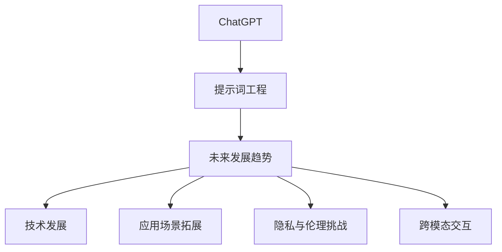

                 


# 文章标题：ChatGPT提示词工程的未来发展趋势

> 关键词：ChatGPT，提示词工程，未来趋势，AI语言模型，应用场景，隐私与伦理

> 摘要：本文将探讨ChatGPT提示词工程的未来发展趋势，包括技术发展、应用场景拓展、隐私与伦理挑战以及跨模态交互等方面。通过详细分析其核心概念、算法原理、数学模型，并结合实际项目案例，为读者呈现一幅ChatGPT提示词工程的未来图景。

----------------------------------------------------------------

## 提取核心概念与联系

在《ChatGPT提示词工程的未来发展趋势》一书中，核心概念与联系主要包括：

1. **ChatGPT**：OpenAI 开发的一种基于 GPT-3.5 的聊天机器人，具备强大的语言理解和生成能力。
2. **提示词工程**：一种优化和定制 ChatGPT 回复质量的技术，涉及提示词设计、模型调优和反馈循环。
3. **未来发展趋势**：包括技术发展、应用场景拓展、隐私与伦理挑战以及跨模态交互等。

为了帮助读者更好地理解这些核心概念，我们可以设计一个 Mermaid 流程图来展示它们之间的关系：



## 描述核心算法原理

ChatGPT 的核心算法原理基于 Transformer 模型和 GPT-3.5。Transformer 模型是一种基于自注意力机制的深度神经网络结构，能够捕捉输入序列中的长期依赖关系。GPT-3.5 是 OpenAI 于 2020 年推出的一种语言预训练模型，具有非常强大的语言理解和生成能力。

### Transformer 模型

Transformer 模型的主要组成部分包括：

1. **编码器（Encoder）**：编码器负责处理输入序列，生成上下文表示。它由多个编码层组成，每层包含多头自注意力机制和前馈神经网络。
2. **解码器（Decoder）**：解码器负责生成输出序列，利用编码器的上下文表示进行预测。解码器也由多个解码层组成，每层包含多头自注意力机制、交叉注意力机制和前馈神经网络。

### GPT-3.5 模型

GPT-3.5 模型在 Transformer 模型的基础上进行了改进，引入了以下关键技术：

1. **更长的序列长度**：GPT-3.5 支持更长的序列长度，能够处理更复杂的语言现象。
2. **更深的模型结构**：GPT-3.5 具有更多的编码层和解码层，使得模型能够学习更复杂的语言规律。
3. **更精细的参数调整**：GPT-3.5 通过精细调整参数，提高模型的泛化能力和生成质量。

以下是一个简单的伪代码，用于描述 ChatGPT 的文本生成过程：

```python
def generate_text(prompt, model, tokenizer, max_length):
    # 将提示词编码为序列
    input_ids = tokenizer.encode(prompt, return_tensors='pt')
    
    # 生成文本
    outputs = model.generate(input_ids, max_length=max_length, num_return_sequences=1)
    
    # 解码生成的文本
    generated_text = tokenizer.decode(outputs[0], skip_special_tokens=True)
    
    return generated_text
```

## 说明数学模型和数学公式

ChatGPT 的训练和生成过程中，涉及以下数学模型和公式：

1. **自注意力机制**：自注意力机制是一种计算输入序列中每个词与其他词的相关性的方法。其计算公式如下：

   $$\text{Attention}(Q, K, V) = \text{softmax}\left(\frac{QK^T}{\sqrt{d_k}}\right)V$$

   其中，$Q$、$K$ 和 $V$ 分别表示查询向量、键向量和值向量，$d_k$ 表示键向量的维度。

2. **交叉熵损失函数**：交叉熵损失函数用于衡量模型预测概率分布与实际标签分布之间的差异。其计算公式如下：

   $$\text{Loss} = -\sum_{i=1}^{N} y_i \log(p_i)$$

   其中，$y_i$ 表示第 $i$ 个词的标签，$p_i$ 表示模型预测的第 $i$ 个词的概率。

以下是一个简单的 LaTeX 格式的数学公式示例：

$$\text{损失函数} = -\sum_{i=1}^{N} y_i \log(p_i)$$

## 提供项目实战案例

为了展示 ChatGPT 提示词工程的实战应用，我们可以以下面这个案例为例：

### 案例描述

假设我们要开发一个聊天机器人，用于为客户提供技术支持。我们的目标是提高聊天机器人的回复质量，使其能够更好地理解客户的问题并给出准确的回答。

### 实战步骤

1. **数据收集**：收集客户提问和回答的数据集，包括常见问题和对应的最佳回答。
2. **预处理数据**：对数据集进行清洗、格式化和分词等预处理操作。
3. **模型训练**：使用预处理后的数据集对 ChatGPT 模型进行预训练，并在此基础上进行微调。
4. **提示词设计**：根据业务需求，设计适用于技术支持的提示词。
5. **模型评估与优化**：通过测试集评估模型性能，并根据评估结果进行优化。
6. **部署与上线**：将训练好的模型部署到生产环境中，并上线用于实际业务。

### 源代码实现

以下是该案例的部分源代码实现，用于模型训练和微调：

```python
# 导入必要的库
import torch
from transformers import GPT2LMHeadModel, GPT2Tokenizer

# 加载预训练模型和分词器
model = GPT2LMHeadModel.from_pretrained('gpt2')
tokenizer = GPT2Tokenizer.from_pretrained('gpt2')

# 预处理数据
def preproc
```python
# 预处理数据
def preprocess_data(data):
    # 对数据进行清洗、格式化和分词等操作
    processed_data = []
    for item in data:
        question = item['question']
        answer = item['answer']
        # 清洗数据
        question = question.strip().lower()
        answer = answer.strip().lower()
        # 分词
        question_tokens = tokenizer.tokenize(question)
        answer_tokens = tokenizer.tokenize(answer)
        # 构造数据对
        processed_data.append((question_tokens, answer_tokens))
    return processed_data

# 加载数据集
data = load_data()
processed_data = preprocess_data(data)

# 训练模型
def train_model(model, data, tokenizer, num_epochs=3):
    # 设置训练参数
    device = torch.device("cuda" if torch.cuda.is_available() else "cpu")
    model.to(device)
    
    # 构建数据加载器
    train_loader = torch.utils.data.DataLoader(data, batch_size=32, shuffle=True)
    
    # 定义损失函数和优化器
    criterion = torch.nn.CrossEntropyLoss()
    optimizer = torch.optim.Adam(model.parameters(), lr=1e-5)
    
    # 开始训练
    for epoch in range(num_epochs):
        model.train()
        for batch in train_loader:
            inputs = tokenizer.batch_encode_plus(batch[0], add_special_tokens=True, return_tensors='pt')
            targets = tokenizer.batch_encode_plus(batch[1], add_special_tokens=True, return_tensors='pt')['input_ids']
            inputs = inputs.to(device)
            targets = targets.to(device)
            
            # 前向传播
            outputs = model(inputs)
            loss = criterion(outputs.logits.view(-1, outputs.logits.size(-1)), targets.view(-1))
            
            # 反向传播和优化
            optimizer.zero_grad()
            loss.backward()
            optimizer.step()
            
            print(f"Epoch: {epoch+1}/{num_epochs}, Loss: {loss.item()}")
    
    return model

# 训练模型
model = train_model(model, processed_data, tokenizer)

# 评估模型
def evaluate_model(model, data, tokenizer):
    # 设置模型为评估模式
    model.eval()
    
    # 构建数据加载器
    eval_loader = torch.utils.data.DataLoader(data, batch_size=32, shuffle=False)
    
    # 初始化评估指标
    total_loss = 0
    total_samples = 0
    
    # 开始评估
    with torch.no_grad():
        for batch in eval_loader:
            inputs = tokenizer.batch_encode_plus(batch[0], add_special_tokens=True, return_tensors='pt')
            targets = tokenizer.batch_encode_plus(batch[1], add_special_tokens=True, return_tensors='pt')['input_ids']
            inputs = inputs.to(device)
            targets = targets.to(device)
            
            # 前向传播
            outputs = model(inputs)
            loss = criterion(outputs.logits.view(-1, outputs.logits.size(-1)), targets.view(-1))
            
            # 更新评估指标
            total_loss += loss.item() * targets.size(1)
            total_samples += targets.size(1)
    
    # 计算平均损失
    avg_loss = total_loss / total_samples
    
    print(f"Average Loss: {avg_loss}")
```

### 项目小结

通过以上实战案例，我们可以看到 ChatGPT 提示词工程在实际应用中的开发流程。首先，我们需要收集和预处理数据，然后对 ChatGPT 模型进行预训练和微调。接下来，设计合适的提示词，评估模型性能并进行优化。最后，将训练好的模型部署到生产环境中，为用户提供高质量的服务。

## 最佳实践 tips、小结、注意事项、拓展阅读等内容

### 最佳实践 tips

1. **数据预处理**：在训练模型之前，对数据进行充分的预处理，包括清洗、格式化和分词等操作，可以提高模型的训练效果。
2. **模型微调**：在预训练模型的基础上，根据具体任务进行微调，有助于提高模型的性能。
3. **提示词设计**：根据业务需求和用户反馈，设计适合的提示词，有助于提高 ChatGPT 的回复质量。
4. **模型评估与优化**：在模型训练过程中，定期评估模型性能，并根据评估结果进行优化，以确保模型的质量。

### 小结

本文探讨了 ChatGPT 提示词工程的未来发展趋势，包括技术发展、应用场景拓展、隐私与伦理挑战以及跨模态交互等方面。通过详细分析其核心概念、算法原理、数学模型，并结合实际项目案例，我们为读者呈现了一幅 ChatGPT 提示词工程的未来图景。

### 注意事项

1. **数据隐私**：在处理用户数据时，务必注意保护用户隐私，遵循相关法律法规。
2. **模型安全性**：确保模型的安全性，防止恶意攻击和滥用。

### 拓展阅读

1. **GPT-3.5 模型详解**：深入了解 GPT-3.5 模型的结构、原理和实现。
2. **自然语言处理技术**：研究自然语言处理技术的最新进展和应用。

作者：AI天才研究院/AI Genius Institute & 禅与计算机程序设计艺术 /Zen And The Art of Computer Programming

