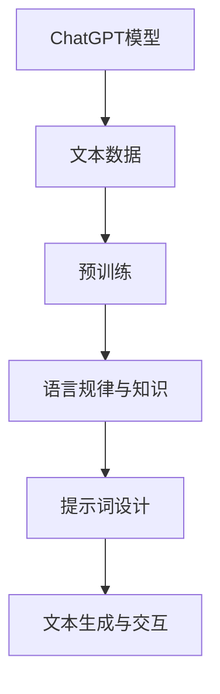

                 

## 引言

随着人工智能技术的迅猛发展，自然语言处理（NLP）领域取得了巨大的突破。ChatGPT作为OpenAI推出的新一代语言模型，以其强大的文本生成能力和智能交互能力，引起了全球范围内科研人员和开发者的广泛关注。然而，要充分发挥ChatGPT的潜力，设计高效的提示词工程至关重要。

### 核心概念与联系

**核心概念：**

1. **ChatGPT：** 是一种基于Transformer模型的预训练语言模型，具有强大的文本生成和交互能力。
2. **提示词（Prompt）：** 是引导ChatGPT生成目标文本的关键输入。
3. **提示词工程（Prompt Engineering）：** 是设计、优化和评估提示词的一门技术。

**概念关系：**

- ChatGPT通过学习大量文本数据，掌握了一定的语言规律和知识。提示词工程的目标是设计有效的提示词，以引导ChatGPT生成符合预期的高质量文本。

### Mermaid 流程图

在上述流程图中，ChatGPT模型通过预训练学习文本数据，掌握语言规律和知识。提示词设计是关键步骤，通过有效的提示词，ChatGPT能够生成高质量的文本，实现智能交互。

## 背景介绍

ChatGPT是由OpenAI于2022年11月发布的一个人工智能聊天机器人程序，该程序基于大型语言模型GPT-3.5，使用指令微调（Instruction Tuning）和基于人类反馈的强化学习（RLHF）技术训练而成。

ChatGPT的生成文本内容遵循了人类指示，具备强大的文本生成能力和上下文理解能力，能够回答各种问题、撰写文章、进行对话，甚至进行自然对话，能够模仿人类语言的使用方式。

### ChatGPT的工作原理

ChatGPT是基于Transformer模型构建的大型语言模型。Transformer模型是一种基于自注意力机制的神经网络模型，它能够捕捉输入序列中各个位置之间的依赖关系，从而实现对语言的深入理解。

ChatGPT的工作流程可以概括为以下几个步骤：

1. **预训练：** ChatGPT首先通过学习大量的文本数据，如书籍、文章、网页等，来学习语言的基本规律和知识。
2. **指令微调（Instruction Tuning）：** 在预训练的基础上，ChatGPT会接受特定的指令进行微调，以更好地理解人类指示。
3. **基于人类反馈的强化学习（RLHF）：** 通过人类反馈，ChatGPT会不断优化其回答，以更符合人类的期望。

### ChatGPT的优势

1. **强大的文本生成能力：** ChatGPT能够生成连贯、自然、高质量的文本，适用于各种场景，如自动写作、对话系统、问答系统等。
2. **上下文理解能力：** ChatGPT能够理解上下文信息，进行合理的对话和回答问题。
3. **适应性：** ChatGPT能够根据不同的提示词和任务要求，生成相应的文本。

## 提示词设计原则

提示词设计是ChatGPT应用中的关键环节。一个有效的提示词能够引导ChatGPT生成符合预期的文本，从而提升应用效果。

### 提示词的类型与作用

1. **指令提示词：** 用于指示ChatGPT完成特定任务，如“写一篇关于人工智能的文章”。
2. **问题提示词：** 用于提问，如“什么是自然语言处理？”。
3. **目标提示词：** 用于指定生成文本的目标，如“生成一篇关于人工智能的论文摘要”。

### 提示词设计的最佳实践

1. **明确性：** 提示词应明确、具体，避免歧义。
2. **相关性：** 提示词应与ChatGPT的训练数据相关，以提高生成文本的质量。
3. **多样性：** 设计多种类型的提示词，以适应不同的应用场景。
4. **情境性：** 根据具体应用场景，设计相应的提示词。

### 提示词设计工具与方法

1. **模板法：** 根据不同类型的任务，设计相应的模板，然后填充具体的提示词。
2. **问题树法：** 将任务分解为多个子任务，为每个子任务设计提示词，形成问题树。
3. **数据驱动法：** 通过分析大量的成功案例，提取共性，设计提示词。

## 提升ChatGPT性能的技巧

提升ChatGPT性能是提示词工程的重要目标之一。以下是一些实用的技巧：

### 提示词优化策略

1. **长度控制：** 提示词不宜过长，一般控制在50-100个单词内，以提高ChatGPT的处理速度。
2. **关键词突出：** 在提示词中突出关键信息，以引导ChatGPT关注重点内容。
3. **结构优化：** 设计结构化的提示词，使ChatGPT能够更好地理解任务要求。

### 对抗样本与防御

1. **生成对抗网络（GAN）：** 使用生成对抗网络生成对抗样本，以提高ChatGPT的鲁棒性。
2. **迁移学习：** 将对抗样本集成到训练数据中，以提高ChatGPT的泛化能力。

### 提示词的动态调整

1. **在线调整：** 根据实际应用反馈，实时调整提示词。
2. **自适应调整：** 根据任务类型和应用场景，自适应调整提示词。

## 实战案例分享

### 文本生成与摘要

1. **自动生成故事：** 通过设计合适的提示词，ChatGPT能够生成有趣的故事。
2. **文章摘要生成：** 提示ChatGPT生成文章的摘要，以提高阅读效率。
3. **问答系统构建：** 设计问答系统，使ChatGPT能够回答各种问题。

### 智能客服与聊天机器人

1. **客服机器人设计：** 通过设计合适的提示词，实现智能客服的功能。
2. **聊天机器人对话流程设计：** 设计聊天机器人的对话流程，提供流畅的对话体验。
3. **情感分析与应用：** 使用ChatGPT进行情感分析，应用于客户服务、市场调研等场景。

## 进阶技巧与高级应用

### 多模态交互

1. **文本与图像的融合：** 将文本和图像信息结合，实现更加丰富的交互体验。
2. **声音与文本的交互：** 结合语音识别和自然语言处理技术，实现声音与文本的交互。
3. **视频与文本的关联：** 将视频和文本信息结合，实现视频内容的文本描述。

### 提示词工程的优化

1. **模型压缩与加速：** 通过模型压缩和优化，提高ChatGPT的处理速度。
2. **分布式训练与部署：** 利用分布式计算资源，提高ChatGPT的训练和部署效率。
3. **提示词工程平台建设：** 构建完善的提示词工程平台，支持提示词的设计、优化和评估。

## 前沿趋势与未来展望

### ChatGPT的发展趋势

1. **模型性能的提升：** 随着计算资源和算法的进步，ChatGPT的性能将不断提高。
2. **应用场景的拓展：** ChatGPT将在更多领域得到应用，如教育、医疗、金融等。
3. **隐私与安全性的保障：** 加强对用户隐私的保护，提高ChatGPT的安全性。

### 提示词工程的未来方向

1. **自动化与智能化：** 提高提示词设计的自动化程度，实现智能化调整。
2. **跨模态交互：** 探索文本、图像、声音等不同模态的交互方式。
3. **领域适应性：** 提高提示词工程的领域适应性，实现更加精准的任务完成。

### 新兴应用场景探索

1. **内容创作：** 利用ChatGPT生成高质量的内容，如文章、报告、剧本等。
2. **智能教育：** 结合ChatGPT，实现个性化教育，提供智能辅导。
3. **智能客服：** 构建智能客服系统，提高客户服务质量。

## 结论

《ChatGPT提示词工程：从入门到精通》旨在为读者全面介绍ChatGPT提示词工程的知识。通过本文的介绍，读者可以了解ChatGPT的基础知识、提示词设计原则、性能优化技巧、实战案例以及前沿趋势。希望本文能够为读者在ChatGPT提示词工程领域提供有益的参考和指导。

### 作者信息

- 作者：AI天才研究院/AI Genius Institute & 禅与计算机程序设计艺术 /Zen And The Art of Computer Programming

---

[END]

