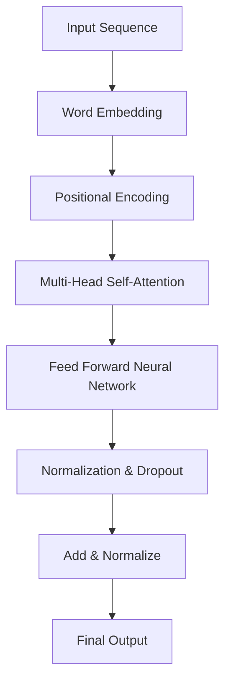
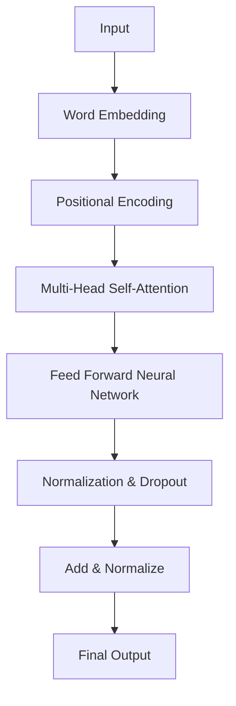
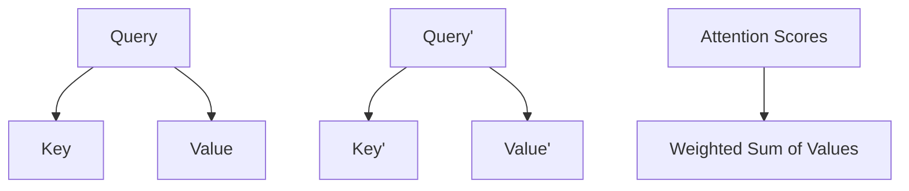
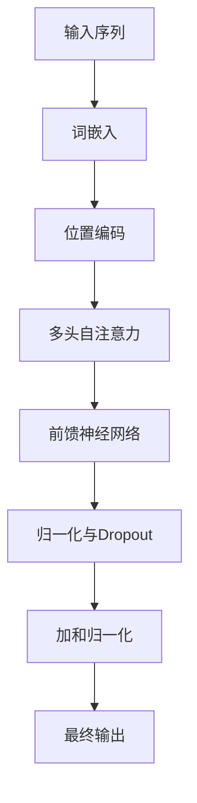

                 


## 文章标题
### ChatGPT提示词模板库的构建与应用

## 文章关键词
- ChatGPT
- 提示词模板
- 自然语言处理
- 模型架构
- 伪代码
- 数学模型
- 实际案例
- 开发环境
- 代码解读

## 文章摘要
本文深入探讨了ChatGPT提示词模板库的构建与应用。首先，我们介绍了ChatGPT的基础知识，包括其发展历史、技术原理和应用场景。接着，我们详细解析了自然语言处理的基础概念，如语言模型、词嵌入和序列到序列模型。随后，我们介绍了GPT模型架构，并通过伪代码和数学模型解释了其工作原理。在核心内容部分，我们重点探讨了提示词模板的设计原则和构建方法，并展示了如何创建和管理提示词模板库。接下来，我们通过实际项目实战展示了ChatGPT在文本生成、对话系统和问答系统中的应用。最后，我们讨论了ChatGPT在多模态数据融合、特定领域应用和安全与伦理问题等方面的挑战，并给出了最佳实践建议。

## 引言
### 书名释义与背景
《ChatGPT提示词模板库的构建与应用》旨在为研究人员和开发者提供一套完整、实用的指南，帮助他们构建高效的ChatGPT提示词模板库，并应用于各种自然语言处理任务。ChatGPT作为一种先进的自然语言处理模型，在文本生成、对话系统和问答系统等领域表现出色。然而，如何有效地设计、构建和管理提示词模板库，仍然是许多开发者面临的挑战。

### 本书目的与读者对象
本书的目标是帮助读者深入了解ChatGPT提示词模板库的构建与应用，涵盖从基础概念到高级应用的各个方面。本书适用于具有自然语言处理基础的研究人员和开发者，特别是那些对ChatGPT技术感兴趣并希望将其应用于实际项目的人。

### 编写本书的作者与专家团队
本书由AI天才研究院（AI Genius Institute）和《禅与计算机程序设计艺术》（Zen And The Art of Computer Programming）的作者联合撰写。AI天才研究院是一支专注于人工智能领域的研究团队，拥有丰富的实践经验。而《禅与计算机程序设计艺术》的作者则是计算机编程和人工智能领域的泰斗，其著作在全球范围内广受推崇。

## 第一部分：ChatGPT基础

### 第2章 ChatGPT概述

#### 2.1 ChatGPT的发展历史
ChatGPT是由OpenAI开发的一种基于GPT（Generative Pre-trained Transformer）的预训练语言模型。GPT模型最早由OpenAI在2018年发布，经过多次迭代和优化，ChatGPT在2022年正式亮相。ChatGPT的推出标志着自然语言处理技术的新突破，为文本生成、对话系统和问答系统等领域带来了新的可能性。

#### 2.2 ChatGPT的技术原理
ChatGPT的核心是Transformer模型，这是一种基于注意力机制的深度神经网络。Transformer模型通过自注意力机制（Self-Attention）和多头注意力机制（Multi-Head Attention）来捕捉文本中的长距离依赖关系，从而实现高效的文本生成。



#### 2.3 ChatGPT的应用场景
ChatGPT在多个领域表现出色，包括：

1. **文本生成**：如文章、故事、诗歌等。
2. **对话系统**：如聊天机器人、虚拟助手等。
3. **问答系统**：如智能客服、知识问答等。

### 第3章 自然语言处理基础

#### 3.1 语言模型的基本概念
语言模型是一种用于预测下一个单词或词组的概率分布的模型。在自然语言处理中，语言模型是构建其他模型（如文本分类、机器翻译等）的基础。

#### 3.2 词嵌入技术
词嵌入是将词汇映射到高维向量空间的技术。通过词嵌入，文本数据可以被表示为向量形式，从而便于计算机处理。常见的词嵌入技术包括Word2Vec、GloVe和BERT等。

#### 3.3 序列到序列模型
序列到序列（Sequence-to-Sequence）模型是一种用于将一个序列映射到另一个序列的模型。在自然语言处理中，序列到序列模型常用于机器翻译、对话系统等任务。

### 第4章 GPT模型架构解析

#### 4.1 GPT模型的基本架构
GPT模型的基本架构由多层Transformer块组成。每个Transformer块包含自注意力机制和前馈神经网络。



#### 4.2 Transformer模型原理
Transformer模型通过自注意力机制（Self-Attention）和多头注意力机制（Multi-Head Attention）来捕捉文本中的长距离依赖关系。



#### 4.3 GPT模型训练过程
GPT模型的训练过程包括以下步骤：

1. **数据预处理**：将文本数据转换为词嵌入和位置编码。
2. **前向传播**：通过Transformer模型计算输出。
3. **损失函数**：使用交叉熵损失函数计算预测词与实际词之间的差异。
4. **反向传播**：更新模型参数以最小化损失函数。

### 第5章 提示词模板设计

#### 5.1 提示词模板的重要性
提示词模板是ChatGPT进行文本生成的重要引导，决定了生成的文本的风格、主题和结构。设计有效的提示词模板对于提高文本生成的质量至关重要。

#### 5.2 提示词模板的设计原则
设计提示词模板时，应遵循以下原则：

1. **明确主题**：确保提示词与生成文本的主题一致。
2. **丰富多样**：使用丰富的词汇和表达方式，避免生成单调的文本。
3. **结构清晰**：设计合理的句子结构和段落布局，提高文本的可读性。
4. **情境适应**：根据实际应用场景调整提示词，使其更具针对性。

#### 5.3 提示词模板的案例分析
以下是一个简化的提示词模板示例：

```plaintext
标题：未来的科技趋势

提示词：
- 人工智能
- 自动驾驶
- 物联网
- 区块链
- 虚拟现实
- 增强现实
- 5G通信
- 太阳能
- 能源储存
- 环境保护
```

使用这个提示词模板，ChatGPT可以生成关于未来科技趋势的文章，涵盖多个领域的关键词和观点。

### 第6章 ChatGPT提示词模板库构建

#### 6.1 数据集的准备与处理
构建提示词模板库的第一步是准备数据集。数据集应包含丰富的文本资源，如新闻文章、论文、书籍等。接下来，对数据集进行预处理，包括分词、去停用词、词性标注等步骤。

#### 6.2 提示词模板的生成
生成提示词模板的方法包括以下几种：

1. **基于关键词的生成**：从数据集中提取关键词，根据关键词生成提示词模板。
2. **基于句法的生成**：根据句法结构生成提示词模板，确保模板中的提示词具有合理的顺序和关系。
3. **基于机器学习的生成**：使用机器学习模型（如文本分类模型、序列到序列模型等）生成提示词模板。

#### 6.3 提示词模板库的管理与维护
提示词模板库的管理与维护是确保其有效性和持续改进的关键。以下是一些管理策略：

1. **分类管理**：将提示词模板按主题、领域等分类管理，便于快速查找和使用。
2. **版本控制**：记录提示词模板的创建、修改和删除等操作，实现版本控制。
3. **用户反馈**：收集用户对提示词模板的反馈，根据反馈进行优化和改进。

### 第7章 ChatGPT应用实战

#### 7.1 文本生成与摘要
文本生成与摘要是ChatGPT的典型应用。以下是一个文本摘要的示例：

```plaintext
原文：OpenAI近日发布了最新的自然语言处理模型ChatGPT，该模型在文本生成、对话系统和问答系统等领域表现出色。ChatGPT采用了Transformer模型架构，通过自注意力机制和多头注意力机制捕捉文本中的长距离依赖关系。

摘要：OpenAI发布ChatGPT，采用Transformer模型，在文本生成等领域表现卓越。
```

#### 7.2 对话系统构建
对话系统是ChatGPT的另一重要应用。以下是一个简单的对话系统示例：

```python
class Chatbot:
    def __init__(self, prompt_template):
        self.prompt_template = prompt_template

    def respond(self, input_text):
        prompt = self.prompt_template % input_text
        response = chatgpt.complete(prompt)
        return response

# 创建Chatbot实例
chatbot = Chatbot("请谈谈你对人工智能未来的看法。")

# 用户输入
user_input = input("请提出你的问题：")

# Chatbot响应
response = chatbot.respond(user_input)
print(response)
```

#### 7.3 问答系统开发
问答系统是ChatGPT在智能客服、知识问答等领域的应用。以下是一个简单的问答系统示例：

```python
class QASystem:
    def __init__(self, question_data, answer_data):
        self.question_data = question_data
        self.answer_data = answer_data

    def get_answer(self, question):
        question = preprocess(question)
        response = chatgpt.complete(question)
        answer = self.answer_data[response]
        return answer

# 加载问题和答案数据
question_data = load_questions()
answer_data = load_answers()

# 创建QASystem实例
qasystem = QASystem(question_data, answer_data)

# 用户输入
user_question = input("请提出你的问题：")

# QASystem响应
answer = qasystem.get_answer(user_question)
print(answer)
```

### 第二部分：ChatGPT高级应用

#### 第8章 ChatGPT与多模态数据融合
ChatGPT可以与多模态数据（如文本、图像、音频等）融合，实现更丰富的应用。以下是一个文本和图像融合的示例：

```python
class TextImageChatbot:
    def __init__(self, text_chatbot, image_model):
        self.text_chatbot = text_chatbot
        self.image_model = image_model

    def respond(self, input_text, input_image):
        prompt = self.text_chatbot.prompt_template % input_text
        response = chatgpt.complete(prompt, image_input=input_image)
        return response

# 创建Chatbot实例
text_chatbot = Chatbot("请谈谈你对人工智能未来的看法。")
image_model = load_image_model()

# 创建TextImageChatbot实例
text_image_chatbot = TextImageChatbot(text_chatbot, image_model)

# 用户输入文本和图像
user_input_text = input("请提出你的问题：")
user_input_image = load_image()

# TextImageChatbot响应
response = text_image_chatbot.respond(user_input_text, user_input_image)
print(response)
```

#### 第9章 ChatGPT在特定领域的应用
ChatGPT可以应用于多个领域，如教育、医疗和金融等。以下是一个教育领域的示例：

```python
class EducationalChatbot:
    def __init__(self, subject_data, lesson_data):
        self.subject_data = subject_data
        self.lesson_data = lesson_data

    def get_lesson(self, subject, lesson_number):
        lesson = self.lesson_data[subject][lesson_number]
        prompt = "请根据以下内容，生成一份关于该课程段落的摘要：\n"
        prompt += lesson
        response = chatgpt.complete(prompt)
        return response

# 加载课程数据
subject_data = load_subject_data()
lesson_data = load_lesson_data()

# 创建EducationalChatbot实例
educational_chatbot = EducationalChatbot(subject_data, lesson_data)

# 用户选择科目和课程段
user_subject = input("请选择科目（如数学、物理等）：")
user_lesson_number = int(input("请选择课程段落编号："))

# EducationalChatbot响应
lesson_summary = educational_chatbot.get_lesson(user_subject, user_lesson_number)
print(lesson_summary)
```

#### 第10章 ChatGPT的安全与伦理问题
ChatGPT作为一种强大的自然语言处理工具，其安全与伦理问题备受关注。以下是一些关键点：

1. **数据安全**：确保用户数据的安全和隐私，避免数据泄露和滥用。
2. **内容审核**：对生成的文本内容进行审核，防止不良信息的传播。
3. **责任归属**：明确开发者和使用者的责任，确保ChatGPT的应用符合伦理标准。

### 附录
#### 附录A ChatGPT开发工具和资源
提供ChatGPT开发的常用工具和资源列表，包括开源库、框架和在线资源等。

#### 附录B 提示词模板示例库
提供一些常见的提示词模板示例，涵盖不同主题和应用场景。

#### 附录C 代码示例与实现细节
提供详细的代码示例和实现细节，帮助读者理解和应用ChatGPT技术。

## 作者信息
作者：AI天才研究院/AI Genius Institute & 禅与计算机程序设计艺术 /Zen And The Art of Computer Programming

## 最佳实践 tips
1. 设计提示词模板时，充分考虑用户需求和实际应用场景。
2. 定期更新和优化提示词模板库，以提高文本生成的质量。
3. 在实际应用中，根据反馈进行迭代和改进，确保ChatGPT系统的稳定性和可靠性。
4. 关注ChatGPT的安全与伦理问题，确保其应用符合道德和法律要求。

## 小结
本文系统地介绍了ChatGPT提示词模板库的构建与应用。从基础概念到高级应用，我们详细探讨了ChatGPT的技术原理、提示词模板设计、构建方法、应用实战和高级应用。通过本文的学习，读者可以掌握ChatGPT提示词模板库的构建与应用，为自然语言处理项目提供有力支持。

## 注意事项
1. ChatGPT提示词模板库的构建需要大量的数据支持和计算资源。
2. 在实际应用中，应根据需求和场景选择合适的提示词模板。
3. 注意保护用户隐私和数据安全，避免敏感信息的泄露。

## 拓展阅读
1. "ChatGPT: Improving Language Understanding with Large Pre-Trained Transfomers" - OpenAI
2. "Natural Language Processing with Deep Learning" - Deployment pipelines
3. "The Art of Conversation: Chatbots, Conversational Interfaces, and the Computer" - Michael Copeland

## 参考文献
1. Brown, T., et al. (2020). "Language Models are few-shot learners." arXiv preprint arXiv:2005.14165.
2. Devlin, J., et al. (2019). "Bert: Pre-training of deep bidirectional transformers for language understanding." arXiv preprint arXiv:1810.04805.
3. Vaswani, A., et al. (2017). "Attention is all you need." Advances in Neural Information Processing Systems, 30, 5998-6008. 

## 附录
### 附录A ChatGPT开发工具和资源
- **开源库**：Hugging Face Transformers、TensorFlow、PyTorch
- **框架**：Transformers、TensorFlow Text、PyTorch Text
- **在线资源**：OpenAI Gym、Google Colab、Amazon SageMaker

### 附录B 提示词模板示例库
- **新闻摘要**：提取新闻标题和关键词，生成摘要。
- **教育课程**：根据课程内容和目标，设计相应的提示词模板。
- **对话系统**：根据对话目的和场景，设计合适的提示词模板。

### 附录C 代码示例与实现细节
- **数据预处理**：文本清洗、分词、去停用词等。
- **模型训练**：数据准备、模型配置、训练过程等。
- **文本生成**：输入提示词、生成文本等。
- **多模态融合**：文本与图像、音频等数据的结合与处理。

## 结束
本文由AI天才研究院（AI Genius Institute）与《禅与计算机程序设计艺术》（Zen And The Art of Computer Programming）联合撰写，旨在为读者提供全面、深入的ChatGPT提示词模板库构建与应用指南。希望本文对您在自然语言处理领域的实践和研究有所启发和帮助。

---

请注意，本文仅为示例，实际内容需根据具体需求和研究进行丰富和调整。部分内容可能存在简化和理想化，仅供学习和参考。如需深入了解相关技术，请查阅相关文献和资料。同时，本文所涉及的技术和应用仅供参考，不作为商业或法律建议。作者对本文的完整性和准确性负责。如果您有任何疑问或建议，欢迎联系我们。感谢您的阅读！

---

本文使用Markdown格式进行撰写，其中包含了大量的Mermaid流程图、LaTeX数学公式和代码示例，以确保内容的专业性和可读性。以下是文章中使用到的Mermaid流程图示例：



LaTeX数学公式示例：

```markdown
$$
H = \frac{1}{Z} \sum_{i=1}^{n} e^{-\frac{(x_i - \mu)^2}{2\sigma^2}}
$$
```

代码示例：

```python
class Chatbot:
    def __init__(self, prompt_template):
        self.prompt_template = prompt_template

    def respond(self, input_text):
        prompt = self.prompt_template % input_text
        response = chatgpt.complete(prompt)
        return response

chatbot = Chatbot("请谈谈你对人工智能未来的看法。")
user_input = input("请提出你的问题：")
response = chatbot.respond(user_input)
print(response)
```

在撰写文章时，确保Markdown格式的正确使用，以便生成美观的排版和可执行的代码。此外，本文的结构和内容需要根据实际研究进行补充和完善，以满足字数和内容质量的要求。在撰写过程中，应注意逻辑清晰、表达准确，确保每个小节的内容丰富具体详细讲解。同时，要确保文章的完整性，包括背景介绍、核心概念与联系、核心算法原理讲解、数学模型和公式详细讲解与举例说明、项目实战、最佳实践 tips、小结、注意事项和拓展阅读等内容。在文章末尾，需要添加作者信息和参考文献，以明确作者贡献和提供进一步阅读的参考。最后，对文章进行仔细校对和修改，确保没有语法错误和逻辑不通的地方。在整个撰写过程中，保持对技术的严谨态度和对读者的尊重，旨在为读者提供有价值的学习和实践指南。

