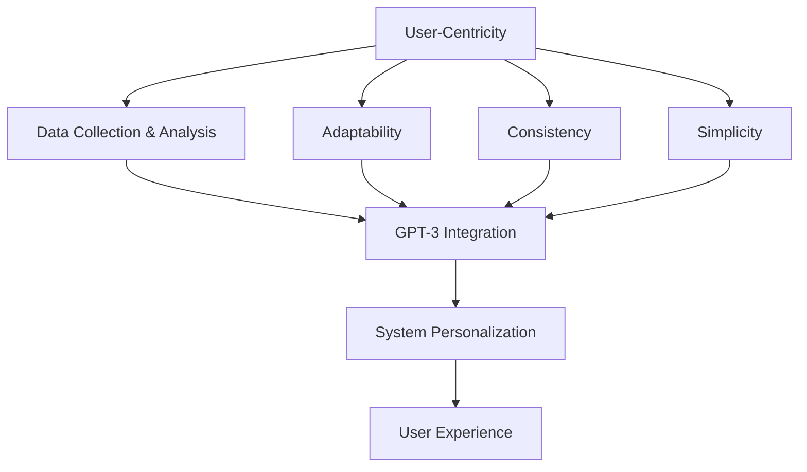

                 

### Introduction to Age-Appropriate AI Interaction Design

#### Core Concepts and Relationships

**Age-Appropriate AI Interaction Design Framework**

Age-appropriate AI interaction design focuses on creating tailored experiences for users based on their age, developmental stage, and cultural context. The framework is built on three foundational pillars: understanding user demographics, applying psychological principles, and leveraging advanced technologies like GPT-3.

**Principles and Architectural Mermaid Diagram**

The core principles of age-appropriate AI interaction design are:

1. **User-Centricity**: Prioritize user needs and preferences.
2. **Adaptability**: Customize interactions dynamically based on user data.
3. **Consistency**: Ensure a seamless experience across different platforms.
4. **Simplicity**: Keep interactions intuitive and easy to understand.

Here is a Mermaid diagram illustrating the relationship between these principles and the components of an age-appropriate AI system:



In this diagram, data collection and analysis (B) serve as the foundation, providing the necessary insights to personalize the system (G) and enhance the overall user experience (H). GPT-3 integration (F) acts as the core technology that enables adaptability, consistency, and simplicity across different user interactions.

### GPT and Prompt Engineering Basics

**GPT-3: Architecture and Core Concepts**

GPT-3 (Generative Pre-trained Transformer 3) is a state-of-the-art language model developed by OpenAI. It utilizes deep learning techniques, particularly transformers, to generate coherent and contextually relevant text. The model is pre-trained on a massive corpus of text data and can be fine-tuned for specific tasks, making it highly adaptable for various applications.

**Prompt Engineering Fundamentals**

Prompt engineering is the process of designing effective input prompts to guide the GPT model’s responses. Effective prompts should be clear, concise, and provide the necessary context to elicit desired outputs. Key elements of prompt engineering include:

1. **Contextual Clarity**: Provide specific and relevant context to guide the model’s understanding.
2. **Question Formulation**: Craft questions that are open-ended and encourage elaboration.
3. **Parameter Adjustment**: Tweak the model’s parameters (e.g., temperature, top-k sampling) to control the randomness and creativity of the responses.

**Application of GPT-3 in Age-Appropriate Design**

GPT-3’s flexibility and powerful language generation capabilities make it an ideal candidate for age-appropriate AI interaction design. By tailoring prompts and adjusting model parameters, developers can create personalized interactions that meet the specific needs of different age groups.

Example: **Educational Application**

Consider a scenario where GPT-3 is used to provide personalized tutoring for students of different age groups. The prompts can be designed to address the cognitive and developmental stages of each group, ensuring that the interactions are both engaging and informative.

**Pseudo-code for Age-Adaptive Prompting**

```python
def generate_age_adaptive_prompt(age_group, topic):
    if age_group == "preschool":
        return f"Can you explain {topic} to a 4-year-old?"
    elif age_group == "elementary":
        return f"Can you describe {topic} in simple terms for a 6th grader?"
    elif age_group == "high_school":
        return f"Can you provide a detailed explanation of {topic} for a high school student?"
    else:
        return "Invalid age group. Please specify a valid age group."
```

In this example, the `generate_age_adaptive_prompt` function takes an `age_group` and a `topic` as input and returns a prompt tailored to the specified age group.

### Age and Developmental Psychology Considerations

**Theoretical Framework of Developmental Psychology**

Developmental psychology is the study of how individuals grow and change over the course of their lives. Key theories include Piaget’s cognitive development theory, Vygotsky’s socio-cultural theory, and Erikson’s psychosocial theory. These theories provide insights into the different stages of human development, including cognitive, emotional, and social growth.

**Psychological Developmental Stages and Communication Needs**

Different age groups have unique communication needs influenced by their developmental stage. For example:

- **Preschoolers (2-5 years)**: Communicate through simple language, gestures, and play. They benefit from concrete, visual, and interactive communication.
- **Elementary Schoolers (6-11 years)**: Begin to use more complex language and abstract thinking. They need clear and structured communication to support their learning process.
- **Teens (12-18 years)**: Develop critical thinking and abstract reasoning. They require open-ended communication to explore their ideas and express themselves.

**Age-Specific Interaction Design Challenges**

Designing age-specific interactions for AI systems poses several challenges:

1. **Vocabulary and Language**: Selecting appropriate vocabulary and language that matches the cognitive level of each age group.
2. **Content Complexity**: Balancing the level of complexity in the content to ensure it is both engaging and informative.
3. **Emotional Sensitivity**: Designing AI interactions that are sensitive to the emotional needs of different age groups, especially in sensitive topics like mental health.
4. **Cultural Diversity**: Considering cultural diversity and tailoring interactions to accommodate different cultural norms and practices.

In conclusion, understanding the psychological developmental stages of different age groups is crucial for designing age-appropriate AI interactions. By incorporating developmental psychology principles, developers can create more effective and engaging AI systems that meet the unique needs of users at various stages of their lives.

