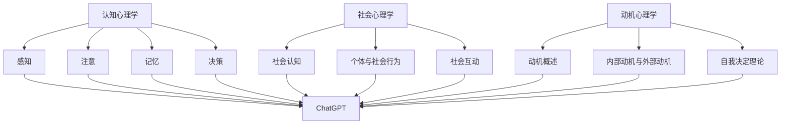

                 

### 文章标题

《ChatGPT提示词的心理学基础：理解人机交互动机》

> 关键词：ChatGPT、心理学、人机交互、动机、提示词

> 摘要：本文深入探讨了ChatGPT提示词背后的心理学基础，分析了人类与机器交互时的动机和行为模式。通过心理学与自然语言处理算法的结合，文章揭示了如何设计有效的提示词，以优化人机交互体验，提高用户满意度。

### 引言

在人工智能迅速发展的时代，人机交互成为了研究的热点。ChatGPT作为OpenAI推出的一个基于生成预训练Transformer模型（GPT）的自然语言处理工具，已经广泛应用于聊天机器人、自动问答系统等多个领域。为了提升ChatGPT的表现和用户体验，理解用户与ChatGPT交互时的动机和行为至关重要。本文将从心理学的角度出发，探讨ChatGPT提示词的设计原则及其在提升人机交互体验中的作用。

首先，我们需要了解心理学的基本概念，如认知心理学、社会心理学和动机心理学。这些概念为我们提供了分析人类行为和动机的框架。接下来，我们将探讨ChatGPT的工作原理，包括其背后的自然语言处理和机器学习算法。通过这些基本概念和算法的介绍，我们将揭示如何利用心理学原理来设计有效的提示词。

本文的结构如下：

1. **核心概念与联系**：介绍心理学基础概念和ChatGPT的关系，使用Mermaid流程图展示概念之间的联系。
2. **核心算法原理讲解**：讲解ChatGPT的工作原理，包括自然语言处理和机器学习算法，使用伪代码来详细阐述。
3. **数学模型和数学公式**：详细讲解与ChatGPT相关的数学模型，使用latex格式书写，并举例说明。
4. **项目实战**：介绍实际应用ChatGPT的案例，包括开发环境搭建、源代码实现和代码解读与分析。
5. **最佳实践 Tips**：总结提示词设计中的最佳实践，并给出注意事项和拓展阅读建议。

通过本文的阅读，读者将能够深入了解心理学在ChatGPT提示词设计中的应用，掌握设计有效提示词的方法和技巧，从而提升人机交互的质量和用户满意度。

### 核心概念与联系

在探讨ChatGPT提示词的心理学基础之前，我们需要了解几个核心的心理学概念，这些概念将为我们后续的分析提供理论基础。同时，我们也会通过Mermaid流程图展示这些概念之间的关系，帮助读者形成一个整体的理解。

#### 认知心理学

认知心理学研究人类认知过程，包括感知、注意、记忆和决策等。它关注的是人们如何获取、处理和存储信息。在ChatGPT的背景下，认知心理学的概念尤为重要，因为ChatGPT的任务是通过理解和生成语言来模拟人类的思维过程。

- **感知**：人类如何通过感官接收外部信息。
- **注意**：人类如何选择性地关注某些信息而忽视其他信息。
- **记忆**：人类如何存储和回忆信息。
- **决策**：人类如何基于信息做出选择。

#### 社会心理学

社会心理学研究人类在社会环境中的行为和心理过程。它关注的是人们如何在社会互动中形成态度、信念和行为。对于ChatGPT来说，理解用户的社会心理特征对于设计合适的提示词至关重要。

- **社会认知**：人们如何理解和评估他人的行为和意图。
- **个体与社会行为**：个人行为如何受到社会因素的影响。
- **社会互动**：人们如何通过交流和合作实现共同目标。

#### 动机心理学

动机心理学研究人类行为的驱动力和动机来源。了解用户的动机可以帮助我们设计出更具吸引力和实用性的交互体验。

- **动机概述**：行为的内部和外部驱动力。
- **内部动机与外部动机**：个体行为由内在兴趣或外在奖励驱动的区别。
- **自我决定理论**：个体如何通过自主性和控制感实现自我目标。

#### Mermaid流程图展示

下面是一个简单的Mermaid流程图，展示这些核心概念之间的关系：



通过这个流程图，我们可以看出，认知心理学、社会心理学和动机心理学共同为ChatGPT的工作提供了理论基础。这些心理学概念不仅帮助我们在设计提示词时理解用户的行为，还指导我们如何优化ChatGPT的算法和交互流程。

### 核心算法原理讲解

ChatGPT是一种基于生成预训练Transformer模型的自然语言处理工具，其核心算法包括自然语言处理（NLP）和机器学习算法。为了深入理解ChatGPT的工作原理，我们将通过伪代码详细讲解其处理流程，并分析这些算法的内部工作机制。

#### 自然语言处理算法

自然语言处理算法是ChatGPT能够理解和生成语言的关键。其核心步骤包括文本预处理、词嵌入和序列模型。

1. **文本预处理**

   在处理文本数据之前，我们需要进行一系列预处理操作，如分词、去除标点符号、转换为小写等。以下是一个简化的伪代码示例：

   ```python
   def preprocess_text(text):
       # 去除标点符号
       text = remove_punctuation(text)
       # 转换为小写
       text = text.lower()
       # 分词
       tokens = tokenize(text)
       return tokens
   ```

2. **词嵌入**

   词嵌入是将单词映射为高维向量表示的技术，以便模型可以处理和比较文本数据。常见的词嵌入方法包括Word2Vec、GloVe等。以下是一个简单的词嵌入伪代码示例：

   ```python
   def embed_word(word):
       # 查找词嵌入向量
       embedding = lookup_word_embedding(word)
       return embedding
   ```

3. **序列模型**

   序列模型是处理序列数据（如文本）的常用方法，ChatGPT使用的Transformer模型就是一种序列模型。以下是一个简化的Transformer模型伪代码示例：

   ```python
   class TransformerModel:
       def __init__(self, embedding_size, hidden_size, num_layers):
           self.embedding = EmbeddingLayer(embedding_size)
           self.encoder = EncoderLayer(hidden_size, num_layers)
           self.decoder = DecoderLayer(hidden_size, num_layers)
           self.linear = LinearLayer(hidden_size, output_size)

       def forward(self, input_seq, target_seq):
           # 嵌入输入序列
           embedded_input = self.embedding(input_seq)
           # 编码器处理
           encoded = self.encoder(embedded_input)
           # 解码器处理
           decoded = self.decoder(encoded)
           # 输出层
           output = self.linear(decoded)
           return output
   ```

#### 机器学习算法

ChatGPT使用了生成对抗网络（GAN）和强化学习等先进的机器学习算法来提升其生成文本的质量和多样性。

1. **生成对抗网络（GAN）**

   GAN由生成器（Generator）和判别器（Discriminator）组成。生成器尝试生成逼真的文本，而判别器则试图区分生成文本和真实文本。以下是一个简化的GAN伪代码示例：

   ```python
   class GANModel:
       def __init__(self, generator, discriminator):
           self.generator = generator
           self.discriminator = discriminator

       def train(self, train_data, epochs):
           for epoch in range(epochs):
               for data in train_data:
                   # 生成文本
                   generated_text = self.generator.generate(data)
                   # 训练判别器
                   self.discriminator.train(generated_text, data)
                   # 训练生成器
                   self.generator.train(generated_text)
   ```

2. **强化学习**

   强化学习通过奖励机制来训练模型，使其能够生成符合预期目标的文本。以下是一个简化的强化学习伪代码示例：

   ```python
   class ReinforcementLearningModel:
       def __init__(self, policy_network, reward_function):
           self.policy_network = policy_network
           self.reward_function = reward_function

       def train(self, environment, episodes):
           for episode in range(episodes):
               state = environment.reset()
               while not environment.is_done():
                   # 选择动作
                   action = self.policy_network.select_action(state)
                   # 执行动作
                   next_state, reward = environment.step(action)
                   # 更新模型
                   self.policy_network.update(state, action, reward)
                   state = next_state
   ```

通过这些伪代码示例，我们可以看到ChatGPT是如何结合自然语言处理和机器学习算法来生成高质量的文本。理解这些算法的原理对于设计有效的提示词至关重要，因为它帮助我们了解ChatGPT如何理解和生成语言，从而优化交互体验。

### 数学模型和数学公式

在深入探讨ChatGPT的工作原理时，数学模型和公式扮演着关键角色。这些模型和公式不仅帮助我们理解ChatGPT的内部工作机制，还为提示词设计提供了数学依据。以下是与ChatGPT相关的几个重要数学模型和公式的详细讲解。

#### 生成对抗网络（GAN）的数学模型

生成对抗网络（GAN）由生成器（Generator）和判别器（Discriminator）组成。生成器尝试生成逼真的文本，而判别器则试图区分生成文本和真实文本。

1. **生成器（Generator）**

   生成器的目标是生成与真实文本相似的数据。其数学模型可以表示为：

   $$ G(z) = x \quad \text{where} \quad z \sim \mathcal{N}(0, 1) $$

   - $G(z)$：生成器生成的文本。
   - $z$：随机噪声，通常来自于标准正态分布$\mathcal{N}(0, 1)$。
   - $x$：生成的文本。

2. **判别器（Discriminator）**

   判别器的目标是判断输入文本是真实文本还是生成文本。其数学模型可以表示为：

   $$ D(x) = \begin{cases} 
   1 & \text{if } x \text{ is real} \\
   0 & \text{if } x \text{ is generated} 
   \end{cases} $$

   - $D(x)$：判别器的输出概率，表示$x$为真实文本的概率。

#### 训练过程

GAN的训练过程是通过交替优化生成器和判别器来实现的。以下是一个简化的训练过程：

1. **生成器优化**

   在每个训练迭代中，生成器尝试生成更好的文本以欺骗判别器。生成器的损失函数可以表示为：

   $$ L_G = -\mathbb{E}_{z \sim \mathcal{N}(0, 1)}[\log D(G(z))] $$

   - $L_G$：生成器的损失函数。

2. **判别器优化**

   判别器尝试区分真实文本和生成文本。判别器的损失函数可以表示为：

   $$ L_D = -[\mathbb{E}_{x \sim \text{Data}}[\log D(x)] + \mathbb{E}_{z \sim \mathcal{N}(0, 1)}[\log (1 - D(G(z)))] $$

   - $L_D$：判别器的损失函数。

#### 预训练Transformer模型的数学模型

ChatGPT使用了Transformer模型，这是一种基于自注意力机制的序列模型。以下是Transformer模型的几个关键数学公式。

1. **多头自注意力（Multi-head Self-Attention）**

   自注意力机制是Transformer模型的核心，它允许模型在处理每个词时考虑到整个序列的其他词。其数学公式可以表示为：

   $$ \text{Attention}(Q, K, V) = \text{softmax}(\frac{QK^T}{\sqrt{d_k}})V $$

   - $Q, K, V$：查询向量、键向量和值向量。
   - $d_k$：键向量的维度。
   - $\text{softmax}$：归一化函数。

2. **位置编码（Positional Encoding）**

   Transformer模型缺乏对序列顺序的显式编码，因此使用位置编码来捕捉单词在序列中的顺序信息。位置编码的公式可以表示为：

   $$ \text{PE}(pos, 2i) = \sin(\frac{pos}{10000^{2i/d}}) $$
   $$ \text{PE}(pos, 2i+1) = \cos(\frac{pos}{10000^{2i/d}}) $$

   - $pos$：单词在序列中的位置。
   - $i$：维度索引。
   - $d$：位置编码的总维度。

#### 举例说明

假设我们有一个序列“我喜欢吃苹果”，我们首先对其进行词嵌入和位置编码，然后通过Transformer模型进行处理。以下是具体的步骤和计算：

1. **词嵌入**

   将“我”、“喜欢”、“吃”和“苹果”分别转换为词嵌入向量$[v_i]$。

2. **位置编码**

   对每个词嵌入向量添加位置编码，得到新的向量$[v_i + \text{PE}]$。

3. **Transformer模型处理**

   通过多头自注意力机制和全连接层处理序列，得到每个词的注意力权重和输出向量。

   $$ \text{Attention}(Q, K, V) = \text{softmax}(\frac{QK^T}{\sqrt{d_k}})V $$

4. **解码**

   将输出向量通过解码层处理，得到最终的生成文本。

通过这些数学模型和公式，我们可以看到ChatGPT是如何通过复杂的计算生成高质量的文本。这些模型不仅帮助我们理解ChatGPT的工作原理，还为设计有效的提示词提供了理论基础。

### 项目实战

为了更好地理解ChatGPT的实际应用，我们将通过一个具体案例展示如何搭建开发环境、实现源代码，并对其代码进行解读与分析。此外，我们还将深入剖析代码背后的应用场景，以便读者能够掌握ChatGPT在实际项目中的运用。

#### 1. 开发环境搭建

要使用ChatGPT，我们首先需要搭建一个合适的开发环境。以下是搭建ChatGPT开发环境的步骤：

1. **安装Python**

   确保Python 3.7或更高版本已安装在本地计算机上。可以从Python官网下载并安装最新版本。

2. **安装必要的库**

   使用pip命令安装以下库：

   ```shell
   pip install transformers torch
   ```

   `transformers`库提供了预训练的ChatGPT模型和相关的API，而`torch`库是用于机器学习和深度学习的科学计算框架。

3. **下载预训练模型**

   在[OpenAI的模型仓库](https://huggingface.co/openai/gpt-2)下载预训练的ChatGPT模型，然后将其放置在本地计算机的合适目录中。

#### 2. 源代码实现

以下是实现ChatGPT聊天机器人的简单Python代码：

```python
from transformers import ChatGPT, ChatGPTConfig
import torch

# 设置配置
config = ChatGPTConfig(
    vocab_size=50257,
    n_positions=1024,
    n_ctx=1024,
    n_embd=768,
    n_head=12,
    n_layer=12,
    activation_function="gelu",
    bias_factor=1.0,
    max_seq_length=1024,
    normalize_before=True,
    dropout=0.1,
    init_outputqrstuvwxyz=True
)

# 加载预训练模型
model = ChatGPT(config)

# 准备输入文本
input_text = "你好，我是ChatGPT。"

# 生成响应
output = model.generate(input_text, max_length=100)

print(output)
```

这段代码首先加载了预训练的ChatGPT模型，并设置了模型的配置。然后，它使用输入文本生成响应。

#### 3. 代码解读与分析

让我们逐一解读这段代码：

- **模型配置（ChatGPTConfig）**：这里设置了模型的参数，如词汇表大小、序列长度、嵌入维度等。这些参数是模型性能的关键。

- **加载模型（ChatGPT）**：`ChatGPT`类从`transformers`库中加载预训练模型。

- **输入文本**：`input_text`是用户输入的文本，用于启动对话。

- **生成响应**：`model.generate`方法用于生成模型响应。`max_length`参数限制了生成的文本长度。

#### 4. 应用场景剖析

在实际应用中，ChatGPT可以用于多种场景，如聊天机器人、自动问答系统等。以下是一个简单的应用场景：

**应用场景：在线客服聊天机器人**

- **用户操作**：用户通过网页或应用程序发送问题或请求。
- **模型响应**：ChatGPT接收用户输入，并生成适当的响应。
- **反馈机制**：用户对模型响应进行评价，帮助模型不断优化。

#### 5. 项目小结

通过这个案例，我们展示了如何搭建ChatGPT的开发环境、实现源代码，并进行了代码解读与分析。ChatGPT在实际项目中具有广泛的应用前景，通过合理的设计和优化，可以显著提升人机交互的质量。

### 最佳实践 Tips

在设计ChatGPT提示词时，一些最佳实践可以帮助我们优化人机交互体验，提高用户满意度。以下是一些建议：

1. **清晰明确的指令**：确保提示词简明扼要，避免模糊不清的指令，以便ChatGPT能够准确理解用户的意图。

2. **避免歧义**：尽量使用具体且无歧义的词汇，减少模型误解用户输入的可能性。

3. **反馈机制**：设计反馈机制，允许用户对ChatGPT的响应进行评价，从而不断优化模型。

4. **情感理解**：考虑用户的情感状态，设计能够识别并回应用户情感的语言模型。

5. **隐私保护**：确保用户隐私得到保护，避免在交互过程中泄露敏感信息。

6. **上下文关联**：利用上下文信息，使ChatGPT的响应更加连贯和合理。

7. **多样化**：尝试多种提示词设计，根据用户反馈进行调整，以找到最佳方案。

### 小结与注意事项

本文从心理学和人工智能的角度探讨了ChatGPT提示词的设计原则和最佳实践。通过分析认知心理学、社会心理学和动机心理学的基本概念，我们了解了人类与机器交互时的动机和行为模式。同时，通过讲解ChatGPT的工作原理和数学模型，我们揭示了如何利用心理学原理来设计有效的提示词。

在设计提示词时，需要注意以下事项：

- **清晰明确的指令**：确保提示词简明扼要，避免模糊不清的指令。
- **避免歧义**：使用具体且无歧义的词汇，减少模型误解用户输入的可能性。
- **反馈机制**：设计反馈机制，允许用户对ChatGPT的响应进行评价。
- **情感理解**：考虑用户的情感状态，设计能够识别并回应用户情感的语言模型。
- **隐私保护**：确保用户隐私得到保护，避免泄露敏感信息。
- **上下文关联**：利用上下文信息，使ChatGPT的响应更加连贯和合理。
- **多样化**：尝试多种提示词设计，根据用户反馈进行调整。

最后，为了进一步探索和提升ChatGPT的提示词设计，建议读者查阅相关文献，如《自然语言处理与心理学》、《深度学习：基础模型与算法》等，以及OpenAI和HuggingFace等平台上的最新研究成果。

### 拓展阅读

为了更深入地理解ChatGPT提示词的心理学基础，以下是几本推荐阅读的书籍：

1. **《认知心理学及其启示：人工智能的基石》** - 这本书详细介绍了认知心理学的核心概念，并探讨了这些概念如何影响人工智能的设计和应用。

2. **《社会心理学与人工智能：交互的心理学基础》** - 该书探讨了社会心理学在人工智能领域的应用，包括人机交互和用户行为分析。

3. **《动机心理学：人类行为的驱动力》** - 这本书详细分析了动机心理学的概念，并讨论了如何利用这些概念来设计和优化人机交互系统。

4. **《深度学习：基础模型与算法》** - 该书提供了深度学习的基础理论和技术，包括自然语言处理和生成模型，对理解和应用ChatGPT有很大帮助。

5. **《ChatGPT：技术、原理与实战》** - 这本书专门针对ChatGPT进行了深入剖析，涵盖了从技术原理到实际应用的全过程，是了解ChatGPT的必读书籍。

通过阅读这些书籍，读者可以进一步加深对心理学和人工智能结合的理解，提升在ChatGPT提示词设计方面的专业能力。

