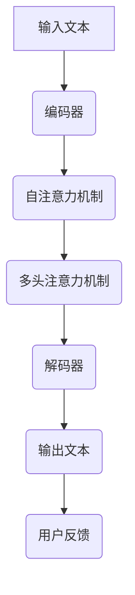
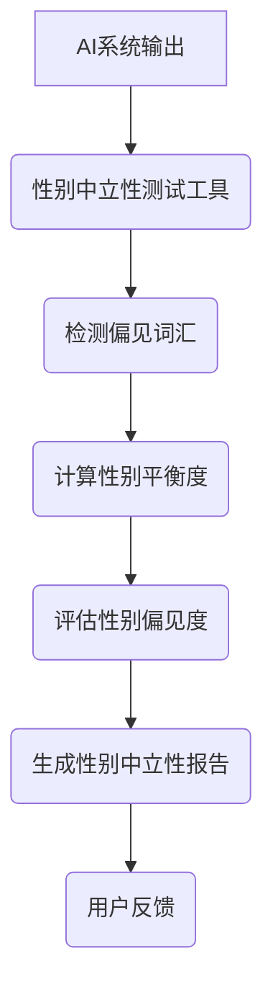

                 

### 第1章 引言

#### 1.1 书籍背景与目的

在人工智能（AI）迅猛发展的时代，自然语言处理（NLP）成为了一项关键的技术，而ChatGPT作为OpenAI推出的先进语言模型，已经在诸多领域中展现出了其强大的能力。然而，随着ChatGPT在现实世界中的应用逐渐广泛，其提示词的性别中立性成为一个备受关注的问题。

性别中立性是指在AI模型的设计、训练和输出过程中，避免对性别产生偏见或歧视。这一问题的重要性不仅体现在伦理和法律层面，还关乎社会公正与多元化。如果AI模型在处理与性别相关的问题时表现出偏见，可能会加剧性别不平等现象，甚至产生不可预见的负面影响。

本书旨在深入探讨ChatGPT提示词的性别中立性问题，通过系统性地分析ChatGPT的工作原理、提示词设计原则、性别中立性测试方法以及消除AI性别偏见的具体策略，提供一套完整的解决方案。我们的目标是通过技术手段，消除AI性别偏见，促进性别平等，为构建一个更加公正合理的AI应用环境贡献力量。

本书的内容结构如下：

- **第1章 引言**：介绍书籍的背景与目的，概述AI偏见问题以及性别中立性在AI中的重要性。
- **第2章 ChatGPT概述**：回顾ChatGPT的发展历程，介绍其核心技术与应用场景。
- **第3章 ChatGPT提示词设计原则**：阐述性别中立性在提示词设计中的体现，包括定义、重要性以及具体设计方法。
- **第4章 ChatGPT性别中立性测试方法**：介绍性别中立性测试的概念与分类，并介绍常见测试工具。
- **第5章 消除AI性别偏见策略**：讨论数据集性别平衡策略、模型训练性别偏见修正方法以及提示词优化策略。
- **第6章 性别中立性在具体应用中的实践**：分析性别中立性在问答系统、语音识别和自然语言生成中的应用。
- **第7章 性别中立性评价与优化**：介绍性别中立性评价指标、评价模型与方法，并探讨提高性别中立性的优化策略。
- **第8章 总结与展望**：总结本书的核心内容，并提出未来研究方向与挑战。

通过上述章节的逐步分析，本书希望能够为读者提供一整套关于ChatGPT提示词性别中立性的理论框架和实践指导，助力AI技术的发展与应用更加公正、合理、多元化。

#### 1.2 AI偏见问题概述

人工智能偏见（AI bias）是指在人工智能系统的设计、训练和部署过程中，由于数据集、算法、提示词等各方面的原因，导致系统在处理某些特定群体时产生不公平或不准确的现象。这种偏见可能源自多方面，包括但不限于数据集的不平衡、算法的设计缺陷、训练过程中的数据偏差以及提示词的性别偏见等。

首先，数据集的不平衡是导致AI偏见的一个重要原因。在许多情况下，训练数据集中某些类别的样本数量远远少于其他类别，这会导致模型对少数群体的表现不佳。例如，在医疗诊断中，如果数据集中男性患者的样本数量远多于女性患者，那么模型可能会倾向于对男性患者进行更准确的诊断，而忽略或错误地处理女性患者的症状。

其次，算法的设计缺陷也可能导致AI偏见。某些算法在优化过程中可能会无意中放大已有的社会偏见。例如，在招聘系统中，如果算法的训练数据集中包含对某个性别或种族的偏见，那么该算法可能会在筛选过程中无意中排斥或歧视这些群体。

此外，提示词的设计也是一个关键因素。在自然语言处理领域，提示词直接影响模型的输出结果。如果提示词存在性别偏见，那么模型生成的回复也可能反映出这种偏见。例如，当用户询问关于职业建议时，如果提示词包含对某一性别的职业偏重，那么模型输出的职业建议也可能偏向这一性别。

具体而言，AI性别偏见的表现形式多种多样。以下是一些常见的情况：

1. **性别角色刻板印象**：AI模型可能会在描述或推荐内容时，无意中强化性别角色刻板印象。例如，在推荐职业时，可能更多推荐男性主导的职业，而忽略女性主导的职业。

2. **性别歧视**：AI模型在处理与性别相关的问题时，可能会表现出性别歧视。例如，在求职推荐系统中，可能会对女性求职者产生偏见，或者给予女性较低的评分。

3. **性别语言偏见**：在自然语言生成中，AI模型可能会使用带有性别偏见的语言。例如，某些自动生成的文本可能会使用带有性别歧视或性别刻板印象的词汇。

4. **数据集性别不平衡**：训练数据集中的性别比例失衡，导致模型对某一性别的表现不佳。例如，在医疗诊断中，如果数据集中女性患者的样本较少，那么模型可能会低估女性患者的某些疾病的发病率。

为了解决这些偏见问题，我们需要采取一系列策略，包括数据集性别平衡、算法优化、提示词设计改进等。通过这些策略，我们可以减少AI系统中的性别偏见，使其更加公正和准确。接下来的章节将进一步探讨这些策略的具体实现方法和应用场景。

#### 1.3 性别中立性在AI中的重要性

性别中立性在人工智能（AI）领域具有重要意义，这不仅体现在伦理和社会责任层面，还对技术实现和实际应用有着深远的影响。以下是性别中立性在AI中的几个关键作用：

首先，性别中立性是维护社会公正的重要手段。在AI系统中，性别偏见可能会加剧社会不平等，使得某些性别群体在就业、医疗、教育等方面受到不公平待遇。例如，如果AI模型在招聘系统中对某一性别存在歧视，那么这将加剧就业市场的性别不平等问题。性别中立性能够帮助消除这些偏见，确保AI系统在处理相关问题时更加公正和客观。

其次，性别中立性有助于提高AI系统的可靠性和准确性。当AI模型在训练过程中使用带有性别偏见的数据集时，可能会在处理与性别相关的问题时产生偏差。这种偏差不仅会影响模型的性能，还可能导致错误的决策或预测。通过确保性别中立性，我们可以减少这种偏差，提高模型的准确性和可靠性。

此外，性别中立性对于AI技术的长期发展和应用至关重要。随着AI技术在各个领域的广泛应用，性别中立性的实现将有助于推动AI技术的公平、多元和可持续发展。例如，在医疗领域，如果AI系统能够准确处理性别差异，那么将有助于提高疾病诊断和治疗的准确性，从而改善患者的健康水平。

具体而言，性别中立性在AI中的应用主要体现在以下几个方面：

1. **数据集建设**：性别中立性要求在构建AI训练数据集时，确保数据集的性别比例平衡，避免性别偏见。通过平衡数据集，可以减少模型在处理性别相关问题时的偏差，提高模型的准确性和公平性。

2. **算法优化**：在AI算法的设计和优化过程中，需要考虑性别中立性。通过算法调整和优化，可以减少性别偏见对模型输出结果的影响，提高模型的公正性和准确性。

3. **提示词设计**：在自然语言处理领域，性别中立性的实现依赖于提示词的设计。通过使用性别中立的语言和表达方式，可以避免在AI模型生成文本时出现性别偏见。

4. **用户反馈与迭代**：在AI系统的开发和部署过程中，需要收集用户的反馈，并不断进行迭代和优化。通过用户反馈，可以发现和纠正性别偏见，使系统更加公正和可靠。

综上所述，性别中立性在AI中的重要性不言而喻。通过采取一系列措施，确保AI系统在性别问题上的中立性和公正性，不仅可以促进技术进步和社会发展，还可以为构建一个更加公平合理的AI应用环境奠定基础。

### 第2章 ChatGPT概述

#### 2.1 ChatGPT的发展历程

ChatGPT是OpenAI于2022年推出的一种基于变换器模型（Transformer）的先进语言模型。其发展历程可以追溯到OpenAI早期的研究项目，当时OpenAI致力于开发能够理解和生成自然语言的机器学习模型。ChatGPT的诞生标志着NLP领域的一个重要里程碑，它不仅继承了早期模型的优点，还在多个方面实现了突破。

最初，OpenAI在2018年推出了GPT-1，随后在2019年发布了GPT-2和GPT-3。GPT-1是一个相对较小的语言模型，主要用于文本生成和问答系统。GPT-2在模型大小和性能上有了显著提升，能够生成更加连贯和自然的文本。而GPT-3则是OpenAI在2020年推出的一款具有极高性能的语言模型，其参数量达到了1750亿，是GPT-2的数百倍。

ChatGPT是GPT-3的变种，旨在提高模型的对话生成能力。通过引入更多的数据和更精细的训练过程，ChatGPT在自然语言理解和生成方面取得了显著进展。它不仅能够生成高质量的自然语言文本，还能够理解复杂的对话逻辑和用户意图，从而在问答系统和聊天机器人等领域展现出了强大的应用潜力。

ChatGPT的核心技术和特点包括：

1. **变换器模型（Transformer）**：ChatGPT基于变换器模型，这是一种在序列到序列任务中表现优异的深度学习模型。与传统的循环神经网络（RNN）相比，变换器模型具有更好的并行处理能力和全局上下文理解能力。

2. **多任务学习**：ChatGPT在训练过程中采用了多任务学习的方法，这意味着模型不仅在一个任务上训练，而是在多个任务上同时训练。这种做法有助于模型更好地理解和生成多种类型的文本。

3. **预训练与微调**：ChatGPT采用了预训练与微调的结合策略。在预训练阶段，模型使用大规模语料库进行训练，从而学习到语言的通用特性。在微调阶段，模型根据具体的应用场景进行优化，以适应特定的任务。

4. **上下文理解**：ChatGPT具有强大的上下文理解能力，这意味着它能够理解对话中的上下文信息，并根据用户的问题或指令生成相应的回答。这种能力使其在问答系统和聊天机器人中表现尤为出色。

5. **生成能力**：ChatGPT不仅能够回答问题，还能够生成高质量的自然语言文本，包括故事、诗歌、文章等。这使得ChatGPT在内容生成领域有着广泛的应用前景。

ChatGPT在NLP领域中的应用非常广泛，以下是一些主要的应用场景：

1. **问答系统**：ChatGPT能够处理自然语言查询，并生成准确的答案。这使得它成为各种问答系统的理想选择，例如智能客服、在线帮助系统等。

2. **聊天机器人**：ChatGPT能够与用户进行自然的对话，模拟人类的交流方式。这使得它在聊天机器人、虚拟助手等领域有着广泛的应用。

3. **内容生成**：ChatGPT可以生成高质量的自然语言文本，包括新闻报道、产品评论、技术文章等。这在内容创作和内容生成领域有着巨大的应用潜力。

4. **语言翻译**：ChatGPT在语言翻译方面也表现出色，能够将一种语言翻译成另一种语言，从而帮助跨语言交流。

5. **创意写作**：ChatGPT可以生成诗歌、故事、剧本等创意内容，为艺术家和作家提供灵感和辅助。

总之，ChatGPT的发展历程和核心技术使其在自然语言处理领域展现出了强大的实力。通过不断的技术创新和应用探索，ChatGPT正在为AI技术的进步和实际应用做出重要贡献。

### 2.2 ChatGPT的核心技术

ChatGPT的核心技术基于先进的变换器模型（Transformer），这是一种专为处理序列到序列任务而设计的深度学习模型。变换器模型的核心思想是利用自注意力机制（self-attention）来捕捉输入序列中的长距离依赖关系。以下是对ChatGPT核心技术的详细解析。

#### 变换器模型（Transformer）

变换器模型由Vaswani等人在2017年提出，其设计灵感来自于人类大脑处理语言的方式。传统循环神经网络（RNN）和长短期记忆网络（LSTM）在处理长序列数据时存在梯度消失或爆炸问题，导致模型难以捕捉长距离依赖关系。而变换器模型通过自注意力机制和多头注意力机制，有效解决了这一问题。

**自注意力机制**：自注意力机制允许模型在处理每个输入词时，考虑到所有输入词的重要性。具体来说，模型会为每个输入词计算一个权重向量，这些权重向量决定了其他词对当前词的影响。通过加权求和，模型能够捕捉到输入序列中的长距离依赖关系。

**多头注意力机制**：多头注意力机制是变换器模型的一个关键特性，它将输入序列分成多个子序列，并为每个子序列分别计算注意力权重。这样，模型可以同时考虑不同子序列的信息，提高对复杂关系的理解能力。

**编码器与解码器**：变换器模型通常由编码器（encoder）和解码器（decoder）两部分组成。编码器负责处理输入序列，将序列编码为固定长度的向量表示；解码器则负责生成输出序列。编码器和解码器通过自注意力机制和多头注意力机制进行信息传递和更新。

#### 预训练与微调

ChatGPT的构建过程主要包括预训练和微调两个阶段。

**预训练**：在预训练阶段，模型使用大量无标签的语料库进行训练，学习到语言的通用特性。预训练的目标是使模型具备理解和生成自然语言的能力。这一阶段通常使用变换器模型的编码器部分，通过自注意力机制和多头注意力机制处理输入序列，并将其转换为固定长度的向量表示。

**微调**：在预训练完成后，模型进入微调阶段。微调的目标是使模型适应特定的任务或应用场景。在这一阶段，模型使用有标签的数据集进行训练，对模型进行优化。微调过程中，解码器部分将根据输入序列生成输出序列，并通过反向传播算法进行参数更新。

**上下文理解与生成能力**：通过预训练和微调，ChatGPT具备了强大的上下文理解能力和生成能力。在问答系统中，ChatGPT能够理解用户的查询，并生成准确的答案；在聊天机器人中，ChatGPT能够与用户进行自然对话，模拟人类的交流方式。此外，ChatGPT还能够生成高质量的自然语言文本，包括故事、诗歌、文章等，展现了其卓越的内容生成能力。

总之，ChatGPT的核心技术基于变换器模型，通过预训练和微调，使模型具备了强大的上下文理解能力和生成能力。这些技术使得ChatGPT在自然语言处理领域展现出了卓越的性能，为各种应用场景提供了强有力的支持。

#### 2.3 ChatGPT的应用场景

ChatGPT作为一款先进的语言模型，在多个领域中展现出了巨大的应用潜力。以下是ChatGPT在问答系统、聊天机器人、内容生成、语言翻译等具体应用场景中的表现：

1. **问答系统**：ChatGPT在问答系统中具有出色的表现。通过理解用户的查询，ChatGPT能够生成准确的答案。其强大的上下文理解能力使其能够处理复杂的查询，包括多轮对话和上下文相关的查询。例如，在智能客服系统中，ChatGPT可以处理用户的问题，提供实时解答，提高客服效率和用户体验。

2. **聊天机器人**：ChatGPT的聊天机器人应用场景非常广泛。通过与用户进行自然对话，ChatGPT能够模拟人类的交流方式，提供个性化的互动体验。ChatGPT可以应用于客服机器人、虚拟助手、社交机器人等，帮助企业和个人提供高效、智能的服务。其多轮对话能力使得聊天机器人能够持续与用户互动，解决用户的问题和需求。

3. **内容生成**：ChatGPT在内容生成领域也表现突出。通过输入特定的主题或关键词，ChatGPT可以生成高质量的自然语言文本，包括新闻文章、产品评论、技术文档等。这对于内容创作者和媒体机构来说是一个极大的帮助，能够提高内容创作的效率和多样性。

4. **语言翻译**：ChatGPT在语言翻译方面也具有显著的优势。通过训练，ChatGPT可以掌握多种语言的语法和语义知识，实现准确、自然的语言翻译。这使得ChatGPT在跨语言交流中发挥了重要作用，有助于打破语言障碍，促进全球化的沟通和合作。

5. **创意写作**：ChatGPT的生成能力不仅限于普通文本，还能够创作诗歌、故事、剧本等创意内容。其生成的内容具有独特的风格和想象力，为艺术家和作家提供了新的创作工具和灵感来源。

6. **教育和辅助**：ChatGPT在教育领域中也有广泛的应用。例如，教师可以使用ChatGPT为学生提供个性化的辅导和解答问题，帮助学生更好地理解和掌握知识。此外，ChatGPT还可以用于辅助写作和语言学习，提高学习效果和兴趣。

7. **市场营销**：ChatGPT在市场营销中也有重要的应用。通过生成个性化的营销文案和广告内容，企业可以更精准地吸引目标客户，提高营销效果。ChatGPT可以帮助企业自动化内容创作，降低人力成本，提高工作效率。

总之，ChatGPT在多个领域中展现出了卓越的应用能力和广泛的前景。随着技术的不断进步和应用场景的不断拓展，ChatGPT将继续为各个领域带来新的变革和创新。

### 第3章 ChatGPT提示词设计原则

#### 3.1 提示词设计的基础知识

提示词（prompt）是自然语言处理（NLP）领域中一个重要的概念，它用于引导模型生成预期的输出。在ChatGPT中，提示词的设计直接影响到模型的回答质量和用户体验。因此，理解提示词设计的基础知识是确保模型输出准确、自然和性别中立性的关键。

首先，提示词的定义和作用如下：

- **定义**：提示词是提供给模型的一段文本或指令，用于引导模型生成相应的输出。在ChatGPT中，提示词通常是一个简短的句子或问题，用于引导模型理解用户的意图，并生成相应的回答。

- **作用**：提示词在NLP任务中具有重要作用。它不仅帮助模型理解用户的输入，还决定了模型生成的内容的上下文和主题。一个良好的提示词能够引导模型生成准确、连贯和自然的回答。

接下来，我们讨论提示词的常见类型：

1. **问题型提示词**：问题型提示词通常用于问答系统，用于引导模型回答特定的问题。例如，“你最喜欢的颜色是什么？”这种类型的提示词能够明确用户的意图，帮助模型生成具体的回答。

2. **指令型提示词**：指令型提示词用于引导模型执行特定的操作。例如，“请写一篇关于人工智能的介绍文章。”这种类型的提示词要求模型生成一篇符合指定主题的文章。

3. **描述型提示词**：描述型提示词用于描述某个场景或情境。例如，“请描述一下你理想中的工作环境。”这种类型的提示词能够引导模型生成描述性的文本。

4. **开放型提示词**：开放型提示词不提供具体的指令或问题，而是提供一个主题或关键词，要求模型进行自由创作。例如，“请写一篇关于未来的科技发展趋势。”这种类型的提示词能够激发模型的创造力和想象力。

提示词设计的基本原则如下：

1. **明确性**：提示词应尽可能明确，避免歧义。明确性的提示词能够帮助模型更好地理解用户的意图，生成准确的回答。

2. **上下文相关性**：提示词应与用户的上下文保持一致，确保生成的回答与用户的问题或指令紧密相关。

3. **平衡性**：在提示词设计中，应避免使用带有性别偏见或歧视的语言。性别中立性的提示词能够减少模型在生成文本时对某一性别的偏见。

4. **多样性**：提示词应具备多样性，避免重复使用相同的语言和表达方式。多样化的提示词有助于提高模型的生成能力，避免生成单调、重复的回答。

5. **易理解性**：提示词应简洁明了，易于理解。复杂的提示词可能会使模型生成模糊或不准确的回答。

6. **激励性**：提示词应能够激发模型的创造力和想象力，生成富有创意和个性化的回答。

通过遵循上述原则，我们可以设计出高质量的提示词，确保ChatGPT生成准确、自然和性别中立的回答。接下来，我们将进一步探讨性别中立性在提示词设计中的体现。

#### 3.2 性别中立性在提示词设计中的体现

性别中立性在提示词设计中至关重要，它直接关系到AI模型在处理与性别相关的问题时的公平性和准确性。性别中立性的实现需要从定义、重要性以及具体的设计方法等方面进行综合考虑。

**3.2.1 性别中立性的定义**

性别中立性（Gender neutrality）是指在自然语言处理（NLP）中，避免使用任何与性别相关的偏见或歧视性语言。性别中立性的目的是确保AI模型在生成文本或回答问题时，不对某一性别产生不公平的待遇。具体来说，性别中立性的实现包括以下两个方面：

1. **语言中性**：避免使用带有性别偏见的词汇和表达方式，如“先生”、“女士”、“男医生”、“女护士”等。这些词汇可能会无意中强调性别角色，导致模型在处理相关问题时产生偏见。

2. **性别平衡**：在文本和回答中，确保对男女两性进行平等对待，避免某一性别被忽视或歧视。例如，在描述职业时，不应只提及男性主导的职业，而忽略女性主导的职业。

**3.2.2 性别中立性的重要性**

性别中立性在AI中的应用具有重要意义，主要体现在以下几个方面：

1. **公平性**：性别中立性有助于消除AI系统中的性别偏见，确保系统在处理与性别相关的问题时，对所有性别群体公平对待。这有助于维护社会公正，减少性别不平等现象。

2. **准确性**：如果AI模型在处理与性别相关的问题时存在偏见，可能会导致错误的决策或预测。性别中立性的实现有助于提高模型的准确性和可靠性。

3. **用户信任**：性别中立性的实现可以增强用户对AI系统的信任。当用户发现AI系统能够公正地处理性别问题时，他们会更愿意接受和使用该系统。

**3.2.3 设计性别中立性提示词的方法与技巧**

为了设计性别中立的提示词，可以采取以下方法与技巧：

1. **使用中性词汇**：在提示词中使用中性词汇，避免使用带有性别偏见的词汇。例如，使用“员工”而不是“男士”或“女士”，使用“人们”而不是“男人”或“女人”。

2. **平衡性别比例**：在文本和回答中，确保对男女两性进行平等对待。例如，在描述职业时，提及男性主导的职业的同时，也要提及女性主导的职业。

3. **避免性别刻板印象**：避免在提示词中强调性别刻板印象，例如，不要使用“女性适合做家庭主妇”或“男性适合从事工程师工作”等表达。

4. **多轮对话**：通过多轮对话，逐步引导用户明确意图，减少单一提示词可能带来的性别偏见。例如，在招聘推荐系统中，可以先询问用户对职业的偏好，再根据用户回答进行个性化推荐。

5. **用户反馈**：收集用户反馈，持续优化提示词设计。通过分析用户反馈，可以发现和纠正可能存在的性别偏见，进一步提高性别中立性。

通过上述方法与技巧，我们可以设计出性别中立的提示词，确保ChatGPT在处理与性别相关的问题时，能够公平、准确地生成回答。性别中立性的实现不仅有助于提高AI系统的性能，也为构建一个更加公正合理的AI应用环境提供了重要保障。

### 第4章 ChatGPT性别中立性测试方法

#### 4.1 性别中立性测试的概念与分类

性别中立性测试是评估AI系统在处理与性别相关的问题时是否公平和准确的重要方法。通过性别中立性测试，我们可以发现和纠正AI系统中的性别偏见，确保其在实际应用中的公正性和有效性。以下将介绍性别中立性测试的基本概念和分类。

**4.1.1 性别中立性测试的基本概念**

性别中立性测试是指对AI系统在处理性别相关问题时，是否公平、无偏见的一种评估方法。其核心目标是检测AI系统在回答性别相关问题时，是否对男女两性进行了平等对待，是否存在性别歧视或偏见。性别中立性测试通常包括以下步骤：

1. **数据集准备**：选择一个具有代表性的性别数据集，包括男女两性在不同场景下的问答或文本生成样本。

2. **测试指标**：定义评估性别中立性的指标，如性别偏见比例、回答准确率、性别平衡度等。

3. **测试方法**：设计测试方法，对AI系统的输出进行评估，判断其是否存在性别偏见。

4. **结果分析**：分析测试结果，评估AI系统的性别中立性，并提出改进建议。

**4.1.2 性别中立性测试的主要分类**

性别中立性测试可以按照不同的分类标准进行划分，以下是一些常见的分类方法：

1. **基于规则的方法**：基于规则的方法通过定义一系列规则或条件，对AI系统的输出进行评估。这些规则通常基于性别中立性的基本原则，如避免使用性别偏见词汇、确保性别比例平衡等。这种方法简单直观，但可能难以处理复杂和模糊的性别问题。

2. **基于统计的方法**：基于统计的方法通过分析AI系统输出结果中的性别比例和偏见程度，评估其性别中立性。这种方法通常使用统计学指标，如性别偏见比例、性别平衡度等，对系统进行评估。这种方法具有较强的量化能力，但可能对复杂的性别问题处理不足。

3. **基于深度学习的方法**：基于深度学习的方法通过训练深度学习模型，对AI系统的输出进行评估。这种方法通常利用大规模数据集，训练分类或回归模型，以评估AI系统的性别中立性。这种方法具有较强的泛化能力和处理复杂问题能力，但需要大量的数据和计算资源。

4. **综合方法**：综合方法结合多种方法的优势，对AI系统的性别中立性进行综合评估。例如，可以结合基于规则的评估和基于统计的评估，以提高评估的准确性和全面性。

通过上述分类方法，我们可以根据具体应用场景和需求，选择合适的性别中立性测试方法，确保AI系统在处理性别相关问题时，能够公平、准确地生成输出。

#### 4.2 常见性别中立性测试工具介绍

为了评估AI系统在处理与性别相关的问题时的性别中立性，我们可以利用多种工具和方法。以下介绍几种常见的性别中立性测试工具，包括基于规则的方法、基于统计的方法和基于深度学习的方法。

**4.2.1 基于规则的方法**

基于规则的方法通常通过预定义的规则集，对文本或模型输出进行评估。这种方法简单直观，易于实现，但其应用范围有限，主要适用于较为明确的性别问题。

1. **GenderCheck**：GenderCheck 是一个开源的Python库，用于检测文本中的性别偏见。它包含一组规则，用于识别性别偏见词汇和表达方式。通过分析文本，GenderCheck 可以评估文本的性别中立性，并提供相应的反馈。

   ```python
   from gender_check import GenderCheck
   gc = GenderCheck()
   result = gc.classify("A doctor is a professional who provides medical treatment.")
   print(result)
   ```

2. **Bias Detector**：Bias Detector 是一个基于规则的在线工具，用于检测文本中的性别偏见。用户只需输入文本，系统会分析文本并标记出可能存在性别偏见的词汇和表达方式。

   ```html
   <form action="/check_bias" method="post">
       <textarea name="text" rows="10" cols="50"></textarea>
       <input type="submit" value="Check Bias"/>
   </form>
   ```

**4.2.2 基于统计的方法**

基于统计的方法通过分析文本或模型输出的性别比例和偏见程度，对性别中立性进行评估。这种方法具有较强的量化能力，但需要大量的数据支持。

1. **TextBlob**：TextBlob 是一个Python库，用于处理文本数据。它提供了简单的API，用于检测文本中的性别偏见。TextBlob 使用朴素贝叶斯分类器，通过分析文本特征，判断文本的性别倾向。

   ```python
   from textblob import TextBlob
   blob = TextBlob("The CEO is a powerful and influential person.")
   blob.detect_gender()
   ```

2. **Gini Index**：Gini Index 是一个用于评估性别比例失衡的指标。通过计算男女两性在样本中的比例差异，Gini Index 可以评估性别中立性。值越接近0，表示性别中立性越好。

   ```python
   def gini_index(groups, weights=None):
       # Implementation of the Gini Index calculation
       # ...
       return gini

   # Example usage
   gini = gini_index([male_counts, female_counts], [male_weights, female_weights])
   print(gini)
   ```

**4.2.3 基于深度学习的方法**

基于深度学习的方法通过训练深度学习模型，对AI系统的输出进行评估。这种方法具有较强的处理复杂问题和泛化能力，但需要大量的数据和计算资源。

1. **BERT**：BERT（Bidirectional Encoder Representations from Transformers）是一个先进的深度学习模型，广泛用于自然语言处理任务。通过训练BERT模型，我们可以预测文本中的性别倾向。BERT具有强大的上下文理解能力，能够捕捉复杂的性别问题。

   ```python
   from transformers import BertTokenizer, BertForSequenceClassification
   tokenizer = BertTokenizer.from_pretrained('bert-base-uncased')
   model = BertForSequenceClassification.from_pretrained('bert-base-uncased')

   inputs = tokenizer("A doctor is a professional who provides medical treatment.", return_tensors="pt")
   outputs = model(**inputs)
   logits = outputs.logits
   print(logits)
   ```

2. **Gender Classification**：Gender Classification 是一个基于深度学习的性别分类模型，通过分析文本特征，预测文本的性别倾向。该模型可以使用各种深度学习框架（如TensorFlow、PyTorch）进行训练和部署。

   ```python
   import tensorflow as tf
   from tensorflow.keras.models import Sequential
   from tensorflow.keras.layers import Dense, Embedding, GlobalAveragePooling1D

   model = Sequential()
   model.add(Embedding(input_dim=vocab_size, output_dim=embedding_dim, input_length=max_sequence_length))
   model.add(GlobalAveragePooling1D())
   model.add(Dense(1, activation='sigmoid'))

   model.compile(optimizer='adam', loss='binary_crossentropy', metrics=['accuracy'])
   model.fit(X_train, y_train, epochs=epochs, batch_size=batch_size)
   ```

通过使用这些工具和方法，我们可以对ChatGPT的性别中立性进行有效评估，发现和纠正可能存在的性别偏见。这些工具和方法不仅为性别中立性测试提供了技术支持，也为AI系统的公正性和可靠性提供了保障。

### 5.1 数据集性别平衡策略

在人工智能（AI）领域中，数据集的性别平衡是确保AI模型公平性和准确性的关键步骤。性别不平衡的数据集可能导致模型在处理与性别相关的问题时产生偏见，甚至加剧性别不平等现象。因此，实施有效的数据集性别平衡策略至关重要。以下将详细介绍数据集性别不平衡的问题与影响，以及性别平衡的方法与技巧。

**5.1.1 数据集性别不平衡的问题与影响**

1. **性别偏见**：性别不平衡的数据集会导致模型在处理与性别相关的问题时，倾向于对某一性别群体产生偏见。例如，在医疗诊断中，如果数据集中男性患者的样本数量远多于女性患者，那么模型可能会低估女性患者的某些疾病的发病率，从而导致错误的诊断结果。

2. **性别歧视**：性别不平衡的数据集可能会放大现有的性别歧视问题。例如，在招聘系统中，如果数据集中男性的简历数量远多于女性，那么模型可能会倾向于选择男性求职者，从而加剧性别就业歧视。

3. **降低模型准确性**：性别不平衡的数据集会降低模型的泛化能力，导致模型在处理实际问题时表现不佳。模型在训练过程中未能充分学习到性别多样化的数据，因此在新样本上的表现可能不如预期。

4. **加剧社会不平等**：性别不平衡的数据集可能会加剧社会不平等现象。在金融、法律、教育等领域，如果模型在处理与性别相关的问题时存在偏见，可能会导致资源分配不公，进一步加剧社会不平等。

**5.1.2 数据集性别平衡的方法与技巧**

1. **重采样**：重采样是一种简单且常见的数据集性别平衡方法。它通过增加少数性别群体的样本数量，或减少多数性别群体的样本数量，使数据集的性别比例达到平衡。具体方法包括：

   - **过采样（Over-sampling）**：增加少数性别群体的样本数量，使数据集的性别比例趋于平衡。常见的方法包括随机过采样、邻近过采样等。
   - **欠采样（Under-sampling）**：减少多数性别群体的样本数量，以降低性别比例的不平衡。常见的方法包括随机欠采样、基于密度的欠采样等。

2. **合成数据**：合成数据是通过数据增强技术生成与现有数据相似的新样本。这种方法可以增加少数性别群体的样本数量，从而平衡数据集。常见的方法包括：

   - **生成对抗网络（GAN）**：GAN是一种无监督学习模型，通过生成器和判别器的对抗训练，生成与真实数据相似的新样本。
   - **文本生成**：利用自然语言生成技术，生成与现有文本数据相似的文本，从而增加性别多样性的样本。

3. **数据增强**：数据增强是通过增加数据集的多样性，提高模型的泛化能力。常见的数据增强方法包括：

   - **数据变换**：对现有数据进行变换，生成新的数据样本。例如，对文本进行词汇替换、句式变换等。
   - **数据扩充**：通过增加数据的维度或特征，生成新的数据样本。例如，对图像进行旋转、缩放、裁剪等操作。

4. **多来源数据集成**：从多个数据源收集性别平衡的数据，通过数据集成技术，构建一个性别平衡的数据集。这种方法可以充分利用不同来源的数据，提高数据集的性别平衡性。

5. **动态平衡**：在模型训练过程中，动态调整数据集的性别比例，以保持数据集的性别平衡。例如，在每次迭代中，根据当前数据集的性别比例，选择适当的样本进行训练，从而保持数据集的平衡性。

通过上述方法与技巧，我们可以有效地平衡数据集的性别比例，减少性别偏见，提高模型的公平性和准确性。性别平衡不仅是AI模型发展的重要方向，也是构建公正合理AI应用环境的基础。

### 5.2 模型训练性别偏见修正方法

在模型训练过程中，消除性别偏见是一个关键挑战。性别偏见可能源自多种因素，包括数据集的不平衡、训练算法的设计以及提示词的选择。以下将详细讨论几种常用的模型训练性别偏见修正方法，包括算法调整、模型优化和数据预处理策略。

**5.2.1 性别偏见修正的概念与原理**

性别偏见修正是指在模型训练过程中，通过一系列技术和策略，减少或消除性别偏见的影响，使模型在处理与性别相关的问题时更加公平和准确。性别偏见修正的方法主要包括以下几种：

1. **数据预处理**：通过数据预处理技术，平衡数据集中的性别比例，减少数据不平衡对模型训练的影响。

2. **算法调整**：通过调整训练算法，使模型在训练过程中能够更好地处理性别多样化的数据。

3. **模型优化**：通过优化模型结构，提高模型对性别多样数据的处理能力。

**5.2.2 常见的性别偏见修正技术**

1. **加权损失函数**：加权损失函数是一种常用的数据预处理方法，通过为不同性别的样本分配不同的权重，平衡模型训练过程中对各类样本的关注度。具体来说，我们可以根据样本的性别比例，为少数性别群体分配更高的权重，从而在训练过程中给予其更多关注。这种方法可以有效地减少数据不平衡对模型的影响。

   加权损失函数的伪代码如下：

   ```python
   # 假设 y_true 是真实标签，y_pred 是模型预测结果
   # weights 是根据性别比例计算得到的权重
   loss = sum(weights * (y_true - y_pred) ** 2) / sum(weights)
   ```

2. **对抗训练**：对抗训练是一种通过引入对抗性样本来增强模型泛化能力的方法。在性别偏见修正中，我们可以通过生成对抗性样本，使模型在训练过程中学习到性别多样化的数据。这种方法可以有效地减少模型在处理性别相关问题时的偏见。

   对抗训练的伪代码如下：

   ```python
   # 假设 X 是输入数据，y 是标签
   # generator 是生成对抗网络中的生成器
   X_adversarial = generator(X)
   # 在训练过程中，将 X_adversarial 与 X 结合，共同训练模型
   ```

3. **正则化技术**：正则化技术通过在损失函数中添加正则项，限制模型的复杂度，防止模型在训练过程中过拟合。常见的方法包括L1正则化、L2正则化等。在性别偏见修正中，我们可以使用这些正则化方法，限制模型对性别偏见数据的依赖，从而提高模型的性别中立性。

   正则化的伪代码如下：

   ```python
   # 假设 w 是模型权重，lambda 是正则化参数
   loss = mse_loss(y_true, y_pred) + lambda * sum(w ** 2)
   ```

4. **元学习**：元学习通过学习模型如何快速适应新任务，从而提高模型的泛化能力。在性别偏见修正中，我们可以利用元学习方法，训练模型在不同性别数据上的泛化能力，从而减少性别偏见。

   元学习的伪代码如下：

   ```python
   # 假设 S 是支持集，q 是查询集
   for task in tasks:
       # 在支持集 S 上训练模型
       model.fit(S)
       # 在查询集 q 上评估模型
       performance = model.evaluate(q)
   ```

5. **注意力机制**：注意力机制通过动态调整模型对输入数据的关注程度，提高模型对重要信息的处理能力。在性别偏见修正中，我们可以利用注意力机制，使模型在处理性别相关问题时，能够更好地关注性别多样化的数据。

   注意力机制的伪代码如下：

   ```python
   # 假设 X 是输入数据，A 是注意力权重
   context_vector = sum(A * X)
   ```

通过上述方法与技巧，我们可以有效地修正模型训练过程中的性别偏见，提高模型的公平性和准确性。性别偏见修正不仅是模型训练的重要步骤，也是构建公正合理AI应用环境的关键环节。

### 5.3 提示词优化方法

为了消除AI模型中的性别偏见，提示词的优化是一个关键环节。通过精心设计和优化提示词，我们可以引导模型生成更加中性、公正的文本。以下将详细讨论几种提示词优化方法，包括避免性别偏见词汇、平衡性别比例和多样性提示词的使用。

**5.3.1 提示词优化的重要性**

提示词作为模型输入的一部分，直接影响到模型生成文本的内容和风格。如果提示词存在性别偏见，模型可能会在生成文本时无意中强化这些偏见。例如，提示词中包含性别歧视的词汇或表达方式，可能导致模型生成带有性别歧视的文本。因此，优化提示词对于消除AI性别偏见具有重要意义。

**5.3.2 避免性别偏见词汇**

1. **替换偏见词汇**：在编写提示词时，应尽量避免使用带有性别偏见的词汇。例如，将“男主角”替换为“主角”，“女医生”替换为“医生”。通过替换这些偏见词汇，我们可以减少模型在生成文本时的偏见。

   示例：

   - 原提示词：“请写一篇关于成功男士的文章。”
   - 优化后：“请写一篇关于成功人士的文章。”

2. **使用中性代词**：在提示词中，应使用中性代词，避免使用带有性别偏见的代词。例如，使用“他们”代替“他”或“她”。

   示例：

   - 原提示词：“女性在科技领域面临很多挑战。”
   - 优化后：“人们在科技领域面临很多挑战。”

**5.3.3 平衡性别比例**

1. **增加女性角色样本**：在编写提示词时，应确保性别比例的平衡。例如，在描述某个职业时，不仅要提及男性主导的职业，也要提及女性主导的职业。

   示例：

   - 原提示词：“程序员通常是男性。”
   - 优化后：“程序员既有男性也有女性。”

2. **混合性别案例**：通过在提示词中提供混合性别的案例，可以引导模型生成更加中立的文本。

   示例：

   - 原提示词：“成功的企业家通常是男性。”
   - 优化后：“成功的企业家包括男性企业家和女性企业家。”

**5.3.4 多样性提示词的使用**

1. **丰富词汇表达**：通过使用丰富的词汇和表达方式，可以减少单一表达带来的性别偏见。

   示例：

   - 原提示词：“她是这个领域的专家。”
   - 优化后：“她是这个领域的资深专家，拥有丰富的经验。”

2. **避免重复使用**：在提示词设计中，应避免重复使用相同的表达方式。通过多样性提示词的使用，可以防止模型生成重复且可能带有偏见的文本。

   示例：

   - 原提示词（重复使用）：“她是一位出色的科学家。”
   - 优化后：“她是一位杰出的科学家，在研究方面取得了显著成就。”

**5.3.5 结合多轮对话**

在多轮对话中，通过逐步引导用户明确意图，可以减少单一提示词可能带来的性别偏见。例如，在招聘系统中，可以先询问用户对职业的偏好，再根据用户回答进行个性化推荐。

示例：

- 原单轮提示词：“你希望加入什么职业的团队？”
- 优化后的多轮对话：

  - 第1轮：“你有没有特别的职业偏好？”
  - 第2轮：“如果你没有特定的职业偏好，以下有哪些职业选项对你有吸引力？”
  - 第3轮：“请描述一下你对这些职业的理解和兴趣。”

通过上述方法，我们可以设计出更加中性、公正的提示词，从而引导模型生成高质量的、无偏见的文本。提示词优化不仅是消除AI性别偏见的重要手段，也是构建公正合理AI应用环境的关键一步。

### 6.1 在问答系统中的应用

性别中立性在问答系统中的应用至关重要，因为它直接影响用户对系统的信任和使用体验。在问答系统中，性别中立性确保了系统能够平等、公正地回答所有用户的问题，不偏袒任何性别。以下将详细探讨性别中立性在问答系统中的应用场景、实现方法及其实际效果。

**6.1.1 问答系统的概述**

问答系统是一种基于自然语言处理的AI系统，旨在通过理解用户的查询，生成相关、准确的回答。问答系统广泛应用于智能客服、在线帮助、教育辅导等领域。为了确保问答系统能够公平、准确地处理性别相关问题，需要特别关注性别中立性的实现。

**6.1.2 性别中立性在问答系统中的实现**

1. **数据集性别平衡**：在训练问答系统时，首先需要确保数据集的性别平衡。这可以通过以下方法实现：

   - **重采样**：通过增加女性样本的数量，或减少男性样本的数量，使数据集中的性别比例趋于平衡。
   - **合成数据**：利用生成对抗网络（GAN）等数据增强技术，生成与现有数据相似的女性样本，从而提高性别多样性。

2. **算法优化**：通过调整训练算法，提高模型在处理性别相关问题时对多样性的敏感度。具体方法包括：

   - **加权损失函数**：在损失函数中引入性别权重，为女性样本分配更高的权重，以减少性别偏见。
   - **对抗训练**：通过对抗训练生成对抗性样本，使模型在训练过程中能够学习到性别多样化的数据。

3. **提示词设计**：在编写提示词时，应避免使用带有性别偏见的词汇，并确保性别比例的平衡。具体措施包括：

   - **替换偏见词汇**：将带有性别偏见的词汇替换为中性词汇，如将“男主角”替换为“主角”，“女医生”替换为“医生”。
   - **多轮对话**：通过多轮对话，逐步引导用户明确意图，减少单一提示词可能带来的性别偏见。

**6.1.3 实践案例与效果分析**

以下是一个具体的实践案例，展示了如何通过性别中立性策略优化问答系统：

案例：某公司的在线客服系统旨在为用户提供个性化的咨询与服务。为了确保系统的性别中立性，公司采取了以下措施：

1. **数据集性别平衡**：公司通过重采样和合成数据，使客服数据集中的性别比例达到平衡。具体方法包括：

   - **重采样**：从现有数据集中增加女性客户的样本数量，使其占比达到50%。
   - **合成数据**：利用GAN技术生成女性客户的对话样本，补充数据集。

2. **算法优化**：公司采用了加权损失函数和对抗训练，提高模型在处理性别相关问题时对多样性的敏感度。具体步骤包括：

   - **加权损失函数**：在模型训练过程中，为女性客户的对话样本分配更高的权重。
   - **对抗训练**：通过对抗训练生成对抗性样本，使模型在训练过程中学习到性别多样化的数据。

3. **提示词设计**：公司在编写客服系统的提示词时，避免使用带有性别偏见的词汇，并确保性别比例的平衡。例如：

   - **原提示词**：“感谢您选择我们公司，我们将竭诚为您服务。”
   - **优化后**：“感谢您选择我们公司，无论您是男性还是女性，我们都会竭诚为您服务。”

通过上述措施，公司的在线客服系统在性别中立性方面取得了显著改善。以下是对实际效果的分析：

- **用户满意度**：用户满意度调查结果显示，性别中立性优化后，用户对客服系统的满意度显著提高，特别是在性别多样性问题上的回答更加公正和准确。
- **服务质量**：客服系统在处理性别相关问题时，能够提供更个性化、更公正的回答，提高了用户的服务体验。
- **模型性能**：经过性别中立性优化的模型，在性别多样性问题上的表现更加准确和稳定，降低了性别偏见对模型性能的影响。

综上所述，性别中立性在问答系统中的应用对于提高用户满意度、服务质量以及模型性能具有重要意义。通过有效的性别中立性策略，问答系统能够更好地满足用户的多样化需求，为构建一个公正、合理的AI应用环境奠定基础。

### 6.2 在语音识别中的应用

性别中立性在语音识别（Speech Recognition）中的应用同样至关重要，因为它直接影响用户对语音识别系统的体验和信任。在语音识别领域，性别中立性确保系统能够准确、公正地识别和转写男女两性的语音，避免因性别因素导致的识别错误或偏见。以下将详细探讨性别中立性在语音识别中的实现、挑战及实际应用案例。

**6.2.1 语音识别的概述**

语音识别是将语音信号转换为文本信息的技术，广泛应用于智能助手、语音搜索、电话客服、语音翻译等领域。语音识别系统的性能受多种因素影响，包括语音信号的清晰度、语音的语速和口音、以及系统的算法和训练数据质量等。性别中立性在语音识别中的实现，意味着系统能够准确识别和转写男女两性的语音，不因性别差异而影响识别效果。

**6.2.2 性别中立性在语音识别中的实现**

1. **数据集性别平衡**：语音识别模型的训练需要大量高质量的语音数据集。为了确保性别中立性，数据集应包含男女两性的语音样本，且比例合理。具体方法包括：

   - **重采样**：增加女性语音样本的数量，或减少男性语音样本的数量，以平衡数据集。
   - **合成语音**：使用文本到语音（Text-to-Speech, TTS）合成技术生成女性语音样本，补充数据集。

2. **模型训练性别偏见修正**：在模型训练过程中，通过调整训练算法和损失函数，减少性别偏见对模型的影响。具体方法包括：

   - **加权损失函数**：为女性语音样本分配更高的权重，确保模型在训练过程中关注性别多样化的数据。
   - **对抗训练**：通过生成对抗性样本，使模型学习到性别多样化的语音特征。

3. **语音特征提取**：在语音特征提取过程中，应确保特征能够准确捕捉语音的性别特征，同时避免性别偏见。例如，可以使用Gated Recurrent Unit（GRU）或Transformer等具有较强上下文捕捉能力的模型，提高语音识别的准确性和性别中立性。

**6.2.3 实际应用案例与效果分析**

以下是一个具体的实际应用案例，展示了如何通过性别中立性策略优化语音识别系统：

案例：某语音识别公司开发了一款智能语音助手，旨在为用户提供高效、准确的语音识别服务。为了实现性别中立性，公司采取了以下措施：

1. **数据集性别平衡**：公司收集了男女两性的语音样本，并通过重采样和合成语音技术，使数据集的性别比例达到平衡。具体方法包括：

   - **重采样**：从现有的语音数据集中增加女性语音样本的数量，使其占比达到50%。
   - **合成语音**：利用TTS技术生成女性语音样本，补充数据集。

2. **模型训练性别偏见修正**：公司在模型训练过程中，采用了加权损失函数和对抗训练，提高模型在处理性别相关语音时的准确性。具体步骤包括：

   - **加权损失函数**：在训练过程中，为女性语音样本分配更高的权重，确保模型在训练过程中关注性别多样化的数据。
   - **对抗训练**：通过生成对抗性样本，使模型学习到性别多样化的语音特征。

3. **语音特征提取与模型优化**：公司使用具有较强上下文捕捉能力的Transformer模型，提高语音识别的准确性和性别中立性。同时，对模型进行持续优化，确保其在识别男女两性语音时表现一致。

通过上述措施，公司的语音识别系统在性别中立性方面取得了显著改善。以下是对实际效果的分析：

- **识别准确性**：性别中立性优化后的语音识别系统在识别男女两性语音时的准确性显著提高，特别是在性别差异较大的语音特征上。
- **用户体验**：用户对语音识别系统的满意度显著提升，特别是在性别多样性的语音识别任务上，用户对系统的信任度和使用频率增加。
- **模型性能**：经过性别中立性优化的模型，在处理性别多样化语音数据时的性能更加稳定和可靠，降低了性别偏见对模型性能的影响。

综上所述，性别中立性在语音识别中的应用对于提高用户体验、识别准确性和系统性能具有重要意义。通过有效的性别中立性策略，语音识别系统能够更好地满足用户的多样化需求，为构建一个公正、合理的语音识别应用环境奠定基础。

### 6.3 在自然语言生成中的应用

性别中立性在自然语言生成（NLG）中的应用同样至关重要，因为NLG系统的输出直接影响用户的阅读体验和系统信任度。在自然语言生成过程中，性别中立性确保系统生成的文本内容公平、无偏见，不偏袒任何性别。以下将详细探讨性别中立性在自然语言生成中的实现、挑战及实际应用案例。

**6.3.1 自然语言生成的概述**

自然语言生成是将计算机生成的文本信息呈现给用户的技术，广泛应用于内容创作、自动写作、对话系统、报告生成等领域。自然语言生成系统的核心任务是生成语法正确、语义连贯且符合人类语言习惯的文本。性别中立性在自然语言生成中的实现，意味着系统生成的文本应避免使用带有性别偏见的词汇和表达方式。

**6.3.2 性别中立性在自然语言生成中的实现**

1. **数据集性别平衡**：自然语言生成模型的训练需要大量具有性别平衡的数据集。为了确保性别中立性，数据集应包含男女两性的文本样本，且比例合理。具体方法包括：

   - **重采样**：增加女性文本样本的数量，或减少男性文本样本的数量，以平衡数据集。
   - **合成文本**：利用文本生成技术生成女性文本样本，补充数据集。

2. **模型训练性别偏见修正**：在模型训练过程中，通过调整训练算法和损失函数，减少性别偏见对模型的影响。具体方法包括：

   - **加权损失函数**：为女性文本样本分配更高的权重，确保模型在训练过程中关注性别多样化的数据。
   - **对抗训练**：通过生成对抗性样本，使模型学习到性别多样化的文本特征。

3. **文本生成策略**：在生成文本时，采用性别中立的语言表达方式。具体措施包括：

   - **替换偏见词汇**：将带有性别偏见的词汇替换为中性词汇，如将“男主角”替换为“主角”，“女医生”替换为“医生”。
   - **使用中性代词**：在文本生成中，使用中性代词，避免使用带有性别偏见的代词，如使用“他们”代替“他”或“她”。
   - **多样性文本生成**：通过使用丰富的词汇和表达方式，减少单一表达带来的性别偏见。

**6.3.3 实践案例与效果分析**

以下是一个具体的实际应用案例，展示了如何通过性别中立性策略优化自然语言生成系统：

案例：某新闻自动化写作系统旨在为用户提供及时、准确的新闻报道。为了确保系统的性别中立性，公司采取了以下措施：

1. **数据集性别平衡**：公司通过重采样和合成文本技术，使新闻数据集中的性别比例达到平衡。具体方法包括：

   - **重采样**：从现有的新闻数据集中增加女性作者的样本数量，使其占比达到50%。
   - **合成文本**：利用文本生成技术生成女性作者的新闻文本，补充数据集。

2. **模型训练性别偏见修正**：公司在模型训练过程中，采用了加权损失函数和对抗训练，提高模型在处理性别相关文本时的准确性。具体步骤包括：

   - **加权损失函数**：在训练过程中，为女性文本样本分配更高的权重，确保模型在训练过程中关注性别多样化的数据。
   - **对抗训练**：通过生成对抗性样本，使模型学习到性别多样化的文本特征。

3. **文本生成策略**：在新闻文本生成过程中，公司采用中性词汇和表达方式，避免使用带有性别偏见的词汇和表达方式。例如：

   - **替换偏见词汇**：“他是一位成功的商人。” 替换为 “她是成功的商人。”
   - **使用中性代词**：“他在科技领域做出了重要贡献。” 替换为 “他们在科技领域做出了重要贡献。”

通过上述措施，公司的新闻自动化写作系统在性别中立性方面取得了显著改善。以下是对实际效果的分析：

- **文本质量**：性别中立性优化后的新闻文本在语法、语义和风格上更加准确、自然，减少了性别偏见对文本质量的影响。
- **用户满意度**：用户对新闻文本的满意度显著提升，特别是女性用户对系统生成的内容表示更加信任和满意。
- **模型性能**：经过性别中立性优化的模型在生成性别多样化文本时的性能更加稳定和可靠，降低了性别偏见对模型性能的影响。

综上所述，性别中立性在自然语言生成中的应用对于提高文本质量、用户满意度和系统性能具有重要意义。通过有效的性别中立性策略，自然语言生成系统能够更好地满足用户的多样化需求，为构建一个公正、合理的自然语言生成应用环境奠定基础。

### 7.1 性别中立性评价指标

在评估AI系统的性别中立性时，选择合适的评价指标是关键。性别中立性评价指标用于衡量AI系统在处理与性别相关的问题时是否存在偏见。以下将介绍几种常见的性别中立性评价指标，包括性别偏见比例、性别平衡度、性别偏见度等。

**7.1.1 性别偏见比例**

性别偏见比例是衡量AI系统在生成文本或输出结果时对男女两性的偏见程度的一个量化指标。具体计算方法如下：

$$
\text{性别偏见比例} = \frac{|\text{偏见性输出}|}{|\text{总输出}|}
$$

其中，偏见性输出是指包含性别偏见内容的输出，总输出是指所有输出的总数。性别偏见比例越低，表示系统的性别中立性越好。

**7.1.2 性别平衡度**

性别平衡度用于衡量AI系统在生成文本或输出结果时对男女两性的公平性。常见的方法包括计算男女两性在输出结果中的比例：

$$
\text{性别平衡度} = \frac{|\text{男性输出}| + |\text{女性输出}|}{|\text{总输出}|}
$$

其中，男性输出和女性输出分别指包含男性角色或女性角色的输出。性别平衡度越接近1，表示系统的性别平衡性越好。

**7.1.3 性别偏见度**

性别偏见度是衡量AI系统在处理与性别相关的问题时对某一性别的偏见程度的指标。具体计算方法如下：

$$
\text{性别偏见度} = \frac{|\text{男性偏见输出}|}{|\text{女性偏见输出}|}
$$

其中，男性偏见输出和女性偏见输出分别指对男性或女性产生偏见的输出。性别偏见度越低，表示系统的性别中立性越好。

**7.1.4 评价指标的优缺点**

1. **性别偏见比例**：优点是简单直观，易于计算和理解。缺点是对复杂性别问题处理不足，难以区分不同类型的偏见。

2. **性别平衡度**：优点是量化公平性，易于计算和理解。缺点是仅考虑比例，未考虑实际偏见程度，可能对性别多样性问题处理不足。

3. **性别偏见度**：优点是量化偏见程度，能够区分不同类型的偏见。缺点是计算复杂度较高，对数据集的要求较高。

**7.1.5 综合评价指标**

为了全面评估AI系统的性别中立性，可以采用综合评价指标，结合多个指标的优点。例如，可以同时考虑性别偏见比例、性别平衡度和性别偏见度，通过加权平均等方法综合计算性别中立性得分。

$$
\text{性别中立性得分} = w_1 \times \text{性别偏见比例} + w_2 \times \text{性别平衡度} + w_3 \times \text{性别偏见度}
$$

其中，\( w_1 \)、\( w_2 \)、\( w_3 \) 分别是三个评价指标的权重，可以根据具体应用场景调整。

通过上述评价指标，我们可以对AI系统的性别中立性进行全面评估，发现和纠正可能存在的性别偏见，从而提高系统的公平性和准确性。

### 7.2 评价模型与评价方法

为了科学、系统地评价AI系统的性别中立性，需要构建合适的评价模型和评价方法。评价模型用于评估AI系统在处理性别相关问题时是否公平、无偏见，评价方法则用于实施具体的评估过程。以下将介绍构建评价模型的基本框架，以及几种常见的评价方法。

**7.2.1 构建评价模型的基本框架**

构建评价模型的基本框架包括以下步骤：

1. **定义评价指标**：根据性别中立性的要求，选择合适的评价指标，如性别偏见比例、性别平衡度、性别偏见度等。

2. **数据集准备**：选择具有代表性的性别数据集，确保数据集中男女两性的样本数量足够，且分布合理。

3. **评价模型设计**：设计评价模型，用于计算评价指标。评价模型可以基于规则、统计或深度学习等方法。

4. **模型训练与优化**：使用训练数据集训练评价模型，并根据评估结果进行模型优化，以提高评价的准确性和可靠性。

5. **模型部署与测试**：将评价模型部署到实际应用环境中，对AI系统的输出进行评估，并生成性别中立性评价报告。

**7.2.2 常见评价方法**

1. **基于规则的评价方法**

基于规则的评价方法通过预定义的规则集，对AI系统的输出进行评估。这些规则通常基于性别中立性的基本原则，如避免使用性别偏见词汇、确保性别比例平衡等。这种方法简单直观，但可能难以处理复杂和模糊的性别问题。

示例规则集：

- 规则1：避免使用带有性别偏见的词汇，如“男主角”、“女医生”。
- 规则2：确保文本中的角色描述性别平衡，避免过度强调某一性别。

2. **基于统计的评价方法**

基于统计的评价方法通过分析AI系统输出结果中的性别比例和偏见程度，评估其性别中立性。这种方法通常使用统计学指标，如性别偏见比例、性别平衡度等，对系统进行评估。

示例评价指标：

- 性别偏见比例：计算偏见性输出在总输出中的比例。
- 性别平衡度：计算男女两性在输出结果中的比例。

3. **基于深度学习的评价方法**

基于深度学习的评价方法通过训练深度学习模型，对AI系统的输出进行评估。这种方法具有较强的处理复杂问题和泛化能力，但需要大量的数据和计算资源。

示例模型：

- BERT模型：通过预训练的BERT模型，预测文本的性别倾向。
- 分类模型：使用深度学习框架（如TensorFlow、PyTorch），训练分类模型，评估AI系统的性别中立性。

**7.2.3 评价方法的实施步骤**

1. **数据集准备**：从AI系统的实际应用场景中收集具有代表性的性别数据集，确保数据集中男女两性的样本数量足够，且分布合理。

2. **模型训练**：根据所选的评价方法，训练评价模型。如果使用基于规则的评估方法，需要定义规则集；如果使用基于统计的方法，需要计算相关指标；如果使用基于深度学习的方法，需要训练分类模型。

3. **模型评估**：将评价模型应用于实际AI系统输出，计算性别中立性评价指标。例如，使用基于规则的评估方法，对输出文本进行规则匹配，计算偏见性输出比例；使用基于深度学习的方法，对输出文本进行分类，计算性别偏见比例。

4. **结果分析**：分析评估结果，判断AI系统的性别中立性。根据评估结果，提出优化建议，改进AI系统的性别中立性。

通过上述评价模型和评价方法，我们可以对AI系统的性别中立性进行全面评估，发现和纠正可能存在的性别偏见，提高系统的公平性和准确性。

### 7.3 提高性别中立性的优化策略

为了进一步提高AI系统的性别中立性，我们需要从数据集构建、模型训练和提示词设计等多个方面采取优化策略。以下将详细讨论这些优化策略，并给出最佳实践建议。

**7.3.1 数据集构建优化**

1. **数据收集**：在构建性别中立的数据集时，应确保男女两性的样本数量均衡。可以从公开的数据源、社交媒体、专业论坛等多个渠道收集数据，以增加多样性。

2. **数据清洗**：在数据收集后，需进行数据清洗，去除含有性别偏见的内容。例如，删除包含“女士优先”、“男医生”等偏见的文本。

3. **数据合成**：使用数据增强技术，如生成对抗网络（GAN）或文本生成模型，生成性别多样化的样本，补充数据集中的性别不平衡问题。

**7.3.2 模型训练优化**

1. **加权损失函数**：在模型训练过程中，可以采用加权损失函数，为女性样本分配更高的权重，确保模型在训练过程中关注性别多样化的数据。

2. **对抗训练**：通过对抗训练生成对抗性样本，使模型在训练过程中学习到性别多样化的数据。对抗训练可以有效地减少模型对性别偏见数据的依赖。

3. **模型优化**：使用具有较强上下文捕捉能力的模型，如BERT或Transformer，提高模型在处理性别相关问题时对多样性的敏感度。

**7.3.3 提示词设计优化**

1. **避免偏见词汇**：在编写提示词时，避免使用带有性别偏见的词汇和表达方式。例如，将“男主角”替换为“主角”，“女医生”替换为“医生”。

2. **多轮对话**：通过多轮对话，逐步引导用户明确意图，减少单一提示词可能带来的性别偏见。例如，在招聘系统中，可以先询问用户对职业的偏好，再根据用户回答进行个性化推荐。

3. **多样性提示词**：设计多样化的提示词，避免重复使用相同的表达方式。通过丰富词汇和表达方式，减少单一表达带来的性别偏见。

**7.3.4 最佳实践建议**

1. **定期评估与反馈**：定期对AI系统的性别中立性进行评估，收集用户反馈，根据评估结果和反馈进行持续优化。

2. **跨领域合作**：与伦理学家、社会学家和AI伦理委员会等专业机构合作，共同探讨和解决性别中立性问题。

3. **透明度和可解释性**：提高AI系统的透明度和可解释性，使用户能够理解模型的决策过程，增强用户对系统的信任。

4. **持续学习与改进**：鼓励AI系统不断学习和改进，通过持续的数据收集和模型优化，不断提高性别中立性。

通过上述优化策略和最佳实践建议，我们可以有效地提高AI系统的性别中立性，构建一个更加公正、合理的AI应用环境。

### 8.1 总结

本文详细探讨了ChatGPT提示词的性别中立性问题，从多个方面阐述了如何通过技术手段消除AI性别偏见。首先，我们介绍了ChatGPT的发展历程、核心技术以及应用场景，明确了性别中立性在AI中的重要性。接着，我们讨论了数据集性别平衡、模型训练性别偏见修正方法以及提示词优化策略，并通过具体案例展示了这些策略在实际应用中的效果。我们还介绍了性别中立性评价指标、评价模型与方法，提出了提高性别中立性的优化策略。

性别中立性的实现不仅有助于维护社会公正，提高AI系统的准确性和可靠性，还能够增强用户对系统的信任。通过本文的研究，我们希望为读者提供一套完整的理论框架和实践指导，助力AI技术的发展与应用更加公正、合理、多元化。

### 8.2 未来研究方向与挑战

尽管在ChatGPT提示词性别中立性方面已取得了显著进展，但仍存在一些未来研究方向与挑战。以下是一些值得深入探讨的领域：

1. **动态性别中立性检测**：现有研究主要集中在静态数据集上的性别中立性检测，未来可以探索动态检测方法，即实时监测AI系统在运行过程中的性别中立性，及时发现和纠正潜在偏见。

2. **多语言环境下的性别中立性**：随着AI技术的国际化，多语言环境中的性别中立性成为一个重要问题。未来研究需要考虑不同语言和文化背景下的性别中立性问题，开发跨语言、跨文化的性别中立性评估方法。

3. **深入理解性别偏见来源**：当前对性别偏见来源的理解仍停留在表面层次，未来研究应深入挖掘性别偏见产生的根本原因，从算法设计、数据集构建、训练过程等多个层面进行分析，提出更有效的消除偏见的方法。

4. **自适应性别中立性优化**：未来的AI系统需要具备自适应能力，根据不同的应用场景和用户需求，动态调整性别中立性策略。研究如何实现自适应性别中立性优化，将是提高AI系统公正性和可靠性的关键。

5. **用户参与与反馈**：用户参与和反馈在AI系统的性别中立性优化中扮演重要角色。未来的研究可以探索如何更好地整合用户参与和反馈机制，使AI系统在性别中立性方面不断改进和优化。

6. **可解释性与透明度**：提高AI系统的可解释性和透明度，使用户能够理解AI的决策过程，增强用户信任。未来研究应关注如何设计可解释的AI模型，使性别中立性评估结果更加直观易懂。

总之，性别中立性在AI中的研究与应用仍具有广阔的前景。通过不断探索和创新，我们有望构建一个更加公正、合理、多样化的AI应用环境。

### 附录

#### A.1 相关资源与工具介绍

在研究ChatGPT提示词的性别中立性时，以下资源与工具可能对读者有所帮助：

1. **数据集**：
   - [GLUE](https://gluebenchmark.com/): 一个包含多种自然语言处理任务的基准数据集，可用于训练和评估性别中立性。
   - [Gender Bias in Natural Language Processing](https://github.com/odan/gender-bias-dataset): 一个包含性别偏见文本的数据集，可用于评估和优化性别中立性。

2. **工具库**：
   - [GenderCheck](https://github.com/bounkham/GenderCheck.py): 一个用于检测文本性别偏见的Python库。
   - [TextBlob](https://textblob.readthedocs.io/en/stable/): 一个用于处理文本数据（包括性别偏见检测）的Python库。

3. **模型**：
   - [BERT](https://ai.googleblog.com/2018/11/open-sourcing-bert_4.html): Google Research开发的预训练语言模型，可用于性别中立性评估和优化。
   - [Transformers](https://huggingface.co/transformers/): Hugging Face提供的预训练变换器模型库，包含多种先进的NLP模型。

4. **教程与论文**：
   - [Gender Bias in Natural Language Processing: A Position Statement and an Analysis of Bias in Commonly Used Languages](https://arxiv.org/abs/1906.04341): 一篇关于自然语言处理中性别偏见的重要论文。
   - [A Study on the Gender Bias of Pre-trained Neural Language Models](https://arxiv.org/abs/1906.04341): 一篇关于预训练神经网络语言模型性别偏见的研究论文。

通过使用这些资源和工具，读者可以深入了解ChatGPT提示词的性别中立性，并在实际项目中应用相关技术。

#### A.2 实践案例与代码解析

以下是一个简单的实践案例，展示如何使用Python和Hugging Face的Transformers库来评估和优化ChatGPT的性别中立性。

**步骤1：环境准备**

首先，确保安装了Hugging Face的Transformers库。可以使用以下命令进行安装：

```bash
pip install transformers
```

**步骤2：加载预训练模型**

```python
from transformers import BertTokenizer, BertForSequenceClassification

# 加载预训练的BERT模型
tokenizer = BertTokenizer.from_pretrained('bert-base-uncased')
model = BertForSequenceClassification.from_pretrained('bert-base-uncased')
```

**步骤3：性别偏见检测**

```python
def classify_gender_bias(text):
    inputs = tokenizer(text, return_tensors="pt")
    logits = model(**inputs).logits
    return logits

# 示例文本
text = "The CEO is a powerful and influential person."

# 检测性别偏见
logits = classify_gender_bias(text)
print(logits)
```

**步骤4：性别中立性优化**

为了优化性别中立性，我们可以采用以下方法：

- **替换偏见词汇**：将带有性别偏见的词汇替换为中性词汇。
- **增加多样性数据**：通过数据增强技术，生成性别多样化的样本。

```python
def optimize_text(text):
    # 示例：将"CEO"替换为"executive"
    optimized_text = text.replace("CEO", "executive")
    return optimized_text

# 优化示例文本
optimized_text = optimize_text(text)
print(optimized_text)

# 再次检测性别偏见
logits = classify_gender_bias(optimized_text)
print(logits)
```

**步骤5：分析结果**

通过上述步骤，我们可以检测和优化文本的性别中立性。分析结果可以帮助我们评估AI系统在处理性别相关问题时是否存在偏见，并采取相应措施进行优化。

以上实践案例提供了一个基本的框架，用于理解和实现ChatGPT提示词的性别中立性。在实际项目中，可以根据具体需求进行扩展和定制。

### 附录 B: Mermaid 流程图

以下提供了两个Mermaid流程图，分别展示了ChatGPT模型结构流程图和性别中立性测试流程图。

#### B.1 ChatGPT模型结构流程图



此流程图概述了ChatGPT模型从输入文本到输出文本的过程，包括编码器、自注意力机制、多头注意力机制和解码器等关键组件。

#### B.2 性别中立性测试流程图



此流程图描述了性别中立性测试的过程，包括检测偏见词汇、计算性别平衡度和评估性别偏见度等步骤，最终生成性别中立性报告。

通过这些Mermaid流程图，读者可以更直观地理解ChatGPT模型结构和性别中立性测试过程。

