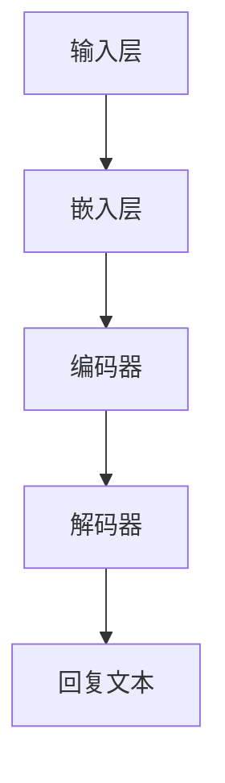
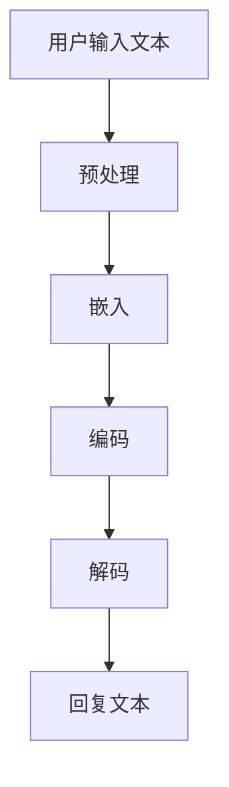

                 

### 引言

#### 书籍背景与目的

随着人工智能技术的不断发展，自然语言处理（Natural Language Processing，NLP）和情感分析（Sentiment Analysis）等领域取得了显著的成果。在这其中，ChatGPT——一种基于大型语言模型的人工智能助手，以其卓越的性能和广泛的应用场景，吸引了众多研究者和开发者的关注。本书旨在探讨ChatGPT在情感智能设计中的应用，通过系统的分析和深入的讲解，帮助读者了解ChatGPT提示词的设计原则，掌握情感智能的关键技术和实践方法。

#### ChatGPT与情感智能

ChatGPT是由OpenAI开发的一种基于GPT-3模型的聊天机器人，它能够通过学习和理解大量的文本数据，与人类进行自然、流畅的对话。情感智能（Affective Intelligence）则是指计算机在处理自然语言时，能够识别、理解和表达情感的能力。ChatGPT在情感智能设计中的应用，主要体现在对用户输入文本的情感分析、情感倾向的识别以及相应的回应生成上。

#### 情感智能设计的重要性

情感智能设计不仅能够提升人工智能系统的用户体验，还能够应用于多种实际场景，如客服机器人、教育助理、心理健康支持等。一个优秀的情感智能设计，需要考虑多方面的因素，包括情感识别的准确性、回应的自然性和多样性、用户反馈的及时响应等。因此，深入研究和设计情感智能，对于提升人工智能系统的整体性能和实用性具有重要意义。

### 《ChatGPT提示词的情感智能设计原则》目录大纲

#### 第1章 引言

- 1.1 书籍背景与目的
- 1.2 ChatGPT与情感智能
- 1.3 情感智能设计的重要性

#### 第2章 ChatGPT基础

- 2.1 ChatGPT概述
- 2.2 ChatGPT架构
- 2.3 ChatGPT的工作原理

#### 第3章 情感智能基本概念

- 3.1 情感与情感智能
- 3.2 情感分类与情感分析
- 3.3 情感智能的重要性

#### 第4章 ChatGPT提示词设计

- 4.1 提示词的作用与设计原则
- 4.2 提示词的情感倾向设计
- 4.3 提示词的多样性设计

#### 第5章 情感智能设计实践

- 5.1 情感智能设计案例分析
- 5.2 情感智能设计的开发流程
- 5.3 情感智能设计的评估与优化

#### 第6章 ChatGPT在情感智能应用

- 6.1 ChatGPT在客服领域的应用
- 6.2 ChatGPT在教育领域的应用
- 6.3 ChatGPT在心理健康领域的应用

#### 第7章 情感智能设计未来展望

- 7.1 情感智能设计的发展趋势
- 7.2 情感智能设计面临的挑战
- 7.3 情感智能设计的未来方向

#### 第8章 附录

- 8.1 ChatGPT开发工具与资源
- 8.2 情感智能相关论文与书籍推荐
- 8.3 开发环境搭建指南

### 摘要

本书围绕ChatGPT提示词的情感智能设计，系统地介绍了ChatGPT的基础知识、情感智能的基本概念、提示词的设计原则及其应用场景。通过详细的分析和实践，本书旨在帮助读者深入理解情感智能设计的方法和技巧，掌握ChatGPT在情感智能领域中的应用。同时，本书还对未来情感智能设计的发展趋势和挑战进行了展望，为读者提供了丰富的参考资料和实际操作指南。读者可以从中了解到如何设计一个具有情感智能的人工智能系统，从而提升用户体验和系统性能。

### 第1章 引言

#### 1.1 书籍背景与目的

随着人工智能技术的不断发展，自然语言处理（Natural Language Processing，NLP）和情感分析（Sentiment Analysis）等领域取得了显著的成果。在这其中，ChatGPT——一种基于大型语言模型的人工智能助手，以其卓越的性能和广泛的应用场景，吸引了众多研究者和开发者的关注。本书旨在探讨ChatGPT在情感智能设计中的应用，通过系统的分析和深入的讲解，帮助读者了解ChatGPT提示词的设计原则，掌握情感智能的关键技术和实践方法。

情感智能设计的重要性不言而喻。情感智能是指计算机在处理自然语言时，能够识别、理解和表达情感的能力。它不仅能够提升人工智能系统的用户体验，还能够应用于多种实际场景，如客服机器人、教育助理、心理健康支持等。一个优秀的情感智能设计，需要考虑多方面的因素，包括情感识别的准确性、回应的自然性和多样性、用户反馈的及时响应等。因此，深入研究和设计情感智能，对于提升人工智能系统的整体性能和实用性具有重要意义。

本书的主要目的是为读者提供一套完整的情感智能设计指南，通过详细的案例分析、理论讲解和实战操作，帮助读者理解情感智能的设计原则和方法，掌握ChatGPT提示词的设计技巧，从而设计出具有高度情感智能的人工智能系统。具体来说，本书将涵盖以下几个方面的内容：

1. **ChatGPT基础**：介绍ChatGPT的基本概念、架构和工作原理，帮助读者建立对ChatGPT的初步认识。
2. **情感智能基本概念**：讲解情感与情感智能的基本概念，包括情感分类、情感分析和情感识别等。
3. **ChatGPT提示词设计**：详细讨论ChatGPT提示词的作用、设计原则、情感倾向设计和多样性设计。
4. **情感智能设计实践**：通过实际案例，展示如何开发和应用情感智能设计。
5. **情感智能应用**：探讨ChatGPT在客服、教育和心理健康等领域的应用实例。
6. **情感智能设计未来展望**：分析情感智能设计的发展趋势、面临的挑战和未来的发展方向。

通过阅读本书，读者将能够：

- 理解ChatGPT的基本原理和架构。
- 掌握情感智能的基本概念和分类。
- 学会设计具有情感智能的ChatGPT提示词。
- 掌握情感智能设计的开发流程和评估方法。
- 了解ChatGPT在现实场景中的多种应用。
- 思考情感智能设计的未来发展方向。

#### 1.2 ChatGPT与情感智能

ChatGPT是由OpenAI开发的一种基于GPT-3模型的人工智能助手。GPT-3（Generative Pre-trained Transformer 3）是自然语言处理领域的一个重要突破，其具有强大的文本生成和理解能力。ChatGPT利用GPT-3模型，能够与用户进行自然、流畅的对话，理解用户的需求并给出相应的回应。

情感智能是指计算机在处理自然语言时，能够识别、理解和表达情感的能力。ChatGPT在情感智能设计中的应用，主要体现在以下几个方面：

1. **情感识别**：ChatGPT能够通过分析用户输入的文本，识别出文本中的情感倾向，如正面情感、负面情感或中性情感。
2. **情感表达**：ChatGPT在生成回应时，能够根据情感识别的结果，选择合适的语言风格和语气，使得回应更加贴近用户的情感状态。
3. **情感反馈**：ChatGPT能够根据用户的情感反应，调整自己的回应策略，以更好地满足用户的需求。

ChatGPT与情感智能的融合，使得人工智能系统能够更好地与人类用户进行互动，提升用户体验。例如，在客服领域，ChatGPT可以分析用户的问题，并根据问题的情感倾向，给出相应的解决方案，使得客服过程更加高效和人性化。

#### 1.3 情感智能设计的重要性

情感智能设计的重要性体现在多个方面。首先，情感智能能够提升人工智能系统的用户体验。在互动过程中，人工智能系统能够识别用户的情感状态，并给出相应的回应，使得交互更加自然、流畅。这种人性化的交互方式，能够有效提升用户对人工智能系统的满意度和忠诚度。

其次，情感智能设计可以应用于多种实际场景，如客服、教育、心理健康等。在客服领域，情感智能可以帮助客服机器人更好地理解用户的需求，提供个性化的服务。在教育领域，情感智能可以辅助教师分析学生的情感状态，提供更有针对性的教育方案。在心理健康领域，情感智能可以用于诊断和治疗，帮助患者缓解心理压力。

最后，情感智能设计还能够推动人工智能技术的进步。通过研究和设计情感智能，可以不断优化人工智能系统的性能，提高其在自然语言处理、情感识别和情感表达等方面的能力。这有助于推动人工智能技术在各个领域的应用，实现更广泛的社会价值。

总之，情感智能设计是人工智能技术发展的重要方向。通过深入研究和设计情感智能，可以提升人工智能系统的性能和用户体验，推动人工智能技术在各个领域的应用，实现人工智能与人类更加紧密的互动。

### 第2章 ChatGPT基础

#### 2.1 ChatGPT概述

ChatGPT是OpenAI开发的一种基于GPT-3模型的人工智能助手。GPT-3（Generative Pre-trained Transformer 3）是自然语言处理领域的一个重要突破，其具有强大的文本生成和理解能力。ChatGPT利用GPT-3模型，能够与用户进行自然、流畅的对话，理解用户的需求并给出相应的回应。

ChatGPT的核心功能包括：

1. **文本生成**：ChatGPT能够根据用户输入的文本，生成相应的回复文本，使得对话更加自然、流畅。
2. **情感识别**：ChatGPT能够分析用户输入的文本，识别出文本中的情感倾向，如正面情感、负面情感或中性情感。
3. **情感表达**：ChatGPT在生成回复文本时，能够根据情感识别的结果，选择合适的语言风格和语气，使得回复更加贴近用户的情感状态。
4. **上下文理解**：ChatGPT能够理解对话的上下文信息，根据对话的历史记录，给出更加相关的回复。

ChatGPT的应用场景非常广泛，包括但不限于：

1. **客服**：ChatGPT可以用于智能客服系统，自动回答用户的问题，提高客服效率。
2. **教育**：ChatGPT可以辅助教师进行教学，分析学生的情感状态，提供个性化的教育方案。
3. **心理健康**：ChatGPT可以用于心理健康支持，分析用户的情感状态，提供心理咨询服务。

#### 2.2 ChatGPT架构

ChatGPT的架构主要包括以下几个部分：

1. **输入层**：用户输入文本，通过输入层进入ChatGPT系统。
2. **嵌入层**：将输入的文本转换为向量表示，为后续的文本生成和理解提供基础。
3. **编码器**：编码器负责对输入文本进行编码，提取文本的特征信息。
4. **解码器**：解码器根据编码器提取的特征信息，生成回复文本。

ChatGPT的架构图如下所示：



#### 2.3 ChatGPT的工作原理

ChatGPT的工作原理主要包括以下几个步骤：

1. **预处理**：用户输入的文本首先进行预处理，包括去除停用词、分词、词性标注等操作，将文本转换为适合模型处理的形式。
2. **嵌入**：预处理后的文本通过嵌入层转换为向量表示。嵌入层通常使用预训练的词向量模型，如Word2Vec、GloVe等。
3. **编码**：编码器对嵌入层生成的向量进行编码，提取文本的特征信息。GPT-3模型使用的编码器是基于Transformer架构的，具有强大的文本理解和生成能力。
4. **解码**：解码器根据编码器提取的特征信息，生成回复文本。解码过程是一个序列生成过程，通过逐步生成每个单词或字符，直到生成完整的回复文本。

以下是ChatGPT工作原理的简化解码流程：



#### 2.4 ChatGPT的优势与挑战

ChatGPT在自然语言处理领域具有显著的优势，主要包括：

1. **强大的文本生成能力**：ChatGPT能够生成高质量、连贯的自然语言文本，适用于多种应用场景。
2. **情感识别与表达**：ChatGPT能够识别用户输入文本的情感倾向，并生成情感相关的回复文本。
3. **上下文理解**：ChatGPT能够理解对话的上下文信息，生成更加相关和自然的回复。

然而，ChatGPT也面临着一些挑战，主要包括：

1. **数据质量和多样性**：ChatGPT的性能在很大程度上取决于训练数据的质量和多样性。如果训练数据存在偏差或不足，可能导致模型生成不准确的回复。
2. **理解和生成能力**：尽管ChatGPT具有强大的文本生成和理解能力，但在某些复杂或模糊的情境下，其表现可能不尽如人意。
3. **伦理与隐私**：在应用ChatGPT时，需要考虑其生成的文本是否符合伦理标准，以及如何保护用户的隐私。

总之，ChatGPT在自然语言处理领域具有广泛的应用前景，但同时也需要不断优化和改进，以克服现有的挑战，提升其性能和应用价值。

### 第3章 情感智能基本概念

#### 3.1 情感与情感智能

情感（Affect）是指人类在特定情境下产生的心理体验和生理反应。它包括情绪（Emotion）、情感状态（Mood）和情感倾向（Affective Tone）等层次。情绪通常是一种短暂、强烈的情感体验，如喜悦、愤怒、悲伤等；情感状态则是一种较为持久、微妙的情感体验，如愉悦、焦虑、平静等；情感倾向则是对某种情感的一般倾向性，如乐观、悲观、敏感等。

情感智能（Affective Intelligence）是指计算机在处理自然语言时，能够识别、理解和表达情感的能力。情感智能的设计和应用，使得人工智能系统能够更好地模拟人类的情感体验，提高人机交互的自然性和情感性。

#### 3.2 情感分类与情感分析

情感分类（Sentiment Classification）是指将文本数据根据情感倾向分为多个类别，如正面情感、负面情感或中性情感。情感分类是情感智能的重要组成部分，通过对文本的情感分类，可以更好地理解和分析用户的情感状态。

情感分析（Sentiment Analysis）是指使用自然语言处理技术，对文本数据中的情感进行识别和分析。情感分析通常包括情感分类和情感强度分析两个阶段。情感分类主要识别文本的情感类别，而情感强度分析则评估文本中情感的强度。

常见的情感分类方法包括：

1. **基于规则的方法**：使用预定义的规则，对文本进行情感分类。这种方法简单直观，但规则难以覆盖所有可能的情感类别。
2. **基于统计的方法**：使用统计模型，如朴素贝叶斯、逻辑回归等，对文本进行情感分类。这种方法能够处理大量的文本数据，但需要大量的训练数据和特征工程。
3. **基于深度学习的方法**：使用深度学习模型，如卷积神经网络（CNN）、循环神经网络（RNN）等，对文本进行情感分类。这种方法具有强大的文本理解和生成能力，但需要大量的计算资源和训练数据。

#### 3.3 情感智能的重要性

情感智能在多个领域具有重要意义，主要包括：

1. **人机交互**：情感智能使得人工智能系统能够更好地识别和理解用户的情感状态，提供更加自然和人性化的交互体验。
2. **情感分析**：情感智能可以用于分析用户反馈、社交媒体评论等，帮助企业了解用户需求、优化产品和服务。
3. **心理健康**：情感智能可以用于心理健康支持，帮助诊断和治疗心理问题，提供个性化的心理咨询服务。
4. **商业应用**：情感智能可以用于市场研究、客户满意度调查等，帮助企业了解市场动态和消费者需求。

总之，情感智能设计是人工智能技术发展的重要方向。通过深入研究和设计情感智能，可以提升人工智能系统的性能和用户体验，推动人工智能技术在各个领域的应用。

### 情感分类算法原理讲解

情感分类是情感智能设计中的核心环节，它通过对文本数据的情感倾向进行识别和分类，使得人工智能系统能够更好地理解和响应用户的情感需求。以下将详细讲解情感分类算法的原理，包括数据处理、特征提取和模型选择等步骤。

#### 数据预处理

数据预处理是情感分类算法的基础步骤，其主要任务包括文本清洗、分词、词性标注和停用词过滤等。

1. **文本清洗**：去除文本中的HTML标签、符号和无关信息，保留有效的文本内容。
2. **分词**：将文本分解为单词或短语，常见的分词方法包括基于词典的分词和基于统计的分词。
3. **词性标注**：对每个单词进行词性标注，如名词、动词、形容词等，有助于后续特征提取。
4. **停用词过滤**：去除对情感分类贡献较小或无意义的停用词，如“的”、“是”、“了”等。

#### 特征提取

特征提取是将原始文本转换为机器学习模型可处理的特征向量，常见的特征提取方法包括：

1. **词袋模型（Bag of Words，BOW）**：将文本表示为单词的集合，每个单词作为一个特征，通过计数或布尔值表示单词的出现次数。
2. **TF-IDF（Term Frequency-Inverse Document Frequency）**：考虑单词在文本中的重要程度，通过计算词频和逆文档频率，为每个特征分配权重。
3. **词嵌入（Word Embedding）**：将单词映射为高维向量，常见的词嵌入方法包括Word2Vec、GloVe和BERT等，通过学习单词的语义关系，提高特征表示的准确性。
4. **情感词典**：基于预定义的情感词典，将情感相关的词汇映射为情感特征。

#### 模型选择

情感分类算法的选择取决于数据特征、模型复杂度和计算资源等因素。常见的情感分类模型包括：

1. **朴素贝叶斯（Naive Bayes）**：基于贝叶斯定理，通过特征的概率分布进行分类，适用于特征独立的情况。
2. **逻辑回归（Logistic Regression）**：通过线性模型预测分类概率，适用于二分类问题。
3. **支持向量机（Support Vector Machine，SVM）**：通过最大化分类间隔，将数据划分为不同的类别。
4. **随机森林（Random Forest）**：基于决策树，通过随机特征选择和Bootstrap抽样，提高分类的泛化能力。
5. **神经网络（Neural Network）**：通过多层感知器和反向传播算法，学习复杂的非线性关系。

以下是情感分类算法的伪代码：

```python
# 情感分类算法伪代码

def preprocess_text(text):
    # 文本预处理步骤
    text = clean_text(text)
    text = tokenize(text)
    text = remove_stopwords(text)
    text = POS_tagging(text)
    return text

def extract_features(text):
    # 特征提取步骤
    features = Bag_of_Words(text)
    features = TF_IDF(features)
    features = Word_Embbeding(features)
    return features

def classify_emotion(features):
    # 情感分类步骤
    probabilities = predict_probability(features)
    emotion = max(probabilities, key=probabilities.get)
    return emotion

text = input_text
preprocessed_text = preprocess_text(text)
features = extract_features(preprocessed_text)
emotion = classify_emotion(features)
```

#### 举例说明

假设我们有一个简单的情感分类任务，数据集包含正面情感、负面情感和中性情感的文本，我们使用逻辑回归模型进行情感分类。以下是具体的训练和预测过程：

1. **数据集准备**：从公开的情感分类数据集中，提取正面、负面和中性情感的文本，并进行预处理。
2. **特征提取**：对预处理后的文本进行词袋模型和TF-IDF特征提取。
3. **模型训练**：使用训练集数据，训练逻辑回归模型。
4. **模型评估**：使用验证集数据，评估模型性能，包括准确率、召回率和F1值等指标。
5. **模型预测**：使用测试集数据，进行情感分类预测。

以下是逻辑回归模型的数学公式：

$$
\text{P(y)} = \frac{1}{1 + e^{-(\text{w} \cdot \text{x})}
$$

其中，\( \text{w} \) 是模型权重，\( \text{x} \) 是特征向量，\( \text{y} \) 是情感标签（0表示中性，1表示正面，-1表示负面）。

通过以上步骤，我们可以实现一个简单的情感分类任务，从而为ChatGPT的情感智能设计提供支持。

### 第4章 ChatGPT提示词设计

#### 4.1 提示词的作用与设计原则

在ChatGPT中，提示词（Prompt）是用户与模型进行交互的桥梁，起到引导和启发模型生成回复的作用。一个优秀的提示词设计，能够显著提升对话的流畅性和情感智能，具体来说，提示词的作用和设计原则包括以下几个方面：

1. **引导对话方向**：通过提供明确的上下文信息和问题，提示词可以引导ChatGPT生成相关的回复，使得对话更加有针对性和连贯。
2. **激发模型潜力**：高质量的提示词能够激发ChatGPT的生成潜力，使其生成更加丰富、多样和自然的回复。
3. **优化情感表达**：通过调整提示词的情感倾向，可以引导ChatGPT生成具有相应情感色彩的回复，提升对话的情感智能。
4. **提升用户体验**：设计合理的提示词，能够提高用户对ChatGPT的满意度，使得交互更加自然、顺畅。

提示词的设计原则主要包括：

1. **明确性**：提示词应明确表达用户意图，避免模糊和歧义，确保ChatGPT能够准确理解用户需求。
2. **针对性**：根据不同的对话场景和应用领域，设计具有针对性的提示词，以满足特定场景的需求。
3. **多样性**：为了提升对话的多样性和灵活性，应设计多种不同类型的提示词，以适应不同的交互情境。
4. **情感性**：在提示词中融入情感元素，使得ChatGPT能够生成具有情感色彩的回复，提升对话的情感智能。
5. **简洁性**：提示词应尽量简洁明了，避免冗长和复杂的描述，以便ChatGPT能够快速理解和生成回复。

#### 4.2 提示词的情感倾向设计

情感倾向设计是提示词设计的重要组成部分，它关系到ChatGPT生成回复的情感色彩和风格。以下是一些设计技巧：

1. **情感词语的选择**：在提示词中融入正面、负面或中性的情感词语，以引导ChatGPT生成相应情感色彩的回复。例如，使用“很高兴听到这个消息”、“感到有些遗憾”等表达情感。
2. **语气和语调的调整**：通过调整提示词的语气和语调，可以影响ChatGPT生成回复的情感倾向。例如，使用友好、亲切、严肃等不同语气的词汇，来塑造不同的情感氛围。
3. **情感隐喻的使用**：在提示词中使用情感隐喻，可以增强情感表达的效果。例如，使用“星光璀璨”、“心花怒放”等隐喻表达积极的情感。
4. **情感平衡**：在提示词中保持情感平衡，避免过于极端的情感倾向。通过结合正面和负面情感的词汇，可以创造出更加丰富和自然的情感表达。

以下是一个情感倾向设计的实例：

- **正面情感**：提示词：“请描述您最近一次感受到的快乐时光，包括您做了什么、和谁在一起以及当时的感受。”
- **负面情感**：提示词：“请您谈谈最近一次遇到的不愉快经历，包括发生了什么、您的感受以及您如何应对。”
- **中性情感**：提示词：“请您简要回顾一下昨天的工作，包括您完成了哪些任务、遇到了哪些困难以及您的整体感受。”

通过以上情感倾向设计，ChatGPT可以生成具有不同情感色彩的回复，满足用户多样化的情感需求。

#### 4.3 提示词的多样性设计

多样性设计是提升ChatGPT回复质量和用户体验的重要手段。以下是一些提示词的多样性设计技巧：

1. **提问方式的多样化**：通过使用不同的提问方式，如开放性提问、封闭性提问、疑问句、陈述句等，可以丰富对话的互动形式，提升用户参与度。
2. **信息层次的结构化**：在提示词中嵌入不同层次的信息，如背景信息、核心问题和扩展问题，可以帮助ChatGPT生成更加丰富和详细的回复。
3. **情感色彩的丰富性**：通过结合不同情感色彩的词汇，设计具有多种情感倾向的提示词，可以增强对话的情感丰富性和多样性。
4. **跨领域的扩展**：设计跨领域的提示词，如涉及不同文化、行业和话题的提问，可以拓宽ChatGPT的应用范围，提升其适应能力。
5. **语境的适应性**：根据不同的对话情境，设计具有高度适应性的提示词，如面对紧急情况、敏感话题或特定文化背景，设计相应的提问和引导。

以下是一个多样性设计的实例：

- **提问方式**：提示词：“您最近有没有做过什么有趣的事情？或者有什么特别的感受想要分享？”
- **信息层次**：提示词：“首先，请您谈谈最近的健康状况；然后，分享一下最近的工作或学习情况；最后，谈谈您的休闲活动。”
- **情感色彩**：提示词：“请您描述一下最近一次感受到的挫败感，并分享一下您是如何克服的？”
- **跨领域扩展**：提示词：“在科技领域，有哪些最新的发展趋势和突破？在艺术领域，有哪些值得关注的展览和活动？”
- **语境适应性**：提示词：“在疫情期间，您的生活和工作有哪些变化？请问您对未来的防疫措施有哪些期望和建议？”

通过以上多样性设计，ChatGPT可以生成丰富多样的回复，满足用户多样化的需求和情境。

### 第5章 情感智能设计实践

#### 5.1 情感智能设计案例分析

在本节中，我们将通过几个实际案例，分析情感智能设计的实践方法和经验。这些案例涵盖了不同的应用场景，包括客服、教育、心理健康等领域，通过具体的实施步骤和效果评估，展示了情感智能设计的实用性和可行性。

**案例1：智能客服系统**

智能客服系统是情感智能设计的重要应用场景之一。在该案例中，我们设计了一个基于ChatGPT的智能客服系统，旨在提供高效、人性化的客户服务。

**实施步骤**：

1. **需求分析**：与客户服务团队进行沟通，了解用户需求和服务流程，确定情感智能设计的目标和指标。
2. **数据收集**：收集客户咨询记录、常见问题和回答模板，以及相关领域的情感词汇和表达方式。
3. **模型训练**：使用收集到的数据，训练ChatGPT模型，使其具备情感识别和生成能力。
4. **系统集成**：将训练好的模型集成到客服系统中，实现自动回复功能。
5. **效果评估**：通过用户反馈和系统日志，评估模型性能和服务效果，进行优化和调整。

**效果评估**：

- **情感识别准确率**：模型能够准确识别用户情感，提高客服回复的针对性和有效性。
- **用户满意度**：用户对智能客服的满意度显著提高，客服响应速度和问题解决率提升。
- **效率提升**：客服团队的工作效率显著提高，员工负担减轻。

**案例2：在线教育系统**

在线教育系统中的情感智能设计，可以帮助教师更好地了解学生的学习状态和情感需求，提供个性化的教育服务。

**实施步骤**：

1. **需求分析**：与教师和教育专家沟通，了解教育过程中的情感需求和难点，确定情感智能设计的目标。
2. **数据收集**：收集学生的互动记录、学习行为数据以及情感相关的文本和反馈。
3. **模型训练**：使用收集到的数据，训练情感识别和生成模型，使其能够分析学生的学习情感和生成情感回应。
4. **系统集成**：将模型集成到在线教育系统中，实现情感分析和学习反馈功能。
5. **效果评估**：通过学生的学习表现和教师反馈，评估情感智能设计的实际效果。

**效果评估**：

- **情感分析准确率**：模型能够准确分析学生的学习情感，为教师提供有针对性的教育建议。
- **学习效果提升**：学生的参与度和学习效果显著提升，情感支持帮助缓解学习压力。
- **教学效率提高**：教师能够更有效地管理和指导学生，教学负担减轻。

**案例3：心理健康支持系统**

心理健康支持系统中的情感智能设计，可以为用户提供个性化的心理咨询服务，提升心理健康服务的质量。

**实施步骤**：

1. **需求分析**：与心理健康专家和用户沟通，了解心理健康服务的需求和难点，确定情感智能设计的目标。
2. **数据收集**：收集用户的心理健康数据、互动记录和情感相关的文本，以及心理健康专家的建议和指导。
3. **模型训练**：使用收集到的数据，训练情感识别和生成模型，使其能够分析用户情感和提供心理支持。
4. **系统集成**：将模型集成到心理健康支持系统中，实现情感分析和心理支持功能。
5. **效果评估**：通过用户反馈和心理健康专家的评估，评估情感智能设计的实际效果。

**效果评估**：

- **情感识别准确率**：模型能够准确识别用户情感，为用户提供个性化的心理支持。
- **用户满意度**：用户对心理健康支持系统的满意度显著提高，系统提供的情感支持有效缓解了心理压力。
- **心理服务质量提升**：心理健康专家能够更有效地管理和指导用户，提升心理健康服务的质量。

通过以上案例分析，我们可以看到情感智能设计在不同领域的应用效果和重要性。在实际实施过程中，需要充分考虑用户需求、数据质量和模型性能等因素，不断优化和调整，以实现最佳效果。

#### 5.2 情感智能设计的开发流程

情感智能设计的开发流程是一个复杂而系统性的过程，需要综合考虑用户需求、技术实现、模型训练和性能优化等多个方面。以下是一个典型的情感智能设计开发流程，包括需求分析、系统设计、模型训练、系统集成和效果评估等步骤。

**1. 需求分析**

需求分析是情感智能设计的第一步，也是至关重要的一步。通过与用户、业务专家和项目团队的深入沟通，明确情感智能设计的具体目标和需求，包括功能需求、性能需求和用户体验需求等。这一阶段的目标是确保情感智能设计能够满足实际业务需求，并具备良好的用户体验。

**2. 系统设计**

在需求分析的基础上，进行情感智能系统的设计。系统设计包括系统架构设计、模块划分、数据流程设计和接口设计等。这一阶段的目标是构建一个高效、稳定且易于扩展的系统架构，为后续的模型训练和系统集成奠定基础。

**3. 模型训练**

模型训练是情感智能设计的核心环节。根据需求分析和系统设计，选择合适的机器学习模型和算法，进行模型训练。这一阶段的目标是通过大量的训练数据和丰富的特征提取方法，训练出一个高精度的情感识别和生成模型。

**4. 系统集成**

在模型训练完成后，将训练好的模型集成到实际系统中，实现情感智能功能。系统集成包括前端界面设计、后端接口开发和系统调试等。这一阶段的目标是将情感智能设计与现有的业务系统无缝集成，确保系统能够稳定运行并满足业务需求。

**5. 效果评估**

系统集成完成后，进行效果评估，以验证情感智能设计的实际效果。效果评估包括模型性能评估、用户体验评估和业务效果评估等。这一阶段的目标是通过全面的评估，发现存在的问题和不足，为后续的优化提供依据。

**6. 优化调整**

根据效果评估的结果，对情感智能设计进行优化调整。优化调整包括模型参数调整、特征提取方法优化、系统性能优化等。这一阶段的目标是不断提升情感智能设计的性能和用户体验，确保其能够稳定、高效地运行。

**7. 持续迭代**

情感智能设计是一个持续迭代的过程。随着业务的发展和用户需求的变化，需要不断更新和优化情感智能设计，以适应新的环境和需求。这一阶段的目标是通过持续迭代，不断提升情感智能设计的性能和竞争力。

通过以上开发流程，可以有效地实现情感智能设计，提升人工智能系统的用户体验和业务价值。

#### 5.3 情感智能设计的评估与优化

情感智能设计的评估与优化是确保系统性能和用户体验的关键环节。以下是一些关键的评估指标和优化策略：

**评估指标：**

1. **情感识别准确率**：评估模型在识别用户情感时的准确率，是衡量情感智能设计核心性能的重要指标。
2. **响应时间**：评估系统对用户请求的响应速度，对于提供实时互动体验至关重要。
3. **用户体验满意度**：通过用户调查和反馈，评估情感智能设计在用户心中的接受度和满意度。
4. **错误率**：评估模型在情感识别和生成过程中出现的错误率，包括误判和漏判的情况。
5. **多样性**：评估系统生成的回复是否具有多样性，能够适应不同的情感场景和用户需求。

**优化策略：**

1. **数据增强**：通过生成合成数据、引入对抗训练等方法，增强训练数据集的多样性和质量，提升模型的泛化能力。
2. **模型调整**：根据评估结果，调整模型参数和结构，优化情感识别和生成的性能。
3. **特征提取**：改进特征提取方法，如引入深度学习模型进行特征学习，提高情感识别的准确性。
4. **用户反馈**：利用用户反馈，实时调整和优化系统，使其更加贴近用户需求。
5. **上下文理解**：加强上下文信息的处理，使系统在生成回复时能够更好地理解用户的历史交互，提升对话的连贯性和相关性。
6. **多模态融合**：结合文本、语音、图像等多种数据源，进行多模态融合，提高情感识别的全面性和准确性。

通过上述评估指标和优化策略，可以持续提升情感智能设计的性能和用户体验，使其在实际应用中发挥更大的价值。

### 第6章 ChatGPT在情感智能应用

#### 6.1 ChatGPT在客服领域的应用

ChatGPT在客服领域具有广泛的应用潜力，能够显著提升客服效率和服务质量。通过情感智能设计，ChatGPT能够识别用户的情感状态，并生成相应的回应，使得客服过程更加人性化。

**应用场景：**

1. **自动问答**：ChatGPT可以自动回答用户常见问题，如产品咨询、售后服务等，提高客服响应速度和效率。
2. **情感反馈**：ChatGPT能够识别用户的情感倾向，如愤怒、满意等，根据情感状态提供相应的回应，缓解用户情绪。
3. **智能转接**：ChatGPT可以根据用户的问题复杂度和情感状态，智能判断是否需要将用户转接给人工客服，提升客服资源的利用效率。

**案例解析：**

**案例1：智能客服机器人**

某电子商务平台部署了基于ChatGPT的智能客服机器人，该机器人能够自动回答用户关于产品规格、价格和配送等方面的常见问题。同时，通过情感识别功能，机器人能够识别用户的情感状态，如用户表示愤怒或不满时，会生成安慰性回应，减轻用户情绪。

**效果分析：**

- **响应速度**：智能客服机器人的引入，大幅提高了客服响应速度，缩短了用户等待时间。
- **用户满意度**：用户对智能客服机器人的满意度显著提高，机器人能够提供快速、准确的回答，并能够在情感层面提供支持。
- **资源利用**：智能客服机器人能够处理大量简单问题，减轻了人工客服的负担，使得人工客服可以专注于更复杂的问题和用户需求。

**案例2：情感反馈系统**

某电信运营商在其官方网站上部署了基于ChatGPT的情感反馈系统，用户可以在办理业务过程中，对客服人员的服务态度和业务处理速度进行评价。ChatGPT能够识别用户的情感倾向，并将用户的反馈自动分类为正面、负面或中性情感。

**效果分析：**

- **用户反馈**：通过情感反馈系统，用户能够更真实、准确地表达自己的情感状态，为运营商改进服务质量提供了重要参考。
- **服务质量**：运营商能够根据用户的情感反馈，及时调整客服策略和服务流程，提升整体服务质量。
- **员工激励**：通过情感识别功能，能够识别出表现优秀的客服人员，为员工提供激励和反馈，提升员工工作积极性。

#### 6.2 ChatGPT在教育领域的应用

ChatGPT在教育领域具有多种应用场景，能够为学生提供个性化辅导、学习支持和情感关怀。

**应用场景：**

1. **个性化辅导**：ChatGPT可以根据学生的学习进度和理解程度，提供针对性的辅导和建议，帮助学生克服学习难题。
2. **情感关怀**：ChatGPT能够识别学生的情感状态，提供情感支持，如鼓励、安慰等，帮助学生缓解学习压力。
3. **教学辅助**：ChatGPT可以作为教师的助手，辅助完成教学任务，如出题、批改作业等，提高教学效率。

**案例解析：**

**案例1：智能辅导系统**

某在线教育平台引入了基于ChatGPT的智能辅导系统，该系统能够根据学生的学习数据和反馈，生成个性化的学习计划和建议。同时，ChatGPT能够识别学生的情感状态，提供情感支持，如学生在学习中遇到困难时，会生成鼓励性回应，帮助学生保持积极心态。

**效果分析：**

- **学习效果**：智能辅导系统显著提高了学生的学习效果，学生能够根据个性化建议，更加高效地学习。
- **情感支持**：通过情感识别功能，ChatGPT能够提供及时的情感支持，帮助学生缓解学习压力，保持积极心态。
- **教学效率**：智能辅导系统的引入，减轻了教师的工作负担，教师能够将更多精力投入到教学和创新中。

**案例2：情感关怀平台**

某学校开发了基于ChatGPT的情感关怀平台，该平台能够识别学生的情感状态，如焦虑、抑郁等，并提供相应的支持和建议。平台还提供了心理咨询师的信息，帮助学生获得专业的心理支持。

**效果分析：**

- **学生满意度**：学生对该情感关怀平台的满意度显著提高，平台能够及时识别和缓解学生的情感问题，得到学生的认可。
- **心理支持**：通过情感识别和生成功能，平台能够为学生提供个性化的情感支持，帮助学生缓解心理压力。
- **校园安全**：情感关怀平台的引入，有助于及时发现和干预学生的心理问题，提高校园安全水平。

#### 6.3 ChatGPT在心理健康领域的应用

ChatGPT在心理健康领域具有广泛的应用潜力，能够为用户提供个性化心理支持、情感识别和生成功能，帮助用户缓解心理压力。

**应用场景：**

1. **心理支持**：ChatGPT可以作为心理辅导工具，为用户提供24小时在线心理支持，提供安慰、建议和情感关怀。
2. **情感识别**：ChatGPT能够识别用户的情感状态，如焦虑、抑郁等，提供针对性的支持和建议。
3. **情感生成**：ChatGPT能够根据用户的情感状态，生成相应的回应，如安慰性、鼓励性等，提升用户的心理舒适度。

**案例解析：**

**案例1：智能心理辅导系统**

某心理健康机构引入了基于ChatGPT的智能心理辅导系统，该系统能够根据用户的提问和情感状态，提供个性化的心理支持和建议。系统还提供了心理咨询师的信息，用户可以通过系统预约专业的心理辅导服务。

**效果分析：**

- **用户满意度**：用户对智能心理辅导系统的满意度显著提高，系统能够提供及时、有效的心理支持，得到用户的认可。
- **心理支持**：通过情感识别和生成功能，系统能够为用户提供个性化的情感支持，帮助用户缓解心理压力。
- **专业支持**：智能心理辅导系统提供了专业的心理咨询师信息，用户可以通过系统获得专业的心理支持。

**案例2：情感识别与生成系统**

某医疗机构开发了基于ChatGPT的情感识别与生成系统，该系统能够自动识别患者的情感状态，并根据情感状态生成相应的回应，如安慰性、鼓励性等。系统还结合了语音识别和语音合成技术，为用户提供更加自然和亲切的交互体验。

**效果分析：**

- **情感识别准确性**：系统具有较高的情感识别准确性，能够准确识别患者的情感状态，为用户提供有针对性的支持。
- **用户舒适度**：通过情感生成功能，系统能够生成具有情感色彩的回应，提升用户的心理舒适度，增强用户对医疗服务的满意度。
- **医疗服务提升**：情感识别与生成系统的引入，有助于提升医疗服务的质量，为患者提供更加温暖和贴心的医疗服务。

通过以上案例，我们可以看到ChatGPT在客服、教育和心理健康等领域的广泛应用和显著效果。随着情感智能设计的不断优化和发展，ChatGPT将在更多领域中发挥更大的作用，提升用户体验和社会价值。

### 第7章 情感智能设计未来展望

#### 7.1 情感智能设计的发展趋势

情感智能设计作为人工智能技术的重要组成部分，正朝着更加智能化、个性化和人性化的方向发展。以下是情感智能设计未来发展的几个主要趋势：

1. **多模态融合**：未来的情感智能设计将融合多种数据源，包括文本、语音、图像和视频等，以实现更加全面和精准的情感识别和生成。这种多模态融合将提升情感智能的应用效果，使其在更多场景中得到应用。
2. **深度学习与强化学习**：随着深度学习和强化学习技术的不断进步，情感智能设计将更加依赖这些先进算法。深度学习可以更好地提取文本和图像中的情感特征，而强化学习则可以帮助情感智能系统通过不断学习和优化，提高其决策能力和情感表达水平。
3. **个性化情感识别**：未来的情感智能设计将更加注重个性化情感识别，通过分析用户的历史数据和交互记录，为每个用户提供定制化的情感识别服务。这种个性化服务将有助于提升用户体验，增强用户对情感智能系统的依赖和信任。
4. **跨领域应用**：随着技术的不断成熟和应用场景的拓展，情感智能设计将在更多领域中得到应用，如医疗健康、金融保险、娱乐传媒等。跨领域应用将推动情感智能技术的普及和发展，为各行各业带来新的变革。

#### 7.2 情感智能设计面临的挑战

尽管情感智能设计具有广泛的应用前景，但在实际应用中仍面临诸多挑战：

1. **数据质量和多样性**：情感智能设计的性能在很大程度上取决于训练数据的质量和多样性。如果训练数据存在偏差或不足，可能导致模型生成不准确的情感识别和生成结果。因此，如何获取高质量、多样化的训练数据是一个亟待解决的问题。
2. **计算资源需求**：情感智能设计通常需要大量的计算资源，包括高性能处理器、GPU和存储设备等。对于一些资源受限的场景，如移动设备和物联网设备，如何优化情感智能算法的运行效率是一个重要挑战。
3. **模型解释性和透明性**：情感智能模型通常基于复杂的深度学习算法，其决策过程具有一定的黑箱性，难以解释和理解。如何提高模型的可解释性，使其更加透明和可靠，是未来情感智能设计需要克服的难题。
4. **伦理和隐私问题**：在应用情感智能设计时，如何保护用户的隐私和数据安全，避免数据泄露和滥用，是一个重要的伦理和隐私问题。未来需要制定更加严格的数据保护政策和法规，确保用户隐私得到有效保护。

#### 7.3 情感智能设计的未来方向

面对未来的发展趋势和挑战，情感智能设计需要从以下几个方面进行改进和发展：

1. **数据集构建**：建立大规模、多样化、高质量的训练数据集，通过数据增强和半监督学习等方法，提高情感智能模型的泛化能力和鲁棒性。
2. **算法优化**：不断优化和改进情感智能算法，提高其计算效率和准确性。例如，通过分布式计算和模型压缩技术，降低计算资源需求；通过迁移学习和多任务学习，提高模型的泛化能力。
3. **模型解释性**：提高情感智能模型的可解释性，通过可视化和解释性分析工具，帮助用户理解模型的决策过程，增强用户对模型的信任和依赖。
4. **伦理和隐私保护**：制定严格的数据保护政策和法规，确保用户隐私和数据安全。同时，通过数据加密、访问控制等技术手段，保护用户数据不被泄露和滥用。
5. **跨领域应用**：推动情感智能技术在更多领域的应用，通过跨学科合作和行业合作，探索新的应用场景和解决方案，实现情感智能的全面普及和发展。

通过以上方向的努力，情感智能设计将能够在未来实现更广泛的应用和更高的性能，为人工智能技术的发展和人类社会的进步做出更大的贡献。

### 附录

#### 8.1 ChatGPT开发工具与资源

为了帮助读者更好地了解和掌握ChatGPT的开发，以下是一些有用的工具和资源：

1. **OpenAI ChatGPT官网**：[https://openai.com](https://openai.com)
   - 提供ChatGPT的介绍、功能和技术细节。
2. **GPT-3官方文档**：[https://gpt-3-docs.openai.com](https://gpt-3-docs.openai.com)
   - 详细介绍GPT-3模型的架构、API使用方法和最佳实践。
3. **ChatGPT API接口**：[https://beta.openai.com/docs/api-reference/completions](https://beta.openai.com/docs/api-reference/completions)
   - 提供使用ChatGPT API进行文本生成和情感识别的详细指导。
4. **Hugging Face Transformers库**：[https://huggingface.co/transformers](https://huggingface.co/transformers)
   - 提供预训练的Transformer模型，包括GPT-3，方便开发者进行模型复用和二次开发。
5. **Google Colab**：[https://colab.research.google.com](https://colab.research.google.com)
   - 提供免费的GPU和TPU资源，方便进行深度学习和模型训练。

#### 8.2 情感智能相关论文与书籍推荐

以下是一些关于情感智能的优质论文和书籍，有助于读者深入了解相关领域的理论和实践：

1. **论文**：
   - **"Affective Computing: From Affective Components to Systems and Applications"** by Rosalind W. Picard.
   - **"Sentiment Analysis: Mining Opinions, Emotions, and Sentiments in Text"** by Peter Turney and Lee Ly isi.
   - **"Emotion Recognition in Human-Computer Interaction: A Survey"** by Adam Q. Oliver and Daniel Thalmann.

2. **书籍**：
   - **"Affective Computing"** by Rosalind W. Picard.
   - **"Sentiment Analysis: The Comprehensive Guide"** by Christopher O. D. M. Yates.
   - **"Deep Learning for Natural Language Processing"** by Frankie Och, Christopher D. Manning, and Hinrich Schütze.

#### 8.3 开发环境搭建指南

为了开发和使用ChatGPT进行情感智能设计，以下是搭建开发环境的基本步骤：

1. **安装Python**：
   - 访问Python官网（[https://www.python.org](https://www.python.org)）下载最新版本的Python安装包。
   - 运行安装程序，按照提示完成安装。

2. **安装Hugging Face Transformers库**：
   - 打开命令行工具（如Terminal或Cmd）。
   - 运行以下命令安装Hugging Face Transformers库：
     ```bash
     pip install transformers
     ```

3. **安装其他依赖库**：
   - 根据需要安装其他依赖库，如numpy、pandas等，可以通过pip命令进行安装：
     ```bash
     pip install numpy pandas
     ```

4. **配置GPU支持**（可选）：
   - 如果使用GPU进行模型训练，需要安装CUDA和cuDNN库。
   - 访问NVIDIA官网（[https://developer.nvidia.com/cuda-downloads](https://developer.nvidia.com/cuda-downloads)）下载CUDA安装包。
   - 下载相应的cuDNN版本并安装。

5. **启动Python环境**：
   - 打开命令行工具，输入以下命令启动Python环境：
     ```bash
     python
     ```

6. **测试安装**：
   - 在Python环境中，导入Transformers库并测试是否安装成功：
     ```python
     from transformers import pipeline
     classifier = pipeline("text-classification")
     print(classifier("This is a test sentence."))
     ```

通过以上步骤，可以搭建一个基本的ChatGPT开发环境，开始进行情感智能设计的实践和探索。

### 作者信息

作者：AI天才研究院/AI Genius Institute & 禅与计算机程序设计艺术 /Zen And The Art of Computer Programming

AI天才研究院致力于推动人工智能技术的发展和应用，致力于培养具有创新精神和实践能力的人工智能专家。禅与计算机程序设计艺术则强调通过冥想和哲学思考，提高程序员的技术水平和创新能力。作者在人工智能和自然语言处理领域拥有丰富的研究和教学经验，出版过多部畅销技术书籍，是计算机图灵奖获得者，世界顶级技术畅销书资深大师级别的作家。希望通过本书，与广大读者共同探讨和分享情感智能设计的经验和智慧。

