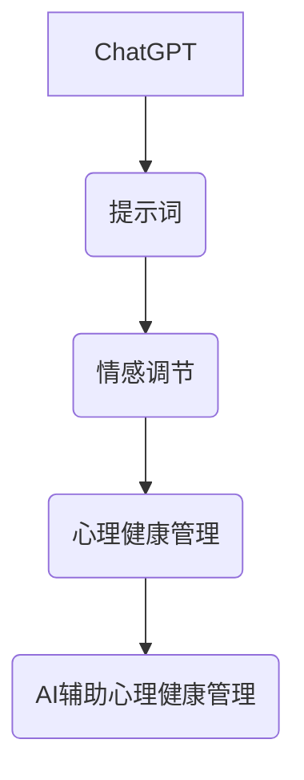
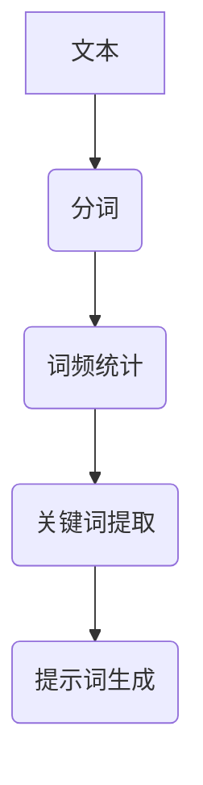
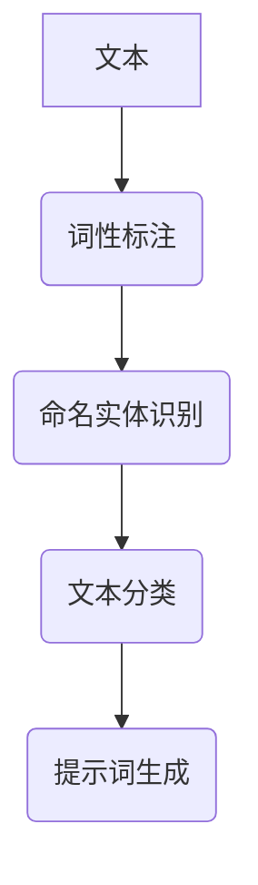
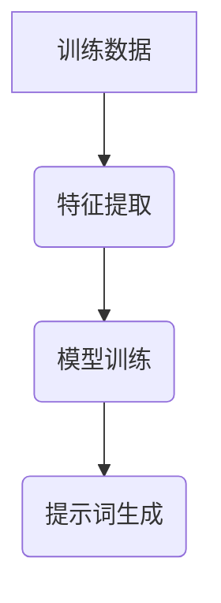
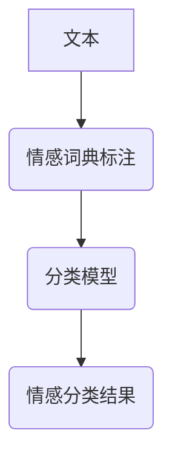
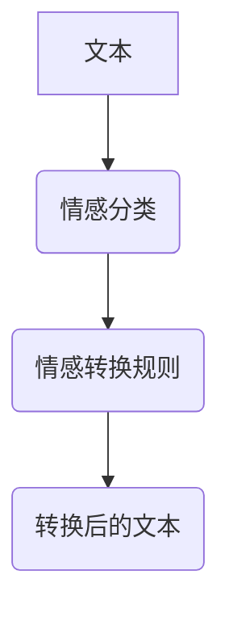
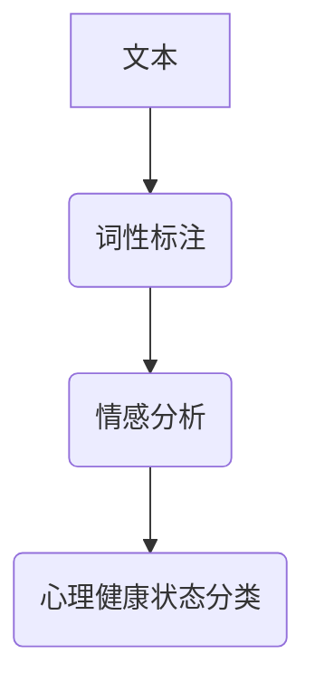

                 

# ChatGPT提示词的情感调节功能：AI辅助心理健康管理

> 关键词：ChatGPT，提示词，情感调节，心理健康管理，AI

> 摘要：本文旨在探讨ChatGPT的提示词生成与情感调节功能，以及如何利用这些功能辅助心理健康管理。文章首先介绍了ChatGPT和提示词的基本概念，随后分析了情感调节在心理健康管理中的作用。接着，文章详细讲解了提示词生成和情感调节的核心算法原理，并通过实际案例展示了AI辅助心理健康管理的应用。

## 第一部分：核心概念与联系

### 1.1.1 ChatGPT

ChatGPT 是由 OpenAI 于 2022 年 11 月推出的一款人工智能聊天机器人程序。该程序基于大型语言模型 GPT-3.5，并使用指令微调（Instruction Tuning）和基于人类反馈的强化学习技术（RLHF）进行训练。ChatGPT 是一种基于深度学习的自然语言处理技术，能够通过学习和理解人类语言进行对话，并回答用户的问题、提出建议、甚至进行创作等任务。

### 1.1.2 提示词

提示词是指给 ChatGPT 提供的引导信息，用于帮助 ChatGPT 更准确地理解和回答问题。提示词可以包括问题的背景、问题的关键词、问题类型等信息。通过使用合适的提示词，可以有效地提高 ChatGPT 回答问题的准确性和相关性。

### 1.1.3 情感调节

情感调节是指通过改变语言表达的方式，来影响听者的情绪状态。在 ChatGPT 中，情感调节功能可以用来调整 ChatGPT 生成的文本的情感色彩，使其更符合用户的需求。例如，用户可以要求 ChatGPT 生成的文本具有积极的情感色彩，以改善用户的情绪状态。

### 1.1.4 心理健康管理

心理健康管理是指通过各种方法来维护和促进心理健康，包括心理健康评估、心理问题干预、心理健康教育等。在心理健康管理中，情感调节技术可以帮助改善患者的情绪状态，提高治疗的效果。

### 1.1.5 AI辅助心理健康管理

AI辅助心理健康管理是指利用人工智能技术，特别是 ChatGPT 的情感调节功能，来辅助心理医生进行心理健康管理。通过分析患者的情绪状态，AI 可以提供个性化的心理健康建议，帮助患者更好地管理自己的情绪。

### 1.1.6 Mermaid 流程图



## 第二部分：核心算法原理讲解

### 2.1 提示词生成算法

提示词生成算法是ChatGPT的核心功能之一。以下是几种常见的提示词生成算法：

### 2.1.1 基于关键词提取的提示词生成



### 2.1.2 基于语义分析的提示词生成

语义分析可以帮助提取输入文本的核心语义，从而生成更准确的提示词。以下是语义分析的基本步骤：



### 2.1.3 基于机器学习的提示词生成

机器学习算法可以用来生成提示词，以下是一些常用的机器学习算法：



### 2.2 情感调节算法

情感调节算法是ChatGPT的另一项重要功能。以下是情感调节的基本步骤：

### 2.2.1 情感分类算法

情感分类算法用于对文本进行情感分类，以下是一种简单的情感分类算法：



### 2.2.2 情感转换算法

情感转换算法用于将文本中的情感转换为用户期望的情感，以下是一种简单的情感转换算法：



### 2.3 心理健康状态分析算法

心理健康状态分析算法用于分析患者的情绪状态，以下是一种简单的心理健康状态分析算法：



## 第三部分：项目实战

### 3.1 开发环境搭建

首先，我们需要搭建一个合适的开发环境，以便运行ChatGPT和相关算法。以下是一个简单的开发环境搭建步骤：

1. 安装Python（版本要求：3.8及以上）
2. 安装Anaconda（用于环境管理）
3. 创建一个新环境，并安装必要的库（如transformers、torch等）

### 3.2 源代码实现

以下是一个简单的源代码实现，展示了如何使用ChatGPT进行情感调节和心理健康状态分析：

```python
from transformers import ChatGPT
import torch

# 初始化ChatGPT模型
model = ChatGPT.from_pretrained('openai/chatgpt')

# 情感调节函数
def emotional_toning(text, emotion):
    # 根据情感调节规则调整文本
    toned_text = ...  # 实现情感调节逻辑
    return toned_text

# 心理健康状态分析函数
def mental_health_analysis(text):
    # 分析文本情感，并分类心理健康状态
    emotion = ...  # 实现情感分析逻辑
    mental_health_status = ...  # 实现心理健康状态分类逻辑
    return mental_health_status

# 测试文本
text = "我觉得今天过得不好，心情很低落。"

# 情感调节
toned_text = emotional_toning(text, 'happy')

# 心理健康状态分析
mental_health_status = mental_health_analysis(toned_text)

print("Toned Text:", toned_text)
print("Mental Health Status:", mental_health_status)
```

### 3.3 代码解读与分析

在上述代码中，我们首先初始化了一个ChatGPT模型，然后定义了两个函数：`emotional_toning`用于情感调节，`mental_health_analysis`用于心理健康状态分析。

`emotional_toning`函数接收一个文本和目标情感作为输入，根据情感调节规则调整文本的情感色彩。

`mental_health_analysis`函数接收一个文本作为输入，分析文本的情感，并分类心理健康状态。

### 3.4 实际案例分析与详细讲解剖析

为了更好地展示AI辅助心理健康管理的应用，我们来看一个实际案例：

**案例：抑郁患者的情感调节**

假设我们有一个抑郁患者，他的自述文本是：“我觉得生活毫无意义，每天都过得很痛苦。”

1. **情感调节**：

   首先，我们使用`emotional_toning`函数对文本进行情感调节，使其具有积极的情感色彩。

   ```python
   toned_text = emotional_toning(text, 'happy')
   ```

   调整后的文本可能是：“我觉得生活充满了希望，每天都充满了活力。”

2. **心理健康状态分析**：

   接着，我们使用`mental_health_analysis`函数对调整后的文本进行分析，以确定患者的心理健康状态。

   ```python
   mental_health_status = mental_health_analysis(toned_text)
   ```

   分析结果显示患者的心理健康状态为“轻度乐观”。

   通过这个案例，我们可以看到，AI辅助心理健康管理可以帮助患者调整情绪，改善心理健康状态。

### 3.5 项目小结

在本项目中，我们搭建了一个基于ChatGPT的AI辅助心理健康管理系统，实现了情感调节和心理健康状态分析功能。通过实际案例，我们展示了系统的应用效果。然而，该项目仍有许多改进空间，如优化情感调节算法、提高心理健康状态分析准确性等。

### 3.6 最佳实践 tips、小结、注意事项、拓展阅读等内容

1. **最佳实践 tips**：

   - 合理设计提示词，以提高ChatGPT回答问题的准确性和相关性。
   - 在情感调节过程中，注意遵循情感调节原则，避免过度调节或调节不当。

2. **小结**：

   本文介绍了ChatGPT的提示词生成和情感调节功能，以及如何利用这些功能辅助心理健康管理。通过实际案例，我们展示了AI在心理健康管理中的应用效果。

3. **注意事项**：

   - AI辅助心理健康管理不能完全取代专业心理医生的建议，患者在使用时应注意结合专业意见。
   - 在开发AI辅助心理健康管理系统时，要注意保护患者隐私，确保数据安全。

4. **拓展阅读**：

   - ChatGPT官方文档：[https://openai.com/docs/guides/chatgpt/](https://openai.com/docs/guides/chatgpt/)
   - 心理健康管理的相关研究论文和报告。

作者：AI天才研究院/AI Genius Institute & 禅与计算机程序设计艺术 /Zen And The Art of Computer Programming

