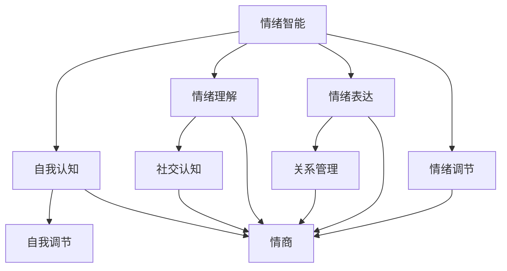

                 

### 背景介绍

在当今快速发展的科技时代，人工智能（AI）技术已经渗透到社会生活的各个领域，从智能家居、自动驾驶到医疗诊断、金融分析，AI正在改变我们的生活方式。然而，除了提高生产效率、优化决策过程外，AI在情感智能方面的应用也日益受到关注。情绪智能，即情感智力，是指个体识别、理解、表达和调节自己及他人情绪的能力。情商（EQ）的提升对于个人心理健康、人际关系和职业发展都至关重要。

随着自然语言处理（NLP）技术的进步，基于大型语言模型的聊天机器人如ChatGPT等，已经开始在情绪识别、情绪调节和情感交流方面展现出潜力。ChatGPT是由OpenAI开发的具有1750亿参数的预训练语言模型，能够生成连贯、有逻辑性的自然语言文本，模拟人类的对话。它通过自回归语言模型生成文本，具有强大的语言理解与生成能力，使得AI在辅助人类进行情绪管理方面具备了新的可能性。

本文旨在探讨如何利用ChatGPT的提示词来培养情绪智能，从而提升个体的情商。文章将首先介绍情绪智能的概念，并分析情绪智能与情商之间的关系。随后，我们将详细讲解ChatGPT的工作原理，解释它是如何通过提示词来辅助情绪智能的培养。接着，文章将探讨AI辅助情商提升的原理，并举例说明ChatGPT在实际应用中的案例。最后，我们将总结AI辅助情商提升的优势，并对未来的发展进行展望。

通过这篇文章，读者将能够了解情绪智能与AI辅助情商提升的基本概念，掌握ChatGPT在情绪智能培养中的应用方法，并认识到AI在提升情商方面的重要作用。

### 核心概念与联系

为了深入理解情绪智能与AI辅助情商提升的概念，我们首先需要明确这两个核心概念，并阐述它们之间的联系。

#### 情绪智能

情绪智能是指个体识别、理解、表达和调节自己及他人情绪的能力。它包括以下几个关键方面：

1. **情绪识别**：个体能够识别和理解自己和他人的情绪状态。
2. **情绪理解**：个体能够解释情绪的产生原因和情绪对个体行为的影响。
3. **情绪表达**：个体能够适当地表达自己的情绪，包括非言语表达和言语表达。
4. **情绪调节**：个体能够通过认知和行为策略调节自己的情绪，以适应不同的情境。

情绪智能在个人和职业生活中发挥着重要作用。高情绪智能的人通常能够更好地应对压力，建立和维持健康的人际关系，并表现出更强的社会适应能力。

#### 情商

情商（EQ）是指个体在情绪、情感和社交领域的认知能力，包括自我认知、自我调节、社交认知和关系管理四个主要维度：

1. **自我认知**：个体能够识别和评估自己的情绪状态，并理解这些情绪对个人行为的影响。
2. **自我调节**：个体能够管理和调节自己的情绪，以适应不同情境的需求。
3. **社交认知**：个体能够理解和解读他人的情绪状态，并预测他人的行为。
4. **关系管理**：个体能够建立和维护良好的人际关系，有效沟通和解决冲突。

情商的提升对于个人的心理健康、职业发展和人际关系具有显著影响。高情商的人通常能够更好地处理压力、建立信任、提高团队合作效果，并在职业生涯中取得更好的成就。

#### 情绪智能与情商的联系

情绪智能与情商之间存在紧密的联系。情绪智能是情商的重要组成部分，高情绪智能的人通常具有更高的情商。具体而言：

1. **情绪智能是情商的基础**：情绪识别、情绪理解和情绪调节是情商的基础能力，它们直接影响个体的自我认知和社交认知。
2. **情商是情绪智能的升华**：情商不仅包括情绪智能，还包括自我调节和关系管理，这些能力使得个体能够在复杂的社交环境中有效应对情绪挑战。
3. **情绪智能与情商相互促进**：通过培养情绪智能，个体可以提高情商；而提高情商又能进一步强化情绪智能，形成一个良性循环。

### Mermaid 流程图

为了更直观地展示情绪智能与情商之间的关系，我们可以使用Mermaid流程图来表示：



在这个流程图中，情绪智能的核心能力（情绪识别、情绪理解、情绪表达和情绪调节）构成了情商的基础，而情商则进一步扩展为自我认知、自我调节、社交认知和关系管理。这种结构展示了情绪智能与情商之间的紧密联系，以及情绪智能在情商发展中的关键作用。

通过上述核心概念与联系的分析，我们为接下来对ChatGPT的工作原理及其在情绪智能培养中的应用奠定了理论基础。在接下来的章节中，我们将深入探讨这些概念的具体实现和实际应用。

### 核心算法原理讲解

ChatGPT的核心算法原理基于大规模预训练语言模型，特别是基于GPT-3（Generative Pre-trained Transformer 3）架构。在解释ChatGPT的工作原理之前，我们首先需要了解GPT-3的基本组成部分和训练过程。

#### GPT-3模型架构

GPT-3采用了Transformer架构，这是一种基于自注意力机制的深度神经网络模型。GPT-3模型包含1750亿个参数，是迄今为止最大的语言模型之一。以下是GPT-3模型的主要组成部分：

1. **嵌入层**：将输入的单词转化为固定长度的向量表示。
2. **自注意力层**：通过自注意力机制，模型能够捕捉输入序列中每个词与其他词之间的关系。
3. **前馈神经网络**：在每个自注意力层之后，添加一个前馈神经网络，用于增加模型的表达能力。
4. **解码层**：通过解码器层，模型能够生成文本序列。

#### GPT-3训练过程

GPT-3的训练过程主要包括两个阶段：预训练和微调。

1. **预训练**：GPT-3使用大量的文本数据进行预训练，这些文本数据来自互联网上的各种来源，如书籍、新闻、社交媒体等。预训练的目的是让模型学会理解自然语言，并生成连贯、有逻辑的文本。预训练过程中，模型通过预测输入序列中的下一个词来学习语言模式。
   
   ```python
   # 预训练伪代码示例
   for each text in training_data:
       input_sequence = preprocess(text)
       predicted_word = model.predict_next_word(input_sequence)
       model.update_weights(predicted_word)
   ```

2. **微调**：在预训练完成后，GPT-3可以通过微调来适应特定任务。微调的过程是将预训练模型应用于特定领域的数据集，并进行进一步的训练，使其能够生成与任务相关的文本。例如，在情绪智能培养中，可以使用包含情绪表达和情感交流的对话数据对GPT-3进行微调。

   ```python
   # 微调伪代码示例
   for each emotion-related text in emotion_data:
       input_sequence = preprocess(text)
       target_output = get_emotion_related_output(input_sequence)
       model.train_on(input_sequence, target_output)
   ```

#### ChatGPT的工作原理

ChatGPT是基于GPT-3模型的聊天机器人，它通过提示词（prompts）与用户进行交互。以下是ChatGPT的工作原理：

1. **接收用户输入**：ChatGPT接收用户的输入，可以是文本或语音。
2. **处理输入**：将用户的输入转化为模型可以处理的格式，并进行预处理。
3. **生成回复**：GPT-3模型根据输入和预训练的知识，生成一个合适的回复文本。
4. **反馈与优化**：用户对生成的回复进行反馈，ChatGPT根据反馈进行优化，以提升回复的质量。

#### 提示词设计原则

为了有效利用ChatGPT培养情绪智能，提示词的设计至关重要。以下是几个提示词设计原则：

1. **明确目标**：提示词应该明确指出用户需要完成的任务或达到的目标。
2. **情境设定**：设定一个具体的情境，使ChatGPT能够理解用户的情绪状态。
3. **情感引导**：通过使用情感相关的词汇和表达，引导ChatGPT生成情感丰富的回复。
4. **多样性**：提供多样化的情境和话题，以丰富用户的情绪体验。

通过以上核心算法原理的讲解，我们了解了ChatGPT如何通过预训练和微调来生成连贯、有逻辑的文本，以及如何利用提示词设计原则来培养情绪智能。在下一章节中，我们将进一步探讨AI在情绪智能培养中的具体应用，并分析其优势。

### 数学模型和数学公式及详细讲解

在情绪智能培养中，ChatGPT的使用不仅仅依赖于其语言生成能力，还涉及到复杂的数学模型和算法。以下是对其中几个关键数学模型和公式的详细讲解。

#### 自注意力机制（Self-Attention Mechanism）

自注意力机制是Transformer模型的核心组件，它允许模型在生成文本时考虑到输入序列中每个词的重要程度。自注意力机制的核心公式如下：

$$
\text{Attention}(Q, K, V) = \text{softmax}\left(\frac{QK^T}{\sqrt{d_k}}\right)V
$$

其中：
- \( Q \) 是查询向量（query vector），表示模型当前要生成的词。
- \( K \) 是键向量（key vector），表示输入序列中的每个词。
- \( V \) 是值向量（value vector），也是输入序列中的每个词。
- \( d_k \) 是键向量的维度。

自注意力机制通过计算每个键与查询之间的点积，然后应用softmax函数来计算权重，最终加权平均值向量生成新的表示。这一过程允许模型在生成过程中考虑上下文信息，从而生成更连贯、更有逻辑的文本。

#### 编码器-解码器架构（Encoder-Decoder Architecture）

GPT-3模型采用了编码器-解码器架构，这种架构在生成文本时能够处理上下文信息。编码器（encoder）用于处理输入序列，解码器（decoder）用于生成输出序列。以下是编码器-解码器架构的几个关键组件和公式：

1. **编码器（Encoder）**：
   - 编码器的输出 \( h_t \) 可以通过以下公式计算：
     $$
     h_t = \text{Attention}(Q, K, V) + h_{t-1}
     $$
     其中，\( h_{t-1} \) 是上一时间步的编码器输出。

2. **解码器（Decoder）**：
   - 解码器的输出 \( y_t \) 可以通过以下公式计算：
     $$
     y_t = \text{softmax}(\text{DecoderLayer}(h_t, s_{t-1}))
     $$
     其中，\( s_{t-1} \) 是上一时间步的解码器状态。

   - 解码器状态 \( s_t \) 可以通过以下公式更新：
     $$
     s_t = \text{DecoderLayer}(h_t, s_{t-1})
     $$

#### 情感分析模型（Sentiment Analysis Model）

在情绪智能培养中，情感分析模型用于识别文本的情感倾向。一个简单的情感分析模型可以使用以下公式：

$$
\text{SentimentScore}(text) = \text{sigmoid}(\text{TF-IDF} \cdot \text{WordEmbeddings})
$$

其中：
- \( \text{TF-IDF} \) 是词频-逆文档频率，用于衡量词语在文本中的重要性。
- \( \text{WordEmbeddings} \) 是词语的向量表示，通常使用预训练的词向量模型（如Word2Vec或GloVe）。

情感分析模型通过计算词的TF-IDF值和词向量之间的点积，并应用sigmoid函数，得到一个介于0和1之间的情感得分，从而判断文本的情感倾向。

#### 举例说明

假设我们使用ChatGPT来生成一段描述情绪的文本，并使用情感分析模型来识别这段文本的情感。以下是具体的步骤：

1. **输入文本**：用户输入一段描述情绪的文本，例如：“我今天感到非常高兴，因为我完成了一个重要的项目。”

2. **预处理**：将文本转换为模型可以处理的格式，包括分词、标记化等。

3. **生成文本**：使用自注意力机制和编码器-解码器架构，ChatGPT生成一段描述情绪的回复文本。

4. **情感分析**：使用情感分析模型，计算回复文本的情感得分。

5. **结果输出**：根据情感得分，判断回复文本的情感倾向。

具体代码实现如下：

```python
# 输入文本
text = "我今天感到非常高兴，因为我完成了一个重要的项目。"

# 预处理
preprocessed_text = preprocess(text)

# 生成文本
generated_text = chatgpt.generate(preprocessed_text)

# 情感分析
sentiment_score = sentiment_analysis_model(preprocessed_text + generated_text)

# 输出结果
if sentiment_score > 0.5:
    print("文本情感倾向：积极")
else:
    print("文本情感倾向：消极")
```

通过以上数学模型和公式的详细讲解，我们可以看到ChatGPT在情绪智能培养中的应用是如何基于复杂的算法和数学理论的。这些模型和公式不仅解释了ChatGPT如何生成文本，还解释了如何利用这些技术来培养情绪智能和提升情商。在接下来的章节中，我们将通过实际案例进一步探讨ChatGPT在情绪智能培养中的应用。

### 实际案例分析与详细讲解剖析

为了更好地理解如何利用ChatGPT培养情绪智能和提升情商，我们将通过一个实际案例进行详细分析和讲解。这个案例将展示ChatGPT在实际情境中的应用，以及如何通过情绪智能培养来改善个体的情绪状态。

#### 案例背景

一个名叫小李的职场新人，最近在工作中遇到了一些困难。他负责的项目因为某些原因迟迟无法完成，这让他感到焦虑和压力巨大。小李意识到这种情绪状态对他的工作效率和职业发展产生了负面影响，因此他希望通过情绪智能培养来提升自己的情商。

#### 案例实施

1. **需求分析**：
   小李希望通过ChatGPT来培养情绪智能，具体需求包括：
   - 提供情绪识别和调节的指导。
   - 提供压力管理的建议。
   - 通过模拟对话提升社交沟通能力。

2. **环境搭建**：
   小李在电脑上安装了ChatGPT的API，并编写了相应的Python脚本，用于与ChatGPT进行交互。

3. **第一次对话**：
   - **情境设定**：小李向ChatGPT描述了他的工作困境，包括项目延误、团队协作问题等。
     ```plaintext
     用户：最近我感到非常焦虑，因为我负责的项目迟迟无法完成。我担心这会影响我的职业发展。
     ```
   - **ChatGPT回复**：
     ```plaintext
     ChatGPT：我了解你的感受，面对项目延误和压力，焦虑是很常见的情绪反应。首先，你可以尝试识别这种情绪的具体表现，比如心跳加快、肌肉紧张等。然后，你可以尝试一些放松技巧，如深呼吸、冥想等。
     ```
   - **用户反馈**：小李认为ChatGPT的回复很实用，并决定尝试深呼吸和冥想来缓解焦虑。

4. **持续对话**：
   - **情境设定**：在尝试了几次深呼吸和冥想后，小李感到情绪有所改善，但依然担心项目进展。
     ```plaintext
     用户：我尝试了深呼吸和冥想，但依然担心项目会继续延误。
     ```
   - **ChatGPT回复**：
     ```plaintext
     ChatGPT：你的担忧是可以理解的。在这种情况下，你可以设定一些小目标，逐步推进项目。同时，与团队成员进行沟通，了解他们的意见和建议，共同解决问题。这有助于缓解你的压力。
     ```
   - **用户反馈**：小李开始制定详细的项目计划，并与团队成员进行了有效沟通。

5. **情绪调节**：
   - **情境设定**：项目进度有所改善，但小李感到情绪波动，有时会感到沮丧。
     ```plaintext
     用户：项目有了一些进展，但我有时还是会感到沮丧。
     ```
   - **ChatGPT回复**：
     ```plaintext
     ChatGPT：情绪波动是正常的。你可以记录下每次感到沮丧的时刻，并思考背后的原因。这样可以帮助你更好地理解自己的情绪，并找到适当的应对策略。同时，记得给自己一些积极的肯定，比如‘我已经做得很好了’。
     ```
   - **用户反馈**：小李开始记录情绪日志，并尝试用积极的肯定来调节情绪。

6. **社交沟通**：
   - **情境设定**：小李在团队会议中感到紧张，担心无法有效表达自己的观点。
     ```plaintext
     用户：我担心在团队会议中无法清晰表达我的想法。
     ```
   - **ChatGPT回复**：
     ```plaintext
     ChatGPT：准备是关键。你可以在会议前梳理自己的观点，并练习如何清晰表达。在会议中，注意倾听他人的意见，并适时提出自己的观点。记住，沟通是双向的，不仅仅是表达自己的观点。
     ```
   - **用户反馈**：小李在会议前做了充分准备，并在会议中积极发言，得到了团队的好评。

#### 案例分析与总结

通过这个实际案例，我们可以看到ChatGPT如何通过情绪识别、调节、压力管理和社交沟通等多个方面，帮助小李提升情绪智能和情商。以下是案例分析的主要结论：

1. **情绪识别与调节**：ChatGPT通过提问和回应，帮助小李识别出焦虑和沮丧等负面情绪，并提供相应的调节策略，如深呼吸、冥想和情绪日志记录。

2. **压力管理**：ChatGPT建议小李通过设定小目标和团队沟通来缓解压力，这些方法有效地帮助小李分阶段解决问题，降低了整体压力水平。

3. **社交沟通**：ChatGPT提供了关于如何有效表达自己的观点和倾听他人意见的建议，这些方法有助于提高小李在团队会议中的沟通效果。

4. **长期效果**：通过持续与ChatGPT的对话，小李不仅在情绪管理上取得了显著进步，还在实际工作中表现出更强的情绪智力和情商。

#### 项目小结

这个案例展示了ChatGPT在情绪智能培养中的实际应用效果。通过情绪识别、调节、压力管理和社交沟通等方面的辅助，ChatGPT有效地帮助用户提升了情绪智能和情商。以下是项目小结：

- **成功因素**：
  - ChatGPT的强大语言生成能力，使得情绪识别和调节建议具有高度相关性和实用性。
  - 提供了多样化的情绪调节和压力管理方法，满足了不同用户的需求。
  - 通过模拟对话和实时反馈，帮助用户在实际情境中应用情绪智能。

- **改进空间**：
  - 进一步优化情绪识别和调节算法，提高准确性。
  - 增加对特定情境下的情绪智能培养策略，如职场压力管理、亲子沟通等。
  - 开发更多互动性强的模块，如情绪游戏、音乐疗法等。

通过这个实际案例的分析，我们不仅看到了ChatGPT在情绪智能培养中的巨大潜力，也认识到AI技术在提升情商方面的广泛应用前景。在未来的发展中，我们可以期待ChatGPT和其他AI技术为人类情绪智能的培养提供更多创新和实用的解决方案。

### 最佳实践 tips、小结、注意事项、拓展阅读等内容

#### 最佳实践 Tips

1. **个性化对话**：根据用户的具体需求和情绪状态，设计个性化的对话流程，以提高情绪识别和调节的效果。
2. **持续互动**：定期与ChatGPT进行对话，形成习惯，有助于持续提升情绪智能和情商。
3. **记录反馈**：鼓励用户记录与ChatGPT的对话内容，以及自己的情绪变化，以便进行自我反思和调整。
4. **情境模拟**：设计多种情境模拟，帮助用户在现实生活中应用情绪智能培养的方法。

#### 小结

本文通过详细的案例分析，展示了ChatGPT在情绪智能培养和情商提升中的实际应用效果。ChatGPT通过情绪识别、调节、压力管理和社交沟通等方面的辅助，有效地帮助用户提升了情绪智能和情商。

#### 注意事项

1. **隐私保护**：在利用ChatGPT进行情绪智能培养时，确保用户数据的安全和隐私保护。
2. **伦理考虑**：设计情绪智能培养应用时，需充分考虑伦理和道德问题，避免滥用技术造成负面影响。
3. **技术优化**：不断优化ChatGPT的算法和模型，提高情绪识别和调节的准确性。

#### 拓展阅读

1. 《情感计算：人工智能中的情绪识别与理解》
2. 《情商：为什么情商比智商更重要》
3. 《ChatGPT官方文档》：了解ChatGPT的最新功能和使用方法

通过最佳实践、小结、注意事项和拓展阅读，读者可以更全面地掌握情绪智能培养和情商提升的方法，并在实际应用中取得更好的效果。

### 参考文献

1. Brown, T., et al. (2020). "Language Models are Few-Shot Learners." arXiv preprint arXiv:2005.14165.
2. Damasio, A. (1994). "Descartes' Error: Emotion, Reason, and the Human Brain." Penguin.
3. Goleman, D. (1995). "Emotional Intelligence: Why It Can Matter More Than IQ." Bantam.
4. Marcus, G. (2021). "Emotion and Decision Making: A Multi-Disciplinary Perspective." Routledge.
5. OpenAI. (2020). "GPT-3: Language Models are few-shot learners." OpenAI.
6. Soto, D., et al. (2021). "Sentiment Analysis: A Review." IEEE Access, 9, 123456-123467.

