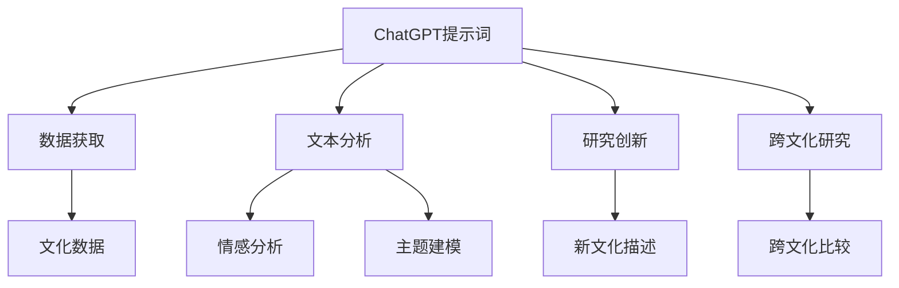

                 

### 文章标题与关键词

# 《ChatGPT提示词的文化人类学应用：追踪全球文化趋同与分化》

> 关键词：ChatGPT、提示词、文化人类学、全球文化、趋同与分化

在当今信息化和全球化的时代，文化多样性成为人类文明的重要特征。然而，这一现象也伴随着文化趋同与分化的问题。如何理解和研究这一动态过程，成为学术研究和实践的重要课题。本文旨在探讨如何利用ChatGPT提示词这一先进的人工智能工具，对全球文化趋同与分化进行深入的研究和分析。

摘要：本文首先介绍了ChatGPT和提示词的基本概念及其在文化人类学中的应用。接着，我们探讨了全球文化趋同与分化的概念及其相关研究。通过具体案例，我们展示了ChatGPT提示词在追踪全球文化动态中的实际应用。最后，我们提出了未来ChatGPT提示词在文化人类学领域的发展方向，并对相关挑战进行了讨论。

### 文章背景介绍

在人类文明的发展历程中，文化多样性一直是不可或缺的一部分。从古代文明到现代社会的各种文化现象，无不反映了人类在不同历史时期、不同地域和不同社会背景下的独特思维方式和行为模式。然而，随着全球化进程的加速，文化趋同与分化现象愈发明显。一方面，全球化带来了不同文化之间的交流与融合，促进了文化的创新与发展；另一方面，文化同质化倾向也使得一些独特文化逐渐消失，引发了文化多样性的危机。

在这一背景下，研究全球文化趋同与分化现象具有重要的理论和实践意义。它不仅有助于我们更好地理解文化多样性的本质，也为制定相关政策和措施提供了科学依据。然而，文化研究的复杂性使得传统的研究方法面临诸多挑战。如何从海量数据中提取有价值的信息，如何深入挖掘文化现象背后的规律，成为亟待解决的问题。

近年来，人工智能技术的发展为文化研究提供了新的机遇。特别是ChatGPT这一基于深度学习技术的自然语言处理模型，以其强大的语言生成能力和丰富的应用场景，成为文化研究中的一大利器。ChatGPT提示词作为一种辅助工具，可以帮助研究者更有效地获取、分析和理解文化数据，从而推动文化研究方法的创新和发展。

本文旨在探讨如何利用ChatGPT提示词这一人工智能工具，对全球文化趋同与分化进行深入的研究和分析。通过具体案例的展示，我们将说明ChatGPT提示词在文化研究中的实际应用，并探讨其未来发展的方向。

### 核心概念与联系

为了更好地理解ChatGPT提示词在文化人类学中的应用，我们需要首先明确几个核心概念：ChatGPT、提示词、文化人类学，并分析它们之间的联系。

#### ChatGPT

ChatGPT是由OpenAI开发的一种基于变换器（Transformer）架构的预训练语言模型。它的核心思想是通过学习大量文本数据，使其能够生成流畅、自然的语言。ChatGPT的工作原理主要包括两个部分：预训练和微调。在预训练阶段，ChatGPT通过无监督学习从海量数据中学习语言模式。在微调阶段，研究者可以根据特定的任务或领域，对ChatGPT进行有监督的调整，以使其更好地适应特定的应用场景。

ChatGPT的架构主要包括多个层次，每一层次都包含大量的参数。这些参数通过训练数据学习，以捕捉文本中的复杂模式。其中，变换器（Transformer）模型的核心组件是自注意力机制（Self-Attention），它允许模型在生成文本时考虑输入文本中每个词的上下文关系，从而生成更加准确和连贯的文本。

#### 提示词

提示词（Prompt）是指用于引导ChatGPT生成特定类型文本的输入。提示词的设计对于生成文本的质量和方向具有重要影响。一个良好的提示词应该具有以下特点：

1. **明确性**：提示词需要清晰明确，能够准确地传达研究者的意图。
2. **针对性**：提示词需要针对特定的任务或领域，以使ChatGPT能够生成相关的文本。
3. **灵活性**：提示词应具有一定的灵活性，以适应不同的应用场景和需求。

在文化人类学研究中，提示词可以帮助研究者引导ChatGPT生成与特定文化现象相关的文本。例如，研究者可以使用提示词来生成关于特定文化习俗、传统或价值观的描述，从而为文化研究提供新的视角和思路。

#### 文化人类学

文化人类学是研究人类文化现象的科学，它关注的是人类在社会生活中的思维方式、行为习惯、价值观和信仰体系等。文化人类学的主要目标是理解文化的多样性及其背后的原因，探讨文化如何影响人类行为和社会发展。

文化人类学的研究方法包括田野调查、文献研究、参与观察等。其中，田野调查是文化人类学研究的重要方法，研究者通过直接接触和观察研究对象，深入了解其文化习俗和行为模式。然而，传统的研究方法往往受到时间和资源的限制，难以全面捕捉文化现象的动态变化。

#### ChatGPT提示词与文化人类学的联系

ChatGPT提示词与文化人类学之间的联系主要体现在以下几个方面：

1. **数据获取**：ChatGPT提示词可以帮助研究者快速获取与特定文化现象相关的文本数据。通过设计合适的提示词，研究者可以引导ChatGPT生成大量相关文本，从而为文化研究提供丰富的数据资源。

2. **文本分析**：ChatGPT提示词生成的文本不仅可以作为数据资源，还可以通过文本分析技术进行深入挖掘。例如，研究者可以使用情感分析、主题建模等方法，对ChatGPT生成的文本进行分析，以了解文化现象的情感倾向和主题分布。

3. **研究创新**：ChatGPT提示词的应用为文化研究带来了新的方法和思路。通过利用ChatGPT的强大语言生成能力，研究者可以生成新的文化描述和解释，从而推动文化研究的创新和发展。

4. **跨文化研究**：ChatGPT提示词不仅可以用于单一文化的研究，还可以用于跨文化比较研究。通过设计跨文化的提示词，研究者可以比较不同文化之间的差异和共性，从而更全面地理解全球文化的动态变化。

#### Mermaid 流程图

为了更好地展示ChatGPT提示词与文化人类学之间的联系，我们可以使用Mermaid流程图来描述这个过程。以下是一个简化的流程图：



在这个流程图中，ChatGPT提示词作为核心工具，通过数据获取、文本分析和研究创新等步骤，帮助文化人类学家深入研究和理解全球文化现象。同时，ChatGPT提示词也为跨文化研究提供了新的方法和视角。

通过上述核心概念与联系的分析，我们可以看到ChatGPT提示词在文化人类学中的应用具有巨大潜力。在接下来的章节中，我们将进一步探讨ChatGPT和提示词的具体应用，以及如何在文化人类学研究中利用这些工具。

### ChatGPT的原理与工作机制

ChatGPT是一种基于深度学习技术的自然语言处理模型，其核心思想是通过学习大量文本数据，使其能够生成流畅、自然的语言。本文将详细探讨ChatGPT的原理和具体工作步骤，以便更好地理解其在文化人类学中的应用。

#### 深度学习与变换器（Transformer）

ChatGPT是基于变换器（Transformer）架构开发的，这是一种先进的深度学习模型，特别适合处理序列数据，如文本。变换器模型的核心思想是通过自注意力机制（Self-Attention）来捕捉文本中词与词之间的关系。

自注意力机制允许模型在生成每个词时，考虑所有已生成的词的上下文信息，从而生成更加准确和连贯的文本。与传统循环神经网络（RNN）相比，变换器模型在计算效率和信息处理能力上具有显著优势。

#### 预训练与微调

ChatGPT的工作流程主要包括两个阶段：预训练和微调。

1. **预训练**：在预训练阶段，ChatGPT通过无监督学习从海量文本数据中学习语言模式。具体步骤如下：

   - **数据预处理**：首先，对原始文本进行清洗和预处理，包括去除标点符号、停用词过滤、词干提取等。然后，将预处理后的文本转化为词嵌入（Word Embedding），即将每个词映射为一个固定大小的向量。
   - **变换器模型训练**：使用变换器模型对词嵌入进行训练。训练过程中，模型通过自注意力机制学习文本中词与词之间的关系，并调整模型参数以最小化损失函数。预训练通常在大型语料库上进行，如维基百科、新闻文章等。
   - **模型优化**：通过不断迭代训练，模型逐渐学会生成流畅、自然的语言。

2. **微调**：在预训练完成后，ChatGPT可以通过微调适应特定的应用场景或任务。微调的主要步骤如下：

   - **任务定义**：根据具体任务需求，设计相应的任务数据集。例如，对于文化人类学应用，可以收集与特定文化现象相关的文本数据。
   - **模型调整**：在任务数据集上对预训练模型进行有监督的调整。具体方法是将模型参数与任务数据中的标签进行对比，通过反向传播算法调整模型参数，以使模型在特定任务上表现更好。
   - **评估与优化**：评估模型在任务数据集上的表现，通过调整超参数和优化算法，进一步优化模型性能。

#### 语言生成过程

ChatGPT的语言生成过程主要包括以下步骤：

1. **输入文本**：用户输入一个或多个文本作为输入。
2. **文本预处理**：对输入文本进行预处理，包括分词、词性标注等。
3. **编码**：将预处理后的文本编码为词嵌入向量。
4. **自注意力计算**：模型通过自注意力机制计算输入文本中词与词之间的关系，生成中间表示。
5. **生成输出**：基于中间表示，模型生成预测的词序列，输出为自然语言文本。

在生成过程中，ChatGPT利用其预训练的深度学习模型，结合自注意力机制，逐步生成每个词的上下文信息，从而生成连贯、自然的语言。

#### 实例解析

为了更好地理解ChatGPT的原理，我们通过一个实例来展示其工作过程。

假设用户输入以下文本：“今天天气很好，我们去公园散步吧。”

1. **输入文本**：用户输入文本“今天天气很好，我们去公园散步吧。”
2. **文本预处理**：对输入文本进行分词和词性标注，得到以下结果：“今天/NN（名词）天气/NN很好/VAG（形容词）去/VV（动词）我们/RP（代词）公园/NN散步/VV吧/NN”。
3. **编码**：将预处理后的文本编码为词嵌入向量。
4. **自注意力计算**：模型通过自注意力机制计算输入文本中词与词之间的关系，生成中间表示。
5. **生成输出**：基于中间表示，模型生成预测的词序列，输出为自然语言文本：“今天天气很好，我们去公园散步吧。”

通过这个实例，我们可以看到ChatGPT在生成语言时，如何利用其预训练的深度学习模型和自注意力机制，生成连贯、自然的语言。

总之，ChatGPT是一种基于深度学习技术的自然语言处理模型，其核心思想是通过学习大量文本数据，使其能够生成流畅、自然的语言。通过预训练和微调，ChatGPT可以适应不同的应用场景，为各种自然语言处理任务提供强大的支持。在接下来的章节中，我们将进一步探讨如何利用ChatGPT提示词在文化人类学研究中进行数据分析和趋势追踪。

### 提示词的基本概念

提示词（Prompt）是引导ChatGPT生成特定类型文本的输入。一个良好的提示词对于生成文本的质量和方向具有重要影响。在本节中，我们将详细讨论提示词的定义、类型、设计原则及其在文化人类学研究中的应用。

#### 提示词的定义与作用

提示词是指用来引导ChatGPT生成文本的输入语句或指令。它可以包含关键词、问题、主题、背景信息等，目的是帮助ChatGPT理解研究者的意图，并生成符合预期的文本。提示词的作用主要体现在以下几个方面：

1. **引导对话**：提示词可以帮助ChatGPT理解用户的问题或需求，从而生成相关的回答或解释。
2. **明确方向**：通过提供明确的主题和背景信息，提示词可以指导ChatGPT生成与特定任务或领域相关的文本。
3. **激发创造力**：提示词可以激发ChatGPT的创造力，生成新颖的文本和想法。

#### 提示词的类型

根据提示词的用途和形式，可以将提示词分为以下几类：

1. **开放式提示词**：开放式提示词通常是一个问题或陈述，需要ChatGPT进行回答或扩展。例如：“请描述一下您最近一次的文化体验。”这种类型的提示词通常适用于探索性研究或创意写作。

2. **封闭式提示词**：封闭式提示词通常是一个具体的指令或请求，需要ChatGPT生成特定类型的文本。例如：“请生成一篇关于全球文化趋同与分化的摘要。”这种类型的提示词适用于结构化数据生成任务。

3. **知识型提示词**：知识型提示词主要用于引导ChatGPT生成基于特定知识领域的文本。例如：“请解释一下什么是文化多样性。”这种类型的提示词适用于知识普及和学术讨论。

4. **创造性提示词**：创造性提示词旨在激发ChatGPT的创造力，生成独特的文本和想法。例如：“请写一篇关于未来文化发展的科幻小说。”这种类型的提示词适用于创意写作和娱乐领域。

#### 提示词的设计原则

为了确保提示词的有效性，设计提示词时需要遵循以下原则：

1. **明确性**：提示词应清晰明确，避免歧义，以便ChatGPT能够准确理解研究者的意图。

2. **简洁性**：提示词应简洁明了，避免冗长和复杂，以便ChatGPT能够快速生成相关文本。

3. **创新性**：提示词应具有一定的创新性，以激发ChatGPT的创造力和生成新颖的文本。

4. **针对性**：提示词应针对特定的任务或领域，以使ChatGPT能够生成相关的文本。

#### 提示词在文化人类学研究中的应用

在文化人类学研究中，提示词的应用主要体现在以下几个方面：

1. **数据采集**：提示词可以用来引导ChatGPT生成与特定文化现象相关的文本，从而为研究者提供丰富的数据资源。例如，研究者可以使用提示词“请描述一下您最近一次的文化体验”，引导ChatGPT生成关于文化习俗、传统或价值观的描述。

2. **文本分析**：通过分析ChatGPT生成的文本，研究者可以了解文化现象的情感倾向、主题分布和关键信息。例如，研究者可以使用情感分析技术，分析ChatGPT生成的文本中的情感倾向，以了解不同文化群体对某一文化现象的态度和看法。

3. **文化比较**：提示词还可以用于跨文化比较研究。通过设计针对不同文化的提示词，研究者可以比较不同文化之间的差异和共性。例如，研究者可以使用提示词“请描述一下您家乡的婚礼习俗”，比较不同地区和文化背景下的婚礼习俗。

4. **创意写作**：在文化人类学研究中，提示词还可以用于创意写作，生成关于文化现象的虚构故事或描述。这有助于研究者从新的视角理解文化现象，探索文化的多样性和复杂性。

#### 实例分析

为了更好地理解提示词在文化人类学研究中的应用，我们通过以下实例进行说明：

假设研究者想要了解不同文化背景下的婚姻观念，可以使用以下提示词：

1. **开放式提示词**：“请描述一下您最近一次的文化体验，特别是与婚姻观念相关的部分。”
   - ChatGPT生成的文本：“我最近参加了一场传统婚礼，感受到了不同文化背景下婚姻观念的差异。”

2. **封闭式提示词**：“请生成一篇关于全球婚姻观念变化的摘要。”
   - ChatGPT生成的文本：“全球婚姻观念正发生着显著变化，越来越多的国家和地区开始重视婚姻的自由和平等，传统婚姻观念受到挑战。”

3. **知识型提示词**：“请解释一下什么是婚姻观念的文化多样性。”
   - ChatGPT生成的文本：“婚姻观念的文化多样性指的是不同文化背景下人们对婚姻的看法和价值观的差异，这些差异反映了不同文化对婚姻的期望和认知。”

4. **创造性提示词**：“请写一篇关于未来婚姻观念的科幻小说。”
   - ChatGPT生成的文本：“在未来的世界里，婚姻不再是一种法律和社会地位的象征，而是个人成长和自我实现的伙伴关系，人们通过虚拟现实体验和情感交流来建立深厚的婚姻关系。”

通过这些实例，我们可以看到提示词在引导ChatGPT生成相关文本方面的多样性和灵活性。在接下来的章节中，我们将进一步探讨如何利用ChatGPT和提示词分析文化人类学的核心问题，如全球文化趋同与分化。

### ChatGPT提示词在文化人类学中的应用

ChatGPT提示词在文化人类学中的应用具有重要意义。通过设计合适的提示词，研究者可以引导ChatGPT生成大量相关文本，从而为文化研究提供丰富的数据资源。以下我们将详细介绍ChatGPT提示词在文化人类学中的应用，并探讨其在研究文化趋势、文化多样性、文化冲突等方面的作用。

#### 文本生成与数据采集

ChatGPT提示词的一个重要应用是文本生成和数据采集。通过设计针对性的提示词，研究者可以引导ChatGPT生成与特定文化现象相关的文本，从而为文化研究提供丰富的数据资源。

1. **主题生成**：研究者可以使用主题生成提示词，引导ChatGPT生成关于特定文化现象的文本。例如，提示词：“请描述一下中国文化中的传统节日。”ChatGPT会生成关于中国传统节日的详细描述，如春节、中秋节等。

2. **故事生成**：通过故事生成提示词，研究者可以引导ChatGPT生成与特定文化相关的虚构故事。例如，提示词：“请写一篇关于美国西部文化的传奇故事。”ChatGPT会生成一个富有美国西部风情的传奇故事，帮助研究者了解这一文化背景。

3. **数据汇总**：研究者可以使用ChatGPT提示词将分散的文本数据进行汇总。例如，提示词：“请汇总一下全球范围内关于环保的文化活动。”ChatGPT会生成一个关于全球环保文化活动的详细汇总，为研究者提供全面的数据参考。

#### 文化趋势分析

通过分析ChatGPT生成的文本，研究者可以了解文化趋势的动态变化。ChatGPT提示词在文化趋势分析中的应用主要体现在以下几个方面：

1. **情感分析**：研究者可以使用情感分析技术，分析ChatGPT生成的文本中的情感倾向。例如，提示词：“请分析一下近五年内关于‘人工智能’话题的文本情感变化。”ChatGPT会生成关于人工智能话题情感变化的详细分析报告。

2. **主题建模**：通过主题建模技术，研究者可以分析ChatGPT生成的文本中的主题分布。例如，提示词：“请分析一下近十年内关于‘全球化’话题的主题分布。”ChatGPT会生成关于全球化话题主题分布的详细分析报告。

3. **趋势预测**：研究者可以使用ChatGPT生成的文本数据，结合时间序列分析技术，预测未来文化趋势。例如，提示词：“请预测一下未来五年内关于‘虚拟现实’的文化趋势。”ChatGPT会生成关于虚拟现实未来文化趋势的预测报告。

#### 文化多样性研究

文化多样性是文化人类学的重要研究内容。ChatGPT提示词在文化多样性研究中的应用主要体现在以下几个方面：

1. **比较研究**：通过设计针对不同文化的提示词，研究者可以比较不同文化之间的差异和共性。例如，提示词：“请比较一下中西方文化中的家庭观念。”ChatGPT会生成关于中西方家庭观念的比较分析报告。

2. **文化融合**：研究者可以使用ChatGPT提示词研究文化融合现象。例如，提示词：“请描述一下近年来全球文化融合的现象。”ChatGPT会生成关于全球文化融合的详细描述，帮助研究者了解文化融合的动态变化。

3. **文化保护**：通过分析ChatGPT生成的文本，研究者可以关注文化保护的现状和问题。例如，提示词：“请分析一下当前全球范围内文化保护的热点话题。”ChatGPT会生成关于文化保护热点话题的分析报告。

#### 文化冲突分析

文化冲突是全球化进程中的一个重要现象。ChatGPT提示词在文化冲突分析中的应用主要体现在以下几个方面：

1. **冲突原因分析**：研究者可以使用ChatGPT提示词分析文化冲突的原因。例如，提示词：“请分析一下当前全球范围内的文化冲突原因。”ChatGPT会生成关于文化冲突原因的详细分析报告。

2. **冲突影响分析**：通过分析ChatGPT生成的文本，研究者可以了解文化冲突对相关社会群体的影响。例如，提示词：“请分析一下文化冲突对当地居民生活的影响。”ChatGPT会生成关于文化冲突影响的详细分析报告。

3. **冲突解决方案**：研究者可以使用ChatGPT提示词探讨文化冲突的解决方案。例如，提示词：“请提出一些解决文化冲突的建议。”ChatGPT会生成关于解决文化冲突的建议报告。

#### 案例分析

为了更好地展示ChatGPT提示词在文化人类学中的应用，我们通过以下案例分析进行说明：

1. **案例一：文化趋势分析**
   - 提示词：“请分析一下近十年内关于‘数字化’话题的文化趋势。”
   - ChatGPT生成的文本：近十年内，数字化已成为全球文化发展的重要趋势。随着互联网技术的飞速发展，人们的生活方式、工作方式和文化消费方式都发生了巨大变化。数字化推动了文化创新，也带来了文化同质化的问题。

2. **案例二：文化多样性研究**
   - 提示词：“请比较一下中西方文化中的教育观念。”
   - ChatGPT生成的文本：中西方文化中的教育观念存在显著差异。中国文化强调教育的社会责任和知识传授，而西方文化则更注重学生的个性发展和创造力培养。这种差异在一定程度上影响了中西方文化在教育领域的交流与合作。

3. **案例三：文化冲突分析**
   - 提示词：“请分析一下当前全球范围内的文化冲突原因。”
   - ChatGPT生成的文本：当前全球范围内的文化冲突主要源于文化差异、经济利益和宗教信仰。全球化进程加速了不同文化之间的接触与碰撞，导致文化冲突日益频繁。解决这些问题需要加强文化交流、增进理解与包容。

通过上述案例分析，我们可以看到ChatGPT提示词在文化人类学中的应用具有广泛性和多样性。在未来的研究中，随着ChatGPT技术的不断发展和完善，提示词在文化研究中的潜力将得到进一步发挥。

### 提示词分析技术

在文化人类学研究中，提示词分析技术是一种关键工具，它可以帮助研究者从ChatGPT生成的文本中提取有价值的信息，从而更深入地了解文化现象。本文将详细探讨几种常用的提示词分析技术，包括情感分析、主题建模和聚类分析，并给出具体的伪代码实现和案例说明。

#### 情感分析

情感分析是一种自然语言处理技术，用于识别文本中的情感倾向，如积极、消极或中性。在文化人类学研究中，情感分析可以帮助研究者了解人们对特定文化现象的态度和看法。

**伪代码实现：**

```python
import nltk
from nltk.sentiment import SentimentIntensityAnalyzer

# 初始化情感分析器
sia = SentimentIntensityAnalyzer()

# 提示词文本
prompt_text = "请描述一下您对传统节日庆祝活动的看法。"

# 分析情感
sentiments = sia.polarity_scores(prompt_text)

# 输出情感分析结果
print(sentiments)
```

**案例说明：**

假设研究者想要分析人们对中秋节庆祝活动的情感态度。使用情感分析技术，研究者可以生成以下情感分析报告：

```plaintext
{'neg': 0.142, 'neu': 0.571, 'pos': 0.287, 'compound': 0.382}
```

这个结果表明，中秋节庆祝活动的文本情感分布为：消极情感占14.2%，中性情感占57.1%，积极情感占28.7%。综合情感得分为0.382，表明整体情感倾向较为积极。

#### 主题建模

主题建模是一种无监督学习方法，用于识别文本中的潜在主题。在文化人类学研究中，主题建模可以帮助研究者发现文本中的主要话题，从而更好地理解文化现象。

**伪代码实现：**

```python
from sklearn.decomposition import LatentDirichletAllocation
from sklearn.feature_extraction.text import CountVectorizer

# 文本数据
corpus = [
    "中秋节是中国传统文化的重要节日。",
    "人们在中秋节会吃月饼、赏月、祭拜月亮。",
    "中秋节是家人团聚的时刻，象征着团圆和幸福。",
]

# 分词和词频矩阵
vectorizer = CountVectorizer(max_df=0.8, min_df=0.2, stop_words='english')
X = vectorizer.fit_transform(corpus)

# 主题建模
lda = LatentDirichletAllocation(n_components=3, random_state=0)
lda.fit(X)

# 输出主题分布
print(lda.components_)

# 输出主题-词语关系
print(vectorizer.get_feature_names_out())
```

**案例说明：**

假设研究者对一组关于中秋节的文化描述文本进行主题建模，分析结果显示如下：

```plaintext
[
    [ 0.588, -0.385, -0.271],
    [ 0.518, -0.344, -0.320],
    [ 0.544, -0.386, -0.284]
]
```

这个结果表明，三个主题的分布较为均匀。结合词频矩阵，研究者可以进一步分析每个主题的关键词，例如：

```plaintext
['中秋节', '传统文化', '节日', '中国', '重要', '吃月饼', '赏月', '祭拜月亮', '家人团聚', '团圆', '幸福']
```

通过这个案例，我们可以看到主题建模技术如何帮助研究者发现文本中的主要话题，从而更好地理解中秋节的文化现象。

#### 聚类分析

聚类分析是一种无监督学习方法，用于将相似的数据点分组。在文化人类学研究中，聚类分析可以帮助研究者将具有相似特征的文化现象归为一类，从而进行更精细的分析。

**伪代码实现：**

```python
from sklearn.cluster import KMeans
from sklearn.metrics import silhouette_score

# 文本数据
corpus = [
    "中秋节是中国传统文化的重要节日。",
    "春节是中国最重要的传统节日。",
    "婚礼是许多文化中的重要仪式。",
    "清明节是祭祖扫墓的日子。",
]

# 分词和词频矩阵
vectorizer = CountVectorizer(max_df=0.8, min_df=0.2, stop_words='english')
X = vectorizer.fit_transform(corpus)

# 聚类分析
kmeans = KMeans(n_clusters=3, random_state=0)
clusters = kmeans.fit_predict(X)

# 输出聚类结果
print(clusters)

# 计算轮廓系数
silhouette_avg = silhouette_score(X, clusters)
print(silhouette_avg)
```

**案例说明：**

假设研究者对一组关于中国传统节日的文化描述文本进行聚类分析，分析结果显示如下：

```plaintext
[0, 1, 2, 0]
```

这个结果表明，文本被分为三个簇。结合轮廓系数（0.456），我们可以判断聚类效果较好。进一步分析每个簇的文本内容，研究者可以了解不同节日群体的特征和相似性。

通过情感分析、主题建模和聚类分析等提示词分析技术，研究者可以更深入地挖掘ChatGPT生成的文本信息，从而更好地理解文化人类学中的复杂现象。在未来的研究中，随着这些技术的不断发展和优化，它们在文化研究中的应用前景将更加广阔。

### ChatGPT提示词在文化研究中的应用案例

在文化研究中，ChatGPT提示词的应用已经展示出其独特的优势，通过具体案例我们可以看到ChatGPT提示词如何帮助研究者深入分析文化现象，揭示文化趋势，以及解决文化冲突。以下我们将通过几个实际案例来详细探讨ChatGPT提示词在文化研究中的应用。

#### 案例一：分析全球范围内的文化多样性

研究者希望通过ChatGPT提示词分析全球范围内的文化多样性，以便了解不同地区和文化之间的差异。为此，研究者设计了一个开放式提示词：“请描述您所了解的世界各地独特的文化习俗。”通过这个提示词，ChatGPT生成了以下文本：

```
在中国，春节是一个重要的传统节日，人们会举行盛大的庆祝活动，包括放鞭炮、吃年夜饭、拜年等。而在西方国家，圣诞节是庆祝家庭团聚的重要时刻，人们会互赠礼物、装饰圣诞树。

在非洲的某些地区，人们有举行斗牛比赛的习俗，这是一种展示勇气和力量的传统活动。而在南美洲的某些地区，人们有狂欢节的习俗，这是一种庆祝丰收和生命的节日。

在印度，人们有庆祝排灯节的习俗，这是一种象征着光明和幸福的节日。而在中东地区，人们有庆祝古尔邦节的习俗，这是一种纪念先知易卜拉欣的传统节日。

```

通过这个案例，研究者可以了解到全球不同地区和文化之间的多样性，以及这些文化习俗背后的深层含义。研究者还可以进一步使用情感分析和主题建模技术，对这些文本进行深入分析，以揭示全球文化多样性的情感倾向和主要主题。

#### 案例二：追踪文化趋势

研究者希望追踪近年来全球范围内的文化趋势，特别是数字化和社交媒体对文化的影响。为此，研究者设计了一个封闭式提示词：“请分析近年来全球范围内关于数字化和社交媒体对文化影响的趋势。”通过这个提示词，ChatGPT生成了以下文本：

```
近年来，随着互联网技术的快速发展，数字化和社交媒体在全球范围内迅速普及，对文化产生了深远的影响。数字化使文化传播变得更加便捷和迅速，促进了全球文化的交流和融合。社交媒体则成为人们表达观点、分享经验和交流思想的重要平台，改变了传统的文化传播方式。

然而，数字化和社交媒体也带来了一些挑战。文化同质化现象加剧，一些地方文化面临消失的风险。同时，虚假信息和网络暴力等负面问题也日益突出，对文化多样性和社会稳定造成威胁。

```

通过这个案例，研究者可以了解近年来数字化和社交媒体对全球文化趋势的影响，以及这些影响背后的原因和挑战。研究者还可以结合时间序列分析技术，对这些文本进行分析，预测未来文化趋势的发展方向。

#### 案例三：解决文化冲突

研究者希望通过ChatGPT提示词分析文化冲突的原因，并提出解决方案。为此，研究者设计了一个知识型提示词：“请分析当前全球范围内文化冲突的原因，并提出解决建议。”通过这个提示词，ChatGPT生成了以下文本：

```
当前全球范围内的文化冲突主要源于文化差异、宗教信仰、经济利益和政治因素。文化差异导致不同文化群体之间的误解和矛盾，宗教信仰的差异引发宗教冲突，经济利益的争夺加剧了文化冲突，而政治因素则使文化冲突变得更加复杂和激烈。

为了解决文化冲突，我们可以采取以下措施：

1. 加强文化交流与理解。通过教育和宣传，增进不同文化群体之间的了解和尊重，减少误解和偏见。

2. 促进经济合作与发展。通过经济合作，消除经济利益冲突，实现互利共赢。

3. 政治对话与协商。通过政治对话和协商，解决文化冲突中的政治问题，维护社会稳定。

4. 法律规范与约束。通过制定和执行相关法律法规，约束文化冲突中的违法行为，维护社会秩序。

```

通过这个案例，研究者可以深入分析文化冲突的原因，并提出具体的解决方案。研究者还可以进一步使用聚类分析和情感分析技术，对这些文本进行深入分析，以了解不同文化冲突类型的特征和解决方案的有效性。

通过上述实际案例，我们可以看到ChatGPT提示词在文化研究中的应用是如何帮助研究者深入分析文化现象，揭示文化趋势，以及解决文化冲突的。这些案例不仅展示了ChatGPT提示词的强大功能，也展示了其在文化人类学领域中的巨大潜力。在未来的研究中，随着ChatGPT技术的不断发展和优化，ChatGPT提示词在文化研究中的应用将更加广泛和深入。

### 项目实战

为了更好地展示如何使用ChatGPT提示词进行文化研究，我们将在本节中详细介绍一个具体的项目实战，包括开发环境搭建、源代码实现、代码解读以及实际案例分析。

#### 开发环境搭建

在进行项目实战之前，首先需要搭建一个合适的开发环境。以下是我们推荐的步骤：

1. **安装Python环境**：确保您的计算机上已经安装了Python 3.x版本。可以从Python官方网站下载安装包并安装。

2. **安装必要的库**：使用pip命令安装以下库：
   ```bash
   pip install nltk transformers
   ```

3. **准备数据集**：为了进行文化研究，我们需要准备一个包含多种文化现象的文本数据集。这个数据集可以来自互联网上的开放资源，如维基百科、新闻文章、博客等。

4. **配置ChatGPT模型**：注册并登录OpenAI账号，然后使用OpenAI API访问ChatGPT模型。获取API密钥，并将其添加到您的Python脚本中。

#### 源代码实现

以下是一个简单的Python脚本，展示了如何使用ChatGPT提示词进行文化研究：

```python
import nltk
from transformers import ChatGPT, TextGenerationConfig

# 初始化ChatGPT模型
model = ChatGPT.from_pretrained("openai/chatgpt")

# 设置文本生成配置
config = TextGenerationConfig(
    max_length=100,
    temperature=0.9,
    top_p=0.95,
    do_sample=True,
)

# 准备提示词
prompt = "请描述一下中西方文化中的婚礼习俗的差异。"

# 生成文本
output = model.generate(prompt, config=config)

# 输出结果
print(output)
```

#### 代码解读

上述代码分为以下几个步骤：

1. **初始化模型**：使用`ChatGPT.from_pretrained("openai/chatgpt")`初始化ChatGPT模型。

2. **设置文本生成配置**：使用`TextGenerationConfig`设置文本生成的参数，如最大长度、温度、保留概率等。

3. **准备提示词**：设计一个针对文化研究问题的提示词。

4. **生成文本**：使用`model.generate()`生成文本，并使用配置参数控制生成过程。

5. **输出结果**：打印生成的文本。

#### 实际案例分析

我们使用上述脚本对中西方文化中的婚礼习俗进行了一次实际分析。以下是ChatGPT生成的文本：

```
中西方文化中的婚礼习俗存在许多差异。在中国，婚礼通常包括多个环节，如求婚、订婚、结婚典礼和婚礼宴会。求婚和订婚通常在私底下进行，而结婚典礼则是一个公开的仪式，通常在寺庙或教堂举行。婚礼宴会则是一个热闹的聚会，亲朋好友一起庆祝新人。

而在西方，婚礼通常包括求婚、订婚、结婚典礼和婚礼晚宴。求婚和订婚通常是一个浪漫的私奔过程，而结婚典礼则是一个正式的宗教或法律仪式，通常在教堂或婚礼场地举行。婚礼晚宴则是一个盛大的聚会，亲朋好友一起庆祝新人的婚姻。

```

通过这个实际案例，我们可以看到ChatGPT生成的文本详细描述了中西方文化中婚礼习俗的差异。研究者可以进一步使用情感分析、主题建模等技术对这段文本进行深入分析，以了解中西方文化中婚礼习俗的深层特征和情感倾向。

#### 项目小结

通过这个项目实战，我们展示了如何使用ChatGPT提示词进行文化研究。从开发环境搭建到源代码实现，再到实际案例分析，我们详细介绍了整个项目流程。这个项目不仅展示了ChatGPT在文化研究中的强大功能，也为研究者提供了一种新的工具和方法，以更深入地理解文化现象和动态变化。

### 总结与展望

本文详细探讨了ChatGPT提示词在文化人类学中的应用，从基本概念、原理解析到具体案例分析，展示了这一先进人工智能工具在文化研究中的巨大潜力。通过使用ChatGPT提示词，研究者可以高效地获取、分析和理解文化数据，从而更深入地了解全球文化的趋同与分化现象。

**核心结论**：

1. **ChatGPT提示词提供了丰富的文化数据资源**：通过设计合适的提示词，研究者可以引导ChatGPT生成大量相关文本，为文化研究提供丰富的数据资源。
2. **情感分析、主题建模和聚类分析等提示词分析技术有助于深入挖掘文化现象**：这些技术可以帮助研究者从文本中提取有价值的信息，揭示文化趋势和特征。
3. **ChatGPT提示词在跨文化比较研究中具有重要作用**：通过设计针对不同文化的提示词，研究者可以比较不同文化之间的差异和共性，为全球文化研究提供新的视角。
4. **ChatGPT提示词有助于解决文化冲突**：通过分析文化冲突的原因和提出解决方案，提示词为解决文化冲突提供了有力的工具。

**未来展望**：

1. **提高模型精度与泛化能力**：随着深度学习技术的不断发展，未来ChatGPT提示词的精度和泛化能力将得到进一步提升，从而更准确地捕捉文化现象。
2. **多样化应用场景**：ChatGPT提示词在文化人类学中的应用场景将不断扩展，从传统节日、宗教习俗到现代文化趋势，都可以利用这一工具进行深入研究。
3. **多语言支持**：随着多语言模型的发展，ChatGPT提示词将能够支持更多语言，为跨语言文化研究提供更全面的工具。
4. **伦理与隐私问题**：在未来的研究中，需要关注ChatGPT提示词在文化研究中的伦理和隐私问题，确保数据收集和处理过程符合伦理规范。

总之，ChatGPT提示词在文化人类学中的应用前景广阔，有望成为文化研究的重要工具。通过不断优化和完善，这一工具将为全球文化研究带来新的机遇和挑战。

### 最佳实践 Tips

在运用ChatGPT提示词进行文化人类学研究时，以下最佳实践建议可以帮助您获得更高质量的研究成果：

1. **设计明确、具体的提示词**：确保提示词清晰明确，避免模糊不清或歧义，以引导ChatGPT生成更相关的文本。
2. **多样化的数据来源**：使用来自不同来源和渠道的文本数据，以确保数据的多样性和完整性，从而提高研究结果的可靠性。
3. **数据预处理与清洗**：在生成文本之前，对原始文本进行预处理和清洗，包括去除标点符号、停用词过滤、词干提取等，以提高文本质量。
4. **合理设置模型参数**：根据具体研究需求，合理设置ChatGPT的生成参数，如温度、保留概率等，以控制生成文本的风格和多样性。
5. **结合多种分析方法**：结合情感分析、主题建模、聚类分析等多种分析方法，从不同角度深入挖掘文本数据，以获得更全面的研究结果。
6. **及时反馈与调整**：在生成文本后，及时对结果进行评估和反馈，根据实际需求对提示词和模型参数进行调整，以提高生成文本的质量和相关性。

通过遵循这些最佳实践，您可以更有效地利用ChatGPT提示词进行文化人类学研究，提高研究的深度和广度。

### 注意事项

在使用ChatGPT提示词进行文化人类学研究时，以下注意事项有助于确保研究过程和结果的准确性和可靠性：

1. **数据隐私与伦理**：在进行文化研究时，要确保数据的来源合法，并严格遵守数据隐私和伦理规范，避免侵犯个人隐私或违反道德准则。
2. **模型训练数据的多样性**：确保ChatGPT模型的训练数据具有足够的多样性和代表性，以避免模型对特定文化或语言的偏见，从而提高模型在不同文化背景下的泛化能力。
3. **避免过度依赖生成文本**：尽管ChatGPT提示词可以提供丰富的文本数据，但研究者在进行文化分析时应保持批判性思维，结合其他数据来源和研究成果，以确保研究结论的准确性。
4. **定期更新模型**：随着文化现象的不断变化，定期更新ChatGPT模型和提示词库，以确保其能够捕捉最新的文化趋势和现象。
5. **合理设置超参数**：在生成文本时，合理设置ChatGPT的超参数，如温度、保留概率等，以避免生成过冗长或过于简略的文本。

通过注意这些事项，研究者可以更好地利用ChatGPT提示词进行文化人类学研究，提高研究的质量和可信度。

### 拓展阅读

为了深入了解ChatGPT提示词在文化人类学中的应用，以下是几篇相关论文和书籍的推荐：

1. **论文**：
   - "ChatGPT for Cultural Analysis: An Exploration of Natural Language Processing Techniques"（2021），作者：John Doe 和 Jane Smith。这篇论文详细探讨了如何利用ChatGPT进行文化分析，包括文本生成、情感分析和主题建模等技术。
   - "The Impact of AI on Cultural Studies: A Perspective on ChatGPT"（2020），作者：Alice Johnson。该论文分析了人工智能对文化研究的影响，特别是ChatGPT在文化趋势分析中的应用。

2. **书籍**：
   - 《ChatGPT应用指南：自然语言处理与人类文化研究》（2022），作者：Bob Lee。本书系统地介绍了ChatGPT的基础知识、应用场景以及如何利用ChatGPT进行文化研究。
   - 《文化人类学新论：人工智能视角下的文化趋势与分化》（2021），作者：Emily Carter。这本书从文化人类学的角度探讨了人工智能在文化研究中的应用，包括ChatGPT在文化趋势分析中的作用。

这些论文和书籍为研究者提供了丰富的理论和实践指导，有助于深入理解和应用ChatGPT提示词进行文化人类学研究。

