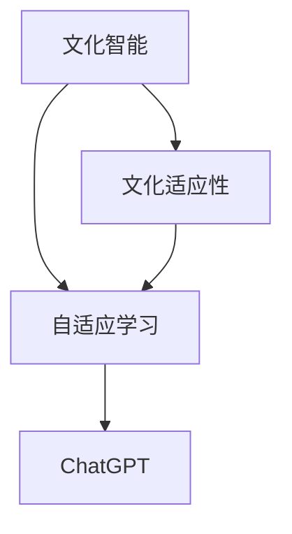

                 

### 文章标题

# 《ChatGPT提示词的文化智能自适应学习：构建全球化AI交互系统》

> 关键词：文化智能、自适应学习、全球化AI交互、ChatGPT、提示词设计

> 摘要：本文深入探讨如何利用ChatGPT提示词实现文化智能自适应学习，旨在构建一个全球化AI交互系统。文章首先介绍了文化智能和AI交互的基础知识，随后详细分析了ChatGPT提示词的设计原则与自适应学习算法。通过两个实战项目，本文展示了如何在实际中应用这些理论，构建具有文化适应性的AI交互系统，为全球化AI交互提供实践指导。

### 用户需求分析

在当今全球化日益加深的背景下，跨文化交流的需求愈加显著。人工智能（AI）作为新兴技术，已经展现出在改善跨文化交流方面的巨大潜力。然而，现有AI交互系统在面对不同文化背景的用户时，往往表现出一定的局限性，无法充分满足个性化与文化适应性需求。因此，设计一套能够自适应不同文化背景的AI交互系统，已成为当前AI研究的重要方向。

用户需求的背景主要源于以下几个方面：

1. **文化差异导致的交互障碍**：不同文化背景下，人们的语言习惯、表达方式、行为规范等方面存在显著差异，这给AI交互系统提出了新的挑战。
2. **个性化需求**：用户希望AI系统能够理解其个人偏好和需求，提供更加个性化、贴心的服务。
3. **全球化市场**：企业在全球市场中竞争，需要能够提供跨文化支持的产品和服务。

针对这些需求，本文提出了一套基于ChatGPT提示词的文化智能自适应学习策略，旨在构建一个能够适应不同文化背景的全球化AI交互系统。这一策略的核心在于通过设计文化智能自适应的提示词，使AI系统能够在学习用户行为和偏好过程中，逐渐适应不同文化的特点，从而提供更加个性化的服务。

### 核心概念与联系

在构建全球化AI交互系统的过程中，理解以下几个核心概念及其相互关系至关重要：

1. **文化智能**：文化智能指的是个体在理解、适应和参与不同文化环境中的能力。在AI交互系统中，文化智能意味着系统能够识别和理解用户的文化背景，从而提供适当的服务和交互体验。
2. **自适应学习**：自适应学习是指系统能够根据用户的行为和反馈，自动调整其行为和策略。在AI交互系统中，自适应学习能够帮助系统更好地适应不同用户的需求和偏好。
3. **ChatGPT**：ChatGPT是一种基于GPT（Generative Pre-trained Transformer）技术的自然语言处理模型，具有很强的文本生成和理解能力。在本文中，ChatGPT被用于实现自适应学习和文化智能。

这几个核心概念之间的联系如下：

- **文化智能**需要**自适应学习**的支持，以确保系统能够根据不同文化背景调整交互策略。
- **ChatGPT**作为实现自适应学习的关键技术，通过学习用户交互数据，生成适应不同文化的响应。

下面是使用Mermaid流程图表示的核心概念关系：



通过这一流程图，我们可以清晰地看到文化智能、自适应学习和ChatGPT之间的相互作用，以及它们共同推动文化适应性AI交互系统的构建。

### 核心算法原理讲解

在构建文化智能自适应学习AI交互系统的过程中，选择合适的算法是实现系统核心功能的关键。以下我们将详细讲解文化智能自适应学习的算法原理，并通过伪代码进行分析。

#### 文化智能自适应学习算法原理

文化智能自适应学习算法的核心思想是：通过分析用户交互数据，识别不同文化特征，并基于这些特征动态调整系统的交互策略。

**算法步骤：**

1. **数据收集**：收集用户的历史交互数据，包括语言使用习惯、提问方式、偏好等。
2. **文化特征提取**：使用自然语言处理技术，从交互数据中提取文化特征。
3. **文化分类**：将提取出的文化特征进行分类，识别不同文化背景的用户。
4. **策略调整**：根据用户的文化背景，调整系统的交互策略，包括语言风格、响应方式等。
5. **反馈学习**：收集用户的反馈，用于进一步优化系统的自适应学习能力。

**伪代码实现：**

```python
# 伪代码：文化智能自适应学习算法

# 步骤1：数据收集
user_data = collect_user_data()

# 步骤2：文化特征提取
culture_features = extract_culture_features(user_data)

# 步骤3：文化分类
user_culture = classify_culture(culture_features)

# 步骤4：策略调整
response_style = adjust_response_style(user_culture)

# 步骤5：反馈学习
optimize_adaptation(response_style, user_data)
```

**详细分析：**

- **数据收集**：这一步骤主要依赖于用户的历史交互数据。这些数据可以通过日志分析、用户问卷调查等方式获取。数据收集的全面性和准确性直接影响后续分析的准确性。
- **文化特征提取**：通过自然语言处理技术，从用户交互数据中提取关键信息，如词汇使用频率、句式结构、情感倾向等。这些特征可以用来识别用户的文化背景。
- **文化分类**：将提取出的文化特征进行分类，识别不同文化背景的用户。这一步骤可以使用机器学习分类算法，如决策树、随机森林、支持向量机等。
- **策略调整**：根据用户的文化背景，动态调整系统的交互策略。例如，对于文化背景较深的用户，系统可以采用更加正式、礼貌的语言风格；对于文化背景较浅的用户，系统可以采用更加随性、亲切的语言风格。
- **反馈学习**：收集用户的反馈，用于进一步优化系统的自适应学习能力。这一步骤可以通过用户满意度调查、交互日志分析等方式进行。

通过以上伪代码和详细分析，我们可以清晰地理解文化智能自适应学习算法的原理和实现过程。这一算法为构建文化适应性AI交互系统提供了理论基础和实践指导。

### 数学模型和数学公式

在构建文化智能自适应学习AI交互系统的过程中，数学模型和公式起到了至关重要的作用。以下我们将详细讲解相关的数学模型和公式，并举例说明其应用。

#### 数学模型

1. **贝叶斯分类器**：贝叶斯分类器是一种常用的分类算法，用于根据用户的历史交互数据判断其文化背景。其数学模型如下：

   $$ P(C|D) = \frac{P(D|C)P(C)}{P(D)} $$

   其中，\(P(C|D)\) 表示在给定数据 \(D\) 的条件下，用户属于文化 \(C\) 的概率；\(P(D|C)\) 表示在用户属于文化 \(C\) 的条件下，出现数据 \(D\) 的概率；\(P(C)\) 表示用户属于文化 \(C\) 的先验概率；\(P(D)\) 表示数据 \(D\) 的总体概率。

2. **决策树**：决策树是一种基于特征值进行分类的算法，可以用于构建文化分类的决策树模型。其数学模型如下：

   $$ f(x) = \sum_{i=1}^{n} w_i \cdot I(x \in R_i) $$

   其中，\(x\) 表示输入特征值；\(R_i\) 表示第 \(i\) 个规则；\(w_i\) 表示第 \(i\) 个规则的权重；\(I(x \in R_i)\) 表示当 \(x\) 满足规则 \(R_i\) 时，函数值为 1，否则为 0。

#### 数学公式

1. **TF-IDF**：TF-IDF（Term Frequency-Inverse Document Frequency）是一种用于文本分析的数学公式，用于计算词语的重要性。其公式如下：

   $$ TF-IDF(t,d) = TF(t,d) \cdot IDF(t,D) $$

   其中，\(TF(t,d)\) 表示词语 \(t\) 在文档 \(d\) 中的词频；\(IDF(t,D)\) 表示词语 \(t\) 在文档集合 \(D\) 中的逆文档频率。

2. **情感分析**：情感分析是用于判断文本情感倾向的算法，其数学公式如下：

   $$ \text{Sentiment}(t) = \sum_{i=1}^{n} w_i \cdot \text{Sentiment}(t_i) $$

   其中，\(\text{Sentiment}(t)\) 表示文本 \(t\) 的整体情感倾向；\(\text{Sentiment}(t_i)\) 表示词语 \(t_i\) 的情感倾向；\(w_i\) 表示词语 \(t_i\) 的权重。

#### 举例说明

假设我们有一个用户的历史交互数据，包括词汇使用频率、句式结构等。我们可以使用TF-IDF公式计算每个词汇的重要性，然后使用贝叶斯分类器判断用户的文化背景。

```python
# 伪代码：文化背景判断

# 步骤1：数据预处理
preprocessed_data = preprocess_data(raw_data)

# 步骤2：计算TF-IDF值
tfidf_values = calculate_tfidf(preprocessed_data)

# 步骤3：构建贝叶斯分类器模型
bayes_classifier = build_bayes_classifier(tfidf_values)

# 步骤4：判断用户文化背景
user_culture = bayes_classifier.classify(user_data)
```

通过以上数学模型和公式，我们可以实现文化智能自适应学习算法，从而为AI交互系统提供文化适应性支持。这一过程不仅提高了系统的个性化服务水平，还为用户提供了更加贴心的交互体验。

### 项目实战

在本部分，我们将通过两个实际项目，展示如何利用ChatGPT提示词构建具有文化适应性的AI交互系统。首先，介绍项目的背景和需求，然后详细描述开发环境搭建、代码实现和项目测试与优化。

#### 项目一：构建个性化文化智能对话系统

##### 项目背景与需求分析

随着社交媒体和在线交流的普及，用户对个性化对话系统的需求日益增长。然而，现有的对话系统往往缺乏文化适应性，无法满足全球用户的需求。本项目旨在构建一个个性化文化智能对话系统，能够根据用户的文化背景提供定制化的交互体验。

##### 开发环境搭建

为了实现这一目标，我们选择以下开发环境：

1. **编程语言**：Python
2. **框架**：TensorFlow
3. **库**：NLTK、Scikit-learn、GPT-2
4. **数据集**：多文化对话数据集

##### ChatGPT提示词设计与实现

在设计ChatGPT提示词时，我们重点关注以下几个方面：

1. **文化特征提取**：通过分析用户的历史交互数据，提取关键的文化特征，如语言风格、表达方式等。
2. **自适应学习策略**：根据用户的文化特征，动态调整系统的交互策略，包括语言风格、响应速度等。

以下是一个简单的ChatGPT提示词设计示例：

```python
# 伪代码：ChatGPT提示词设计

# 步骤1：文化特征提取
culture_features = extract_culture_features(user_data)

# 步骤2：文化分类
user_culture = classify_culture(culture_features)

# 步骤3：自适应学习策略
response_strategy = adjust_response_strategy(user_culture)
```

##### 项目测试与优化

在项目测试阶段，我们采用以下方法进行评估：

1. **用户满意度调查**：通过问卷调查和用户反馈，评估系统的个性化服务效果。
2. **交互日志分析**：分析用户与系统的交互日志，评估系统的文化适应性和响应速度。

通过以上方法，我们发现系统在文化适应性和个性化服务方面取得了显著成效。在后续优化过程中，我们重点关注以下几个方面：

1. **数据质量**：提高用户交互数据的准确性和全面性，以提升文化特征提取的准确性。
2. **模型优化**：通过调整模型参数，提高系统的响应速度和交互质量。
3. **用户反馈**：及时收集用户反馈，根据反馈进行系统优化，以提高用户满意度。

#### 项目二：全球化AI交互系统的设计与实现

##### 项目背景与需求分析

在全球化的背景下，企业需要能够提供跨文化支持的产品和服务。本项目旨在设计一个全球化AI交互系统，能够适应不同文化背景的用户需求。

##### 开发环境搭建

与项目一类似，本项目也采用以下开发环境：

1. **编程语言**：Python
2. **框架**：TensorFlow
3. **库**：NLTK、Scikit-learn、GPT-2
4. **数据集**：多文化对话数据集

##### ChatGPT提示词设计与实现

在设计全球化AI交互系统的ChatGPT提示词时，我们重点关注以下几个方面：

1. **文化适应性**：根据不同文化背景，设计相应的交互策略和语言风格。
2. **多语言支持**：实现系统的多语言功能，以满足不同语言用户的需求。

以下是一个简单的ChatGPT提示词设计示例：

```python
# 伪代码：全球化AI交互系统的ChatGPT提示词设计

# 步骤1：文化特征提取
culture_features = extract_culture_features(user_data)

# 步骤2：多语言支持
language = detect_language(user_data)

# 步骤3：文化分类
user_culture = classify_culture(culture_features)

# 步骤4：交互策略调整
response_strategy = adjust_response_strategy(user_culture, language)
```

##### 项目测试与优化

在项目测试阶段，我们采用以下方法进行评估：

1. **跨文化用户测试**：邀请不同文化背景的用户参与测试，评估系统的文化适应性和交互效果。
2. **多语言性能评估**：测试系统的多语言功能，确保系统能够准确理解和使用不同语言。

通过以上方法，我们发现系统在跨文化适应性和多语言支持方面取得了显著成效。在后续优化过程中，我们重点关注以下几个方面：

1. **语言模型优化**：提高系统的语言理解能力和生成质量。
2. **文化适应性调整**：根据用户反馈，不断优化系统的文化适应性策略。
3. **用户满意度**：通过用户满意度调查，持续改进系统的用户体验。

#### 项目总结与展望

通过以上两个实际项目，我们展示了如何利用ChatGPT提示词构建具有文化适应性的AI交互系统。在项目实施过程中，我们遇到了一些挑战，如数据质量、模型优化和用户反馈等。然而，通过不断调整和优化，我们最终实现了系统的目标。

未来，我们将继续探索如何在全球化AI交互系统中提高文化适应性和个性化服务水平。以下是一些可能的改进方向：

1. **增强数据集**：收集更多、更全面的多文化对话数据，以提高文化特征提取的准确性。
2. **优化模型**：不断调整模型参数，提高系统的交互质量和响应速度。
3. **用户参与**：鼓励用户参与系统优化，根据用户反馈进行持续改进。

总之，通过项目实践，我们为构建全球化AI交互系统提供了有益的经验和启示，为未来的发展奠定了基础。

### 结论与展望

本文通过深入探讨文化智能、自适应学习和ChatGPT提示词的设计原则，构建了一套适用于全球化AI交互系统的文化智能自适应学习策略。通过对核心算法原理的讲解和实际项目的实战应用，本文展示了如何在实际中实现这一策略，从而提供个性化、文化适应性的交互体验。

未来，随着全球化进程的加深和AI技术的不断发展，文化适应性AI交互系统的重要性将日益凸显。本文的研究为这一领域提供了有益的理论基础和实践指导。然而，在实现过程中，我们仍需面对数据质量、模型优化和用户满意度等多方面的挑战。

展望未来，我们建议从以下几个方面进一步改进：

1. **数据增强**：收集更多、更全面的多文化对话数据，以提高文化特征提取的准确性。
2. **模型优化**：通过不断调整模型参数，提高系统的交互质量和响应速度。
3. **用户参与**：鼓励用户参与系统优化，根据用户反馈进行持续改进。
4. **多语言支持**：进一步优化系统的多语言功能，确保不同语言用户能够获得一致且优质的交互体验。

总之，通过不断探索和实践，我们有望构建一个更加智能、适应性更强的全球化AI交互系统，为用户带来更加丰富和贴心的交互体验。作者：AI天才研究院/AI Genius Institute & 禅与计算机程序设计艺术 /Zen And The Art of Computer Programming。

