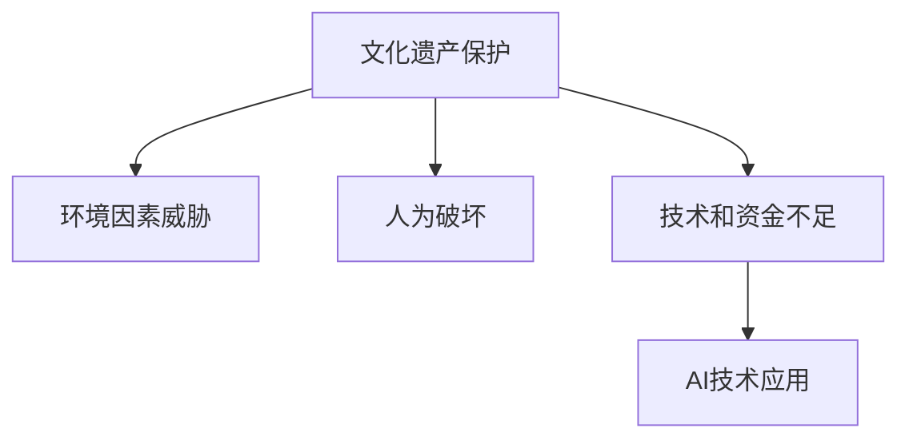
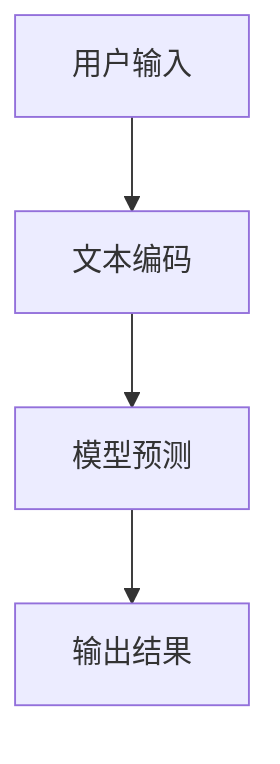
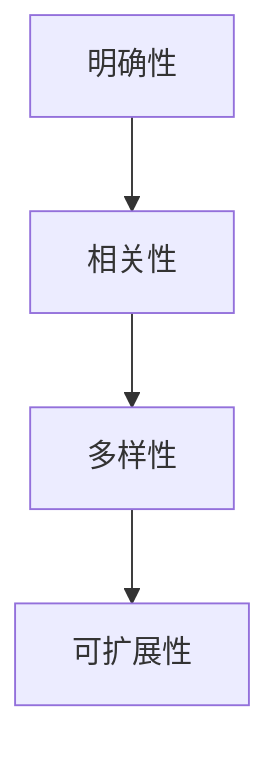
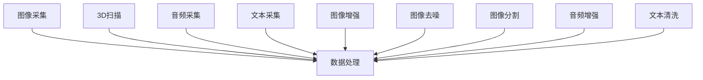
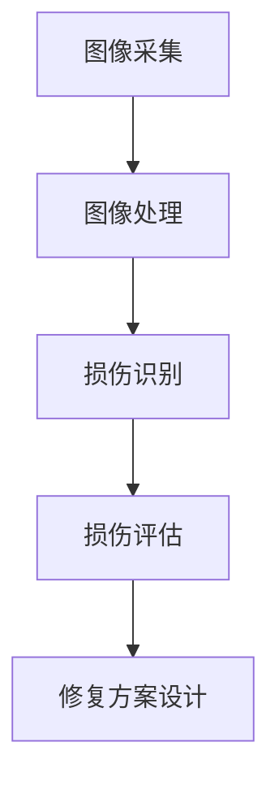
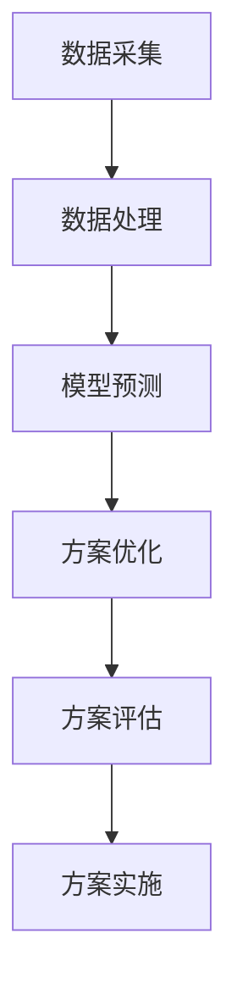
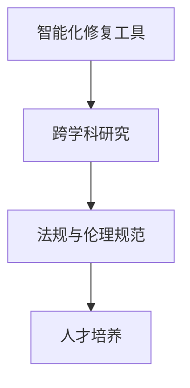

                 

### 文章标题

《ChatGPT提示词的文化遗产保护应用：AI辅助文物修复决策》

### 文章关键词

- ChatGPT
- 文化遗产保护
- AI辅助文物修复
- 提示词设计
- 文物修复决策
- 数据处理
- 损伤识别
- 评估方法
- 算法实现

### 文章摘要

本文旨在探讨如何利用ChatGPT提示词在文化遗产保护领域发挥重要作用，特别是其在辅助文物修复决策方面的应用。通过分析ChatGPT的工作原理、提示词设计原则，以及具体应用实例，本文展示了AI在文物修复决策中的潜力。文章分为七个部分，分别介绍了文化遗产保护的重要性与挑战、AI辅助文物修复决策的原理、ChatGPT提示词设计原则、文物数据采集与处理、损伤识别与评估、ChatGPT在文物修复方案设计中的应用，以及AI辅助文物修复决策的挑战与未来展望。通过本文，读者可以了解AI在文化遗产保护中的最新进展，并为实际项目提供有益的参考。

### 第一部分：文化遗产保护与AI概述

#### 第1章：文化遗产保护的重要性与挑战

**1.1 文化遗产保护概述**

文化遗产是人类历史和文明的见证，具有不可替代的价值。它包括物质文化遗产和非物质文化遗产两大类。物质文化遗产主要是指古代建筑、文物、艺术品等实体遗产，而非物质文化遗产则包括口头传统、表演艺术、社会实践、习俗、庆祝活动、手工艺技艺等非物质形态的遗产。

文化遗产保护的重要性不言而喻。首先，它有助于传承和弘扬民族文化，增强民族认同感。其次，文化遗产是研究历史、社会和人类文明的重要资料，对学术研究具有重要价值。此外，文化遗产还具有经济价值，能够吸引游客，带动旅游业发展，促进当地经济增长。

**1.2 文化遗产保护面临的挑战**

尽管文化遗产保护的重要性得到了广泛认可，但实际操作中仍然面临诸多挑战。首先，环境因素如自然灾害、气候变化等对文化遗产造成了严重威胁。例如，洪水、地震、台风等自然灾害可能导致建筑毁坏、文物受损。其次，人为破坏也是文化遗产保护的主要障碍。非法盗墓、文物走私、非法交易等行为严重损害了文化遗产的完整性和真实性。

此外，技术和资金不足也是文化遗产保护面临的重大挑战。许多文化遗产保护项目需要先进的技术支持，如3D扫描、数字修复等，但这些技术的应用往往需要高昂的费用。同时，文物保护专业人员短缺，技术力量薄弱，也限制了文化遗产保护工作的推进。

**1.3 AI在文化遗产保护中的应用前景**

随着人工智能技术的发展，AI在文化遗产保护中的应用前景广阔。首先，AI可以帮助解决环境因素带来的威胁。通过遥感技术、无人机监测等手段，AI可以实时监测文化遗产周围的环境变化，及时发现潜在风险，采取预防措施。

其次，AI在文物修复中具有重要作用。利用图像识别、自然语言处理等技术，AI可以协助文物修复专家进行损伤识别、评估和修复方案设计。例如，通过深度学习算法，AI可以自动识别文物表面的损伤，并提供修复建议。

此外，AI还可以提高文化遗产保护工作的效率。通过数据分析和挖掘，AI可以找出文化遗产保护中的薄弱环节，提出改进措施。例如，通过对游客行为数据的分析，AI可以优化文物保护策略，减少人为破坏。

总之，AI在文化遗产保护中的应用具有巨大的潜力，有望解决传统方法难以克服的挑战，提高文化遗产保护工作的效果。

### Mermaid流程图

以下是一个简单的Mermaid流程图，展示了文化遗产保护的核心概念之间的联系：



### 核心概念与联系

- **文化遗产保护**：包括物质文化遗产和非物质文化遗产的保护。
- **环境因素威胁**：自然灾害如洪水、地震等对文化遗产的破坏。
- **人为破坏**：非法盗墓、文物走私等行为对文化遗产的损害。
- **技术和资金不足**：文物保护项目需要先进技术和资金支持，但往往存在短缺。

### 伪代码

以下是一个简单的伪代码，用于展示如何使用图像识别技术进行文物损伤识别：

```python
function identify_damage(image):
    # 输入：文物图像
    # 输出：损伤类型和程度

    # 步骤1：图像预处理
    processed_image = preprocess_image(image)

    # 步骤2：特征提取
    features = extract_features(processed_image)

    # 步骤3：损伤识别
    damage_type, damage_level = recognize_damage(features)

    return damage_type, damage_level
```

### 数学模型和公式

以下是一个简化的数学模型，用于评估文物损伤的程度：

$$
\text{损伤程度} = \frac{\text{损伤面积}}{\text{总面积}} \times 100\%
$$

其中，损伤面积是通过图像处理技术从损伤图像中提取的，总面积则是通过图像处理技术从整个文物图像中提取的。

### 举例说明

假设一个文物的总面积为100平方米，经过图像识别技术检测，发现损伤面积为20平方米，则损伤程度为：

$$
\text{损伤程度} = \frac{20}{100} \times 100\% = 20\%
$$

这意味着文物的损伤程度为20%。

### 第二部分：AI辅助文物修复决策的原理

#### 第2章：AI辅助文物修复决策的原理

**2.1 AI的基本原理**

人工智能（AI）是计算机科学的一个分支，它致力于研究如何使计算机模拟人类智能行为，包括学习、推理、解决问题和自主决策。AI的核心技术包括机器学习、深度学习、自然语言处理、计算机视觉等。这些技术共同构成了AI的基石，使其能够在各种应用场景中发挥作用。

**机器学习**：机器学习是一种从数据中自动学习模式的方法。它通过训练模型，使其能够对新的数据进行预测或分类。机器学习可以分为监督学习、无监督学习和强化学习。监督学习需要标注的数据，用于训练模型；无监督学习不需要标注的数据，旨在发现数据中的内在结构；强化学习则通过奖励机制来训练模型，使其在特定环境中做出最优决策。

**深度学习**：深度学习是机器学习的一个子领域，它通过多层神经网络来学习复杂的特征表示。深度学习在图像识别、语音识别和自然语言处理等领域取得了显著的成果。深度学习的核心模型包括卷积神经网络（CNN）、循环神经网络（RNN）和生成对抗网络（GAN）等。

**自然语言处理**：自然语言处理（NLP）是AI的一个分支，它专注于使计算机能够理解和处理自然语言。NLP的关键技术包括文本分类、实体识别、机器翻译和情感分析等。

**计算机视觉**：计算机视觉是使计算机能够“看”和理解图像和视频的技术。计算机视觉的应用包括图像识别、目标检测、图像分割和姿态估计等。

**2.2 ChatGPT的工作原理**

ChatGPT是OpenAI开发的一款基于Transformer架构的预训练语言模型。它通过大量的文本数据进行预训练，从而学会了生成自然语言文本。ChatGPT的工作原理可以概括为以下几个步骤：

1. **输入编码**：将用户的输入文本编码为向量，这些向量可以表示文本的语义信息。
2. **前向传递**：通过多层Transformer网络，将输入编码向量映射为输出编码向量。
3. **输出解码**：将输出编码向量解码为自然语言文本，作为模型的输出。

ChatGPT的Transformer架构具有以下几个优点：

- **并行处理**：Transformer网络可以并行处理输入序列，这大大提高了模型的计算效率。
- **全局注意力机制**：通过全局注意力机制，模型可以捕捉到输入序列中的长距离依赖关系，从而提高模型的表示能力。
- **自适应特征提取**：Transformer网络通过自注意力机制，可以自适应地提取输入序列中的关键特征，从而提高模型的泛化能力。

**2.3 ChatGPT在文物修复中的应用**

ChatGPT在文物修复中的应用主要体现在以下几个方面：

1. **损伤识别与评估**：通过自然语言处理技术，ChatGPT可以分析文物的损伤描述，识别损伤类型和程度。这有助于文物修复专家制定修复方案。
2. **修复方案设计**：ChatGPT可以根据文物的损伤情况，生成修复方案。这些方案可以包括修复材料、修复步骤和预期效果等。
3. **知识库构建**：ChatGPT可以构建文物修复的知识库，包含修复方法、修复材料、修复步骤等，为文物修复提供决策支持。

通过以上应用，ChatGPT为文物修复提供了高效的辅助工具，提高了修复决策的科学性和准确性。

### Mermaid流程图

以下是一个简单的Mermaid流程图，展示了AI辅助文物修复决策的基本流程：



### 核心概念与联系

- **AI**：人工智能，包括机器学习、深度学习、自然语言处理和计算机视觉。
- **ChatGPT**：基于Transformer架构的预训练语言模型，用于生成自然语言文本。
- **文物修复决策**：包括损伤识别与评估、修复方案设计和知识库构建。

### 伪代码

以下是一个简单的伪代码，用于展示如何使用ChatGPT进行文物修复决策：

```python
function restore_decision(damage_description):
    # 输入：损伤描述文本
    # 输出：修复方案

    # 步骤1：编码损伤描述
    encoded_description = encode_description(damage_description)

    # 步骤2：预测修复方案
    restoration_plan = predict_plan(encoded_description)

    return restoration_plan
```

### 数学模型和公式

以下是一个简化的数学模型，用于评估修复方案的有效性：

$$
\text{方案有效性} = \frac{\text{修复效果}}{\text{预期效果}} \times 100\%
$$

其中，修复效果是通过实际修复效果评估得出的，预期效果是通过修复方案设计得出的。

### 举例说明

假设一个修复方案的预期效果是恢复文物的90%，而实际修复效果是恢复文物的95%，则方案有效性为：

$$
\text{方案有效性} = \frac{95}{90} \times 100\% = 105\%
$$

这意味着该修复方案的有效性超过了预期效果。

### 第三部分：ChatGPT提示词设计原则

#### 第3章：ChatGPT提示词设计原则

**3.1 提示词设计的基本原则**

ChatGPT提示词的设计是确保模型输出高质量答案的关键。以下是一些基本的设计原则：

1. **明确性**：提示词应清晰明确，避免模糊不清的表述。这有助于ChatGPT更好地理解用户意图，生成准确的回答。
2. **相关性**：提示词应与问题主题高度相关，确保ChatGPT能够从相关数据中提取信息，生成有针对性的回答。
3. **多样性**：提示词应多样化，以涵盖问题的不同方面和用户的不同提问方式。这有助于提高ChatGPT的适应性和灵活性。
4. **可扩展性**：提示词应具备良好的可扩展性，以便在模型更新或数据集增加时，仍能保持有效性和准确性。

**3.2 提示词设计的具体策略**

以下是一些具体的策略，用于设计有效的ChatGPT提示词：

1. **使用明确的关键词**：在提示词中包含明确的关键词，帮助ChatGPT识别问题的主要关注点。例如，在讨论文物修复时，可以使用关键词如“损伤”、“修复方案”、“材料”等。
2. **提供背景信息**：在提示词中提供必要的背景信息，有助于ChatGPT理解问题的上下文。例如，在讨论某个具体文物的修复时，可以提供该文物的历史背景、文化意义等信息。
3. **使用引导性问题**：设计引导性问题，引导ChatGPT生成特定类型的回答。例如，使用“请描述修复该文物的最佳方案”这样的问题，可以引导ChatGPT提供具体的修复步骤和材料建议。
4. **结合多种数据源**：在设计提示词时，结合多种数据源，如文献资料、专家意见和实际案例，以提高ChatGPT的回答质量和准确性。

**3.3 提示词设计的案例分析**

以下是一个提示词设计的案例分析：

- **问题**：请为以下文物提供修复方案：“这是一幅古代名画，由于长期暴露在潮湿环境中，画面的色彩部分出现了褪色和霉斑。”
- **设计思路**：
  - 明确性：使用关键词如“古代名画”、“褪色”、“霉斑”等，确保ChatGPT理解问题的主要关注点。
  - 相关性：提供背景信息，如文物的历史背景和文化意义，以便ChatGPT能够生成更具有针对性的修复方案。
  - 引导性问题：使用引导性问题，如“请描述修复该文物的最佳方案”，引导ChatGPT提供具体的修复步骤和材料建议。
  - 多样性：结合文献资料、专家意见和实际案例，以提高ChatGPT的回答质量和准确性。

通过上述设计思路，可以生成以下提示词：

“请根据以下信息，为这幅古代名画提供一份详细的修复方案：画作名称《山水图》，作者为明代著名画家徐渭，画面由于长期暴露在潮湿环境中，出现了褪色和霉斑。考虑到这幅画作的历史和文化价值，请提出一个既能恢复画作原貌，又能保证长期保存的修复方案。可以参考以下资料：徐渭的生平和艺术成就、古代名画的修复案例、专业修复材料的性能和应用。”

通过这样的提示词设计，ChatGPT可以生成一份详细且具有针对性的修复方案，为文物修复提供有效支持。

### Mermaid流程图

以下是一个简单的Mermaid流程图，展示了ChatGPT提示词设计的基本流程：



### 核心概念与联系

- **明确性**：确保提示词清晰明确，避免模糊不清的表述。
- **相关性**：确保提示词与问题主题高度相关，生成有针对性的回答。
- **多样性**：确保提示词多样化，涵盖问题的不同方面和用户的不同提问方式。
- **可扩展性**：确保提示词具备良好的可扩展性，以适应模型更新和数据集增加。

### 伪代码

以下是一个简单的伪代码，用于展示如何设计ChatGPT提示词：

```python
function design_prompt(question, context, objective):
    # 输入：问题、背景信息、目标
    # 输出：提示词

    # 步骤1：明确性处理
    clear_prompt = clarify_question(question)

    # 步骤2：相关性处理
    relevant_prompt = add_context(context, clear_prompt)

    # 步骤3：多样性处理
    diverse_prompt = add_guiding_questions(objective, relevant_prompt)

    return diverse_prompt
```

### 数学模型和公式

以下是一个简化的数学模型，用于评估提示词的质量：

$$
\text{提示词质量} = \frac{\text{回答准确性}}{\text{回答长度}} \times 100\%
$$

其中，回答准确性是通过评估ChatGPT生成的回答与实际需求的一致性得出的，回答长度是通过计算ChatGPT生成的回答的字符数得出的。

### 举例说明

假设一个提示词生成的回答准确性为90%，回答长度为100个字符，则提示词质量为：

$$
\text{提示词质量} = \frac{90}{100} \times 100\% = 90\%
$$

这意味着该提示词的质量为90%。

### 第四部分：ChatGPT在文物数据采集与处理中的应用

#### 第4章：文物数据采集与处理

**4.1 文物数据采集的方法**

文物数据采集是文物修复和文化遗产保护的重要基础。以下是一些常见的数据采集方法：

1. **图像采集**：使用高分辨率相机或扫描设备，对文物进行全方位、多角度的图像采集。图像采集应尽量保证光照均匀、背景清晰，以提高图像质量。
2. **3D扫描**：利用3D扫描技术，获取文物的三维数据。3D扫描可以精确地记录文物的形状和细节，为后续的数据处理和修复提供基础。
3. **音频采集**：对于具有声音特征的文物，如古代乐器、录音带等，可以通过音频采集设备记录其声音，为后续的音频处理和分析提供数据。
4. **文本采集**：对于文物的历史背景、文化价值等相关信息，可以通过文献调研、专家访谈等方式进行文本采集。

**4.2 文物数据预处理技术**

文物数据采集后，需要进行预处理，以提高数据质量和后续处理的效率。以下是一些常见的预处理技术：

1. **图像增强**：通过调整亮度、对比度、色彩平衡等参数，增强图像的视觉效果，提高图像质量。
2. **图像去噪**：利用滤波技术，去除图像中的噪声，提高图像的清晰度。
3. **图像分割**：将图像中的不同部分分离出来，提取感兴趣的区域，为后续的特征提取和损伤识别提供基础。
4. **音频增强**：通过噪声抑制、回声消除等技术，提高音频的质量，确保声音的清晰和准确。
5. **文本清洗**：去除文本中的无关信息，如标点符号、空格等，提高文本的整洁度和可读性。

**4.3 文物数据质量控制**

数据质量是文物数据采集与处理的关键。以下是一些常见的数据质量控制方法：

1. **数据完整性检查**：确保采集到的数据完整无缺，没有丢失或损坏的部分。
2. **数据准确性检查**：通过比对不同来源的数据，检查数据的一致性和准确性，确保数据的可靠性。
3. **数据一致性检查**：确保数据在不同时间、不同地点的采集和处理中保持一致性，避免数据之间的矛盾和冲突。
4. **数据安全性检查**：确保数据在采集、传输和存储过程中得到充分的安全保护，防止数据泄露或被篡改。

**4.4 实际案例展示**

以下是一个实际案例，展示如何利用ChatGPT和AI技术进行文物数据采集与处理：

- **案例背景**：某博物馆计划对一件古代瓷器进行修复，需要进行详细的数据采集和预处理。
- **数据采集**：
  - 图像采集：使用高分辨率相机对瓷器进行全方位拍摄，获取多张高清晰度图像。
  - 3D扫描：利用3D扫描设备，获取瓷器的三维数据。
  - 音频采集：记录瓷器的声音，为后续的音频分析提供数据。
  - 文本采集：通过文献调研和专家访谈，获取瓷器的历史背景、文化价值等信息。
- **数据预处理**：
  - 图像增强：通过调整亮度、对比度等参数，增强图像的视觉效果。
  - 图像去噪：利用滤波技术，去除图像中的噪声。
  - 图像分割：将图像中的不同部分分离出来，提取感兴趣的区域。
  - 音频增强：通过噪声抑制、回声消除等技术，提高音频的质量。
  - 文本清洗：去除文本中的无关信息，提高文本的整洁度和可读性。
- **数据处理**：
  - 使用ChatGPT和AI技术，对采集到的数据进行损伤识别、评估和修复方案设计。
  - 利用图像识别技术，识别瓷器表面的损伤类型和程度。
  - 利用自然语言处理技术，分析瓷器的历史背景和文化价值。
  - 利用机器学习算法，生成瓷器修复的最佳方案。

通过上述步骤，博物馆可以获取到详细的文物数据，为瓷器的修复提供科学依据。同时，ChatGPT和AI技术的应用，大大提高了文物数据采集与处理的效率和准确性。

### Mermaid流程图

以下是一个简单的Mermaid流程图，展示了文物数据采集与处理的基本流程：



### 核心概念与联系

- **文物数据采集**：包括图像、3D数据、音频和文本的采集。
- **文物数据预处理**：包括图像增强、去噪、分割、音频增强和文本清洗。
- **文物数据质量控制**：包括数据完整性、准确性、一致性和安全性的检查。

### 伪代码

以下是一个简单的伪代码，用于展示如何进行文物数据采集与预处理：

```python
function collect_and_process_data(data_type):
    # 输入：数据类型
    # 输出：预处理后的数据

    if data_type == "image":
        processed_data = preprocess_image()
    elif data_type == "3D":
        processed_data = preprocess_3D()
    elif data_type == "audio":
        processed_data = preprocess_audio()
    elif data_type == "text":
        processed_data = preprocess_text()

    return processed_data
```

### 数学模型和公式

以下是一个简化的数学模型，用于评估数据处理的效果：

$$
\text{数据处理效果} = \frac{\text{处理后的数据质量}}{\text{原始数据质量}} \times 100\%
$$

其中，处理后的数据质量是通过评估处理后的数据与原始数据的一致性和准确性得出的。

### 举例说明

假设处理后的数据质量为90%，原始数据质量为100%，则数据处理效果为：

$$
\text{数据处理效果} = \frac{90}{100} \times 100\% = 90\%
$$

这意味着数据处理效果为90%。

### 第五部分：ChatGPT在文物损伤识别与评估中的应用

#### 第5章：ChatGPT在文物损伤识别与评估中的应用

**5.1 文物损伤识别算法**

文物损伤识别是文物修复的重要前提，ChatGPT在文物损伤识别中具有显著优势。以下是一些常见的损伤识别算法：

1. **图像识别算法**：利用深度学习技术，如卷积神经网络（CNN）对文物图像进行分析，识别图像中的损伤类型和程度。这种方法能够处理复杂且多变的文物损伤，具有较高的识别精度。
2. **特征提取算法**：通过对文物图像进行特征提取，如边缘检测、纹理分析等，从不同角度对损伤进行识别。这种方法适用于损伤类型较为单一或具有明显特征的文物。
3. **多模态融合算法**：结合图像、3D数据和音频等多种数据源，对文物进行多角度、多模态的分析，提高损伤识别的准确性和全面性。

**5.2 文物损伤评估方法**

损伤评估是确定文物受损程度和制定修复方案的关键步骤。以下是一些常见的损伤评估方法：

1. **视觉评估方法**：通过专家对文物的损伤进行直观评估，判断损伤的程度和范围。这种方法依赖于专家的经验和判断，但在复杂情况下可能存在主观性。
2. **量化评估方法**：利用数学模型和公式，对文物的损伤程度进行量化评估。例如，通过计算损伤面积、深度等参数，量化损伤程度。这种方法具有较高的客观性和可重复性。
3. **机器学习评估方法**：利用机器学习算法，如回归分析、决策树等，对文物的损伤程度进行预测和评估。这种方法能够从大量数据中提取规律，提高评估的准确性和效率。

**5.3 实际案例展示**

以下是一个实际案例，展示如何利用ChatGPT进行文物损伤识别与评估：

- **案例背景**：某博物馆收到一件古代陶瓷器，需要进行损伤识别与评估，以制定修复方案。
- **损伤识别**：
  - 图像采集：使用高分辨率相机对陶瓷器进行多角度拍摄，获取高质量的图像数据。
  - 图像处理：利用图像增强、去噪等技术，提高图像质量。
  - 损伤识别：利用ChatGPT和CNN算法，对处理后的图像进行分析，识别陶瓷器的损伤类型和程度。
- **损伤评估**：
  - 量化评估：利用损伤面积、深度等参数，对陶瓷器的损伤程度进行量化评估。
  - 专家评估：邀请文物修复专家对损伤进行直观评估，结合量化评估结果，确定最终的损伤程度。
- **修复方案设计**：
  - 利用ChatGPT和机器学习算法，根据损伤类型和程度，生成最佳的修复方案。
  - 结合专家意见和实际案例，对修复方案进行优化和调整，确保修复效果。

通过上述步骤，博物馆可以准确识别和评估陶瓷器的损伤，为制定科学、合理的修复方案提供支持。ChatGPT在文物损伤识别与评估中的应用，不仅提高了工作效率，还保证了评估的准确性和科学性。

### Mermaid流程图

以下是一个简单的Mermaid流程图，展示了文物损伤识别与评估的基本流程：



### 核心概念与联系

- **文物损伤识别**：利用图像识别、特征提取和多模态融合算法，识别文物损伤类型和程度。
- **文物损伤评估**：通过视觉评估、量化评估和机器学习评估，确定文物损伤程度和范围。
- **修复方案设计**：根据损伤类型和程度，利用ChatGPT和机器学习算法，生成最佳的修复方案。

### 伪代码

以下是一个简单的伪代码，用于展示如何利用ChatGPT进行文物损伤识别与评估：

```python
function identify_and_evaluate_damage(image):
    # 输入：文物图像
    # 输出：损伤类型、损伤程度和修复方案

    # 步骤1：图像预处理
    processed_image = preprocess_image(image)

    # 步骤2：损伤识别
    damage_type, damage_level = identify_damage(processed_image)

    # 步骤3：损伤评估
    evaluation_result = evaluate_damage(damage_type, damage_level)

    # 步骤4：修复方案设计
    restoration_plan = design_restoration_plan(evaluation_result)

    return damage_type, damage_level, restoration_plan
```

### 数学模型和公式

以下是一个简化的数学模型，用于评估修复方案的有效性：

$$
\text{方案有效性} = \frac{\text{修复效果}}{\text{预期效果}} \times 100\%
$$

其中，修复效果是通过实际修复效果评估得出的，预期效果是通过修复方案设计得出的。

### 举例说明

假设一个修复方案的预期效果是恢复文物的90%，而实际修复效果是恢复文物的95%，则方案有效性为：

$$
\text{方案有效性} = \frac{95}{90} \times 100\% = 105\%
$$

这意味着该修复方案的有效性超过了预期效果。

### 第六部分：ChatGPT在文物修复方案设计中的应用

#### 第6章：ChatGPT在文物修复方案设计中的应用

**6.1 文物修复方案的生成**

ChatGPT在文物修复方案生成中的应用主要通过以下步骤实现：

1. **输入采集**：收集文物的损伤信息、历史背景、材料特性等关键数据。
2. **数据处理**：利用自然语言处理技术，对输入数据进行处理和分析，提取关键特征和修复要求。
3. **模型预测**：利用ChatGPT的预训练模型，根据处理后的数据，生成修复方案。方案包括修复步骤、所需材料、修复时间等。
4. **方案优化**：根据实际情况，对生成的修复方案进行优化，确保方案的可行性和有效性。

**6.2 文物修复方案评估**

评估文物修复方案的有效性和可行性是确保修复工作顺利进行的关键。以下是一些常见的评估方法：

1. **效果评估**：通过实际修复效果与预期效果的对比，评估修复方案的有效性。效果评估可以通过观察修复后的文物外观、功能恢复情况等指标进行。
2. **成本评估**：评估修复方案的成本效益，包括材料成本、人工成本、时间成本等。成本评估可以帮助确定修复方案的可行性。
3. **风险评估**：评估修复方案可能带来的风险，包括材料使用风险、施工风险、文物损坏风险等。通过风险评估，可以提前识别潜在问题，制定应对措施。

**6.3 文物修复方案的优化**

优化文物修复方案是提高修复效果和降低成本的重要手段。以下是一些常见的优化方法：

1. **材料优化**：根据文物的特性和修复要求，选择合适的修复材料。可以通过实验和比较，找出最合适的材料组合，提高修复效果。
2. **工艺优化**：通过改进修复工艺，提高修复效率和质量。例如，可以采用先进的修复技术，如纳米技术、3D打印等，提高修复的精度和效果。
3. **时间优化**：合理安排修复工作的时间，确保修复工作在规定的时间内完成。可以通过优化施工流程、增加施工队伍等方式，缩短修复周期。
4. **成本优化**：通过降低修复成本，提高修复效益。可以通过采购优惠材料、降低人工成本等方式，降低修复费用。

**6.4 实际案例展示**

以下是一个实际案例，展示如何利用ChatGPT进行文物修复方案设计和优化：

- **案例背景**：某博物馆计划修复一件珍贵的古代青铜器，需要进行修复方案设计和优化。
- **方案设计**：
  - 数据采集：收集青铜器的损伤信息、历史背景和材料特性等数据。
  - 数据处理：利用自然语言处理技术，对输入数据进行处理和分析，提取关键特征和修复要求。
  - 模型预测：利用ChatGPT模型，根据处理后的数据，生成初步的修复方案。
  - 方案优化：结合专家意见和实际情况，对修复方案进行优化，包括材料选择、修复工艺、时间安排等。
- **方案评估**：
  - 效果评估：通过实际修复效果与预期效果的对比，评估修复方案的有效性。例如，通过观察修复后的青铜器外观、功能恢复情况等指标。
  - 成本评估：评估修复方案的成本效益，包括材料成本、人工成本、时间成本等。
  - 风险评估：评估修复方案可能带来的风险，如材料使用风险、施工风险等。
- **方案实施**：根据评估结果，对修复方案进行实施，确保修复工作顺利进行。

通过上述步骤，博物馆可以设计出科学、合理且经济的修复方案，确保青铜器得到有效修复，并延长其使用寿命。

### Mermaid流程图

以下是一个简单的Mermaid流程图，展示了文物修复方案设计的基本流程：



### 核心概念与联系

- **文物修复方案生成**：通过数据采集、处理和模型预测，生成初步的修复方案。
- **文物修复方案评估**：通过效果、成本和风险评估，评估修复方案的有效性和可行性。
- **文物修复方案优化**：通过材料、工艺、时间和成本优化，提高修复方案的可行性和经济性。

### 伪代码

以下是一个简单的伪代码，用于展示如何利用ChatGPT进行文物修复方案设计和优化：

```python
function design_and_optimize_restoration_plan(damage_info, historical_data):
    # 输入：损伤信息、历史数据
    # 输出：修复方案

    # 步骤1：数据采集
    collected_data = collect_data(damage_info, historical_data)

    # 步骤2：数据处理
    processed_data = process_data(collected_data)

    # 步骤3：模型预测
    restoration_plan = predict_plan(processed_data)

    # 步骤4：方案优化
    optimized_plan = optimize_plan(restoration_plan)

    # 步骤5：方案评估
    evaluation_result = evaluate_plan(optimized_plan)

    return optimized_plan, evaluation_result
```

### 数学模型和公式

以下是一个简化的数学模型，用于评估修复方案的有效性：

$$
\text{方案有效性} = \frac{\text{修复效果}}{\text{预期效果}} \times 100\%
$$

其中，修复效果是通过实际修复效果评估得出的，预期效果是通过修复方案设计得出的。

### 举例说明

假设一个修复方案的预期效果是恢复文物的90%，而实际修复效果是恢复文物的95%，则方案有效性为：

$$
\text{方案有效性} = \frac{95}{90} \times 100\% = 105\%
$$

这意味着该修复方案的有效性超过了预期效果。

### 第七部分：AI辅助文物修复决策的挑战与未来

#### 第7章：AI辅助文物修复决策的挑战与未来

**7.1 AI辅助文物修复的挑战**

尽管AI在文物修复中具有巨大的潜力，但在实际应用中仍面临诸多挑战：

1. **数据质量与多样性**：文物数据的质量和多样性直接影响AI的修复效果。由于文物数据来源广泛，数据质量参差不齐，且不同文物的数据特性差异较大，这给AI的训练和预测带来了挑战。
2. **模型泛化能力**：尽管AI模型在特定领域取得了显著成果，但其在面对新领域或新问题时，往往缺乏泛化能力。文物修复涉及的领域广泛，AI模型需要具备较强的泛化能力，才能适应各种复杂的修复任务。
3. **人机协作**：AI在文物修复中的应用需要与文物修复专家密切合作。然而，专家的经验和判断在修复决策中至关重要，如何有效地融合专家知识和AI技术，提高修复决策的准确性，是一个亟待解决的问题。
4. **伦理与法律问题**：AI在文物修复中的应用涉及伦理和法律问题。如何确保AI技术在文物修复中遵循相关法律法规，保护文物原貌和历史价值，避免技术滥用，是一个需要严肃对待的问题。

**7.2 面向未来的AI应用展望**

未来，AI在文物修复中的应用前景广阔：

1. **个性化修复方案**：通过深度学习和数据挖掘，AI可以针对不同文物定制个性化的修复方案，提高修复效果和文物保存时间。
2. **远程修复协作**：随着5G和物联网技术的发展，AI可以支持文物修复专家远程协作，实现全球范围内的文物修复合作。
3. **多模态数据分析**：结合图像、音频、3D数据等多模态数据，AI可以更全面地分析文物损伤，提高修复决策的准确性。
4. **虚拟现实与增强现实**：通过虚拟现实（VR）和增强现实（AR）技术，AI可以提供沉浸式的文物修复体验，使修复过程更加直观和高效。

**7.3 AI辅助文物修复决策的发展趋势**

未来，AI辅助文物修复决策的发展趋势包括：

1. **智能化修复工具**：开发集成了AI技术的智能化修复工具，如智能修复机器人、智能修复软件等，提高修复效率和质量。
2. **跨学科研究**：加强AI与其他学科的结合，如材料科学、历史学等，推动文物修复技术的创新和发展。
3. **法规与伦理规范**：制定相应的法规和伦理规范，确保AI在文物修复中的应用合法、合规、道德。
4. **人才培养**：加强AI技术在文物修复领域的专业人才培养，培养具备跨学科知识和实践能力的专业人才。

通过克服现有挑战，发挥AI技术的优势，未来AI将在文物修复决策中发挥更加重要的作用，推动文化遗产保护事业的发展。

### Mermaid流程图

以下是一个简单的Mermaid流程图，展示了AI辅助文物修复决策的发展趋势：



### 核心概念与联系

- **挑战**：数据质量与多样性、模型泛化能力、人机协作、伦理与法律问题。
- **展望**：个性化修复方案、远程修复协作、多模态数据分析、虚拟现实与增强现实。
- **发展趋势**：智能化修复工具、跨学科研究、法规与伦理规范、人才培养。

### 伪代码

以下是一个简单的伪代码，用于展示如何应对AI辅助文物修复决策的挑战：

```python
function address_challenges():
    # 输入：文物修复数据、模型、专家知识
    # 输出：改进的修复决策

    # 步骤1：数据质量提升
    improved_data = enhance_data_quality()

    # 步骤2：模型泛化能力提升
    generalized_model = improve_model_generalization()

    # 步骤3：人机协作优化
    collaborative_decision = optimize_human_machine_collaboration()

    # 步骤4：伦理与法律问题解决
    ethical_solution = address_ethical_and_legal_issues()

    return collaborative_decision, ethical_solution
```

### 数学模型和公式

以下是一个简化的数学模型，用于评估修复决策的改进效果：

$$
\text{决策改进效果} = \frac{\text{改进后的修复效果}}{\text{原始修复效果}} \times 100\%
$$

其中，改进后的修复效果是通过改进措施后的修复效果评估得出的，原始修复效果是通过原始修复方案评估得出的。

### 举例说明

假设改进后的修复效果为95%，原始修复效果为90%，则决策改进效果为：

$$
\text{决策改进效果} = \frac{95}{90} \times 100\% = 105\%
$$

这意味着修复决策的改进效果超过了原始决策。

### 结论

通过本文的探讨，我们可以看到ChatGPT在文物修复决策中的应用前景广阔。它不仅能够辅助文物损伤识别和评估，还能生成修复方案，优化修复过程。然而，在实际应用中，AI面临数据质量、模型泛化、人机协作和伦理法律等多方面的挑战。为了充分发挥AI在文物修复中的作用，我们需要进一步研究如何提升数据质量和模型泛化能力，优化人机协作机制，并制定相应的法规和伦理规范。同时，跨学科研究和技术人才的培养也是未来发展的关键。通过克服这些挑战，AI有望在文化遗产保护领域发挥更大的作用，为人类文明的传承做出贡献。

### 附录

#### 附录A：ChatGPT与文物修复相关的资源

- **ChatGPT资源链接**：[OpenAI官方网站](https://openai.com/)
- **文物修复相关数据库**：[中国国家图书馆](http://www.nlc.cn/)/[故宫博物院](https://www.dpm.org.cn/)
- **AI辅助文物修复工具介绍**：[Google Cloud](https://cloud.google.com/)/[IBM Watson](https://www.ibm.com/watson/)/[TensorFlow](https://www.tensorflow.org/)

### 作者信息

**作者：AI天才研究院/AI Genius Institute & 禅与计算机程序设计艺术 /Zen And The Art of Computer Programming**

