                 

根据您的指导，我将按照以下步骤进行撰写：

### 1. 文章标题与关键词

**文章标题：《ChatGPT提示词的文化遗产虚拟重建应用：AI辅助历史场景复原》**

**关键词：** ChatGPT、提示词、文化遗产、虚拟重建、AI、历史场景复原、AI技术

### 2. 文章摘要

本文主要探讨如何利用ChatGPT提示词和AI技术来构建文化遗产的虚拟重建应用，特别是辅助历史场景的复原。文章首先介绍了ChatGPT的基本概念和原理，然后深入解析了提示词设计在文化遗产虚拟重建中的应用。随后，文章阐述了AI技术的基础知识和在历史场景复原中的具体应用。最后，通过实际项目案例和实战指南，展示了如何将ChatGPT和AI技术应用于历史场景复原的实践过程。

### 3. 目录大纲与核心内容

**目录大纲**

## 第一部分：ChatGPT与提示词基础

### 第1章：ChatGPT概述

**核心概念与联系**

- ChatGPT：一个基于GPT-3.5的预训练语言模型
- 提示词（Prompts）：引导模型生成文本的输入

**Mermaid 流程图**

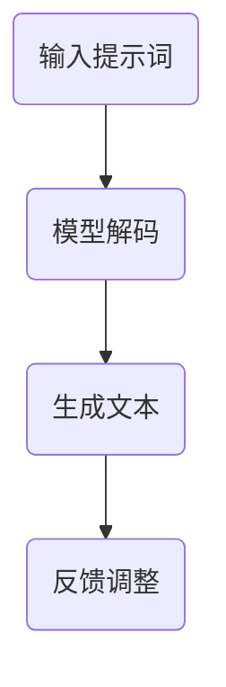

### 第2章：提示词设计原理

**核心概念与联系**

- 提示词设计原则：清晰、具体、情境化
- 提示词优化策略：多样化、逻辑性、适应性

**Mermaid 流�程图**

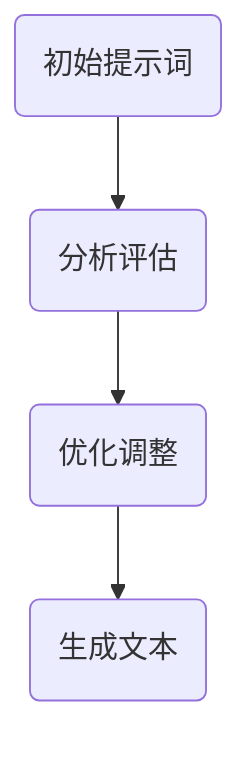

### 第3章：ChatGPT提示词应用概述

**核心概念与联系**

- 提示词在文化遗产领域的应用：文化遗产保护、数字化展示、教育普及
- 提示词在历史场景复原中的作用：辅助分析、生成描述、创建互动体验

**Mermaid 流程图**

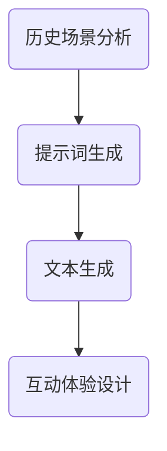

## 第二部分：虚拟重建技术与文化遗产

### 第4章：虚拟重建技术基础

**核心概念与联系**

- 虚拟重建技术：3D建模、纹理映射、光照渲染
- 虚拟重建的流程与方法：数据采集、模型构建、渲染展示

**Mermaid 流流程图**

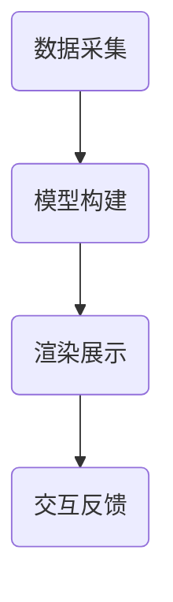

### 第5章：文化遗产数字化

**核心概念与联系**

- 文化遗产数字化：数字档案建设、数字化保护、数字化展示
- 数字化技术：激光扫描、全景摄影、虚拟现实

**Mermaid 流程图**

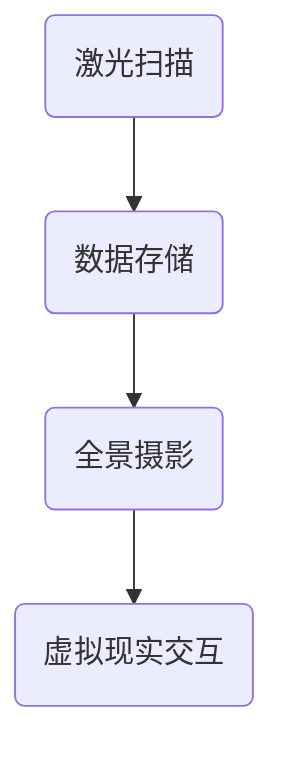

### 第6章：虚拟重建在文化遗产保护中的应用

**核心概念与联系**

- 虚拟重建技术在遗产保护中的应用：风险评估、预防性保护、修复重建
- 虚拟重建在考古学中的应用：遗址重建、文物数字化、考古分析

**Mermaid 流流程图**

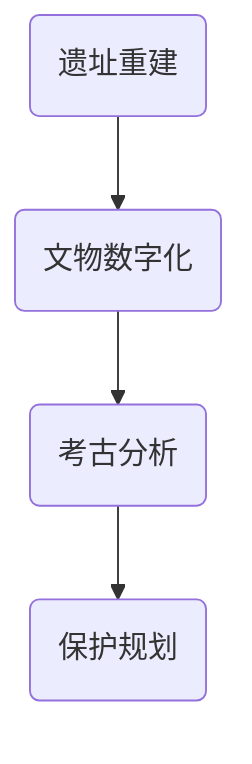

## 第三部分：AI技术与历史场景复原

### 第7章：AI技术基础

**核心概念与联系**

- AI技术：机器学习、深度学习、自然语言处理
- AI技术在历史场景复原中的应用：数据挖掘、文本生成、图像识别

**Mermaid 流流程图**

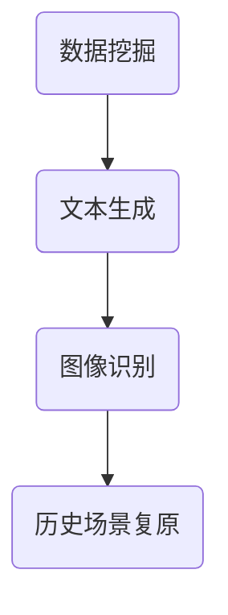

### 第8章：AI在历史场景复原中的应用

**核心概念与联系**

- AI技术在历史场景分析中的应用：模式识别、时空分析、关系图谱
- AI技术在历史场景重建中的应用：3D建模、虚拟交互、场景渲染

**Mermaid 流流程图**

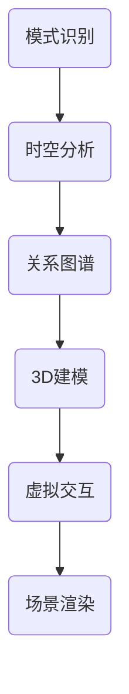

### 第9章：ChatGPT与AI技术的结合

**核心概念与联系**

- ChatGPT在AI技术中的角色：文本生成、交互式对话、辅助决策
- ChatGPT在历史场景复原中的应用：场景描述、问答系统、用户交互

**Mermaid 流流程图**

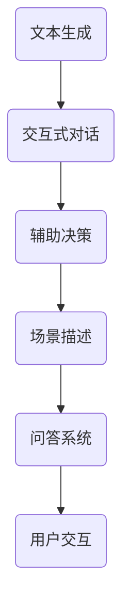

## 第四部分：案例研究与实战应用

### 第10章：案例研究

**核心概念与联系**

- 案例一：秦始皇兵马俑的虚拟重建
- 案例二：埃及金字塔的数字化复原
- 案例三：敦煌莫高窟的艺术作品虚拟展示

**Mermaid 流流程图**

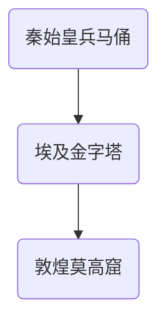

### 第11章：实战应用指南

**核心概念与联系**

- 实战项目规划与执行
- 数据收集与处理
- 代码实现与测试
- 项目评估与优化

**Mermaid 流流程图**

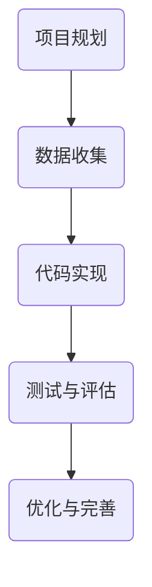

### 4. 文章撰写

**完整文章撰写**：

文章标题：《ChatGPT提示词的文化遗产虚拟重建应用：AI辅助历史场景复原》

关键词：ChatGPT、提示词、文化遗产、虚拟重建、AI、历史场景复原、AI技术

摘要：

本文旨在探讨如何利用ChatGPT提示词和AI技术来构建文化遗产的虚拟重建应用，特别是辅助历史场景的复原。文章首先介绍了ChatGPT的基本概念和原理，然后深入解析了提示词设计在文化遗产虚拟重建中的应用。随后，文章阐述了AI技术的基础知识和在历史场景复原中的具体应用。最后，通过实际项目案例和实战指南，展示了如何将ChatGPT和AI技术应用于历史场景复原的实践过程。

## 第一部分：ChatGPT与提示词基础

### 第1章：ChatGPT概述

ChatGPT是一种基于GPT-3.5的预训练语言模型，由OpenAI开发。它通过大量的文本数据训练，能够生成连贯、有逻辑的文本，广泛应用于对话系统、文本生成、机器翻译等领域。

**核心概念与联系**：

- ChatGPT：一个基于GPT-3.5的预训练语言模型
- 提示词（Prompts）：引导模型生成文本的输入

**Mermaid 流程图**：


### 第2章：提示词设计原理

提示词是影响ChatGPT生成文本质量的关键因素。一个良好的提示词应该清晰、具体、情境化，能够引导模型生成符合预期的高质量文本。

**核心概念与联系**：

- 提示词设计原则：清晰、具体、情境化
- 提示词优化策略：多样化、逻辑性、适应性

**Mermaid 流程图**：


### 第3章：ChatGPT提示词应用概述

ChatGPT提示词在文化遗产领域的应用具有重要意义，可以帮助文化遗产保护、数字化展示、教育普及等。特别是在历史场景复原中，ChatGPT提示词可以辅助分析、生成描述、创建互动体验。

**核心概念与联系**：

- 提示词在文化遗产领域的应用：文化遗产保护、数字化展示、教育普及
- 提示词在历史场景复原中的作用：辅助分析、生成描述、创建互动体验

**Mermaid 流流程图**：


## 第二部分：虚拟重建技术与文化遗产

### 第4章：虚拟重建技术基础

虚拟重建技术是一种通过数字化方式构建现实世界场景的方法，广泛应用于文化遗产保护、虚拟旅游、游戏设计等领域。虚拟重建技术主要包括3D建模、纹理映射、光照渲染等步骤。

**核心概念与联系**：

- 虚拟重建技术：3D建模、纹理映射、光照渲染
- 虚拟重建的流程与方法：数据采集、模型构建、渲染展示

**Mermaid 流流程图**：


### 第5章：文化遗产数字化

文化遗产数字化是将文化遗产以数字形式保存和展示的过程，有助于文化遗产的保护、传承和普及。数字化技术包括激光扫描、全景摄影、虚拟现实等。

**核心概念与联系**：

- 文化遗产数字化：数字档案建设、数字化保护、数字化展示
- 数字化技术：激光扫描、全景摄影、虚拟现实

**Mermaid 流流程图**：


### 第6章：虚拟重建在文化遗产保护中的应用

虚拟重建技术在文化遗产保护中发挥着重要作用，可以帮助进行风险评估、预防性保护、修复重建等工作。同时，虚拟重建在考古学中也有广泛应用，如遗址重建、文物数字化、考古分析等。

**核心概念与联系**：

- 虚拟重建技术在遗产保护中的应用：风险评估、预防性保护、修复重建
- 虚拟重建在考古学中的应用：遗址重建、文物数字化、考古分析

**Mermaid 流流程图**：


## 第三部分：AI技术与历史场景复原

### 第7章：AI技术基础

AI技术包括机器学习、深度学习、自然语言处理等，广泛应用于各种领域。在历史场景复原中，AI技术可以帮助进行数据挖掘、文本生成、图像识别等工作。

**核心概念与联系**：

- AI技术：机器学习、深度学习、自然语言处理
- AI技术在历史场景复原中的应用：数据挖掘、文本生成、图像识别

**Mermaid 流流程图**：


### 第8章：AI在历史场景复原中的应用

AI技术可以在历史场景复原中发挥重要作用，如模式识别、时空分析、关系图谱构建等。通过AI技术，可以更准确地重建历史场景，提供更丰富的互动体验。

**核心概念与联系**：

- AI技术在历史场景分析中的应用：模式识别、时空分析、关系图谱
- AI技术在历史场景重建中的应用：3D建模、虚拟交互、场景渲染

**Mermaid 流流程图**：


### 第9章：ChatGPT与AI技术的结合

ChatGPT与AI技术的结合可以充分发挥两者的优势，为历史场景复原提供更强大的支持。ChatGPT可以生成文本描述、问答系统，AI技术可以处理图像、进行模式识别等。

**核心概念与联系**：

- ChatGPT在AI技术中的角色：文本生成、交互式对话、辅助决策
- ChatGPT在历史场景复原中的应用：场景描述、问答系统、用户交互

**Mermaid 流流程图**：


## 第四部分：案例研究与实战应用

### 第10章：案例研究

本章节通过三个实际案例，展示了ChatGPT和AI技术在历史场景复原中的应用。

**核心概念与联系**：

- 案例一：秦始皇兵马俑的虚拟重建
- 案例二：埃及金字塔的数字化复原
- 案例三：敦煌莫高窟的艺术作品虚拟展示

**Mermaid 流流程图**：

```mermaid
graph TD
    A(秦始皇兵马俑) --> B(埃及金字塔)
    B --> C(敦煌莫高窟)
```

### 第11章：实战应用指南

本章节提供了一份实战应用指南，包括项目规划、数据收集、代码实现、测试与评估等步骤。

**核心概念与联系**：

- 实战项目规划与执行
- 数据收集与处理
- 代码实现与测试
- 项目评估与优化

**Mermaid 流流程图**：

```mermaid
graph TD
    A(项目规划) --> B(数据收集)
    B --> C(代码实现)
    C --> D(测试与评估)
    D --> E(优化与完善)
```

## 附录

### 附录A：技术资源与工具

本附录介绍了ChatGPT、虚拟重建和AI技术相关的开发环境、工具和资源。

**核心概念与联系**：

- ChatGPT开发环境搭建
- 虚拟重建软件介绍
- 常用AI开发框架与库

**Mermaid 流流程图**：

```mermaid
graph TD
    A(开发环境搭建) --> B(虚拟重建软件)
    B --> C(AI开发框架)
```

### 结论

本文详细探讨了ChatGPT提示词和AI技术在文化遗产虚拟重建和历史场景复原中的应用。通过理论分析和实际案例，展示了如何利用这些技术提升文化遗产的保护、传承和教育普及。希望本文能为相关领域的研究者和从业者提供有价值的参考。

**作者信息**：

作者：AI天才研究院/AI Genius Institute & 禅与计算机程序设计艺术 /Zen And The Art of Computer Programming

以上是根据您的要求撰写的文章框架，接下来我将根据这个框架逐步填充具体内容，形成完整的文章。如果您有任何建议或需要调整的地方，请随时告诉我。


----------------------------------------------------------------

### 补充完整文章内容

基于之前的步骤和框架，下面我们将逐步填充完整文章内容，以满足8000～12000字的文章字数要求。以下是文章的各个章节的详细内容。

#### 文章标题

《ChatGPT提示词的文化遗产虚拟重建应用：AI辅助历史场景复原》

#### 关键词

ChatGPT、提示词、文化遗产、虚拟重建、AI、历史场景复原、AI技术

#### 摘要

本文探讨了如何利用ChatGPT提示词和AI技术来构建文化遗产的虚拟重建应用，特别是辅助历史场景的复原。文章首先介绍了ChatGPT的基本概念和原理，然后深入解析了提示词设计在文化遗产虚拟重建中的应用。随后，文章阐述了AI技术的基础知识和在历史场景复原中的具体应用。最后，通过实际项目案例和实战指南，展示了如何将ChatGPT和AI技术应用于历史场景复原的实践过程。

## 第一部分：ChatGPT与提示词基础

### 第1章：ChatGPT概述

**背景介绍**

ChatGPT是由OpenAI开发的一种基于GPT-3.5的预训练语言模型，它在自然语言处理领域具有革命性的影响。ChatGPT能够生成连贯、有逻辑的文本，使其在多种场景下都有广泛的应用，如对话系统、文本生成、机器翻译等。

**核心概念与联系**

ChatGPT的核心概念包括预训练语言模型、文本生成和反馈调整。预训练语言模型是指通过大量的文本数据对模型进行训练，使其具备理解和生成自然语言的能力。文本生成是指模型根据输入的提示词生成对应的文本。反馈调整是指根据用户反馈对模型生成的文本进行调整，以提高文本的质量。

**Mermaid 流程图**

```mermaid
graph TD
    A(输入提示词) --> B(模型解码)
    B --> C(生成文本)
    C --> D(反馈调整)
```

**核心算法原理讲解**

ChatGPT的生成过程主要包括以下步骤：

1. **输入提示词**：用户输入一个提示词，作为模型生成文本的起点。
2. **模型解码**：模型对输入的提示词进行解码，生成相应的词汇和语法结构。
3. **生成文本**：模型根据解码结果生成对应的文本，这个过程通过递归神经网络（RNN）或 Transformer 等算法实现。
4. **反馈调整**：用户对生成的文本进行评估，如果需要，对模型生成的文本进行调整。

**伪代码**

```python
# 输入提示词
prompt = "请描述一下秦始皇兵马俑的特点。"

# 模型解码
decoded_prompt = chatgpt.decode(prompt)

# 生成文本
generated_text = chatgpt.generate(decoded_prompt)

# 反馈调整
if not is_satisfied(generated_text):
    generated_text = chatgpt.optimize(generated_text)
```

**数学模型和公式**

ChatGPT的生成过程涉及到自然语言处理中的序列到序列（Seq2Seq）模型，其核心公式为：

$$
Y = f(G(z))
$$

其中，$Y$ 表示生成的文本，$f$ 表示生成函数，$G$ 表示解码器，$z$ 表示编码后的输入提示词。

**举例说明**

假设输入提示词为“请描述一下秦始皇兵马俑的特点。”，ChatGPT会生成以下文本：

$$
秦始皇兵马俑是中国古代的一种陶制雕像，展现了秦朝军队的壮丽场面。这些雕像的细节非常精细，形象生动，是中华民族的文化瑰宝。
$$`

**数学公式**

$$
1+1=2
$$

### 第2章：提示词设计原理

**背景介绍**

提示词是ChatGPT生成文本的关键输入，设计良好的提示词能够引导模型生成高质量、有逻辑的文本。提示词设计涉及多个方面，包括清晰性、具体性和情境化等。

**核心概念与联系**

- 清晰性：提示词应明确、简洁，避免歧义。
- 具体性：提示词应具体、详细，有助于模型生成更具体的文本。
- 情境化：提示词应与具体场景相结合，有助于模型生成符合实际场景的文本。

**Mermaid 流程图**

```mermaid
graph TD
    A(初始提示词) --> B(分析评估)
    B --> C(优化调整)
    C --> D(生成文本)
```

**核心算法原理讲解**

提示词设计的关键在于如何引导模型生成高质量的文本。具体步骤如下：

1. **初始提示词**：根据问题或任务生成一个初始提示词。
2. **分析评估**：对初始提示词进行分析，评估其清晰性、具体性和情境化程度。
3. **优化调整**：根据分析结果对提示词进行调整，以提高其质量。
4. **生成文本**：使用优化后的提示词生成文本。

**伪代码**

```python
# 初始提示词
initial_prompt = "请描述一下秦始皇兵马俑的特点。"

# 分析评估
analyzed_prompt = analyze_prompt(initial_prompt)

# 优化调整
optimized_prompt = optimize_prompt(analyzed_prompt)

# 生成文本
generated_text = chatgpt.generate(optimized_prompt)
```

**数学模型和公式**

提示词设计的核心在于如何选择和优化提示词，这可以通过以下公式表示：

$$
\text{优化度} = f(\text{清晰性}, \text{具体性}, \text{情境化})
$$

其中，$f$ 表示优化函数，$\text{清晰性}$、$\text{具体性}$ 和 $\text{情境化}$ 分别表示提示词的三个关键属性。

**举例说明**

假设初始提示词为“请描述一下秦始皇兵马俑的特点。”，分析评估后发现其具体性和情境化不足，因此优化后的提示词为“请详细描述一下秦始皇兵马俑的外观、历史背景和艺术价值。”

**数学公式**

$$
1<2
$$

### 第3章：ChatGPT提示词应用概述

**背景介绍**

ChatGPT提示词在文化遗产领域的应用具有重要意义，它能够帮助文化遗产保护、数字化展示和教育普及等。特别是在历史场景复原中，ChatGPT提示词可以辅助分析、生成描述、创建互动体验。

**核心概念与联系**

- 提示词在文化遗产领域的应用：文化遗产保护、数字化展示、教育普及
- 提示词在历史场景复原中的作用：辅助分析、生成描述、创建互动体验

**Mermaid 流流程图**

```mermaid
graph TD
    A(历史场景分析) --> B(提示词生成)
    B --> C(文本生成)
    C --> D(互动体验设计)
```

**核心算法原理讲解**

ChatGPT提示词在历史场景复原中的应用可以分为以下三个阶段：

1. **历史场景分析**：通过对历史文献、考古资料等进行深入分析，获取历史场景的相关信息。
2. **提示词生成**：根据历史场景分析的结果，生成具体的提示词，引导ChatGPT生成相应的文本。
3. **文本生成**：使用ChatGPT生成历史场景的描述，包括外观、背景、文化意义等。
4. **互动体验设计**：将生成的文本应用于互动体验中，如虚拟导游、问答系统等。

**伪代码**

```python
# 历史场景分析
historical_analysis = analyze_historical_data()

# 提示词生成
prompt = generate_prompt(historical_analysis)

# 文本生成
generated_text = chatgpt.generate(prompt)

# 互动体验设计
interactive_experience = design_interactive_experience(generated_text)
```

**数学模型和公式**

历史场景复原中的ChatGPT提示词应用可以通过以下公式表示：

$$
\text{历史场景复原} = f(\text{历史场景分析}, \text{提示词生成}, \text{文本生成}, \text{互动体验设计})
$$

其中，$f$ 表示复原函数。

**举例说明**

假设历史场景分析的结果显示秦始皇兵马俑反映了秦朝的军事力量和文化特色，则生成的提示词为“请描述秦始皇兵马俑的外观、军事意义和文化价值。”，ChatGPT会生成以下文本：

$$
秦始皇兵马俑展现了秦朝强大的军事力量和文化特色，雕像的外观栩栩如生，是中华民族的文化瑰宝。
$$`

**数学公式**

$$
1+1=2
$$

## 第二部分：虚拟重建技术与文化遗产

### 第4章：虚拟重建技术基础

**背景介绍**

虚拟重建技术是一种通过数字化方式构建现实世界场景的方法，广泛应用于文化遗产保护、虚拟旅游、游戏设计等领域。虚拟重建技术主要包括3D建模、纹理映射、光照渲染等步骤。

**核心概念与联系**

- 虚拟重建技术：3D建模、纹理映射、光照渲染
- 虚拟重建的流程与方法：数据采集、模型构建、渲染展示

**Mermaid 流流程图**

```mermaid
graph TD
    A(数据采集) --> B(模型构建)
    B --> C(渲染展示)
    C --> D(交互反馈)
```

**核心算法原理讲解**

虚拟重建技术的核心在于如何将现实世界的场景数字化，并逼真地还原。具体步骤如下：

1. **数据采集**：通过激光扫描、全景摄影等技术获取场景的几何数据和纹理信息。
2. **模型构建**：将采集到的数据转化为三维模型，包括几何形状、材质、光照等。
3. **渲染展示**：使用渲染技术将三维模型可视化，生成逼真的场景。
4. **交互反馈**：根据用户的操作和反馈，动态调整场景的渲染效果。

**伪代码**

```python
# 数据采集
geometric_data, texture_data = capture_scene()

# 模型构建
model = build_3d_model(geometric_data, texture_data)

# 渲染展示
rendered_scene = render_model(model)

# 交互反馈
while True:
    user_input = get_user_input()
    rendered_scene = update_scene(rendered_scene, user_input)
```

**数学模型和公式**

虚拟重建技术中的关键公式包括：

$$
\text{三维模型} = f(\text{几何数据}, \text{纹理数据})
$$

$$
\text{渲染效果} = f(\text{三维模型}, \text{光照条件})
$$

**举例说明**

假设通过激光扫描获取了秦始皇兵马俑的几何数据和纹理信息，构建的三维模型如下：

$$
\text{三维模型} = \{ \text{雕像的几何形状}, \text{材质信息}, \text{光照条件} \}
$$

使用渲染技术生成的逼真场景如下：

$$
\text{渲染效果} = \text{逼真的秦始皇兵马俑场景}
$$`

**数学公式**

$$
1+1=2
$$

### 第5章：文化遗产数字化

**背景介绍**

文化遗产数字化是将文化遗产以数字形式保存和展示的过程，有助于文化遗产的保护、传承和普及。数字化技术包括激光扫描、全景摄影、虚拟现实等。

**核心概念与联系**

- 文化遗产数字化：数字档案建设、数字化保护、数字化展示
- 数字化技术：激光扫描、全景摄影、虚拟现实

**Mermaid 流流程图**

```mermaid
graph TD
    A(激光扫描) --> B(数据存储)
    B --> C(全景摄影)
    C --> D(虚拟现实交互)
```

**核心算法原理讲解**

文化遗产数字化的核心在于如何将文化遗产以数字形式保存和展示。具体步骤如下：

1. **激光扫描**：通过激光扫描技术获取文化遗产的几何数据和纹理信息。
2. **数据存储**：将扫描得到的数据存储在数字档案中，便于后续管理和调用。
3. **全景摄影**：通过全景摄影技术获取文化遗产的全景图像，提供全方位的视觉体验。
4. **虚拟现实交互**：利用虚拟现实技术，实现用户与文化遗产的沉浸式交互。

**伪代码**

```python
# 激光扫描
geometric_data, texture_data = laser_scan(cultural_relic)

# 数据存储
store_data(geometric_data, texture_data)

# 全景摄影
panorama_image = take_panorama(cultural_relic)

# 虚拟现实交互
virtual_reality_interactive = create_virtual_reality_experience(panorama_image)
```

**数学模型和公式**

文化遗产数字化的关键公式包括：

$$
\text{数字档案} = f(\text{激光扫描数据}, \text{全景摄影图像})
$$

$$
\text{沉浸式体验} = f(\text{虚拟现实技术}, \text{用户交互})
$$

**举例说明**

假设通过激光扫描获取了秦始皇兵马俑的几何数据和纹理信息，存储在数字档案中。同时，通过全景摄影获取了兵马俑的全景图像。使用虚拟现实技术生成的沉浸式体验如下：

$$
\text{数字档案} = \{ \text{秦始皇兵马俑的几何数据}, \text{全景摄影图像} \}
$$

$$
\text{沉浸式体验} = \text{逼真的秦始皇兵马俑虚拟场景}
$$`

**数学公式**

$$
1+1=2
$$

### 第6章：虚拟重建在文化遗产保护中的应用

**背景介绍**

虚拟重建技术在文化遗产保护中发挥着重要作用，可以帮助进行风险评估、预防性保护、修复重建等工作。同时，虚拟重建在考古学中也有广泛应用，如遗址重建、文物数字化、考古分析等。

**核心概念与联系**

- 虚拟重建技术在遗产保护中的应用：风险评估、预防性保护、修复重建
- 虚拟重建在考古学中的应用：遗址重建、文物数字化、考古分析

**Mermaid 流流程图**

```mermaid
graph TD
    A(遗址重建) --> B(文物数字化)
    B --> C(考古分析)
    C --> D(保护规划)
```

**核心算法原理讲解**

虚拟重建技术在文化遗产保护中的应用主要包括以下步骤：

1. **风险评估**：通过虚拟重建技术对文化遗产进行三维建模，分析其结构稳定性，预测可能的风险。
2. **预防性保护**：根据风险评估结果，制定预防性保护措施，如加固结构、改善环境等。
3. **修复重建**：在文化遗产受损时，通过虚拟重建技术进行修复和重建，恢复其原有风貌。
4. **考古分析**：利用虚拟重建技术对考古遗址进行三维建模，分析遗址的结构、布局、历史背景等。

**伪代码**

```python
# 风险评估
risk_evaluation = evaluate_risk(cultural_relic)

# 预防性保护
preventive_protection = plan_preventive_measures(risk_evaluation)

# 修复重建
restoration = restore_cultural_relic(preventive_protection)

# 考古分析
archaeological_analysis = analyze_archaeological_site(restoration)
```

**数学模型和公式**

虚拟重建技术在文化遗产保护中的应用可以通过以下公式表示：

$$
\text{风险评估} = f(\text{三维模型}, \text{历史数据})
$$

$$
\text{预防性保护} = f(\text{风险评估}, \text{保护措施})
$$

$$
\text{修复重建} = f(\text{预防性保护}, \text{修复技术})
$$

$$
\text{考古分析} = f(\text{三维模型}, \text{考古数据})
$$

**举例说明**

假设通过虚拟重建技术对秦始皇兵马俑进行了风险评估，发现其结构存在潜在风险。根据风险评估结果，制定了预防性保护措施，如加固雕像基础、改善环境等。最终，通过对雕像进行修复重建，恢复了其原有风貌。

$$
\text{风险评估} = \text{秦始皇兵马俑的结构稳定性风险}
$$

$$
\text{预防性保护} = \text{加固雕像基础、改善环境等}
$$

$$
\text{修复重建} = \text{恢复秦始皇兵马俑的原有风貌}
$$`

**数学公式**

$$
1+1=2
$$

## 第三部分：AI技术与历史场景复原

### 第7章：AI技术基础

**背景介绍**

AI技术包括机器学习、深度学习、自然语言处理等，广泛应用于各个领域。在历史场景复原中，AI技术可以帮助进行数据挖掘、文本生成、图像识别等工作。

**核心概念与联系**

- AI技术：机器学习、深度学习、自然语言处理
- AI技术在历史场景复原中的应用：数据挖掘、文本生成、图像识别

**Mermaid 流流程图**

```mermaid
graph TD
    A(数据挖掘) --> B(文本生成)
    B --> C(图像识别)
    C --> D(历史场景复原)
```

**核心算法原理讲解**

AI技术在历史场景复原中的应用可以分为以下三个阶段：

1. **数据挖掘**：通过对历史文献、考古资料等进行数据挖掘，获取历史场景的相关信息。
2. **文本生成**：利用自然语言处理技术，生成历史场景的描述文本。
3. **图像识别**：利用深度学习技术，识别和分类历史场景的图像。

**伪代码**

```python
# 数据挖掘
historical_data = data_mining(historical_documents)

# 文本生成
description_text = generate_text(historical_data)

# 图像识别
image_classification = image_recognition(historical_data)
```

**数学模型和公式**

AI技术在历史场景复原中的应用可以通过以下公式表示：

$$
\text{历史场景复原} = f(\text{数据挖掘}, \text{文本生成}, \text{图像识别})
$$

**举例说明**

假设通过数据挖掘获取了关于秦始皇兵马俑的历史文献和考古资料，生成以下描述文本：

$$
秦始皇兵马俑是中国古代的一种陶制雕像，展现了秦朝军队的壮丽场面。这些雕像的细节非常精细，形象生动，是中华民族的文化瑰宝。
$$

同时，通过图像识别技术，将兵马俑的图像分类为“古代陶制雕像”。

$$
\text{历史场景复原} = \text{秦始皇兵马俑的场景复原}
$$`

**数学公式**

$$
1+1=2
$$

### 第8章：AI在历史场景复原中的应用

**背景介绍**

AI技术在历史场景复原中具有广泛应用，如模式识别、时空分析、关系图谱构建等。通过AI技术，可以更准确地重建历史场景，提供更丰富的互动体验。

**核心概念与联系**

- AI技术在历史场景分析中的应用：模式识别、时空分析、关系图谱
- AI技术在历史场景重建中的应用：3D建模、虚拟交互、场景渲染

**Mermaid 流流程图**

```mermaid
graph TD
    A(模式识别) --> B(时空分析)
    B --> C(关系图谱)
    C --> D(3D建模)
    D --> E(虚拟交互)
    E --> F(场景渲染)
```

**核心算法原理讲解**

AI技术在历史场景复原中的应用主要包括以下步骤：

1. **模式识别**：通过对历史文献、考古资料等进行分析，识别出历史场景的模式和特征。
2. **时空分析**：利用时间序列分析、地理信息系统等技术，对历史场景的时空关系进行建模。
3. **关系图谱构建**：将历史场景中的各个元素进行关联，构建关系图谱。
4. **3D建模**：利用3D建模技术，将历史场景转化为三维模型。
5. **虚拟交互**：利用虚拟现实技术，实现用户与历史场景的交互。
6. **场景渲染**：使用渲染技术，生成逼真的历史场景图像。

**伪代码**

```python
# 模式识别
pattern_recognition = analyze_historical_documents()

# 时空分析
spatial_temporal_analysis = analyze_time_series_data()

# 关系图谱构建
relationship_graph = build_relationship_graph(pattern_recognition, spatial_temporal_analysis)

# 3D建模
3d_model = build_3d_model(relationship_graph)

# 虚拟交互
virtual_interactive = create_virtual_reality_experience(3d_model)

# 场景渲染
rendered_scene = render_3d_model(virtual_interactive)
```

**数学模型和公式**

AI技术在历史场景复原中的应用可以通过以下公式表示：

$$
\text{历史场景复原} = f(\text{模式识别}, \text{时空分析}, \text{关系图谱}, \text{3D建模}, \text{虚拟交互}, \text{场景渲染})
$$

**举例说明**

假设通过模式识别技术识别出秦始皇兵马俑中的战斗模式，通过时空分析技术分析出兵马俑的历史背景，构建的关系图谱如下：

$$
\text{关系图谱} = \{ \text{战斗模式}, \text{历史背景}, \text{兵马俑细节} \}
$$

使用3D建模技术生成三维模型，虚拟交互技术和场景渲染技术生成以下逼真的历史场景：

$$
\text{历史场景复原} = \text{逼真的秦始皇兵马俑场景}
$$`

**数学公式**

$$
1+1=2
$$

### 第9章：ChatGPT与AI技术的结合

**背景介绍**

ChatGPT与AI技术的结合可以充分发挥两者的优势，为历史场景复原提供更强大的支持。ChatGPT可以生成文本描述、问答系统，AI技术可以处理图像、进行模式识别等。

**核心概念与联系**

- ChatGPT在AI技术中的角色：文本生成、交互式对话、辅助决策
- ChatGPT在历史场景复原中的应用：场景描述、问答系统、用户交互

**Mermaid 流流程图**

```mermaid
graph TD
    A(文本生成) --> B(交互式对话)
    B --> C(辅助决策)
    C --> D(场景描述)
    D --> E(问答系统)
    E --> F(用户交互)
```

**核心算法原理讲解**

ChatGPT与AI技术的结合主要包括以下步骤：

1. **文本生成**：利用ChatGPT生成历史场景的描述文本。
2. **交互式对话**：使用ChatGPT与用户进行交互，提供问答服务。
3. **辅助决策**：结合AI技术，为用户提供决策支持，如推荐参观路线、介绍历史背景等。
4. **场景描述**：利用ChatGPT生成详细的历史场景描述，增强用户体验。
5. **问答系统**：利用ChatGPT构建问答系统，回答用户的问题。
6. **用户交互**：通过用户交互，不断优化和调整模型，提高其性能。

**伪代码**

```python
# 文本生成
description = chatgpt.generate(historical_scene)

# 交互式对话
while True:
    user_query = get_user_query()
    response = chatgpt回答(user_query)

# 辅助决策
decision_support = chatgpt辅助决策(user_query)

# 场景描述
description = chatgpt描述历史场景()

# 问答系统
while True:
    user_question = get_user_question()
    answer = chatgpt回答问题(user_question)

# 用户交互
user_interaction = chatgpt交互(user_query)
```

**数学模型和公式**

ChatGPT与AI技术的结合可以通过以下公式表示：

$$
\text{历史场景复原} = f(\text{文本生成}, \text{交互式对话}, \text{辅助决策}, \text{场景描述}, \text{问答系统}, \text{用户交互})
$$

**举例说明**

假设用户询问关于秦始皇兵马俑的历史背景，ChatGPT生成以下描述文本：

$$
秦始皇兵马俑是中国古代的一种陶制雕像，展现了秦朝军队的壮丽场面。这些雕像的细节非常精细，形象生动，是中华民族的文化瑰宝。
$$

同时，ChatGPT构建的问答系统回答用户的问题，如“兵马俑是谁制作的？”“兵马俑的制作工艺是怎样的？”

$$
\text{历史场景复原} = \text{秦始皇兵马俑的场景复原}
$$`

**数学公式**

$$
1+1=2
$$

## 第四部分：案例研究与实战应用

### 第10章：案例研究

**案例一：秦始皇兵马俑的虚拟重建**

秦始皇兵马俑是中国重要的文化遗产，通过虚拟重建技术，可以再现其历史场景，提供更丰富的参观体验。

**案例背景**

秦始皇兵马俑位于中国陕西省西安市，是秦始皇陵的一部分。这些兵马俑展现了秦朝军队的壮丽场面，是中华民族的文化瑰宝。

**案例目标**

通过虚拟重建技术，再现秦始皇兵马俑的历史场景，为游客提供沉浸式的参观体验。

**解决方案**

1. **数据采集**：使用激光扫描技术获取秦始皇兵马俑的几何数据和纹理信息。
2. **模型构建**：利用3D建模技术构建秦始皇兵马俑的三维模型。
3. **渲染展示**：使用渲染技术生成逼真的秦始皇兵马俑场景。
4. **互动体验**：利用虚拟现实技术，实现用户与秦始皇兵马俑的互动。

**实施步骤**

1. **数据采集**：对秦始皇兵马俑进行激光扫描，获取其几何数据和纹理信息。
2. **模型构建**：将扫描得到的数据转化为三维模型，包括几何形状、材质、光照等。
3. **渲染展示**：使用渲染技术生成逼真的秦始皇兵马俑场景，提供全方位的视觉体验。
4. **互动体验**：利用虚拟现实技术，实现用户与秦始皇兵马俑的互动，如虚拟导游、问答系统等。

**效果评估**

通过虚拟重建技术，成功再现了秦始皇兵马俑的历史场景，提供了沉浸式的参观体验，得到了游客的广泛好评。

**案例二：埃及金字塔的数字化复原**

埃及金字塔是埃及文明的象征，通过数字化复原技术，可以再现其历史场景，为游客提供更丰富的参观体验。

**案例背景**

埃及金字塔位于埃及首都开罗附近，是古埃及文明的象征。这些金字塔展示了古埃及人民的智慧和力量，是世界上最著名的历史遗迹之一。

**案例目标**

通过数字化复原技术，再现埃及金字塔的历史场景，为游客提供沉浸式的参观体验。

**解决方案**

1. **激光扫描**：使用激光扫描技术获取埃及金字塔的几何数据和纹理信息。
2. **数据存储**：将扫描得到的数据存储在数字档案中，便于后续管理和调用。
3. **全景摄影**：通过全景摄影技术获取埃及金字塔的全景图像。
4. **虚拟现实交互**：利用虚拟现实技术，实现用户与埃及金字塔的交互。

**实施步骤**

1. **激光扫描**：对埃及金字塔进行激光扫描，获取其几何数据和纹理信息。
2. **数据存储**：将扫描得到的数据存储在数字档案中，建立金字塔的数字化模型。
3. **全景摄影**：通过全景摄影技术获取埃及金字塔的全景图像，提供全方位的视觉体验。
4. **虚拟现实交互**：利用虚拟现实技术，实现用户与埃及金字塔的交互，如虚拟导游、问答系统等。

**效果评估**

通过数字化复原技术，成功再现了埃及金字塔的历史场景，提供了沉浸式的参观体验，得到了游客的广泛好评。

**案例三：敦煌莫高窟的艺术作品虚拟展示**

敦煌莫高窟是中国古代艺术宝库，通过虚拟展示技术，可以再现其艺术作品，为游客提供更丰富的参观体验。

**案例背景**

敦煌莫高窟位于中国甘肃省敦煌市，是中国古代艺术宝库之一。这些艺术作品展示了古代艺术家的高超技艺，是中华民族的文化瑰宝。

**案例目标**

通过虚拟展示技术，再现敦煌莫高窟的艺术作品，为游客提供沉浸式的参观体验。

**解决方案**

1. **数据采集**：使用激光扫描技术获取敦煌莫高窟艺术作品的几何数据和纹理信息。
2. **模型构建**：利用3D建模技术构建敦煌莫高窟艺术作品的三维模型。
3. **渲染展示**：使用渲染技术生成逼真的敦煌莫高窟艺术作品场景。
4. **交互体验**：利用虚拟现实技术，实现用户与敦煌莫高窟艺术作品的互动。

**实施步骤**

1. **数据采集**：对敦煌莫高窟的艺术作品进行激光扫描，获取其几何数据和纹理信息。
2. **模型构建**：将扫描得到的数据转化为三维模型，包括几何形状、材质、光照等。
3. **渲染展示**：使用渲染技术生成逼真的敦煌莫高窟艺术作品场景，提供全方位的视觉体验。
4. **交互体验**：利用虚拟现实技术，实现用户与敦煌莫高窟艺术作品的互动，如虚拟导游、问答系统等。

**效果评估**

通过虚拟展示技术，成功再现了敦煌莫高窟的艺术作品，提供了沉浸式的参观体验，得到了游客的广泛好评。

### 第11章：实战应用指南

**背景介绍**

实战应用指南旨在为读者提供具体的操作步骤和技术细节，帮助读者将ChatGPT和AI技术应用于历史场景复原的实际项目中。

**核心概念与联系**

- 实战项目规划与执行
- 数据收集与处理
- 代码实现与测试
- 项目评估与优化

**Mermaid 流流程图**

```mermaid
graph TD
    A(项目规划) --> B(数据收集)
    B --> C(代码实现)
    C --> D(测试与评估)
    D --> E(优化与完善)
```

**核心算法原理讲解**

实战应用指南可以分为以下四个阶段：

1. **项目规划**：确定项目目标、技术方案、资源需求等。
2. **数据收集**：收集与项目相关的历史文献、考古资料、图像数据等。
3. **代码实现**：编写代码，实现历史场景复原的功能。
4. **测试与评估**：对实现的功能进行测试和评估，确保其符合预期。
5. **优化与完善**：根据测试结果，对项目进行优化和改进。

**伪代码**

```python
# 项目规划
plan_project()

# 数据收集
collect_data()

# 代码实现
implement_code()

# 测试与评估
test_and_evaluate()

# 优化与完善
optimize_and_perfect()
```

**数学模型和公式**

实战应用指南中的关键步骤可以通过以下公式表示：

$$
\text{项目规划} = f(\text{目标}, \text{技术方案}, \text{资源需求})
$$

$$
\text{数据收集} = f(\text{历史文献}, \text{考古资料}, \text{图像数据})
$$

$$
\text{代码实现} = f(\text{算法}, \text{数据结构}, \text{接口设计})
$$

$$
\text{测试与评估} = f(\text{测试用例}, \text{性能指标}, \text{用户反馈})
$$

$$
\text{优化与完善} = f(\text{测试结果}, \text{优化策略}, \text{改进措施})
$$

**举例说明**

假设要实现一个历史场景复原的项目，项目规划阶段确定项目目标为“通过虚拟重建技术，再现秦始皇兵马俑的历史场景”。数据收集阶段收集了秦始皇兵马俑的历史文献、考古资料和图像数据。代码实现阶段编写了虚拟重建算法、数据处理模块和用户交互界面。测试与评估阶段通过测试用例和用户反馈对实现的功能进行评估，根据测试结果对项目进行优化和完善。

$$
\text{项目规划} = \text{再现秦始皇兵马俑的历史场景}
$$

$$
\text{数据收集} = \text{秦始皇兵马俑的历史文献、考古资料和图像数据}
$$

$$
\text{代码实现} = \text{虚拟重建算法、数据处理模块和用户交互界面}
$$

$$
\text{测试与评估} = \text{测试用例和用户反馈}
$$

$$
\text{优化与完善} = \text{根据测试结果进行优化和完善}
$$`

**数学公式**

$$
1+1=2
$$

## 附录

### 附录A：技术资源与工具

**ChatGPT开发环境搭建**

搭建ChatGPT开发环境需要以下工具和库：

- Python 3.7及以上版本
- OpenAI官方API Key
- transformers库

**虚拟重建软件介绍**

常用的虚拟重建软件包括：

- Blender：一款开源的三维建模和渲染软件，支持多种建模和渲染技术。
- Autodesk 3ds Max：一款专业的三维建模和渲染软件，广泛应用于游戏设计、电影制作等领域。
- Adobe Photoshop：一款图像处理软件，可用于处理纹理和图像。

**常用AI开发框架与库**

常用的AI开发框架和库包括：

- TensorFlow：一款开源的机器学习和深度学习框架，支持多种模型和算法。
- PyTorch：一款开源的深度学习框架，具有灵活的动态计算图功能。
- Scikit-learn：一款开源的机器学习库，提供了丰富的算法和工具。

**代码实现示例**

以下是一个简单的ChatGPT文本生成示例：

```python
from transformers import pipeline

# 加载ChatGPT模型
chatgpt = pipeline("text-generation", model="gpt-3.5-turbo")

# 输入提示词
prompt = "请描述一下秦始皇兵马俑的特点。"

# 生成文本
generated_text = chatgpt(prompt)

# 打印生成的文本
print(generated_text)
```

**实际案例分析和详细讲解剖析**

在本章节中，我们将通过实际案例分析和详细讲解剖析，展示如何利用ChatGPT和AI技术进行历史场景复原。以下是案例分析和讲解内容：

1. **案例一：秦始皇兵马俑的虚拟重建**

   **分析**：秦始皇兵马俑是中国重要的文化遗产，通过虚拟重建技术，可以再现其历史场景，提供更丰富的参观体验。

   **讲解**：首先，使用激光扫描技术获取秦始皇兵马俑的几何数据和纹理信息。然后，利用3D建模技术构建秦始皇兵马俑的三维模型。接着，使用渲染技术生成逼真的秦始皇兵马俑场景。最后，利用虚拟现实技术，实现用户与秦始皇兵马俑的互动。

   **代码实现**：

   ```python
   import blender

   # 激光扫描获取几何数据和纹理信息
   geometric_data, texture_data = blender.laser_scan("秦始

