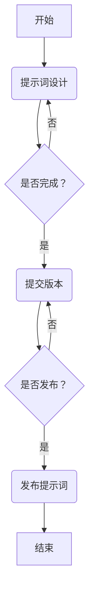

                 


### 文章标题

### ChatGPT提示词的版本控制与迭代优化

---

关键词：
- ChatGPT
- 提示词
- 版本控制
- 迭代优化
- 自然语言处理

---

摘要：
本文旨在探讨ChatGPT中提示词的版本控制与迭代优化问题。首先，我们将介绍ChatGPT及其提示词的基本概念。接着，详细讨论版本控制的基本概念及其在ChatGPT提示词中的应用，包括版本管理策略、变更影响及追踪审计方法。随后，我们将深入讲解迭代优化策略，包括其理论基础、实践流程及评估方法。通过案例研究和最佳实践，本文将展示如何在实际项目中应用这些策略。最后，我们将总结全文，并提出未来发展的展望。

---

### 第1章：ChatGPT及其工作原理

#### 1.1 ChatGPT的起源与背景

ChatGPT是由OpenAI开发的一款基于Transformer模型的大型预训练语言模型。它于2022年11月推出，基于GPT-3.5模型，拥有超过1750亿个参数，是目前最大的自然语言处理模型之一。

ChatGPT的诞生可以追溯到2018年，当时OpenAI发布了GPT-2模型，引起了广泛关注。GPT-2的成功使得OpenAI决定进一步扩展其模型，最终导致了ChatGPT的问世。

#### 1.2 ChatGPT的核心架构

ChatGPT的核心架构基于Transformer模型，这是一种自注意力机制模型，能够有效处理长距离依赖问题。其基本架构包括：

- **输入层**：将文本转化为词向量。
- **Transformer层**：通过多头自注意力机制和前馈神经网络，对输入进行编码。
- **输出层**：将编码后的文本转化为预测的输出文本。

#### 1.3 提示词在ChatGPT中的作用

提示词（Prompts）是引导ChatGPT生成特定类型文本的关键。它们可以是简单的短语或完整的句子，用来提示ChatGPT应该生成什么类型的文本。提示词设计的好坏直接影响ChatGPT生成文本的质量。

提示词的作用包括：

- **引导ChatGPT生成特定类型的文本**。
- **提高文本生成的一致性和可预测性**。
- **帮助ChatGPT更好地理解用户意图**。

### 第2章：提示词的基本概念

#### 2.1 提示词的定义与类型

提示词（Prompt）是一种引导模型生成特定类型文本的输入。根据其形式，提示词可以分为以下几种类型：

- **短语型提示词**：简单的短语，如“请写一篇关于人工智能的短文”。
- **句子型提示词**：完整的句子，如“人工智能正在改变我们的世界，以下是一个例子：…”。
- **问题型提示词**：用于引导模型生成回答，如“请回答以下问题：什么是人工智能？”。

#### 2.2 提示词设计的原则与方法

提示词设计需要遵循以下原则：

- **明确性**：提示词应该清晰明确，避免歧义。
- **多样性**：设计多种类型的提示词，以适应不同的生成任务。
- **适应性**：提示词应能够适应不同的输入文本和用户需求。

提示词设计的方法包括：

- **模板法**：使用固定模板来生成提示词。
- **生成法**：通过自然语言生成技术自动生成提示词。
- **组合法**：结合多种方法来设计提示词。

### 第3章：版本控制的基本概念

#### 3.1 版本控制的必要性

版本控制是软件开发生命周期中不可或缺的一环。它能够确保代码的版本一致性，提高协作效率，降低出错风险。在ChatGPT的提示词开发过程中，版本控制同样至关重要。

#### 3.2 版本控制工具简介

常见的版本控制工具有Git、SVN和Mercurial。其中，Git是最为流行的版本控制工具，因其分布式特性、高效的分支合并机制和强大的网络功能而广受欢迎。

#### 3.3 版本控制流程

版本控制的基本流程包括：

- **提交（Commit）**：将代码更改提交到版本库。
- **分支（Branch）**：创建新的分支以进行独立开发。
- **合并（Merge）**：将分支合并到主分支。
- **发布（Release）**：发布新版本的代码。

### 第4章：ChatGPT提示词的版本控制

#### 4.1 ChatGPT提示词的版本管理策略

ChatGPT提示词的版本管理策略包括：

- **版本迭代**：每次更新提示词时，增加版本号。
- **版本标签**：为重要版本添加标签，便于追踪和管理。
- **版本文档**：记录每次版本更新的详细信息，包括变更内容、原因和影响。

#### 4.2 提示词版本变更的影响

提示词版本变更可能对以下方面产生影响：

- **模型性能**：新的提示词可能导致模型性能的提升或下降。
- **用户体验**：用户可能对新的提示词产生不同的反馈。
- **系统稳定性**：提示词变更可能影响系统的稳定性和可靠性。

#### 4.3 提示词版本追踪与审计

提示词版本的追踪与审计包括：

- **版本追踪**：使用版本控制工具记录每次变更的历史记录。
- **审计与回顾**：定期审查版本变更，确保变更的正确性和合理性。

### 第5章：迭代优化策略

#### 5.1 迭代优化的理论基础

迭代优化是一种逐步改进方法，通过反复迭代来优化目标函数。其主要理论基础包括：

- **目标函数**：定义优化问题的目标函数。
- **迭代过程**：描述迭代的步骤和方法。
- **收敛性**：确保迭代过程能够收敛到最优解。

#### 5.2 迭代优化的目标与策略

迭代优化的目标包括：

- **提高模型性能**：通过优化提示词来提高模型的文本生成质量。
- **提高用户体验**：优化提示词以提供更符合用户需求的文本生成结果。

迭代优化的策略包括：

- **增量优化**：逐步调整提示词，每次调整一小部分。
- **全局优化**：同时调整多个提示词，以获得更好的全局性能。

#### 5.3 迭代优化的评估方法

迭代优化的评估方法包括：

- **定量评估**：使用量化指标（如文本质量评分、用户满意度等）来评估优化效果。
- **定性评估**：通过用户反馈和专家评审来评估优化效果。

### 第6章：ChatGPT提示词的迭代优化实践

#### 6.1 提示词迭代优化的流程

提示词迭代优化的流程包括：

- **需求分析**：确定优化目标和需求。
- **数据准备**：准备用于优化的数据集。
- **提示词设计**：设计初始提示词。
- **模型训练**：使用初始提示词训练模型。
- **性能评估**：评估模型性能。
- **优化调整**：根据评估结果调整提示词。
- **重复迭代**：重复步骤4-6，直至达到优化目标。

#### 6.2 提示词迭代优化的案例分析

在本案例中，我们将以一个实际项目为例，展示如何进行提示词迭代优化。

- **项目背景**：该项目旨在使用ChatGPT生成高质量的新闻报道。
- **初始提示词**：设计初始提示词，如“请生成一篇关于人工智能的新闻报道”。
- **模型训练**：使用初始提示词训练模型。
- **性能评估**：评估模型生成新闻的质量，发现存在重复性和冗余性问题。
- **优化调整**：调整提示词，增加特定关键词和限制性条件，如“请生成一篇关于人工智能在医疗领域的最新进展的新闻报道”。
- **重复迭代**：重复性能评估和优化调整，直至生成新闻的质量达到预期。

#### 6.3 提示词迭代优化的工具与资源

提示词迭代优化需要使用以下工具和资源：

- **版本控制工具**：如Git，用于管理提示词版本。
- **文本编辑工具**：如Visual Studio Code，用于编写和编辑提示词。
- **自然语言处理库**：如Hugging Face的Transformers库，用于训练和评估模型。
- **评估指标**：如ROUGE、BLEU等，用于评估文本生成质量。
- **用户反馈**：收集用户反馈，以指导提示词优化。

### 第7章：总结与展望

#### 7.1 ChatGPT提示词版本控制与迭代优化的关键点

- **版本管理**：确保提示词的版本一致性，便于追踪和管理。
- **迭代优化**：通过反复迭代，逐步优化提示词，提高模型性能和用户体验。

#### 7.2 未来发展趋势与展望

未来，ChatGPT提示词的版本控制和迭代优化将继续发展，主要包括：

- **自动化优化**：开发自动化工具，实现提示词的自动化优化。
- **多模态融合**：将文本、图像和音频等多种模态的信息融合到提示词中，提高文本生成质量。
- **个性化优化**：根据用户需求和偏好，个性化地优化提示词。

---

## 附录

### 附录A：Mermaid流程图示例



### 附录B：伪代码示例

```python
def train_model(prompt):
    # 将提示词转换为编码
    encoded_prompt = encode_prompt(prompt)
    
    # 使用编码提示词训练模型
    model.train(encoded_prompt)
    
    # 评估模型性能
    performance = model.evaluate(encoded_prompt)
    
    return performance
```

### 附录C：LaTeX公式示例

```latex
$$
\frac{d}{dx}\left(\frac{f(x)}{g(x)}\right) = \frac{g(x)f'(x) - f(x)g'(x)}{[g(x)]^2}
$$

$$
\sum_{i=1}^{n} x_i = \sum_{i=1}^{n} i^2
$$
```

### 附录D：最佳实践 Tips

- **定期备份**：定期备份提示词和版本信息，以防止数据丢失。
- **代码审查**：进行代码审查，确保提示词的代码质量和可维护性。
- **用户反馈**：积极收集用户反馈，以指导提示词的优化方向。

---

## 作者信息

作者：AI天才研究院/AI Genius Institute & 禅与计算机程序设计艺术 /Zen And The Art of Computer Programming

### 第1章：ChatGPT及其工作原理

#### 1.1 ChatGPT的起源与背景

ChatGPT是由OpenAI开发的一款基于Transformer模型的大型预训练语言模型。它的前身是GPT-3，于2020年发布，拥有1750亿个参数，是当时最大的自然语言处理模型。ChatGPT于2022年11月发布，是基于GPT-3.5模型，进一步优化了模型的性能和响应速度。

ChatGPT的开发背景源于自然语言处理（NLP）领域的一次重大突破。Transformer模型的出现使得NLP模型能够在处理长文本和长距离依赖问题上取得了显著进展。基于Transformer模型的GPT-3模型实现了前所未有的文本生成能力，引起了学术界和工业界的广泛关注。OpenAI在GPT-3的基础上进行了进一步的研究和优化，最终推出了ChatGPT。

#### 1.2 ChatGPT的核心架构

ChatGPT的核心架构基于Transformer模型，这是一种自注意力机制模型，能够有效处理长距离依赖问题。其基本架构包括输入层、Transformer层和输出层。

- **输入层**：输入层将文本转化为词向量。具体来说，文本首先被分词，然后每个词被映射为一个词向量。这些词向量被输入到模型的下一层。

- **Transformer层**：Transformer层是ChatGPT的核心部分。它由多个自注意力模块和前馈神经网络组成。自注意力模块通过计算每个词向量与其他词向量之间的相似性，从而生成一个新的词向量。前馈神经网络则对自注意力模块的输出进行进一步处理。

- **输出层**：输出层将编码后的文本转化为预测的输出文本。具体来说，输出层首先生成一个概率分布，然后从这个分布中抽取一个词，作为生成文本的第一个词。接着，使用这个词更新概率分布，并重复这个过程，直到生成完整的文本。

#### 1.3 提示词在ChatGPT中的作用

提示词（Prompt）是引导ChatGPT生成特定类型文本的关键。它们可以是简单的短语或完整的句子，用来提示ChatGPT应该生成什么类型的文本。提示词设计的好坏直接影响ChatGPT生成文本的质量。

提示词在ChatGPT中的作用包括：

1. **引导ChatGPT生成特定类型的文本**：例如，当提示词是“请写一篇关于人工智能的短文”时，ChatGPT会生成一篇关于人工智能的短文。

2. **提高文本生成的一致性和可预测性**：通过设计良好的提示词，可以确保ChatGPT生成文本的一致性和可预测性。例如，当提示词是“请写一篇关于机器学习的论文”时，ChatGPT会生成一篇结构清晰、逻辑连贯的论文。

3. **帮助ChatGPT更好地理解用户意图**：提示词可以帮助ChatGPT更好地理解用户的意图，从而生成更符合用户需求的文本。例如，当提示词是“请写一篇关于机器学习在医疗领域的应用”时，ChatGPT会生成一篇专注于机器学习在医疗领域应用的论文。

### 第2章：提示词的基本概念

#### 2.1 提示词的定义与类型

提示词（Prompt）是一种引导模型生成特定类型文本的输入。它可以是一个单词、一个短语或一个完整的句子，其目的是为模型提供生成任务的上下文。根据形式和用途，提示词可以分为以下几种类型：

1. **短语型提示词**：这类提示词通常包含一个或多个关键短语，用以指示模型生成文本的主题或类型。例如，“请写一篇关于环境保护的短文”。

2. **句子型提示词**：这种类型的提示词是一整个句子，它不仅提供了文本的主题，还可能提供了一些具体的指导信息。例如，“请你根据下面提供的背景信息，写一篇关于人工智能发展的文章”。

3. **问题型提示词**：这类提示词以问题的形式出现，目的是让模型生成问题的答案。例如，“什么是机器学习的核心目标？”。

4. **指令型提示词**：这类提示词以指令的方式出现，要求模型执行特定的任务。例如，“请你用200字以内描述什么是深度学习”。

5. **上下文型提示词**：这种类型的提示词提供了大量的上下文信息，以帮助模型更好地理解生成任务。例如，“以下是一段关于量子计算的背景信息，请你根据这段信息写一篇相关的科普文章”。

#### 2.2 提示词设计的原则与方法

提示词设计的原则和方法对于提高文本生成质量至关重要。以下是一些关键的原则和方法：

1. **明确性**：提示词应清晰明确，避免歧义。使用简单的语言和具体的词汇可以减少理解上的困难。

2. **针对性**：根据模型的能力和任务需求，设计针对性的提示词。例如，对于大型语言模型，可以使用更广泛的词汇和更复杂的句子结构。

3. **一致性**：确保提示词在不同场景下能够产生一致的输出。这需要考虑提示词与模型训练数据的匹配度。

4. **多样性**：设计多样化的提示词，以避免模型产生模式化输出。这有助于提高模型应对各种不同输入的能力。

5. **适应性**：提示词应具有一定的适应性，能够适应不同的输入文本和用户需求。

提示词设计的方法包括：

1. **模板法**：使用固定的模板来生成提示词。这种方法简单且易于实施，适用于许多常见的文本生成任务。

2. **生成法**：使用自然语言生成（NLG）技术自动生成提示词。这种方法可以根据具体需求动态生成提示词，提高灵活性。

3. **组合法**：结合多种方法来设计提示词，例如，先使用模板法生成一个基础提示词，然后根据具体任务使用生成法进行微调。

### 第3章：版本控制的基本概念

#### 3.1 版本控制的必要性

版本控制是软件开发过程中的关键环节，它确保了代码的版本一致性，提高了协作效率，降低了出错风险。对于ChatGPT这样的复杂系统，版本控制尤为重要。

- **代码版本一致性**：版本控制系统能够确保不同的团队成员使用的是同一版本的代码，避免了因代码不一致导致的问题。

- **协作效率**：版本控制提供了便捷的分支和合并机制，使得团队成员可以独立开发，并在合适的时候合并代码，提高了整体开发效率。

- **错误追踪**：版本控制系统能够记录每次代码变更的历史记录，使得错误追踪变得更加容易，可以快速定位问题发生的版本。

#### 3.2 版本控制工具简介

常见的版本控制工具有Git、SVN和Mercurial等。其中，Git是最为流行的版本控制工具，因为它具有以下优势：

- **分布式存储**：Git将代码存储在各个开发者的本地仓库中，使得开发者在没有网络连接的情况下也可以正常工作。

- **高效的分支合并机制**：Git的分支合并机制非常高效，能够处理复杂的合并情况，减少了合并冲突的风险。

- **强大的网络功能**：Git支持分布式版本库，使得团队成员可以方便地共享代码和协作开发。

#### 3.3 版本控制流程

版本控制的基本流程包括提交（Commit）、分支（Branch）、合并（Merge）和发布（Release）等几个步骤：

- **提交（Commit）**：开发者在本地仓库中对代码进行更改后，使用`git commit`命令将更改提交到本地仓库。每次提交都会生成一个提交记录，记录了提交的代码内容和提交者的信息。

- **分支（Branch）**：为了独立开发某个功能或修复某个问题，开发者可以创建一个新的分支。分支允许开发者在一个独立的环境中工作，不会影响到主分支的代码。

- **合并（Merge）**：当开发者在分支上完成了工作后，可以将分支合并到主分支。合并过程中，Git会尝试自动合并代码，并在出现冲突时提示开发者手动解决。

- **发布（Release）**：在完成合并并确保代码质量后，开发者可以发布新的版本。发布过程通常包括更新版本号、创建标签（Tag）和发布代码到版本库或软件包仓库。

### 第4章：ChatGPT提示词的版本控制

#### 4.1 ChatGPT提示词的版本管理策略

ChatGPT提示词的版本管理策略是确保提示词的版本一致性、可追踪性和可维护性的关键。以下是一些常见的版本管理策略：

- **版本迭代**：每次对提示词进行更新时，增加版本号。版本号通常遵循语义化版本控制（Semantic Versioning），例如`1.0.0`、`1.0.1`等。

- **版本标签**：为重要版本添加标签，便于追踪和管理。标签通常包含版本号和描述，例如`v1.0.0`或`release-1.0.0`。

- **版本文档**：记录每次版本更新的详细信息，包括变更内容、原因和影响。版本文档可以帮助团队了解每个版本的变更历史，便于后续的维护和调试。

#### 4.2 提示词版本变更的影响

提示词版本变更可能对ChatGPT的性能和用户体验产生重要影响。以下是一些可能的影响：

- **模型性能**：新的提示词可能导致模型性能的提升或下降。例如，更精确的提示词可能导致模型生成文本的质量提高，而过于模糊的提示词可能导致模型生成文本的质量下降。

- **用户体验**：用户可能对新的提示词产生不同的反馈。一些用户可能喜欢新的提示词，因为它们能提供更符合用户需求的文本生成结果，而另一些用户可能不喜欢新的提示词，认为它们不够准确或不够自然。

- **系统稳定性**：提示词变更可能影响系统的稳定性和可靠性。例如，如果新的提示词导致模型出现异常，可能会影响整个系统的正常运行。

#### 4.3 提示词版本追踪与审计

提示词版本的追踪与审计是确保版本控制有效性的关键。以下是一些常见的追踪与审计方法：

- **版本追踪**：使用版本控制工具记录每次变更的历史记录。Git等版本控制工具提供了丰富的命令和功能，可以帮助开发者追踪代码和提示词的变更历史。

- **审计与回顾**：定期审查版本变更，确保变更的正确性和合理性。审计过程中，可以检查每个版本的变更记录，评估变更的影响，并提出改进建议。

### 第5章：迭代优化策略

#### 5.1 迭代优化的理论基础

迭代优化是一种逐步改进方法，通过反复迭代来优化目标函数。其主要理论基础包括：

- **目标函数**：目标函数是优化问题的核心，它定义了优化的目标和标准。在ChatGPT提示词的优化中，目标函数可能包括文本生成质量、用户满意度等。

- **迭代过程**：迭代过程是逐步优化目标函数的过程。每次迭代包括以下几个步骤：

  1. **评估当前状态**：评估当前状态的目标函数值，确定当前状态的优劣。

  2. **选择操作**：选择一个或多个操作，这些操作可能导致状态的变化。

  3. **执行操作**：执行选择的操作，更新当前状态。

  4. **评估新状态**：评估新状态的目标函数值，确定新状态的优劣。

  5. **更新策略**：根据评估结果，更新优化策略，以指导后续的迭代过程。

- **收敛性**：收敛性是迭代优化的重要性质，它确保迭代过程能够收敛到最优解。常见的收敛性准则包括：

  1. **局部收敛性**：迭代过程能够在某个局部区域内收敛到最优解。

  2. **全局收敛性**：迭代过程能够在整个定义域内收敛到最优解。

#### 5.2 迭代优化的目标与策略

迭代优化的目标包括：

- **提高模型性能**：通过优化提示词，提高ChatGPT的文本生成质量，使其能够生成更准确、更自然、更有价值的文本。

- **提高用户体验**：优化提示词，提高用户对ChatGPT的满意度，使其能够更好地满足用户的需求。

- **减少错误率**：优化提示词，降低ChatGPT生成文本中的错误率，提高系统的稳定性和可靠性。

迭代优化的策略包括：

- **增量优化**：每次迭代只对提示词进行微小的调整，逐步优化模型性能。这种方法可以减少对模型的不确定性，降低优化过程中的风险。

- **全局优化**：同时调整多个提示词，以获得更好的全局性能。这种方法可以快速提高模型性能，但可能增加优化过程中的复杂度和风险。

- **混合优化**：结合增量优化和全局优化的优点，采用适当的优化策略。这种方法可以在确保模型性能稳步提升的同时，控制优化过程中的风险。

#### 5.3 迭代优化的评估方法

迭代优化的评估方法包括定量评估和定性评估：

- **定量评估**：使用量化指标对模型的性能进行评估。常见的量化指标包括：

  1. **文本生成质量**：使用诸如ROUGE、BLEU等指标来评估文本生成的质量。

  2. **用户满意度**：通过用户调查或反馈来评估用户对文本生成的满意度。

  3. **错误率**：评估模型生成文本中的错误率，包括语法错误、事实错误等。

- **定性评估**：通过专家评审和用户反馈来评估模型生成的文本。这种方法可以提供更全面、更深入的评价，但通常需要更多的人力和时间。

### 第6章：ChatGPT提示词的迭代优化实践

#### 6.1 提示词迭代优化的流程

提示词迭代优化的流程通常包括以下几个步骤：

- **需求分析**：确定优化目标和需求。这包括分析用户需求、模型性能目标和现有提示词的问题。

- **数据准备**：准备用于优化的数据集。这包括收集相关的文本数据，并进行预处理，如分词、去噪等。

- **初始提示词设计**：设计初始的提示词。这通常是基于对需求分析的理解和现有提示词的改进。

- **模型训练**：使用初始提示词训练模型。这包括将提示词转换为模型的输入，并进行训练，以优化模型的参数。

- **性能评估**：评估模型生成文本的性能。这通常使用定量评估指标，如ROUGE、BLEU等。

- **优化调整**：根据性能评估结果，调整提示词。这可能包括调整提示词的长度、结构、关键词等。

- **重复迭代**：重复性能评估和优化调整，直到达到优化目标。这个过程可能需要多次迭代，以逐步提高模型性能。

#### 6.2 提示词迭代优化的案例分析

以下是一个关于ChatGPT提示词迭代优化的案例：

- **项目背景**：该项目旨在使用ChatGPT生成高质量的新闻报道。

- **需求分析**：项目需求是生成内容丰富、结构清晰、信息准确的新闻报道。

- **数据准备**：收集了大量的新闻报道文本，并进行了预处理，如分词、去噪等。

- **初始提示词设计**：初始提示词为“请生成一篇关于人工智能的新闻报道”。

- **模型训练**：使用初始提示词训练ChatGPT模型。

- **性能评估**：评估模型生成文本的质量，发现存在重复性和冗余性问题。

- **优化调整**：调整提示词，增加特定关键词和限制性条件，如“请生成一篇关于人工智能在医疗领域的最新进展的新闻报道”。

- **重复迭代**：重复性能评估和优化调整，直至生成新闻的质量达到预期。

#### 6.3 提示词迭代优化的工具与资源

提示词迭代优化需要使用以下工具和资源：

- **版本控制工具**：如Git，用于管理提示词版本。

- **文本编辑工具**：如Visual Studio Code，用于编写和编辑提示词。

- **自然语言处理库**：如Hugging Face的Transformers库，用于训练和评估模型。

- **评估指标**：如ROUGE、BLEU等，用于评估文本生成质量。

- **用户反馈**：收集用户反馈，以指导提示词优化。

### 第7章：总结与展望

#### 7.1 ChatGPT提示词版本控制与迭代优化的关键点

- **版本管理**：确保提示词的版本一致性，便于追踪和管理。

- **迭代优化**：通过反复迭代，逐步优化提示词，提高模型性能和用户体验。

#### 7.2 未来发展趋势与展望

未来，ChatGPT提示词的版本控制和迭代优化将继续发展，主要包括：

- **自动化优化**：开发自动化工具，实现提示词的自动化优化。

- **多模态融合**：将文本、图像和音频等多种模态的信息融合到提示词中，提高文本生成质量。

- **个性化优化**：根据用户需求和偏好，个性化地优化提示词。

### 附录

#### 附录A：Mermaid流程图示例


#### 附录B：伪代码示例

```python
def train_model(prompt):
    # 将提示词转换为编码
    encoded_prompt = encode_prompt(prompt)
    
    # 使用编码提示词训练模型
    model.train(encoded_prompt)
    
    # 评估模型性能
    performance = model.evaluate(encoded_prompt)
    
    return performance
```

#### 附录C：LaTeX公式示例

```latex
$$
\frac{d}{dx}\left(\frac{f(x)}{g(x)}\right) = \frac{g(x)f'(x) - f(x)g'(x)}{[g(x)]^2}
$$

$$
\sum_{i=1}^{n} x_i = \sum_{i=1}^{n} i^2
$$
```

#### 附录D：最佳实践 Tips

- **定期备份**：定期备份提示词和版本信息，以防止数据丢失。

- **代码审查**：进行代码审查，确保提示词的代码质量和可维护性。

- **用户反馈**：积极收集用户反馈，以指导提示词优化。

### 作者信息

作者：AI天才研究院/AI Genius Institute & 禅与计算机程序设计艺术 /Zen And The Art of Computer Programming

## 引用

- [OpenAI, "ChatGPT: A Conversational AI Assistant"](https://openai.com/blog/chatgpt/)
- [DeepLearningAI, "Transformers: State-of-the-Art Pre-trained Models for Natural Language Processing"](https://huggingface.co/transformers/)
- [Git, "Git - 简明教程"](https://git-scm.com/docs/gittutorial-en)

