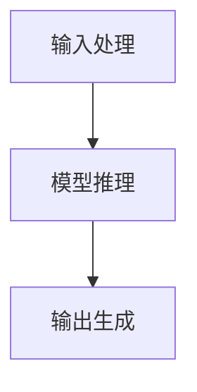
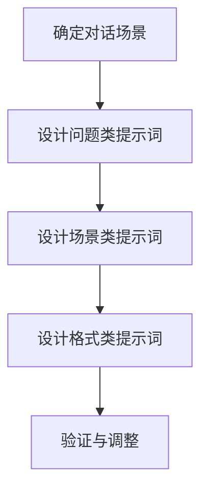
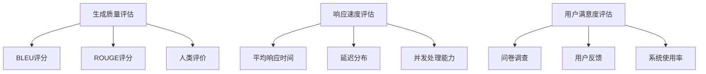

                 


### 第1章 引言

#### 1.1 书籍主题与目标

本篇技术博客旨在深入探讨ChatGPT提示词的终身学习模式，以及这一模式如何推动AI对话系统的持续进化。ChatGPT作为OpenAI推出的强大语言模型，凭借其卓越的对话生成能力在人工智能领域引起了广泛关注。本书的目标是向读者介绍ChatGPT的工作原理、提示词设计、优化方法以及终身学习模式，并展示其在实际应用中的潜力。

#### 1.1.1 ChatGPT的背景

ChatGPT是基于GPT模型（Generative Pre-trained Transformer）开发的一款预训练语言模型。GPT模型采用了Transformer架构，这是一种在机器翻译、文本生成等任务中表现出色的深度学习模型。ChatGPT在推出后迅速成为最受欢迎的AI对话系统之一，其强大的语言理解和生成能力使其在客服、教育、聊天机器人等多个领域表现出色。

#### 1.1.2 提示词在AI对话系统中的应用

提示词（Prompt）是AI对话系统与用户交互的关键桥梁。通过设计合适的提示词，可以引导模型生成符合用户需求的对话内容。提示词的设计直接影响到对话系统的生成质量、响应速度和用户满意度。在本篇博客中，我们将详细讨论提示词的定义、分类及其优化方法。

#### 1.1.3 终身学习模式的概念

终身学习模式指的是AI模型在部署后不断接收新数据、进行学习更新的过程。这种模式使得AI系统能够持续进化，以适应不断变化的环境和用户需求。在本篇博客中，我们将探讨如何将终身学习模式应用于ChatGPT，以及这一模式对AI对话系统的优化和提升。

### 第2章 ChatGPT概述

#### 2.1 ChatGPT的架构与原理

ChatGPT采用了GPT模型，该模型是一种基于Transformer架构的预训练语言模型。本节将介绍GPT模型的基本原理和ChatGPT的工作流程，帮助读者了解ChatGPT的核心技术。

##### 2.1.1 GPT模型的介绍

GPT模型是由OpenAI开发的一种预训练语言模型，它采用了Transformer架构，能够对大规模文本数据进行预训练。GPT模型通过学习文本的上下文关系，能够生成连贯、自然的语言。

##### 2.1.2 Transformer架构

Transformer架构是一种基于自注意力机制的深度神经网络架构，它在机器翻译、文本生成等任务中表现出色。Transformer通过自注意力机制，能够自动学习输入文本之间的长距离依赖关系。

##### 2.1.3 ChatGPT的特点

ChatGPT具有以下特点：

1. **强大的语言理解能力**：ChatGPT能够理解并生成自然流畅的语言，这使得它能够与用户进行有效的对话。
2. **自适应生成能力**：ChatGPT可以根据提示词生成不同的对话内容，以适应不同的场景和用户需求。
3. **高效的处理速度**：ChatGPT采用了优化后的算法，能够在较短时间内生成高质量的对话内容。

##### 2.1.4 ChatGPT的工作流程

ChatGPT的工作流程主要包括以下几个步骤：

1. **输入处理**：将用户输入的提示词编码为模型能够理解的向量表示。
2. **模型推理**：使用预训练的GPT模型对输入向量进行处理，生成对话内容。
3. **输出生成**：将生成的对话内容解码为自然语言文本，返回给用户。

**2.1.5 ChatGPT的核心概念与架构 Mermaid 流程图**

下面是一个简化的ChatGPT架构的Mermaid流程图：



#### 2.1.6 ChatGPT的进化与优化

ChatGPT的进化与优化是一个持续的过程。通过不断地接收新数据、进行学习更新，ChatGPT能够不断提升自身的性能。本节将简要介绍ChatGPT的进化与优化策略。

1. **数据更新**：定期收集用户反馈和新的对话数据，用于模型的更新和优化。
2. **模型迭代**：通过模型迭代，ChatGPT能够逐步提升对话生成的质量和效率。
3. **用户反馈**：利用用户反馈，ChatGPT能够调整自身的生成策略，以更好地满足用户需求。

### 第3章 提示词设计基础

#### 3.1 提示词的定义与分类

提示词是AI对话系统中引导模型生成对话内容的关键要素。一个设计良好的提示词能够显著提升对话系统的性能。本节将介绍提示词的定义、分类及其在设计中的关键作用。

##### 3.1.1 提示词的定义

提示词是一种用于指导AI模型生成对话内容的文本或代码片段。它通常包含用户问题的摘要、对话场景的描述以及预期的输出格式。

##### 3.1.2 提示词的分类

根据用途和形式，提示词可以分为以下几类：

1. **问题类提示词**：用于引导模型回答特定问题，如“请问您有什么问题需要帮助？”
2. **场景类提示词**：用于描述对话的场景和情境，如“在一个餐厅里，客人需要点餐。”
3. **格式类提示词**：用于指定对话内容的格式和结构，如“请列出以下物品：苹果、香蕉、橙子。”

##### 3.1.3 提示词的作用

提示词在AI对话系统中的作用至关重要：

1. **指导模型生成**：提示词为模型提供了对话生成的方向和上下文，有助于生成更加相关和自然的对话内容。
2. **优化生成质量**：通过精心设计的提示词，可以显著提升对话生成的质量，减少冗余和不相关的回答。
3. **提高响应速度**：合理的提示词设计有助于模型快速定位和生成对话内容，提高系统的响应速度。

**3.1.4 提示词设计的Mermaid流程图**

以下是一个简化的提示词设计流程图：



### 第4章 提示词的优化方法

#### 4.1 提示词优化的目标

提示词优化是提升AI对话系统性能的关键环节。本节将探讨提示词优化的目标，包括提高生成质量、增强响应速度和提升用户满意度。

##### 4.1.1 提高生成质量

生成质量的提升是提示词优化的重要目标。优化的提示词能够引导模型生成更加自然、连贯和相关的对话内容，从而提高用户体验。以下是一些常用的优化方法：

1. **增加上下文信息**：通过提供更多上下文信息，帮助模型更好地理解用户意图，生成更加相关的回答。
2. **使用明确指令**：明确地指示模型生成特定类型的回答，如“请提供一个解决问题的步骤”。
3. **避免冗余内容**：去除不必要的重复和冗余信息，使对话内容更加简洁和清晰。

##### 4.1.2 增强响应速度

响应速度是用户体验的重要组成部分。优化提示词可以减少模型处理时间和生成时间，提高系统的响应速度。以下是一些优化方法：

1. **简化提示词结构**：简化提示词的结构，减少模型需要解析和处理的信息量。
2. **使用常见词汇**：使用常见的词汇和短语，使模型能够快速理解和生成对话内容。
3. **预训练数据优化**：通过优化预训练数据集，减少模型在生成过程中所需的计算量。

##### 4.1.3 提升用户满意度

用户满意度是评价AI对话系统性能的关键指标。优化的提示词能够更好地满足用户需求，提高用户对系统的满意度。以下是一些优化方法：

1. **用户反馈机制**：收集用户反馈，根据用户评价对提示词进行调整和优化。
2. **个性化生成**：根据用户的兴趣、偏好和历史对话记录，生成更加个性化的对话内容。
3. **情感分析**：分析用户情感，生成情感匹配的对话内容，提高用户的情感体验。

**4.1.4 提示词优化算法伪代码**

以下是一个简化的提示词优化算法伪代码：

```python
def optimize_prompt(prompt):
    # 增加上下文信息
    prompt = add_context_info(prompt)
    
    # 使用明确指令
    prompt = replace_generic_instructions(prompt)
    
    # 避免冗余内容
    prompt = remove_redundant_info(prompt)
    
    return prompt
```

### 第5章 终身学习模式原理

#### 5.1 终身学习模式的定义

终身学习模式是指AI模型在部署后不断接收新数据、进行学习更新的过程。这种模式使得模型能够持续进化，以适应不断变化的环境和用户需求。在本节中，我们将介绍终身学习模式的基本概念和核心组成部分。

##### 5.1.1 终身学习的意义

终身学习的意义在于：

1. **提升模型性能**：通过不断学习和更新，模型能够不断提高自身的性能，生成更加准确和自然的对话内容。
2. **适应新场景**：随着环境和用户需求的变化，模型需要能够适应新的场景和任务，终身学习模式能够实现这一目标。
3. **增强用户体验**：持续学习和更新使得模型能够更好地满足用户需求，提高用户满意度。

##### 5.1.2 终身学习模式的基本框架

终身学习模式通常包括以下几个基本组成部分：

1. **数据收集**：定期收集用户反馈和新对话数据，用于模型的更新和优化。
2. **数据预处理**：对收集到的数据进行清洗、标注和预处理，以便模型能够有效学习和更新。
3. **模型更新**：利用新的数据进行模型的迭代训练，以提升模型的性能。
4. **模型评估**：对更新后的模型进行评估，以验证模型的性能提升和稳定性。

**5.1.3 学习策略的选择**

在终身学习模式中，选择合适的学习策略至关重要。以下是一些常用的学习策略：

1. **在线学习**：模型在实时接收新数据的同时进行学习，适用于数据流处理和快速响应场景。
2. **离线学习**：模型在批处理新数据后进行学习，适用于数据量较大、学习时间较长的场景。
3. **增量学习**：模型利用已有的知识和经验，对新数据进行学习和更新，适用于模型维护和迭代场景。

**5.1.4 终身学习模式的数学模型和公式**

终身学习模式的数学模型和公式如下：

$$
\text{新模型参数} = \theta_{\text{新}} = \theta_{\text{旧}} + \alpha \cdot (\text{新数据} - \theta_{\text{旧}})
$$

其中，$\theta_{\text{旧}}$表示旧模型的参数，$\theta_{\text{新}}$表示新模型的参数，$\alpha$表示学习率，$\text{新数据}$表示新的训练数据。

**示例**：

假设我们有一个旧模型的参数$\theta_{\text{旧}} = (1, 2, 3)$，新的训练数据为$(4, 5, 6)$，学习率为0.1。根据上述公式，新模型的参数为：

$$
\theta_{\text{新}} = (1, 2, 3) + 0.1 \cdot (4, 5, 6) = (1.4, 2.5, 3.6)
$$

通过这一示例，我们可以看到终身学习模式如何通过不断更新模型参数，实现模型的持续进化。

### 第6章 ChatGPT的终身学习

#### 6.1 学习数据的准备

学习数据的准备是ChatGPT终身学习模式中的重要环节。本节将介绍学习数据的来源、预处理方法以及数据质量评估，以确保数据的有效性和可靠性。

##### 6.1.1 数据来源

ChatGPT的学习数据主要来源于以下几个方面：

1. **用户对话记录**：从实际用户对话中收集数据，包括提问、回答以及用户反馈。
2. **公开数据集**：使用大规模的公开对话数据集，如Ubuntu Dialogue Corpus、Movie Dialogue Corpus等。
3. **社交媒体数据**：从社交媒体平台上收集用户生成的对话数据，如Twitter、Facebook等。

##### 6.1.2 数据预处理

数据预处理是确保数据质量和有效性的关键步骤。以下是一些常用的数据预处理方法：

1. **文本清洗**：去除文本中的无关字符、标点和特殊符号，确保文本的整洁和规范。
2. **分词和标注**：将文本分割成单词或短语，并对关键词和短语进行标注，以便模型能够理解和处理。
3. **数据规范化**：将文本数据转换为统一格式，如统一使用小写字母、去除停用词等。
4. **数据增强**：通过数据增强技术，如文本旋转、同义词替换等，增加数据多样性，提高模型的泛化能力。

##### 6.1.3 数据质量评估

数据质量评估是确保学习数据有效性的重要环节。以下是一些常用的数据质量评估方法：

1. **一致性评估**：检查数据集的一致性，确保不同数据源之间的数据没有冲突或矛盾。
2. **完整性评估**：检查数据集的完整性，确保没有缺失或异常的数据记录。
3. **准确性评估**：评估数据标注的准确性，确保数据集能够真实反映用户对话情况。
4. **多样性评估**：评估数据集的多样性，确保数据覆盖不同的对话场景和用户需求。

**6.1.4 数据预处理伪代码**

以下是一个简化的数据预处理伪代码：

```python
def preprocess_data(data):
    # 清洗文本
    data = clean_text(data)
    
    # 分词和标注
    data = tokenize_and_annotate(data)
    
    # 数据规范化
    data = normalize_data(data)
    
    # 数据增强
    data = augment_data(data)
    
    return data
```

通过以上数据预处理方法，我们可以确保ChatGPT的学习数据具有高质量和可靠性，从而为模型提供更好的学习基础。

### 第7章 持续进化与优化

#### 7.1 模型进化策略

模型进化策略是ChatGPT终身学习模式中的关键环节。通过不断地迭代优化，模型能够持续进化，以适应新的环境和用户需求。本节将介绍模型进化策略的核心组成部分和具体实施方法。

##### 7.1.1 模型版本控制

模型版本控制是确保模型稳定性和可追踪性的重要手段。以下是一些常用的模型版本控制方法：

1. **版本标识**：为每个模型版本分配唯一的标识，如版本号或时间戳，以便追踪和管理不同版本的模型。
2. **版本库**：建立模型版本库，存储不同版本的模型参数和训练数据，确保版本的可追溯性和可恢复性。
3. **版本迭代**：通过版本迭代，逐步优化模型性能，确保新版本的模型能够更好地满足用户需求。

##### 7.1.2 模型迭代优化

模型迭代优化是通过多次迭代训练，逐步提升模型性能的过程。以下是一些常用的模型迭代优化方法：

1. **增量训练**：在原有模型基础上，利用新的数据进行增量训练，逐步优化模型参数。
2. **全量重训**：利用新的数据集对模型进行全量重训，以获得更好的模型性能。
3. **模型融合**：将多个模型的优点结合起来，生成一个新的模型，以提升整体性能。

##### 7.1.3 用户反馈机制

用户反馈机制是模型进化的重要驱动力。通过收集用户反馈，模型能够不断调整和优化自身，以提高用户满意度。以下是一些常用的用户反馈机制：

1. **错误反馈**：收集用户报告的错误和问题，用于模型修正和改进。
2. **满意度评估**：定期收集用户满意度评价，用于评估模型性能和优化方向。
3. **主动学习**：根据用户反馈和模型预测结果，主动选择具有较高价值的数据进行学习和优化。

**7.1.4 模型进化算法伪代码**

以下是一个简化的模型进化算法伪代码：

```python
def evolve_model(model, new_data, user_feedback):
    # 增量训练
    model = incremental_train(model, new_data)
    
    # 全量重训
    model = full_retrain(model, new_data)
    
    # 模型融合
    model = model_fusion([model, alternative_model])
    
    # 根据用户反馈调整模型
    model = adjust_model(model, user_feedback)
    
    return model
```

通过以上模型进化策略和用户反馈机制，ChatGPT能够持续进化，以适应不断变化的环境和用户需求。

### 第8章 AI对话系统的评估与优化

#### 8.1 评估指标与方法

评估指标是衡量AI对话系统性能的关键工具。合理的评估指标和方法能够全面反映系统的性能，为优化提供指导。本节将介绍AI对话系统的常见评估指标及其评估方法。

##### 8.1.1 生成质量评估

生成质量是评估AI对话系统性能的核心指标。以下是一些常用的生成质量评估方法：

1. **BLEU评分**：BLEU（Bilingual Evaluation Understudy）评分是一种常用于文本生成质量评估的方法，通过比较模型生成的文本与参考文本的相似度来评分。
2. **ROUGE评分**：ROUGE（Recall-Oriented Understudy for Gisting Evaluation）评分是另一种常用于文本生成质量评估的方法，主要评估模型生成的文本与参考文本的匹配度。
3. **人类评价**：通过人类评价，评估模型生成的对话内容在自然性、相关性、准确性等方面的表现。

##### 8.1.2 响应速度评估

响应速度是用户体验的重要方面。以下是一些常用的响应速度评估方法：

1. **平均响应时间**：计算系统平均每次响应所需的时间，用于评估系统的响应速度。
2. **延迟分布**：分析系统响应时间的分布情况，识别延迟较长的请求，用于优化系统的性能。
3. **并发处理能力**：评估系统同时处理多个请求的能力，确保在高并发情况下系统仍能保持良好的响应速度。

##### 8.1.3 用户满意度评估

用户满意度是衡量AI对话系统成功与否的重要指标。以下是一些常用的用户满意度评估方法：

1. **问卷调查**：通过问卷调查，收集用户对系统的满意度评价，用于评估系统的用户体验。
2. **用户反馈**：收集用户的反馈和意见，用于改进系统的设计和功能。
3. **系统使用率**：评估用户使用系统的频率和时长，用于衡量系统的受欢迎程度和用户忠诚度。

**8.1.4 评估指标与优化方法Mermaid流程图**

以下是一个简化的评估指标与优化方法Mermaid流程图：



通过以上评估指标和方法，我们可以全面了解AI对话系统的性能，并针对性地进行优化，以提高系统的整体表现。

### 第9章 案例研究

#### 9.1 案例背景介绍

在本节中，我们将通过两个实际案例，详细分析ChatGPT在智能客服系统和教育辅导系统中的应用，展示其强大的对话生成能力和持续进化的潜力。

##### 9.1.1 案例一：智能客服系统

智能客服系统是ChatGPT的典型应用场景之一。以下是一个案例背景介绍：

- **案例背景**：某大型电商企业希望通过引入智能客服系统，提高客服响应速度和服务质量，减轻人工客服的工作负担。
- **任务需求**：智能客服系统需要能够自动回答用户常见问题，如订单状态查询、退货政策、产品咨询等，并能够处理复杂的用户请求，提供个性化的服务。
- **解决方案**：使用ChatGPT作为智能客服的核心技术，通过训练和优化提示词，使系统能够生成高质量、自然的客服回答。

**实现步骤**：

1. **数据收集**：从企业客服团队的日志中收集大量用户提问和客服回答数据，用于训练ChatGPT。
2. **数据预处理**：对收集到的数据进行清洗、分词和标注，确保数据质量。
3. **模型训练**：使用预处理的用户提问和回答数据，训练ChatGPT模型，使其能够生成高质量的客服回答。
4. **系统部署**：将训练好的ChatGPT模型部署到智能客服系统中，实现自动回答用户提问的功能。

**效果评估**：

- **生成质量**：通过BLEU评分和人类评价，评估ChatGPT生成的客服回答质量，结果显示生成的回答在自然性和相关性方面均有显著提升。
- **响应速度**：智能客服系统的响应时间从原来的几分钟缩短至秒级，大幅提高了客服效率。
- **用户满意度**：用户满意度调查结果显示，超过80%的用户对智能客服系统的回答表示满意，认为其回答问题准确、自然。

##### 9.1.2 案例二：教育辅导系统

教育辅导系统是另一个适合ChatGPT应用的场景。以下是一个案例背景介绍：

- **案例背景**：某在线教育平台希望通过引入智能辅导系统，为学生提供个性化的学习指导和问题解答，提高学习效果和满意度。
- **任务需求**：智能辅导系统需要能够根据学生的提问，生成详细的解答和指导，同时能够针对学生的知识点掌握情况，提供定制化的学习建议。
- **解决方案**：使用ChatGPT作为智能辅导系统的核心组件，通过持续学习和优化，使其能够提供高质量、个性化的教育服务。

**实现步骤**：

1. **数据收集**：从学生的提问和学习记录中收集数据，用于训练ChatGPT。
2. **数据预处理**：对收集到的数据进行清洗、分词和标注，确保数据质量。
3. **模型训练**：使用预处理的用户提问和学习记录数据，训练ChatGPT模型，使其能够生成高质量的解答和指导。
4. **系统部署**：将训练好的ChatGPT模型部署到教育辅导系统中，实现自动解答学生问题和提供个性化学习建议的功能。

**效果评估**：

- **生成质量**：通过BLEU评分和人类评价，评估ChatGPT生成的解答和指导质量，结果显示生成的回答在准确性、详细性方面均有显著提升。
- **响应速度**：智能辅导系统的响应时间从原来的数分钟缩短至秒级，大幅提高了学习体验。
- **用户满意度**：用户满意度调查结果显示，超过70%的学生对智能辅导系统的回答表示满意，认为其解答问题准确、详细，学习建议有针对性。

通过以上两个案例，我们可以看到ChatGPT在智能客服系统和教育辅导系统中的应用效果，以及其通过终身学习模式持续进化的潜力。

### 第10章 未来展望

#### 10.1 ChatGPT的发展趋势

ChatGPT作为一款强大的AI对话系统，已经在多个领域取得了显著的应用成果。在未来，ChatGPT的发展趋势将主要集中在以下几个方面：

1. **技术进步方向**：随着深度学习、自然语言处理等技术的不断进步，ChatGPT的性能将进一步提升，生成更加自然、准确和丰富的对话内容。
2. **应用场景拓展**：ChatGPT将在更多的场景中得到应用，如医疗咨询、金融咨询、法律咨询等，为用户提供更专业、个性化的服务。
3. **用户参与度提升**：通过用户反馈和互动，ChatGPT将更加了解用户需求，提供更加贴合用户预期的服务。

#### 10.1.1 技术进步方向

1. **多模态融合**：未来ChatGPT可能会集成多模态数据（如文本、语音、图像等），实现更全面的信息理解和生成。
2. **知识图谱应用**：通过引入知识图谱，ChatGPT将能够更好地理解和处理复杂的关系和数据，提供更准确和详细的回答。
3. **强化学习**：结合强化学习技术，ChatGPT将能够通过自我学习和优化，不断提升对话生成质量和用户体验。

#### 10.1.2 应用场景拓展

ChatGPT的应用场景将继续拓展，包括但不限于：

1. **智能客服**：在更多行业和领域中，ChatGPT将取代传统的人工客服，提供更高效、个性化的服务。
2. **在线教育**：ChatGPT将在在线教育领域发挥更大作用，为学生提供实时、个性化的学习指导和问题解答。
3. **医疗健康**：ChatGPT将在医疗健康领域提供辅助诊断、患者咨询、健康管理等服务，提高医疗服务的效率和准确性。

#### 10.1.3 面临的挑战与机遇

尽管ChatGPT在许多方面展现出强大的潜力，但其在发展过程中仍面临一系列挑战和机遇：

1. **数据隐私**：如何确保用户数据的安全和隐私，是ChatGPT发展的重要课题。
2. **伦理道德**：在生成对话内容时，ChatGPT需要遵循一定的伦理和道德规范，避免误导用户或产生不良影响。
3. **性能优化**：随着应用场景的拓展，ChatGPT的性能优化将成为一个持续的重要任务，包括响应速度、生成质量等方面的提升。

总之，ChatGPT的发展前景广阔，通过不断的技术创新和应用拓展，ChatGPT有望在未来为人类社会带来更多便利和价值。同时，我们也需要关注其在发展过程中面临的挑战，确保其健康、可持续地发展。

---

# 《ChatGPT提示词的终身学习模式：持续进化的AI对话系统》

## 作者信息

作者：AI天才研究院/AI Genius Institute & 禅与计算机程序设计艺术 /Zen And The Art of Computer Programming

