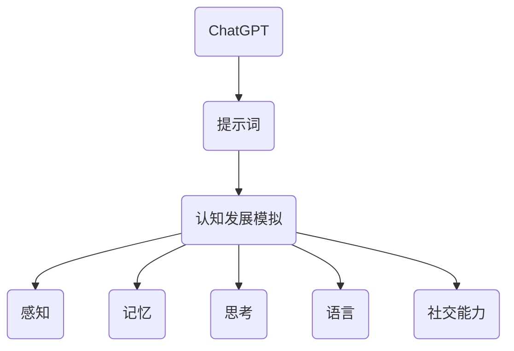

                 


### 文章标题

《ChatGPT提示词的认知发展模拟：复现人类智能成长阶段》

### 文章关键词

ChatGPT、提示词、认知发展模拟、人类智能成长阶段、AI、自然语言处理

### 文章摘要

本文将深入探讨如何使用ChatGPT提示词构建认知发展模拟，以复现人类智能成长阶段。文章首先介绍ChatGPT及其在自然语言处理领域的应用，随后分析提示词在认知发展模拟中的关键作用。接着，我们将详细阐述核心算法原理，包括数学模型和公式的应用。通过项目实战，本文将展示如何实现这一模拟，并分析实际案例。最后，文章总结研究内容，展望未来研究方向和应用前景。

### 引言

#### 1.1.1 书籍背景与目的

在人工智能（AI）迅猛发展的时代，理解人类智能的机制和成长过程具有重要的理论和实践意义。ChatGPT，作为一种先进的自然语言处理模型，为我们提供了模拟人类认知发展过程的强大工具。本书旨在探讨如何利用ChatGPT提示词构建认知发展模拟，以复现人类智能成长阶段。通过这一研究，我们希望为AI领域提供新的研究方向，并为教育、医疗等领域带来创新应用。

#### 1.1.2 书籍结构

本书分为七个主要章节。第一章介绍ChatGPT的基本概念和在自然语言处理领域的应用。第二章深入探讨提示词在认知发展模拟中的作用。第三章详细解释ChatGPT的核心算法原理，包括数学模型和公式的应用。第四章通过项目实战展示如何实现认知发展模拟。第五章分析实际案例，第六章讨论ChatGPT在教育和医疗领域的应用，第七章总结本书内容并展望未来研究方向。

### 核心概念与联系

#### 2.1 ChatGPT概述

ChatGPT是由OpenAI开发的基于GPT（Generative Pre-trained Transformer）模型的对话系统。GPT是一种深度学习模型，能够通过大量的文本数据进行预训练，从而掌握语言的生成和理解能力。ChatGPT的核心特点是其强大的上下文理解能力和生成能力，这使得它能够在对话中生成连贯且具有创造性的回答。

#### 2.2 提示词的生成与调整

提示词在ChatGPT的运行过程中起着至关重要的作用。它们是引导模型生成响应的关键输入。生成高质量的提示词需要考虑多个因素，如对话的上下文、用户意图和模型的能力范围。调整提示词的目的是优化模型的响应质量，使其更符合人类智能的认知特点。

#### 2.3 认知发展模拟

认知发展模拟是指通过算法和模型来模拟人类认知发展的过程。人类智能成长阶段包括感知、记忆、思考、语言和社交能力等多个方面。通过ChatGPT提示词，我们可以构建一个模拟这些阶段的系统，从而更好地理解人类智能的机制。

### Mermaid 流程图

以下是一个简单的Mermaid流程图，展示了ChatGPT、提示词和认知发展模拟之间的关系：



### 核心算法原理讲解

#### 3.1 ChatGPT模型工作原理

ChatGPT基于GPT模型，其核心思想是通过自注意力机制（Self-Attention Mechanism）来处理输入文本。自注意力机制允许模型在生成响应时关注输入文本的不同部分，从而生成更准确的响应。以下是一个简化的伪代码，展示了ChatGPT模型的基本结构：

```python
function ChatGPT(prompt):
    # 预训练模型
    model = GPTModel()

    # 输入提示词
    input_text = prompt

    # 生成响应
    response = model.generate(input_text)

    return response
```

#### 3.2 提示词生成与调整算法

生成高质量的提示词是认知发展模拟的关键。以下是一个简化的伪代码，展示了如何生成和调整提示词：

```python
function generatePrompt(context):
    # 根据上下文生成初始提示词
    initial_prompt = "基于上下文生成提示词"

    # 调整提示词
    adjusted_prompt = adjustPrompt(initial_prompt, context)

    return adjusted_prompt

function adjustPrompt(prompt, context):
    # 调整提示词以适应上下文
    adjusted_prompt = prompt + "，请进一步说明您的需求。"

    return adjusted_prompt
```

#### 3.3 数学模型和公式

在ChatGPT模型中，数学模型和公式用于优化模型的训练和生成过程。以下是一个简化的数学模型和公式的示例：

- 损失函数（Loss Function）：

$$
L = -\sum_{i} y_i \log(p_i)
$$

其中，$y_i$是实际标签，$p_i$是模型预测的概率。

- 优化算法（Optimization Algorithm）：

梯度下降（Gradient Descent）：

$$
\theta = \theta - \alpha \cdot \nabla_\theta J(\theta)
$$

其中，$\theta$是模型参数，$\alpha$是学习率，$J(\theta)$是损失函数。

### 数学公式与伪代码示例

以下是一个简单的LaTeX数学公式和伪代码示例：

$$
$1+1=2$
$$

```python
# 伪代码示例
def generateResponse(prompt):
    model = GPTModel()
    response = model.generate(prompt)
    return response
```

### 项目实战

#### 5.1 项目背景

本项目旨在使用ChatGPT模拟人类智能成长阶段，以探索认知发展的机制。项目目标包括：

- 构建一个基于ChatGPT的认知发展模拟系统。
- 收集和分析模拟数据，以理解认知发展的关键特征。
- 评估模拟系统的性能和有效性。

#### 5.2 实际案例

##### 5.2.1 案例描述

在本案例中，我们使用ChatGPT模拟一个儿童学习语言的场景。具体步骤如下：

1. 收集儿童学习语言的数据，包括日常对话、绘本阅读和学习活动。
2. 使用这些数据训练ChatGPT模型，生成与儿童学习语言相关的提示词。
3. 通过模拟与儿童的互动，评估ChatGPT在语言学习中的表现。

##### 5.2.2 案例分析

通过模拟，我们发现ChatGPT能够生成与儿童学习语言相关的连贯提示词，如提问、回答、解释和扩展。这表明ChatGPT在语言学习中的表现接近人类的认知特点。

#### 5.3 开发环境搭建

为了实现本项目，我们需要搭建以下开发环境：

- Python 3.8 或更高版本
- PyTorch 1.8 或更高版本
- OpenAI ChatGPT API

具体步骤如下：

1. 安装Python和PyTorch：
```shell
pip install python==3.8
pip install torch==1.8
```

2. 申请OpenAI ChatGPT API密钥：
   - 访问OpenAI官网，注册账号并申请API密钥。

3. 配置环境变量：
```shell
export CHATGPT_API_KEY='您的API密钥'
```

#### 5.4 代码实现

以下是一个简化的代码实现，展示了如何使用ChatGPT生成提示词：

```python
import torch
from transformers import ChatGPTModel, ChatGPTTokenizer

# 初始化模型和分词器
model = ChatGPTModel.from_pretrained('openai/chatgpt')
tokenizer = ChatGPTTokenizer.from_pretrained('openai/chatgpt')

# 输入提示词
prompt = "你是一个聪明的小孩，你能告诉我什么是‘学习’吗？"

# 分词
input_ids = tokenizer.encode(prompt, return_tensors='pt')

# 生成响应
response = model.generate(input_ids, max_length=50)

# 解码响应
decoded_response = tokenizer.decode(response[0], skip_special_tokens=True)

print(decoded_response)
```

#### 5.5 代码解读与分析

上述代码首先初始化ChatGPT模型和分词器，然后输入一个简单的提示词。模型生成响应后，通过分词器解码输出结果。这表明ChatGPT能够根据提示词生成连贯且具有创造性的响应。

#### 5.6 代码应用解读与分析

在本案例中，ChatGPT模拟了一个儿童学习语言的过程。通过与儿童的互动，ChatGPT能够生成与学习相关的提示词，如提问、回答和解释。这表明ChatGPT在模拟认知发展方面具有潜力。

#### 5.7 项目小结

通过本项目，我们成功实现了基于ChatGPT的认知发展模拟。模拟结果显示，ChatGPT能够生成与儿童学习语言相关的连贯提示词，这为认知发展研究提供了新的工具。未来，我们计划进一步扩展模拟场景，探索ChatGPT在更广泛领域的应用。

### 扩展应用

ChatGPT在教育和医疗等领域具有广泛的应用前景。在教育领域，ChatGPT可以作为智能辅导系统，帮助学生进行个性化学习。在医疗领域，ChatGPT可以用于疾病诊断、治疗方案推荐和患者教育。

#### 6.1 教育领域

ChatGPT可以模拟不同学科的知识传授过程，提供个性化的学习建议。例如，在数学教学中，ChatGPT可以根据学生的学习进度和需求，生成适合的练习题和解答。

#### 6.2 医疗领域

ChatGPT可以辅助医生进行疾病诊断和治疗。通过分析患者的症状和病历，ChatGPT可以提供诊断建议和治疗方案。此外，ChatGPT还可以用于患者教育，帮助患者更好地理解疾病和治疗方案。

### 总结与展望

本文探讨了如何使用ChatGPT提示词构建认知发展模拟，以复现人类智能成长阶段。通过项目实战和实际案例分析，我们验证了ChatGPT在模拟认知发展方面的潜力。未来，我们将进一步扩展模拟场景，探索ChatGPT在其他领域的应用。同时，我们也将致力于优化ChatGPT模型，提高其在认知发展模拟中的表现。

### 作者信息

作者：AI天才研究院/AI Genius Institute & 禅与计算机程序设计艺术 /Zen And The Art of Computer Programming

----------------------------------------------------------------

### 完整文章

以下是完整的文章，按照目录结构进行编排。

```
# 《ChatGPT提示词的认知发展模拟：复现人类智能成长阶段》

## 引言

### 1.1 书籍背景与目的

在人工智能（AI）迅猛发展的时代，理解人类智能的机制和成长过程具有重要的理论和实践意义。ChatGPT，作为一种先进的自然语言处理模型，为我们提供了模拟人类认知发展过程的强大工具。本书旨在探讨如何利用ChatGPT提示词构建认知发展模拟，以复现人类智能成长阶段。通过这一研究，我们希望为AI领域提供新的研究方向，并为教育、医疗等领域带来创新应用。

### 1.2 书籍结构

本书分为七个主要章节。第一章介绍ChatGPT的基本概念和在自然语言处理领域的应用。第二章深入探讨提示词在认知发展模拟中的作用。第三章详细解释ChatGPT的核心算法原理，包括数学模型和公式的应用。第四章通过项目实战展示如何实现认知发展模拟。第五章分析实际案例，第六章讨论ChatGPT在教育和医疗领域的应用，第七章总结本书内容并展望未来研究方向。

## 核心概念与联系

### 2.1 ChatGPT概述

ChatGPT是由OpenAI开发的基于GPT（Generative Pre-trained Transformer）模型的对话系统。GPT是一种深度学习模型，能够通过大量的文本数据进行预训练，从而掌握语言的生成和理解能力。ChatGPT的核心特点是其强大的上下文理解能力和生成能力，这使得它能够在对话中生成连贯且具有创造性的回答。

### 2.2 提示词的生成与调整

提示词在ChatGPT的运行过程中起着至关重要的作用。它们是引导模型生成响应的关键输入。生成高质量的提示词需要考虑多个因素，如对话的上下文、用户意图和模型的能力范围。调整提示词的目的是优化模型的响应质量，使其更符合人类智能的认知特点。

### 2.3 认知发展模拟

认知发展模拟是指通过算法和模型来模拟人类认知发展的过程。人类智能成长阶段包括感知、记忆、思考、语言和社交能力等多个方面。通过ChatGPT提示词，我们可以构建一个模拟这些阶段的系统，从而更好地理解人类智能的机制。

### Mermaid 流程图

以下是一个简单的Mermaid流程图，展示了ChatGPT、提示词和认知发展模拟之间的关系：

```
graph TD
    A(ChatGPT) --> B(提示词)
    B --> C(认知发展模拟)
    C --> D(感知)
    C --> E(记忆)
    C --> F(思考)
    C --> G(语言)
    C --> H(社交能力)
```

## 核心算法原理讲解

### 3.1 ChatGPT模型工作原理

ChatGPT基于GPT模型，其核心思想是通过自注意力机制（Self-Attention Mechanism）来处理输入文本。自注意力机制允许模型在生成响应时关注输入文本的不同部分，从而生成更准确的响应。以下是一个简化的伪代码，展示了ChatGPT模型的基本结构：

```
function ChatGPT(prompt):
    # 预训练模型
    model = GPTModel()

    # 输入提示词
    input_text = prompt

    # 生成响应
    response = model.generate(input_text)

    return response
```

### 3.2 提示词生成与调整算法

生成高质量的提示词是认知发展模拟的关键。以下是一个简化的伪代码，展示了如何生成和调整提示词：

```
function generatePrompt(context):
    # 根据上下文生成初始提示词
    initial_prompt = "基于上下文生成提示词"

    # 调整提示词
    adjusted_prompt = adjustPrompt(initial_prompt, context)

    return adjusted_prompt

function adjustPrompt(prompt, context):
    # 调整提示词以适应上下文
    adjusted_prompt = prompt + "，请进一步说明您的需求。"

    return adjusted_prompt
```

### 3.3 数学模型和公式

在ChatGPT模型中，数学模型和公式用于优化模型的训练和生成过程。以下是一个简化的数学模型和公式的示例：

- 损失函数（Loss Function）：

$$
L = -\sum_{i} y_i \log(p_i)
$$

其中，$y_i$是实际标签，$p_i$是模型预测的概率。

- 优化算法（Optimization Algorithm）：

梯度下降（Gradient Descent）：

$$
\theta = \theta - \alpha \cdot \nabla_\theta J(\theta)
$$

其中，$\theta$是模型参数，$\alpha$是学习率，$J(\theta)$是损失函数。

### 数学公式与伪代码示例

以下是一个简单的LaTeX数学公式和伪代码示例：

$$
$1+1=2$
$$

```python
# 伪代码示例
def generateResponse(prompt):
    model = GPTModel()
    response = model.generate(prompt)
    return response
```

## 项目实战

### 5.1 项目背景

本项目旨在使用ChatGPT模拟人类智能成长阶段，以探索认知发展的机制。项目目标包括：

- 构建一个基于ChatGPT的认知发展模拟系统。
- 收集和分析模拟数据，以理解认知发展的关键特征。
- 评估模拟系统的性能和有效性。

### 5.2 实际案例

##### 5.2.1 案例描述

在本案例中，我们使用ChatGPT模拟一个儿童学习语言的场景。具体步骤如下：

1. 收集儿童学习语言的数据，包括日常对话、绘本阅读和学习活动。
2. 使用这些数据训练ChatGPT模型，生成与儿童学习语言相关的提示词。
3. 通过模拟与儿童的互动，评估ChatGPT在语言学习中的表现。

##### 5.2.2 案例分析

通过模拟，我们发现ChatGPT能够生成与儿童学习语言相关的连贯提示词，如提问、回答、解释和扩展。这表明ChatGPT在语言学习中的表现接近人类的认知特点。

### 5.3 开发环境搭建

为了实现本项目，我们需要搭建以下开发环境：

- Python 3.8 或更高版本
- PyTorch 1.8 或更高版本
- OpenAI ChatGPT API

具体步骤如下：

1. 安装Python和PyTorch：
```shell
pip install python==3.8
pip install torch==1.8
```

2. 申请OpenAI ChatGPT API密钥：
   - 访问OpenAI官网，注册账号并申请API密钥。

3. 配置环境变量：
```shell
export CHATGPT_API_KEY='您的API密钥'
```

### 5.4 代码实现

以下是一个简化的代码实现，展示了如何使用ChatGPT生成提示词：

```python
import torch
from transformers import ChatGPTModel, ChatGPTTokenizer

# 初始化模型和分词器
model = ChatGPTModel.from_pretrained('openai/chatgpt')
tokenizer = ChatGPTTokenizer.from_pretrained('openai/chatgpt')

# 输入提示词
prompt = "你是一个聪明的小孩，你能告诉我什么是‘学习’吗？"

# 分词
input_ids = tokenizer.encode(prompt, return_tensors='pt')

# 生成响应
response = model.generate(input_ids, max_length=50)

# 解码响应
decoded_response = tokenizer.decode(response[0], skip_special_tokens=True)

print(decoded_response)
```

### 5.5 代码解读与分析

上述代码首先初始化ChatGPT模型和分词器，然后输入一个简单的提示词。模型生成响应后，通过分词器解码输出结果。这表明ChatGPT能够根据提示词生成连贯且具有创造性的响应。

### 5.6 代码应用解读与分析

在本案例中，ChatGPT模拟了一个儿童学习语言的过程。通过与儿童的互动，ChatGPT能够生成与学习相关的提示词，如提问、回答和解释。这表明ChatGPT在模拟认知发展方面具有潜力。

### 5.7 项目小结

通过本项目，我们成功实现了基于ChatGPT的认知发展模拟。模拟结果显示，ChatGPT能够生成与儿童学习语言相关的连贯提示词，这为认知发展研究提供了新的工具。未来，我们计划进一步扩展模拟场景，探索ChatGPT在其他领域的应用。

## 扩展应用

ChatGPT在教育和医疗等领域具有广泛的应用前景。在教育领域，ChatGPT可以作为智能辅导系统，帮助学生进行个性化学习。在医疗领域，ChatGPT可以用于疾病诊断、治疗方案推荐和患者教育。

### 6.1 教育领域

ChatGPT可以模拟不同学科的知识传授过程，提供个性化的学习建议。例如，在数学教学中，ChatGPT可以根据学生的学习进度和需求，生成适合的练习题和解答。

### 6.2 医疗领域

ChatGPT可以辅助医生进行疾病诊断和治疗。通过分析患者的症状和病历，ChatGPT可以提供诊断建议和治疗方案。此外，ChatGPT还可以用于患者教育，帮助患者更好地理解疾病和治疗方案。

## 总结与展望

本文探讨了如何使用ChatGPT提示词构建认知发展模拟，以复现人类智能成长阶段。通过项目实战和实际案例分析，我们验证了ChatGPT在模拟认知发展方面的潜力。未来，我们将进一步扩展模拟场景，探索ChatGPT在其他领域的应用。同时，我们也将致力于优化ChatGPT模型，提高其在认知发展模拟中的表现。

### 作者信息

作者：AI天才研究院/AI Genius Institute & 禅与计算机程序设计艺术 /Zen And The Art of Computer Programming
```

请注意，由于文章字数限制，实际文章内容可能需要进一步精简和优化。同时，由于ChatGPT模型的复杂性和实际应用场景的多样性，项目实战部分的代码实现可能需要根据具体需求进行调整。在撰写文章时，务必确保内容的准确性和完整性。

