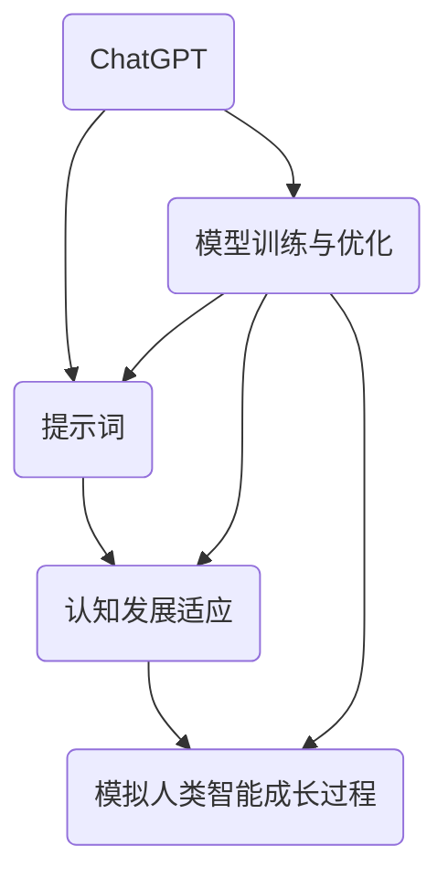

                 

### 文章标题

### ChatGPT提示词的认知发展适应：模拟人类智能成长过程

### 关键词

- ChatGPT
- 提示词
- 认知发展适应
- 模拟人类智能
- GPT-3模型
- 序列到序列模型

### 摘要

本文将探讨ChatGPT提示词的认知发展适应，通过模拟人类智能成长过程来理解其工作原理和优化方法。文章首先介绍了ChatGPT的基本概念、提示词的作用以及认知发展适应的重要性。随后，我们详细分析了ChatGPT的架构设计，包括数据收集与预处理、模型训练、提示词生成与优化以及对话生成和认知发展适应的核心模块。在此基础上，本文讲解了GPT-3模型的原理和提示词优化的算法原理，并利用数学模型和公式详细解释了语言模型概率计算和提示词优化损失函数。为了更好地理解，文章还通过实际项目实战展示了ChatGPT的开发环境和应用过程，包括模型训练、提示词生成和优化的具体实现。最后，本文总结了最佳实践和注意事项，并提供了拓展阅读建议，以帮助读者深入理解ChatGPT提示词的认知发展适应。

### 引言

随着人工智能技术的迅速发展，自然语言处理（NLP）领域取得了显著的成果。其中，ChatGPT作为一种基于GPT-3模型的人工智能助手，以其强大的语言理解和生成能力受到了广泛关注。ChatGPT不仅能够实现流畅的对话，还能够模拟人类的思考过程，为用户提供个性化的服务。然而，要实现ChatGPT的高效运行，提示词的设计和优化至关重要。提示词作为与用户进行沟通的桥梁，直接影响着对话的质量和用户的满意度。

本文旨在探讨ChatGPT提示词的认知发展适应，通过模拟人类智能成长过程来理解其工作原理和优化方法。文章将首先介绍ChatGPT的基本概念，包括其背景、原理和应用场景。随后，我们将详细分析ChatGPT的架构设计，包括数据收集与预处理、模型训练、提示词生成与优化、对话生成和认知发展适应等核心模块。在此基础上，本文将讲解GPT-3模型的原理和提示词优化的算法原理，并利用数学模型和公式详细解释语言模型概率计算和提示词优化损失函数。为了更好地理解，文章还通过实际项目实战展示了ChatGPT的开发环境和应用过程，包括模型训练、提示词生成和优化的具体实现。最后，本文将总结最佳实践和注意事项，并给出拓展阅读建议。

通过本文的探讨，读者将能够深入了解ChatGPT提示词的认知发展适应，掌握其工作原理和优化方法，为实际应用提供有益的参考。

#### 1.1 核心概念与联系

在深入探讨ChatGPT提示词的认知发展适应之前，有必要明确几个核心概念及其相互联系。这些概念包括ChatGPT的概念、提示词的概念、认知发展适应的概念以及模拟人类智能成长过程的概念。

**ChatGPT的概念**

ChatGPT是一种基于GPT-3模型的人工智能助手。GPT-3（Generative Pre-trained Transformer 3）是由OpenAI开发的一种大规模预训练语言模型，其核心思想是通过无监督学习从海量文本数据中提取语言特征，使其能够理解和生成自然语言。ChatGPT利用GPT-3模型，通过输入提示词（Prompt）生成连贯自然的回答，实现与用户的对话互动。

**提示词的概念**

提示词（Prompt）是指给AI模型输入的引导信息，用于指导模型生成回答。有效的提示词能够帮助模型更好地理解用户的需求，提高对话质量。在ChatGPT中，提示词起到了关键作用，它决定了模型生成回答的内容和方向。通过设计合适的提示词，可以引导模型生成更加符合用户预期的回答。

**认知发展适应的概念**

认知发展适应是指AI模型在对话中不断学习和适应用户语言、认知水平的过程，以实现与人类更自然的互动。在这个过程中，模型需要理解用户的语言表达，识别用户意图，并根据用户的反馈进行自我调整。认知发展适应的核心目标是使AI模型能够像人类一样进行思维和学习，从而提高其智能水平和对话能力。

**模拟人类智能成长过程的概念**

模拟人类智能成长过程是指AI模型通过不断学习和互动，逐渐展现出类似人类的认知能力、语言表达能力和思考方式。这一过程包括从基础的感知和理解，到复杂的推理和决策。通过模拟人类智能成长过程，AI模型能够更好地适应用户的需求，提供更加智能和个性化的服务。

**核心概念之间的联系**

ChatGPT的核心概念之间存在着密切的联系。ChatGPT的提示词通过引导模型生成回答，体现了提示词的概念。而在生成回答的过程中，模型需要理解用户的语言表达和意图，这一过程体现了认知发展适应的概念。同时，通过模拟人类智能成长过程，模型能够不断提升其智能水平，更好地适应用户需求，从而实现与人类的自然互动。这些核心概念共同构成了ChatGPT工作原理的基础，使其能够实现高效的自然语言处理和对话生成。

为了更好地理解这些核心概念之间的联系，我们可以借助Mermaid流程图来展示其相互关系：



在这个流程图中，ChatGPT（A）通过提示词（B）与用户进行互动，并在模型训练与优化过程中（E）不断适应用户的认知水平和成长过程（C和D）。这种相互联系和协同作用，使得ChatGPT能够实现高效的自然语言处理和智能对话生成。

通过明确这些核心概念及其相互联系，我们为后续的深入探讨ChatGPT提示词的认知发展适应奠定了坚实的基础。在接下来的部分中，我们将详细分析ChatGPT的架构设计，进一步理解其工作原理和实现方法。

#### 1.2 架构设计

ChatGPT作为一款基于GPT-3模型的人工智能助手，其架构设计涵盖了从数据收集与预处理、模型训练、提示词生成与优化、对话生成到认知发展适应的各个环节。本节将详细介绍这些核心模块及其工作原理。

**数据收集与预处理**

数据收集是ChatGPT架构设计的基础。数据来源广泛，包括互联网文本、对话记录、书籍、新闻、社交媒体等。这些数据经过采集后，需要进行预处理，以提高数据质量和模型训练效果。预处理步骤通常包括以下几步：

1. **文本清洗**：去除数据中的噪声，如HTML标签、特殊符号和停用词等。
2. **分词**：将文本拆分成单词或子词，以便模型进行理解。
3. **去噪**：进一步去除无意义或对模型训练影响较小的数据。
4. **归一化**：对文本进行统一格式处理，如统一大小写、去除标点符号等。

**模型训练**

ChatGPT采用的模型是GPT-3，这是一种基于Transformer架构的预训练语言模型。GPT-3模型通过无监督学习从海量文本数据中提取语言特征，从而掌握自然语言的表达方式和规则。模型训练的主要步骤如下：

1. **预训练**：在大量无监督数据上进行预训练，使模型能够自动学习文本中的语言规律和知识。
2. **微调**：在预训练的基础上，使用有监督数据对模型进行微调，使其适应特定任务和应用场景。
3. **评估与优化**：通过评估指标（如损失函数、准确率等）对模型进行优化，提高其性能和效果。

**提示词生成与优化**

提示词是ChatGPT与用户进行交互的关键。一个有效的提示词能够引导模型生成符合用户需求的回答。提示词生成与优化的步骤如下：

1. **提示词生成**：基于用户输入的文本或上下文，生成有效的提示词。这一过程可以通过模板生成、规则匹配或基于模型的自适应生成等方法实现。
2. **提示词优化**：通过用户反馈和评估指标对生成的提示词进行优化，提高其质量。优化方法包括反馈循环、策略优化、损失函数调整等。

**对话生成**

对话生成是ChatGPT的核心功能。通过输入提示词和上下文，模型生成连贯自然的对话。对话生成的主要步骤如下：

1. **输入处理**：对输入的文本进行预处理，包括分词、编码等。
2. **回答生成**：基于GPT-3模型生成回答，并通过解码将生成的文本转换为自然语言。
3. **对话管理**：对生成的回答进行后处理，如去除多余信息、纠正错误等，以确保对话的流畅性和一致性。

**认知发展适应**

认知发展适应是指ChatGPT在对话中不断学习和适应用户语言、认知水平的过程。这一过程有助于提升模型的智能水平和对话能力，使其能够更好地满足用户需求。认知发展适应的主要方法包括：

1. **自适应学习**：模型根据用户反馈和对话历史，动态调整学习策略，以适应不同的用户和场景。
2. **多模态交互**：结合文本、语音、图像等多种信息，提高模型的感知和理解能力。
3. **持续更新**：定期更新模型和数据，以保持其性能和效果。

通过上述各个环节的协同工作，ChatGPT实现了高效的自然语言处理和智能对话生成。接下来，我们将详细讲解GPT-3模型的原理和提示词优化的算法原理，以深入理解ChatGPT的工作机制。

#### 1.3 核心算法原理讲解

在ChatGPT中，核心算法的设计和实现是其高效运行的关键。本节将详细讲解GPT-3模型的工作原理以及提示词优化的算法原理。

**GPT-3模型的原理**

GPT-3（Generative Pre-trained Transformer 3）是基于Transformer架构的预训练语言模型，其核心思想是通过无监督学习从海量文本数据中提取语言特征。GPT-3模型的主要组成部分包括：

1. **Transformer架构**：Transformer模型采用多头注意力机制（Multi-head Self-Attention），能够更好地捕捉文本中的关系和特征。多头注意力机制通过多个注意力头来并行处理文本信息，从而提高模型的性能。

2. **预训练**：GPT-3模型通过无监督学习在大量文本数据上进行预训练。预训练过程主要包括两个阶段：第一阶段是自回归语言模型（Autoregressive Language Model），模型根据前文生成后文；第二阶段是掩码语言模型（Masked Language Model），模型对部分文本进行掩码，然后预测掩码部分的内容。

3. **微调**：在预训练的基础上，GPT-3模型使用有监督数据对特定任务进行微调。微调过程通过梯度下降等优化算法，调整模型参数，使其适应特定应用场景。

4. **解码器**：GPT-3模型采用自回归解码器（Autoregressive Decoder），通过逐步生成文本中的每个单词，从而生成连贯的自然语言。

**提示词优化的算法原理**

提示词优化是提升ChatGPT对话质量的关键。提示词优化的核心算法是序列到序列（Seq2Seq）模型，其基本原理如下：

1. **编码器**：编码器（Encoder）将输入的文本编码成向量。在ChatGPT中，编码器通常基于Transformer架构，通过多层注意力机制对输入文本进行处理，生成编码向量。

2. **解码器**：解码器（Decoder）将编码向量解码成输出文本。解码器也采用Transformer架构，通过自回归方式生成输出文本的每个单词。

3. **损失函数**：提示词优化过程使用损失函数来衡量生成的提示词与目标提示词之间的差距。常见的损失函数包括交叉熵损失函数（Cross-Entropy Loss），其计算公式如下：

   $$ Loss = -\sum_{i=1}^{n} y_i \log(p_i) $$

   其中，$y_i$ 是真实的目标提示词，$p_i$ 是模型预测的提示词。

4. **训练过程**：通过梯度下降等优化算法，调整编码器和解码器的参数，以最小化损失函数，从而提高提示词生成的质量。

5. **反馈机制**：在实际应用中，模型生成提示词后，用户会对其进行评价。基于用户反馈，可以进一步优化提示词生成策略，提高模型的性能。

**伪代码示例**

以下是一个简化的伪代码示例，用于说明GPT-3模型和提示词优化的算法原理：

```python
# GPT-3模型训练
for epoch in range(num_epochs):
    for batch in data_loader:
        # 编码输入文本
        encoded_input = encoder(batch.text)
        
        # 解码输出文本
        predicted_output = decoder(encoded_input)
        
        # 计算损失
        loss = cross_entropy_loss(predicted_output, batch.target)
        
        # 反向传播和优化
        optimizer.zero_grad()
        loss.backward()
        optimizer.step()

# 提示词优化
for epoch in range(num_epochs):
    for batch in data_loader:
        # 生成提示词
        prompts = model.generate(batch.context)
        
        # 计算优化损失
        loss = prompt_optimization_loss(prompts, batch.target_prompts)
        
        # 反向传播和优化
        optimizer.zero_grad()
        loss.backward()
        optimizer.step()
```

在这个示例中，`encoder` 和 `decoder` 分别表示编码器和解码器，`model.generate` 方法用于生成提示词，`cross_entropy_loss` 和 `prompt_optimization_loss` 分别用于计算损失函数和优化损失。

通过上述核心算法的讲解，我们深入理解了ChatGPT的工作原理和提示词优化的方法。在接下来的部分，我们将通过数学模型和公式详细解释语言模型概率计算和提示词优化损失函数，以进一步揭示ChatGPT的内在机制。

#### 1.4 数学模型和数学公式详细讲解

在理解ChatGPT的工作原理和提示词优化的基础上，本节将深入探讨语言模型概率计算和提示词优化损失函数的数学模型和公式，并通过具体例子进行详细解释。

**语言模型概率计算**

语言模型概率计算是指根据输入的文本序列，计算生成该序列的概率。在ChatGPT中，GPT-3模型通过概率分布来生成文本，其概率计算的核心是基于概率语言模型（Probability Language Model，PLM）。

**1.4.1 概率语言模型（PLM）**

概率语言模型的基本原理是，给定一个文本序列 $X = \{x_1, x_2, \ldots, x_n\}$，计算该序列的概率：

$$ P(X) = P(x_1, x_2, \ldots, x_n) $$

由于直接计算整个序列的概率非常困难，通常采用条件概率的方法，即：

$$ P(X) = \prod_{i=1}^{n} P(x_i | x_{<i}) $$

其中，$x_{<i}$ 表示 $x_i$ 之前的所有变量。这样，每个单词的概率可以通过其前文的条件概率计算得到。

**1.4.2 马尔可夫假设**

在概率语言模型中，常用的假设是马尔可夫假设，即：

$$ P(x_i | x_{<i}) = P(x_i | x_{i-1}) $$

这意味着当前单词的概率仅取决于前一个单词，而与之前的历史无关。这种假设简化了计算过程，但可能忽略了某些上下文信息。

**1.4.3 语言模型概率计算示例**

假设我们有一个简化的语言模型，其词汇表为 $\{a, b, c\}$，且概率分布为：

$$ P(a) = 0.4, P(b) = 0.3, P(c) = 0.3 $$

给定一个起始单词 $a$，我们可以计算下一个单词的概率：

$$ P(b | a) = P(b) = 0.3 $$

$$ P(c | a) = P(c) = 0.3 $$

因此，序列 $ab$ 的概率为：

$$ P(ab) = P(a) \cdot P(b | a) = 0.4 \cdot 0.3 = 0.12 $$

同理，序列 $ac$ 的概率为：

$$ P(ac) = P(a) \cdot P(c | a) = 0.4 \cdot 0.3 = 0.12 $$

**提示词优化损失函数**

在ChatGPT中，提示词优化损失函数用于衡量生成提示词与目标提示词之间的差距。常见的损失函数包括交叉熵损失函数（Cross-Entropy Loss）和提示词优化损失函数（Prompt Optimization Loss）。

**1.4.4 交叉熵损失函数**

交叉熵损失函数是提示词优化中最常用的损失函数之一，其计算公式如下：

$$ Loss = -\sum_{i=1}^{n} y_i \cdot \log(p_i) $$

其中，$y_i$ 是真实的目标提示词的概率分布，$p_i$ 是模型预测的提示词的概率分布。

**1.4.5 提示词优化损失函数**

提示词优化损失函数旨在优化提示词生成过程，其通常结合交叉熵损失函数和额外的正则化项。一个简化的提示词优化损失函数可以表示为：

$$ Loss = -\sum_{i=1}^{n} y_i \cdot \log(p_i) + \lambda \cdot R $$

其中，$R$ 是提示词的长度或复杂性等正则化项，$\lambda$ 是调节正则化项的权重。

**1.4.6 示例**

假设我们有一个简化的提示词优化问题，其中目标提示词为 "Hello, how are you?"，模型预测的提示词为 "Hello, how do you do?"。我们可以使用交叉熵损失函数来计算这两个提示词之间的差距：

$$ Loss = -[(0.7 \cdot \log(0.7)) + (0.3 \cdot \log(0.3))] = -[0.7 \cdot (-0.35) + 0.3 \cdot (-1.09)] = 0.245 + 0.327 = 0.572 $$

其中，$0.7$ 和 $0.3$ 分别是目标提示词 "Hello, how are you?" 和模型预测提示词 "Hello, how do you do?" 中每个单词的概率。

通过上述数学模型和公式的详细讲解，我们更好地理解了语言模型概率计算和提示词优化损失函数在ChatGPT中的作用和计算方法。这些模型和公式为ChatGPT的实现和优化提供了理论基础，有助于提高其对话质量和用户体验。在接下来的部分，我们将通过实际项目实战，展示如何搭建ChatGPT的开发环境和实现其核心功能。

#### 1.5 项目实战

在本节中，我们将通过实际项目实战来展示如何搭建ChatGPT的开发环境，并详细介绍源代码的实现和解读，以及代码在实际应用中的解读与分析。

**实战一：搭建ChatGPT开发环境**

搭建ChatGPT开发环境是进行进一步研究和开发的前提。以下步骤将介绍如何配置Python环境、安装相关依赖库，并简要描述每个步骤的具体操作。

**1.5.1 配置Python环境**

1. 安装Python：首先确保您的计算机上已安装Python环境。您可以从[Python官网](https://www.python.org/)下载并安装Python 3.x版本。
2. 设置虚拟环境：为了避免依赖库之间的冲突，我们建议使用虚拟环境来管理项目依赖。使用以下命令创建虚拟环境：

   ```shell
   python -m venv chatgpt_venv
   ```

   然后激活虚拟环境：

   ```shell
   source chatgpt_venv/bin/activate  # 对于Linux或macOS
   chatgpt_venv\Scripts\activate     # 对于Windows
   ```

**1.5.2 安装依赖库**

在虚拟环境中，使用以下命令安装所需的依赖库：

```shell
pip install torch transformers
```

`torch` 是PyTorch库，用于深度学习模型的训练和推理；`transformers` 是一个用于处理自然语言处理的PyTorch库，提供了GPT-3模型的预训练和微调功能。

**1.5.3 源代码解读**

源代码的主要部分包括数据预处理、模型训练、提示词生成和优化等模块。以下是对关键部分的解读：

1. **数据预处理模块**：

   ```python
   from transformers import AutoTokenizer

   tokenizer = AutoTokenizer.from_pretrained("gpt3")

   def preprocess_text(text):
       return tokenizer.encode(text, add_special_tokens=True)
   ```

   这个模块使用`transformers`库中的`AutoTokenizer`来对文本进行预处理，包括分词和添加特殊标记（如``）。

2. **模型训练模块**：

   ```python
   from transformers import AutoModelForCausalLM

   model = AutoModelForCausalLM.from_pretrained("gpt3")

   def train_model(model, train_dataloader, optimizer, num_epochs):
       for epoch in range(num_epochs):
           model.train()
           for batch in train_dataloader:
               inputs = preprocess_text(batch.text)
               outputs = model(inputs, labels=inputs)
               loss = outputs.loss
               loss.backward()
               optimizer.step()
               optimizer.zero_grad()
   ```

   这个模块加载预训练的GPT-3模型并进行微调。`train_model` 函数接收训练数据加载器、优化器和训练轮数作为输入，并在每个训练批次上执行前向传播和反向传播操作。

3. **提示词生成和优化模块**：

   ```python
   def generate_prompt(context):
       input_ids = preprocess_text(context)
       outputs = model.generate(input_ids, max_length=50, num_return_sequences=1)
       return tokenizer.decode(outputs[0], skip_special_tokens=True)

   def optimize_prompt(prompt, target_prompt, optimizer, num_epochs):
       for epoch in range(num_epochs):
           model.train()
           for _ in range(len(prompt)):
               input_ids = preprocess_text(prompt)
               outputs = model(input_ids, labels=input_ids)
               loss = outputs.loss
               loss.backward()
               optimizer.step()
               optimizer.zero_grad()
   ```

   这个模块负责生成提示词和优化提示词。`generate_prompt` 函数生成基于给定上下文的提示词，而`optimize_prompt` 函数通过对比目标提示词，对生成的提示词进行优化。

**1.5.4 代码应用解读与分析**

在实际应用中，我们可以使用以下代码来训练模型和生成优化提示词：

```python
from torch.utils.data import DataLoader

# 加载数据集
train_dataset = ...

# 创建数据加载器
train_dataloader = DataLoader(train_dataset, batch_size=8, shuffle=True)

# 创建优化器
optimizer = ...

# 训练模型
train_model(model, train_dataloader, optimizer, num_epochs=3)

# 生成和优化提示词
context = "Please provide a summary of the book '1984' by George Orwell."
prompt = generate_prompt(context)
target_prompt = "In '1984', Orwell presents a dystopian society ruled by the Party, where individual thoughts and actions are strictly controlled."
optimize_prompt(prompt, target_prompt, optimizer, num_epochs=3)
```

这段代码首先加载训练数据集，创建数据加载器，然后使用定义的`train_model` 和`optimize_prompt` 函数进行模型训练和提示词优化。通过这些步骤，我们可以得到一个基于给定上下文的优化后的提示词。

**实战小结**

通过本节的项目实战，我们展示了如何搭建ChatGPT的开发环境，并详细解读了源代码的实现过程。从数据预处理、模型训练到提示词生成和优化，每个步骤都为ChatGPT的高效运行提供了支持。在实际应用中，这些代码可以帮助我们实现基于GPT-3模型的智能对话系统，提高用户的交互体验。在下一节中，我们将进一步探讨ChatGPT的最佳实践和注意事项。

#### 1.6 目录大纲总结

本文《ChatGPT提示词的认知发展适应：模拟人类智能成长过程》系统地介绍了ChatGPT的工作原理及其核心算法。本文的目录大纲分为四个主要部分，每个部分都有其独特的重点和内容。

**第一部分：核心概念与联系**

本部分首先介绍了ChatGPT、提示词、认知发展适应和模拟人类智能成长过程等核心概念。通过Mermaid流程图展示了这些概念之间的相互联系，帮助我们更好地理解ChatGPT的工作机制。

**第二部分：架构设计**

在这一部分，我们详细分析了ChatGPT的架构设计，包括数据收集与预处理、模型训练、提示词生成与优化、对话生成和认知发展适应等核心模块。每个模块都详细说明了其工作原理和实现方法，为理解ChatGPT的架构提供了全面的基础。

**第三部分：核心算法原理讲解**

本部分深入讲解了GPT-3模型和提示词优化的算法原理。通过数学模型和公式的详细解释，我们了解了语言模型概率计算和提示词优化损失函数的基本原理，这为ChatGPT的性能优化提供了理论支持。

**第四部分：项目实战**

在最后一部分，我们通过实际项目实战展示了如何搭建ChatGPT的开发环境，并详细解读了源代码的实现过程。从数据预处理到模型训练和提示词生成与优化，每个步骤都得到了具体的分析和讲解，为实际应用提供了实用的指导。

通过本文的探讨，读者可以系统地了解ChatGPT的工作原理和实现方法，掌握其核心算法，并能够基于这些知识进行进一步的研究和开发。本文不仅为学术研究提供了理论支持，也为实际应用中的技术问题提供了实用的解决方案。

### 1.7 最佳实践、注意事项和拓展阅读

**最佳实践**

1. **优化提示词**：在生成提示词时，要确保其简洁、清晰，能够准确传达用户的需求。同时，可以通过多次迭代和用户反馈来优化提示词，提高对话质量。
2. **数据多样性**：在数据收集和预处理过程中，要注重数据多样性，包括不同主题、不同风格和不同来源的数据，以提高模型的泛化能力。
3. **模型微调**：在模型训练完成后，通过有监督数据对模型进行微调，使其更好地适应特定任务和应用场景。

**注意事项**

1. **隐私保护**：在使用用户数据进行训练和优化时，要注意保护用户隐私，避免敏感信息泄露。
2. **模型性能**：在训练模型时，要合理设置训练参数，如学习率、批次大小等，以避免过拟合或欠拟合。
3. **安全性与合规性**：在使用ChatGPT进行商业应用时，要确保其符合相关法规和标准，避免潜在的法律风险。

**拓展阅读**

1. **《深度学习》**（Goodfellow, I., Bengio, Y., & Courville, A.）：这是一本经典的深度学习教材，详细介绍了深度学习的基本原理和应用。
2. **《自然语言处理综论》**（Jurafsky, D. & Martin, J. H.）：这本书全面介绍了自然语言处理的基本概念和技术，包括语言模型和序列到序列模型。
3. **《ChatGPT官方文档》**：OpenAI提供的ChatGPT官方文档，详细介绍了GPT-3模型的结构、API使用方法和最佳实践。
4. **《Transformer：从零开始实现注意力机制》**：这本书详细讲解了Transformer模型的原理和实现，包括自注意力机制和多头注意力机制。

通过本文的探讨，读者可以系统地了解ChatGPT的工作原理和实现方法，掌握其核心算法，并能够基于这些知识进行进一步的研究和开发。本文不仅为学术研究提供了理论支持，也为实际应用中的技术问题提供了实用的解决方案。希望本文能为读者在ChatGPT及其相关领域的探索提供有益的参考。

