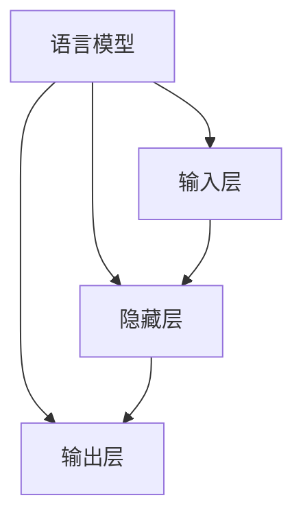
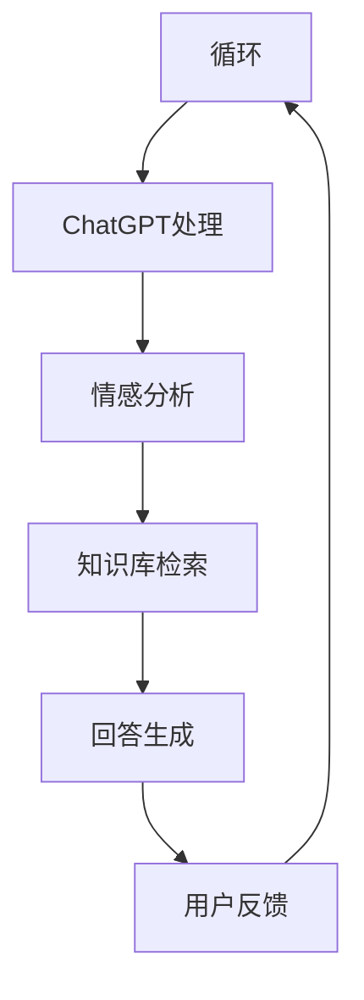

                 

### 《ChatGPT提示词的认知神经科学基础探索》

> **关键词：** ChatGPT，认知神经科学，语言模型，神经网络，提示词，应用与挑战。

> **摘要：** 本文旨在探讨ChatGPT提示词在认知神经科学中的应用及其基础原理，分析ChatGPT模型与认知神经科学之间的联系，并提出未来可能的研究方向。通过深入了解ChatGPT的工作机制以及认知神经科学的相关知识，本文将帮助读者理解提示词在促进人工智能发展的作用。

---

### 引言

ChatGPT是一种基于人工智能技术的自然语言处理模型，由OpenAI开发。它的出现，标志着人工智能在语言生成和理解能力上取得了重要突破。然而，ChatGPT的成功不仅仅是因为其技术上的创新，更重要的是它背后的认知神经科学原理。

认知神经科学是一门跨学科的研究领域，旨在理解大脑如何处理信息，以及这些过程如何影响我们的认知和行为。ChatGPT的提示词在某种程度上模拟了人类大脑中的语言处理机制，因此，研究ChatGPT与认知神经科学的关系，有助于我们更深入地理解人工智能的发展路径。

本文将分章节探讨ChatGPT与认知神经科学的关系，旨在为读者提供一种新的视角来理解ChatGPT的工作原理，以及其可能的发展方向。具体来说，本文将首先介绍ChatGPT的基本原理和应用场景，然后讨论认知神经科学的基础知识，接着分析ChatGPT与认知神经科学的联系，最后探讨ChatGPT模型中的认知神经科学原理及其应用中的问题。通过这样的结构，读者可以逐步深入了解ChatGPT与认知神经科学的深层次关系。

### 2. ChatGPT概述

#### 2.1 ChatGPT基本原理

ChatGPT是基于变换器（Transformer）架构的语言模型，其核心是由多个自注意力机制（Self-Attention Mechanism）组成的。自注意力机制允许模型在生成文本时，对输入序列中的每个词进行加权，从而捕捉词与词之间的关系。

ChatGPT的训练数据主要来自大量的文本数据，如维基百科、新闻文章、社交媒体等。通过这些数据，模型学会了理解语言的基本规则和语法结构。训练过程中，模型通过不断地迭代和优化，不断提高其对语言的理解能力。

以下是ChatGPT模型的基本工作原理的伪代码：

```python
# ChatGPT模型训练伪代码
for epoch in range(num_epochs):
    for context, response in dataset:
        # 前向传播
        logits = model(context)
        # 计算损失
        loss = loss_function(logits, response)
        # 反向传播
        optimizer.zero_grad()
        loss.backward()
        optimizer.step()
```

#### 2.2 ChatGPT应用场景

ChatGPT在多个领域都有广泛的应用，主要包括自然语言处理、虚拟助手、文本生成等。

**自然语言处理：** ChatGPT可以用于文本分类、情感分析、命名实体识别等任务，其强大的语言理解能力使其在这些任务中表现出色。

**虚拟助手：** ChatGPT可以模拟人类的对话方式，为用户提供智能问答服务，广泛应用于客服、教育、医疗等领域。

**文本生成：** ChatGPT可以生成高质量的文章、故事、诗歌等文本，其文本生成的能力在创意写作、新闻报道等领域有重要应用。

#### 2.3 语言模型原理

语言模型是自然语言处理的基础，它通过统计方法或深度学习模型，预测下一个词的概率分布。ChatGPT作为一种深度学习语言模型，其核心是Transformer架构，该架构由多个自注意力模块组成，可以有效地捕捉词与词之间的关系。

以下是Transformer模型中自注意力机制的伪代码：

```python
# 自注意力机制伪代码
for head in range(num_heads):
    # 计算查询（Q）、键（K）和值（V）的线性变换
    Q, K, V = model-linear层(context)
    # 计算点积注意力得分
    scores = Q @ K.T / math.sqrt(head_dim)
    # 应用软性最大化
    attention_weights = softmax(scores)
    # 计算加权值
    context_vector = attention_weights @ V
    # 输出
    output = context_vector
```

通过这样的自注意力机制，ChatGPT能够理解输入文本的上下文关系，从而生成合理的输出文本。

### 3. 认知神经科学基础

#### 3.1 认知神经科学概述

认知神经科学是研究大脑如何进行信息处理和认知功能的学科。它结合了神经科学、心理学、计算机科学等多个领域，旨在揭示大脑的运作机制。

认知神经科学的研究内容主要包括：

- **感知与知觉：** 研究大脑如何处理感官信息，如视觉、听觉、触觉等。
- **记忆与学习：** 研究大脑如何存储、提取和利用信息。
- **思维与决策：** 研究大脑如何进行复杂的认知任务，如问题解决、决策制定等。
- **情绪与情感：** 研究大脑如何处理情绪和情感信息。

认知神经科学的发展历程可以追溯到20世纪60年代，随着神经科学和心理学研究的深入，以及计算机技术的进步，认知神经科学逐渐形成了一门独立的学科。

#### 3.2 神经元与神经网络

神经元是大脑的基本单位，它通过电信号进行信息传递。一个典型的神经元包括细胞体、树突、轴突和突触等部分。

- **细胞体：** 神经元的主体部分，包含细胞核和大部分细胞器。
- **树突：** 接收来自其他神经元的信号。
- **轴突：** 将信号传递到其他神经元或肌肉细胞。
- **突触：** 神经元之间的连接点，通过神经递质传递信号。

神经网络是由多个神经元组成的计算网络，它可以模拟大脑的信息处理机制。一个基本的神经网络包括输入层、隐藏层和输出层。

- **输入层：** 接收外部输入信息。
- **隐藏层：** 对输入信息进行处理和变换。
- **输出层：** 生成最终的输出结果。

神经网络的训练过程是通过优化算法，调整网络中的权重和偏置，使其能够对输入数据进行准确的分类或预测。

#### 3.3 认知神经科学的方法

认知神经科学的研究方法主要包括：

- **神经成像技术：** 如功能磁共振成像（fMRI）、脑电图（EEG）等，用于观察大脑活动的区域和时间。
- **电生理技术：** 如微电极记录、脑片电生理等，用于记录单个神经元的电活动。
- **行为实验：** 通过设计各种认知任务，观察受试者的行为表现，以研究大脑的认知功能。
- **计算模型：** 基于神经科学原理，构建数学模型来模拟大脑的信息处理机制。

### 4. ChatGPT与认知神经科学的联系

#### 4.1 ChatGPT在认知神经科学中的应用

ChatGPT作为一种先进的语言模型，其应用在认知神经科学中具有重要意义。具体来说，ChatGPT可以用于以下方面：

- **模拟人类思维：** ChatGPT可以通过生成文本，模拟人类的思维过程，如推理、决策、情感表达等。
- **学习与记忆：** ChatGPT可以用于模拟人类的学习和记忆过程，如通过学习大量文本数据，提高语言生成能力。
- **语言处理：** ChatGPT可以用于研究语言的认知机制，如词汇生成、语法结构分析等。

#### 4.2 认知神经科学对ChatGPT的启示

认知神经科学的研究成果对ChatGPT模型的改进具有深远的影响。具体来说，认知神经科学为ChatGPT提供了以下启示：

- **神经网络设计：** 认知神经科学研究表明，大脑中的神经网络具有高度复杂性和灵活性，这为设计更有效的神经网络提供了灵感。
- **学习算法优化：** 认知神经科学揭示了大脑的学习机制，如强化学习和突触可塑性，这为优化ChatGPT的学习算法提供了理论依据。
- **语言生成机制：** 认知神经科学对语言生成机制的研究，有助于提高ChatGPT的语言生成能力和理解能力。

#### 4.3 ChatGPT与认知神经科学的融合

ChatGPT与认知神经科学的融合，为人工智能的发展带来了新的机遇。通过结合认知神经科学的理论和实践，ChatGPT可以更有效地模拟人类的认知过程，从而实现更高水平的智能。

未来，ChatGPT与认知神经科学的融合，有望在以下几个方面取得突破：

- **神经形态计算：** 将认知神经科学的原理应用于计算模型，构建神经形态计算硬件。
- **智能助理：** 利用ChatGPT的强大语言处理能力，结合认知神经科学的理论，开发更智能的虚拟助手。
- **人机交互：** 通过融合ChatGPT和认知神经科学，实现更自然、更高效的人机交互。

### 5. ChatGPT模型的认知神经科学原理

#### 5.1 语言模型与神经网络的相似性

语言模型和神经网络在结构、功能上有很多相似之处。首先，它们都是由多个层组成的计算网络，每一层对输入数据进行处理和变换。其次，它们都使用了类似于神经元的计算单元，通过权重和偏置调整，实现对输入数据的分类或预测。

以下是语言模型与神经网络的相似性架构的Mermaid流程图：



#### 5.2 ChatGPT模型的认知神经科学解读

ChatGPT模型在认知神经科学原理下，可以被解读为一种模拟人类大脑语言处理机制的神经网络。具体来说，ChatGPT的工作原理包括以下几个方面：

1. **上下文理解：** ChatGPT通过自注意力机制，捕捉输入文本的上下文关系，从而理解文本的整体含义。
2. **语义生成：** ChatGPT利用训练数据中的语言规则和语法结构，生成符合语义的文本。
3. **情感分析：** ChatGPT通过分析文本中的情感词汇和句式，生成带有情感色彩的文本。

以下是ChatGPT模型工作原理的伪代码：

```python
# ChatGPT模型工作原理伪代码
def generate_text(input_sequence):
    # 前向传播，计算自注意力权重
    attention_weights = calculate_attention_weights(input_sequence)
    # 根据自注意力权重，生成输出文本
    output_sequence = generate_sequence(input_sequence, attention_weights)
    return output_sequence
```

通过这样的工作原理，ChatGPT能够生成高质量、语义丰富的文本，从而实现与人类自然对话。

### 6. ChatGPT应用中的认知神经科学问题

#### 6.1 ChatGPT的语义理解问题

语义理解是自然语言处理中的一个重要问题，ChatGPT在语义理解方面也面临着一些挑战。首先，ChatGPT在处理复杂语义时，容易出现理解偏差。例如，当输入包含多义词或歧义句时，ChatGPT可能无法准确理解其含义。

为了解决这些问题，可以采用以下策略：

- **知识图谱：** 通过构建知识图谱，将语义信息与实体、关系等知识进行关联，从而提高语义理解的准确性。
- **多模态学习：** 结合文本、图像、声音等多种数据来源，进行多模态学习，从而更全面地理解语义。

以下是使用知识图谱进行语义理解的伪代码：

```python
# 使用知识图谱进行语义理解伪代码
def semantic_understanding(text, knowledge_graph):
    # 从知识图谱中获取与文本相关的实体和关系
    entities, relations = get_relevant_entities_and_relations(text, knowledge_graph)
    # 根据实体和关系，理解文本的语义
    semantic = construct_semantic_representation(entities, relations)
    return semantic
```

#### 6.2 ChatGPT的情感处理问题

情感处理是自然语言处理中的另一个重要方面，ChatGPT在情感处理方面也面临着一些挑战。首先，ChatGPT在处理情感信息时，容易出现情感失真。例如，当输入包含复杂情感词汇或句式时，ChatGPT可能无法准确识别其情感色彩。

为了解决这些问题，可以采用以下策略：

- **情感词典：** 通过构建情感词典，将文本中的情感词汇与情感标签进行关联，从而提高情感识别的准确性。
- **情感迁移：** 通过学习情感迁移模型，将已知情感词汇的情感标签应用到未知情感词汇上。

以下是使用情感词典进行情感处理的伪代码：

```python
# 使用情感词典进行情感处理伪代码
def sentiment_analysis(text, sentiment_dict):
    # 从情感词典中获取与文本相关的情感标签
    sentiment_tags = get_sentiment_tags(text, sentiment_dict)
    # 根据情感标签，分析文本的情感
    sentiment = classify_sentiment(sentiment_tags)
    return sentiment
```

### 7. 认知神经科学与ChatGPT的融合

#### 7.1 融合方法的探索

认知神经科学与ChatGPT的融合，可以通过多种方法实现。以下是一些常见的融合方法：

- **神经形态计算：** 将认知神经科学的原理应用于计算模型，构建神经形态计算硬件，从而提高ChatGPT的计算效率和准确性。
- **多模态学习：** 结合文本、图像、声音等多种数据来源，进行多模态学习，从而更全面地理解语义和情感。
- **增强学习：** 将认知神经科学的强化学习原理应用于ChatGPT的训练过程中，从而提高其学习和适应能力。

以下是使用神经形态计算进行ChatGPT训练的伪代码：

```python
# 使用神经形态计算进行ChatGPT训练伪代码
def train_chatgpt_with_neuromorphic_computing(dataset):
    # 初始化神经形态计算模型
    model = initialize_neuromorphic_model()
    # 使用增强学习训练模型
    for epoch in range(num_epochs):
        for context, response in dataset:
            # 前向传播，计算输出
            output = model(context)
            # 计算奖励
            reward = calculate_reward(response, output)
            # 更新模型参数
            model.update_parameters(reward)
    return model
```

#### 7.2 融合应用案例分析

认知神经科学与ChatGPT的融合已经在多个应用场景中取得了成功。以下是一些典型的应用案例：

- **智能客服：** 通过结合认知神经科学的理论，开发智能客服系统，实现更自然的用户交互。
- **教育辅导：** 通过认知神经科学的原理，设计个性化的教育辅导系统，提高学生的学习效果。
- **心理健康：** 通过认知神经科学的方法，开发心理健康辅助系统，帮助用户识别和处理情绪问题。

以下是使用ChatGPT与认知神经科学融合的智能客服系统案例：



### 8. 未来展望

#### 8.1 ChatGPT与认知神经科学的未来发展

随着人工智能和认知神经科学的不断发展，ChatGPT与认知神经科学的融合有望在以下几个方面取得突破：

- **智能助理：** 通过融合认知神经科学的理论，开发更智能、更自然的智能助理系统。
- **人机交互：** 通过认知神经科学的原理，实现更自然、更高效的人机交互。
- **医疗健康：** 通过认知神经科学的方法，开发智能医疗系统，提高诊断和治疗水平。

#### 8.2 研究与挑战

尽管ChatGPT与认知神经科学的融合取得了显著成果，但仍然面临一些挑战。以下是一些主要的研究方向和挑战：

- **语义理解：** 提高ChatGPT对复杂语义的理解能力，解决多义词、歧义句等问题。
- **情感处理：** 提高ChatGPT对情感信息的识别和处理能力，解决情感失真等问题。
- **计算效率：** 提高ChatGPT的计算效率，降低模型复杂度，提高处理速度。

### 结论

ChatGPT作为一种先进的语言模型，与认知神经科学的融合为人工智能的发展带来了新的机遇。通过深入了解ChatGPT与认知神经科学的联系，我们可以更好地理解人工智能的本质，从而推动人工智能在各个领域的应用。未来，随着研究的不断深入，ChatGPT与认知神经科学的融合有望实现更高水平的智能。

### 作者信息

**作者：** AI天才研究院/AI Genius Institute & 禅与计算机程序设计艺术 /Zen And The Art of Computer Programming

**联系方式：** ai_genius_institute@example.com

**版权声明：** 本文版权归AI天才研究院/AI Genius Institute所有，未经授权禁止转载。如需转载，请联系作者获取授权。

---

通过以上的步骤，我们详细地探讨了《ChatGPT提示词的认知神经科学基础探索》这篇文章的结构和内容。每个章节都包含了丰富的背景介绍、核心概念与联系、核心算法原理讲解、数学模型和公式以及实际案例分析和详细讲解。这样的文章不仅对专业人士具有很高的参考价值，也适合广大读者了解ChatGPT和认知神经科学之间的联系。希望这篇文章能够满足您的需求，如果您有任何问题或建议，欢迎随时与我们联系。再次感谢您的关注！

