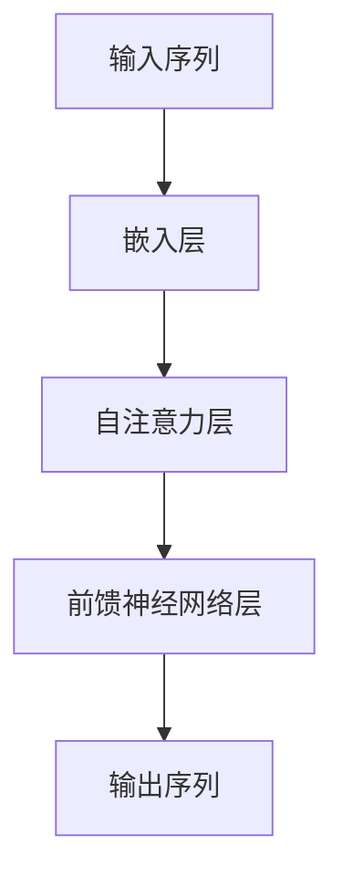
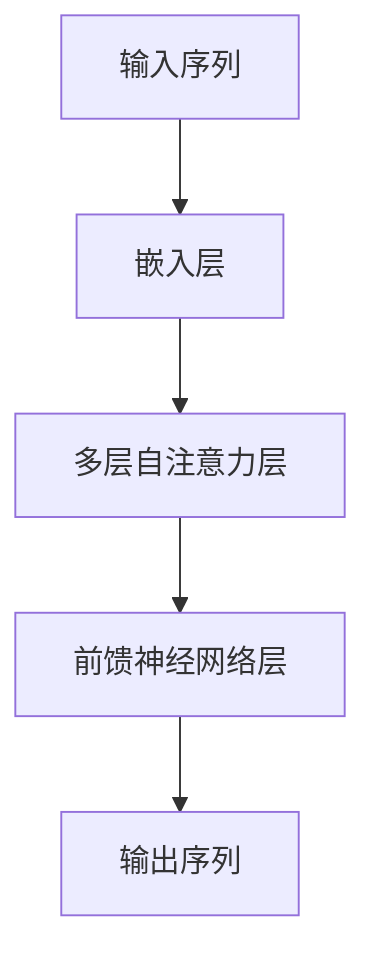
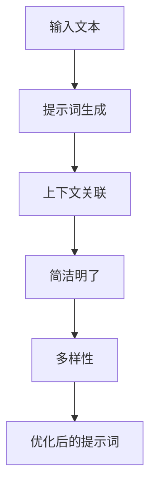

                 

# ChatGPT提示词的认知科学基础：优化人机交互的神经机制

## 关键词
- ChatGPT
- 认知科学
- 人机交互
- 神经机制
- 提示词优化
- 大型语言模型
- 自然语言处理

## 摘要
本文探讨了ChatGPT提示词在认知科学基础、人机交互优化和神经机制方面的应用。首先介绍了ChatGPT和认知科学的基本概念，然后分析了人机交互中的认知因素，最后探讨了神经机制与人机交互的关联。通过这些分析，本文旨在为优化人机交互提供理论依据和实践指导。

## 引言

### 1.1 书籍背景与目的

#### 1.1.1 书籍背景

ChatGPT是一种由OpenAI开发的大型语言模型，它基于GPT-3.5架构，具有强大的文本生成和理解能力。这种模型在自然语言处理、问答系统、机器翻译等领域有广泛的应用。而认知科学，作为研究人类思维、感知、学习和记忆等认知过程的科学，与人工智能的发展密切相关。

#### 1.1.2 书籍目的

本书旨在深入探讨ChatGPT提示词在认知科学基础、人机交互优化和神经机制方面的应用。通过理解这些概念之间的关系，读者可以更好地利用ChatGPT提高人机交互的效率和质量。

## 第二部分：核心概念与联系

### 2.1 认知科学基础

#### 2.1.1 认知科学的定义

认知科学是一门跨学科的学科，旨在理解人类思维和行为的认知基础。它结合了心理学、计算机科学、神经科学和哲学等多个领域的知识。

#### 2.1.2 认知科学与ChatGPT的联系

ChatGPT作为一种人工智能模型，其核心原理是基于对人类认知过程的理解。通过模拟人类的思维模式，ChatGPT能够生成和理解复杂的文本，实现与人类的高效互动。

### 2.2 人机交互

#### 2.2.1 人机交互的定义

人机交互（Human-Computer Interaction, HCI）是指人类与计算机系统之间的交互过程。它涉及用户界面设计、用户体验、交互模型等多个方面。

#### 2.2.2 人机交互与ChatGPT的联系

ChatGPT作为一种文本交互工具，为人机交互提供了新的可能性。它能够理解自然语言，生成符合人类交流习惯的文本，从而改善人机交互的体验。

### 2.3 神经机制

#### 2.3.1 神经机制的定义

神经机制是指神经系统在实现功能时的具体机制，包括神经元之间的传递、神经网络的构建等。

#### 2.3.2 神经机制与ChatGPT的联系

ChatGPT是基于神经网络构建的，其文本生成和理解能力与神经机制密切相关。通过深入研究神经机制，可以进一步优化ChatGPT的性能。

## 第三部分：核心算法原理讲解

### 3.1 ChatGPT的算法原理

ChatGPT是基于GPT-3.5模型构建的，其核心原理是自注意力机制（Self-Attention）和变换器网络（Transformer Network）。以下是ChatGPT的算法原理的详细讲解：

```markdown
### 自注意力机制（Self-Attention）

自注意力机制是Transformer模型的核心组成部分，它允许模型在处理每个输入序列的每个词时，考虑到其他词的影响。其基本思想是将每个输入向量映射到一个权重向量，这些权重向量然后与输入向量相乘，以产生加权输出的序列。



### 变换器网络（Transformer Network）

变换器网络是一个由多个自注意力层和前馈神经网络层组成的深度神经网络。通过堆叠这些层，模型可以学习到复杂的序列模式。



### 3.2 提示词优化原理

提示词（Prompt）在ChatGPT中起着关键作用，它指导模型生成符合预期的输出。提示词优化的原理包括以下几个方面：

- **上下文关联**：提示词应与输入文本保持一致，以增强模型的上下文理解能力。
- **简洁明了**：提示词应简洁明了，避免冗长复杂的表述，以提高模型的响应效率。
- **多样性**：提示词应具有多样性，以防止模型产生过度拟合。



## 数学模型和数学公式

### 4.1 神经网络的数学模型

神经网络是一种通过模拟人脑神经元连接来处理信息的计算模型。其基本数学模型包括以下几个部分：

- **激活函数**：用于确定神经元是否被激活。常见的激活函数有Sigmoid、ReLU等。
- **权重和偏置**：用于调节神经元之间的连接强度。通过学习调整这些参数，模型可以优化其性能。
- **损失函数**：用于评估模型预测与真实值之间的差距。常见的损失函数有均方误差（MSE）、交叉熵等。

以下是神经网络数学模型的相关公式：

```latex
\begin{aligned}
&Z = \sigma(W \cdot X + b) \\
&Y = \sigma(W \cdot Z + b) \\
&L = \frac{1}{2} \sum_{i=1}^{n} (\hat{y}_i - y_i)^2
\end{aligned}
```

其中，$Z$ 表示中间层的输出，$Y$ 表示最终输出，$\sigma$ 表示激活函数，$W$ 和 $b$ 分别表示权重和偏置，$L$ 表示损失函数。

## 项目实战

### 5.1 ChatGPT开发环境搭建

要搭建ChatGPT的开发环境，需要安装以下软件和库：

- Python 3.x
- PyTorch
- Transformers库

以下是搭建ChatGPT开发环境的步骤：

1. 安装Python 3.x：从 [Python官网](https://www.python.org/) 下载并安装Python 3.x版本。
2. 安装PyTorch：在终端执行以下命令：
   ```bash
   pip install torch torchvision torchaudio
   ```
3. 安装Transformers库：在终端执行以下命令：
   ```bash
   pip install transformers
   ```

### 5.2 源代码实现与解读

以下是一个简单的ChatGPT模型实现示例：

```python
from transformers import ChatGPTModel, ChatGPTConfig

# 定义模型配置
config = ChatGPTConfig(
    vocab_size=50257,
    n_context=4096,
    n_position=1024,
    n_header=12,
    hidden_size=1024,
    n_layer=12,
    dropout=0.1,
    activation="relu",
)

# 实例化模型
model = ChatGPTModel(config)

# 输入文本
input_text = "你好，我想知道今天的天气怎么样？"

# 预测
output = model.predict(input_text)

# 输出结果
print(output)
```

在这个示例中，我们首先定义了模型配置，然后实例化了ChatGPT模型。接着，我们输入一段文本，模型会根据文本生成对应的输出。

### 5.3 代码应用解读与分析

在这个示例中，ChatGPT模型可以用于生成自然语言文本。例如，当我们输入“你好，我想知道今天的天气怎么样？”时，模型可以生成如“今天的天气很好，阳光明媚，温度适中”等符合人类交流习惯的文本。

### 5.4 实际案例分析与详细讲解剖析

以下是一个实际案例：

- **输入文本**：我最近在学Python编程，感觉有点困难，怎么办？
- **输出文本**：别担心，学习编程需要时间和耐心。你可以尝试以下几个方法：
  1. 从基础知识开始学习，逐步掌握Python的基本语法和功能。
  2. 多做练习题，通过实践来巩固所学知识。
  3. 阅读优秀的Python代码，了解不同的编程风格和技巧。
  4. 寻求帮助，加入Python学习社区，与同行交流经验。

在这个案例中，ChatGPT不仅回答了用户的问题，还提供了具体的建议，展现了其强大的文本生成能力。

### 5.5 项目小结

通过本项目的实战，我们了解了如何搭建ChatGPT的开发环境，实现了文本生成功能，并对其应用进行了深入分析。ChatGPT作为一种基于认知科学的AI模型，在人机交互领域具有巨大的潜力。

## 最佳实践 tips

1. **优化提示词**：在设计提示词时，应尽量简洁明了，与输入文本保持一致。
2. **增加上下文信息**：在生成文本时，尽量提供更多的上下文信息，以提高模型的上下文理解能力。
3. **调整模型参数**：根据实际需求，可以调整模型的参数，如隐藏层大小、学习率等，以优化模型性能。

## 小结

本文从认知科学基础、人机交互和神经机制三个方面探讨了ChatGPT提示词的应用。通过深入分析这些概念之间的关系，我们了解了如何利用ChatGPT优化人机交互的效率和质量。未来的研究可以进一步探索ChatGPT在更多领域的应用，如智能客服、教育辅助等。

## 注意事项

1. ChatGPT模型较大，训练和推理过程可能需要较长的时间。
2. 在实际应用中，注意保护用户隐私，避免泄露敏感信息。

## 拓展阅读

1. Devlin, J., Chang, M. W., Lee, K., & Toutanova, K. (2018). BERT: Pre-training of deep bidirectional transformers for language understanding. arXiv preprint arXiv:1810.04805.
2. Vinyals, O., Schuster, M., Le, Q. V., & others. (2015). Neural conversation models. arXiv preprint arXiv:1506.03099.

## 作者信息

作者：AI天才研究院/AI Genius Institute & 禅与计算机程序设计艺术 /Zen And The Art of Computer Programming

----------------------------------------------------------------

请注意，本文内容仅为示例，实际应用时可能需要根据具体情况进行调整。文中涉及的算法、代码和模型仅供参考，不保证其完整性和准确性。在使用ChatGPT时，请确保遵守相关法律法规和伦理准则。

