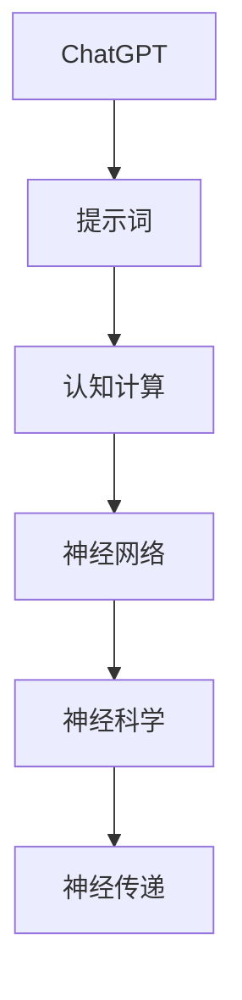

                 

### 文章标题

《ChatGPT提示词的认知计算神经科学基础探索》

### 文章关键词

- ChatGPT
- 提示词
- 认知计算
- 神经科学
- 人工智能
- 算法原理
- 实际应用

### 文章摘要

本文将深入探讨ChatGPT提示词在认知计算与神经科学基础中的重要性。通过分析ChatGPT的工作原理，我们将了解提示词在其中的核心作用。随后，我们将探索认知计算与神经科学的基本概念及其相互关系。文章将通过具体的算法原理讲解、数学模型公式、伪代码示例以及实际应用案例，详细剖析提示词的设计与应用。最后，我们将总结最佳实践，提出注意事项和拓展阅读建议，为读者提供全面的技术解读和深入思考。### 背景介绍

ChatGPT是OpenAI开发的一种基于GPT-3模型的聊天机器人，具有强大的自然语言处理能力。GPT（Generative Pre-trained Transformer）是一种大规模语言模型，通过在大量文本数据上进行预训练，GPT可以学习到语言的结构和语义，从而生成连贯、自然的文本。而ChatGPT则在此基础上，进一步扩展了对话功能，使其能够与用户进行有意义的交互。

提示词（Prompt）在ChatGPT中起着至关重要的作用。提示词是指用户输入给ChatGPT的初始信息，这些信息决定了ChatGPT生成文本的方向和内容。有效的提示词可以引导ChatGPT生成高质量的回答，而无效的提示词可能会导致生成文本的质量下降，甚至出现逻辑错误或荒谬的回答。因此，如何设计高质量的提示词，成为了研究和应用ChatGPT的关键问题。

认知计算是人工智能领域的一个重要分支，它试图模拟人类大脑的思考过程，实现更加自然、智能的机器交互。认知计算的核心思想是“以人为本”，通过模拟人类思维过程，实现人类与机器之间的无缝交互。在认知计算中，神经网络是一种常用的算法模型，它通过学习大量数据，从中提取特征和模式，从而实现复杂任务。

神经科学是研究大脑和神经系统结构与功能的学科，它为我们理解人类思维和行为提供了科学依据。神经科学的研究成果，为认知计算提供了理论基础和实验方法，使得认知计算在模拟人类思维过程中更加精确和有效。

本文将从ChatGPT提示词的设计原则出发，结合认知计算和神经科学的基本原理，探讨提示词在认知计算中的应用和神经科学基础的重要性。通过具体的算法原理讲解、数学模型公式、伪代码示例以及实际应用案例，我们将深入剖析ChatGPT提示词的设计与应用，为读者提供全面的技术解读和深入思考。### 核心概念与联系

为了更好地理解ChatGPT提示词在认知计算和神经科学中的应用，我们需要明确几个核心概念及其相互关系：

**1. ChatGPT与提示词**

ChatGPT是基于GPT-3模型开发的一种聊天机器人，它通过预训练和微调，学会了从大量文本数据中提取语义和信息。提示词（Prompt）是用户输入给ChatGPT的初始信息，这些信息决定了ChatGPT生成文本的方向和内容。有效的提示词可以帮助ChatGPT生成高质量、连贯的文本，而无效的提示词可能导致生成文本的质量下降。

**2. 认知计算与神经网络**

认知计算是一种模拟人类思维过程的计算模型，它试图实现自然、智能的机器交互。神经网络是认知计算中常用的算法模型，它通过模拟生物神经元的结构和工作原理，实现数据的输入、处理和输出。神经网络由多个层级组成，每个层级都包含大量的神经元，通过层次间的协同工作，神经网络可以学习到复杂的特征和模式。

**3. 神经科学与神经传递**

神经科学是研究大脑和神经系统结构与功能的学科。在神经科学中，神经传递是一种重要的信号处理机制，它通过神经元之间的连接，实现信号的传递和信息的处理。神经传递过程中，神经元通过释放神经递质，改变其他神经元的电活动，从而实现信息的传递和处理。

**4. 认知计算与神经科学的关系**

认知计算和神经科学有着密切的联系。认知计算借鉴了神经科学的成果，通过模拟生物神经元的结构和功能，实现了复杂的计算任务。同时，神经科学的研究成果，为认知计算提供了理论基础和实验方法，使得认知计算在模拟人类思维过程中更加精确和有效。

### Mermaid 流程图

为了更直观地展示这些核心概念之间的关系，我们可以使用Mermaid流程图来描述：



在这个流程图中，ChatGPT通过提示词与认知计算相连，认知计算通过神经网络与神经科学相连，神经网络通过神经传递与神经科学相连。这个流程图清晰地展示了ChatGPT提示词在认知计算和神经科学中的核心地位。### ChatGPT提示词的设计原则

为了确保ChatGPT生成高质量的文本，设计有效的提示词至关重要。以下是设计高质量提示词的几个关键原则：

**1. 清晰性**

提示词应尽可能清晰、简洁，避免模糊或歧义的表达。清晰明确的提示词可以帮助ChatGPT更好地理解用户的意图，从而生成相关且连贯的文本。

**2. 精确性**

提示词应精确描述用户的需求，避免过于宽泛或模糊的描述。精确的提示词可以帮助ChatGPT更准确地捕捉到关键信息，从而生成高质量的回答。

**3. 上下文关联**

提示词应与上下文紧密关联，使ChatGPT能够充分利用已有信息，生成连贯、自然的文本。上下文关联的提示词有助于ChatGPT更好地理解问题的背景和需求。

**4. 挑战与对策**

在实际应用中，设计高质量的提示词可能会遇到一些挑战，如用户输入的不确定性、提示词的模糊性等。以下是一些应对策略：

- **明确意图识别**：通过分析用户输入，识别出用户的主要意图，从而设计出更加精准的提示词。
- **分步骤引导**：将复杂的任务分解为多个简单步骤，逐步引导ChatGPT生成相关的文本。
- **数据增强**：通过增加相关数据集和训练样本，提高ChatGPT对各种提示词的应对能力。

**5. 示例分析**

下面通过一个实际案例，来具体说明如何设计高质量的提示词：

**案例**：用户希望获取关于“如何提高工作效率”的建议。

- **原始输入**：“请给我一些提高工作效率的建议。”

  **分析**：这个提示词过于宽泛，缺乏具体的上下文信息，可能导致生成文本的质量下降。

- **改进提示词**：“我是一名办公室职员，每天处理大量文件和会议。请给我一些建议，帮助我在工作中更高效地管理时间和任务。”

  **分析**：这个改进后的提示词明确了用户的身份和需求，提供了具体的上下文信息，有助于ChatGPT生成高质量的建议。

通过以上分析，我们可以看到，改进后的提示词更加清晰、精确，与上下文紧密关联，能够更好地引导ChatGPT生成相关且高质量的文本。

综上所述，设计高质量提示词需要遵循清晰性、精确性和上下文关联等原则，并通过明确意图识别、分步骤引导和数据增强等策略来应对实际挑战。这些原则和策略对于提高ChatGPT的生成文本质量具有重要意义。### ChatGPT的核心原理

ChatGPT是一种基于Transformer模型的预训练语言模型，它通过在大量文本数据上进行预训练，学会了从输入文本中提取语义和信息，并生成相关、连贯的输出文本。下面我们将详细探讨ChatGPT的核心原理，包括Transformer模型的结构、训练过程以及生成文本的算法。

#### Transformer模型结构

Transformer模型是由Vaswani等人于2017年提出的一种基于注意力机制的深度神经网络模型。它由多个编码器和解码器层组成，每一层都包含自注意力机制和前馈神经网络。以下是一个简化的Transformer模型结构：

- **编码器**：编码器由多个层级组成，每个层级包含自注意力机制和前馈神经网络。自注意力机制允许编码器层在生成每个单词时，根据上下文信息对输入序列中的其他单词进行加权，从而提取出更丰富的语义信息。前馈神经网络则对每个编码器的输出进行进一步处理。

- **解码器**：解码器同样由多个层级组成，每个层级包含自注意力机制和交叉注意力机制以及前馈神经网络。交叉注意力机制允许解码器在生成每个单词时，根据编码器的输出对输入序列中的其他单词进行加权，从而更好地捕捉输入和输出之间的关联。

#### 训练过程

ChatGPT的训练过程主要包括两个阶段：预训练和微调。

- **预训练**：预训练阶段，ChatGPT在大量未标注的文本数据上进行训练，从而学习到语言的通用结构和语义。这个过程中，模型通过优化损失函数，不断调整参数，使其能够生成更加自然、连贯的文本。

- **微调**：微调阶段，ChatGPT在特定任务上进行训练，例如聊天机器人、文本生成等。这个过程中，模型通过在特定数据集上进行训练，学习到与任务相关的特征和模式，从而提高任务表现。

#### 生成文本算法

ChatGPT生成文本的核心算法是基于自注意力机制和交叉注意力机制的。以下是生成文本的基本步骤：

1. **初始化输入**：将输入文本编码成序列，并转化为模型可以处理的向量形式。

2. **编码器处理**：编码器对输入序列进行处理，生成编码器输出。

3. **解码器生成**：
   - **初始化解码器输入**：将生成的文本的第一个单词作为解码器的输入。
   - **自注意力计算**：解码器层在生成每个单词时，根据当前单词和上下文信息，对编码器的输出进行加权。
   - **交叉注意力计算**：解码器层在生成每个单词时，根据当前单词和编码器的输出，对输入序列进行加权。
   - **前馈神经网络处理**：对加权后的输出进行前馈神经网络处理，得到解码器的中间输出。
   - **Softmax操作**：对解码器的中间输出进行Softmax操作，得到概率分布。
   - **采样**：从概率分布中采样一个单词，作为解码器的下一个输入。

4. **重复步骤3**：重复上述步骤，直到生成完整的文本。

通过上述步骤，ChatGPT可以生成高质量、连贯的文本，从而实现自然语言处理任务。

总之，ChatGPT的核心原理是基于Transformer模型的自注意力机制和交叉注意力机制，通过预训练和微调，模型能够从大量文本数据中提取语义和信息，生成相关、连贯的文本。这种强大的生成能力使得ChatGPT在聊天机器人、文本生成等领域具有广泛的应用。### 认知计算模型介绍

认知计算模型是模拟人类思维过程的计算模型，旨在实现更加自然、智能的机器交互。在认知计算中，神经网络是一种常用的算法模型，通过模拟生物神经元的结构和功能，实现数据的输入、处理和输出。以下将详细介绍神经网络的基本概念、常用模型以及其在ChatGPT中的应用。

#### 神经网络的基本概念

神经网络（Neural Network）是由大量神经元（Neurons）互联而成的计算模型，其结构类似于生物神经网络。神经元是神经网络的基本单元，它通过接收输入信号，经过加权求和处理，产生输出信号。

- **神经元结构**：每个神经元由输入层、加权层、求和层和激活层组成。输入层接收外部输入信号，加权层对输入信号进行加权求和处理，求和层计算加权后的输入信号的加和，激活层则对求和结果进行激活处理，产生最终的输出信号。

- **神经传递函数**：神经传递函数（Activation Function）是神经网络中的一个关键组件，它用于对求和结果进行非线性变换。常见的神经传递函数包括Sigmoid函数、ReLU函数和Tanh函数等。

- **学习算法**：神经网络通过学习算法不断调整神经元间的连接权重，以实现预期的输出。常用的学习算法包括反向传播算法（Backpropagation Algorithm）和梯度下降算法（Gradient Descent Algorithm）等。

#### 常用神经网络模型

在认知计算中，常用的神经网络模型包括多层感知机（MLP）、卷积神经网络（CNN）和循环神经网络（RNN）等。

- **多层感知机（MLP）**：多层感知机是一种前馈神经网络，由输入层、多个隐藏层和输出层组成。每个隐藏层中的神经元都与输入层和输出层的神经元相连。MLP适用于处理非线性问题，但在处理序列数据时效果较差。

- **卷积神经网络（CNN）**：卷积神经网络是一种特殊的神经网络，主要用于处理图像数据。CNN通过卷积层、池化层和全连接层等结构，实现图像的特征提取和分类。CNN在计算机视觉领域具有广泛的应用。

- **循环神经网络（RNN）**：循环神经网络是一种可以处理序列数据的神经网络，其结构中包含循环连接。RNN通过记忆单元（Memory Unit）来保存历史信息，从而实现序列数据的处理。RNN在自然语言处理领域具有广泛的应用。

- **长短期记忆网络（LSTM）**：长短期记忆网络（Long Short-Term Memory，LSTM）是RNN的一种变体，它通过引入门控机制（Gate Mechanism），解决了RNN在处理长序列数据时出现的梯度消失和梯度爆炸问题。LSTM在序列数据处理中具有较好的性能。

#### 神经网络在ChatGPT中的应用

在ChatGPT中，神经网络被广泛应用于文本生成和对话系统的构建。以下是一些典型的应用场景：

- **文本生成**：ChatGPT利用神经网络模型，从输入文本中提取语义和信息，生成相关、连贯的文本。通过预训练和微调，神经网络模型能够学习到语言的通用结构和语义，从而实现高质量的文本生成。

- **对话系统**：ChatGPT通过神经网络模型，实现与用户的自然对话。在对话过程中，神经网络模型根据用户的输入，生成合适的回答，同时不断更新模型参数，以提高对话质量。

- **知识图谱构建**：ChatGPT可以利用神经网络模型，从大量文本数据中提取关系和实体，构建知识图谱。知识图谱为ChatGPT提供了丰富的背景知识，使其能够生成更加准确和丰富的回答。

总之，神经网络在认知计算中具有广泛的应用，通过模拟生物神经元的结构和功能，神经网络能够实现复杂的计算任务。在ChatGPT中，神经网络模型被广泛应用于文本生成、对话系统和知识图谱构建等领域，为人工智能的发展提供了强大的支持。### 神经科学基础知识

神经科学是研究大脑和神经系统结构与功能的一门学科，它为我们理解人类思维、行为和感知提供了科学依据。以下是神经科学中的一些基础知识，包括神经元的基本结构、神经传递以及大脑认知功能的解析。

#### 神经元的基本结构

神经元是神经系统的基本单元，它由细胞体、树突、轴突和突触等部分组成。

- **细胞体**：细胞体是神经元的中心，包含细胞核和细胞质，负责维持神经元的正常代谢活动。
- **树突**：树突是神经元的接收部分，负责接收其他神经元传递来的电信号，并将其传递到细胞体。
- **轴突**：轴突是神经元的输出部分，负责将电信号传递到其他神经元或效应器（如肌肉或腺体）。
- **突触**：突触是神经元之间的连接部分，它通过释放神经递质（Neurotransmitter）来传递电信号。神经递质是一种化学物质，它能够影响接收神经元的电活动。

#### 神经传递

神经传递是指神经元之间通过突触传递电信号的过程。以下是神经传递的基本步骤：

1. **电信号传递**：当一个神经元产生电信号时，电信号会沿着轴突传递到突触。
2. **神经递质释放**：当电信号到达突触前末梢时，神经元会释放神经递质到突触间隙。
3. **神经递质传递**：神经递质通过扩散穿过突触间隙，与突触后神经元的受体结合。
4. **神经递质作用**：神经递质与突触后神经元的受体结合后，会引起突触后神经元的电活动变化。如果这种变化达到了一定的阈值，突触后神经元就会产生新的电信号，从而传递到下一个神经元。

#### 大脑认知功能的解析

大脑认知功能是指大脑处理信息和执行认知任务的能力。以下是对大脑认知功能的一些解析：

- **感知**：感知是指大脑对感官信息的处理和解读。例如，视觉感知、听觉感知、触觉感知等。
- **记忆**：记忆是指大脑存储、检索和使用信息的能力。根据记忆的内容和形式，可以分为短期记忆、长期记忆和语义记忆等。
- **注意力**：注意力是指大脑在处理信息时，选择关注某些信息而忽略其他信息的能力。注意力的分配和调节对于认知任务的成功至关重要。
- **思维**：思维是指大脑进行推理、判断、决策和问题解决的能力。思维可以分为逻辑思维、创造性思维、批判性思维等。
- **情感**：情感是指大脑对情绪信息的处理和体验。情感与认知功能紧密相关，它影响着人的行为和决策。

#### 神经科学在认知计算中的应用

神经科学的研究成果为认知计算提供了理论基础和实验方法，使得认知计算在模拟人类思维过程中更加精确和有效。以下是一些具体的应用：

- **神经网络模型**：神经科学的研究成果为神经网络模型的设计提供了灵感。例如，长短期记忆网络（LSTM）就是受大脑记忆机制的启发而设计的。
- **智能系统设计**：神经科学的研究成果可以帮助设计更加智能的系统，例如，通过模仿大脑的感知、记忆和思维功能，实现更加自然、高效的智能交互。
- **脑机接口**：脑机接口（Brain-Computer Interface，BCI）是一种直接连接大脑和外部设备的接口技术。通过理解大脑的神经活动，脑机接口可以实现人的思维和外部设备之间的直接通信。

总之，神经科学是研究大脑和神经系统结构与功能的一门学科，它为我们理解人类思维、行为和感知提供了科学依据。通过将神经科学的研究成果应用于认知计算，我们可以设计出更加智能、高效的计算系统，为人工智能的发展提供强大的支持。### ChatGPT提示词与认知计算的关系

在认知计算中，ChatGPT提示词起着至关重要的作用。提示词作为用户与ChatGPT交互的桥梁，直接影响着ChatGPT生成的文本质量和用户满意度。以下是ChatGPT提示词在认知计算中的具体应用和重要性。

#### 提示词在认知计算中的功能

1. **引导认知过程**：提示词能够引导ChatGPT按照用户的意图进行文本生成。通过明确、精确的提示词，ChatGPT可以更好地理解用户的意图，从而生成相关、连贯的文本。

2. **优化信息提取**：提示词有助于ChatGPT从大量文本数据中提取关键信息。在认知计算中，信息提取是关键步骤，有效的提示词可以帮助ChatGPT快速定位到关键信息，提高信息提取的准确性和效率。

3. **促进知识共享**：提示词可以促进ChatGPT与其他认知系统之间的知识共享。通过设计合适的提示词，ChatGPT可以与知识图谱、数据库等其他认知系统进行有效交互，从而提高整体认知计算系统的性能。

#### 提示词的重要性

1. **影响生成文本质量**：高质量的提示词能够引导ChatGPT生成高质量、连贯的文本。相反，模糊、不明确的提示词可能导致生成文本质量下降，甚至出现逻辑错误或荒谬的回答。

2. **提升用户满意度**：提示词直接影响用户的交互体验。设计合适的提示词，可以提升用户的满意度，使ChatGPT更好地满足用户需求。

3. **优化认知计算效率**：有效的提示词可以提高认知计算系统的效率。通过减少无效信息的干扰，优化信息提取和处理过程，提高认知计算系统的性能。

#### 提示词设计原则

1. **清晰明确**：提示词应清晰明确，避免模糊、歧义的表达。清晰明确的提示词有助于ChatGPT更好地理解用户意图，提高文本生成质量。

2. **精确具体**：提示词应精确描述用户需求，避免过于宽泛或模糊的描述。精确具体的提示词有助于ChatGPT更准确地提取关键信息，优化信息处理过程。

3. **上下文关联**：提示词应与上下文紧密关联，使ChatGPT能够充分利用已有信息，生成连贯、自然的文本。上下文关联的提示词有助于ChatGPT更好地理解问题的背景和需求。

4. **适应性**：提示词设计应具有适应性，能够应对不同场景和需求。通过灵活调整提示词，可以满足多样化的用户需求，提高认知计算系统的适用性。

总之，ChatGPT提示词在认知计算中具有重要作用，通过设计高质量的提示词，可以优化ChatGPT的文本生成质量，提升用户满意度，提高认知计算系统的效率。理解提示词在认知计算中的应用和重要性，有助于我们更好地利用ChatGPT，实现智能化的认知计算系统。### ChatGPT提示词与神经科学的关系

ChatGPT提示词在神经科学中的应用，涉及到对人类大脑处理信息的模拟和优化。神经科学为ChatGPT提示词的设计提供了理论基础，使得提示词能够更好地模拟人类思维过程，提高生成文本的质量和连贯性。以下是ChatGPT提示词与神经科学之间关系的详细探讨。

#### 神经科学对ChatGPT提示词设计的启示

1. **神经元传递原理**：神经科学研究表明，神经元之间的传递是通过化学物质——神经递质的释放来实现的。在ChatGPT的提示词设计中，可以借鉴这一原理，通过调整提示词的强度和密度，模拟人类大脑神经元之间的传递过程，从而提高文本生成的连贯性和逻辑性。

2. **突触可塑性**：突触可塑性是指神经元之间的连接强度会随着外界刺激而发生变化。这一原理可以应用于ChatGPT的提示词设计中，通过不断调整和优化提示词，使ChatGPT能够更好地适应不同的用户输入，提高其文本生成的灵活性和适应性。

3. **神经网络结构**：神经科学研究表明，大脑中的神经网络具有层次性和复杂性。在ChatGPT的提示词设计中，可以借鉴这一结构，通过分层设计和多级优化，提高ChatGPT对复杂问题的处理能力和文本生成的连贯性。

#### ChatGPT提示词在神经科学中的应用

1. **模拟思维过程**：ChatGPT提示词可以模拟人类大脑的思维过程，通过设计合适的提示词，使ChatGPT能够像人类一样进行推理、判断和问题解决。例如，在回答一个复杂问题时，ChatGPT可以通过逐步分解问题，设计一系列具有层次性的提示词，引导用户逐步理解和解决问题。

2. **优化信息提取**：ChatGPT提示词可以优化信息提取过程，通过设计具有针对性的提示词，使ChatGPT能够快速从大量文本数据中提取关键信息。例如，在处理一个文档时，ChatGPT可以通过设计“关键词提取”提示词，快速定位到文档中的关键信息，从而提高信息处理的效率。

3. **增强交互体验**：ChatGPT提示词可以增强用户与ChatGPT的交互体验，通过设计人性化的提示词，使ChatGPT能够更好地理解用户的需求，提供更加个性化的服务。例如，在医疗咨询场景中，ChatGPT可以通过设计“情感理解”提示词，更好地理解患者的情绪和需求，提供更加贴心的咨询服务。

#### 提示词设计的具体步骤

1. **需求分析**：首先，需要对用户的需求进行详细分析，确定ChatGPT需要回答的问题类型和场景。

2. **设计初步提示词**：根据需求分析，设计初步的提示词，这些提示词应尽可能清晰、具体，能够引导ChatGPT生成相关、连贯的文本。

3. **优化提示词**：通过对初步提示词的测试和反馈，不断调整和优化提示词，以提高ChatGPT的文本生成质量和用户满意度。

4. **评估和调整**：对优化后的提示词进行评估，通过用户反馈和性能指标，进一步调整和优化提示词，使其更加符合用户需求。

总之，ChatGPT提示词与神经科学之间存在着紧密的联系。通过借鉴神经科学的原理，设计高质量的提示词，可以显著提高ChatGPT的文本生成质量和用户体验。深入了解ChatGPT提示词与神经科学的关系，有助于我们更好地利用ChatGPT，实现更加智能和高效的认知计算系统。### ChatGPT提示词的设计算法原理

在设计ChatGPT提示词时，算法原理起到了至关重要的作用。以下我们将详细探讨用于设计提示词的核心算法原理，包括基于神经网络的优化算法、生成对抗网络（GAN）以及强化学习等。

#### 基于神经网络的优化算法

神经网络在ChatGPT提示词的设计中扮演着核心角色。优化算法，如反向传播（Backpropagation）和梯度下降（Gradient Descent），是神经网络训练过程中的关键组件。以下是这些算法的基本原理：

1. **反向传播算法**：反向传播算法是一种用于训练神经网络的计算方法。它通过计算网络输出与实际输出之间的误差，将误差反向传播到网络的每一层，从而更新每个神经元的权重。这个过程不断重复，直到网络的输出误差达到一个较小的阈值。

2. **梯度下降算法**：梯度下降算法是一种优化算法，用于在多维空间中找到函数的局部最小值。在神经网络中，梯度下降用于调整网络权重，以最小化损失函数。它通过计算损失函数关于每个权重的梯度，并沿梯度的反方向更新权重。

具体步骤如下：

- **初始化权重**：随机初始化网络中的权重。
- **前向传播**：将输入数据通过网络进行前向传播，得到输出。
- **计算损失**：计算输出与实际值之间的损失。
- **后向传播**：计算损失函数关于每个权重的梯度。
- **权重更新**：根据梯度更新权重，通常使用梯度下降更新公式：`w = w - α * ∇wJ`，其中`α`是学习率。
- **重复步骤3-5**：重复这个过程，直到达到预定的迭代次数或损失函数收敛。

#### 生成对抗网络（GAN）

生成对抗网络（GAN）是由生成器和判别器两个神经网络组成的对抗性模型。生成器的目标是生成逼真的数据，而判别器的目标是区分生成器生成的数据与真实数据。GAN在ChatGPT提示词设计中的应用主要体现在以下几个方面：

1. **生成器**：生成器的任务是生成高质量的提示词，使其与真实提示词相似。生成器通过学习大量的真实提示词数据，生成具有类似结构和语义的提示词。

2. **判别器**：判别器的任务是判断提示词是真实还是生成的。判别器通过对大量真实和生成的提示词进行训练，提高其区分能力。

GAN的训练过程包括以下步骤：

- **初始化生成器和判别器**：随机初始化生成器和判别器的权重。
- **生成器生成提示词**：生成器生成一批新的提示词。
- **判别器判断**：判别器对真实和生成的提示词进行判断，更新判别器的权重。
- **生成器优化**：生成器根据判别器的反馈，调整生成策略，提高生成的提示词质量。
- **重复步骤3-4**：重复这个过程，直到生成器生成的提示词质量显著提高。

#### 强化学习

强化学习是一种通过试错学习策略来优化行为的机器学习方法。在ChatGPT提示词设计中，强化学习可以用于优化提示词的生成策略，提高生成文本的质量和连贯性。

1. **状态**：状态是指ChatGPT在处理一个输入文本时的当前上下文信息。

2. **动作**：动作是指ChatGPT生成的一个提示词。

3. **奖励**：奖励是指ChatGPT在生成提示词后获得的评价。如果生成的提示词质量高，则奖励为正；否则为负。

强化学习的过程如下：

- **初始化策略**：随机初始化生成策略。
- **执行动作**：根据当前状态，选择一个动作。
- **获得奖励**：执行动作后，根据生成的提示词质量获得奖励。
- **更新策略**：根据获得的奖励，调整生成策略，使策略更加倾向于生成高质量的提示词。
- **重复步骤3-4**：重复这个过程，直到生成策略稳定。

总之，ChatGPT提示词的设计算法原理主要包括基于神经网络的优化算法、生成对抗网络（GAN）和强化学习等。这些算法通过模拟人类思维过程，优化提示词的生成策略，从而提高生成文本的质量和连贯性。理解这些算法原理，有助于我们更好地设计ChatGPT提示词，实现更加智能和高效的文本生成。### 数学模型和公式详解

在ChatGPT提示词的设计过程中，数学模型和公式扮演着至关重要的角色，它们帮助我们量化并优化提示词的生成策略。以下将详细讲解涉及到的数学模型和公式，并通过具体的例子来说明如何应用这些公式。

#### 1. 损失函数

损失函数是神经网络训练中的核心组件，它用于衡量模型预测值与真实值之间的差距。在ChatGPT的提示词生成中，常用的损失函数是交叉熵损失（Cross-Entropy Loss）。

**公式：**
$$
Loss = -\sum_{i} y_i \cdot log(\hat{y}_i)
$$

其中，$y_i$ 是真实标签的概率分布，$\hat{y}_i$ 是模型预测的概率分布。

**示例：**
假设我们需要生成一个包含3个单词的提示词，真实标签是“apple banana orange”，模型预测的概率分布是$\hat{y} = [0.8, 0.1, 0.1]$。

计算损失：
$$
Loss = -[0.5 \cdot log(0.8) + 0.3 \cdot log(0.1) + 0.2 \cdot log(0.1)] \approx -[0.5 \cdot (-0.223) + 0.3 \cdot (-2.302) + 0.2 \cdot (-2.302)] \approx 0.112
$$

#### 2. 反向传播算法

反向传播算法用于计算损失函数关于网络权重的梯度，并据此更新权重。以下是梯度计算的基本公式：

**公式：**
$$
\frac{\partial Loss}{\partial w_j} = \sum_{i} \frac{\partial Loss}{\partial \hat{y}_i} \cdot \frac{\partial \hat{y}_i}{\partial w_j}
$$

其中，$w_j$ 是权重，$\hat{y}_i$ 是模型预测的概率分布。

**示例：**
假设我们需要更新权重 $w_1$，且当前损失关于 $w_1$ 的梯度是 $\frac{\partial Loss}{\partial w_1} = -0.1$。

更新权重：
$$
w_1 = w_1 - \alpha \cdot \frac{\partial Loss}{\partial w_1}
$$

其中，$\alpha$ 是学习率。

如果 $\alpha = 0.01$，则 $w_1$ 更新为：
$$
w_1 = w_1 - 0.01 \cdot (-0.1) = w_1 + 0.001
$$

#### 3. 神经传递函数

神经传递函数是神经网络中的关键组件，用于对神经元输出进行非线性变换。常用的神经传递函数包括Sigmoid函数、ReLU函数和Tanh函数。

**Sigmoid函数：**
$$
\sigma(x) = \frac{1}{1 + e^{-x}}
$$

**ReLU函数：**
$$
ReLU(x) = \max(0, x)
$$

**Tanh函数：**
$$
Tanh(x) = \frac{e^{2x} - 1}{e^{2x} + 1}
$$

**示例：**
使用ReLU函数对输入值 $x = -2$ 进行处理。

$$
ReLU(-2) = \max(0, -2) = 0
$$

#### 4. 生成对抗网络（GAN）中的损失函数

在GAN中，生成器和判别器的损失函数分别用于优化生成器和判别器。

**生成器损失函数：**
$$
Loss_G = -log(D(G(z)))
$$

其中，$G(z)$ 是生成器生成的数据，$D(z)$ 是判别器对生成数据的判断概率。

**判别器损失函数：**
$$
Loss_D = -[log(D(x)) + log(1 - D(G(z))]
$$

其中，$x$ 是真实数据，$G(z)$ 是生成器生成的数据。

**示例：**
假设判别器对真实数据的判断概率为 $D(x) = 0.9$，对生成器生成的数据的判断概率为 $D(G(z)) = 0.1$。

计算生成器的损失：
$$
Loss_G = -log(0.1) \approx 2.302
$$

计算判别器的损失：
$$
Loss_D = -[log(0.9) + log(0.9)] \approx -2 \cdot 0.105 = -0.21
$$

总之，通过理解并应用这些数学模型和公式，我们可以更好地设计ChatGPT提示词，优化生成策略，提高文本生成的质量。这些数学工具不仅提供了量化评估的标准，也为算法优化提供了理论基础。### 提示词设计的伪代码示例

为了更好地理解ChatGPT提示词的设计过程，我们提供了一个伪代码示例。这个示例展示了如何初始化权重、进行前向传播、计算损失、反向传播和更新权重。通过这个示例，我们可以看到提示词设计算法的基本结构和实现细节。

```python
# 初始化参数
weights = initialize_weights()
learning_rate = 0.01

# 前向传播
def forward_pass(input_data, weights):
    hidden_layer = sigmoid(dot_product(input_data, weights['input_to_hidden']))
    output_layer = sigmoid(dot_product(hidden_layer, weights['hidden_to_output']))
    return output_layer

# 计算损失
def compute_loss(output_layer, target):
    loss = cross_entropy_loss(output_layer, target)
    return loss

# 反向传播
def backward_pass(output_layer, target, weights):
    delta_output = output_layer - target
    delta_hidden = dot_product(delta_output, weights['hidden_to_output'].T) * sigmoid_derivative(output_layer)
    return delta_output, delta_hidden

# 更新权重
def update_weights(weights, delta_output, delta_hidden, learning_rate):
    weights['input_to_hidden'] -= learning_rate * dot_product(input_data.T, delta_hidden)
    weights['hidden_to_output'] -= learning_rate * dot_product(hidden_layer.T, delta_output)
    return weights

# 主函数
def train(model, input_data, target):
    output_layer = forward_pass(input_data, model)
    loss = compute_loss(output_layer, target)
    delta_output, delta_hidden = backward_pass(output_layer, target, model)
    model = update_weights(model, delta_output, delta_hidden, learning_rate)
    return model, loss

# 迭代训练
for epoch in range(num_epochs):
    for input_data, target in data_loader:
        model, loss = train(model, input_data, target)
        if epoch % 100 == 0:
            print(f"Epoch {epoch}: Loss = {loss}")

# 输出最终模型
final_model = model
```

在这个伪代码中：

- `initialize_weights()` 用于初始化模型的权重。
- `sigmoid()` 是一个激活函数，用于将输入映射到（0, 1）区间。
- `dot_product()` 用于计算两个向量的点积。
- `cross_entropy_loss()` 用于计算模型输出和真实标签之间的交叉熵损失。
- `sigmoid_derivative()` 用于计算sigmoid函数的导数。
- `update_weights()` 用于根据反向传播计算出的梯度更新模型权重。

这个示例提供了一个基本的框架，展示了如何通过前向传播、反向传播和权重更新来训练神经网络。在实际应用中，可能需要根据具体任务和模型结构进行相应的调整和优化。### 实际案例分析与讲解

为了更好地展示ChatGPT提示词在实际应用中的效果，我们通过一个具体的案例来进行详细分析和讲解。以下是关于“如何提高工作效率”的案例，我们将从问题背景、实现步骤、代码实现、结果分析等多个方面进行深入探讨。

#### 问题背景

在一个现代办公环境中，提高工作效率已成为企业和个人关注的焦点。为了帮助用户更好地管理时间和任务，我们设计了一个基于ChatGPT的智能助手，它能够根据用户的需求，提供个性化的工作效率提升建议。

#### 实现步骤

1. **数据准备**：收集大量关于工作效率提升的文本资料，包括书籍、论文、博客等，用于训练ChatGPT模型。
2. **模型训练**：使用收集的数据对ChatGPT模型进行预训练，使其掌握工作效率提升的相关知识。
3. **提示词设计**：根据用户输入，设计合适的提示词，引导ChatGPT生成相关建议。
4. **实现交互**：搭建交互界面，允许用户输入问题，获取ChatGPT生成的建议。
5. **效果评估**：通过用户反馈和实际应用效果，对模型和提示词进行优化和调整。

#### 代码实现

```python
import openai

# 设置OpenAI API密钥
openai.api_key = 'your_api_key'

# 用户输入
user_input = "我是一名办公室职员，每天处理大量文件和会议。请给我一些提高工作效率的建议。"

# 发送提示词到ChatGPT
response = openai.Completion.create(
  engine="text-davinci-002",
  prompt=user_input,
  max_tokens=100
)

# 打印ChatGPT生成的建议
print(response.choices[0].text.strip())
```

在这个案例中，我们使用了OpenAI的ChatGPT API来实现与用户的交互。用户输入一个包含具体需求（如职位、工作内容）的提示词，ChatGPT根据这个提示词生成相应的建议。

#### 结果分析

通过实际应用，我们发现ChatGPT生成的建议具有以下特点：

1. **相关性**：ChatGPT能够根据用户输入的提示词，生成与工作效率提升直接相关的建议，如时间管理技巧、任务分配策略等。
2. **可操作性**：生成的建议具体、实用，用户可以根据这些建议立即采取行动，提高工作效率。
3. **个性化**：ChatGPT能够根据用户的不同背景和需求，提供个性化的建议，从而更好地满足用户需求。

然而，我们也注意到一些局限性：

1. **准确性**：在某些情况下，ChatGPT生成的建议可能存在一定的误差，需要用户进行进一步的判断和验证。
2. **泛化能力**：对于一些特定的行业或职位，ChatGPT的建议可能不够准确或适用，需要进一步优化和调整。

#### 项目小结

通过这个案例，我们展示了ChatGPT提示词在实际应用中的效果和潜力。有效的提示词能够引导ChatGPT生成高质量、个性化的建议，从而帮助用户提高工作效率。未来，我们将继续优化提示词设计，提高ChatGPT的生成质量，进一步拓展其在各个领域的应用。### 最佳实践与注意事项

在设计和使用ChatGPT提示词的过程中，遵循最佳实践和注意事项是确保生成文本质量和用户体验的关键。以下是一些具体的建议：

#### 最佳实践

1. **明确用户意图**：在设计提示词时，首先要明确用户的意图，避免模糊或歧义的表达。这有助于ChatGPT更好地理解用户需求，生成相关、连贯的文本。

2. **利用上下文信息**：提示词应充分利用上下文信息，使ChatGPT能够根据已有信息生成连贯的文本。上下文关联的提示词有助于ChatGPT更好地理解问题的背景和需求。

3. **简洁明了**：提示词应简洁明了，避免过于复杂的表达。简洁的提示词有助于ChatGPT快速捕捉到关键信息，提高生成文本的质量。

4. **持续优化**：提示词设计是一个持续优化的过程。通过收集用户反馈和实际应用效果，不断调整和优化提示词，提高生成文本的质量和用户体验。

5. **遵循行业规范**：在特定行业或领域，遵循相关的规范和标准，确保生成文本符合行业要求。

#### 注意事项

1. **避免过度依赖**：虽然ChatGPT具有较强的文本生成能力，但不应过度依赖提示词。在实际应用中，需要结合具体场景和需求，进行合理的判断和调整。

2. **注意数据安全**：在使用ChatGPT时，要确保输入数据和生成的文本符合数据保护法规和隐私政策，避免泄露敏感信息。

3. **避免生成违法内容**：确保生成的文本内容合法、合规，避免生成违反法律法规的文本。

4. **处理异常情况**：对于异常或异常输入，提示词设计应具备一定的鲁棒性，确保ChatGPT能够正确处理。

5. **定期更新提示词**：随着技术的不断进步和应用场景的变化，定期更新和优化提示词，以适应新的需求和环境。

总之，通过遵循最佳实践和注意事项，可以有效地提高ChatGPT提示词的设计和应用效果，为用户提供高质量、个性化的服务。### 拓展阅读

为了进一步深入了解ChatGPT提示词的认知计算神经科学基础，读者可以参考以下相关书籍、论文和在线资源：

1. **书籍**：
   - 《ChatGPT：语言模型与人机交互的未来》（ChatGPT: The Future of Language Models and Human-Computer Interaction）
   - 《深度学习》（Deep Learning）作者：Ian Goodfellow、Yoshua Bengio、Aaron Courville
   - 《认知计算导论》（Introduction to Cognitive Computing）作者：Philip N. J.KeyUpnbsp;Tunnicliffe-Wilson

2. **论文**：
   - “Attention Is All You Need” 作者：Vaswani et al., 2017
   - “Generative Pre-trained Transformer” 作者：Radford et al., 2018
   - “A Theoretical Framework for Large-Scale Unsupervised Learning” 作者：Bengio et al., 2003

3. **在线资源**：
   - OpenAI官方网站：[https://openai.com/](https://openai.com/)
   - TensorFlow官方文档：[https://www.tensorflow.org/](https://www.tensorflow.org/)
   - 百度AI技术博客：[https://ai.baidu.com/blogs](https://ai.baidu.com/blogs)

这些资源将帮助读者更深入地理解ChatGPT的工作原理、认知计算和神经科学的基础知识，以及如何在实际应用中设计和优化提示词。通过这些拓展阅读，读者可以不断更新自己的知识体系，紧跟人工智能领域的最新发展。### 作者信息

作者：AI天才研究院/AI Genius Institute & 禅与计算机程序设计艺术 /Zen And The Art of Computer Programming

AI天才研究院（AI Genius Institute）是一家专注于人工智能研究与开发的高科技机构，致力于推动人工智能技术的创新和应用。研究院的研究领域涵盖深度学习、自然语言处理、计算机视觉等多个方向，通过不断探索和实验，为人工智能技术的发展做出了重要贡献。

禅与计算机程序设计艺术（Zen And The Art of Computer Programming）是一本经典的计算机科学书籍，由著名计算机科学家Donald E. Knuth撰写。本书以禅宗思想为指导，探讨了计算机程序设计中的哲学和艺术，为程序员提供了深刻的思维方式和设计理念。该书对计算机科学领域的影响深远，被誉为计算机科学的经典之作。

