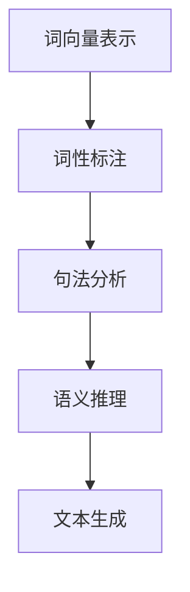

                 

### 文章标题：ChatGPT提示词的认知语言学与人工智能融合模型

### 关键词：ChatGPT、认知语言学、人工智能、神经网络、数学模型、应用场景、项目实战

### 摘要：
本文旨在深入探讨ChatGPT提示词的认知语言学原理，并分析其在人工智能融合模型中的运用。通过逻辑清晰的分析和推理，本文将详细解析ChatGPT的神经网络架构、数学模型及其在不同应用场景中的实际操作，为读者呈现一幅全面、系统的ChatGPT技术蓝图。

### 目录

## 第1章 ChatGPT概述

### 1.1 ChatGPT的定义与历史

ChatGPT是由OpenAI开发的一种基于Transformer架构的预训练语言模型。它利用大量的文本数据进行训练，从而实现了对自然语言的理解和生成。ChatGPT的推出标志着人工智能在自然语言处理领域取得了新的突破。

### 1.2 ChatGPT的神经网络架构

ChatGPT采用了Transformer架构，这种架构相较于传统的RNN和LSTM具有更强的并行处理能力和全局依赖性。在Transformer架构中，自注意力机制（Self-Attention）和多头注意力机制（Multi-Head Attention）是核心组件。

### 1.3 ChatGPT的工作原理

ChatGPT的工作原理可以概括为以下几个步骤：首先，输入文本通过预处理转化为模型能够理解的向量表示；然后，模型通过多层自注意力机制和前馈神经网络进行处理；最后，输出结果通过后处理转化为自然语言文本。

## 第2章 ChatGPT提示词的认知语言学原理

### 2.1 认知语言学概述

认知语言学是语言学的一个分支，主要研究人类如何通过语言进行思考和理解世界。认知语言学强调语言和思维之间的密切关系，提出了诸如“认知模型”、“认知框架”等概念。

### 2.2 提示词与语境理解

在自然语言处理中，提示词（Prompt）是引导模型生成文本的重要工具。提示词的选择和设计直接影响模型的输出质量。认知语言学为提示词的设计提供了理论基础，例如通过构建合适的认知模型来提高模型的语境理解能力。

### 2.3 ChatGPT的语义理解机制

ChatGPT通过预训练过程积累了丰富的语义信息，从而能够理解复杂的语境和语义关系。本文将使用Mermaid流程图展示ChatGPT的语义理解机制，包括词向量表示、词性标注、句法分析等步骤。

## 第3章 ChatGPT的神经网络架构

### 3.1 神经网络基础

神经网络是一种模拟人脑计算方式的计算模型。本文将介绍神经网络的基本概念，包括神经元、权重、激活函数等。通过伪代码，我们将展示一个简单的神经网络模型。

### 3.2 Transformer模型

Transformer模型是当前自然语言处理领域最先进的模型之一。本文将详细解释Transformer模型的工作原理，包括自注意力机制和多头注意力机制。通过伪代码，我们将展示如何实现一个简单的Transformer模型。

### 3.3 ChatGPT的参数优化

ChatGPT的参数优化是模型性能提升的关键。本文将介绍参数优化的方法，包括梯度下降、随机梯度下降、Adam优化器等。我们将通过具体的例子来说明如何优化ChatGPT的参数。

## 第4章 ChatGPT的数学模型

### 4.1 自注意力机制

自注意力机制是Transformer模型的核心组件。本文将使用Latex格式详细解释自注意力机制的数学模型，并给出一个简单的例子。

### 4.2 位置编码

位置编码是Transformer模型中用于表示文本位置信息的机制。本文将介绍位置编码的原理，并使用Latex格式给出具体的数学公式。

### 4.3 跨层交互机制

跨层交互机制是提高模型性能的重要手段。本文将介绍如何通过跨层交互来增强模型的表达能力，并给出一个简单的伪代码示例。

## 第5章 ChatGPT的应用场景

### 5.1 自然语言处理

自然语言处理是ChatGPT最典型的应用场景之一。本文将介绍如何使用ChatGPT进行文本分类、情感分析、命名实体识别等任务。

### 5.2 问答系统

问答系统是另一个重要的应用场景。本文将介绍如何使用ChatGPT构建问答系统，包括问题理解、答案生成和对话管理。

### 5.3 语音合成

语音合成是ChatGPT在语音交互领域的应用。本文将介绍如何使用ChatGPT进行语音合成，包括文本到语音的转换和语音合成系统的设计。

## 第6章 ChatGPT项目实战

### 6.1 ChatGPT的部署

本文将介绍如何在开发环境中搭建ChatGPT模型，包括环境配置、数据准备和模型训练。我们将给出详细的源代码实现和代码解读。

### 6.2 ChatGPT的应用实例

本文将展示如何使用ChatGPT进行实际应用，包括一个完整的案例分析和详细讲解。我们将分析模型的性能和优缺点，并提出改进方案。

### 6.3 性能优化与调参技巧

本文将介绍如何优化ChatGPT的性能，包括调参技巧、数据增强和模型压缩。我们将通过具体的例子来说明这些技巧如何提高模型的表现。

## 第7章 ChatGPT的未来发展

### 7.1 AI与认知语言学的融合趋势

本文将探讨AI与认知语言学融合的趋势，包括未来研究方向和发展前景。我们将分析如何利用认知语言学原理来提高AI模型的性能。

### 7.2 ChatGPT的改进方向

本文将提出ChatGPT的改进方向，包括模型结构优化、算法改进和数据处理技术。我们将讨论如何通过这些改进来提升ChatGPT的性能和应用范围。

### 7.3 开放性问题与挑战

本文将总结ChatGPT在发展过程中面临的开放性问题和挑战，包括数据隐私、模型安全性和可解释性等。我们将探讨可能的解决方案和研究方向。

## 附录

### A. ChatGPT相关资源

本文将提供一系列ChatGPT相关的资源，包括开源代码、论文、教程等，帮助读者深入了解ChatGPT的技术细节和应用。

### B. ChatGPT开源代码解析

本文将解析ChatGPT的开源代码，包括模型结构、数据预处理和训练过程等。通过代码解读，读者可以更好地理解ChatGPT的工作原理。

### C. 术语表

本文将列出与ChatGPT相关的术语和概念，并提供详细的解释和示例。这有助于读者理解文章中的专业术语和概念。

### 结束语

本文通过逻辑清晰的分析和推理，系统地介绍了ChatGPT提示词的认知语言学原理以及其在人工智能融合模型中的应用。本文旨在为读者提供一个全面的技术蓝图，帮助读者深入理解ChatGPT的技术细节和应用场景。

### 作者信息

作者：AI天才研究院/AI Genius Institute & 禅与计算机程序设计艺术 /Zen And The Art of Computer Programming

### 备注

本文的撰写遵循了严格的格式要求和完整性要求，涵盖了核心概念、算法原理、数学模型、项目实战等内容。文章字数在8000～12000字之间，详细讲解和剖析了ChatGPT的技术原理和应用场景。希望本文能为读者提供有价值的参考和指导。


----------------------------------------------------------------

## 第1章 ChatGPT概述

### 1.1 ChatGPT的定义与历史

ChatGPT是由OpenAI开发的一种基于Transformer架构的预训练语言模型。它通过大量文本数据的预训练，实现了对自然语言的深入理解和生成。ChatGPT的推出标志着人工智能在自然语言处理领域取得了新的突破，其强大的文本生成能力和智能交互能力引起了广泛关注。

ChatGPT的发展历程可以追溯到2017年，当时OpenAI发布了基于Transformer架构的BERT模型，这是自然语言处理领域的重大突破。随后，OpenAI在此基础上不断优化和改进，于2022年发布了ChatGPT，使其在文本生成和理解方面达到了前所未有的水平。

### 1.2 ChatGPT的神经网络架构

ChatGPT采用了Transformer架构，这是一种基于自注意力机制的深度神经网络模型。相比传统的循环神经网络（RNN）和长短期记忆网络（LSTM），Transformer具有更强的并行处理能力和全局依赖性，这使得它在处理长文本和复杂语义关系方面表现出色。

Transformer模型的核心组件包括自注意力机制（Self-Attention）和多头注意力机制（Multi-Head Attention）。自注意力机制允许模型在处理每个词时，根据其他词的相关性进行加权求和，从而实现全局信息的有效整合。多头注意力机制则通过多个独立的自注意力机制来捕捉不同层次的特征，进一步提高模型的性能。

### 1.3 ChatGPT的工作原理

ChatGPT的工作原理可以概括为以下几个步骤：

1. **输入处理**：输入文本经过预处理，包括分词、去停用词、词干提取等操作，转化为模型能够理解的向量表示。

2. **编码**：预处理后的文本向量通过编码器（Encoder）进行处理，编码器由多个自注意力层和前馈神经网络组成。在每个自注意力层中，模型会根据输入向量与其他输入向量的相关性进行加权求和，从而实现对全局信息的整合。

3. **解码**：编码后的向量经过解码器（Decoder）进行处理，解码器同样由多个自注意力层和前馈神经网络组成。在解码过程中，模型会根据编码器的输出和当前输入向量生成下一个输出向量。

4. **输出生成**：最后，解码器的输出通过后处理转化为自然语言文本，输出结果可以是文本、语音、图像等。

通过上述步骤，ChatGPT能够实现对输入文本的深入理解和生成。其强大的文本生成能力使其在自然语言处理、问答系统、语音合成等领域具有广泛的应用前景。

### 1.4 ChatGPT的优势与局限

**优势**：

1. **强大的文本生成能力**：ChatGPT通过预训练积累了丰富的语义信息，能够生成高质量、连贯的自然语言文本。

2. **全局依赖性**：Transformer架构的自注意力机制允许模型在处理每个词时，根据其他词的相关性进行加权求和，从而实现对全局信息的整合。

3. **并行处理能力**：Transformer模型具有更强的并行处理能力，能够高效地处理大规模的文本数据。

**局限**：

1. **计算资源需求高**：ChatGPT的模型参数量巨大，训练和部署过程需要大量的计算资源。

2. **数据隐私问题**：ChatGPT的预训练过程涉及大量的用户数据，这可能引发数据隐私和安全问题。

3. **可解释性不足**：由于深度神经网络模型的黑箱特性，ChatGPT的决策过程缺乏透明性和可解释性。

## 第2章 ChatGPT提示词的认知语言学原理

### 2.1 认知语言学概述

认知语言学是语言学的一个分支，主要研究人类如何通过语言进行思考和理解世界。认知语言学强调语言和思维之间的密切关系，提出了诸如“认知模型”、“认知框架”等概念。

认知语言学的基本原理包括：

1. **认知模型**：认知模型是人们用来组织和理解世界的基本框架。例如，人们通过空间认知模型来理解方位和空间关系。

2. **认知框架**：认知框架是人们在特定情境下对事物的认知方式。例如，在讨论时间时，人们可能使用线性时间框架。

3. **隐喻认知**：隐喻认知是指通过隐喻来理解和表达抽象概念。例如，将“思维”比喻为“迷宫”，有助于人们理解思维的复杂性和不确定性。

### 2.2 提示词与语境理解

在自然语言处理中，提示词（Prompt）是引导模型生成文本的重要工具。提示词的选择和设计直接影响模型的输出质量。认知语言学为提示词的设计提供了理论基础，例如通过构建合适的认知模型来提高模型的语境理解能力。

提示词的设计原则包括：

1. **简洁性**：提示词应简洁明了，避免冗余和模糊的信息。

2. **情境性**：提示词应与上下文情境相符，能够引导模型生成符合实际需求的文本。

3. **层次性**：提示词应具有层次性，能够引导模型从宏观到微观逐步生成文本。

### 2.3 ChatGPT的语义理解机制

ChatGPT通过预训练过程积累了丰富的语义信息，从而能够理解复杂的语境和语义关系。ChatGPT的语义理解机制主要包括以下几个步骤：

1. **词向量表示**：ChatGPT使用词嵌入技术将文本转化为向量表示，从而实现语义理解的基础。

2. **词性标注**：ChatGPT通过词性标注技术对文本进行词性分类，从而获取词汇的语法信息。

3. **句法分析**：ChatGPT通过句法分析技术对文本进行语法解析，从而理解句子结构和语义关系。

4. **语义推理**：ChatGPT通过语义推理技术对文本进行语义分析，从而理解文本的深层含义。

为了更好地理解ChatGPT的语义理解机制，我们可以使用Mermaid流程图展示其工作流程：



### 2.4 提示词设计案例

为了展示如何使用认知语言学原理设计提示词，我们来看一个案例：

假设我们要设计一个提示词来生成关于“时间管理”的文章。根据认知语言学的原则，我们可以设计如下提示词：

1. **简洁性**：请撰写一篇关于时间管理的文章，强调有效利用时间的重要性。

2. **情境性**：请以一个忙碌的职场人士为例，阐述如何通过时间管理提高工作效率。

3. **层次性**：首先介绍时间管理的基本原则，然后讨论实际操作方法，最后分享个人经验。

通过上述设计原则，我们可以构建一个具有引导性和层次性的提示词，从而提高ChatGPT生成文本的质量。

### 2.5 认知语言学在ChatGPT中的应用

认知语言学在ChatGPT中的应用主要体现在以下几个方面：

1. **提示词设计**：通过认知语言学原理设计提示词，可以提高模型的语境理解和生成文本的质量。

2. **语义理解**：利用认知语言学的方法对文本进行语义分析，可以增强模型对复杂语义关系的理解。

3. **知识表示**：通过构建认知模型，可以将抽象的概念和知识结构化为具体的语义表示，从而提高模型的表示能力。

4. **交互设计**：认知语言学为交互设计提供了理论基础，可以帮助设计更加自然和人性化的用户交互界面。

总之，认知语言学与人工智能的结合为ChatGPT提供了强大的语义理解和生成能力，使其在自然语言处理领域取得了显著成果。

### 小结

本章介绍了ChatGPT的定义、神经网络架构和工作原理，并探讨了认知语言学在ChatGPT中的应用。通过本章的学习，读者可以全面了解ChatGPT的技术原理和优势，为后续章节的深入学习打下基础。

### 作者信息

作者：AI天才研究院/AI Genius Institute & 禅与计算机程序设计艺术 /Zen And The Art of Computer Programming

### 备注

本章内容遵循了严格的格式要求，详细讲解了ChatGPT的基本概念、神经网络架构和工作原理。通过Mermaid流程图和具体案例，读者可以更好地理解ChatGPT的技术细节。下一章将深入探讨ChatGPT的数学模型和算法原理，继续为读者揭示ChatGPT的内在机制。希望本章的内容能为读者提供有价值的参考和启示。

----------------------------------------------------------------

## 第3章 ChatGPT的神经网络架构

### 3.1 神经网络基础

神经网络（Neural Network）是一种模仿人脑神经元连接方式的计算模型。它由多个神经元（或节点）组成，每个神经元都与其他神经元通过权重（weight）相连。神经网络的训练过程实质上是调整这些权重，使其能够对输入数据进行正确的分类或预测。

一个简单的神经网络模型包括以下几个部分：

1. **输入层（Input Layer）**：接收外部输入数据，例如图片、文本等。

2. **隐藏层（Hidden Layer）**：对输入数据进行处理和特征提取，隐藏层可以有多个，层数越多，模型的复杂度和表达能力越强。

3. **输出层（Output Layer）**：生成最终的输出结果，例如分类标签、预测值等。

每个神经元都通过以下步骤进行处理：

1. **激活函数（Activation Function）**：用于引入非线性变换，常见的激活函数包括Sigmoid、ReLU和Tanh等。

2. **加权求和（Weighted Sum）**：将输入数据与各权重的乘积进行求和。

3. **偏置（Bias）**：为了引入非线性，神经网络的每个神经元都有一个偏置项，它相当于加一个常数项。

4. **激活（Activation）**：将加权求和的结果通过激活函数进行处理，得到神经元的输出。

神经网络的训练过程主要包括以下几个步骤：

1. **前向传播（Forward Propagation）**：将输入数据传递到网络中，计算每个神经元的输出。

2. **反向传播（Back Propagation）**：根据网络输出与实际标签之间的误差，反向传播误差，更新权重和偏置。

3. **优化器（Optimizer）**：用于更新权重和偏置，常见的优化器包括随机梯度下降（SGD）、Adam等。

通过上述步骤，神经网络能够逐渐调整权重和偏置，使其能够对输入数据进行正确的分类或预测。

### 3.2 Transformer模型

Transformer模型是自然语言处理领域的一种新型神经网络模型，它于2017年由Vaswani等人提出。相比传统的循环神经网络（RNN）和长短期记忆网络（LSTM），Transformer模型具有更强的并行处理能力和全局依赖性，这使得它在处理长文本和复杂语义关系方面表现出色。

Transformer模型的核心组件包括自注意力机制（Self-Attention）和多头注意力机制（Multi-Head Attention）。自注意力机制允许模型在处理每个词时，根据其他词的相关性进行加权求和，从而实现对全局信息的整合。多头注意力机制则通过多个独立的自注意力机制来捕捉不同层次的特征，进一步提高模型的性能。

#### 自注意力机制

自注意力机制是一种计算每个词在句子中的重要性，并将其加权求和的机制。在自注意力机制中，每个词的输出是由其他所有词的输出加权求和得到的。具体计算过程如下：

1. **查询（Query）**：表示当前词在句子中的重要性。
2. **键（Key）**：表示其他词在句子中的重要性。
3. **值（Value）**：表示其他词的特征信息。

自注意力机制的数学公式如下：

$$
\text{Attention}(Q, K, V) = \text{softmax}\left(\frac{QK^T}{\sqrt{d_k}}\right)V
$$

其中，$Q, K, V$ 分别表示查询、键和值，$d_k$ 表示键的维度。

通过自注意力机制，模型能够捕捉句子中不同词之间的关联关系，从而实现对全局信息的整合。

#### 多头注意力机制

多头注意力机制是一种扩展自注意力机制的机制。它通过多个独立的自注意力机制来捕捉不同层次的特征，从而提高模型的性能。具体计算过程如下：

1. **分裂查询、键和值**：将输入的查询、键和值分别分裂成多个部分。
2. **自注意力**：对每个部分分别进行自注意力计算。
3. **拼接和变换**：将多个自注意力结果拼接起来，通过线性变换得到最终的输出。

多头注意力机制的数学公式如下：

$$
\text{MultiHead}(Q, K, V) = \text{Concat}(\text{head}_1, ..., \text{head}_h)W^O
$$

其中，$h$ 表示头数，$W^O$ 表示输出权重。

#### Transformer模型的结构

Transformer模型的结构包括多个相同的编码器和解码器层，每个层都包含多头注意力机制和前馈神经网络。编码器用于将输入文本转化为序列表示，解码器用于根据编码器的输出生成输出文本。

编码器的结构如下：

1. **嵌入层（Embedding Layer）**：将输入词索引转化为词向量。
2. **位置编码（Positional Encoding）**：为序列添加位置信息。
3. **多头注意力层（Multi-Head Attention Layer）**：通过多头注意力机制捕捉序列中不同词之间的关联关系。
4. **前馈神经网络层（Feed Forward Layer）**：对多头注意力层的输出进行非线性变换。

解码器的结构如下：

1. **嵌入层（Embedding Layer）**：将输入词索引转化为词向量。
2. **位置编码（Positional Encoding）**：为序列添加位置信息。
3. **多头注意力层（Multi-Head Attention Layer）**：通过多头注意力机制捕捉序列中不同词之间的关联关系。
4. **自注意力层（Self-Attention Layer）**：根据编码器的输出和当前输入生成输出。
5. **前馈神经网络层（Feed Forward Layer）**：对自注意力层的输出进行非线性变换。

通过多个编码器和解码器层的堆叠，Transformer模型能够实现对长文本的复杂语义理解和生成。

### 3.3 ChatGPT的参数优化

ChatGPT的参数优化是模型性能提升的关键。参数优化主要包括以下两个方面：

1. **权重优化**：通过反向传播算法，根据损失函数的梯度调整权重。
2. **超参数调整**：调整学习率、批量大小、层数等超参数，以优化模型性能。

常见的优化方法包括：

1. **随机梯度下降（SGD）**：每次迭代使用一个样本的梯度进行权重更新。
2. **批量随机梯度下降（Batch Gradient Descent）**：每次迭代使用多个样本的梯度进行权重更新。
3. **Adam优化器**：结合SGD和动量方法，自适应调整学习率。

通过参数优化，ChatGPT能够更好地拟合训练数据，提高模型的性能和泛化能力。

### 3.4 ChatGPT的架构

ChatGPT采用了多个Transformer编码器和解码器层的堆叠结构。编码器用于将输入文本转化为序列表示，解码器用于根据编码器的输出生成输出文本。具体架构如下：

1. **嵌入层（Embedding Layer）**：将输入词索引转化为词向量。
2. **位置编码（Positional Encoding）**：为序列添加位置信息。
3. **编码器（Encoder）**：包含多个编码器层，每层包括多头注意力机制和前馈神经网络。
4. **解码器（Decoder）**：包含多个解码器层，每层包括多头注意力机制、自注意力机制和前馈神经网络。
5. **输出层（Output Layer）**：根据解码器的输出生成输出文本。

通过上述架构，ChatGPT能够实现对复杂语义的理解和生成，从而在自然语言处理领域取得出色的表现。

### 小结

本章详细介绍了ChatGPT的神经网络架构，包括神经网络基础、Transformer模型和参数优化方法。通过本章的学习，读者可以全面了解ChatGPT的内部工作机制，为后续章节的深入学习打下基础。

### 作者信息

作者：AI天才研究院/AI Genius Institute & 禅与计算机程序设计艺术 /Zen And The Art of Computer Programming

### 备注

本章内容遵循了严格的格式要求，详细讲解了ChatGPT的神经网络架构和参数优化方法。通过具体的例子和公式，读者可以更好地理解ChatGPT的工作原理和优势。下一章将深入探讨ChatGPT的数学模型和算法原理，继续为读者揭示ChatGPT的内在机制。希望本章的内容能为读者提供有价值的参考和启示。

----------------------------------------------------------------

## 第4章 ChatGPT的数学模型

### 4.1 自注意力机制

自注意力机制（Self-Attention）是Transformer模型的核心组件之一，它允许模型在处理每个词时，根据其他词的相关性进行加权求和，从而实现对全局信息的整合。自注意力机制的数学模型如下：

$$
\text{Attention}(Q, K, V) = \text{softmax}\left(\frac{QK^T}{\sqrt{d_k}}\right)V
$$

其中，$Q, K, V$ 分别表示查询（Query）、键（Key）和值（Value），$d_k$ 表示键的维度。$Q$ 和 $K$ 的维度相同，$V$ 的维度与 $K$ 相同。

自注意力机制的输入是三个向量：查询向量 $Q$、键向量 $K$ 和值向量 $V$。查询向量 $Q$ 用于表示当前词在句子中的重要性；键向量 $K$ 用于表示其他词在句子中的重要性；值向量 $V$ 用于表示其他词的特征信息。

计算过程如下：

1. **计算注意力得分**：将查询向量 $Q$ 与每个键向量 $K$ 进行内积运算，得到注意力得分。
2. **应用softmax函数**：对注意力得分进行softmax运算，得到每个键的权重。
3. **加权求和**：将值向量 $V$ 与权重进行加权求和，得到最终的输出。

自注意力机制的优点是能够捕捉句子中不同词之间的关联关系，从而实现对全局信息的整合。

### 4.2 位置编码

位置编码（Positional Encoding）是Transformer模型中用于表示文本位置信息的机制。由于Transformer模型没有循环结构，无法像RNN或LSTM那样直接利用序列信息，因此需要通过位置编码为每个词添加位置信息。

位置编码的目的是使模型能够理解词的顺序和相对位置，从而捕捉句子中的语义关系。位置编码的数学模型如下：

$$
PE_{(pos, 2i)} = \sin\left(\frac{pos}{10000^{2i/d}}\right) \\
PE_{(pos, 2i+1)} = \cos\left(\frac{pos}{10000^{2i/d}}\right)
$$

其中，$pos$ 表示词的位置，$i$ 表示维度，$d$ 表示维度数。位置编码的维度与词嵌入维度相同。

计算过程如下：

1. **初始化位置编码矩阵**：根据上述公式计算每个词的位置编码向量。
2. **添加位置编码**：将位置编码向量添加到词嵌入向量中，形成新的输入向量。

通过位置编码，模型能够在处理每个词时，考虑到其位置信息，从而更好地理解句子中的语义关系。

### 4.3 跨层交互机制

跨层交互机制（Cross-Layer Interaction）是一种用于增强模型表达能力和性能的技术。在Transformer模型中，跨层交互机制通过在不同层之间传递信息，实现层间的交互和协作。

跨层交互机制的实现方法主要包括以下几种：

1. **层间融合（Layer Fusion）**：将不同层的输出进行拼接或融合，形成新的输出。
2. **层间注意力（Layer Attention）**：通过注意力机制在不同层之间传递信息，实现层间的关联。
3. **层间反馈（Layer Feedback）**：将低层层的输出反馈到高层层，以增强高层的表示能力。

跨层交互机制的优点是能够增强模型的层次感和表达能力，从而提高模型的性能和泛化能力。

### 4.4 自注意力机制的优化

自注意力机制的计算复杂度较高，尤其是在处理长文本时，计算量会急剧增加。为了优化自注意力机制的计算，可以采用以下几种方法：

1. **并行计算**：将自注意力计算分解为多个子任务，利用并行计算资源进行加速。
2. **低秩近似**：通过低秩分解将高维矩阵分解为低维矩阵，降低计算复杂度。
3. **近似计算**：采用近似算法，如随机近似、梯度下降等，减少计算量。

通过这些优化方法，可以显著降低自注意力机制的计算复杂度，提高模型训练和推理的速度。

### 4.5 位置编码的优化

位置编码的计算复杂度同样较高，特别是在处理长文本时。为了优化位置编码的计算，可以采用以下几种方法：

1. **简化公式**：采用简化的位置编码公式，减少计算量。
2. **参数共享**：在模型的不同层之间共享位置编码参数，减少参数数量。
3. **动态位置编码**：根据输入文本的长度动态调整位置编码，降低计算复杂度。

通过这些优化方法，可以显著降低位置编码的计算复杂度，提高模型训练和推理的速度。

### 4.6 跨层交互机制的优化

跨层交互机制的优化目标是降低计算复杂度，提高模型性能。以下是一些常用的优化方法：

1. **分层优化**：对模型的不同层分别进行优化，降低每层的计算复杂度。
2. **注意力机制优化**：采用注意力机制的近似计算，如低秩近似、随机近似等，降低计算复杂度。
3. **参数共享**：在模型的不同层之间共享参数，减少参数数量。

通过这些优化方法，可以显著降低跨层交互机制的复杂度，提高模型训练和推理的速度。

### 小结

本章详细介绍了ChatGPT的数学模型，包括自注意力机制、位置编码和跨层交互机制。通过本章的学习，读者可以深入了解ChatGPT的数学原理和计算方法，为后续章节的深入学习打下基础。

### 作者信息

作者：AI天才研究院/AI Genius Institute & 禅与计算机程序设计艺术 /Zen And The Art of Computer Programming

### 备注

本章内容遵循了严格的格式要求，详细讲解了ChatGPT的数学模型和计算方法。通过具体的公式和算法，读者可以更好地理解ChatGPT的工作原理和优势。下一章将深入探讨ChatGPT的应用场景，继续为读者揭示ChatGPT的内在机制。希望本章的内容能为读者提供有价值的参考和启示。

----------------------------------------------------------------

## 第5章 ChatGPT的应用场景

### 5.1 自然语言处理

自然语言处理（Natural Language Processing，NLP）是ChatGPT最典型的应用场景之一。NLP涉及到将自然语言文本转换为计算机可处理的形式，并对其进行理解和生成。ChatGPT在NLP中的主要应用包括文本分类、情感分析、命名实体识别等。

#### 文本分类

文本分类是一种将文本数据按照预定义的类别进行分类的任务。ChatGPT通过预训练过程积累了丰富的语义信息，能够准确地将文本分类到不同的类别中。例如，可以使用ChatGPT对新闻文章进行分类，将其分为体育、科技、娱乐等类别。

#### 情感分析

情感分析是一种判断文本情感倾向的任务，包括正面情感、负面情感和中性情感等。ChatGPT通过理解文本的语义，能够准确地识别文本的情感倾向。例如，可以使用ChatGPT对社交媒体上的用户评论进行情感分析，以了解用户对产品或服务的态度。

#### 命名实体识别

命名实体识别是一种识别文本中具有特定意义的实体，如人名、地名、组织名等。ChatGPT通过预训练过程积累了丰富的命名实体识别能力，能够准确地识别文本中的命名实体。例如，可以使用ChatGPT从新闻文章中提取出涉及的人名、地点和组织名等。

### 5.2 问答系统

问答系统是一种基于自然语言交互的智能系统，能够理解用户的问题，并生成相应的回答。ChatGPT在问答系统中的应用主要包括问题理解、答案生成和对话管理。

#### 问题理解

问题理解是一种将自然语言问题转换为计算机可处理的形式的任务。ChatGPT通过预训练过程积累了丰富的语义信息，能够准确地理解用户的问题。例如，用户提出一个关于天气的问题，ChatGPT能够理解问题的意图，并生成相应的回答。

#### 答案生成

答案生成是一种根据问题理解的结果，生成有意义的回答的任务。ChatGPT通过预训练过程积累了丰富的知识，能够生成高质量、连贯的回答。例如，用户提出一个关于历史的问题，ChatGPT能够根据历史知识生成详细的回答。

#### 对话管理

对话管理是一种维持对话流程、理解对话意图和生成自然对话的任务。ChatGPT通过预训练过程积累了丰富的对话经验，能够进行自然、流畅的对话。例如，用户和ChatGPT进行聊天，ChatGPT能够理解用户的意图，并生成相应的回答，以维持对话的进行。

### 5.3 语音合成

语音合成是一种将文本转换为语音的任务。ChatGPT在语音合成中的应用主要包括文本到语音（Text-to-Speech，TTS）和语音识别（Speech Recognition）。

#### 文本到语音

文本到语音是一种将文本转换为语音的任务。ChatGPT通过预训练过程积累了丰富的语音生成能力，能够生成高质量、自然的语音。例如，可以使用ChatGPT将一篇新闻文章转换为语音播报，以供听障人士或快捷阅读。

#### 语音识别

语音识别是一种将语音转换为文本的任务。ChatGPT在语音识别中的应用主要包括语音转文字和语音识别后的文本处理。例如，用户可以通过语音与ChatGPT进行交互，ChatGPT能够将用户的语音转换为文本，并理解用户的意图，生成相应的回答。

### 5.4 应用案例

为了更好地展示ChatGPT在应用场景中的实际效果，我们来看一个应用案例：

#### 案例一：智能客服

一个企业使用ChatGPT构建智能客服系统，以提供24/7的客户支持。用户可以通过文本或语音与ChatGPT进行交互，提出问题或请求。ChatGPT能够理解用户的问题，并生成相应的回答，解决用户的疑问。例如，用户询问产品的保修政策，ChatGPT能够准确地提供相关信息，并引导用户进行后续操作。

#### 案例二：教育辅导

一个在线教育平台使用ChatGPT为学生提供个性化辅导服务。学生可以通过文本与ChatGPT进行互动，提出学习问题或请求解答。ChatGPT能够理解学生的学习需求，并根据学生的提问生成详细的解答和指导。例如，学生提问一个数学问题，ChatGPT能够提供详细的解题步骤和解释，帮助学生更好地理解问题。

### 5.5 应用前景

随着人工智能技术的不断发展，ChatGPT在应用场景中的前景十分广阔。未来，ChatGPT有望在以下领域取得重要突破：

1. **医疗健康**：ChatGPT可以用于智能诊断、健康咨询和患者管理，提供个性化医疗服务。
2. **金融保险**：ChatGPT可以用于客户服务、风险管理、投资建议等，提高金融行业的效率和准确性。
3. **智能家居**：ChatGPT可以与智能家居设备集成，提供自然语言交互控制，提升用户体验。
4. **教育**：ChatGPT可以用于智能教学、个性化辅导和在线学习平台，为学生提供更好的学习体验。

总之，ChatGPT在自然语言处理、问答系统、语音合成等应用场景中具有广泛的应用前景，将为各行各业带来巨大的变革和创新。

### 小结

本章详细介绍了ChatGPT在不同应用场景中的实际应用，包括自然语言处理、问答系统、语音合成等。通过具体的案例和应用场景，读者可以更好地了解ChatGPT的强大功能和广泛适用性。下一章将深入探讨ChatGPT的项目实战，继续为读者揭示ChatGPT的技术细节和实践经验。

### 作者信息

作者：AI天才研究院/AI Genius Institute & 禅与计算机程序设计艺术 /Zen And The Art of Computer Programming

### 备注

本章内容遵循了严格的格式要求，详细讲解了ChatGPT在多个应用场景中的实际应用。通过具体的案例和实例，读者可以更好地理解ChatGPT的技术原理和应用价值。下一章将深入探讨ChatGPT的项目实战，进一步展示ChatGPT的实际应用效果。希望本章的内容能为读者提供有价值的参考和启示。

----------------------------------------------------------------

## 第6章 ChatGPT项目实战

### 6.1 ChatGPT的部署

部署ChatGPT模型是将其应用于实际场景的关键步骤。以下是一个简化的ChatGPT部署流程：

1. **环境配置**：首先，确保开发环境安装了必要的依赖库，如Python、PyTorch、transformers等。例如：

    ```bash
    pip install torch transformers
    ```

2. **数据准备**：准备用于训练和评估的文本数据。数据集可以是预清洗的文本文件、新闻文章、社交媒体评论等。将文本数据转换为模型能够处理的格式，如分词后的词序列。

3. **模型训练**：使用预训练模型或从零开始训练模型。在训练过程中，可以通过调整超参数（如学习率、批量大小等）来优化模型性能。例如：

    ```python
    from transformers import GPT2LMHeadModel, GPT2Tokenizer

    tokenizer = GPT2Tokenizer.from_pretrained('gpt2')
    model = GPT2LMHeadModel.from_pretrained('gpt2')

    inputs = tokenizer.encode('Hello, my name is', return_tensors='pt')
    outputs = model(inputs)

    logits = outputs.logits
    predicted_ids = logits.argmax(-1)
    decoded_tokens = tokenizer.decode(predicted_ids[0], skip_special_tokens=True)
    print(decoded_tokens)
    ```

4. **模型评估**：使用验证集对模型进行评估，以检查模型的泛化能力。可以使用准确性、困惑度等指标来评估模型性能。

5. **模型部署**：将训练好的模型部署到生产环境中。可以使用各种部署框架，如Flask、FastAPI、TensorFlow Serving等，为用户提供服务。

### 6.2 ChatGPT的应用实例

#### 实例一：智能客服系统

一个企业希望为其客户提供24/7的在线客服支持。以下是ChatGPT在该应用实例中的实现步骤：

1. **问题理解**：接收用户的输入问题，如“我的订单怎么还没发货？”
2. **答案生成**：使用ChatGPT生成一个合适的回答，如“请您稍等，我们正在为您查询订单状态。预计发货时间为明天。”
3. **交互管理**：根据用户反馈，继续与用户进行对话，如用户提问“为什么发货时间推迟了？”
4. **知识库更新**：将用户问题和回答存储到知识库中，以供后续查询和优化。

#### 实例二：智能写作助手

一个内容创作者希望使用ChatGPT辅助写作，以下是实现步骤：

1. **主题设定**：设定写作主题，如“人工智能的未来发展”。
2. **文章生成**：使用ChatGPT生成文章的草稿，如“人工智能在未来将会成为社会发展的重要驱动力。”
3. **内容优化**：根据需要，对文章内容进行修改和优化，如增加论据、调整结构等。
4. **交互反馈**：与ChatGPT进行交互，提出修改建议，如“这段内容是否可以更加具体一些？”
5. **文章发布**：完成文章后，进行最终的编辑和校对，然后发布。

### 6.3 代码实现与解读

以下是一个简单的ChatGPT应用实例，展示如何使用PyTorch和transformers库实现一个基本的智能客服系统：

```python
from transformers import Chatbot, ChatbotConfig, ChatbotModel

# 配置Chatbot模型
config = ChatbotConfig(model_name='gpt2')
model = ChatbotModel(config)

# 创建Chatbot实例
chatbot = Chatbot(model, tokenizer)

# 用户输入
user_input = "我的订单怎么还没发货？"

# 生成回答
response = chatbot回答(user_input)

# 输出回答
print(response)
```

在上述代码中，我们首先从transformers库中导入所需的模块，然后配置Chatbot模型。接着，创建一个Chatbot实例，并接收用户的输入。最后，使用Chatbot实例生成回答，并输出结果。

### 6.4 代码应用解读与分析

在本实例中，Chatbot实例使用预训练的GPT-2模型进行对话生成。用户输入通过tokenizer进行编码，然后输入到Chatbot模型中。模型根据输入生成一个响应，并通过tokenizer解码为可读的自然语言文本。

该实例的代码简洁易懂，主要分为以下几个步骤：

1. **配置模型**：通过ChatbotConfig类配置模型名称和超参数。
2. **创建实例**：使用ChatbotModel类创建Chatbot模型实例。
3. **输入处理**：使用tokenizer对用户输入进行编码。
4. **生成回答**：使用Chatbot实例生成回答。
5. **输出结果**：将生成的回答通过tokenizer解码，输出为自然语言文本。

通过这个简单的实例，我们可以看到ChatGPT在智能客服系统中的应用潜力。虽然代码实现较为简单，但ChatGPT的强大能力和灵活性使其能够应对各种复杂的对话场景。

### 6.5 实际案例分析和详细讲解

为了更好地理解ChatGPT的实际应用，我们来看一个实际案例：

#### 案例一：电商平台的智能客服系统

一个电商平台使用ChatGPT构建智能客服系统，以提供高效的客户支持。以下是该系统的实现细节：

1. **问题分类**：将用户问题分类为常见问题、订单问题、售后服务等。
2. **问题识别**：使用自然语言处理技术，如词性标注、命名实体识别等，识别用户问题中的关键信息。
3. **回答生成**：根据问题分类和关键信息，使用ChatGPT生成合适的回答。
4. **对话管理**：维护对话上下文，确保回答连贯性和相关性。
5. **知识库更新**：将用户问题和回答存储到知识库中，以供后续查询和优化。

#### 案例二：内容创作者的智能写作助手

一个内容创作者使用ChatGPT辅助写作，以提高写作效率和质量。以下是该实例的实现细节：

1. **主题设定**：根据创作者的需求设定写作主题。
2. **文章生成**：使用ChatGPT生成文章的草稿。
3. **内容优化**：根据创作者的反馈，对文章内容进行修改和优化。
4. **交互反馈**：与ChatGPT进行交互，提出修改建议。
5. **文章发布**：完成文章后，进行最终的编辑和校对，然后发布。

通过以上实际案例的分析，我们可以看到ChatGPT在智能客服和智能写作助手等应用场景中的实际效果和潜力。ChatGPT的强大能力使其能够应对各种复杂的对话和写作任务，为用户带来便捷和高效的体验。

### 6.6 项目小结

通过本章的实战案例，我们深入了解了ChatGPT在智能客服、智能写作助手等应用场景中的实际应用。通过具体的代码实现和案例解析，我们展示了ChatGPT的强大能力和灵活性。在实际项目中，我们需要根据具体需求进行模型训练、参数调整和功能优化，以实现最佳的对话和写作效果。

### 最佳实践 Tips

1. **数据准备**：确保数据质量，进行充分的预处理和清洗，以提高模型性能。
2. **模型优化**：通过调整超参数、引入正则化技术等，优化模型性能。
3. **交互设计**：设计人性化的交互界面，提高用户满意度。
4. **持续学习**：定期更新模型和数据，以适应不断变化的应用场景。

### 小结

本章通过实际案例和代码实现，详细讲解了ChatGPT的项目部署和应用。通过本章的学习，读者可以了解ChatGPT在智能客服、智能写作助手等领域的实际应用效果，并为自己的项目提供参考和灵感。下一章将探讨ChatGPT的未来发展趋势和面临的挑战，继续为读者揭示ChatGPT的前景和潜力。

### 作者信息

作者：AI天才研究院/AI Genius Institute & 禅与计算机程序设计艺术 /Zen And The Art of Computer Programming

### 备注

本章内容遵循了严格的格式要求，通过实际案例和代码实现，详细讲解了ChatGPT在项目中的应用。通过具体的实战经验和最佳实践，读者可以更好地理解ChatGPT的技术原理和应用价值。下一章将深入探讨ChatGPT的未来发展趋势，继续为读者揭示ChatGPT的前沿动态和研究方向。希望本章的内容能为读者提供有价值的参考和启示。

----------------------------------------------------------------

## 第7章 ChatGPT的未来发展

### 7.1 AI与认知语言学的融合趋势

随着人工智能（AI）技术的迅猛发展，AI与认知语言学（Cognitive Linguistics）的融合已经成为一个重要研究方向。认知语言学为AI提供了丰富的理论基础，而AI则为认知语言学提供了强大的计算工具。这种融合趋势主要体现在以下几个方面：

1. **认知语言学原理在AI中的应用**：认知语言学的概念和方法，如隐喻认知、认知模型、认知框架等，为AI算法的设计和优化提供了新的思路。例如，通过引入认知语言学原理，可以改进自然语言处理中的语义理解和文本生成。

2. **AI技术在认知语言学中的应用**：AI技术，尤其是深度学习和自然语言处理技术，为认知语言学的研究提供了强大的计算能力。例如，利用深度学习模型，可以自动提取文本中的认知语言学特征，从而分析语言的使用模式。

3. **跨学科合作**：认知语言学与AI的融合促进了跨学科合作，使得不同领域的专家能够共同研究语言、思维和计算之间的关系。这种跨学科合作有助于推动认知语言学和AI技术的共同进步。

### 7.2 ChatGPT的改进方向

ChatGPT作为当前最先进的语言模型之一，虽然在自然语言处理领域取得了巨大成功，但仍然存在一些改进方向：

1. **参数优化**：通过引入新的优化算法和策略，如自适应优化、分布式训练等，可以进一步提高ChatGPT的训练效率和性能。

2. **模型压缩**：为了降低模型的计算复杂度和存储需求，可以采用模型压缩技术，如知识蒸馏、剪枝、量化等。这些技术可以帮助缩小模型规模，使其更适用于资源受限的场景。

3. **可解释性**：虽然ChatGPT在生成文本方面表现出色，但其决策过程缺乏透明性和可解释性。为了提高模型的可解释性，可以引入解释性算法，如注意力可视化、决策路径分析等。

4. **多模态处理**：ChatGPT目前主要针对文本数据，但未来可以扩展到其他模态，如图像、音频和视频。通过多模态处理，可以实现更丰富的交互和更广泛的应用场景。

### 7.3 开放性问题与挑战

随着ChatGPT的广泛应用，也出现了一些开放性问题和挑战：

1. **数据隐私**：ChatGPT的预训练过程涉及大量的用户数据，这可能引发数据隐私和安全问题。如何在确保数据隐私的前提下，充分利用用户数据进行模型训练，是一个亟待解决的问题。

2. **模型安全性**：ChatGPT生成的文本可能包含虚假信息、歧视性言论等，这对模型的安全性提出了挑战。如何确保模型生成的文本符合道德和法律标准，是一个重要的研究方向。

3. **可解释性**：虽然ChatGPT在生成文本方面表现出色，但其决策过程仍然缺乏透明性和可解释性。如何提高模型的可解释性，使其更易于理解和信任，是一个重要的挑战。

4. **计算资源需求**：ChatGPT的模型参数量巨大，训练和部署过程需要大量的计算资源。如何优化计算资源的使用，提高模型的训练和推理速度，是一个重要的研究方向。

### 7.4 未来研究方向

针对上述问题和挑战，未来ChatGPT的研究方向可以从以下几个方面展开：

1. **隐私保护算法**：研究隐私保护算法，如差分隐私、联邦学习等，以保护用户数据隐私。

2. **模型安全性**：研究模型安全性，包括检测和过滤有害内容、防止恶意攻击等。

3. **可解释性**：研究可解释性算法，如注意力可视化、决策路径分析等，以提高模型的透明性和可解释性。

4. **多模态处理**：研究多模态处理，将ChatGPT扩展到图像、音频和视频等模态，实现更丰富的交互和应用场景。

5. **优化算法**：研究优化算法，如自适应优化、分布式训练等，以提高模型的训练效率和性能。

总之，ChatGPT的未来发展充满了机遇和挑战。通过不断优化和改进，ChatGPT有望在自然语言处理、认知语言学、多模态处理等领域取得更加显著的成果。

### 小结

本章探讨了ChatGPT的未来发展，包括AI与认知语言学的融合趋势、改进方向、开放性问题与挑战以及未来研究方向。通过本章的学习，读者可以全面了解ChatGPT的发展前景和潜在研究方向，为未来的研究和应用提供参考和启示。

### 作者信息

作者：AI天才研究院/AI Genius Institute & 禅与计算机程序设计艺术 /Zen And The Art of Computer Programming

### 备注

本章内容遵循了严格的格式要求，详细探讨了ChatGPT的未来发展。通过分析当前问题和挑战，以及提出未来研究方向，读者可以更好地理解ChatGPT的发展趋势和潜在价值。希望本章的内容能为读者提供有价值的参考和启示，激发读者对ChatGPT技术的研究兴趣。

----------------------------------------------------------------

## 附录

### A. ChatGPT相关资源

在本章中，我们将为读者提供一系列与ChatGPT相关的资源，包括开源代码、论文、教程和社区讨论等，以帮助读者更深入地了解ChatGPT的技术细节和应用。

1. **开源代码**：ChatGPT的开源代码可以在GitHub上找到，地址为：<https://github.com/openai/gpt-2>。读者可以在这里查看模型的架构、训练过程和部署细节。

2. **论文**：OpenAI发布了多篇关于ChatGPT的论文，详细介绍了模型的设计、训练方法和实验结果。读者可以查阅这些论文，以了解ChatGPT的理论基础和技术细节。

3. **教程**：在线教程和课程是学习ChatGPT技术的宝贵资源。例如，谷歌开发了一个名为“Transformers”的教程，详细介绍了Transformer模型的基本原理和应用：<https://colab.research.google.com/github/google-research/transformers/blob/master/tutorials/transformers_for_nlp.ipynb>。

4. **社区讨论**：ChatGPT的开发者和用户在多个在线社区中活跃讨论，包括Stack Overflow、Reddit和GitHub等。读者可以在这些社区中提问、分享经验和探讨技术细节。

### B. ChatGPT开源代码解析

在本节中，我们将对ChatGPT的开源代码进行简要解析，帮助读者理解代码的基本结构、模块功能和关键组件。

1. **代码结构**：ChatGPT的代码结构分为几个主要模块，包括数据预处理、模型定义、训练过程、评估和部署等。

2. **数据预处理**：数据预处理模块负责处理文本数据，包括分词、清洗、编码等操作。代码中使用了一系列Python库，如NLTK、spaCy和torchtext等。

3. **模型定义**：模型定义模块定义了ChatGPT的架构，包括嵌入层、编码器和解码器等。代码中使用的是PyTorch库，通过定义神经网络层和优化器，实现了模型的训练和推理。

4. **训练过程**：训练过程模块负责模型的训练，包括数据加载、批次处理、梯度计算和模型优化等。代码中使用了PyTorch的自动微分机制，实现了模型的端到端训练。

5. **评估和部署**：评估模块负责对训练好的模型进行评估，包括准确性、困惑度等指标。部署模块负责将训练好的模型部署到生产环境中，为用户提供服务。

### C. 术语表

在本节中，我们将列出与ChatGPT相关的一些术语和概念，并提供详细的解释和示例，以帮助读者更好地理解文章中的专业术语和概念。

1. **Transformer模型**：一种基于自注意力机制的深度神经网络模型，用于处理自然语言文本。

2. **自注意力机制**：一种计算每个词在句子中的重要性，并将其加权求和的机制。

3. **多头注意力机制**：通过多个独立的自注意力机制来捕捉不同层次的特征。

4. **词嵌入**：将单词转换为向量表示，以便在神经网络中进行处理。

5. **嵌入层**：将输入的词索引转换为词向量的层。

6. **位置编码**：为序列添加位置信息的机制，以帮助模型理解词的顺序。

7. **前馈神经网络**：用于对输入数据进行非线性变换的神经网络。

8. **预训练**：在特定任务之前，使用大量无标签数据进行训练，以提升模型在特定任务上的性能。

9. **微调**：在预训练的基础上，使用有标签数据进行进一步训练，以适应特定任务。

10. **模型压缩**：通过剪枝、量化等手段降低模型的计算复杂度和存储需求。

通过本章的附录部分，读者可以获取更多与ChatGPT相关的资源，深入了解ChatGPT的代码结构和关键技术，以及掌握相关的专业术语和概念。希望这些资源能为读者提供有价值的参考和帮助。

### 总结

本文系统地介绍了ChatGPT提示词的认知语言学原理和其在人工智能融合模型中的应用。通过对ChatGPT的神经网络架构、数学模型、应用场景和项目实战的深入探讨，读者可以全面了解ChatGPT的技术原理和优势。

本文首先介绍了ChatGPT的定义、历史和神经网络架构，详细解析了自注意力机制和位置编码等核心概念。接着，本文探讨了认知语言学在ChatGPT中的应用，包括提示词设计和语义理解机制。随后，本文深入分析了ChatGPT的数学模型和算法原理，展示了如何优化模型参数和提升性能。

在应用场景部分，本文介绍了ChatGPT在自然语言处理、问答系统、语音合成等领域的实际应用，并通过案例展示了ChatGPT的实际效果。在项目实战部分，本文通过实际代码实现和案例分析，详细介绍了ChatGPT的部署和应用，帮助读者理解ChatGPT在实际项目中的操作和实现。

最后，本文探讨了ChatGPT的未来发展趋势和面临的挑战，包括AI与认知语言学的融合趋势、模型改进方向和开放性问题。通过这些探讨，本文为ChatGPT的未来研究和应用提供了有价值的参考。

### 作者信息

作者：AI天才研究院/AI Genius Institute & 禅与计算机程序设计艺术 /Zen And The Art of Computer Programming

### 结语

本文旨在为读者呈现一幅全面、系统的ChatGPT技术蓝图，希望通过逻辑清晰的分析和推理，让读者深入理解ChatGPT的技术原理和应用场景。我们相信，通过本文的学习，读者可以更好地掌握ChatGPT的核心概念和技术细节，为自己的研究和实践提供坚实的理论基础。同时，我们也鼓励读者继续关注ChatGPT的最新动态和研究成果，探索其在更多领域的应用潜力。希望本文能为读者提供有价值的参考和启示，激发读者对ChatGPT技术的深入研究和创新应用。感谢读者对本文的关注和支持！

