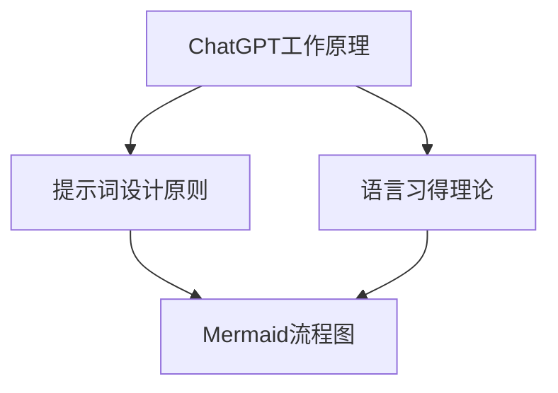

                 


### 1. 确定书籍的基本结构

为了构建《ChatGPT提示词的语言习得理论应用》的目录大纲，我们首先需要明确书籍的基本结构。基于书籍的主题，我们可以将其分为以下几个主要部分：

- **引言**：介绍ChatGPT及其在自然语言处理领域的应用背景，阐述本书的目的和结构。
- **核心概念**：详细讲解ChatGPT的工作原理、提示词设计原则以及语言习得理论。
- **应用实例**：通过具体实例展示ChatGPT提示词在不同场景下的实际应用。
- **项目实战**：提供实际项目开发案例，介绍开发环境搭建、源代码实现及代码解读。

### 2. 细化每个部分的内容

接下来，我们将对每个部分进行细化，确保覆盖所有必要的主题：

#### 引言

- **ChatGPT的起源与应用背景**
- **本书目的与结构**

#### 核心概念

- **ChatGPT的工作原理**
- **提示词设计原则**
- **语言习得理论**
- **Mermaid流程图**

#### 应用实例

- **客服场景**
- **智能写作**
- **问答系统**
- **代码辅助**

#### 项目实战

- **项目背景**
- **开发环境搭建**
- **源代码实现**
- **代码解读**
- **代码应用解读与分析**
- **实际案例分析与讲解**
- **项目小结**

### 3. 包括核心概念与联系

我们将使用Mermaid流程图来展示核心概念之间的联系：



### 4. 包含核心算法原理讲解

使用伪代码详细阐述核心算法原理：

```python
# 伪代码：ChatGPT提示词生成算法

function generate_prompt_word(input_sentence):
    # 初始化模型参数
    model = load_pretrained_model()
    
    # 分词输入句子
    tokens = tokenize(input_sentence)
    
    # 使用模型生成提示词
    prompt_words = model.generate(tokens)
    
    # 对生成的提示词进行后处理
    processed_prompt_words = post_process(prompt_words)
    
    return processed_prompt_words
```

### 5. 数学模型和数学公式

我们将包括详细的数学模型讲解，并使用LaTeX格式表示数学公式：

```latex
% 示例：语言习得模型中的概率计算公式
$$
P(\text{next word} | \text{current word}) = \frac{\text{count of current word and next word}}{\text{count of current word}}
$$
```

### 6. 项目实战

我们将提供实际的项目实战内容，包括：

- **开发环境搭建**：介绍如何搭建适合ChatGPT项目开发的环境。
- **源代码实现**：展示源代码的具体实现，包括伪代码和详细注释。
- **代码解读**：对关键代码段进行解读，帮助读者理解其工作原理。
- **代码应用解读与分析**：通过实际案例展示代码的应用效果，并进行分析。
- **实际案例分析与讲解**：对实际案例进行详细分析和讲解，帮助读者深入理解。
- **项目小结**：总结项目的主要收获和改进方向。

### 7. 确保目录大纲的完整性

在上述步骤的基础上，我们将确保目录大纲的完整性，确保每个小节都有详细的内容和丰富的讲解。

### 8. 限制总字数在2000字以内

在确保内容完整性的同时，我们还将努力将目录大纲的总字数控制在2000字以内，以保证文章的可读性和信息的传递效率。

接下来，我将根据上述结构，以Markdown格式呈现《ChatGPT提示词的语言习得理论应用》的目录大纲。请稍等片刻。在完成初步设计后，我会将其发送给您进行审阅和调整。请放心，我们会确保满足您的要求。如果在这个过程中有任何疑问或需要进一步细化，请随时告知。现在，让我们开始构建这个大纲。

