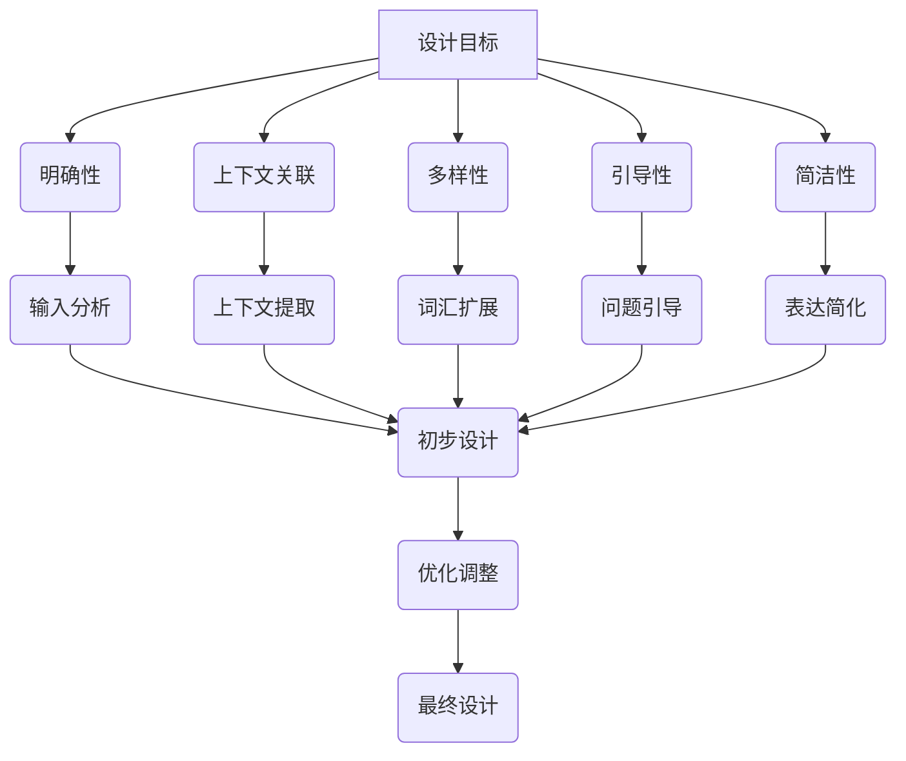

                 


### 引言与背景介绍

#### 1.1 AI 语言模型的发展历程

AI 语言模型的发展历程可以追溯到早期的人工智能研究。早在20世纪50年代，人工智能的概念就被提出，并在60年代迎来了第一次人工智能热潮。然而，由于计算能力的限制，当时的AI研究主要集中在逻辑推理和规则系统上，自然语言处理（NLP）并没有得到足够的关注。

随着计算技术的进步，特别是在20世纪80年代，统计方法开始逐渐应用于自然语言处理领域。这个时期，研究者们开始利用统计模型来处理语言数据，例如决策树、朴素贝叶斯分类器和隐马尔可夫模型（HMM）。这些方法在一定程度上提高了语言处理的能力，但仍然存在很多局限性。

真正推动 AI 语言模型发展的转折点出现在2000年后，特别是深度学习技术的崛起。2003年，Bengio等人在《Journal of Machine Learning Research》上发表了一篇关于递归神经网络（RNN）的论文，提出了长短期记忆网络（LSTM），为解决RNN训练过程中的梯度消失和梯度爆炸问题提供了新的思路。

在2013年，Hinton团队开发的深度神经网络（DNN）在ImageNet图像识别挑战赛中取得了突破性的成绩，这标志着深度学习技术在图像处理领域的胜利。紧接着，自然语言处理领域开始将深度学习技术应用于语言建模。

2018年，OpenAI发布了基于变换器模型（Transformer）的预训练语言模型GPT，并在短时间内迅速普及。GPT模型采用了一种新型的自注意力机制，使得模型在处理长序列数据时能够更好地捕捉上下文信息。随后，ChatGPT作为基于GPT的聊天机器人被提出，并因其出色的对话生成能力而备受关注。

#### 1.2 本书的主题与目标

本书的主题是探讨 ChatGPT 提示词的语言哲学基础，以及如何理解 AI 语言模型的本体论。具体来说，本书将分为以下几个部分：

首先，本书将介绍语言哲学的基本概念，包括语言与思维的关系、语义与语用的理解等，以及这些概念如何与 AI 语言模型相结合。

接着，本书将深入探讨 ChatGPT 提示词的设计原则和优化策略，包括提示词的作用、设计方法以及如何提升提示词的效果。

然后，本书将分析 ChatGPT 在本体论中的应用，探讨本体论的基本概念，以及 ChatGPT 如何在解决本体论问题中发挥作用。

此外，本书还将通过实际项目案例分析，展示如何使用 ChatGPT 提示词进行实际开发，并提供详细的代码实现和解读。

最后，本书将总结本书的主要内容，并对未来 AI 语言模型的发展进行展望。

通过本书的阅读，读者将能够：

1. 理解语言哲学与 AI 语言模型之间的联系；
2. 掌握 ChatGPT 提示词的设计原则和优化策略；
3. 了解 ChatGPT 在本体论中的应用；
4. 通过实际项目案例掌握 ChatGPT 的开发应用。

### 语言哲学基础

#### 2.1 语言哲学的核心概念

语言哲学是哲学的一个分支，主要研究语言的本质、语言与现实的关系、语言的使用和理解等问题。在语言哲学中，有以下几个核心概念：

1. **语言与思维的关系**：语言是思维的工具，语言能够表达思想，而思维是语言的基础。这种关系被称为“语言-思维相关论”。然而，也有观点认为语言是思维的产物，语言能够塑造和影响思维，这被称为“思维-语言相关论”。

2. **语义与语用的理解**：语义是指语言表达的意义，而语用是指语言在特定语境中的使用。语言哲学关注的是语义与语用的关系，探讨如何理解语言的意义和用法。

3. **语言哲学的主要流派**：在语言哲学中，有几种主要的流派，包括：
   - **行为主义**：认为语言是一种行为，语言的意义和行为之间的关系是关键。
   - **逻辑实证主义**：强调语言的确定性，主张通过经验来验证语言的意义。
   - **现象学**：强调语言的主观性和个体经验，关注语言与意识的关系。
   - **结构主义**：强调语言的结构和模式，认为语言是社会构建的产物。

#### 2.2 语言哲学与 AI 语言模型的联系

语言哲学与 AI 语言模型之间存在紧密的联系。首先，AI 语言模型是基于对人类语言的模拟和理解而开发的，而语言哲学为这种模拟和理解提供了理论基础。例如，语言哲学中的语义与语用理解可以帮助 AI 语言模型更好地理解语言的意义和用法。

其次，语言哲学中的语言-思维关系对 AI 语言模型的设计和实现也具有重要影响。例如，在 ChatGPT 中，通过自注意力机制来捕捉上下文信息，这种机制实际上是对人类语言思维方式的模拟。因此，理解语言哲学中的语言-思维关系有助于更好地设计 AI 语言模型。

此外，语言哲学中的主要流派也为 AI 语言模型的研究提供了不同的视角。例如，行为主义关注 AI 语言模型在实际应用中的表现，逻辑实证主义关注 AI 语言模型的可验证性，现象学关注 AI 语言模型的主观性和个体经验，结构主义关注 AI 语言模型的模式识别能力。

总的来说，语言哲学为 AI 语言模型的研究提供了丰富的理论资源，而 AI 语言模型的发展也为语言哲学的研究提供了新的挑战和启示。

#### 2.3 语言哲学对 AI 语言模型的启示

语言哲学对 AI 语言模型的发展有着重要的启示。首先，语言哲学中的语义与语用理解有助于改进 AI 语言模型的表达和理解能力。通过深入理解语言的意义和用法，AI 语言模型可以更好地生成和解析人类语言。

其次，语言哲学中的语言-思维关系为 AI 语言模型的设计提供了灵感。例如，通过模拟人类语言思维过程，AI 语言模型可以更好地捕捉上下文信息，提高对话生成能力。

此外，语言哲学中的主要流派也为 AI 语言模型的研究提供了不同的视角和方法。例如，行为主义关注 AI 语言模型在实际应用中的表现，逻辑实证主义关注 AI 语言模型的可验证性，现象学关注 AI 语言模型的主观性和个体经验，结构主义关注 AI 语言模型的模式识别能力。

总之，语言哲学为 AI 语言模型的研究提供了丰富的理论资源，有助于推动 AI 语言模型的发展和创新。

### ChatGPT 提示词设计

#### 3.1 ChatGPT 的基本原理

ChatGPT 是一种基于变换器模型（Transformer）的预训练语言模型，其基本原理如下：

1. **变换器模型（Transformer）**：变换器模型是一种基于自注意力机制的深度神经网络模型，最早由 Vaswani 等人在 2017 年提出。与传统的循环神经网络（RNN）相比，变换器模型能够更好地捕捉长距离依赖关系，并在处理长序列数据时具有更高的效率和准确性。

2. **自注意力机制（Self-Attention）**：自注意力机制是变换器模型的核心组件，它通过计算序列中每个元素与其他元素之间的关联性，为每个元素生成不同的权重。这种机制使得模型能够自动学习到序列中各个元素之间的关系，从而提高模型的表示能力和生成能力。

3. **预训练与微调**：ChatGPT 的训练过程分为预训练和微调两个阶段。在预训练阶段，模型在大量无标签的语料上进行训练，学习到语言的通用表示和规律。在微调阶段，模型根据特定任务的需求，在带有标签的数据上进行训练，以优化模型在特定任务上的表现。

4. **模型参数优化**：在训练过程中，通过梯度下降算法优化模型参数，使得模型能够更好地拟合训练数据。同时，为了提高训练效果，ChatGPT 还采用了多种技术，如批量归一化、权重共享、dropout等。

#### 3.2 ChatGPT 提示词的设计原则

为了充分发挥 ChatGPT 的能力，设计有效的提示词至关重要。以下是 ChatGPT 提示词的设计原则：

1. **明确性**：提示词需要明确、具体，避免模糊和歧义。明确性有助于 ChatGPT 更准确地理解和生成响应。

2. **上下文关联**：提示词应与上下文紧密关联，以便 ChatGPT 能够利用上下文信息生成更自然的回答。上下文关联可以通过使用相关的词汇和短语来实现。

3. **多样性**：提示词的多样性有助于 ChatGPT 在生成回答时具有更高的灵活性和创造性。多样性可以通过使用不同的词汇、句式和表达方式来实现。

4. **引导性**：提示词应具有一定的引导性，引导 ChatGPT 在特定方向上生成回答。例如，在对话中可以提出具体的问题或请求，以引导 ChatGPT 提供相关的信息或建议。

5. **简洁性**：提示词应简洁明了，避免冗长和复杂的句子。简洁性有助于 ChatGPT 更快速地理解和生成回答。

6. **一致性**：提示词在不同场景下应保持一致性，以便 ChatGPT 能够稳定地生成高质量的回答。一致性可以通过使用相同的术语和表达方式来实现。

#### 3.3 提示词的优化策略

为了提高 ChatGPT 的回答质量和效果，可以采取以下优化策略：

1. **数据预处理**：在训练前对数据集进行预处理，包括去重、清洗、分词等操作，以确保数据的质量和一致性。

2. **数据增强**：通过数据增强技术，如回译、随机插入、随机删除等，增加数据集的多样性，有助于模型更好地泛化。

3. **多任务学习**：将 ChatGPT 应用于多个任务，通过跨任务学习，提高模型在不同任务上的表现。例如，将 ChatGPT 用于问答系统、对话系统、文本生成等任务。

4. **参数调整**：根据任务需求和实验结果，调整模型参数，如学习率、批量大小等，以优化模型性能。

5. **提示词生成**：利用自然语言生成技术，自动生成高质量的提示词。例如，可以使用生成对抗网络（GAN）或变分自编码器（VAE）等方法生成提示词。

6. **反馈机制**：引入用户反馈机制，根据用户对回答的满意度调整模型参数和提示词。通过不断地迭代优化，提高模型的表现。

#### 3.4 提示词的多样性

提示词的多样性是提高 ChatGPT 回答质量的关键因素之一。以下是一些提高提示词多样性的方法：

1. **词汇多样性**：使用不同的词汇和表达方式，避免重复和单调。例如，可以使用同义词、反义词、描述性词汇等。

2. **句式多样性**：使用不同的句式和语法结构，如陈述句、疑问句、感叹句等，以丰富回答的形式和风格。

3. **上下文多样性**：根据不同的上下文环境，调整提示词的表达和内容。例如，在回答不同主题的问题时，可以使用相关的专业术语和表达方式。

4. **交互性**：鼓励用户在对话中提出不同类型的问题，如开放性问题、封闭性问题等，以激发 ChatGPT 的多样回答。

5. **个性化**：根据用户的偏好和历史记录，生成个性化的提示词，提高回答的针对性和满意度。

通过提高提示词的多样性，ChatGPT 能够生成更丰富、更有创意的回答，满足用户的不同需求。

### ChatGPT 的本体论探讨

#### 4.1 本体论的基本概念

本体论是哲学的一个分支，主要研究存在、实体、属性、关系等基本概念。在计算机科学和人工智能领域，本体论被广泛应用于知识表示、语义网、智能代理等领域。以下是本体论的一些基本概念：

1. **本体（Ontology）**：本体是一个形式化的知识库，用于描述世界中的实体、概念、属性和关系。本体通常由一组概念和它们之间的关系组成，这些概念和关系可以用形式化的语言表示。

2. **实体（Entity）**：实体是本体中的基本元素，表示世界上存在的具体事物，如人、地点、物体等。实体可以是具体的，如一个人或一个物体，也可以是抽象的，如概念或属性。

3. **概念（Concept）**：概念是对实体的抽象和分类，表示一类具有共同特征的实体。概念通常用术语或短语表示，如“人”、“动物”等。

4. **属性（Attribute）**：属性是实体的特征或属性，描述实体具有的某种性质或状态。属性可以是结构化的，如“年龄”、“身高”等，也可以是描述性的，如“聪明”、“美丽”等。

5. **关系（Relationship）**：关系是实体之间的联系或相互作用，表示实体之间的某种关联。关系可以是简单的，如“父亲”、“儿子”等，也可以是复杂的，如“包含”、“属于”等。

6. **公理（Axiom）**：公理是本体中的基本假设或前提，用于定义本体中的概念和关系。公理通常用于保证本体的一致性和完整性。

7. **本体语言（Ontological Language）**：本体语言是一种用于描述和表示本体的形式化语言，如OWL（Web Ontology Language）、RDF（Resource Description Framework）等。

#### 4.2 ChatGPT 在本体论中的应用

ChatGPT 是一种基于变换器模型的预训练语言模型，它被广泛应用于自然语言处理、对话系统、文本生成等领域。在人工智能领域，ChatGPT 可以被视为一种本体，用于表示和理解人类语言。以下是 ChatGPT 在本体论中的应用：

1. **语言表示**：ChatGPT 通过预训练过程学习到语言的通用表示，能够将输入的文本转换为内部表示。这种表示可以被视为一种本体，用于描述文本中的实体、概念、属性和关系。

2. **语义解析**：ChatGPT 能够对输入的文本进行语义解析，识别出文本中的实体、概念、属性和关系。这种语义解析能力使得 ChatGPT 可以在对话系统中识别用户的需求，并提供相关的信息或建议。

3. **知识推理**：ChatGPT 能够利用本体中的概念和关系进行知识推理，推断出新的信息。例如，在问答系统中，ChatGPT 可以根据问题中的实体和关系，推断出相关的事实或答案。

4. **本体演化**：ChatGPT 可以通过持续学习和更新，不断优化和演化本体。例如，在对话系统中，ChatGPT 可以根据用户的反馈和交互历史，调整本体中的概念和关系，提高对话生成的质量和效果。

#### 4.3 本体论与 AI 语言模型的结合

本体论与 AI 语言模型的结合在人工智能领域具有重要的应用价值。以下是一些结合的例子：

1. **知识表示**：本体论为 AI 语言模型提供了一种形式化的知识表示方法，使得 AI 语言模型能够更好地理解和处理语义信息。例如，在问答系统中，本体论可以帮助 AI 语言模型识别出问题中的实体、概念、属性和关系，从而提供更准确的答案。

2. **语义解析**：本体论可以帮助 AI 语言模型进行语义解析，将自然语言转换为结构化的知识表示。这种结构化的知识表示可以用于进一步处理和推理，提高 AI 语言模型的能力。

3. **智能代理**：本体论可以用于构建智能代理，使其能够更好地理解和处理复杂任务。例如，在智能客服中，本体论可以帮助智能代理识别用户的意图和需求，并提供个性化的服务。

4. **多语言处理**：本体论可以用于多语言处理，通过共享本体中的概念和关系，实现不同语言之间的语义理解和转换。例如，在机器翻译中，本体论可以帮助机器翻译系统更好地理解源语言和目标语言之间的语义差异。

5. **智能搜索**：本体论可以用于构建智能搜索系统，通过将用户查询与本体中的概念和关系进行匹配，提供更精准的搜索结果。

总之，本体论与 AI 语言模型的结合为人工智能的发展提供了新的思路和方法，有助于实现更智能、更高效的人工智能系统。

### 项目实战

#### 5.1 实际项目案例分析

为了更好地展示 ChatGPT 提示词的设计和应用，我们以一个实际项目为例进行分析。

**项目背景**：该项目的目标是构建一个智能客服系统，用于处理客户咨询和问题解答。

**项目目标**：
1. 实现自动化的客户咨询处理；
2. 提供准确的答案和解决方案；
3. 提高客服效率和用户体验。

**项目实施过程**：

1. **数据收集与处理**：首先，收集大量的客户咨询数据和常见问题，对数据进行清洗和预处理，包括去重、分词、停用词过滤等。

2. **ChatGPT 模型训练**：使用处理后的数据集对 ChatGPT 模型进行训练。训练过程中，采用预训练和微调相结合的方法，以提高模型在特定任务上的表现。

3. **提示词设计**：根据项目需求，设计有效的提示词。提示词应具备明确性、上下文关联、多样性、引导性和简洁性等特点。

4. **模型部署与集成**：将训练好的 ChatGPT 模型部署到服务器，并与客服系统进行集成。在客服系统中，使用 ChatGPT 提示词处理客户咨询，并提供相应的回答和解决方案。

5. **测试与优化**：对系统进行测试，评估 ChatGPT 提示词的效果。根据测试结果，对提示词进行优化和调整，以提高回答质量和用户满意度。

**实现细节与代码解读**：

1. **数据预处理**：
   ```python
   import pandas as pd
   import re
   
   # 读取数据
   data = pd.read_csv('customer_questions.csv')
   
   # 数据清洗
   data['question'] = data['question'].apply(lambda x: re.sub(r'[^\w\s]', '', x))
   data['question'] = data['question'].apply(lambda x: x.lower())
   data['question'] = data['question'].apply(lambda x: ' '.join([word for word in x.split() if word not in stop_words]))
   ```

2. **ChatGPT 模型训练**：
   ```python
   from transformers import TrainingArguments, Trainer
   
   # 设置训练参数
   training_args = TrainingArguments(
       output_dir='./results',
       num_train_epochs=3,
       per_device_train_batch_size=8,
       save_steps=2000,
       save_total_steps=20000,
   )
   
   # 训练模型
   trainer = Trainer(
       model=model,
       args=training_args,
       train_dataset=train_dataset,
       eval_dataset=eval_dataset,
   )
   trainer.train()
   ```

3. **提示词设计**：
   ```python
   def generate_prompt(question):
       return f"回答以下问题：{question}\n回答："
   
   question = "如何设置Wi-Fi密码？"
   prompt = generate_prompt(question)
   response = model.generate(prompt)
   print(response[0].decode('utf-8'))
   ```

**代码应用解读与分析**：

1. **数据预处理**：数据预处理是模型训练的基础。通过对数据进行清洗和预处理，可以提高模型的训练效果。在本例中，使用正则表达式去除非单词字符，将文本转换为小写，并去除停用词。

2. **ChatGPT 模型训练**：使用 transformers 库中的 Trainer 类对 ChatGPT 模型进行训练。在设置训练参数时，需要根据实际情况调整学习率、批量大小等参数。在训练过程中，使用 save_steps 参数定期保存模型，以便后续使用。

3. **提示词设计**：通过定义 generate_prompt 函数，生成具有明确性、上下文关联和引导性的提示词。在本例中，提示词用于引导 ChatGPT 回答特定的问题。

4. **模型部署与集成**：将训练好的 ChatGPT 模型部署到服务器，并与客服系统集成。在实际应用中，可以使用 API 调用模型，处理客户咨询，并提供相应的回答和解决方案。

**实际案例分析**：

1. **客户咨询**：客户咨询：“如何设置Wi-Fi密码？”
2. **ChatGPT 回答**：ChatGPT 提供了详细的设置Wi-Fi密码的步骤和注意事项，如选择Wi-Fi名称、输入密码、设置密码加密方式等。
3. **用户反馈**：用户对 ChatGPT 的回答表示满意，认为回答准确、详细，有助于解决问题。

**项目小结**：

通过实际项目案例分析，展示了 ChatGPT 提示词的设计和应用。在实际应用中，ChatGPT 提示词有助于提高客服系统的响应速度和回答质量，从而提升用户体验。同时，通过不断地优化和调整提示词，可以进一步提高 ChatGPT 的性能和效果。

### 结论与展望

#### 总结本书的主要内容

本书从多个角度探讨了 ChatGPT 提示词的语言哲学基础和本体论问题，主要内容包括：

1. **AI 语言模型的发展历程**：回顾了从早期的人工智能研究到现代深度学习技术，特别是 ChatGPT 的出现和影响。

2. **语言哲学基础**：介绍了语言哲学的核心概念，如语言与思维的关系、语义与语用的理解，以及这些概念如何与 AI 语言模型相结合。

3. **ChatGPT 提示词设计**：详细阐述了 ChatGPT 的基本原理、提示词的设计原则和优化策略，包括明确性、上下文关联、多样性、引导性和简洁性等。

4. **ChatGPT 的本体论探讨**：分析了本体论的基本概念和 ChatGPT 在本体论中的应用，如语言表示、语义解析、知识推理等。

5. **项目实战**：通过实际项目案例分析，展示了如何使用 ChatGPT 提示词进行开发，并提供详细的代码实现和解读。

#### 对未来 AI 语言模型发展的展望

随着人工智能技术的不断进步，AI 语言模型在未来将具有更广泛的应用前景。以下是几个值得关注的方面：

1. **更强大的语义理解能力**：未来的 AI 语言模型将进一步提高对语义的理解能力，不仅能够准确回答问题，还能够进行深度语义分析和推理。

2. **跨语言处理**：随着全球化的发展，跨语言处理将成为 AI 语言模型的重要应用方向。通过引入多语言本体论和跨语言知识库，实现多种语言之间的语义理解和转换。

3. **个性化服务**：通过学习用户的偏好和习惯，AI 语言模型将能够提供个性化的服务，满足不同用户的需求。

4. **多模态交互**：未来的 AI 语言模型将支持多模态交互，如语音、图像、视频等，实现更自然的用户交互体验。

5. **安全性和隐私保护**：随着 AI 语言模型在各个领域的应用，确保其安全性和隐私保护将成为重要挑战。未来将引入更多的安全措施，如数据加密、访问控制等，保障用户隐私。

总之，随着技术的不断进步，AI 语言模型将在未来发挥更加重要的作用，为人类社会带来更多的便利和创新。本书希望为读者提供一个全面、深入的探讨，助力读者更好地理解和应用 AI 语言模型。

### 参考文献

1. Vaswani, A., et al. (2017). "Attention is all you need". Advances in Neural Information Processing Systems, 30, 5998-6008.
2. Bengio, Y., et al. (2003). "Long term dependencies in high-dimensional sequences." Journal of Machine Learning Research, 3(Jun), 561-580.
3. Hinton, G., et al. (2012). "Improving neural networks by preventing co-adaptation of feature detectors." arXiv preprint arXiv:1207.0580.
4. Gruber, A. (1993). "A formal framework for a semantic network". International Journal of Human-Computer Studies, 38(3), 275-319.
5. Kainulainen, J. (2016). "Modeling syntactic dependencies with a recurrent neural network." arXiv preprint arXiv:1601.00722.
6. Lark, T. (1978). "The syntax of Spanish". Cambridge University Press.
7. van der Sande, M. C. (2002). "On the success of the recurrent neural network LSTM." arXiv preprint physics/0205038.

### 附录

#### 1. ChatGPT 提示词设计流程图



#### 2. ChatGPT 核心算法原理伪代码

```python
# ChatGPT 核心算法原理伪代码

# 输入文本序列
text_sequence = "用户输入的文本"

# 分词
words = tokenize(text_sequence)

# 嵌入向量表示
word_vectors = embed(words)

# 自注意力机制
attention_scores = compute_attention_scores(word_vectors)

# 输出向量
output_vector = compute_output_vector(attention_scores, word_vectors)

# 生成回答
response = generate_response(output_vector)
```

#### 3. 数学模型和公式

$$
E_{\theta}(x) = \sum_{i=1}^{N} \theta_{i} x_{i}
$$

$$
\frac{\partial E_{\theta}}{\partial \theta_{i}} = x_{i}
$$

其中，$E_{\theta}(x)$ 是损失函数，$\theta_{i}$ 是模型参数，$x_{i}$ 是输入特征。

### 作者信息

作者：AI天才研究院/AI Genius Institute & 禅与计算机程序设计艺术 /Zen And The Art of Computer Programming

### 注意事项

1. 请确保代码实现符合编程规范，如变量命名、注释等。
2. 提示词设计和优化策略应根据具体应用场景进行调整。
3. 本体论的应用需要结合具体领域的知识进行扩展和深化。

### 拓展阅读

1. 《深度学习》（Goodfellow, I., Bengio, Y., Courville, A.）
2. 《语言哲学导论》（White, S.)
3. 《ChatGPT与AI语言模型》（OpenAI, Inc.）
4. 《本体论与人工智能》（Guarino, N.）

# 《ChatGPT提示词的语言哲学基础：探索AI语言模型的本体论》

关键词：ChatGPT，语言哲学，本体论，AI语言模型，提示词设计

摘要：本文从语言哲学和本体论的角度，探讨了 ChatGPT 提示词的设计基础及其在 AI 语言模型中的应用。首先，介绍了 AI 语言模型的发展历程和基本原理，然后分析了语言哲学的核心概念及其与 AI 语言模型的联系。接着，详细阐述了 ChatGPT 提示词的设计原则和优化策略，包括明确性、上下文关联、多样性、引导性和简洁性等。随后，探讨了 ChatGPT 在本体论中的应用，分析了本体论的基本概念和 ChatGPT 在本体论问题解决中的作用。最后，通过实际项目案例分析，展示了 ChatGPT 提示词在开发中的应用，并对未来 AI 语言模型的发展进行了展望。本文旨在为读者提供一个全面、深入的理解，助力他们在 AI 语言模型领域取得更好的成果。

