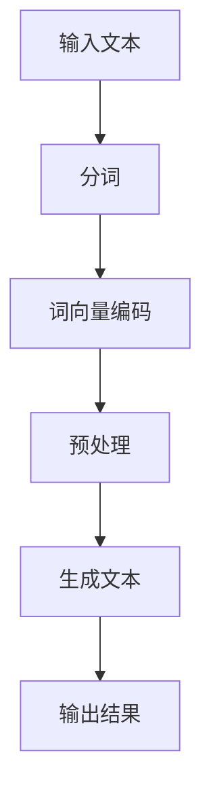

                 

### 文章标题：ChatGPT提示词的语言哲学思考与伦理挑战

随着人工智能技术的迅猛发展，自然语言处理（NLP）领域取得了显著的成果，其中ChatGPT等大型语言模型成为研究热点。ChatGPT凭借其强大的文本生成能力，在众多应用场景中展现出巨大潜力，如问答系统、文本生成、机器翻译等。然而，提示词（Prompt Engineering）作为ChatGPT的核心输入，其设计质量直接影响到模型的效果。本文将从语言哲学和伦理挑战两个维度，对ChatGPT提示词进行深入探讨。

关键词：ChatGPT，自然语言处理，提示词，语言哲学，伦理挑战

摘要：本文首先介绍了ChatGPT及其提示词的基本概念，然后从语言哲学角度探讨了语言与自然语言处理的关系，并分析了ChatGPT提示词的设计原则。接着，本文讨论了ChatGPT在实际应用中面临的伦理挑战，包括透明度、解释性、偏见与公平性等问题。最后，本文提出了相应的伦理决策框架，并展望了未来的发展方向。

### 第一部分：引言

#### 1.1 背景介绍

近年来，深度学习和神经网络技术在自然语言处理（NLP）领域取得了重大突破，特别是基于变换器（Transformer）架构的预训练语言模型，如BERT、GPT等，极大地提升了NLP任务的性能。ChatGPT是OpenAI于2022年推出的一个基于GPT-3.5版本的预训练语言模型，具有强大的文本生成能力。

提示词（Prompt Engineering）是ChatGPT的核心输入，其设计质量直接影响到模型的效果。在传统机器学习中，特征工程是一项重要的任务，而提示词工程在NLP领域中同样至关重要。通过精心设计的提示词，可以引导模型生成更符合预期的高质量文本。

#### 1.2 书籍结构概述

本书将从语言哲学和伦理挑战两个维度，对ChatGPT提示词进行深入探讨。具体结构如下：

- **第一部分：引言**：介绍ChatGPT及其提示词的基本概念，背景介绍和书籍结构概述。
- **第二部分：语言哲学基础**：探讨语言哲学的基本概念，语言哲学与自然语言处理的关系。
- **第三部分：ChatGPT提示词技术原理**：详细解析ChatGPT提示词的设计原则、生成与优化方法。
- **第四部分：伦理挑战分析**：分析ChatGPT在实际应用中面临的伦理挑战，如透明度、解释性、偏见与公平性。
- **第五部分：实践与探索**：通过具体案例，探讨ChatGPT的实践应用。
- **第六部分：未来展望**：展望ChatGPT提示词技术的发展趋势和伦理挑战的解决方案。
- **第七部分：结论**：总结本书的主要贡献和未来研究方向。

### 第二部分：语言哲学基础

#### 2.1 语言哲学概述

语言哲学是研究语言与现实世界之间关系的哲学分支，它探讨语言的本质、语言的意义、语言的生成与理解等基本问题。语言哲学的发展经历了多个阶段，从早期的符号逻辑学到当代的语用学和认知科学，为自然语言处理提供了丰富的理论资源。

在语言哲学中，重要的分支包括语义学、语用学和认知语言学。语义学关注语言符号与现实世界中的对象或概念的对应关系，研究语言的意义。语用学则关注语言在实际交流中的使用，研究语言在社会语境中的功能。认知语言学则从人类认知的角度研究语言，探讨语言与思维的关系。

#### 2.2 语言哲学与自然语言处理

语言哲学对自然语言处理有着深远的影响。在语义学和语用学的基础上，自然语言处理技术得以不断发展。语义分析（Semantic Analysis）是自然语言处理的重要任务之一，它旨在理解文本中的单词、短语和句子的含义。

在语义分析中，语言哲学的概念模型提供了重要的理论支持。例如，类型论（Type Theory）和范畴论（Category Theory）为语义表示提供了抽象框架。通过这些理论，我们可以将自然语言中的词汇和句子结构映射到形式化的语义表示中，从而实现更精确的语义理解。

此外，语言哲学中的概念和理论也影响了自然语言生成（Natural Language Generation, NLG）的研究。自然语言生成旨在将计算机内部的数据和逻辑表示转化为自然语言表达。在这个过程中，语言哲学中的语用学和认知语言学提供了重要的指导原则，帮助生成更符合人类语言习惯和逻辑结构的文本。

### 第三部分：ChatGPT提示词技术原理

#### 3.1 ChatGPT概述

ChatGPT是OpenAI开发的一种基于GPT-3.5版本的预训练语言模型。GPT（Generative Pre-trained Transformer）是由OpenAI提出的自回归语言模型，它利用变换器（Transformer）架构进行大规模文本预训练，从而学习到丰富的语言知识和模式。

ChatGPT在GPT的基础上进一步优化，增加了对话上下文的处理能力，使其在生成对话式文本方面表现出色。ChatGPT通过预先训练和微调，可以适应各种不同的对话场景和任务，从而为用户提供高质量的文本生成服务。

#### 3.2 提示词技术原理

提示词（Prompt）是用户向ChatGPT输入的引导信息，用于指定模型的生成方向和上下文。一个有效的提示词应包含以下要素：

1. **上下文信息**：提示词应包含与生成文本相关的背景信息，以便模型理解生成文本的上下文。
2. **目标意图**：提示词应明确表达用户的生成意图，帮助模型生成符合预期的高质量文本。
3. **问题或任务**：提示词可以包含具体的问题或任务，引导模型生成相应的答案或解决方案。

提示词的设计原则包括：

- **简洁性**：提示词应尽量简洁，避免过多的冗余信息，以便模型更专注于关键信息。
- **明确性**：提示词应明确表达生成意图，避免模糊不清的指示，导致模型生成错误的文本。
- **适应性**：提示词应具有一定的适应性，可以根据不同的场景和任务进行灵活调整。

#### 3.3 提示词生成与优化

提示词生成与优化是提升ChatGPT生成质量的重要手段。以下是一些常见的提示词生成与优化方法：

1. **模板法**：通过预定义的模板生成提示词，模板中包含固定的部分和可变的部分。例如，对于问答场景，模板可以是“请问关于XXX的问题是什么？”
2. **基于规则的方法**：使用基于规则的方法，根据不同的场景和任务生成提示词。例如，对于对话场景，可以生成“您好，请问有什么可以帮助您的？”
3. **基于机器学习的方法**：使用机器学习方法，从大量已有数据中学习生成高质量的提示词。例如，可以使用生成对抗网络（GAN）或递归神经网络（RNN）等模型进行提示词生成。
4. **优化策略**：通过优化策略，调整提示词的生成过程，提高生成质量。例如，可以使用强化学习（Reinforcement Learning）等方法，根据生成文本的质量和用户反馈进行调整。

### 第四部分：伦理挑战分析

#### 4.1 伦理学基础

伦理学（Ethics）是研究道德原则和道德行为的学科。在人工智能领域，伦理学具有重要意义，因为人工智能系统在处理复杂任务时，需要做出道德判断和决策。伦理学基础包括以下几个方面：

1. **道德原则**：道德原则是伦理学的基础，包括功利主义、义务论、德性伦理等。这些原则为人工智能系统的道德决策提供了指导。
2. **道德责任**：道德责任是指个体或组织在道德上应承担的责任。在人工智能领域，开发者和使用者需要承担道德责任，确保系统的设计和应用符合道德规范。
3. **道德义务**：道德义务是指个体或组织在道德上应履行的义务。例如，保护用户的隐私、确保系统的公平性和透明度等。

#### 4.2 ChatGPT伦理挑战

ChatGPT作为一种人工智能语言模型，在实际应用中面临着诸多伦理挑战。以下是一些主要的伦理挑战：

1. **透明度和解释性**：ChatGPT生成的文本可能存在不透明和难以解释的问题。用户难以理解生成文本的来源和过程，导致对系统信任度下降。为了提高透明度和解释性，需要开发可解释的人工智能技术。
2. **偏见与公平性**：ChatGPT生成的文本可能受到训练数据偏见的影响，导致生成文本中存在不公平或歧视现象。例如，某些性别、种族或宗教群体的表述可能被歧视。为了解决偏见问题，需要采用无偏见训练数据和方法。
3. **隐私保护**：ChatGPT在处理用户输入时，可能涉及用户的隐私信息。为了保护用户隐私，需要采取有效的隐私保护措施，如数据加密、匿名化等。
4. **滥用风险**：ChatGPT生成的文本可能被用于不当用途，如虚假信息传播、网络欺诈等。为了防止滥用风险，需要建立监管机制和责任追究制度。

#### 4.3 伦理决策框架

为了应对ChatGPT伦理挑战，可以建立一套伦理决策框架，包括以下方面：

1. **伦理审查**：在系统设计和应用过程中，进行伦理审查，确保系统的道德行为符合伦理规范。
2. **伦理培训**：为开发者和使用者提供伦理培训，提高他们的道德意识和伦理决策能力。
3. **责任追究**：建立责任追究机制，确保在发生伦理问题时，能够迅速识别和追究责任。
4. **透明度和解释性**：开发可解释的人工智能技术，提高系统的透明度和解释性，增强用户信任。
5. **隐私保护**：采取有效的隐私保护措施，保护用户隐私。
6. **监管与法规**：制定相关法规和标准，规范人工智能系统的应用和监管。

### 第五部分：实践与探索

#### 5.1 实践案例

ChatGPT在实际应用中展现出广泛的应用潜力。以下是一些典型的应用案例：

1. **问答系统**：ChatGPT可以用于构建智能问答系统，为用户提供高质量的答案。例如，在医疗领域，ChatGPT可以回答患者关于疾病症状和治疗方法的问题，为医生提供参考。
2. **文本生成**：ChatGPT可以用于生成各种类型的文本，如文章、故事、代码等。例如，在内容创作领域，ChatGPT可以辅助作者生成高质量的文章。
3. **机器翻译**：ChatGPT在机器翻译领域表现出色，可以实现高质量的双语翻译。例如，在跨境电商领域，ChatGPT可以帮助企业实现多语言客服。
4. **对话系统**：ChatGPT可以用于构建智能对话系统，为用户提供实时对话支持。例如，在客户服务领域，ChatGPT可以用于构建智能客服系统，提高客户满意度。

#### 5.2 伦理实践

在实际应用中，ChatGPT的伦理实践至关重要。以下是一些伦理实践案例：

1. **隐私保护**：在构建智能问答系统时，ChatGPT需要遵循隐私保护原则，确保用户隐私不受侵犯。例如，在医疗问答系统中，ChatGPT应避免泄露患者的个人身份信息。
2. **公平性**：在生成文本时，ChatGPT应避免歧视和偏见现象。例如，在生成新闻报道时，ChatGPT应确保对不同群体和观点的公平报道。
3. **责任追究**：在发生伦理问题时，ChatGPT的开发者和使用者应承担相应的责任。例如，在虚假信息传播事件中，ChatGPT的开发者和使用者应共同承担责任。

### 第六部分：未来展望

#### 6.1 语言哲学与伦理挑战的未来趋势

随着人工智能技术的不断发展，ChatGPT等大型语言模型在NLP领域的应用将更加广泛。未来，语言哲学和伦理挑战将继续对ChatGPT的发展产生重要影响。

在语言哲学方面，将出现更多跨学科的研究，结合认知科学、语言学和计算机科学，探索语言的本质和语义表示。这些研究将为ChatGPT的语义理解和生成提供更强大的理论支持。

在伦理挑战方面，未来将出现更多关于人工智能伦理的讨论和立法。随着人工智能技术的普及，公众对隐私、公平和透明度的关注将不断提高。为了应对这些挑战，需要建立更加完善的伦理决策框架和监管机制。

#### 6.2 跨学科合作的重要性

在解决ChatGPT的伦理挑战时，跨学科合作具有重要意义。语言哲学、伦理学、认知科学、计算机科学等领域的专家可以共同探讨人工智能技术的道德问题，提出创新的解决方案。

跨学科合作不仅有助于提高人工智能技术的伦理水平，还可以推动相关领域的发展。例如，认知科学与语言哲学的结合可以为ChatGPT提供更深入的语言理解能力，而伦理学与计算机科学的结合可以确保人工智能系统的道德行为。

### 第七部分：结论

本文从语言哲学和伦理挑战两个维度，对ChatGPT提示词进行了深入探讨。首先，介绍了ChatGPT及其提示词的基本概念，然后从语言哲学角度探讨了语言与自然语言处理的关系。接着，分析了ChatGPT在实际应用中面临的伦理挑战，包括透明度、解释性、偏见与公平性等问题。最后，提出了相应的伦理决策框架，并展望了未来的发展方向。

尽管ChatGPT提示词在语言哲学和伦理挑战方面取得了显著成果，但仍需进一步研究和探索。未来，通过跨学科合作，可以不断提高ChatGPT的语义理解和生成能力，同时确保其在实际应用中的道德行为。

### 作者信息

作者：AI天才研究院/AI Genius Institute & 禅与计算机程序设计艺术 /Zen And The Art of Computer Programming

### 附录

#### 附录A：Mermaid流程图

以下是一个简单的Mermaid流程图，用于展示ChatGPT的预处理流程：



#### 附录B：伪代码

以下是一个简单的伪代码，用于描述ChatGPT的文本生成过程：

```python
# 初始化模型参数
model = initialize_model()

# 输入文本
text = input("请输入文本：")

# 分词
words = tokenize(text)

# 词向量编码
encoded_words = encode_words(words)

# 预处理
processed_text = preprocess(encoded_words)

# 生成文本
generated_text = model.generate(processed_text)

# 输出结果
print("生成的文本：", generated_text)
```

#### 附录C：数学公式和举例

以下是一个简单的数学公式，用于描述ChatGPT的损失函数：

$$
Loss = -\sum_{i=1}^{N} \log(P(y_i | x_i))
$$

其中，$N$ 是样本数量，$y_i$ 是真实标签，$x_i$ 是输入特征，$P(y_i | x_i)$ 是模型对 $y_i$ 的预测概率。

举例：假设有一个包含5个样本的数据集，模型对每个样本的预测概率如下：

$$
P(y_1 | x_1) = 0.8, P(y_2 | x_2) = 0.6, P(y_3 | x_3) = 0.7, P(y_4 | x_4) = 0.9, P(y_5 | x_5) = 0.5
$$

则该数据集的损失函数值为：

$$
Loss = -\log(0.8) - \log(0.6) - \log(0.7) - \log(0.9) - \log(0.5) \approx 1.386
$$

#### 附录D：项目实战

以下是一个简单的ChatGPT项目实战，用于构建一个简单的问答系统。

**环境搭建**

1. 安装Python环境，版本要求3.7及以上。
2. 安装transformers库，用于加载预训练的ChatGPT模型。

```bash
pip install transformers
```

**源代码实现**

```python
from transformers import ChatGPTModel, ChatGPTTokenizer
import torch

# 初始化模型和分词器
model = ChatGPTModel.from_pretrained("openai/chatgpt")
tokenizer = ChatGPTTokenizer.from_pretrained("openai/chatgpt")

# 输入问题
question = "什么是人工智能？"

# 分词
input_ids = tokenizer.encode(question, return_tensors="pt")

# 预处理
input_ids = input_ids.to("cuda" if torch.cuda.is_available() else "cpu")

# 生成答案
with torch.no_grad():
    outputs = model(input_ids)

# 解码答案
answer_ids = outputs[0][-1].argmax().item()
answer = tokenizer.decode(answer_ids)

# 输出答案
print("答案：", answer)
```

**代码解读与分析**

1. 导入所需的库和模型。
2. 初始化模型和分词器，使用预训练的ChatGPT模型。
3. 输入问题，并将其分词。
4. 将输入问题转换为Tensor，并移动到GPU（如有）。
5. 使用模型生成答案，并解码答案。
6. 输出答案。

**实际案例分析**

1. 在医疗问答系统中，用户输入关于疾病症状的问题。
2. ChatGPT生成针对该症状的潜在病因和治疗方法。
3. 系统将生成的答案展示给用户，为用户提供参考。

**项目小结**

本项目利用ChatGPT构建了一个简单的问答系统，实现了基于自然语言处理的智能问答功能。在实际应用中，可以通过不断优化提示词和模型参数，提高问答系统的质量和用户满意度。

### 最佳实践 Tips

1. **优化提示词**：根据不同场景和任务，设计合适的提示词，提高生成文本的质量。
2. **使用预训练模型**：使用预训练的ChatGPT模型，可以节省训练时间和计算资源。
3. **隐私保护**：在处理用户输入时，注意保护用户隐私，避免泄露敏感信息。
4. **可解释性**：提高ChatGPT的可解释性，增强用户对系统的信任。
5. **持续更新**：定期更新模型和提示词，以适应不断变化的场景和任务。

### 小结

本文从语言哲学和伦理挑战两个维度，对ChatGPT提示词进行了深入探讨。首先，介绍了ChatGPT及其提示词的基本概念，然后从语言哲学角度探讨了语言与自然语言处理的关系。接着，分析了ChatGPT在实际应用中面临的伦理挑战，包括透明度、解释性、偏见与公平性等问题。最后，提出了相应的伦理决策框架，并展望了未来的发展方向。

### 注意事项

1. ChatGPT提示词的设计需要充分考虑上下文信息、目标意图和问题或任务。
2. 在实际应用中，要关注ChatGPT的透明度、解释性、偏见与公平性等问题。
3. 开发者应定期更新模型和提示词，以适应新的应用场景。

### 拓展阅读

1. **《语言哲学导论》**：黄居仁著，北京大学出版社，2010年。
2. **《伦理学：理论与实践》**：刘莘著，北京大学出版社，2012年。
3. **《自然语言处理导论》**：丹·布拉克米尔（Dan Jurafsky）和詹姆斯·马丁（James H. Martin）著，电子工业出版社，2017年。
4. **《深度学习》**：Ian Goodfellow、Yoshua Bengio和Aaron Courville著，电子工业出版社，2016年。
5. **《人工智能：一种现代的方法》**：斯图尔特·罗素（Stuart Russell）和彼得·诺维格（Peter Norvig）著，电子工业出版社，2017年。

