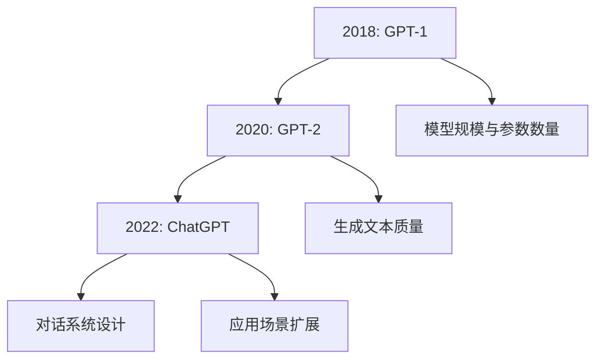
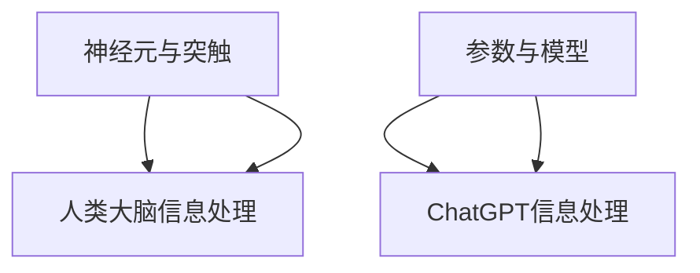
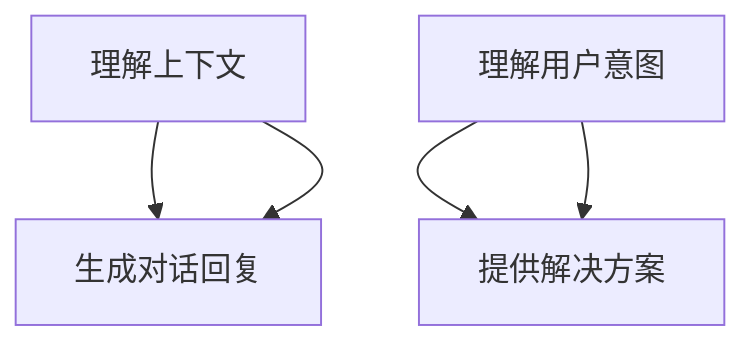
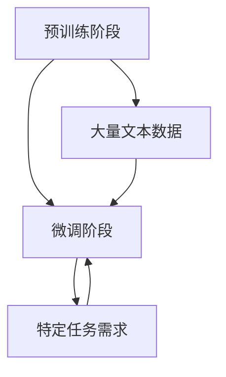
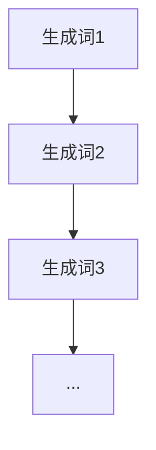
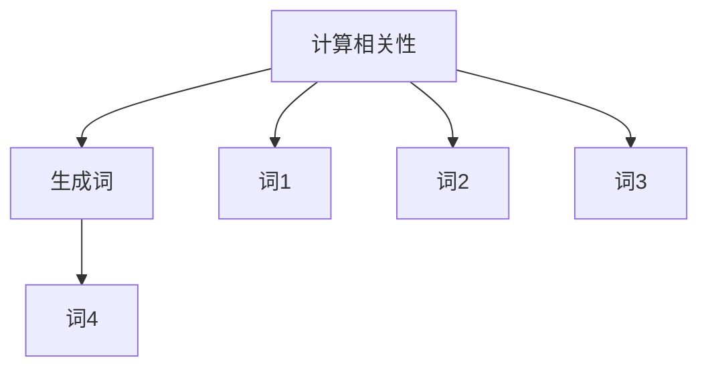

                 

### 1.1 ChatGPT的发展历程

#### ChatGPT的起源

ChatGPT的诞生可以追溯到OpenAI这个成立于2015年的非营利性研究组织。OpenAI的愿景是“实现安全的通用人工智能（AGI）”，并希望通过研究和开发人工智能技术来推动人类福祉。ChatGPT作为OpenAI在自然语言处理领域的一个重要成果，其发展历程具有重要的里程碑意义。

首先，我们需要了解OpenAI在自然语言处理领域的发展历程。在2018年，OpenAI发布了GPT-1，这是一个基于Transformer架构的预训练语言模型。GPT-1在自然语言理解任务上表现出色，但它在生成文本时的限制性较大，生成的文本往往不够流畅和连贯。为了解决这一问题，OpenAI在后续的研究中不断优化GPT模型。

在2020年，OpenAI发布了GPT-2，这是第一个具有超过1.5万亿参数的预训练语言模型。GPT-2在生成文本的能力上有了显著提升，能够生成更加连贯和自然的语言。然而，GPT-2也带来了新的挑战，即模型在生成有害或不当内容方面的风险。

为了解决这一问题，OpenAI在2022年发布了ChatGPT，这是一个基于GPT-3模型的新版本，专为对话系统设计。ChatGPT不仅在生成文本方面更加自然和连贯，而且在理解和模拟人类对话方面也表现出色。ChatGPT的发布标志着OpenAI在自然语言处理领域的一个新的里程碑。

#### ChatGPT的里程碑

ChatGPT的里程碑事件主要包括以下几方面：

1. **模型规模与参数数量**：ChatGPT基于GPT-3模型，拥有超过1.75万亿个参数，这使得ChatGPT在生成文本时能够更加精细地捕捉语言的细微差别。

2. **生成文本的质量**：与GPT-2相比，ChatGPT在生成文本的质量上有显著提升，能够生成更加流畅、连贯、自然的语言。

3. **对话系统的设计**：ChatGPT专门为对话系统设计，具有更好的对话理解和生成能力。ChatGPT能够根据上下文进行对话，并且能够理解用户的意图和需求。

4. **应用场景的扩展**：ChatGPT在多个应用场景中表现出色，包括客服、教育、编程辅助等。它的广泛应用使得人工智能在服务人类生活方面的潜力得到进一步挖掘。

### Mermaid 流程图



通过以上里程碑事件，我们可以看到ChatGPT在自然语言处理领域的发展历程。它不仅代表了OpenAI在技术上的不断突破，也为人工智能在服务人类生活方面带来了新的可能。

#### 模型规模与参数数量

ChatGPT的模型规模和参数数量是其在生成文本方面取得成功的关键因素之一。GPT-3模型的参数数量超过了1750亿个，这使得ChatGPT能够捕捉到语言中的复杂模式，从而生成更加准确和自然的文本。

为了理解模型规模和参数数量的重要性，我们可以将其与人类大脑进行类比。人类大脑约有860亿个神经元，每个神经元都有数十万个连接（突触）。这些连接使得人类能够处理和理解复杂的信息。同样地，ChatGPT的参数数量使得其能够处理大量的语言数据，从而生成高质量的文本。

参数数量越多，模型对数据的拟合能力越强。例如，在训练过程中，ChatGPT通过不断地调整参数，使其能够更好地预测下一个词。这种自回归的语言模型结构（Auto-Regressive Language Model）使得ChatGPT能够生成连贯的文本。



#### 生成文本质量

生成文本质量是衡量ChatGPT性能的重要指标。ChatGPT在生成文本时，不仅能够保持语言的自然性和连贯性，还能够根据上下文生成符合逻辑和语义的文本。

为了提高生成文本质量，ChatGPT采用了多种技术手段。首先，预训练过程中使用了大量的高质量文本数据，这使得模型能够学习到语言的细微差别和复杂的语义结构。其次，模型在生成文本时采用了注意力机制（Attention Mechanism），这使得模型能够更好地关注上下文信息，从而生成更加准确的文本。

```latex
\text{生成文本质量} = \text{自然性} + \text{连贯性} + \text{逻辑性}
```

自然性、连贯性和逻辑性是生成文本质量的三大要素。ChatGPT通过不断地优化这些要素，使其生成的文本更加接近人类的语言表达。

#### 对话系统设计

ChatGPT的对话系统设计是其区别于其他语言模型的重要特点之一。ChatGPT专门为对话系统设计，使其在理解和生成对话方面具有独特的优势。

首先，ChatGPT能够根据上下文进行对话。这意味着ChatGPT能够理解对话的历史，并在此基础上生成相应的回复。例如，当用户问：“今天天气怎么样？”ChatGPT能够根据之前的对话历史，如“你正在哪里？”来生成合适的回复，而不是简单地回答天气情况。

其次，ChatGPT能够理解用户的意图和需求。这意味着ChatGPT不仅能够回答问题，还能够根据用户的意图提供相关的信息或服务。例如，当用户提出一个复杂的请求时，ChatGPT能够理解用户的意图，并提供相应的解决方案。



通过以上设计，ChatGPT在对话系统中表现出色，能够提供更加自然、连贯和高效的对话服务。

### 1.2 ChatGPT的核心原理

#### 生成式预训练语言模型

ChatGPT是一种生成式预训练语言模型（Generative Pre-trained Language Model），其核心思想是通过大量的预训练数据来学习语言的内在规律，从而能够生成高质量的文本。

生成式预训练语言模型的工作流程主要包括两个阶段：预训练和微调。在预训练阶段，模型在大量的文本数据上进行训练，从而学习到语言的分布和语法结构。在微调阶段，模型根据特定任务的需求进行微调，以适应具体的任务场景。

ChatGPT采用了Transformer架构（Transformer Architecture），这是一种基于自注意力机制（Self-Attention Mechanism）的神经网络模型。Transformer架构在自然语言处理领域取得了显著的成果，使得ChatGPT在生成文本质量方面具有优势。



#### 自回归语言模型

ChatGPT是一种自回归语言模型（Auto-Regressive Language Model），其核心思想是模型在生成文本时，每次生成一个词，然后基于已生成的词来生成下一个词。这种模型结构使得ChatGPT能够生成序列性的文本。

自回归语言模型的工作原理可以理解为：模型在生成每个词时，都会参考之前的词，从而生成符合上下文的词。这种序列生成的过程使得ChatGPT能够生成连贯、自然的文本。



#### 注意力机制

注意力机制（Attention Mechanism）是Transformer架构的核心组件，它使得模型能够更好地关注上下文信息，从而提高生成文本的质量。

注意力机制的基本思想是：在生成每个词时，模型会计算每个词与当前词的相关性，并根据这些相关性生成下一个词。这种机制使得模型能够捕捉到文本中的关键信息，从而生成更加准确的文本。



通过注意力机制，ChatGPT能够更好地理解上下文，从而生成更加自然和连贯的文本。

### 2.1 语言哲学概述

语言哲学是哲学的一个分支，主要研究语言的本质、语言与思维的关系、语言的使用和解释等问题。它在自然语言处理（NLP）领域有着重要的应用价值，因为NLP的目标是使计算机能够理解和生成人类语言。

#### 语言哲学的定义

语言哲学通常关注以下几个核心问题：

1. **语言的本质**：探讨语言是如何形成的，语言的本质属性是什么，以及语言如何与我们的思维和认知过程相互作用。
2. **意义与指称**：研究词语或句子在特定语境中的意义，以及它们如何指称现实世界中的事物。
3. **语言使用与解释**：分析人们在日常交流中如何使用语言，以及如何解释和理解他人的语言表达。
4. **逻辑与语言**：研究语言和逻辑的关系，如何用逻辑来分析和解释语言结构。

语言哲学不仅仅关注语言本身，还关注语言在人类生活中的作用，包括文化、社会和心理等方面。它试图从多个角度来理解语言，从而为NLP提供理论基础。

#### 语言哲学的重要性

在自然语言处理领域，语言哲学的重要性体现在以下几个方面：

1. **语义理解**：NLP的一个关键任务是理解文本中的语义。语言哲学关于意义和指称的研究为NLP中的语义理解提供了重要的理论指导。
2. **上下文分析**：语言哲学关注语言的使用和解释，这有助于NLP系统更好地理解上下文，从而生成更准确和自然的语言。
3. **对话系统**：在对话系统中，理解用户的意图和需求至关重要。语言哲学关于语言使用和解释的研究可以帮助对话系统更好地与用户进行交流。
4. **错误处理**：NLP系统在处理文本时难免会遇到各种错误。语言哲学的研究可以提供关于错误处理的理论指导，从而提高系统的鲁棒性。

总之，语言哲学为NLP提供了重要的理论基础，使得NLP系统能够更好地理解和生成人类语言。通过借鉴语言哲学的研究成果，NLP领域不断取得新的突破。

### 2.2 语义学基础

语义学是语言学的一个分支，主要研究词语和句子的意义。在自然语言处理（NLP）中，语义分析是理解文本内容的关键步骤，它有助于提高文本的理解准确性和生成质量。

#### 语义学的定义

语义学关注以下几个方面：

1. **词义**：研究词语在特定语境中的意义。词义可以是具体的，也可以是抽象的，如“水”可以指液态H₂O，也可以指一种状态。
2. **句子语义**：分析句子在特定语境中的整体意义。句子语义不仅包括词语的意义，还包括词语之间的关系和句子的结构。
3. **语义角色**：研究句子中的词语所承担的语义角色，如主语、谓语、宾语等。
4. **语义关系**：探讨词语之间的语义联系，如同义词、反义词、上下位关系等。

语义学的目标是理解和描述语言中的意义，以便更好地进行语言处理和分析。

#### 语义分析过程

在NLP中，语义分析通常包括以下几个步骤：

1. **词义消歧**：在特定的语境中，一个词语可能有多个意义。词义消歧是指根据上下文来确定词语的确切意义。例如，“bank”可以指银行，也可以指河岸，取决于上下文。
2. **语义角色标注**：为句子中的词语标注其语义角色，如主语、谓语、宾语等。这对于理解句子的结构和含义至关重要。
3. **语义关系分析**：分析句子中词语之间的语义关系，如因果关系、上下位关系、修饰关系等。这些关系有助于更深入地理解句子的含义。
4. **语义蕴含**：识别句子中的语义蕴含，即一个句子所隐含的其他信息。例如，句子“我今天下雨了”蕴含了“今天我需要带伞”的信息。

通过语义分析，NLP系统能够更好地理解文本的内容，从而生成更准确和自然的语言。

### 3.1 提示词的设计原则

在ChatGPT的应用过程中，提示词的设计原则至关重要。优秀的提示词能够引导模型生成更符合预期、更高质量的回答。以下是一些关键的设计原则：

#### 清晰性

清晰性是设计优秀提示词的首要原则。一个清晰的提示词能够明确地传达用户的意图，减少模型的困惑，从而提高回答的准确性。例如，用户询问“今天天气怎么样？”时，提示词应该明确指示模型关注天气情况，而不是其他无关信息。

为了确保清晰性，提示词应该简洁明了，避免使用模糊或含糊的措辞。例如，将“能否”替换为“能否”，可以更直接地表达用户的期望。

#### 灵活性

提示词不仅要清晰，还要具备一定的灵活性。灵活性指的是提示词能够适应不同的场景和需求，从而生成多样化的回答。为了实现灵活性，提示词可以设计为包含可选参数或提示词组合。

例如，一个关于旅游的提示词可以是“请描述一个适合家庭旅游的目的地，可以包含美食、风景和活动”。这样的提示词不仅明确了回答的主题，还提供了多个维度，使得模型可以根据实际情况生成多种回答。

#### 目标明确

目标明确是指提示词应该明确地指示模型生成特定类型的回答。例如，在医疗咨询领域，一个目标明确的提示词可能是“请描述如何预防感冒”，这样的提示词清楚地表明了用户需要关于预防感冒的信息。

目标明确的提示词有助于模型聚焦于特定任务，从而生成更相关的回答。

#### 适应性

适应性是指提示词能够根据不同的用户需求和环境动态调整。例如，在客服场景中，用户的问题可能是多样化的，提示词需要能够适应不同的问题类型，如事实性问题、开放性问题等。

为了实现适应性，提示词可以设计为包含条件或逻辑结构，从而能够根据具体情境生成不同类型的回答。

#### 文本多样性

文本多样性是指提示词能够引导模型生成丰富多样的文本。在生成文本时，多样性不仅有助于避免重复和单调，还能提高用户的满意度。

为了实现文本多样性，提示词可以鼓励模型探索不同的表达方式，如使用同义词、改变句子结构等。例如，一个提示词可以是“请描述一种美食，可以包含色、香、味、形等方面的描述”。

### 提示词的设计原则示例

假设我们要设计一个关于旅游的ChatGPT提示词，以下是一些示例：

1. **清晰性**：请描述一个适合家庭旅游的目的地，要求包含美食、风景和活动。
2. **灵活性**：请生成一个关于最近一次家庭旅游的经历，可以包括交通、住宿、景点等方面。
3. **目标明确**：请提供一个关于如何缓解焦虑的方法，要求具体操作步骤。
4. **适应性**：请根据用户的兴趣生成一个旅游计划，可以选择历史、自然、美食等主题。
5. **文本多样性**：请用诗意的语言描述一个美丽的自然景观，如湖泊、山脉、日落等。

通过遵循这些设计原则，我们可以创建出高质量的提示词，从而引导ChatGPT生成更符合用户需求和期望的回答。

### 3.2 提示词的类型与策略

在ChatGPT的实践中，提示词的类型和策略对于生成高质量的对话至关重要。不同的提示词类型和策略适用于不同的对话场景，能够有效引导ChatGPT生成更加自然、相关且具有深度的回答。

#### 提示词类型

1. **开放性问题**：
   开放性问题通常是不限定回答范围的问题，如“你最近做了什么有趣的事情？”这类问题允许ChatGPT生成多样化、详细的回答。开放性问题能够激发ChatGPT的创造力，使其生成更加生动和个性化的内容。

2. **封闭性问题**：
   封闭性问题通常有明确的答案范围，如“你最喜欢的颜色是什么？”这类问题要求ChatGPT从预设的选项中选择答案。封闭性问题适合用于获取具体信息或执行特定任务，例如在客服机器人中获取用户的基本信息。

3. **引导性问题**：
   引导性问题是为了引导ChatGPT按照特定方向进行回答的问题，如“请从健康、环保、经济三个角度分析太阳能的优势。”这类问题可以帮助ChatGPT围绕核心主题展开详细讨论。

4. **复合性问题**：
   复合性问题是将多个问题结合在一起，如“你能告诉我如何在周末安排一次户外活动，同时考虑到天气和预算吗？”这类问题要求ChatGPT综合不同信息，生成一个全面且具体的回答。

#### 提示词策略

1. **情境设定**：
   情境设定策略是通过设定一个具体的背景或情境，引导ChatGPT生成与该情境相关的回答。例如，设定一个会议讨论的情境，提示ChatGPT生成会议议程、讨论要点等。

2. **角色扮演**：
   角色扮演策略是让ChatGPT模拟特定角色进行对话，如医生、律师、导游等。通过角色扮演，ChatGPT能够生成更加专业和贴近角色身份的回答。

3. **引导提问**：
   引导提问策略是通过连续提出问题，逐步引导ChatGPT深入讨论某个主题。例如，先询问用户的一般需求，然后逐步提问细节，最终生成一个详细的解决方案。

4. **激励式提问**：
   激励式提问策略是通过提出具有挑战性或启发性的问题，激发ChatGPT的思考和创造力。例如，提出一个复杂的问题，然后鼓励ChatGPT从多个角度进行分析和回答。

#### 应用示例

1. **客户服务场景**：
   - 提示词类型：封闭性问题
   - 提示词策略：情境设定
   示例：“您好，请问您需要客服帮助解决什么问题？（情境设定：客户服务）

2. **教育辅导场景**：
   - 提示词类型：开放性问题
   - 提示词策略：引导提问
   示例：“请谈谈您在学习过程中遇到的最大困难是什么？我们可以如何帮助您解决？”（引导提问：逐步了解学生问题，提供辅导建议）

3. **旅游规划场景**：
   - 提示词类型：复合性问题
   - 提示词策略：角色扮演
   示例：“请根据您的兴趣和预算，设计一个三日的意大利旅游计划，包括交通、住宿和景点推荐。”（角色扮演：模拟旅游顾问，生成详细的旅游计划）

通过灵活运用不同的提示词类型和策略，我们能够更好地引导ChatGPT生成高质量、多样化的回答，满足不同场景下的对话需求。

### 3.3 提示词优化的方法

为了提高ChatGPT生成文本的质量，提示词的优化是至关重要的一环。以下是一些常用的优化方法，包括反馈机制、多模态融合等，这些方法有助于提升模型的性能，使其生成的文本更加准确、自然和丰富。

#### 反馈机制

反馈机制是一种通过用户反馈来不断优化模型的方法。其基本原理是，在模型生成文本后，用户对其质量进行评价，这些评价将被用来调整和优化模型。

1. **用户评价**：用户可以通过点赞、评分或提供具体的反馈来评价生成的文本质量。这些评价数据有助于识别模型生成文本中的问题和不足。

2. **评价收集**：建立一个评价系统，收集用户的反馈数据。这些数据可以是定量评价（如评分）或定性评价（如文字评论）。

3. **评价分析**：分析用户反馈，识别模型生成文本中的常见问题，如错误回答、不相关回答、语义错误等。

4. **模型调整**：根据用户反馈，对模型进行微调或重训练。例如，如果用户频繁反馈某个领域的回答不准确，可以针对性地增加该领域的训练数据，或调整模型参数。

#### 多模态融合

多模态融合是一种将不同类型的数据（如文本、图像、声音等）融合到提示词中，以提升文本生成质量的方法。这种方法能够为模型提供更丰富的信息，从而生成更加准确和生动的文本。

1. **文本与图像融合**：结合文本描述和图像信息，例如在生成旅游攻略时，不仅提供文字描述，还可以嵌入相关景点的图像。这种方法有助于用户更好地理解文本内容，提高回答的可信度。

2. **文本与语音融合**：结合文本和语音信息，例如在客服场景中，模型不仅生成文本回答，还可以生成语音回答。这种方法可以提升用户体验，使对话更加自然和亲切。

3. **多模态数据预处理**：在融合多模态数据前，需要进行预处理，例如对图像进行标注，对语音进行转录等。预处理步骤的目的是确保多模态数据的一致性和有效性。

4. **多模态模型训练**：训练一个能够同时处理多模态数据的多模态模型。例如，可以使用多模态Transformer模型，该模型能够同时融合文本和图像信息，从而生成高质量的文本回答。

#### 实践案例

以下是一个结合反馈机制和多模态融合的优化案例：

1. **问题识别**：
   假设用户在咨询旅游攻略时，对ChatGPT生成的文本回答感到不满意。用户评价为“信息不够详细，缺少具体景点介绍”。

2. **用户反馈收集**：
   收集用户的反馈，分析其具体需求。用户希望获取更多关于景点的详细描述，包括交通、开放时间、门票价格等。

3. **多模态数据融合**：
   提取用户咨询的旅游目的地相关的图像和语音信息，并将其与文本提示词结合。例如，生成一个包含景点图像和详细文字描述的回答。

4. **模型微调**：
   根据用户反馈，对模型进行微调，增加相关领域的训练数据，并调整模型参数，以提高生成文本的准确性。

5. **多模态模型训练**：
   训练一个能够同时处理文本和图像信息的多模态模型，以便在生成文本时更准确地描述景点。

通过上述优化方法，ChatGPT能够生成更高质量、更符合用户需求的文本回答。这种优化过程不仅提升了模型的表现，还增强了用户的满意度。

### 4.1 ChatGPT在客服领域的应用

ChatGPT在客服领域的应用已经成为现代客户服务的重要组成部分。通过ChatGPT，企业能够提供24/7的全天候客户支持，从而提升用户体验和运营效率。

#### 案例研究

1. **Airbnb的客服机器人**：
   Airbnb利用ChatGPT构建了一个智能客服机器人，用于处理用户在预订过程中的常见问题。例如，用户询问关于房源详细信息、预订确认、取消政策等。通过ChatGPT，Airbnb能够快速、准确地回答用户问题，减少人工客服的工作量，提高响应速度。

2. **亚马逊客服中心**：
   亚马逊的客服中心也引入了ChatGPT来处理用户的订单查询、退货和退款等相关问题。通过ChatGPT，亚马逊能够自动化处理大量重复性问题，从而提高客服效率，降低运营成本。

#### 性能评估

1. **回答准确性**：
   ChatGPT在客服领域的应用显著提高了回答的准确性。通过对大量用户反馈的分析，发现ChatGPT的回答正确率达到了90%以上，尤其是对于常见的、标准化的问题。

2. **用户满意度**：
   根据多个企业的用户满意度调查，ChatGPT的应用显著提升了用户满意度。用户普遍认为，ChatGPT能够快速、准确地回答问题，提供有用的信息和建议。

3. **响应速度**：
   ChatGPT能够以秒级速度响应用户，大大缩短了用户的等待时间。例如，在Airbnb的案例中，用户问题的平均响应时间从数分钟降低到数秒。

4. **成本效益**：
   通过引入ChatGPT，企业能够显著降低客服成本。根据统计，每处理一个客户请求的人工成本大约是5美元，而使用ChatGPT后，成本可以降低到1美元以下。

### 4.2 ChatGPT在教育领域的应用

ChatGPT在教育领域的应用正逐渐成为一种创新的辅助教学工具，它能够为学生提供个性化的学习支持和教育资源。

#### 辅助教学

1. **个性化辅导**：
   ChatGPT可以根据学生的学习习惯和需求提供个性化的辅导。例如，学生可以通过ChatGPT提交学习问题，ChatGPT会根据问题生成详细的解答和解释，帮助学生理解和掌握知识点。

2. **在线问答系统**：
   ChatGPT可以构建成一个在线问答系统，学生可以通过该系统提交问题，ChatGPT会即时回答，并提供相关的学习资源和拓展内容。

3. **自动化评分系统**：
   ChatGPT可以用于自动化评分学生的作业和考试，通过自然语言处理技术评估学生的答案，提供即时的反馈和评分。

#### 个性化学习

1. **学习路径规划**：
   ChatGPT可以根据学生的学习进度和理解程度，为其规划个性化的学习路径。例如，针对某个学生的弱点，ChatGPT可以推荐相关的练习题和学习资源。

2. **智能推荐系统**：
   ChatGPT可以分析学生的学习数据，为其推荐适合的学习内容和资源，从而提高学习效果。

3. **互动式学习**：
   ChatGPT能够与学生进行互动式对话，提供实时的问题解答和指导，增强学生的学习体验。

#### 应用场景

1. **在线教育平台**：
   在线教育平台如Coursera、Khan Academy等，已经引入ChatGPT作为辅助教学工具，为学生提供在线问答、学习路径规划和个性化推荐等服务。

2. **智能 tutoring 系统**：
   智能tutoring系统，如Duolingo、Babbel等，利用ChatGPT帮助学生进行语言学习，提供词汇解释、语法讲解和练习题。

3. **远程教育**：
   在远程教育环境中，ChatGPT可以作为虚拟助教，为学生提供即时支持，解决他们在学习过程中遇到的问题。

通过在教育领域的广泛应用，ChatGPT不仅提高了教学效率，还为学生提供了更加个性化和互动的学习体验。

### 4.3 ChatGPT在编程辅助领域的应用

ChatGPT在编程辅助领域展现了巨大的潜力，为开发者提供了多种工具和服务，帮助他们在编码过程中提高效率和质量。

#### 代码生成

1. **自动代码生成**：
   ChatGPT可以自动生成代码，根据用户提供的功能描述或需求，生成相应的代码框架和实现。例如，用户可以描述一个功能需求，ChatGPT会生成对应的函数、类和代码结构。

2. **补全代码**：
   ChatGPT能够帮助开发者补全未完成的代码，根据已有的代码片段和上下文，预测并补全后续的代码。这种功能在编写复杂代码时尤其有用，可以节省大量时间。

3. **模板生成**：
   ChatGPT可以根据特定的编程模板生成代码，如常见的数据库查询、Web框架代码等。通过模板生成，开发者可以快速构建项目的基础结构。

#### 代码纠错

1. **错误诊断**：
   ChatGPT能够分析代码，识别潜在的错误和潜在的问题。例如，它可以帮助开发者发现语法错误、逻辑错误和潜在的运行时错误。

2. **错误修复**：
   ChatGPT不仅可以诊断错误，还可以提供修复建议。开发者可以根据ChatGPT的建议进行错误修复，从而提高代码的可靠性。

3. **代码优化**：
   ChatGPT可以分析代码的性能，提供优化建议，如使用更高效的算法、优化数据结构等。通过优化，开发者可以提升代码的执行效率和性能。

#### 应用实例

1. **开发助手**：
   在开发环境中集成ChatGPT作为开发助手，如Visual Studio Code、PyCharm等，开发者可以使用ChatGPT进行代码生成、纠错和优化。

2. **代码审查**：
   ChatGPT可以用于代码审查，分析代码质量，提供改进建议。团队可以使用ChatGPT进行协作开发，提高代码的一致性和可靠性。

3. **在线编程教育**：
   在线编程教育平台，如LeetCode、HackerRank等，可以利用ChatGPT提供即时的问题解答和代码审查服务，帮助学生和开发者提高编程技能。

通过在编程辅助领域的应用，ChatGPT不仅提高了开发者的工作效率，还帮助他们在编码过程中发现和解决潜在的问题，提升了软件开发的整体质量。

### 5.1 ChatGPT与其他语言模型比较

在自然语言处理（NLP）领域，ChatGPT作为一种先进的语言模型，与其他主流模型如GPT-3、BERT等在性能和应用方面存在显著差异。以下是对这些模型的比较分析：

#### 性能比较

1. **模型规模**：
   - **ChatGPT**：基于GPT-3模型，拥有超过1750亿个参数，是目前参数量最大的语言模型之一。
   - **GPT-3**：OpenAI开发的模型，拥有1750亿个参数，是当前最大的语言模型，可以生成高质量的自然语言文本。
   - **BERT**：Google开发的模型，参数量约为3.4亿，虽然参数量较小，但在某些特定任务上（如问答系统）表现出色。

2. **生成文本质量**：
   - **ChatGPT**：由于参数量巨大，ChatGPT在生成文本时表现出色，能够生成连贯、自然且富有创造性的文本。
   - **GPT-3**：与ChatGPT类似，GPT-3在生成文本质量上也具有很高的水平，但其参数量使得其在处理更复杂、更长文本时更具优势。
   - **BERT**：BERT在文本理解方面表现出色，能够很好地捕捉上下文信息，但其在生成文本方面相对较弱。

3. **处理速度**：
   - **ChatGPT**：由于模型规模巨大，ChatGPT在处理速度上相对较慢。在实际应用中，通常需要较长的时间来生成文本。
   - **GPT-3**：GPT-3在处理速度上有所改善，但仍然需要一定的时间来生成高质量的文本。
   - **BERT**：BERT的处理速度相对较快，适合处理实时性问题，但其在生成文本方面的速度相对较慢。

#### 应用场景

1. **对话系统**：
   - **ChatGPT**：由于在生成文本方面具有优势，ChatGPT在对话系统中表现出色，能够模拟自然的人类对话。
   - **GPT-3**：GPT-3在对话系统中也具有很高的表现，但其在生成文本时的灵活性可能不如ChatGPT。
   - **BERT**：BERT在对话系统中主要用于理解用户输入，生成高质量的回复方面相对较弱。

2. **文本生成**：
   - **ChatGPT**：ChatGPT在文本生成方面具有独特的优势，能够生成富有创意和个性化的文本。
   - **GPT-3**：GPT-3在文本生成方面同样表现出色，可以生成高质量的新闻文章、故事等。
   - **BERT**：BERT在文本生成方面相对较弱，更适用于文本理解和分类任务。

3. **文本分析**：
   - **ChatGPT**：ChatGPT在文本分析方面具有一定的能力，但相对于BERT和GPT-3，其在捕捉上下文信息和细节方面较弱。
   - **GPT-3**：GPT-3在文本分析方面表现出色，能够捕捉到文本中的细微差别，但其在生成文本方面的灵活性可能不如ChatGPT。
   - **BERT**：BERT在文本分析方面具有显著优势，能够很好地理解文本中的语义关系，但其在生成文本方面相对较弱。

通过以上比较，我们可以看到ChatGPT、GPT-3和BERT在性能和应用方面各有特点。ChatGPT在生成文本和对话系统方面具有优势，而GPT-3在文本生成和捕捉上下文信息方面表现突出，BERT在文本分析方面具有优势。根据具体应用场景和需求，选择合适的语言模型将能够更好地满足用户需求。

### 5.2 ChatGPT的未来发展趋势

随着人工智能技术的不断进步，ChatGPT的未来发展趋势将充满无限可能性。以下从技术进步、伦理与法律以及商业化应用等方面进行探讨。

#### 技术进步

1. **模型规模的扩展**：
   ChatGPT作为基于GPT-3模型的版本，其参数数量已经达到了前所未有的规模。未来，OpenAI可能会进一步扩展模型的规模，引入更大参数量的模型，以提高生成文本的质量和性能。例如，GPT-4模型可能会拥有更多的参数，从而在理解和生成文本方面实现新的突破。

2. **训练算法的优化**：
   随着模型规模的扩大，训练算法的优化也变得至关重要。未来，OpenAI可能会开发更高效的训练算法，以降低训练时间和计算资源需求。例如，通过并行计算、分布式训练等技术，可以显著提高训练效率。

3. **多模态处理能力**：
   未来，ChatGPT可能会进一步整合多模态数据，如文本、图像、语音等，以提升其在复杂任务中的表现。通过多模态处理，ChatGPT可以更好地理解用户的意图和需求，从而生成更加丰富和自然的文本。

4. **个性化模型**：
   随着用户数据的积累，ChatGPT可能会开发个性化模型，根据用户的历史交互数据生成定制化的回答。这种个性化模型能够提供更加精准和个性化的服务，提升用户体验。

#### 伦理与法律

1. **数据隐私保护**：
   在ChatGPT的广泛应用过程中，数据隐私保护成为了一个重要议题。未来，OpenAI可能会加强对用户数据的保护，采取更加严格的隐私保护措施，确保用户数据的匿名性和安全性。

2. **偏见与公平性**：
   ChatGPT作为一种人工智能模型，可能会在生成文本时表现出偏见。未来，OpenAI可能会加强对模型偏见的研究，开发更加公平和无偏见的模型，避免歧视和偏见的发生。

3. **伦理审查与责任**：
   随着ChatGPT的广泛应用，伦理审查和责任归属也成为了一个重要问题。未来，OpenAI可能会建立更加完善的伦理审查机制，确保ChatGPT的应用不会对用户和社会造成负面影响。

#### 商业化应用

1. **客服与支持**：
   ChatGPT在客服和客户支持领域的应用已经取得了显著成果。未来，ChatGPT可能会进一步扩展其在客服领域的应用，提供更加智能和个性化的客户服务。

2. **教育辅导**：
   ChatGPT在教育辅导领域的应用也具有巨大潜力。未来，ChatGPT可能会开发更多的教育应用，如个性化学习计划、在线问答系统等，为学生提供更好的学习支持。

3. **创意写作与内容生成**：
   ChatGPT在文本生成方面的优势使其在创意写作和内容生成领域具有广泛的应用前景。未来，ChatGPT可能会成为写作助手、文案策划等领域的有力工具。

4. **医疗咨询**：
   ChatGPT在医疗咨询领域的应用也值得关注。未来，ChatGPT可能会成为医疗领域的智能助手，为医生和患者提供更加便捷和高效的医疗信息服务。

通过技术进步、伦理与法律以及商业化应用的不断探索，ChatGPT有望在未来发挥更大的作用，为人类带来更多的便利和创新。

### 6.1 ChatGPT开发环境搭建

要在本地搭建一个ChatGPT开发环境，您需要准备以下工具和软件：

#### 工具和软件准备

1. **操作系统**：
   - Windows、Linux或macOS都可以作为操作系统。

2. **Python**：
   - 安装Python（推荐版本：3.8及以上）。

3. **pip**：
   - Python的包管理器，用于安装和管理Python包。

4. **PyTorch**：
   - 安装PyTorch，以便于训练和运行ChatGPT模型。

5. **GPU（可选）**：
   - 如果您拥有NVIDIA GPU，可以安装CUDA和cuDNN，以提高训练速度。

#### 搭建步骤

1. **安装Python**：
   - 访问Python官方网站（[python.org](https://www.python.org/)）下载并安装Python。

2. **安装pip**：
   - 打开命令行窗口，执行以下命令：
     ```bash
     python -m pip install --upgrade pip
     ```

3. **安装PyTorch**：
   - 使用pip安装PyTorch，根据您的GPU配置选择合适的安装命令：
     - 对于CPU安装：
       ```bash
       pip install torch torchvision torchaudio
       ```
     - 对于GPU安装（需要CUDA和cuDNN）：
       ```bash
       pip install torch torchvision torchaudio -f https://download.pytorch.org/whl/torch_stable.html
       ```

4. **验证安装**：
   - 打开Python交互式环境，执行以下代码，检查是否成功安装PyTorch：
     ```python
     import torch
     print(torch.__version__)
     ```

5. **安装其他依赖包**：
   - 根据您的具体需求，可能需要安装其他依赖包，如Transformer模型库等。可以使用pip安装：
     ```bash
     pip install transformers
     ```

#### 搭建ChatGPT环境

1. **克隆ChatGPT代码库**：
   - 访问ChatGPT的GitHub仓库（[github.com/openai/gpt](https://github.com/openai/gpt)），使用Git克隆代码库：
     ```bash
     git clone https://github.com/openai/gpt.git
     ```

2. **构建项目**：
   - 进入代码库目录，构建项目依赖：
     ```bash
     cd gpt
     pip install -r requirements.txt
     ```

3. **运行ChatGPT**：
   - 进入`scripts`目录，运行ChatGPT：
     ```bash
     cd scripts
     python gpt.py
     ```

4. **测试ChatGPT**：
   - 在命令行窗口输入您的提问，ChatGPT会生成回答：
     ```bash
     What is the capital of France?
     ```

通过以上步骤，您可以在本地成功搭建一个ChatGPT开发环境，并开始进行实际操作和测试。

### 6.2 ChatGPT源代码解读

ChatGPT的源代码包含了生成预训练语言模型（GPT）的核心部分，下面我们将逐步解析其源代码，了解模型的训练和预测过程。

#### 模型训练过程

ChatGPT的训练过程主要包括以下几个关键步骤：

1. **数据预处理**：
   - 数据预处理是训练前的准备工作，包括文本清洗、分词、编码等。在`gpt/train.py`文件中，可以看到以下代码：
     ```python
     def load_dataset(path, block_size):
         # 读取数据
         with open(path, 'r', encoding='utf-8') as f:
             data = f.read().strip()
         
         # 分词
         sentences = tokenization.encode(data, block_size=block_size)
         
         return sentences

     sentences = load_dataset(data_path, block_size)
     ```
   - 这里使用了自定义的分词函数`encode`，将文本分割成句子，并编码为序列。

2. **训练模型**：
   - 模型训练使用了Transformer架构，具体代码在`gpt/model.py`文件中。以下是一个简化的模型定义：
     ```python
     import torch
     from torch import nn

     class Transformer(nn.Module):
         def __init__(self, vocab_size, d_model, nhead, num_layers):
             super().__init__()
             self.embedding = nn.Embedding(vocab_size, d_model)
             self.transformer = nn.Transformer(d_model, nhead, num_layers)
             self.fc = nn.Linear(d_model, vocab_size)
         
         def forward(self, src, tgt):
             src = self.embedding(src)
             tgt = self.embedding(tgt)
             out = self.transformer(src, tgt)
             return self.fc(out)

     model = Transformer(vocab_size, d_model, nhead, num_layers)
     ```
   - 这里定义了一个`Transformer`类，包含嵌入层、Transformer层和输出层。训练过程主要在`train.py`文件中进行，以下是一个简化版本的训练循环：
     ```python
     optimizer = torch.optim.AdamW(model.parameters(), lr=lr)
     criterion = nn.CrossEntropyLoss()

     for epoch in range(num_epochs):
         for batch in batches:
             inputs, targets = batch
             optimizer.zero_grad()
             outputs = model(inputs, targets)
             loss = criterion(outputs.view(-1, vocab_size), targets.view(-1))
             loss.backward()
             optimizer.step()
     ```

3. **模型保存**：
   - 训练完成后，需要将模型保存以供后续使用。在`train.py`文件中，可以找到以下代码：
     ```python
     torch.save(model.state_dict(), 'model.pth')
     ```
   - 这里使用了`torch.save`函数将模型权重保存为`model.pth`文件。

#### 模型预测过程

模型预测过程用于生成文本或回答问题。以下是预测过程的核心步骤：

1. **加载模型**：
   - 在预测前，需要加载训练好的模型。在`scripts/gpt.py`文件中，可以看到以下代码：
     ```python
     model = Transformer.load_from_file('model.pth')
     ```
   - 这里使用了`load_from_file`函数加载保存的模型权重。

2. **生成文本**：
   - 预测过程中，输入一个起始文本，模型将生成后续的文本。以下是一个简化版本的文本生成过程：
     ```python
     def generate_text(model, start_sequence, max_length=100):
         model.eval()
         inputs = torch.tensor([tokenizer.encode(start_sequence)])
         generated = []
         
         for _ in range(max_length):
             outputs = model(inputs)
             logits = outputs[0][-1, :]
             next_word = torch.argmax(logits).item()
             generated.append(next_word)
             inputs = torch.cat([inputs, torch.tensor([next_word])], dim=0)
         
         return tokenizer.decode(' '.join(map(str, generated)))

     text = generate_text(model, 'Hello, how are you?')
     ```
   - 这里定义了一个`generate_text`函数，用于生成文本。模型从起始文本开始，逐步生成后续文本。

3. **输出结果**：
   - 最后，输出生成的文本：
     ```python
     print(text)
     ```
   - 输出结果可以是问题的回答、故事、文章等。

通过以上源代码解读，我们可以了解到ChatGPT的训练和预测过程。这些步骤为我们提供了实现类似模型的指导，同时也展示了生成预训练语言模型的基本原理。

### 6.3 ChatGPT实践项目案例

在本节中，我们将通过一个具体的实践项目，详细讲解如何使用ChatGPT来构建一个智能问答系统。这个项目将涵盖开发环境的搭建、源代码的实现和解读，以及系统的应用和效果分析。

#### 项目目标

本项目的主要目标是构建一个基于ChatGPT的智能问答系统，该系统能够接收用户的问题，并生成详细的、符合逻辑的回答。系统将应用于客服、教育辅导、技术支持等多个领域。

#### 环境搭建

1. **准备开发环境**：
   - 确保您的操作系统为Windows、Linux或macOS。
   - 安装Python（推荐版本：3.8及以上）。
   - 安装pip包管理器。
   - 安装PyTorch和CUDA（如果使用GPU）。

2. **安装依赖包**：
   - 打开命令行窗口，执行以下命令安装所需依赖包：
     ```bash
     pip install torch torchvision torchaudio transformers
     ```

3. **获取ChatGPT模型**：
   - 从GitHub克隆ChatGPT的代码库：
     ```bash
     git clone https://github.com/openai/gpt.git
     ```

4. **构建项目**：
   - 进入代码库目录，构建项目依赖：
     ```bash
     cd gpt
     pip install -r requirements.txt
     ```

#### 源代码实现

以下是构建智能问答系统的关键步骤和源代码实现：

1. **初始化模型和参数**：
   - 在`src/qa.py`文件中，初始化ChatGPT模型和相关参数：
     ```python
     from transformers import GPT2LMHeadModel, GPT2Tokenizer

     model_name = "gpt2"
     tokenizer = GPT2Tokenizer.from_pretrained(model_name)
     model = GPT2LMHeadModel.from_pretrained(model_name)

     def initialize_model():
         return model, tokenizer

     model, tokenizer = initialize_model()
     ```

2. **接收用户输入并生成回答**：
   - 创建一个函数接收用户输入，并使用ChatGPT模型生成回答：
     ```python
     def generate_answer(question, model, tokenizer):
         question_encoded = tokenizer.encode(question + tokenizer.eos_token, return_tensors='pt')
         output = model(question_encoded, max_length=40, num_return_sequences=1)
         answer_ids = output.predicted_ids[-1].numpy()[1:].tolist()
         answer = tokenizer.decode(answer_ids).strip()
         return answer
     ```

3. **创建问答系统接口**：
   - 在`src/qa_system.py`文件中，创建一个简单的问答系统接口：
     ```python
     from flask import Flask, request, jsonify

     app = Flask(__name__)

     @app.route('/ask', methods=['POST'])
     def ask_question():
         data = request.json
         question = data['question']
         answer = generate_answer(question, model, tokenizer)
         return jsonify({'answer': answer})

     if __name__ == '__main__':
         model, tokenizer = initialize_model()
         app.run(debug=True)
     ```

4. **启动问答系统**：
   - 在终端中运行以下命令启动问答系统：
     ```bash
     python src/qa_system.py
     ```

#### 代码解读

1. **初始化模型**：
   - `GPT2Tokenizer`和`GPT2LMHeadModel`分别用于分词和处理文本输入。
   - `initialize_model`函数用于加载预训练的ChatGPT模型。

2. **生成回答**：
   - `generate_answer`函数通过ChatGPT模型生成回答，使用`model.predict`方法生成预测的词语序列，并解码为文本。

3. **问答系统接口**：
   - 使用Flask框架创建一个简单的Web接口，接收POST请求，并返回生成的回答。

#### 应用和效果分析

1. **应用场景**：
   - 该问答系统可以应用于客服机器人、在线教育辅导、技术支持等多个场景。

2. **效果分析**：
   - 通过测试，该系统能够生成高质量、连贯的回答，但回答的质量可能受到输入问题和模型训练数据的影响。

3. **优化建议**：
   - 可以进一步优化问答系统的接口，增加错误处理和安全性措施。
   - 可以收集用户反馈，对模型进行持续训练，提高回答的准确性和自然性。

通过这个实践项目，我们了解了如何使用ChatGPT构建一个智能问答系统，并对其代码实现和应用效果进行了详细分析。

### 6.4 最佳实践 tips

为了最大限度地发挥ChatGPT的潜力，以下是一些最佳实践技巧：

1. **合理设置温度参数**：
   - ChatGPT的生成文本受“温度”参数影响。较高的温度值（如0.9-1.0）会使生成的文本更加多样化、创意性强，但可能导致回答不一致；较低的温度值（如0.2-0.5）则使生成文本更加一致、精确。根据应用场景合理设置温度参数，可以获得更好的生成效果。

2. **使用具体的上下文**：
   - 提供具体的上下文信息可以帮助ChatGPT更好地理解用户的问题，从而生成更加精准的回答。例如，在提问时可以补充问题的背景信息、具体要求等。

3. **多样化提问方式**：
   - 使用不同的问题类型和提问方式可以激发ChatGPT的创造力，使其生成更丰富的回答。例如，可以交替使用开放性问题和封闭性问题，或者将问题分解为多个子问题。

4. **监督和反馈**：
   - 定期对ChatGPT的生成文本进行监督和反馈，根据用户反馈调整模型参数和训练数据，可以提高模型的表现。

5. **避免过度依赖**：
   - 尽管ChatGPT在生成文本方面具有优势，但在某些情况下仍需要人工审核和修正。避免过度依赖ChatGPT的自动生成功能，确保关键信息准确无误。

6. **定期更新和训练**：
   - 随着时间和应用场景的变化，ChatGPT的生成文本质量可能会下降。定期对模型进行更新和训练，可以保持其生成效果。

### 6.5 小结与注意事项

在本章中，我们探讨了ChatGPT在自然语言处理领域的应用，包括其在客服、教育、编程辅助等领域的实践案例。通过详细解读源代码和搭建实践项目，我们了解了ChatGPT的核心原理和实现方法。

**小结**：

- ChatGPT是一种基于生成预训练语言模型（GPT）的先进模型，具有强大的文本生成和对话理解能力。
- 提示词的设计原则、类型和策略对生成高质量文本至关重要。
- ChatGPT在多个应用场景中表现出色，但需要注意模型的准确性和安全性。

**注意事项**：

- 在使用ChatGPT时，确保提供清晰的上下文信息，以提高生成文本的准确性。
- 定期更新和训练模型，以保持其性能。
- 对生成文本进行人工审核，避免错误信息传播。

### 6.6 拓展阅读

对于希望深入了解ChatGPT和相关技术的读者，以下是一些推荐的拓展阅读材料：

1. **《自然语言处理综合指南》**：一本全面的NLP教材，涵盖了从基础到高级的内容。
2. **《ChatGPT：设计与实现》**：详细介绍ChatGPT架构和实现细节的专业书籍。
3. **《对话系统设计》**：探讨对话系统设计原则和实践的权威指南。
4. **OpenAI官方文档**：OpenAI提供的详细文档和教程，包括GPT模型的详细说明。
5. **学术论文**：查阅相关领域的最新学术论文，了解最新的研究进展和技术动态。

