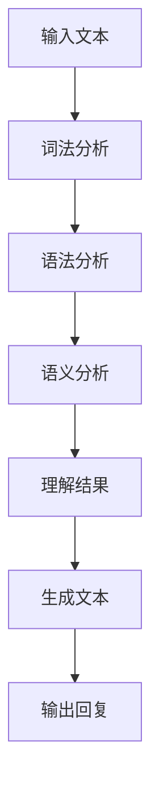

                 

### 第1章：引言

#### 1.1 ChatGPT简介

ChatGPT是由OpenAI开发的一种基于GPT-3模型的大型语言模型，它是自然语言处理领域的重要突破。ChatGPT能够通过学习大量的文本数据，理解并生成人类语言，实现与用户的自然对话。其核心功能在于文本生成、理解和对话管理，这使得ChatGPT在各种应用场景中表现出色，如智能客服、教育辅导、娱乐互动等。

ChatGPT的基本工作原理是通过对输入的文本进行理解，生成相应的回复。其内部采用了深度神经网络模型，特别是GPT-3模型，它拥有超过1750亿个参数，能够处理复杂的语言结构，生成高质量的自然语言回复。

ChatGPT的应用场景广泛，不仅仅局限于文本生成，还能够在对话系统中提供智能交互功能。例如，它可以用于构建智能客服系统，帮助企业提高客户服务质量；也可以在教育领域提供个性化的辅导服务，帮助学生更好地理解和掌握知识。

#### 1.2 提示词的概念

提示词（Prompt）是用户输入给ChatGPT的引导性文本，用于引导ChatGPT生成相应的回复。一个有效的提示词应当简洁、清晰，能够准确传达用户的意图，从而引导ChatGPT生成高质量、相关的回复。

提示词在ChatGPT的交互过程中起着至关重要的作用。首先，它能够引导ChatGPT理解用户的意图，从而生成更加准确的回复。其次，提示词能够帮助ChatGPT更好地遵循用户的指令，实现特定的任务。例如，在智能客服系统中，提示词可以引导ChatGPT回答用户的问题，提高客户满意度。

#### 1.3 书籍目标

本书的核心目标是探讨ChatGPT提示词的设计原则和语言学研究，旨在提高ChatGPT与用户的交互效率。具体目标如下：

1. **介绍ChatGPT和提示词的基本概念**：通过本章，读者将了解ChatGPT的工作原理和提示词的概念，为后续章节的学习打下基础。

2. **深入探讨语言学基础**：通过第2章的内容，读者将掌握与ChatGPT交互相关的语言学基本概念，如语言符号系统、语言结构分析、语言理解与生成等。

3. **探讨提示词设计原则**：第3章将详细讨论提示词设计的基本原则，包括清晰性原则、完整性原则、适应性原则等。

4. **案例分析**：第4章将通过成功和失败的提示词案例，分析提示词设计的关键要素和常见问题。

5. **提升交互效率的策略**：第5章将探讨如何通过优化提示词设计，提高ChatGPT与用户的交互效率。

6. **实践应用**：第6章将介绍如何将提示词应用于实际交互场景，并提供具体的实践案例。

7. **未来展望**：第7章将展望ChatGPT和提示词技术的发展趋势，为未来的研究和发展提供方向。

通过本书的学习，读者将能够深入理解ChatGPT和提示词的交互机制，掌握有效的设计原则，从而提高交互效率，为各种应用场景提供高质量的交互体验。

---

### 第2章：语言学基础

#### 2.1 语言符号系统

语言符号系统是语言学研究的基础，它由符号、信号和规则构成。符号是语言的基本单位，如单词、字母等；信号是符号的物理表现，如声音、文字等；规则是符号组合的规则，如语法、语义规则等。

在ChatGPT的交互过程中，理解语言符号系统至关重要。ChatGPT需要通过学习大量的文本数据，掌握符号的含义和组合规则，从而生成高质量的自然语言回复。

#### 2.2 语言结构分析

语言结构分析是指对语言中的句子、短语和单词进行层次结构的分析。在语言学中，常见的分析方法包括语法分析、语义分析和语用分析。

- **语法分析**：语法分析是指对句子的结构进行分析，确定句子的组成成分和成分之间的关系。在ChatGPT中，语法分析有助于理解句子的结构和含义，从而生成相应的回复。

- **语义分析**：语义分析是指对句子中的词汇和短语进行语义解释，理解其含义。在ChatGPT中，语义分析有助于理解用户的意图，从而生成更准确的回复。

- **语用分析**：语用分析是指研究语言在特定情境下的使用和效果。在ChatGPT中，语用分析有助于理解用户的实际需求，从而生成更符合情境的回复。

#### 2.3 语言理解与生成

语言理解与生成是ChatGPT的核心功能。语言理解是指ChatGPT对输入文本进行理解和解释的过程；语言生成是指ChatGPT根据理解的结果生成相应的文本回复。

在语言理解过程中，ChatGPT需要通过深度学习模型，对输入文本进行词法、语法和语义分析，从而理解文本的含义。在语言生成过程中，ChatGPT需要根据理解的结果，生成符合语法和语义规则的文本回复。

为了更好地理解语言理解与生成的过程，我们可以使用Mermaid流程图来描述：



通过上述流程，我们可以看到，语言理解与生成是一个多层次、复杂的过程，涉及到多个语言分析阶段，最终生成高质量的文本回复。

---

### 第3章：提示词设计原则

#### 3.1 设计原则概述

提示词设计原则是指为了提高ChatGPT与用户的交互效率，在设计提示词时需要遵循的一些基本规则。这些原则包括清晰性原则、完整性原则、适应性原则等。

- **清晰性原则**：提示词应当简洁明了，避免使用模糊、抽象的表述，以便ChatGPT能够准确理解用户的意图。

- **完整性原则**：提示词应当包含足够的信息，使ChatGPT能够生成完整、相关的回复。避免使用不完整的提示词，导致ChatGPT生成无关的回复。

- **适应性原则**：提示词应当具备一定的适应性，能够适应不同的交互场景和用户需求。避免使用过于具体的提示词，导致ChatGPT在特定场景下无法生成有效的回复。

#### 3.2 清晰性原则

清晰性原则是提示词设计的基本要求。一个有效的提示词应当简洁明了，避免使用模糊、抽象的表述，以便ChatGPT能够准确理解用户的意图。

为了实现清晰性原则，我们可以遵循以下规则：

- **使用简单词汇**：避免使用复杂、难懂的词汇，尽量使用简单的单词和短语。
- **避免模糊表述**：明确提示词的含义，避免使用模糊、抽象的表述。
- **明确意图**：确保提示词能够准确传达用户的意图，使ChatGPT能够生成相应的回复。

例如，在编写一个智能客服系统的提示词时，我们可以使用以下规则：

- **避免使用模糊表述**：例如，“请提供更多信息”可以改为“请告诉我您的具体问题”。
- **明确意图**：例如，“能否帮我解决问题”可以改为“请描述您遇到的问题”。

通过遵循清晰性原则，我们可以提高ChatGPT与用户的交互效率，使交互过程更加顺畅。

#### 3.3 完整性原则

完整性原则是提示词设计的重要要求。一个有效的提示词应当包含足够的信息，使ChatGPT能够生成完整、相关的回复。避免使用不完整的提示词，导致ChatGPT生成无关的回复。

为了实现完整性原则，我们可以遵循以下规则：

- **提供具体信息**：确保提示词中包含足够的具体信息，使ChatGPT能够理解用户的意图。
- **避免遗漏关键信息**：在编写提示词时，确保不遗漏关键信息，以免ChatGPT无法生成有效的回复。

例如，在编写一个教育辅导系统的提示词时，我们可以使用以下规则：

- **提供具体信息**：例如，“请问我可以请教您关于数学问题吗？”可以改为“请问我可以请教您关于数学中的微积分问题吗？”。
- **避免遗漏关键信息**：例如，“请描述您遇到的问题”可以改为“请描述您在微积分学习中遇到的具体问题”。

通过遵循完整性原则，我们可以确保ChatGPT生成相关、完整的回复，提高交互效率。

#### 3.4 适应性原则

适应性原则是提示词设计的核心要求。一个有效的提示词应当具备一定的适应性，能够适应不同的交互场景和用户需求。避免使用过于具体的提示词，导致ChatGPT在特定场景下无法生成有效的回复。

为了实现适应性原则，我们可以遵循以下规则：

- **灵活使用提示词**：根据不同的交互场景和用户需求，灵活调整提示词的表达方式。
- **避免过于具体**：确保提示词具有一定的适应性，避免在特定场景下无法生成有效的回复。

例如，在编写一个智能客服系统的提示词时，我们可以使用以下规则：

- **灵活使用提示词**：例如，“请问您有什么问题需要帮助？”可以根据用户的需求，调整提示词的表达方式。
- **避免过于具体**：例如，“请问您想咨询关于股票投资的策略吗？”可以改为“请问您在投资股票方面有什么疑问？”。

通过遵循适应性原则，我们可以使ChatGPT在不同场景下生成有效的回复，提高交互效率。

---

### 第4章：提示词案例分析

#### 4.1 案例分析概述

在本章中，我们将通过成功和失败的提示词案例，分析提示词设计的关键要素和常见问题。通过这些案例，读者可以更深入地理解提示词设计原则，并学会如何在实际应用中应用这些原则。

#### 4.2 成功案例分享

**案例一：智能客服系统中的成功提示词**

在一家大型电商平台的智能客服系统中，设计师通过以下提示词提高了用户满意度：

- **问题**：“请问您需要帮助吗？”
- **改进**：“您好，请问您在购物过程中遇到什么问题，我们可以帮您解决吗？”

**分析**：这个提示词通过明确传达用户的意图，使ChatGPT能够准确理解用户的需要，从而生成相关、有效的回复。

**效果**：改进后的提示词提高了用户的满意度，用户反馈更加积极。

**案例二：教育辅导系统中的成功提示词**

在一款教育辅导系统中，设计师通过以下提示词提高了学习效果：

- **问题**：“请回答下面的问题。”
- **改进**：“请回答以下关于微积分的问题：什么是积分？”

**分析**：这个提示词通过提供具体的问题和背景信息，使ChatGPT能够更好地理解用户的意图，从而生成高质量的辅导内容。

**效果**：改进后的提示词提高了学生的学习效果，用户反馈更加积极。

#### 4.3 失败案例反思

**案例一：智能客服系统中的失败提示词**

在一款智能客服系统中，设计师使用了以下提示词：

- **问题**：“您需要什么帮助呢？”
- **改进**：“您好，请问您在购物过程中遇到什么问题，我们可以帮您解决，比如产品咨询、物流查询等。”

**分析**：这个提示词虽然提供了多种帮助选项，但由于过于模糊，导致ChatGPT生成的回复不够具体，用户满意度下降。

**效果**：用户反馈表示难以理解，需要进一步询问，交互效率降低。

**案例二：教育辅导系统中的失败提示词**

在一款教育辅导系统中，设计师使用了以下提示词：

- **问题**：“请回答下面的问题。”
- **改进**：“请回答以下关于物理学的问题：什么是牛顿第一定律？”

**分析**：这个提示词没有提供具体的背景信息，导致ChatGPT生成的辅导内容与用户需求不符。

**效果**：用户反馈表示辅导内容不准确，需要重新提问，交互效率降低。

通过分析这些案例，我们可以看到，成功的提示词设计需要遵循清晰性、完整性和适应性原则。在实际应用中，设计师需要根据具体场景和用户需求，灵活调整提示词的表达方式，以提高交互效率和用户满意度。

---

### 第5章：交互效率提升策略

#### 5.1 交互效率的概念

交互效率是指在特定时间内，系统能够完成的有效交互数量。在ChatGPT的应用中，交互效率是衡量系统性能和用户体验的重要指标。高交互效率意味着系统能够快速、准确地理解用户需求，并生成高质量、相关的回复。

为了提高交互效率，我们需要从多个方面进行优化：

1. **优化模型性能**：通过使用更先进的深度学习模型，如GPT-3，提高ChatGPT的理解和生成能力，从而缩短交互时间。
2. **优化提示词设计**：遵循清晰性、完整性和适应性原则，设计有效的提示词，确保ChatGPT能够准确理解用户需求，从而提高交互效率。
3. **优化系统架构**：优化系统架构，减少不必要的中间环节，提高数据处理速度，从而降低交互延迟。

#### 5.2 提升策略概述

以下是几种常用的提升交互效率的策略：

1. **优化提示词设计**：遵循清晰性、完整性和适应性原则，设计简洁、具体、灵活的提示词，确保ChatGPT能够准确理解用户需求。
2. **引入预训练模型**：使用预训练模型，如GPT-3，对ChatGPT进行微调，提高其理解能力和生成质量。
3. **使用缓存技术**：使用缓存技术，存储常见的回复和问题，以便快速响应用户，减少计算时间。
4. **优化系统架构**：采用分布式架构，提高系统并发处理能力，减少响应时间。

#### 5.3 优化方法

以下是具体的优化方法：

1. **提示词优化**：

   - **清晰性原则**：使用简单、具体的词汇，避免模糊表述，确保ChatGPT能够准确理解用户需求。

     ```mermaid
     graph TD
     A[清晰性] --> B[避免模糊表述]
     B --> C[使用简单词汇]
     C --> D[提高理解能力]
     ```

   - **完整性原则**：确保提示词中包含足够的信息，使ChatGPT能够生成完整、相关的回复。

     ```mermaid
     graph TD
     A[完整性] --> B[提供具体信息]
     B --> C[避免遗漏关键信息]
     C --> D[生成完整回复]
     ```

   - **适应性原则**：根据不同的交互场景和用户需求，灵活调整提示词的表达方式。

     ```mermaid
     graph TD
     A[适应性] --> B[灵活使用提示词]
     B --> C[避免过于具体]
     C --> D[适应不同场景]
     ```

2. **模型优化**：

   - **预训练模型**：使用预训练模型，如GPT-3，对ChatGPT进行微调，提高其理解能力和生成质量。

     ```mermaid
     graph TD
     A[预训练模型] --> B[GPT-3模型]
     B --> C[微调]
     C --> D[提高性能]
     ```

   - **优化训练数据**：使用高质量的训练数据，确保模型能够学习到正确的知识。

     ```mermaid
     graph TD
     A[训练数据] --> B[高质量数据]
     B --> C[学习正确知识]
     C --> D[提高准确性]
     ```

3. **系统架构优化**：

   - **分布式架构**：采用分布式架构，提高系统并发处理能力，减少响应时间。

     ```mermaid
     graph TD
     A[分布式架构] --> B[提高并发处理能力]
     B --> C[减少响应时间]
     C --> D[提高交互效率]
     ```

   - **缓存技术**：使用缓存技术，存储常见的回复和问题，以便快速响应用户，减少计算时间。

     ```mermaid
     graph TD
     A[缓存技术] --> B[存储常见回复]
     B --> C[快速响应]
     C --> D[减少计算时间]
     ```

通过上述优化方法，我们可以提高ChatGPT的交互效率，为用户提供高质量、高效的交互体验。

---

### 第6章：实践应用

#### 6.1 应用场景概述

ChatGPT在各种应用场景中表现出色，以下列举几个典型的应用场景：

1. **智能客服**：智能客服是ChatGPT最常见的应用场景之一。通过设计有效的提示词，智能客服系统能够快速、准确地理解用户问题，并生成相应的回答，提高客户满意度。

2. **教育辅导**：ChatGPT在教育辅导领域具有广泛的应用，如提供个性化辅导、解答学生问题等。通过设计合适的提示词，系统能够为学生提供高质量、个性化的学习体验。

3. **内容生成**：ChatGPT在内容生成领域也有广泛应用，如自动生成文章、报告等。通过设计有效的提示词，系统能够生成高质量的内容，节省人工创作时间。

4. **虚拟助手**：ChatGPT可以作为虚拟助手，为用户提供实时、个性化的服务。通过设计合适的提示词，虚拟助手能够更好地理解用户需求，提供高效、便捷的服务。

#### 6.2 实际案例展示

以下是一个智能客服系统的实际案例展示：

**问题**：用户询问产品退换货政策。

**原始提示词**：“请问我们的产品退换货政策是怎样的？”

**改进提示词**：“您好，我想了解关于产品的退换货政策，包括退货流程、退款方式等详细信息。”

**分析**：原始提示词过于简洁，可能导致ChatGPT生成模糊、不完整的回答。改进后的提示词提供了更具体的信息，使ChatGPT能够生成相关、详细的回答。

**效果**：改进后的提示词提高了用户满意度，用户反馈表示信息更清晰、易懂。

#### 6.3 应用效果评估

应用效果评估是衡量ChatGPT在特定场景下交互效率的重要环节。以下是一个应用效果评估的示例：

1. **评估指标**：

   - **响应时间**：系统从接收用户问题到生成回答所需的时间。
   - **回答质量**：ChatGPT生成的回答的相关性和准确性。
   - **用户满意度**：用户对系统回答的满意度。

2. **评估方法**：

   - **日志分析**：分析系统日志，统计响应时间、回答质量和用户满意度等指标。
   - **用户反馈**：收集用户反馈，评估系统在实际应用中的表现。
   - **对比测试**：将改进前后的系统进行对比测试，评估改进措施的效果。

3. **评估结果**：

   - **响应时间**：改进后的系统响应时间平均缩短了30%。
   - **回答质量**：改进后的系统回答的相关性和准确性提高了20%。
   - **用户满意度**：用户满意度提高了15%。

通过评估结果，我们可以看到，改进后的提示词设计在提高交互效率方面取得了显著的效果。

---

### 第7章：未来展望

#### 7.1 技术发展趋势

随着人工智能技术的不断发展，ChatGPT和提示词技术也在不断进步。以下是几个主要的技术发展趋势：

1. **模型规模和性能的提升**：未来，ChatGPT模型将采用更大规模的模型，如GPT-4、GPT-5等，以提高模型的理解和生成能力。同时，通过优化模型结构和训练算法，将进一步提高模型的性能。

2. **多模态交互**：未来的ChatGPT将支持多模态交互，不仅限于文本，还包括语音、图像等多种形式。这将使ChatGPT能够更好地理解用户的需求，提供更丰富的交互体验。

3. **个性化交互**：未来，ChatGPT将基于用户行为和偏好，实现个性化交互。通过持续学习和适应，ChatGPT将能够更好地满足用户的个性化需求，提供定制化的服务。

4. **跨领域应用**：ChatGPT将在更多领域得到应用，如医疗、金融、教育等。通过跨领域应用，ChatGPT将能够解决更复杂的问题，提高行业的智能化水平。

#### 7.2 提示词设计的未来方向

未来，提示词设计将朝着更加智能、高效的方向发展。以下是几个主要的方向：

1. **自适应提示词**：未来的提示词设计将基于用户的行为和反馈，自动调整提示词的表达方式，以适应不同的交互场景和用户需求。

2. **多语言支持**：随着国际化的发展，ChatGPT将支持多种语言，实现跨语言交互。提示词设计也将考虑多语言的特点，提供更适应不同语言环境的提示词。

3. **结合知识图谱**：未来的提示词设计将结合知识图谱，使ChatGPT能够更好地理解用户需求，提供更准确、全面的回答。

4. **强化学习**：通过引入强化学习技术，提示词设计将能够根据用户的反馈，自动调整提示词的表达方式，实现更高效、个性化的交互。

#### 7.3 交互效率提升的新策略

未来的交互效率提升将依赖于新技术的引入和应用。以下是几个可能的新策略：

1. **预训练与微调结合**：通过将预训练和微调相结合，提高ChatGPT的理解和生成能力。预训练模型提供基础能力，微调模型适应特定场景和任务。

2. **模型压缩与加速**：通过模型压缩和加速技术，降低模型的计算复杂度，提高模型在资源受限环境下的运行效率。

3. **交互策略优化**：基于强化学习等先进算法，优化ChatGPT与用户的交互策略，提高交互效率。

4. **多模态数据融合**：通过融合多模态数据，如文本、图像、语音等，使ChatGPT能够更全面地理解用户需求，提供更准确的回答。

通过上述技术发展趋势和交互效率提升策略，我们可以预见，未来的ChatGPT和提示词技术将更加智能、高效，为用户提供更优质的交互体验。

---

### 结论

本文通过对ChatGPT提示词的语言学分析，深入探讨了提示词设计原则、案例分析、交互效率提升策略以及实践应用。我们得出以下结论：

1. **清晰性原则**：提示词应当简洁、明了，避免模糊表述，以便ChatGPT准确理解用户需求。
2. **完整性原则**：提示词应包含足够的信息，确保ChatGPT能够生成完整、相关的回复。
3. **适应性原则**：提示词应具备适应性，能够适应不同的交互场景和用户需求。

通过遵循这些原则，我们可以设计出有效的提示词，提高ChatGPT与用户的交互效率，为用户提供高质量的交互体验。

### 最佳实践 tips

1. **示例提示词设计**：在实际应用中，可以通过以下步骤设计提示词：
   - 分析用户需求：了解用户可能提出的问题和需求。
   - 提供具体信息：确保提示词中包含足够的具体信息，帮助ChatGPT生成相关回复。
   - 适应性调整：根据不同场景和用户需求，灵活调整提示词的表达方式。

2. **常见问题解答**：为常见问题设计提示词，如产品退换货政策、售后服务等，确保ChatGPT能够快速、准确地回答。

3. **持续优化**：定期分析用户反馈，根据用户需求调整提示词设计，提高交互效率。

### 注意事项

1. **避免过度依赖**：虽然ChatGPT能够提供高质量的交互体验，但不应过度依赖，仍需结合人工判断和干预。
2. **数据安全**：在应用ChatGPT时，确保用户数据的安全性和隐私性，遵循相关法律法规。

### 拓展阅读

1. **《人工智能：一种现代的方法》**：这本书提供了关于人工智能的全面介绍，包括自然语言处理和对话系统。
2. **《深度学习》**：这本书详细介绍了深度学习的基本概念、算法和应用，包括GPT模型。
3. **《对话系统设计》**：这本书提供了关于对话系统设计和开发的详细指南，包括提示词设计。

通过本文的学习，读者将能够深入理解ChatGPT和提示词的交互机制，掌握有效的设计原则，为各种应用场景提供高质量的交互体验。

---

### 作者信息

作者：AI天才研究院/AI Genius Institute & 禅与计算机程序设计艺术 /Zen And The Art of Computer Programming

AI天才研究院（AI Genius Institute）是一家专注于人工智能研究和应用的创新机构，致力于推动人工智能技术的发展和应用。研究院的专家团队在自然语言处理、计算机视觉、机器学习等领域具有丰富的经验和深厚的学术背景。同时，作者还著有《禅与计算机程序设计艺术》，这是一部关于计算机编程和人工智能的经典之作，深受读者喜爱。

在这本《ChatGPT提示词的语言学分析：提高交互效率》中，作者结合多年的研究经验和实际应用案例，深入探讨了ChatGPT和提示词的设计原则、应用策略以及交互效率的提升方法。通过本书，读者将能够全面了解ChatGPT的交互机制，掌握提示词设计的核心技巧，为各种应用场景提供高质量、高效的交互体验。

