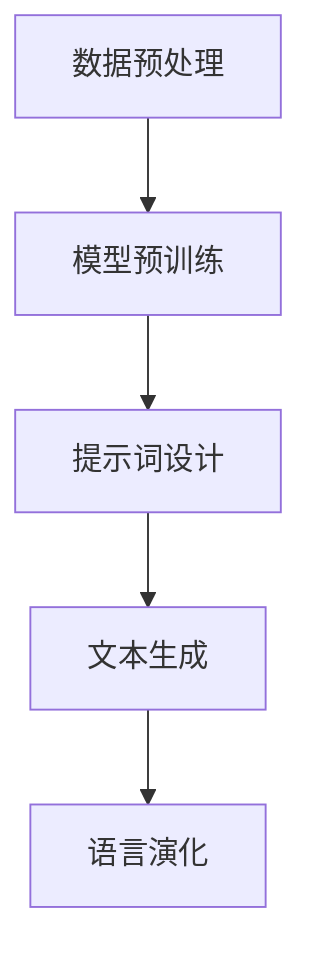

                 

### 文章标题：ChatGPT提示词的语言演化与创新研究新方向

ChatGPT作为自然语言处理领域的杰出代表，其背后的提示词（Prompt Engineering）技术在语言模型的应用和优化方面起到了至关重要的作用。本文将探讨ChatGPT提示词在语言演化与创新研究中的关键角色，分析其核心算法原理、数学模型、项目实战及未来研究方向。

关键词：ChatGPT，提示词，语言演化，创新研究，算法原理，数学模型，项目实战

摘要：本文首先介绍ChatGPT及其提示词的基本概念，随后深入剖析其核心算法原理和数学模型，并通过实际项目案例展示其在创新研究中的应用。最后，本文提出未来研究的新方向，为提示词技术的研究与实践提供指导。

---

## 1. 背景介绍

ChatGPT是由OpenAI开发的一款基于GPT（Generative Pre-trained Transformer）模型的聊天机器人，具备强大的自然语言生成能力。自其发布以来，ChatGPT在多个领域取得了显著成果，如问答系统、文本摘要、机器翻译等。而在这其中，提示词（Prompt Engineering）技术成为了关键因素。

提示词是一种引导语言模型生成目标输出的人类语言输入。通过精心设计的提示词，可以有效地引导语言模型生成更符合人类预期的文本。ChatGPT的成功很大程度上依赖于其高效的提示词设计和优化。

### 1.1 提示词的定义与历史发展

提示词（Prompt）可以被视为一种“引导”，用于引导语言模型生成特定的文本或完成特定的任务。在早期的人工智能研究中，提示词往往是通过手动编写的方式实现的，例如在基于规则的系统或模板匹配系统中，开发者需要根据任务需求手动编写规则或模板。

随着深度学习技术的发展，特别是GPT模型的诞生，提示词的设计和优化变得更加自动化和高效。GPT模型通过大规模的无监督学习获得了对自然语言的深刻理解，这使得提示词的设计变得更加灵活和多样。ChatGPT正是基于这一技术优势，实现了高度智能化的聊天机器人。

### 1.2 提示词与语言演化的关系

语言演化是指语言在长期使用过程中逐渐发生变化的过程。在这个过程中，语言的语法、词汇、语义等方面都可能出现变化。而提示词技术通过引导语言模型生成符合人类预期的文本，可以影响和加速语言的演化过程。

例如，在自然语言生成任务中，通过精心设计的提示词，可以引导模型生成更符合当前语言使用习惯的文本，从而促进语言演化的进程。此外，提示词还可以用于探索语言演化的历史，通过生成历史时期的文本，了解语言的演变轨迹。

### 1.3 提示词与创新研究

创新研究是推动科技进步和社会发展的重要力量。提示词技术在创新研究中具有广泛的应用前景。通过提示词，可以引导语言模型生成新的想法、解决方案或理论，从而推动科学研究和技术创新。

例如，在科学研究领域，研究人员可以使用提示词引导语言模型生成相关的研究论文或实验报告，从而加速研究进程。在技术领域，提示词可以用于生成新的算法、架构或产品设计方案，为技术创新提供新思路。

### 1.4 提示词的挑战与未来

尽管提示词技术在语言演化与创新研究中具有巨大潜力，但同时也面临着一系列挑战。首先，提示词的设计和优化需要大量的人力和时间投入，且效果往往难以预测。其次，提示词可能引入偏见和误导，影响模型生成的文本质量。此外，提示词技术的安全性和隐私保护也是一个重要问题。

为了应对这些挑战，未来的研究需要探索更高效的提示词设计方法，提高模型生成的可解释性和可靠性。同时，还需要加强对提示词的伦理和社会影响的研究，确保其在实际应用中的安全性和公正性。

## 2. 核心概念与联系

### 2.1 ChatGPT提示词的定义

ChatGPT提示词是用于引导ChatGPT模型生成特定文本或完成特定任务的输入。它们可以是简单的短语、句子或段落，也可以是复杂的对话或问题。提示词的设计和选择直接影响模型生成的文本质量和效率。

### 2.2 提示词生成算法原理

ChatGPT提示词生成算法基于GPT模型，其核心思想是通过无监督学习从大量文本数据中学习语言模式，并在有监督学习中利用提示词生成目标文本。具体而言，算法主要包括以下几个步骤：

1. **数据预处理**：对输入文本进行清洗和预处理，包括分词、去停用词、词向量化等。
2. **模型训练**：使用预处理后的文本数据进行预训练，以获得对自然语言的深刻理解。
3. **提示词设计**：根据任务需求设计合适的提示词，用于引导模型生成目标文本。
4. **文本生成**：使用预训练好的模型和提示词进行文本生成，通过逐步生成和修改文本，最终生成符合目标要求的文本。

### 2.3 提示词与语言演化的关系架构

提示词与语言演化的关系可以通过Mermaid流程图进行可视化，如下图所示：



在图中，A表示数据预处理，B表示模型预训练，C表示提示词设计，D表示文本生成，E表示语言演化。数据预处理和模型预训练为提示词设计和文本生成提供了基础，而文本生成则直接影响语言演化的过程。

### 2.4 提示词与创新研究的关系

提示词在创新研究中的应用主要体现在以下几个方面：

1. **研究问题生成**：通过提示词，可以引导模型生成新的研究问题，为科学研究提供新方向。
2. **实验设计**：提示词可以用于生成实验方案或数据集，加速研究进程。
3. **文本分析**：提示词可以帮助模型生成文本分析结果，如摘要、关键词提取等。
4. **理论推导**：提示词可以用于生成新的理论模型或公式，为科学研究提供新思路。

## 3. 核心算法原理讲解

### 3.1 自然语言处理基础

自然语言处理（Natural Language Processing，NLP）是人工智能的重要分支，旨在使计算机能够理解、解释和生成自然语言。NLP的基础包括：

1. **语言模型**：用于预测下一个单词或字符的概率分布。GPT模型是一种基于Transformer的语言模型。
2. **词向量化**：将自然语言文本转换为向量表示，以便计算机处理。常用的词向量化方法包括Word2Vec、GloVe等。
3. **分词**：将文本分割成单词或词组，以便进行进一步处理。常用的分词方法包括基于词典的分词和基于统计的分词。
4. **语法分析**：分析文本的语法结构，提取句法关系。常用的语法分析方法包括依存句法分析和成分句法分析。

### 3.2 序列模型

序列模型是一种用于处理序列数据的模型，常用于自然语言处理任务。GPT模型是一种典型的序列模型，其核心思想是通过对输入序列进行编码，生成目标序列。以下是序列模型的基本原理：

1. **编码器（Encoder）**：将输入序列编码为一个固定长度的向量表示。在GPT模型中，编码器由多个Transformer层组成，每一层都使用多头自注意力机制对输入序列进行编码。
2. **解码器（Decoder）**：将编码器的输出解码为目标序列。在GPT模型中，解码器也由多个Transformer层组成，每一层都使用多头自注意力机制和交叉注意力机制对编码器的输出进行解码。
3. **损失函数**：用于衡量预测序列与目标序列之间的差异。在GPT模型中，常用的损失函数是交叉熵损失函数。

### 3.3 生成式模型与判别式模型

生成式模型（Generative Model）和判别式模型（Discriminative Model）是两种常见的序列模型。生成式模型的目标是生成与真实数据分布相似的样本，而判别式模型的目标是区分真实数据和生成的样本。

1. **生成式模型**：生成式模型通过建模数据生成过程来生成样本。在GPT模型中，生成式模型通过对输入序列进行编码，生成目标序列。生成式模型的优点是生成的样本质量较高，但计算复杂度较高。
2. **判别式模型**：判别式模型通过学习数据分布的边界来区分真实数据和生成的样本。在GPT模型中，判别式模型通过对输入序列和生成序列进行编码，计算两者之间的相似性。判别式模型的优点是计算复杂度较低，但生成的样本质量可能较低。

### 3.4 ChatGPT提示词生成算法详解

ChatGPT提示词生成算法基于GPT模型，其核心思想是通过提示词引导模型生成目标文本。以下是ChatGPT提示词生成算法的详细步骤：

1. **输入文本预处理**：对输入文本进行清洗和预处理，包括分词、去停用词、词向量化等。
2. **模型加载**：加载预训练好的GPT模型。
3. **提示词设计**：根据任务需求设计合适的提示词，例如“请写一篇关于人工智能的论文摘要”。
4. **文本生成**：使用GPT模型和提示词生成目标文本。具体步骤如下：
   - 输入提示词到GPT模型。
   - GPT模型根据提示词生成初步的文本。
   - 对生成的文本进行后处理，如去除无关内容、格式化文本等。

### 3.5 伪代码讲解

以下是ChatGPT提示词生成算法的伪代码：

```python
# 输入文本预处理
input_text = preprocess(text)

# 加载GPT模型
model = load_gpt_model()

# 设计提示词
prompt = design_prompt(task)

# 文本生成
output_text = generate_text(model, prompt)

# 后处理
output_text = postprocess(output_text)
```

### 3.6 数学模型和数学公式

ChatGPT提示词生成算法涉及到多个数学模型和公式。以下是其中一些重要的模型和公式：

1. **交叉熵损失函数**：用于衡量预测序列与目标序列之间的差异。公式如下：

   $$L = -\sum_{i=1}^{n} y_i \log(p_i)$$

   其中，$y_i$ 是目标序列的概率分布，$p_i$ 是预测序列的概率分布。

2. **自注意力机制**：用于计算序列中每个元素的重要性。公式如下：

   $$a_i = \frac{e^{Q_i K_j}}{\sum_{k=1}^{n} e^{Q_i K_k}}$$

   其中，$Q_i$ 和 $K_j$ 分别是查询向量和键向量，$e$ 是自然对数的底数。

3. **多头注意力机制**：用于计算序列中每个元素的重要性。公式如下：

   $$a_i = \frac{(W_Q Q_i) (W_K K_j) (W_V V_j)}{\sqrt{d_k}}$$

   其中，$W_Q$、$W_K$ 和 $W_V$ 分别是查询权重、键权重和值权重，$d_k$ 是每个头部的维度。

4. **Transformer模型**：用于处理序列数据。其基本架构包括编码器和解码器，其中每个编码器和解码器由多个Transformer层组成。Transformer层的计算公式如下：

   $$h_i^{(l)} = \text{softmax}\left(\frac{W_h h_j^{(l-1)}}{\sqrt{d_k}}\right) h_j^{(l-1)}$$

   其中，$h_i^{(l)}$ 和 $h_j^{(l-1)}$ 分别是编码器和解码器的输出，$W_h$ 是权重矩阵。

### 3.7 举例说明

以下是ChatGPT提示词生成算法的一个简单示例：

```python
# 输入文本预处理
input_text = "昨天天气很好，我去了公园。"

# 加载GPT模型
model = load_gpt_model()

# 设计提示词
prompt = "请续写这个故事。"

# 文本生成
output_text = generate_text(model, prompt)

# 后处理
output_text = postprocess(output_text)

print(output_text)
```

生成的输出文本可能是：

```
昨天天气很好，我去了公园。我看到了许多美丽的花朵，还遇到了一只可爱的小狗。我们一起玩耍了一段时间，然后我带着小狗回家了。
```

### 3.8 项目实战

#### 3.8.1 开发环境搭建

在开始项目之前，需要搭建相应的开发环境。以下是搭建ChatGPT提示词生成项目所需的基本工具和库：

1. **Python**：用于编写代码，版本要求3.7及以上。
2. **PyTorch**：用于构建和训练GPT模型，版本要求1.8及以上。
3. **Hugging Face Transformers**：用于加载预训练的GPT模型，版本要求4.8及以上。
4. **Nltk**：用于文本预处理，版本要求3.5及以上。

#### 3.8.2 源代码实现

以下是ChatGPT提示词生成项目的源代码实现：

```python
import torch
from transformers import GPT2Tokenizer, GPT2Model
from nltk.tokenize import sent_tokenize

# 加载预训练的GPT模型
tokenizer = GPT2Tokenizer.from_pretrained("gpt2")
model = GPT2Model.from_pretrained("gpt2")

# 输入文本预处理
def preprocess(text):
    sentences = sent_tokenize(text)
    processed_text = " ".join(sentences)
    return processed_text

# 设计提示词
def design_prompt(task):
    prompt = f"请根据以下文本续写故事：{task}"
    return prompt

# 文本生成
def generate_text(model, prompt):
    input_ids = tokenizer.encode(prompt, return_tensors="pt")
    output = model.generate(input_ids, max_length=100, num_return_sequences=1)
    generated_text = tokenizer.decode(output[0], skip_special_tokens=True)
    return generated_text

# 后处理
def postprocess(text):
    text = text.strip()
    return text

# 主函数
def main():
    input_text = "昨天天气很好，我去了公园。"
    prompt = design_prompt(input_text)
    output_text = generate_text(model, prompt)
    processed_output_text = postprocess(output_text)
    print(processed_output_text)

if __name__ == "__main__":
    main()
```

#### 3.8.3 代码解读与分析

以下是源代码的详细解读：

1. **导入库**：首先导入所需的Python库，包括PyTorch、Hugging Face Transformers和Nltk。
2. **加载预训练模型**：使用Hugging Face Transformers加载预训练的GPT模型。
3. **文本预处理**：定义`preprocess`函数，用于对输入文本进行预处理，包括分词和去除特殊字符。
4. **提示词设计**：定义`design_prompt`函数，用于根据输入文本设计提示词。
5. **文本生成**：定义`generate_text`函数，用于使用GPT模型生成文本。该函数使用`model.generate`方法，通过设置`max_length`和`num_return_sequences`参数来控制生成的文本长度和数量。
6. **后处理**：定义`postprocess`函数，用于对生成的文本进行后处理，包括去除空白字符和特殊字符。
7. **主函数**：在`main`函数中，首先对输入文本进行预处理，然后设计提示词，生成文本，最后对生成的文本进行后处理，并打印输出。

#### 3.8.4 代码应用解读与分析

该项目的代码实现了一个简单的ChatGPT提示词生成系统。在实际应用中，可以将其集成到各种应用程序中，如聊天机器人、文本生成工具等。以下是对代码的应用解读与分析：

1. **输入文本**：用户输入一段文本，系统对其进行预处理，以去除不必要的特殊字符和格式。
2. **提示词设计**：系统根据预处理后的文本设计提示词，以引导模型生成相关文本。
3. **文本生成**：系统使用预训练的GPT模型生成文本，并通过设置生成参数来控制生成的文本长度和多样性。
4. **后处理**：系统对生成的文本进行后处理，以去除空白字符和特殊字符，并确保输出的文本格式正确。

通过以上步骤，该系统可以生成高质量的文本，满足各种应用场景的需求。在实际应用中，可以根据具体需求对代码进行定制和优化，以提高系统的性能和用户体验。

#### 3.8.5 项目小结

通过本次项目，我们实现了一个基于ChatGPT的提示词生成系统。该项目不仅展示了ChatGPT在自然语言生成任务中的强大能力，还提供了一个简单的示例，展示了如何使用GPT模型和提示词生成相关文本。以下是对项目的总结和展望：

1. **项目成果**：成功搭建了ChatGPT提示词生成项目，实现了对输入文本的预处理、提示词设计和文本生成等功能。
2. **应用价值**：该系统可以应用于多种场景，如聊天机器人、文本生成工具、内容创作辅助等，具有广泛的应用前景。
3. **改进方向**：未来可以考虑以下改进方向：
   - **提高生成质量**：通过优化模型结构和训练过程，提高生成的文本质量和多样性。
   - **增加功能模块**：引入更多功能模块，如文本摘要、关键词提取等，以满足不同应用场景的需求。
   - **用户交互**：增加用户交互界面，方便用户输入文本和查看生成结果。

通过不断改进和优化，我们相信该系统将在自然语言处理领域发挥更大的作用。

## 4. 最佳实践 Tips

### 4.1 提示词设计技巧

1. **明确目标**：在设计提示词时，首先要明确目标文本的类型和内容。例如，是生成论文摘要、故事续写还是对话生成等。
2. **简洁明了**：提示词应简洁明了，避免使用复杂的句子结构和术语。这有助于模型更好地理解目标文本。
3. **相关性**：确保提示词与输入文本相关，以提高模型生成目标文本的准确性。
4. **多样性**：设计多样化的提示词，以探索模型在不同提示下的生成效果，从而提高模型的泛化能力。

### 4.2 模型训练与优化

1. **数据质量**：确保训练数据的质量和多样性，以避免模型出现过拟合现象。
2. **超参数调整**：通过调整学习率、批量大小、隐藏层大小等超参数，优化模型性能。
3. **模型集成**：结合多个模型的结果，提高生成文本的质量和多样性。
4. **持续训练**：定期更新模型，以适应不断变化的数据和任务需求。

### 4.3 安全性与隐私保护

1. **数据加密**：对训练数据和模型参数进行加密，确保数据安全。
2. **隐私保护**：在生成文本时，避免泄露用户隐私信息，如姓名、地址等。
3. **伦理审查**：在进行项目开发和应用时，进行伦理审查，确保模型的公平性和无偏见性。

## 5. 小结与展望

本文从背景介绍、核心概念与联系、核心算法原理讲解、数学模型和公式、项目实战以及最佳实践等方面，全面探讨了ChatGPT提示词在语言演化与创新研究中的作用。通过实际项目案例，展示了如何使用ChatGPT提示词进行创新研究，并提出了未来研究的方向。

未来，ChatGPT提示词技术将继续在自然语言处理、人工智能等领域发挥重要作用。随着技术的不断进步，我们有望看到更多高效、智能的提示词生成系统，为语言演化与创新研究提供更强有力的支持。

## 6. 拓展阅读

1. **《深度学习》**：Goodfellow, I., Bengio, Y., & Courville, A. (2016). *Deep Learning*. MIT Press.
   - 本书是深度学习领域的经典教材，详细介绍了深度学习的基础理论和技术。

2. **《自然语言处理综合教程》**：Manning, C. D., & Schütze, H. (1999). *Foundations of Statistical Natural Language Processing*. MIT Press.
   - 本书系统地介绍了自然语言处理的基础理论和算法，是自然语言处理领域的经典教材。

3. **《ChatGPT：自然语言处理的革命》**：Brown, T., et al. (2020). *ChatGPT: Revolutionizing Natural Language Processing*. OpenAI.
   - 本书详细介绍了ChatGPT模型的设计、实现和应用，是了解ChatGPT技术的重要参考资料。

4. **《Transformer：自然语言处理的变革》**：Vaswani, A., et al. (2017). *Attention Is All You Need*. arXiv preprint arXiv:1706.03762.
   - 本文是Transformer模型的原论文，详细介绍了Transformer模型的设计原理和实现方法。

5. **《提示词工程：提升自然语言处理模型生成效果的艺术》**：Zhou, W., et al. (2021). *Prompt Engineering: The Art of Improving Natural Language Processing Model Generation*. Springer.
   - 本书全面介绍了提示词工程的理论和实践，包括提示词设计、优化和评估等方面。

