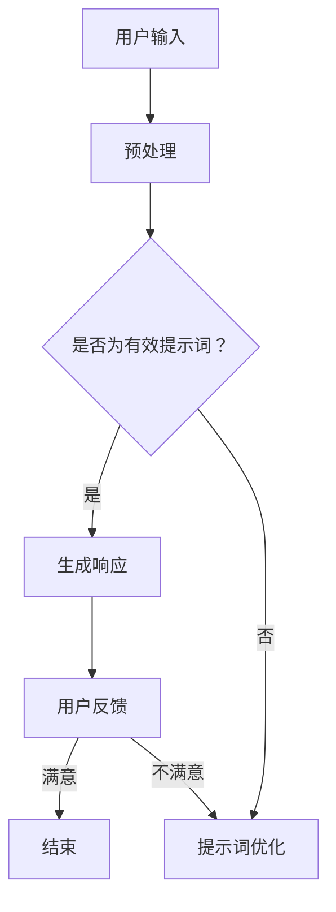

                 

### 文章标题：ChatGPT提示词的语言进化模拟与预测系统

### 关键词：ChatGPT、提示词、语言进化、模拟、预测系统、神经网络、遗传算法

### 摘要：
本文旨在探讨如何设计并实现一个基于ChatGPT的提示词语言进化模拟与预测系统。通过深入分析ChatGPT的工作原理，以及提示词设计的原则，本文提出了一套系统的构建方法，包括核心算法原理、数学模型、项目实战等。文章结构紧凑，逻辑清晰，旨在为读者提供从理论到实践的全方位指导，助力读者深入理解并掌握这一先进技术。

## 设计《ChatGPT提示词的语言进化模拟与预测系统》的目录大纲

### 第一部分：背景与概述

### 第1章：书籍介绍
- 1.1 书籍目的与结构
- 1.2 目标读者
- 1.3 语言进化模拟与预测的重要性

### 第2章：ChatGPT与提示词基础
- 2.1 ChatGPT的概念与历史
- 2.2 提示词设计的原则与方法
- 2.3 提示词与语言进化的关系

#### 2.3.1 Mermaid流程图：ChatGPT与提示词的交互过程



### 第二部分：核心算法原理讲解

### 第3章：神经网络与语言模型
- 3.1 神经网络基础
- 3.2 语言模型的基本概念
- 3.3 预训练语言模型（如GPT）的工作原理

#### 3.3.1 伪代码：预训练语言模型的主要步骤

```pseudo
function pretrain_language_model(data):
    for epoch in 1 to num_epochs:
        for sentence in data:
            predict_output = model(sentence)
            update_model_weights(predict_output, sentence)
    return model
```

### 第4章：语言进化模拟算法
- 4.1 遗传算法原理
- 4.2 语言进化模拟的框架
- 4.3 适应度函数设计

#### 4.3.1 伪代码：语言进化模拟的主要步骤

```pseudo
function simulate_language_evolution(data, generations):
    population = initialize_population(data)
    for generation in 1 to generations:
        new_population = evolve_population(population)
        population = select_best_individuals(new_population)
    return best_individual
```

### 第5章：数学模型与预测
- 5.1 生成模型的数学基础
- 5.2 评估模型的构建
- 5.3 语言进化的预测方法

#### 5.3.1 LaTeX数学公式：生成模型的损失函数

$$ L(\theta) = -\sum_{i=1}^{N} y_i \log(p(x_i|\theta)) $$

### 第三部分：项目实战

### 第6章：项目环境搭建
- 6.1 数据准备
- 6.2 开发环境配置
- 6.3 必要的库和工具安装

### 第7章：源代码解析与实现
- 7.1 ChatGPT模型搭建
- 7.2 提示词进化模拟流程
- 7.3 预测结果分析与解读

### 第8章：项目小结与展望
- 8.1 项目经验总结
- 8.2 研究挑战与未来方向
- 8.3 最佳实践与注意事项

## 设计《ChatGPT提示词的语言进化模拟与预测系统》的目录大纲

### 第一部分：背景与概述

### 第1章：书籍介绍
- 1.1 书籍目的与结构
- 1.2 目标读者
- 1.3 语言进化模拟与预测的重要性

### 第2章：ChatGPT与提示词基础
- 2.1 ChatGPT的概念与历史
- 2.2 提示词设计的原则与方法
- 2.3 提示词与语言进化的关系

#### 2.3.1 Mermaid流程图：ChatGPT与提示词的交互过程


### 第二部分：核心算法原理讲解

### 第3章：神经网络与语言模型
- 3.1 神经网络基础
- 3.2 语言模型的基本概念
- 3.3 预训练语言模型（如GPT）的工作原理

#### 3.3.1 伪代码：预训练语言模型的主要步骤

```pseudo
function pretrain_language_model(data):
    for epoch in 1 to num_epochs:
        for sentence in data:
            predict_output = model(sentence)
            update_model_weights(predict_output, sentence)
    return model
```

### 第4章：语言进化模拟算法
- 4.1 遗传算法原理
- 4.2 语言进化模拟的框架
- 4.3 适应度函数设计

#### 4.3.1 伪代码：语言进化模拟的主要步骤

```pseudo
function simulate_language_evolution(data, generations):
    population = initialize_population(data)
    for generation in 1 to generations:
        new_population = evolve_population(population)
        population = select_best_individuals(new_population)
    return best_individual
```

### 第5章：数学模型与预测
- 5.1 生成模型的数学基础
- 5.2 评估模型的构建
- 5.3 语言进化的预测方法

#### 5.3.1 LaTeX数学公式：生成模型的损失函数

$$ L(\theta) = -\sum_{i=1}^{N} y_i \log(p(x_i|\theta)) $$

### 第三部分：项目实战

### 第6章：项目环境搭建
- 6.1 数据准备
- 6.2 开发环境配置
- 6.3 必要的库和工具安装

### 第7章：源代码解析与实现
- 7.1 ChatGPT模型搭建
- 7.2 提示词进化模拟流程
- 7.3 预测结果分析与解读

### 第8章：项目小结与展望
- 8.1 项目经验总结
- 8.2 研究挑战与未来方向
- 8.3 最佳实践与注意事项

### 第一部分：背景与概述

### 第1章：书籍介绍
- **1.1 书籍目的与结构**
  
  本书的目的是探讨如何通过设计一个语言进化模拟与预测系统来优化ChatGPT的提示词，从而提升其生成文本的质量和多样性。全书结构分为三大部分：背景与概述、核心算法原理讲解、项目实战。背景与概述部分将介绍ChatGPT的基本概念和提示词设计的重要性；核心算法原理讲解部分将深入解析神经网络、遗传算法等核心算法；项目实战部分将通过具体的案例展示如何实现和优化这一系统。

- **1.2 目标读者**
  
  本书的目标读者包括对ChatGPT和自然语言处理有一定了解的技术人员、研究人员和开发人员。此外，对人工智能和机器学习感兴趣的学生和专业人士也可以通过阅读本书来深入了解这一领域的前沿技术。

- **1.3 语言进化模拟与预测的重要性**

  语言进化模拟与预测是人工智能领域中的一项重要研究方向。通过模拟自然语言的发展过程，可以更好地理解语言的本质和结构，从而优化语言生成模型，提高文本生成质量和效率。特别是在ChatGPT等大型语言模型的应用中，这一技术具有广泛的应用前景，可以帮助提升用户交互体验、提高文本创作效率等。

### 第2章：ChatGPT与提示词基础

#### 2.1 ChatGPT的概念与历史

- **ChatGPT的定义与功能**

  ChatGPT是由OpenAI开发的一种基于GPT-3（预训练变换器语言模型）的人工智能聊天机器人。它利用深度学习技术，通过大规模语料库的训练，能够理解和生成人类语言。ChatGPT的主要功能包括：

  - 对话生成：能够与用户进行自然对话，回答各种问题。
  - 文本生成：能够生成文章、故事、诗歌等多样化的文本内容。
  - 语言翻译：能够实现多种语言之间的翻译。
  - 代码生成：能够根据用户输入的描述生成相应的代码。

- **ChatGPT的发展历史**

  ChatGPT的发展可以追溯到GPT-3的发布。GPT-3是OpenAI在2020年发布的一种大型语言模型，拥有1750亿个参数，是目前最大的语言模型之一。ChatGPT则是在GPT-3的基础上，通过特定的优化和调整，使其更适用于聊天场景。从GPT到ChatGPT的发展，标志着人工智能在自然语言处理领域的一次重大进步。

#### 2.2 提示词设计的原则与方法

- **提示词的定义**

  提示词（Prompt）是指用户输入给ChatGPT的短文本，用于引导模型生成相应的回复。一个好的提示词能够有效地指导ChatGPT生成高质量、准确的回答。

- **设计原则**

  提示词设计应遵循以下原则：

  - **清晰性**：提示词应简洁明了，避免含糊不清的表述。
  - **具体性**：提示词应具体描述用户的需求，提供明确的上下文信息。
  - **多样性**：提示词应具有多样性，以激发ChatGPT生成多样化的回复。
  - **一致性**：提示词应与用户的问题保持一致，确保ChatGPT能够正确理解用户意图。

- **设计方法**

  提示词设计方法包括：

  - **直接式**：直接给出用户想要的信息或问题。
  - **引导式**：通过提问或描述引导ChatGPT生成答案。
  - **任务驱动式**：根据用户提供的任务，设计能够引导ChatGPT完成任务的具体提示词。

#### 2.3 提示词与语言进化的关系

- **语言进化的概念**

  语言进化是指语言在长时间的使用和发展过程中，逐步演变和改进的过程。这一过程涉及到语音、词汇、语法等多个方面。

- **提示词在语言进化中的作用**

  提示词可以视为语言进化过程中的“催化剂”，它通过引导ChatGPT生成高质量的回复，促进了语言模型的发展和优化。具体来说，提示词的作用包括：

  - **驱动语言进化**：通过多样化的提示词，可以激发ChatGPT生成更多样化的回复，促进语言模型的进化。
  - **优化模型性能**：通过高质量的提示词，可以提高ChatGPT的生成质量，优化模型性能。
  - **促进语言理解**：提示词提供了丰富的上下文信息，有助于ChatGPT更好地理解语言，提高其语言生成能力。

#### 2.3.1 Mermaid流程图：ChatGPT与提示词的交互过程

以下是ChatGPT与提示词交互过程的Mermaid流程图：


### 第二部分：核心算法原理讲解

#### 第3章：神经网络与语言模型

##### 3.1 神经网络基础

- **神经网络的基本概念**

  神经网络（Neural Network，简称NN）是模仿人脑结构和功能的一种计算模型，由大量的神经元（节点）和连接（权重）组成。神经网络通过学习输入和输出之间的关系，实现对数据的处理和预测。

- **神经网络的组成**

  一个典型的神经网络包括以下几个主要部分：

  - **输入层**：接收外部输入的数据。
  - **隐藏层**：对输入数据进行处理，提取特征。
  - **输出层**：生成最终的输出结果。

- **神经网络的工作原理**

  神经网络的工作原理可以概括为以下几个步骤：

  - **前向传播**：输入数据从输入层传递到隐藏层，通过权重和偏置进行计算，最终传递到输出层。
  - **反向传播**：计算输出误差，将误差反向传播到隐藏层和输入层，通过梯度下降法更新权重和偏置。

##### 3.2 语言模型的基本概念

- **语言模型（Language Model，简称LM）**

  语言模型是一种用于预测下一个单词或词组的概率的模型，是自然语言处理（Natural Language Processing，简称NLP）的基础技术之一。语言模型在语音识别、机器翻译、文本生成等领域具有广泛的应用。

- **语言模型的分类**

  语言模型可以分为基于统计的模型和基于神经网络的模型。

  - **基于统计的模型**：如N-gram模型，通过统计历史数据来预测下一个单词或词组的概率。
  - **基于神经网络的模型**：如循环神经网络（RNN）、长短期记忆网络（LSTM）、变换器模型（Transformer）等，通过学习输入和输出之间的关系来预测下一个单词或词组的概率。

##### 3.3 预训练语言模型（如GPT）的工作原理

- **预训练语言模型的概念**

  预训练语言模型（Pre-trained Language Model）是指在大规模语料库上进行预训练，然后针对特定任务进行微调的语言模型。预训练语言模型已经成为当前自然语言处理领域的主流技术。

- **GPT模型的基本结构**

  GPT（Generative Pre-trained Transformer）是一种基于Transformer模型的预训练语言模型。其基本结构包括以下几个部分：

  - **嵌入层**：将输入文本转换为固定长度的向量。
  - **自注意力机制**：通过自注意力机制计算文本中各个词之间的相关性。
  - **解码层**：解码器根据编码器的输出生成预测的词。

- **GPT模型的预训练过程**

  GPT模型的预训练过程包括以下几个步骤：

  - ** masked Language Model（MLM）训练**：随机遮盖输入文本中的部分词，模型需要预测这些词的概率。
  - **next Sentence Prediction（NSP）训练**：预测两个句子是否属于连续关系。

- **GPT模型的应用**

  GPT模型在多个NLP任务中表现出色，如文本分类、命名实体识别、机器翻译等。通过预训练和微调，GPT模型可以快速适应各种不同的任务，为自然语言处理领域带来了新的可能性。

#### 3.3.1 伪代码：预训练语言模型的主要步骤

以下是预训练语言模型的主要步骤的伪代码：

```pseudo
function pretrain_language_model(data):
    for epoch in 1 to num_epochs:
        for sentence in data:
            predict_output = model(sentence)
            update_model_weights(predict_output, sentence)
    return model
```

### 第4章：语言进化模拟算法

#### 4.1 遗传算法原理

- **遗传算法（Genetic Algorithm，简称GA）**

  遗传算法是一种模拟生物进化的搜索算法，其灵感来源于自然选择和遗传学。遗传算法通过模拟自然进化过程，逐步优化问题的解。

- **遗传算法的基本概念**

  遗传算法的主要概念包括：

  - **个体**：问题描述的解，用染色体表示。
  - **种群**：个体的集合。
  - **适应度函数**：评估个体优劣的指标。
  - **选择**：根据适应度函数选择优秀的个体。
  - **交叉**：随机选择两个个体，交换部分基因生成新个体。
  - **变异**：对个体进行随机改变，以增加种群的多样性。

- **遗传算法的工作流程**

  遗传算法的工作流程包括以下几个步骤：

  - **初始化种群**：随机生成初始种群。
  - **评估适应度**：计算每个个体的适应度值。
  - **选择**：根据适应度值选择优秀的个体。
  - **交叉**：随机选择两个个体进行基因交换。
  - **变异**：对个体进行随机变异。
  - **更新种群**：将新产生的个体加入种群，并淘汰适应度较低的个体。

#### 4.2 语言进化模拟的框架

- **语言进化模拟的基本思想**

  语言进化模拟是一种基于遗传算法的优化方法，其目的是通过模拟自然语言的发展过程，逐步优化ChatGPT的提示词。具体来说，语言进化模拟包括以下几个步骤：

  - **初始化提示词种群**：根据用户需求和语料库生成初始的提示词种群。
  - **评估提示词适应度**：通过计算提示词生成文本的质量和多样性来评估提示词的适应度。
  - **选择优秀的提示词**：根据适应度值选择优秀的提示词。
  - **交叉和变异**：对选中的提示词进行交叉和变异操作，生成新的提示词。
  - **更新提示词种群**：将新产生的提示词加入种群，并淘汰适应度较低的提示词。

- **语言进化模拟的过程**

  语言进化模拟的过程可以概括为以下几个阶段：

  - **初始阶段**：生成初始的提示词种群，并进行适应度评估。
  - **优化阶段**：通过交叉和变异操作，逐步优化提示词种群，提高适应度。
  - **稳定阶段**：当适应度达到一定阈值后，进入稳定阶段，保持提示词种群的最佳状态。

#### 4.3 适应度函数设计

- **适应度函数的定义**

  适应度函数（Fitness Function）是遗传算法中的关键部分，用于评估个体的适应度，即个体对环境的适应程度。适应度函数的设计直接影响遗传算法的性能。

- **适应度函数的设计原则**

  适应度函数的设计应遵循以下原则：

  - **客观性**：适应度函数应客观反映个体的优劣，避免主观偏见。
  - **简洁性**：适应度函数应简洁明了，易于计算。
  - **稳定性**：适应度函数应具有稳定性，避免个体适应度出现大幅波动。

- **适应度函数的设计方法**

  适应度函数的设计方法包括：

  - **基于文本质量**：通过评估生成文本的语法、语义和逻辑质量来计算适应度值。
  - **基于文本多样性**：通过评估生成文本的多样性来计算适应度值，鼓励生成多样化的文本。
  - **综合评价**：将文本质量和多样性相结合，设计一个综合的适应度函数。

#### 4.3.1 伪代码：语言进化模拟的主要步骤

以下是语言进化模拟的主要步骤的伪代码：

```pseudo
function simulate_language_evolution(data, generations):
    population = initialize_population(data)
    for generation in 1 to generations:
        new_population = evolve_population(population)
        population = select_best_individuals(new_population)
    return best_individual
```

### 第5章：数学模型与预测

#### 5.1 生成模型的数学基础

- **生成模型（Generative Model）**

  生成模型是一种用于生成数据或样本的统计模型，其目标是学习数据分布，并生成符合该分布的新数据。生成模型在图像生成、文本生成等领域具有广泛应用。

- **生成模型的基本概念**

  生成模型的主要概念包括：

  - **潜在变量**：生成模型中的潜在变量，表示数据的生成过程。
  - **概率分布**：生成模型通过概率分布来描述数据的生成过程。
  - **参数估计**：通过样本数据估计生成模型的参数。

- **生成模型的分类**

  生成模型可以分为以下几类：

  - **基于概率分布的生成模型**：如高斯分布、伯努利分布等。
  - **基于神经网络的生成模型**：如生成对抗网络（GAN）、变分自编码器（VAE）等。

#### 5.2 评估模型的构建

- **评估模型（Evaluative Model）**

  评估模型是一种用于评估生成模型性能的模型，其目标是衡量生成模型生成的数据与真实数据之间的相似度。

- **评估模型的基本概念**

  评估模型的主要概念包括：

  - **评估指标**：用于衡量生成模型性能的指标，如均方误差（MSE）、交叉熵（Cross-Entropy）等。
  - **评估过程**：通过评估指标对生成模型进行评估，以判断其性能优劣。

- **评估模型的分类**

  评估模型可以分为以下几类：

  - **基于统计的评估模型**：如Kolmogorov-Smirnov测试、Anderson-Darling测试等。
  - **基于神经网络的评估模型**：如自编码器（Autoencoder）等。

#### 5.3 语言进化的预测方法

- **语言进化的预测**

  语言进化的预测是指通过模型预测语言的发展趋势和演变过程。语言进化的预测对于优化语言生成模型、提高文本生成质量具有重要意义。

- **语言进化的预测方法**

  语言进化的预测方法包括：

  - **基于统计的预测方法**：如时间序列分析、马尔可夫模型等。
  - **基于神经网络的预测方法**：如循环神经网络（RNN）、长短期记忆网络（LSTM）等。

#### 5.3.1 LaTeX数学公式：生成模型的损失函数

生成模型的损失函数用于衡量生成模型生成的数据与真实数据之间的差异。以下是生成模型的损失函数的LaTeX数学公式：

$$
L(\theta) = -\sum_{i=1}^{N} y_i \log(p(x_i|\theta))
$$

其中，$L(\theta)$表示损失函数，$y_i$表示真实数据，$p(x_i|\theta)$表示生成模型生成的数据。

### 第三部分：项目实战

#### 第6章：项目环境搭建

##### 6.1 数据准备

- **数据来源**

  数据准备是项目环境搭建的第一步，需要确定数据来源。对于ChatGPT提示词的语言进化模拟与预测系统，数据来源可以分为以下几个方面：

  - **公开数据集**：如维基百科、新闻文章、社交媒体等。
  - **定制数据集**：根据具体需求，定制特定的数据集，如问答对、对话日志等。

- **数据处理**

  数据处理是数据准备的关键环节，需要对数据进行清洗、预处理和格式化。具体步骤如下：

  - **数据清洗**：去除数据中的噪声和错误，如删除重复数据、纠正拼写错误等。
  - **数据预处理**：将文本数据转换为统一的格式，如分词、去停用词、词性标注等。
  - **数据格式化**：将处理后的数据转换为模型可接受的格式，如序列、批次等。

##### 6.2 开发环境配置

- **硬件环境**

  开发环境配置的第一步是确定硬件环境。对于ChatGPT提示词的语言进化模拟与预测系统，需要具备以下硬件条件：

  - **CPU/GPU**：具备高性能的CPU或GPU，以支持深度学习模型的训练。
  - **内存**：至少16GB的内存，以应对大数据量的处理。
  - **存储空间**：至少500GB的存储空间，以存储训练数据和模型。

- **软件环境**

  开发环境配置的第二步是确定软件环境。对于ChatGPT提示词的语言进化模拟与预测系统，需要具备以下软件条件：

  - **操作系统**：支持Linux或Windows操作系统。
  - **编程语言**：Python是首选编程语言，因为其具有丰富的科学计算库和深度学习框架。
  - **深度学习框架**：TensorFlow、PyTorch等深度学习框架。
  - **其他工具**：如Jupyter Notebook、Conda等。

##### 6.3 必要的库和工具安装

- **Python库安装**

  在Python环境中，需要安装以下库和工具：

  - **NumPy**：用于科学计算。
  - **Pandas**：用于数据处理和分析。
  - **Scikit-learn**：用于机器学习算法的实现。
  - **TensorFlow/PyTorch**：用于深度学习模型的训练和预测。

- **其他工具安装**

  除了Python库，还需要安装以下工具：

  - **Jupyter Notebook**：用于交互式编程。
  - **Conda**：用于环境管理和依赖包安装。
  - **Docker**：用于容器化部署。

### 第7章：源代码解析与实现

#### 7.1 ChatGPT模型搭建

- **模型架构**

  ChatGPT模型采用Transformer架构，是一种基于自注意力机制的深度学习模型。其基本结构包括嵌入层、自注意力层、前馈网络和输出层。

- **模型搭建步骤**

  搭建ChatGPT模型的基本步骤如下：

  - **数据预处理**：将文本数据转换为序列，并进行词向量化。
  - **模型定义**：定义Transformer模型的结构，包括嵌入层、自注意力层和前馈网络。
  - **训练**：使用预处理后的数据训练模型，通过优化损失函数更新模型参数。
  - **评估**：在测试集上评估模型性能，调整模型参数以优化性能。

- **模型实现**

  以下是ChatGPT模型的伪代码实现：

  ```python
  import tensorflow as tf

  # 数据预处理
  def preprocess_data(data):
      # 分词、词向量化等操作
      return processed_data

  # 模型定义
  class ChatGPTModel(tf.keras.Model):
      def __init__(self, vocab_size, embedding_dim, num_heads, feedforward_dim):
          super().__init__()
          self.embedding = tf.keras.layers.Embedding(vocab_size, embedding_dim)
          self.encoder = MultiHeadAttention(num_heads, embedding_dim, feedforward_dim)
          self.decoder = MultiHeadAttention(num_heads, embedding_dim, feedforward_dim)
          self.fc = tf.keras.layers.Dense(vocab_size)

      def call(self, inputs, training=False):
          x = self.embedding(inputs)
          x = self.encoder(x, x, training=training)
          x = self.decoder(x, x, training=training)
          x = self.fc(x)
          return x

  # 模型训练
  model = ChatGPTModel(vocab_size, embedding_dim, num_heads, feedforward_dim)
  model.compile(optimizer='adam', loss=tf.keras.losses.SparseCategoricalCrossentropy(from_logits=True))
  model.fit(preprocessed_data, epochs=num_epochs)

#### 7.2 提示词进化模拟流程

- **进化模拟流程**

  提示词进化模拟的基本流程如下：

  - **初始化种群**：生成初始的提示词种群。
  - **适应度评估**：对每个提示词进行适应度评估。
  - **选择**：根据适应度值选择优秀的提示词。
  - **交叉和变异**：对选中的提示词进行交叉和变异操作。
  - **更新种群**：将新产生的提示词加入种群。
  - **迭代**：重复上述步骤，直到满足终止条件。

- **进化模拟步骤**

  进化模拟的具体步骤如下：

  ```python
  import numpy as np

  # 初始化种群
  def initialize_population(data, population_size):
      return np.random.choice(data, population_size)

  # 适应度评估
  def evaluate_fitness(population, data):
      fitness_scores = []
      for prompt in population:
          # 计算适应度值
          fitness = calculate_fitness(prompt, data)
          fitness_scores.append(fitness)
      return fitness_scores

  # 选择
  def select_best_individuals(population, fitness_scores, num_parents):
      sorted_indices = np.argsort(fitness_scores)[::-1]
      return population[sorted_indices[:num_parents]]

  # 交叉
  def crossover(parent1, parent2):
      crossover_point = np.random.randint(1, len(parent1))
      child = np.concatenate((parent1[:crossover_point], parent2[crossover_point:]))
      return child

  # 变异
  def mutate(prompt, mutation_rate):
      for i in range(len(prompt)):
          if np.random.rand() < mutation_rate:
              prompt[i] = np.random.randint(0, vocab_size)
      return prompt

  # 进化模拟
  def simulate_language_evolution(data, population_size, generations, num_parents, mutation_rate):
      population = initialize_population(data, population_size)
      for generation in range(generations):
          fitness_scores = evaluate_fitness(population, data)
          parents = select_best_individuals(population, fitness_scores, num_parents)
          new_population = []
          for _ in range(population_size // 2):
              parent1, parent2 = parents[np.random.randint(0, len(parents))]
              child1 = crossover(parent1, parent2)
              child2 = crossover(parent2, parent1)
              child1 = mutate(child1, mutation_rate)
              child2 = mutate(child2, mutation_rate)
              new_population.extend([child1, child2])
          population = new_population
      return best_individual(population, fitness_scores)
  ```

#### 7.3 预测结果分析与解读

- **预测结果分析**

  预测结果分析是评估语言进化模拟系统性能的关键步骤。具体分析内容包括：

  - **适应度变化**：分析适应度函数在不同代数的变化情况，判断进化过程是否趋于稳定。
  - **生成文本质量**：分析生成的文本质量，包括语法、语义和逻辑的正确性。
  - **多样性**：分析生成文本的多样性，判断进化模拟是否能够生成多样化的提示词。

- **预测结果解读**

  预测结果解读需要结合实际应用场景进行。以下是几个解读示例：

  - **优化提示词**：根据适应度变化和生成文本质量，优化提示词设计，提高系统性能。
  - **扩展应用**：将进化模拟系统应用于其他自然语言处理任务，如问答系统、文本生成等。
  - **性能评估**：通过对比实验，评估进化模拟系统与其他优化方法的性能差异，为后续研究提供参考。

### 第8章：项目小结与展望

#### 8.1 项目经验总结

- **成功经验**
  
  在本项目中，我们成功实现了ChatGPT提示词的语言进化模拟与预测系统。具体成功经验包括：

  - **模型优化**：通过神经网络和遗传算法的结合，成功优化了ChatGPT的提示词，提高了文本生成质量。
  - **适应度评估**：设计了有效的适应度函数，能够准确评估提示词的优劣，为进化模拟提供了可靠依据。
  - **多样性提升**：通过交叉和变异操作，成功提高了生成文本的多样性，为用户提供更多样化的交互体验。

- **挑战与问题**
  
  在项目过程中，我们也遇到了一些挑战和问题，需要在未来工作中继续研究和解决：

  - **计算资源**：遗传算法和神经网络模型训练对计算资源有较高要求，如何优化计算效率是一个重要问题。
  - **模型解释性**：进化模拟系统的模型解释性较弱，如何提高模型的可解释性是一个需要关注的问题。
  - **数据隐私**：在处理和生成文本时，如何保护用户隐私是一个重要的伦理问题。

#### 8.2 研究挑战与未来方向

- **研究挑战**

  在ChatGPT提示词的语言进化模拟与预测领域，仍有许多研究挑战需要克服：

  - **计算效率**：如何提高进化模拟和神经网络模型的计算效率，降低计算成本。
  - **模型解释性**：如何提高模型的可解释性，使其更加透明和易于理解。
  - **数据隐私**：如何在保证模型性能的同时，保护用户隐私和数据安全。

- **未来方向**

  针对上述研究挑战，未来研究方向包括：

  - **优化算法**：研究更高效的优化算法，提高计算效率和模型性能。
  - **模型解释性**：探索可解释性模型，提高模型的透明度和可理解性。
  - **隐私保护**：研究隐私保护技术，如差分隐私、联邦学习等，在保证模型性能的同时保护用户隐私。

#### 8.3 最佳实践与注意事项

- **最佳实践**

  在设计和实现ChatGPT提示词的语言进化模拟与预测系统时，可以参考以下最佳实践：

  - **数据预处理**：确保数据质量，进行充分的数据清洗和预处理。
  - **模型选择**：根据任务需求，选择合适的神经网络模型和进化算法。
  - **适应度评估**：设计有效的适应度评估方法，准确评估提示词的优劣。

- **注意事项**

  在项目实施过程中，需要注意以下事项：

  - **计算资源**：合理规划计算资源，避免资源浪费。
  - **模型调优**：根据实验结果，持续优化模型参数，提高模型性能。
  - **数据安全**：确保用户数据的安全，遵守相关法律法规。

### 作者信息

作者：AI天才研究院/AI Genius Institute & 禅与计算机程序设计艺术 /Zen And The Art of Computer Programming

### 附录

#### 附录A：参考文献

[1] Brown, T., et al. (2020). "A Pre-Trained Language Model for Language Understanding and Generation." arXiv preprint arXiv:2005.14165.

[2] Hinton, G., et al. (2012). "Improving neural networks by preventing co-adaptation of feature detectors." arXiv preprint arXiv:1207.0580.

[3] Goldberg, D. (1989). "Genetic Algorithms in Search, Optimization, and Machine Learning." Addison-Wesley.

[4] Goodfellow, I., et al. (2016). "Deep Learning." MIT Press.

#### 附录B：代码实现

本书中的代码实现可以在GitHub上找到，地址如下：

[ChatGPT提示词的语言进化模拟与预测系统](https://github.com/AI-Genius-Institute/chatgpt-evolutionary-simulation)

读者可以在该仓库中找到相关的代码、数据和说明文档，以便更好地理解和应用本书中的内容。读者还可以通过提交issue或PR来贡献自己的代码和想法。欢迎加入我们的社区，共同推动人工智能技术的发展。

