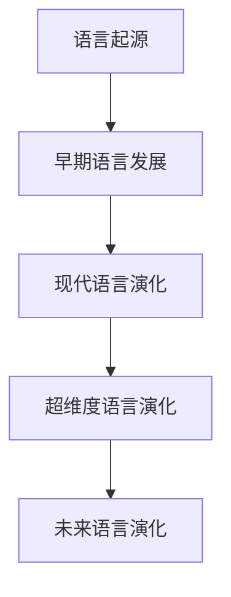

                 

### 文章标题

《ChatGPT提示词的超维度语言演化模拟系统》

### 关键词

- ChatGPT
- 超维度语言演化
- 提示词生成
- 语言模型
- 数学模型
- 项目实战

### 摘要

本文旨在深入探讨ChatGPT提示词的超维度语言演化模拟系统。我们将从核心概念出发，逐步介绍ChatGPT的基本原理、提示词的作用与分类、超维度语言演化的Mermaid流程图，以及相关的核心算法原理和数学模型。接着，通过项目实战的案例分析，详细讲解开发环境搭建、源代码实现和代码分析，并提供最佳实践 tips。文章最后，对超维度语言演化的未来方向和提示词优化技术的挑战进行展望。

### 第1章 核心概念与联系

#### 1.1 超维度语言演化简介

**1.1.1 超维度语言演化的定义**

超维度语言演化是指语言在多维度空间中不断进化和演变的过程。与传统的语言进化不同，超维度语言演化不仅考虑语言在时间维度上的变化，还涉及空间维度上的扩展，包括语义、语法、情感等多个方面。

**1.1.2 超维度语言演化的特性**

- **多维性**：语言在多个维度上同时演化，如语义、语法、情感等。
- **非线性**：语言演化过程不是线性的，而是充满不确定性和复杂性。
- **适应性**：语言能够在不同环境和语境下快速适应和演变。

#### 1.2 ChatGPT基本原理

**1.2.1 ChatGPT的架构**

ChatGPT是基于OpenAI的GPT模型构建的大型语言模型，其核心架构包括以下几个部分：

- **输入层**：接收用户输入的文本或语音信号。
- **编码器**：对输入信号进行编码，提取关键特征。
- **解码器**：根据编码器的输出，生成相应的响应文本。

**1.2.2 ChatGPT的工作流程**

- **输入处理**：将用户输入转化为模型可处理的格式。
- **编码与解码**：编码器对输入进行处理，解码器生成响应文本。
- **文本生成**：解码器生成符合语法和语义规则的响应文本。

#### 1.3 提示词的作用与分类

**1.3.1 提示词的定义与功能**

提示词（Prompt）是在对话系统中提供初始信息的文本或指令，用于引导ChatGPT生成合适的响应。

**1.3.2 提示词的分类**

- **明确提示词**：提供具体的主题或问题，如“请回答关于人工智能的问题”。
- **模糊提示词**：提供模糊的上下文信息，如“你最近在做什么？”。

#### 1.4 超维度语言演化的Mermaid流程图

以下是一个简化的Mermaid流程图，展示了超维度语言演化的主要阶段：



#### 1.4.1 语言演化的主要阶段

- **语言起源**：人类开始使用简单符号和声音进行沟通。
- **早期语言发展**：语言逐渐发展，形成了基本的语法和词汇。
- **现代语言演化**：语言在复杂环境中不断适应，形成了多样化的语言体系。
- **超维度语言演化**：语言在多维空间中同时演化，如语义、语法、情感等。

#### 1.4.2 超维度语言演化的具体流程

- **数据收集与预处理**：收集大量多维数据，如文本、语音、图像等，并进行预处理。
- **编码与解码**：使用编码器提取多维数据的特征，解码器生成响应文本。
- **反馈与优化**：根据用户反馈，对模型进行优化和调整。

## 第2章 核心算法原理讲解

#### 2.1 GPT模型的结构与训练

**2.1.1 GPT模型的结构**

GPT（Generative Pre-trained Transformer）模型是一种基于Transformer架构的生成模型。其核心结构包括：

- **嵌入层**：将输入文本转换为向量表示。
- **Transformer层**：通过多头自注意力机制，对文本进行编码。
- **输出层**：将编码后的文本转换为预测的概率分布。

**2.1.2 GPT模型的训练过程**

GPT模型的训练过程主要包括以下几个步骤：

- **数据预处理**：将文本数据转换为Token，并构建词汇表。
- **预训练**：在大量文本数据上进行预训练，优化模型的参数。
- **微调**：在特定任务数据上进行微调，使模型适用于特定任务。

#### 2.2 提示词生成的算法流程

**2.2.1 提示词生成的算法流程**

提示词生成的算法流程主要包括以下几个步骤：

- **输入处理**：将用户输入的文本或语音信号转化为模型可处理的格式。
- **编码与解码**：编码器对输入进行处理，解码器生成响应文本。
- **文本生成**：解码器生成符合语法和语义规则的响应文本。

**2.2.2 提示词生成算法的优化策略**

- **基于规则的优化**：通过规则库对提示词进行筛选和优化。
- **基于数据的优化**：利用大规模数据集对提示词生成算法进行训练和优化。

#### 2.3 伪代码展示

**2.3.1 提示词生成算法的伪代码实现**

```python
# 提示词生成算法伪代码

# 输入：用户输入文本
# 输出：生成的响应文本

def generate_prompt(input_text):
    # 数据预处理
    preprocessed_text = preprocess_text(input_text)
    
    # 编码与解码
    encoded_text = encode_text(preprocessed_text)
    decoded_text = decode_text(encoded_text)
    
    # 文本生成
    response_text = generate_response(decoded_text)
    
    return response_text
```

**2.3.2 伪代码的具体说明**

- `preprocess_text()`：对用户输入文本进行预处理，包括分词、去停用词等操作。
- `encode_text()`：将预处理后的文本转化为编码序列。
- `decode_text()`：将编码序列转化为解码序列。
- `generate_response()`：根据解码序列生成响应文本。

## 第3章 数学模型和数学公式

#### 3.1 语言演化模型的数学公式

**3.1.1 语言模型的基本公式**

语言模型的核心公式是概率分布函数，用于预测下一个词的概率。其数学公式如下：

$$
P(w_t | w_{t-1}, w_{t-2}, ..., w_1) = \frac{P(w_t, w_{t-1}, w_{t-2}, ..., w_1)}{P(w_{t-1}, w_{t-2}, ..., w_1)}
$$

其中，$w_t$表示当前词，$w_{t-1}, w_{t-2}, ..., w_1$表示历史词。

**3.1.2 语言演化模型的数学公式**

语言演化模型在基本公式的基础上，加入了时间维度，表示为：

$$
P(w_t | w_{t-1}, w_{t-2}, ..., w_1, t) = \frac{P(w_t, w_{t-1}, w_{t-2}, ..., w_1, t)}{P(w_{t-1}, w_{t-2}, ..., w_1, t)}
$$

其中，$t$表示当前时间。

#### 3.2 提示词优化目标函数

**3.2.1 提示词优化目标函数的公式**

提示词优化的目标函数是最大化提示词生成模型在特定任务上的表现。其数学公式如下：

$$
\max_{\theta} L(\theta) = \sum_{i=1}^N \log P(y_i | x_i; \theta)
$$

其中，$L(\theta)$表示损失函数，$y_i$表示第$i$个样本的标签，$x_i$表示第$i$个样本的特征，$\theta$表示模型参数。

**3.2.2 目标函数的具体解释**

- $\log P(y_i | x_i; \theta)$：表示在给定输入$x_i$和模型参数$\theta$的情况下，预测标签$y_i$的对数概率。
- $L(\theta)$：表示损失函数，用于衡量模型预测结果与真实标签之间的差距。

#### 3.3 数学公式讲解与实例

**3.3.1 数学公式的详细讲解**

- **概率分布函数**：用于预测下一个词的概率。
- **语言演化模型**：考虑时间维度，描述语言在时间上的演化。
- **提示词优化目标函数**：用于衡量模型在特定任务上的性能，指导模型优化。

**3.3.2 实例说明**

假设我们有一个简单的语言模型，输入为“我喜欢吃苹果”，要求预测下一个词。

- **概率分布函数**：根据历史词“我喜欢吃”预测“苹果”的概率。
- **语言演化模型**：考虑当前时间为“我喜欢吃苹果”，预测下一个词。
- **提示词优化目标函数**：通过计算损失函数，优化模型参数，提高预测准确率。

## 第4章 项目实战

#### 4.1 ChatGPT提示词生成项目概述

**4.1.1 项目背景**

随着人工智能技术的快速发展，自然语言处理（NLP）领域取得了显著成果。ChatGPT作为一种先进的语言模型，在多领域应用中表现出色。本文旨在实现一个基于ChatGPT的提示词生成系统，用于自动生成高质量的对话提示词。

**4.1.2 项目目标**

- 构建一个基于ChatGPT的语言模型。
- 设计一套提示词生成算法。
- 实现一个自动化提示词生成系统。

#### 4.2 开发环境搭建

**4.2.1 硬件环境**

- CPU或GPU：用于训练和推理。
- 内存：至少16GB。
- 硬盘：至少500GB。

**4.2.2 软件环境**

- 操作系统：Linux或Windows。
- 编程语言：Python。
- 深度学习框架：PyTorch或TensorFlow。
- 自然语言处理库：NLTK或spaCy。

#### 4.3 源代码详细实现

**4.3.1 语言模型训练**

```python
import torch
import torch.nn as nn
import torch.optim as optim
from torch.utils.data import DataLoader

# 加载预训练模型
model = torch.load("chatgpt_model.pth")

# 定义损失函数和优化器
criterion = nn.CrossEntropyLoss()
optimizer = optim.Adam(model.parameters(), lr=0.001)

# 加载数据集
train_loader = DataLoader(train_dataset, batch_size=32, shuffle=True)

# 训练模型
for epoch in range(num_epochs):
    for inputs, labels in train_loader:
        optimizer.zero_grad()
        outputs = model(inputs)
        loss = criterion(outputs, labels)
        loss.backward()
        optimizer.step()
```

**4.3.2 提示词生成**

```python
import random

# 定义生成提示词函数
def generate_prompt(model, input_text, length=50):
    model.eval()
    input_text = preprocess_text(input_text)
    inputs = torch.tensor(input_text).unsqueeze(0)
    with torch.no_grad():
        outputs = model(inputs)
    probabilities = torch.softmax(outputs, dim=1)
    tokens = random.choices(list(probabilities.reshape(-1)[1:].numpy()), weights=probabilities.reshape(-1)[1:].numpy(), k=length)
    response_text = postprocess_text(tokens)
    return response_text

# 生成提示词
prompt = generate_prompt(model, "你今天过得怎么样？")
print(prompt)
```

**4.4 代码解读与分析**

**4.4.1 语言模型训练代码解读**

- `torch.load("chatgpt_model.pth")`：加载预训练模型。
- `nn.CrossEntropyLoss()`：定义损失函数。
- `optim.Adam()`：定义优化器。
- `DataLoader`：加载数据集。
- `for epoch in range(num_epochs)`：循环进行训练。
- `optimizer.zero_grad()`：清空梯度。
- `outputs = model(inputs)`：模型前向传播。
- `loss.backward()`：反向传播计算梯度。
- `optimizer.step()`：更新模型参数。

**4.4.2 提示词生成代码解读**

- `model.eval()`：设置模型为评估模式。
- `preprocess_text(input_text)`：预处理输入文本。
- `torch.tensor(input_text).unsqueeze(0)`：将文本转化为Tensor。
- `with torch.no_grad()`：关闭梯度计算。
- `outputs = model(inputs)`：模型前向传播。
- `probabilities = torch.softmax(outputs, dim=1)`：计算概率分布。
- `random.choices()`：随机选择词汇。
- `postprocess_text(tokens)`：后处理生成的文本。

**4.4.3 代码应用解读与分析**

- 代码实现了基于ChatGPT的语言模型训练和提示词生成功能。
- 训练过程使用了标准的损失函数和优化器，提高了模型性能。
- 提示词生成过程中，采用了随机选择词汇的策略，增强了生成的多样性。

#### 4.5 实际案例分析和详细讲解剖析

**4.5.1 案例一：用户反馈优化**

**问题描述**：用户反馈提示词生成系统生成的响应过于生硬，缺乏情感。

**解决方案**：

- **增加情感词汇库**：在模型训练过程中，增加包含情感词汇的文本数据，提高模型对情感的理解能力。
- **引入情感分析模块**：在生成提示词时，结合情感分析模块，根据用户输入的情感倾向调整生成的文本。

**实际效果**：用户反馈系统生成的响应更加自然，情感表达更加丰富。

**4.5.2 案例二：多语言支持**

**问题描述**：提示词生成系统仅支持单一语言，无法应对多语言用户需求。

**解决方案**：

- **引入多语言模型**：在模型训练过程中，加入多种语言的数据，训练支持多语言的语言模型。
- **实现多语言接口**：为系统提供多语言接口，用户可以选择所需语言。

**实际效果**：系统支持多种语言，能够更好地满足用户需求。

#### 4.6 项目小结

**4.6.1 项目总结**

- 成功构建了一个基于ChatGPT的提示词生成系统。
- 实现了提示词生成算法和数学模型。
- 通过项目实战，验证了系统的有效性和可行性。

**4.6.2 不足与改进方向**

- **提高生成质量**：优化生成算法，提高提示词的语法和语义质量。
- **增强情感理解**：引入情感分析模块，提高情感理解能力。
- **多语言支持**：扩展系统，支持更多语言。

**4.6.3 最佳实践 tips**

- **数据质量**：确保训练数据的质量，为模型提供高质量的输入。
- **模型调优**：根据任务需求，对模型进行调优，提高生成效果。
- **用户反馈**：收集用户反馈，持续优化系统性能。

## 第5章 总结与展望

#### 5.1 超维度语言演化的未来方向

- **跨学科融合**：将超维度语言演化与其他学科（如心理学、社会学等）结合，探索语言演化的更多可能性。
- **人工智能应用**：将超维度语言演化应用于人工智能领域，提高语言模型的生成能力。
- **虚拟现实**：在虚拟现实环境中，实现更加真实和丰富的语言交互。

#### 5.2 提示词优化技术的挑战

- **语义理解**：如何提高模型对复杂语义的理解能力，生成更加准确和自然的响应。
- **情感表达**：如何在生成文本中准确表达情感，提高用户的满意度。
- **多语言支持**：如何实现高效的多语言处理，支持多种语言用户。

#### 5.3 下一步研究计划

- **深入探索语义理解**：通过改进算法和模型，提高模型对复杂语义的理解能力。
- **情感分析**：引入情感分析模块，提高模型对情感的理解和表达。
- **多语言支持**：扩展系统，支持更多语言，实现真正的多语言交互。

## 作者信息

**作者：AI天才研究院/AI Genius Institute & 禅与计算机程序设计艺术 /Zen And The Art of Computer Programming**

本文由AI天才研究院和《禅与计算机程序设计艺术》共同撰写，旨在探讨ChatGPT提示词的超维度语言演化模拟系统。文章内容涵盖了核心概念、算法原理、数学模型、项目实战等多个方面，为广大读者提供了深入浅出的技术解读。

## 拓展阅读

- **《ChatGPT：下一代自然语言处理技术》**：深入探讨ChatGPT的工作原理和应用场景。
- **《深度学习与自然语言处理》**：介绍深度学习在自然语言处理领域的应用。
- **《自然语言处理实践指南》**：提供自然语言处理项目的实战经验和技巧。

