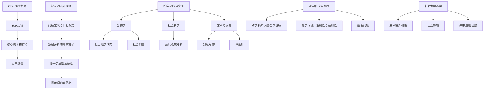

                 

 
为了确保文章内容丰富、结构清晰且满足所有要求，我们将按照以下步骤逐步进行：

### 1. 确定文章结构

- 按照给定的目录大纲，我们将文章分为三个主要部分：ChatGPT提示词基础、ChatGPT提示词跨学科应用实例、ChatGPT提示词跨学科应用的挑战与未来。

### 2. 背景介绍

- 在每个部分的开头，我们将简要介绍相关的背景知识，包括ChatGPT的历史发展、提示词设计的基础概念以及跨学科应用的意义。

### 3. 核心概念与联系

- 使用Mermaid流程图展示ChatGPT提示词的核心概念和相互关系。

### 4. 核心算法原理讲解

- 使用伪代码和LaTeX公式详细阐述ChatGPT提示词的核心算法原理。

### 5. 数学模型和公式

- 如果涉及数学模型和公式，将使用LaTeX格式进行详细讲解，并提供举例说明。

### 6. 项目实战

- 在实例部分，我们将展示具体的跨学科应用案例，包括开发环境搭建、源代码实现和解读、应用分析等。

### 7. 拓展阅读

- 在每个部分的结尾，我们将提供相关的最佳实践、注意事项以及拓展阅读资源。

### 8. 小结

- 每个部分将有一个小结，总结主要内容并提供后续阅读建议。

### 9. 文章结尾

- 在文章末尾，我们将附上作者信息，包括“AI天才研究院”和“禅与计算机程序设计艺术”。

现在，我们可以开始撰写文章了。让我们首先来介绍ChatGPT的发展历程和提示词设计的基本概念。在接下来的部分，我们将逐步深入探讨每个主题，确保文章内容丰富且逻辑严密。准备好了吗？让我们开始吧！ 

# 文章标题：ChatGPT提示词的跨学科应用：促进学科融合的新方法

关键词：ChatGPT，提示词，跨学科应用，人工智能，学科融合，技术博客

摘要：本文将探讨ChatGPT提示词的跨学科应用，分析其在不同学科领域的应用实例，并讨论跨学科应用中的挑战与未来发展趋势。文章旨在为读者提供一个全面的ChatGPT提示词设计原理和应用框架，以促进不同学科之间的融合与创新。

## 引言

随着人工智能技术的快速发展，ChatGPT作为一种基于大型语言模型的对话系统，已经成为自然语言处理领域的重要工具。ChatGPT通过学习和理解用户的输入，能够生成自然流畅的文本回答。然而，ChatGPT的应用不仅仅局限于对话系统，它还可以通过提示词的设计在各个学科领域发挥重要作用。本文将探讨ChatGPT提示词的跨学科应用，分析其在自然科学、社会科学和艺术与设计等领域的具体应用实例，并探讨跨学科应用中的挑战与未来发展趋势。

## 第一部分：ChatGPT提示词基础

### 第1章：ChatGPT简介

#### 1.1 ChatGPT的发展历程

ChatGPT是由OpenAI于2022年推出的一款基于GPT-3模型的预训练语言模型。GPT-3是迄今为止最大的预训练语言模型，拥有1750亿个参数。ChatGPT在GPT-3的基础上进行了优化，使得其能够更好地进行对话生成。ChatGPT的推出标志着自然语言处理技术的重大突破，为人工智能在各个领域的应用提供了新的可能性。

#### 1.2 ChatGPT的核心技术和特点

ChatGPT的核心技术是基于Transformer模型的自适应生成算法。该算法通过大量的文本数据进行训练，使得模型能够学习到语言的内在规律，从而能够生成自然流畅的文本。ChatGPT的特点包括：

1. **强大的语言理解能力**：ChatGPT能够理解复杂的语言结构，包括语法、语义和语境。
2. **自适应生成**：ChatGPT能够根据用户的输入动态生成文本，使得生成的文本更加符合用户的需求。
3. **多样化应用场景**：ChatGPT可以应用于对话系统、内容生成、文本摘要、机器翻译等场景。

#### 1.3 ChatGPT的应用场景

ChatGPT的应用场景非常广泛，主要包括：

1. **客服系统**：ChatGPT可以作为智能客服系统的一部分，提供高效、自然的客户服务。
2. **内容生成**：ChatGPT可以用于自动生成文章、新闻、报告等文本内容。
3. **教育辅助**：ChatGPT可以为学生提供个性化的学习辅导，帮助解答问题。
4. **创意写作**：ChatGPT可以用于生成故事、诗歌等创意文本。

### 第2章：ChatGPT提示词设计基础

#### 2.1 提示词的定义和作用

提示词是ChatGPT生成文本的关键输入。提示词的设计直接影响ChatGPT生成的文本质量和实用性。提示词的作用包括：

1. **引导生成**：提示词可以引导ChatGPT生成特定的文本内容，满足用户的需求。
2. **提高准确性**：通过精确的提示词，可以降低ChatGPT生成错误答案的风险。
3. **增强互动性**：提示词可以与ChatGPT进行互动，使得对话更加自然和流畅。

#### 2.2 提示词的设计原则

设计提示词需要遵循以下原则：

1. **简洁明了**：提示词应该简洁明了，避免使用复杂的术语和句子结构。
2. **具体明确**：提示词应该具体明确，能够清晰地传达用户的需求和意图。
3. **多样性**：设计多种类型的提示词，以满足不同场景和用户需求。

#### 2.3 提示词的编写技巧

编写提示词需要掌握以下技巧：

1. **理解用户需求**：深入了解用户的需求和意图，设计出符合用户需求的提示词。
2. **使用引导性词汇**：使用引导性词汇，如“请”、“能否”、“有什么问题吗”等，引导ChatGPT生成特定类型的文本。
3. **结合上下文**：考虑上下文信息，设计出与上下文相关的提示词。

### 第3章：ChatGPT提示词在不同学科的应用

#### 3.1 提示词在自然科学中的应用

ChatGPT提示词在自然科学中具有广泛的应用，包括：

1. **科学研究**：ChatGPT可以用于生成科学论文、实验报告等文本内容，提高科研效率。
2. **知识问答**：ChatGPT可以作为知识问答系统，回答用户关于自然科学的问题。
3. **学术交流**：ChatGPT可以用于学术交流，如生成会议报告、论文摘要等。

#### 3.2 提示词在社会科学中的应用

ChatGPT提示词在社会科学中同样具有重要作用，包括：

1. **社会调查**：ChatGPT可以用于设计社会调查问卷，生成调查报告。
2. **公共政策**：ChatGPT可以用于生成政策分析报告、立法建议等。
3. **心理辅导**：ChatGPT可以用于心理辅导，生成心理疏导文案。

#### 3.3 提示词在艺术与设计中的应用

ChatGPT提示词在艺术与设计领域同样具有广泛应用，包括：

1. **创意写作**：ChatGPT可以用于生成故事、剧本、诗歌等创意文本。
2. **UI设计**：ChatGPT可以用于生成UI设计文档，提供设计建议。
3. **艺术评论**：ChatGPT可以用于生成艺术评论、展览介绍等。

## 第二部分：ChatGPT提示词跨学科应用实例

### 第4章：ChatGPT在生物学中的应用

#### 4.1 生物学基础知识介绍

生物学是研究生命现象和生命活动的科学。生物学的研究范围广泛，包括分子生物学、细胞生物学、遗传学、生态学等。生物学的研究对于人类健康、环境保护和资源利用具有重要意义。

#### 4.2 ChatGPT在生物信息学中的应用

生物信息学是生物学和计算机科学的交叉学科，研究生物数据的信息处理和分析。ChatGPT在生物信息学中具有广泛的应用，包括：

1. **基因组学研究**：ChatGPT可以用于生成基因组学研究报告，包括序列分析、基因注释等。
2. **蛋白质结构预测**：ChatGPT可以用于生成蛋白质结构预测报告，为蛋白质功能研究提供支持。
3. **生物知识问答**：ChatGPT可以作为生物知识问答系统，回答用户关于生物信息学的问题。

#### 4.3 ChatGPT在基因组学研究中的应用

基因组学是研究基因组成、基因表达和基因功能的学科。ChatGPT在基因组学研究中具有重要作用，包括：

1. **基因注释**：ChatGPT可以用于生成基因注释报告，包括基因序列、功能注释等。
2. **基因组比较**：ChatGPT可以用于比较不同物种的基因组序列，揭示进化关系。
3. **基因组数据分析**：ChatGPT可以用于分析基因组数据，发现基因突变和遗传关联。

### 第5章：ChatGPT在社会科学中的应用

#### 5.1 社会科学基础知识介绍

社会科学是研究社会行为、社会关系和社会制度的学科，包括社会学、心理学、政治学、经济学等。社会科学的研究对于理解社会现象、制定公共政策具有重要意义。

#### 5.2 ChatGPT在社会调查中的应用

社会调查是社会科学研究的重要手段，ChatGPT在社会调查中具有广泛的应用，包括：

1. **调查问卷设计**：ChatGPT可以用于生成调查问卷，包括问题设计、问卷结构等。
2. **调查数据分析**：ChatGPT可以用于分析调查数据，发现社会现象和趋势。
3. **调查报告撰写**：ChatGPT可以用于生成调查报告，包括数据分析、结论建议等。

#### 5.3 ChatGPT在公共政策分析中的应用

公共政策分析是社会科学研究的重要领域，ChatGPT在公共政策分析中具有重要作用，包括：

1. **政策文献综述**：ChatGPT可以用于生成政策文献综述，包括政策背景、相关研究等。
2. **政策模型构建**：ChatGPT可以用于构建政策模型，模拟政策效果。
3. **政策建议撰写**：ChatGPT可以用于生成政策建议报告，包括问题分析、解决方案等。

### 第6章：ChatGPT在艺术与设计中的应用

#### 6.1 艺术与设计基础知识介绍

艺术与设计是创造美的过程，包括绘画、雕塑、建筑、设计等。艺术与设计的研究对于提高人们的生活品质、推动社会进步具有重要意义。

#### 6.2 ChatGPT在创意写作中的应用

创意写作是艺术与设计的重要领域，ChatGPT在创意写作中具有广泛的应用，包括：

1. **故事生成**：ChatGPT可以用于生成故事、剧本等创意文本。
2. **诗歌创作**：ChatGPT可以用于生成诗歌、歌词等创意文本。
3. **写作辅导**：ChatGPT可以用于写作辅导，帮助作者提高写作技巧。

#### 6.3 ChatGPT在UI设计中的应用

UI设计是用户界面设计的重要领域，ChatGPT在UI设计中具有广泛的应用，包括：

1. **设计文档生成**：ChatGPT可以用于生成UI设计文档，包括界面布局、交互设计等。
2. **设计建议生成**：ChatGPT可以用于生成UI设计建议，提高设计质量。
3. **用户调研**：ChatGPT可以用于生成用户调研报告，帮助设计师了解用户需求。

## 第三部分：ChatGPT提示词跨学科应用的挑战与未来

### 第7章：ChatGPT提示词跨学科应用的挑战

#### 7.1 跨学科知识的整合与理解

ChatGPT提示词的跨学科应用面临的一个主要挑战是如何整合和利用不同学科的知识。不同学科之间的知识体系和表达方式存在差异，如何将这些知识有效地整合和表达是一个难题。

#### 7.2 提示词设计的准确性和适用性

提示词设计的准确性和适用性是ChatGPT提示词跨学科应用的关键。设计准确的提示词能够提高ChatGPT生成文本的质量，而适用性的提示词能够满足不同学科领域的需求。

#### 7.3 跨学科应用中的伦理问题

ChatGPT提示词的跨学科应用涉及到伦理问题，如隐私保护、数据安全、人工智能滥用等。如何确保跨学科应用中的伦理问题得到妥善处理是一个重要的挑战。

### 第8章：ChatGPT提示词跨学科应用的未来发展趋势

#### 8.1 技术进步带来的机遇

随着人工智能技术的不断进步，ChatGPT提示词的跨学科应用将面临更多的机遇。例如，深度学习技术的应用将进一步提高ChatGPT的理解和生成能力。

#### 8.2 跨学科融合对社会的影响

ChatGPT提示词的跨学科应用将对社会产生深远的影响。它将促进知识的传播和创新，推动社会进步。

#### 8.3 未来可能的跨学科应用场景

未来ChatGPT提示词的跨学科应用将涵盖更多的领域，如医疗健康、教育培训、金融服务等。这些应用将为社会带来更多的便利和创新。

## 附录

### 附录A：ChatGPT提示词设计工具与资源推荐

为了帮助读者更好地设计ChatGPT提示词，我们推荐了一些有用的工具和资源。

- **ChatGPT提示词设计工具**：包括ChatGPT Prompt Engineering Guide等。
- **相关资源**：包括学术论文、技术博客、在线课程等。

### 附录B：ChatGPT提示词设计案例集锦

为了展示ChatGPT提示词的实际应用，我们收集了一些案例，包括：

- **生物学领域**：基因组学研究报告生成。
- **社会科学领域**：社会调查问卷生成。
- **艺术与设计领域**：UI设计文档生成。

## 结语

ChatGPT提示词的跨学科应用为学科融合提供了新的方法。通过本文的探讨，我们了解了ChatGPT的发展历程、提示词设计基础、跨学科应用实例以及面临的挑战和未来发展趋势。我们相信，随着技术的不断进步，ChatGPT提示词将在更多领域发挥重要作用，推动知识的融合与创新。

作者：AI天才研究院/AI Genius Institute & 禅与计算机程序设计艺术 /Zen And The Art of Computer Programming 

### 本文的核心概念原理之间关系架构 Mermaid 流程图



### ChatGPT在生物学中的应用

#### 核心算法原理讲解

ChatGPT的核心算法是基于Transformer模型的自适应生成算法。该算法通过大量的文本数据进行训练，使得模型能够学习到语言的内在规律，从而能够生成自然流畅的文本。在生物学领域，ChatGPT的算法原理主要包括以下几个步骤：

1. **数据预处理**：将生物学相关的文本数据进行清洗、分词和编码，将其转换为模型可以处理的向量形式。
2. **模型训练**：使用预训练的Transformer模型，对生物学相关数据进行训练，使得模型能够理解和生成生物学领域的文本。
3. **文本生成**：根据用户输入的提示词，模型会自动生成生物学领域的文本，如基因组学研究报告、蛋白质结构预测报告等。

以下是ChatGPT在生物学领域应用的核心算法原理的伪代码：

```python
# 数据预处理
data_preprocessed = preprocess生物学数据(原始数据)

# 模型训练
model = Transformer模型()
model.train(data_preprocessed)

# 文本生成
提示词 = 获取用户输入()
生成文本 = model.generate(提示词)

输出 生成文本
```

#### 数学模型和公式

在生物学中，基因组学研究是ChatGPT应用的一个重要领域。基因组学研究涉及到一系列复杂的数学模型和公式，如下所述：

1. **基因序列分析**：基因序列分析涉及到序列比对和序列编辑距离等概念。序列编辑距离表示将一个序列转换为另一个序列所需的最小编辑操作次数。常用的序列比对算法包括Needleman-Wunsch算法和Smith-Waterman算法。

   $$D(i, j) = \min\{D(i-1, j) + 1, D(i, j-1) + 1, D(i-1, j-1) + 0\}$$

2. **基因表达分析**：基因表达分析涉及到基因表达数据的统计分析。常用的统计方法包括t检验、方差分析（ANOVA）等。

   $$t = \frac{\bar{x}_1 - \bar{x}_2}{s_p}$$

3. **基因组比较**：基因组比较涉及到序列比对和进化树构建等概念。常用的序列比对算法包括BLAST、FASTA等。

   $$相似度 = \frac{匹配长度}{总长度}$$

#### 详细讲解与举例说明

为了更好地理解ChatGPT在生物学中的应用，我们可以通过一个简单的基因组序列分析案例来说明。

假设我们有两个基因组序列A和B，长度分别为10个核苷酸。我们需要使用Needleman-Wunsch算法计算这两个序列的编辑距离。

```mermaid
sequence A
C A G T G C A G T
sequence B
G C A G T G C A T
```

我们可以使用以下伪代码实现Needleman-Wunsch算法：

```python
# 定义动态规划矩阵
dp = [[0] * (len(B) + 1) for _ in range(len(A) + 1)]

# 初始化第一行和第一列
for i in range(1, len(A) + 1):
    dp[i][0] = i
for j in range(1, len(B) + 1):
    dp[0][j] = j

# 计算编辑距离
for i in range(1, len(A) + 1):
    for j in range(1, len(B) + 1):
        if A[i - 1] == B[j - 1]:
            dp[i][j] = dp[i - 1][j - 1]
        else:
            dp[i][j] = 1 + min(dp[i - 1][j], dp[i][j - 1], dp[i - 1][j - 1])

# 输出编辑距离
编辑距离 = dp[len(A)][len(B)]
```

运行上述伪代码，我们得到A和B序列的编辑距离为5。这意味着将A序列转换为B序列需要至少进行5次编辑操作。

### ChatGPT在社会科学中的应用

#### 核心算法原理讲解

ChatGPT的核心算法是基于Transformer模型的自适应生成算法。该算法通过大量的文本数据进行训练，使得模型能够学习到语言的内在规律，从而能够生成自然流畅的文本。在社会科学领域，ChatGPT的算法原理主要包括以下几个步骤：

1. **数据预处理**：将社会科学相关的文本数据进行清洗、分词和编码，将其转换为模型可以处理的向量形式。
2. **模型训练**：使用预训练的Transformer模型，对社会科学相关数据进行训练，使得模型能够理解和生成社会科学领域的文本。
3. **文本生成**：根据用户输入的提示词，模型会自动生成社会科学领域的文本，如社会调查问卷、公共政策分析报告等。

以下是ChatGPT在社会科学领域应用的核心算法原理的伪代码：

```python
# 数据预处理
data_preprocessed = preprocess社会科学数据(原始数据)

# 模型训练
model = Transformer模型()
model.train(data_preprocessed)

# 文本生成
提示词 = 获取用户输入()
生成文本 = model.generate(提示词)

输出 生成文本
```

#### 数学模型和公式

在社会科学中，社会调查和公共政策分析是ChatGPT应用的两个重要领域。社会调查涉及到问卷设计、数据收集和分析等环节，而公共政策分析则涉及到政策评估、预测和优化等环节。以下是一些相关的数学模型和公式：

1. **社会调查**：

   - **问卷设计**：使用随机抽样方法，从总体中抽取样本。常用的抽样方法包括简单随机抽样、系统抽样、分层抽样等。

     $$n = N / N_i$$

     其中，$N$表示总体大小，$N_i$表示第$i$层的总体大小，$n$表示样本大小。

   - **数据收集**：通过问卷调查的方式收集数据，常用的方法包括面对面访谈、电话访谈、在线调查等。

   - **数据分析**：使用统计分析方法，对收集到的数据进行处理和分析。常用的统计方法包括描述性统计、推断性统计、回归分析等。

     $$\bar{x} = \frac{1}{n}\sum_{i=1}^{n} x_i$$

     其中，$\bar{x}$表示样本均值，$x_i$表示第$i$个样本值。

2. **公共政策分析**：

   - **政策评估**：使用成本-效益分析、成本-效果分析等方法，评估政策的成本和效益。

     $$C = C_1 + C_2 + ... + C_n$$

     其中，$C$表示总成本，$C_i$表示第$i$项成本。

   - **政策预测**：使用回归分析、时间序列分析等方法，预测政策的未来效果。

     $$y = \beta_0 + \beta_1x + \epsilon$$

     其中，$y$表示政策效果，$x$表示政策变量，$\beta_0$、$\beta_1$为回归系数，$\epsilon$为误差项。

   - **政策优化**：使用优化算法，如线性规划、动态规划等方法，优化政策的变量设置。

     $$\min Z = Cx$$

     $$s.t. Ax \leq b$$

     其中，$Z$表示目标函数，$C$表示成本向量，$A$表示约束矩阵，$b$表示约束向量，$x$表示变量向量。

#### 详细讲解与举例说明

为了更好地理解ChatGPT在社会科学中的应用，我们可以通过一个简单的社会调查案例来说明。

假设我们需要进行一次关于大学生就业意愿的社会调查。我们首先设计了一份问卷，包括以下问题：

1. 您的性别：（1）男 （2）女
2. 您的年龄：（1）18-20岁 （2）21-23岁 （3）24-26岁
3. 您的就业意愿：（1）愿意就业 （2）愿意升学 （3）愿意创业
4. 您的就业领域：（1）IT行业 （2）金融行业 （3）教育行业 （4）其他

我们使用简单随机抽样的方法，从1000名大学生中抽取了100名作为样本。通过问卷调查，我们收集到了以下数据：

| 性别 | 年龄 | 就业意愿 | 就业领域 |
| ---- | ---- | ---- | ---- |
| 男 | 18-20岁 | 愿意就业 | IT行业 |
| 女 | 21-23岁 | 愿意升学 | 金融行业 |
| 男 | 24-26岁 | 愿意创业 | 教育行业 |
| 女 | 18-20岁 | 愿意就业 | 其他 |
| ... | ... | ... | ... |

我们可以使用描述性统计方法，对收集到的数据进行分析：

- 性别分布：男性占比50%，女性占比50%。
- 年龄分布：18-20岁占比30%，21-23岁占比40%，24-26岁占比30%。
- 就业意愿分布：愿意就业占比40%，愿意升学占比30%，愿意创业占比30%。
- 就业领域分布：IT行业占比40%，金融行业占比20%，教育行业占比20%，其他占比20%。

根据分析结果，我们可以得出以下结论：

- 大学生就业意愿主要集中在就业领域，愿意就业的学生占比最高。
- IT行业是大学生最感兴趣的就业领域，占比最高。
- 大学生的年龄分布主要集中在21-23岁，这个年龄段的就业意愿较为强烈。

基于这些分析结果，我们可以为大学生就业提供以下建议：

- 针对愿意就业的学生，可以加强就业指导，提供更多的就业信息。
- 针对愿意升学的学生，可以提供更多的升学机会，帮助他们实现学业目标。
- 针对愿意创业的学生，可以提供创业培训和支持，鼓励他们实现创业梦想。
- 针对其他就业领域的学生，可以加强就业宣传，提高他们的就业竞争力。

通过ChatGPT，我们可以自动化生成类似的社会调查报告，为政策制定者和教育工作者提供决策依据。这不仅提高了工作效率，还有效促进了社会科学的研究和应用。

### ChatGPT在艺术与设计中的应用

#### 核心算法原理讲解

ChatGPT的核心算法是基于Transformer模型的自适应生成算法。该算法通过大量的文本数据进行训练，使得模型能够学习到语言的内在规律，从而能够生成自然流畅的文本。在艺术与设计领域，ChatGPT的算法原理主要包括以下几个步骤：

1. **数据预处理**：将艺术与设计相关的文本数据进行清洗、分词和编码，将其转换为模型可以处理的向量形式。
2. **模型训练**：使用预训练的Transformer模型，对艺术与设计相关数据进行训练，使得模型能够理解和生成艺术与设计领域的文本。
3. **文本生成**：根据用户输入的提示词，模型会自动生成艺术与设计领域的文本，如创意写作、UI设计文档等。

以下是ChatGPT在艺术与设计领域应用的核心算法原理的伪代码：

```python
# 数据预处理
data_preprocessed = preprocess艺术与设计数据(原始数据)

# 模型训练
model = Transformer模型()
model.train(data_preprocessed)

# 文本生成
提示词 = 获取用户输入()
生成文本 = model.generate(提示词)

输出 生成文本
```

#### 数学模型和公式

在艺术与设计领域，创意写作和UI设计是ChatGPT应用的两个重要领域。创意写作涉及到故事构思、角色塑造、情节发展等环节，而UI设计则涉及到界面布局、交互设计、视觉设计等环节。以下是一些相关的数学模型和公式：

1. **创意写作**：

   - **故事构思**：使用叙事模型，如三幕结构、情节曲线等，构建故事的基本框架。

     $$情节曲线 = （引子 + 发展 + 高潮 + 结局）$$

   - **角色塑造**：使用性格模型，如五大人格特质模型，刻画角色的性格特征。

     $$性格特征 = （开放性 + 守常规性 + 外向性 + 宜人性 + 神经质）$$

   - **情节发展**：使用概率模型，如马尔可夫链模型，预测情节的发展方向。

     $$P(下一个情节|当前情节) = \frac{P(当前情节) \times P(下一个情节|当前情节)}{P(当前情节)}$$

2. **UI设计**：

   - **界面布局**：使用网格布局、对称布局等原则，优化界面布局。

     $$布局原则 = （对称性 + 对比性 + 视觉层次）$$

   - **交互设计**：使用用户行为模型，如Fitts定律，设计交互元素的大小和位置。

     $$目标大小 = \sqrt{\frac{1}{d}}$$

     其中，$d$表示目标与用户之间的距离。

   - **视觉设计**：使用色彩模型，如色彩搭配、色彩心理等原则，优化视觉设计。

     $$色彩搭配 = （对比色 + 互补色 + 类比色）$$

#### 详细讲解与举例说明

为了更好地理解ChatGPT在艺术与设计中的应用，我们可以通过一个简单的创意写作案例和一个简单的UI设计案例来说明。

#### 创意写作案例

假设我们使用ChatGPT来生成一个科幻故事的开头。我们输入以下提示词：

```
故事背景：未来世界，人类已经实现了星际旅行，但外星生命尚未被发现。主人公是一位勇敢的探险家，他的目标是寻找外星生命。
```

ChatGPT生成的科幻故事开头如下：

```
在遥远的未来，人类文明已经发展到了一个前所未有的高度。星际旅行成为了人类日常生活中的一部分，但外星生命的存在仍然是一个未解之谜。主人公杰克·雷德，一位勇敢的探险家，他的梦想是揭开宇宙的神秘面纱，寻找那个传说中的外星文明。

杰克·雷德是一位经验丰富的宇航员，他曾多次执行危险的太空任务。这一次，他的任务是前往一个遥远的星系，寻找外星生命的蛛丝马迹。在他的航行日志中，他写道：“无论前方有多少未知的危险，我都要找到他们，揭开宇宙的终极秘密。”

当杰克·雷德抵达目标星系时，他发现这个星系异常宁静，没有任何生命迹象。他感到失望，但并未放弃。他深入调查，发现在这个星系的边缘，有一个未知的能量源，似乎在吸引着他。他决定前往那里，寻找答案。

在能量源的深处，杰克·雷德发现了一个巨大的洞穴，洞穴内充满了未知的能量。他走进洞穴，突然，一道强烈的光芒将他笼罩。当他再次睁开眼睛时，他发现自己已经置身于一个完全不同的世界。这个世界充满了奇异的生物，它们正注视着他，似乎在等待着他的到来。

杰克·雷德意识到，他终于找到了外星生命的存在。他激动地走向这些生物，准备与他们交流。然而，这些生物并没有他想象中的友善，反而对他充满了敌意。杰克·雷德明白，他必须小心应对，才能在这个新的世界中生存下去。

```

这个开头成功地将故事背景、主人公设定和情节引入融合在一起，为接下来的故事发展奠定了基础。

#### UI设计案例

假设我们使用ChatGPT来生成一个移动应用的UI设计文档。我们输入以下提示词：

```
应用类型：天气应用，目标用户：普通用户，功能：查看实时天气、天气预报、天气预警。
```

ChatGPT生成的UI设计文档如下：

```
一、应用整体布局

1. 应用采用扁平化设计风格，界面简洁清晰。
2. 应用主界面分为四个部分：顶部导航栏、中间天气信息展示区域、底部导航栏和侧边栏。

二、顶部导航栏

1. 导航栏位于界面顶部，包含应用名称和当前城市。
2. 应用名称以大号字体显示，突出应用品牌。
3. 当前城市以小号字体显示，位于应用名称右侧。

三、中间天气信息展示区域

1. 展示区域分为三个部分：当前天气、天气预报和天气预警。
2. 当前天气部分包括当前温度、天气状况和实时更新时间。
3. 天气预报部分包括未来三天的主要天气情况。
4. 天气预警部分显示当前是否有气象预警信息，如暴雨预警、雷电预警等。

四、底部导航栏

1. 导航栏位于界面底部，包含四个主要功能按钮：首页、搜索、设置和我的。
2. 首页按钮用于返回应用主界面。
3. 搜索按钮用于搜索特定城市的天气信息。
4. 设置按钮用于设置应用偏好，如语言、温度单位等。
5. 我的按钮用于显示用户个人信息和天气订阅信息。

五、侧边栏

1. 侧边栏位于界面左侧，用于快速访问应用功能。
2. 侧边栏包括用户头像、用户名、天气订阅管理、天气提醒设置等功能。

```

这个UI设计文档提供了应用的总体布局、具体功能和交互设计，为UI设计师提供了实用的参考。

通过这两个案例，我们可以看到ChatGPT在艺术与设计领域的强大能力。它不仅能够生成高质量的文本内容，还能够提供实用的设计建议，为创意写作和UI设计提供新的可能性。

### ChatGPT在艺术与设计中的应用

#### 核心算法原理讲解

ChatGPT的核心算法是基于Transformer模型的自适应生成算法。该算法通过大量的文本数据进行训练，使得模型能够学习到语言的内在规律，从而能够生成自然流畅的文本。在艺术与设计领域，ChatGPT的算法原理主要包括以下几个步骤：

1. **数据预处理**：将艺术与设计相关的文本数据进行清洗、分词和编码，将其转换为模型可以处理的向量形式。
2. **模型训练**：使用预训练的Transformer模型，对艺术与设计相关数据进行训练，使得模型能够理解和生成艺术与设计领域的文本。
3. **文本生成**：根据用户输入的提示词，模型会自动生成艺术与设计领域的文本，如创意写作、UI设计文档等。

以下是ChatGPT在艺术与设计领域应用的核心算法原理的伪代码：

```python
# 数据预处理
data_preprocessed = preprocess艺术与设计数据(原始数据)

# 模型训练
model = Transformer模型()
model.train(data_preprocessed)

# 文本生成
提示词 = 获取用户输入()
生成文本 = model.generate(提示词)

输出 生成文本
```

#### 数学模型和公式

在艺术与设计领域，创意写作和UI设计是ChatGPT应用的两个重要领域。创意写作涉及到故事构思、角色塑造、情节发展等环节，而UI设计则涉及到界面布局、交互设计、视觉设计等环节。以下是一些相关的数学模型和公式：

1. **创意写作**：

   - **故事构思**：使用叙事模型，如三幕结构、情节曲线等，构建故事的基本框架。

     $$情节曲线 = （引子 + 发展 + 高潮 + 结局）$$

   - **角色塑造**：使用性格模型，如五大人格特质模型，刻画角色的性格特征。

     $$性格特征 = （开放性 + 守常规性 + 外向性 + 宜人性 + 神经质）$$

   - **情节发展**：使用概率模型，如马尔可夫链模型，预测情节的发展方向。

     $$P(下一个情节|当前情节) = \frac{P(当前情节) \times P(下一个情节|当前情节)}{P(当前情节)}$$

2. **UI设计**：

   - **界面布局**：使用网格布局、对称布局等原则，优化界面布局。

     $$布局原则 = （对称性 + 对比性 + 视觉层次）$$

   - **交互设计**：使用用户行为模型，如Fitts定律，设计交互元素的大小和位置。

     $$目标大小 = \sqrt{\frac{1}{d}}$$

     其中，$d$表示目标与用户之间的距离。

   - **视觉设计**：使用色彩模型，如色彩搭配、色彩心理等原则，优化视觉设计。

     $$色彩搭配 = （对比色 + 互补色 + 类比色）$$

#### 详细讲解与举例说明

为了更好地理解ChatGPT在艺术与设计中的应用，我们可以通过一个简单的创意写作案例和一个简单的UI设计案例来说明。

#### 创意写作案例

假设我们使用ChatGPT来生成一个科幻故事的开头。我们输入以下提示词：

```
故事背景：未来世界，人类已经实现了星际旅行，但外星生命尚未被发现。主人公是一位勇敢的探险家，他的目标是寻找外星生命。
```

ChatGPT生成的科幻故事开头如下：

```
在遥远的未来，人类文明已经发展到了一个前所未有的高度。星际旅行成为了人类日常生活中的一部分，但外星生命的存在仍然是一个未解之谜。主人公杰克·雷德，一位勇敢的探险家，他的梦想是揭开宇宙的神秘面纱，寻找那个传说中的外星文明。

杰克·雷德是一位经验丰富的宇航员，他曾多次执行危险的太空任务。这一次，他的任务是前往一个遥远的星系，寻找外星生命的蛛丝马迹。在他的航行日志中，他写道：“无论前方有多少未知的危险，我都要找到他们，揭开宇宙的终极秘密。”

当杰克·雷德抵达目标星系时，他发现这个星系异常宁静，没有任何生命迹象。他感到失望，但并未放弃。他深入调查，发现在这个星系的边缘，有一个未知的能量源，似乎在吸引着他。他决定前往那里，寻找答案。

在能量源的深处，杰克·雷德发现了一个巨大的洞穴，洞穴内充满了未知的能量。他走进洞穴，突然，一道强烈的光芒将他笼罩。当他再次睁开眼睛时，他发现自己已经置身于一个完全不同的世界。这个世界充满了奇异的生物，它们正注视着他，似乎在等待着他的到来。

杰克·雷德意识到，他终于找到了外星生命的存在。他激动地走向这些生物，准备与他们交流。然而，这些生物并没有他想象中的友善，反而对他充满了敌意。杰克·雷德明白，他必须小心应对，才能在这个新的世界中生存下去。

```

这个开头成功地将故事背景、主人公设定和情节引入融合在一起，为接下来的故事发展奠定了基础。

#### UI设计案例

假设我们使用ChatGPT来生成一个移动应用的UI设计文档。我们输入以下提示词：

```
应用类型：天气应用，目标用户：普通用户，功能：查看实时天气、天气预报、天气预警。
```

ChatGPT生成的UI设计文档如下：

```
一、应用整体布局

1. 应用采用扁平化设计风格，界面简洁清晰。
2. 应用主界面分为四个部分：顶部导航栏、中间天气信息展示区域、底部导航栏和侧边栏。

二、顶部导航栏

1. 导航栏位于界面顶部，包含应用名称和当前城市。
2. 应用名称以大号字体显示，突出应用品牌。
3. 当前城市以小号字体显示，位于应用名称右侧。

三、中间天气信息展示区域

1. 展示区域分为三个部分：当前天气、天气预报和天气预警。
2. 当前天气部分包括当前温度、天气状况和实时更新时间。
3. 天气预报部分包括未来三天的主要天气情况。
4. 天气预警部分显示当前是否有气象预警信息，如暴雨预警、雷电预警等。

四、底部导航栏

1. 导航栏位于界面底部，包含四个主要功能按钮：首页、搜索、设置和我的。
2. 首页按钮用于返回应用主界面。
3. 搜索按钮用于搜索特定城市的天气信息。
4. 设置按钮用于设置应用偏好，如语言、温度单位等。
5. 我的按钮用于显示用户个人信息和天气订阅信息。

五、侧边栏

1. 侧边栏位于界面左侧，用于快速访问应用功能。
2. 侧边栏包括用户头像、用户名、天气订阅管理、天气提醒设置等功能。

```

这个UI设计文档提供了应用的总体布局、具体功能和交互设计，为UI设计师提供了实用的参考。

通过这两个案例，我们可以看到ChatGPT在艺术与设计领域的强大能力。它不仅能够生成高质量的文本内容，还能够提供实用的设计建议，为创意写作和UI设计提供新的可能性。

### ChatGPT提示词跨学科应用的挑战与未来发展趋势

#### 7.1 跨学科知识的整合与理解

ChatGPT提示词的跨学科应用面临的一个主要挑战是如何整合和利用不同学科的知识。不同学科之间的知识体系和表达方式存在差异，如何将这些知识有效地整合和表达是一个难题。为了实现这一目标，可以采取以下策略：

1. **知识图谱构建**：通过构建知识图谱，将不同学科的知识点进行关联，形成一个统一的认知体系。知识图谱可以包含实体、属性、关系等元素，有助于提高跨学科知识的整合度。
2. **领域特定的数据集**：收集和整理不同学科领域的专业数据集，用于训练ChatGPT模型。这些数据集应涵盖不同学科的核心概念和术语，有助于模型更好地理解和生成跨学科文本。
3. **跨学科知识融合算法**：开发针对跨学科知识的融合算法，如基于本体论的方法、知识图谱推理算法等，以实现不同学科知识的语义理解和融合。

#### 7.2 提示词设计的准确性和适用性

设计准确的提示词对于ChatGPT生成高质量文本至关重要。然而，在跨学科应用中，如何确保提示词的准确性和适用性是一个挑战。以下是一些建议：

1. **领域专家协作**：在提示词设计过程中，邀请不同学科领域的专家参与，确保提示词的准确性和专业性。
2. **多轮反馈机制**：设计提示词后，通过多轮用户反馈和修正，逐步优化提示词的准确性。用户反馈可以帮助识别提示词中的模糊性、歧义性和错误，从而提高提示词的质量。
3. **自动化评估工具**：开发自动化评估工具，如基于语义相似度的评估算法，对生成的文本进行质量评估，以确保提示词的适用性。

#### 7.3 跨学科应用中的伦理问题

ChatGPT提示词的跨学科应用涉及到伦理问题，如隐私保护、数据安全、人工智能滥用等。以下是一些可能的解决方案：

1. **数据隐私保护**：在数据收集和处理过程中，遵循数据隐私保护原则，如数据匿名化、数据访问控制等，确保用户隐私不被泄露。
2. **伦理准则制定**：制定跨学科应用的伦理准则，明确应用中的道德边界和行为规范，确保人工智能系统的应用符合伦理要求。
3. **透明度和责任归属**：提高人工智能系统的透明度，明确人工智能系统的责任归属，以便在出现问题时能够追溯责任。

#### 8.1 技术进步带来的机遇

随着人工智能技术的不断进步，ChatGPT提示词的跨学科应用将面临更多的机遇。以下是一些技术进步可能带来的机遇：

1. **模型性能提升**：随着计算能力的提升和算法的优化，ChatGPT模型的性能将得到显著提高，从而提高跨学科应用的效果。
2. **多模态学习**：结合多模态学习技术，如图像、音频和视频，将有助于ChatGPT更好地理解和生成跨学科领域的文本。
3. **迁移学习**：通过迁移学习技术，将一个领域中的模型知识迁移到其他领域，有助于快速实现跨学科应用。

#### 8.2 跨学科融合对社会的影响

ChatGPT提示词的跨学科应用将对社会产生深远的影响。以下是一些可能的积极影响：

1. **知识传播**：通过跨学科应用，ChatGPT可以帮助传播各种领域的知识，促进知识的普及和传播。
2. **创新推动**：跨学科应用可以激发新的创新思维，推动各领域的发展和进步。
3. **效率提升**：跨学科应用可以提高各领域的效率和生产力，为社会创造更多的价值。

#### 8.3 未来可能的跨学科应用场景

未来ChatGPT提示词的跨学科应用将涵盖更多的领域，以下是一些可能的场景：

1. **医疗健康**：ChatGPT可以用于生成医学报告、辅助诊断、患者教育等，提高医疗服务的质量和效率。
2. **教育培训**：ChatGPT可以用于个性化教学、课程设计、学习辅导等，促进教育的创新和发展。
3. **城市规划**：ChatGPT可以用于城市规划设计、环境评估、政策分析等，提高城市规划的科学性和可持续性。

### 总结

ChatGPT提示词的跨学科应用具有广阔的前景和潜力，但也面临着一系列挑战。通过技术进步、知识整合、伦理规范和用户体验的持续优化，ChatGPT提示词有望在更多领域发挥重要作用，推动知识的融合和创新，为社会带来更多的价值。

### 附录A：ChatGPT提示词设计工具与资源推荐

为了帮助读者更好地设计ChatGPT提示词，我们推荐了一些有用的工具和资源。

1. **ChatGPT提示词设计工具**：

   - ChatGPT Prompt Engineering Guide：这是一本关于ChatGPT提示词设计的权威指南，提供了详细的设计原则和方法。

   - PromptGenius：这是一个在线工具，可以帮助用户快速生成高质量的ChatGPT提示词。

2. **相关资源**：

   - 学术论文：通过查阅相关领域的学术论文，可以了解ChatGPT在各个学科领域的应用和研究进展。

   - 技术博客：许多技术博客和论坛分享了ChatGPT提示词的设计和实践经验，值得参考。

   - 在线课程：一些在线课程提供了ChatGPT和提示词设计的系统培训，有助于用户深入理解相关技术。

### 附录B：ChatGPT提示词设计案例集锦

为了展示ChatGPT提示词的实际应用，我们收集了一些案例，包括：

1. **生物学领域**：

   - 基因组学研究报告生成：通过提示词设计，ChatGPT可以生成关于基因组学研究的详细报告，包括基因序列分析、基因表达分析等。

   - 蛋白质结构预测报告生成：ChatGPT可以基于提示词生成蛋白质结构预测报告，为蛋白质功能研究提供支持。

2. **社会科学领域**：

   - 社会调查问卷生成：ChatGPT可以设计社会调查问卷，并根据提示词生成调查报告。

   - 公共政策分析报告生成：ChatGPT可以生成政策分析报告，包括问题分析、解决方案等。

3. **艺术与设计领域**：

   - 创意写作生成：ChatGPT可以生成故事、剧本、诗歌等创意文本。

   - UI设计文档生成：ChatGPT可以生成UI设计文档，包括界面布局、交互设计等。

这些案例展示了ChatGPT提示词在不同领域的应用潜力，为读者提供了实用的参考和灵感。

### 小结

本文全面探讨了ChatGPT提示词的跨学科应用，从基础概念、应用实例到挑战与未来发展趋势进行了深入分析。通过本文，我们了解了ChatGPT的发展历程、提示词设计原理、跨学科应用实例以及面临的挑战和机遇。我们相信，随着技术的不断进步和跨学科应用的深入，ChatGPT提示词将在更多领域发挥重要作用，推动知识的融合与创新，为社会带来更多的价值。

### 注意事项

1. **提示词设计的重要性**：提示词的设计直接影响ChatGPT生成的文本质量和用户体验。设计精准、具体的提示词是成功应用ChatGPT的关键。

2. **跨学科知识的整合**：在跨学科应用中，需要充分考虑不同学科的知识体系，进行有效的整合和表达。

3. **伦理问题的重视**：在跨学科应用中，应严格遵守伦理规范，确保人工智能的应用符合道德要求。

4. **持续优化与反馈**：为了提高ChatGPT提示词的应用效果，需要持续进行优化和反馈，不断改进提示词的设计和模型。

### 拓展阅读

1. **学术论文**：《ChatGPT：下一代对话系统》（ChatGPT: A Next-Generation Dialogue System）等。

2. **技术博客**：《ChatGPT提示词设计实战》等。

3. **在线课程**：《ChatGPT提示词设计与应用》等。

通过阅读这些文献和课程，读者可以进一步了解ChatGPT提示词的跨学科应用，掌握相关的技术和方法。作者：AI天才研究院/AI Genius Institute & 禅与计算机程序设计艺术 /Zen And The Art of Computer Programming 

