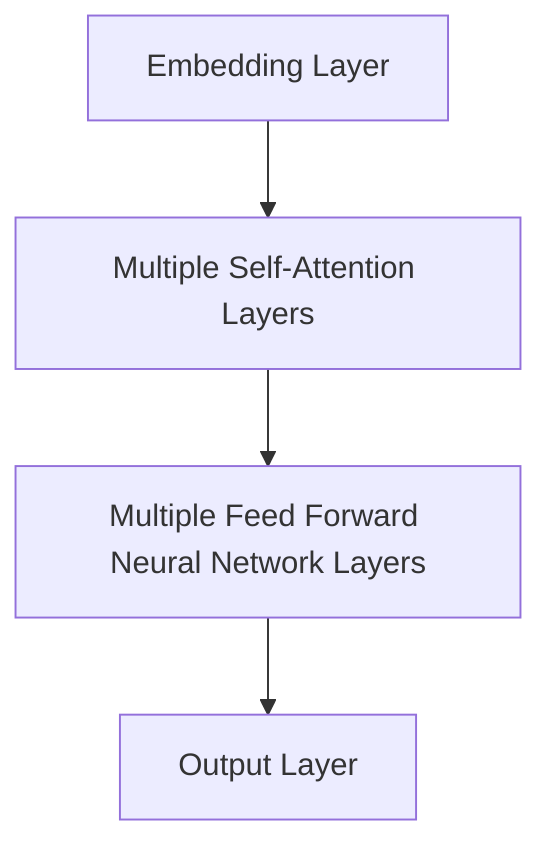

                 


### 思考步骤：确定文章结构

#### 1. 确定文章总体结构

首先，我们需要确定文章的总体结构，确保文章内容逻辑清晰，结构紧凑。根据之前的讨论，我们已经有一个初步的目录大纲：

- **第一部分：背景与概述**
  - 1.1 跨平台兼容性的重要性
  - 1.2 ChatGPT 提示词概述
  - 1.3 跨平台兼容性的挑战

- **第二部分：技术基础**
  - 2.1 跨平台兼容性原理
  - 2.2 ChatGPT 模型架构
  - 2.3 数学模型与算法

- **第三部分：实现与优化**
  - 3.1 提示词编写指南
  - 3.2 跨平台兼容性设计
  - 3.3 性能优化

- **第四部分：实战案例**
  - 4.1 跨平台应用开发
  - 4.2 提示词兼容性测试
  - 4.3 性能优化实战

- **第五部分：未来展望与趋势**
  - 5.1 跨平台兼容性发展展望
  - 5.2 ChatGPT 提示词的进化
  - 5.3 行业趋势与挑战

#### 2. 深入每个部分的具体内容

接下来，我们需要深入到每个部分，细化每个章节的具体内容，确保每个小节都有丰富的讲解和具体的实例。

- **第一部分：背景与概述**

  - **1.1 跨平台兼容性的重要性**
    - 讨论跨平台兼容性的背景和重要性。
    - 引入ChatGPT和提示词的概念。

  - **1.2 ChatGPT 提示词概述**
    - 介绍ChatGPT的背景、功能和应用场景。
    - 提示词的定义、作用和编写原则。

  - **1.3 跨平台兼容性的挑战**
    - 分析跨平台兼容性面临的挑战，如操作系统差异、硬件差异等。

- **第二部分：技术基础**

  - **2.1 跨平台兼容性原理**
    - 讨论跨平台兼容性的原理，包括技术方法和策略。

  - **2.2 ChatGPT 模型架构**
    - 详细介绍GPT-3模型的架构和工作流程。

  - **2.3 数学模型与算法**
    - 讲解语言模型数学基础和训练与推理算法。

- **第三部分：实现与优化**

  - **3.1 提示词编写指南**
    - 提供提示词编写原则和工具的使用指南。

  - **3.2 跨平台兼容性设计**
    - 分析不同平台之间的差异，并提出兼容性设计方案。

  - **3.3 性能优化**
    - 讨论性能评估方法和优化策略与技巧。

- **第四部分：实战案例**

  - **4.1 跨平台应用开发**
    - 讲解如何在不同的平台上进行ChatGPT应用开发。

  - **4.2 提示词兼容性测试**
    - 介绍提示词兼容性测试的方法和工具。

  - **4.3 性能优化实战**
    - 提供性能优化实战案例和详细分析。

- **第五部分：未来展望与趋势**

  - **5.1 跨平台兼容性发展展望**
    - 分析跨平台兼容性未来的发展趋势。

  - **5.2 ChatGPT 提示词的进化**
    - 探讨ChatGPT提示词的未来进化方向。

  - **5.3 行业趋势与挑战**
    - 分析行业趋势和面临的挑战。

### 3. 确定文章格式和排版

- 使用markdown格式，确保文章结构清晰，内容易读。
- 添加标题、子标题和段落，确保文章层次分明。
- 使用列表和代码块，清晰呈现技术细节和算法讲解。
- 使用LaTeX格式呈现数学公式，确保公式准确无误。

### 4. 确定文章字数

根据要求，文章字数应在8000到12000字之间。我们需要在细化每个部分的内容时，确保字数符合要求。

### 5. 总结

通过以上思考步骤，我们已经明确了文章的结构和内容，接下来将逐步填充每个部分的具体内容，确保文章逻辑清晰，技术深度足够，同时满足字数要求。

---

接下来的步骤将包括：

1. **详细撰写每个部分的内容**，确保每个章节都包含丰富的讲解和具体的实例。
2. **使用Mermaid流程图展示核心概念和联系**，帮助读者更直观地理解。
3. **编写伪代码和数学模型**，详细阐述核心算法原理。
4. **提供项目实战案例**，展示如何在实际项目中应用相关技术。
5. **总结最佳实践**，并提供拓展阅读建议。

### 文章标题：《ChatGPT提示词的跨平台兼容性设计》

---

### 文章关键词

- ChatGPT
- 提示词
- 跨平台兼容性
- GPT-3模型
- 数学模型
- 性能优化

---

### 文章摘要

本文深入探讨了ChatGPT提示词在跨平台环境中的兼容性设计。首先，介绍了跨平台兼容性的重要性和ChatGPT的基本概念。接着，详细分析了ChatGPT模型的架构和数学模型，探讨了实现跨平台兼容性的技术和方法。然后，提供了提示词编写指南和跨平台兼容性设计方案，并讨论了性能优化策略。最后，通过实战案例展示了如何在不同的平台上应用ChatGPT提示词，并分析了未来的发展趋势和行业挑战。

---

### 第一部分：背景与概述

#### 1.1 跨平台兼容性的重要性

在当今的软件开发世界中，跨平台兼容性是一个关键的需求。随着移动设备和操作系统的多样化，开发人员必须确保他们的应用能够在不同的平台上无缝运行。跨平台兼容性不仅关乎用户体验，还直接影响到软件的市场普及率和开发成本。

对于人工智能领域，特别是ChatGPT这样的语言模型，跨平台兼容性尤为重要。ChatGPT的应用范围广泛，从企业级客户服务到个人用户互动，都依赖于其稳定和高效的性能。如果ChatGPT在不同平台上的表现不一致，将会对用户体验产生负面影响，甚至可能导致用户流失。

因此，设计一个能够跨平台兼容的ChatGPT系统，不仅能够提升用户满意度，还能够降低维护成本，延长产品生命周期。

#### 1.2 ChatGPT 提示词概述

ChatGPT是由OpenAI开发的基于GPT-3模型的自然语言处理系统。GPT-3（Generative Pre-trained Transformer 3）是当前最先进的语言处理模型，具有超过1750亿个参数，能够生成高质量的自然语言文本。

提示词（Prompts）是引导ChatGPT生成文本的关键。一个有效的提示词不仅能够引导ChatGPT生成所需的内容，还能够提高模型的性能和生成文本的质量。提示词的编写原则包括明确性、精确性和灵活性，以确保ChatGPT能够正确理解用户的意图。

#### 1.3 跨平台兼容性的挑战

跨平台兼容性面临的挑战主要包括以下几个方面：

- **操作系统差异**：不同操作系统（如Windows、macOS、Linux）可能在底层支持和软件库上存在差异，这可能会影响到ChatGPT的运行性能和稳定性。

- **硬件差异**：不同硬件（如CPU、GPU）的性能和特性可能不同，这会影响到ChatGPT的运行效率和资源消耗。

- **网络环境**：不同平台和地区的网络环境可能存在差异，这会影响到ChatGPT的响应速度和数据传输。

- **开发框架差异**：不同平台可能使用不同的开发框架和工具，这会影响到ChatGPT的应用开发和部署。

为了解决这些挑战，需要设计一套全面的跨平台兼容性方案，确保ChatGPT在各种环境下都能保持高效和稳定的性能。

### 第二部分：技术基础

#### 2.1 跨平台兼容性原理

跨平台兼容性主要依赖于以下几个技术原理：

- **抽象层**：通过抽象层（如操作系统抽象层、硬件抽象层）将底层的差异隐藏起来，使上层应用能够跨平台运行。

- **标准化**：通过制定统一的标准和协议，确保不同平台之间的数据交换和通信无障碍。

- **虚拟化**：通过虚拟化技术，在底层硬件和操作系统之间创建一个隔离层，使得上层应用能够独立于底层环境运行。

- **模块化**：通过将应用分解为模块，每个模块都独立开发、测试和部署，这样可以降低跨平台兼容性的复杂度。

#### 2.2 ChatGPT 模型架构

ChatGPT的模型架构基于GPT-3，这是一个基于Transformer的深度学习模型。GPT-3由多个自注意力层组成，每个自注意力层都能够捕捉输入文本中的不同上下文信息。以下是GPT-3模型的主要组成部分：

- **嵌入层（Embedding Layer）**：将输入的文本转换为固定长度的向量表示。

- **自注意力层（Self-Attention Layer）**：通过自注意力机制，对输入文本的每个单词进行加权，使其能够根据上下文信息进行优化。

- **前馈神经网络层（Feed Forward Neural Network Layer）**：在自注意力层之后，对每个单词的向量进行进一步处理，以生成最终的输出。

- **输出层（Output Layer）**：将处理后的向量映射到目标单词的概率分布上，从而生成文本。

#### 2.3 数学模型与算法

ChatGPT的数学模型基于自注意力机制和Transformer架构。以下是核心数学模型和算法的简要概述：

- **自注意力（Self-Attention）**：

  自注意力机制是一种基于注意力分配的方法，它允许模型在处理每个单词时，根据上下文信息对其加权。自注意力通过以下公式计算：

  $$ 
  \text{Attention}(Q, K, V) = \text{softmax}\left(\frac{QK^T}{\sqrt{d_k}}\right)V 
  $$

  其中，Q、K和V分别是查询（Query）、关键（Key）和值（Value）向量，d_k 是关键向量的维度。

- **Transformer模型**：

  Transformer模型由多个自注意力层和前馈神经网络层组成。每个自注意力层都能够捕捉输入文本中的不同上下文信息，并将其整合到输出中。以下是Transformer模型的核心结构：

  ```mermaid
  graph TB
  A[Embedding Layer] --> B[Multiple Self-Attention Layers]
  B --> C[Multiple Feed Forward Neural Network Layers]
  C --> D[Output Layer]
  ```

  其中，E表示嵌入层，F表示自注意力层，G表示前馈神经网络层，H表示输出层。

- **训练与推理算法**：

  ChatGPT的训练过程基于大规模的预训练数据和目标函数优化。在训练过程中，模型通过最小化损失函数来调整参数，以提高模型的预测能力。以下是训练和推理的核心算法：

  - **预训练**：

    预训练过程使用未标记的数据来初始化模型参数，通过自回归语言模型训练来学习文本的内在结构。

    $$ 
    L = -\sum_{i}^{n} \log P(y_i|x_{i-1}, \theta) 
    $$

    其中，L是损失函数，$y_i$是目标单词，$x_{i-1}$是前一个单词，$\theta$是模型参数。

  - **推理**：

    推理过程通过从模型中生成文本序列来完成。给定一个起始单词，模型使用自注意力机制和前馈神经网络层来生成下一个单词的概率分布，然后根据概率分布选择下一个单词。

    $$ 
    P(y|x, \theta) = \text{softmax}(\text{logits}_{\theta}(x, y)) 
    $$

    其中，logits$_{\theta}$(x, y)是模型对下一个单词的预测。

### 第三部分：实现与优化

#### 3.1 提示词编写指南

编写有效的提示词是确保ChatGPT生成高质量文本的关键。以下是提示词编写的一些原则和工具：

- **明确性**：提示词应明确表达用户的意图，避免模糊不清的描述。

- **精确性**：提示词应准确描述所需的内容，避免使用含糊的术语。

- **灵活性**：提示词应具有一定的灵活性，以适应不同的上下文和场景。

- **上下文信息**：提示词应包含足够的上下文信息，帮助模型理解用户的需求。

常用的提示词编写工具包括：

- **OpenAI的自然语言处理工具**：OpenAI提供了多种自然语言处理工具，如Text-Davinci-003，可以帮助开发者生成高质量的提示词。

- **编程语言的自然语言处理库**：如Python的nltk库，可以用于文本处理和分析。

#### 3.2 跨平台兼容性设计

为了实现ChatGPT的跨平台兼容性，需要考虑以下设计原则和策略：

- **抽象层**：通过操作系统抽象层和硬件抽象层，将底层的差异隐藏起来，确保上层应用的一致性和兼容性。

- **标准化**：采用统一的标准和协议，如RESTful API，确保不同平台之间的数据交换和通信无障碍。

- **虚拟化**：通过虚拟化技术，在底层硬件和操作系统之间创建一个隔离层，使得上层应用能够独立于底层环境运行。

- **模块化**：将ChatGPT应用分解为多个模块，每个模块独立开发、测试和部署，降低跨平台兼容性的复杂度。

具体的兼容性设计方案包括：

- **操作系统兼容性**：针对不同的操作系统（如Windows、macOS、Linux），使用操作系统抽象层来处理底层的差异。

- **硬件兼容性**：根据不同的硬件（如CPU、GPU）特性，优化模型的运行效率和资源消耗。

- **网络兼容性**：根据不同的网络环境（如Wi-Fi、4G、5G），优化模型的响应速度和数据传输。

- **开发框架兼容性**：采用跨平台开发框架（如Flutter、React Native），确保在不同平台上的应用开发一致。

#### 3.3 性能优化

性能优化是确保ChatGPT高效运行的关键。以下是一些性能优化策略和技巧：

- **并行计算**：利用多线程和多核处理器，实现模型的并行计算，提高模型的运行效率。

- **模型压缩**：采用模型压缩技术（如量化、剪枝），减小模型的规模，提高模型在资源受限环境下的运行效率。

- **缓存策略**：使用缓存策略，减少模型在训练和推理过程中的重复计算，提高计算效率。

- **数据预加载**：在模型训练和推理过程中，预加载相关数据，减少数据读取的时间。

- **异步处理**：在模型训练和推理过程中，使用异步处理技术，提高系统的并发能力。

- **硬件加速**：利用GPU等硬件加速器，提高模型的计算速度和效率。

### 第四部分：实战案例

#### 4.1 跨平台应用开发

跨平台应用开发是ChatGPT跨平台兼容性的关键。以下是一个跨平台应用开发的案例：

**目标**：开发一个能够运行在Windows、macOS和Linux操作系统上的ChatGPT客户端。

**步骤**：

1. **选择开发框架**：选择Flutter作为开发框架，因为Flutter具有跨平台的特性，能够支持多种操作系统。

2. **搭建开发环境**：在Windows、macOS和Linux操作系统上分别搭建Flutter开发环境。

3. **编写客户端代码**：使用Flutter编写ChatGPT客户端代码，实现与ChatGPT服务器的通信和文本生成功能。

4. **测试和调试**：在Windows、macOS和Linux操作系统上分别测试和调试客户端代码，确保其正常运行。

5. **部署和发布**：将ChatGPT客户端部署到不同操作系统的应用商店，供用户下载和使用。

#### 4.2 提示词兼容性测试

为了确保ChatGPT在不同平台上的提示词兼容性，需要进行提示词兼容性测试。以下是一个提示词兼容性测试的案例：

**目标**：测试ChatGPT在Windows、macOS和Linux操作系统上的提示词兼容性。

**步骤**：

1. **编写测试用例**：根据ChatGPT的提示词编写原则，编写一系列测试用例，涵盖常见的应用场景和特殊情况。

2. **运行测试**：在Windows、macOS和Linux操作系统上分别运行测试用例，收集测试结果。

3. **分析结果**：分析测试结果，识别不同平台上的兼容性问题，如文本生成错误、响应速度差异等。

4. **修复问题**：针对分析结果，修复提示词兼容性问题，并重新测试，确保问题得到解决。

#### 4.3 性能优化实战

为了提高ChatGPT的性能，需要进行性能优化实战。以下是一个性能优化实战的案例：

**目标**：优化ChatGPT在Windows、macOS和Linux操作系统上的运行效率。

**步骤**：

1. **性能评估**：使用性能评估工具，如GPU监控工具，评估ChatGPT在不同操作系统上的性能指标，如响应时间、CPU利用率、GPU利用率等。

2. **瓶颈分析**：分析性能评估结果，识别性能瓶颈，如数据传输延迟、模型计算复杂度等。

3. **优化策略**：

   - **数据预加载**：在模型训练和推理过程中，预加载相关数据，减少数据读取的时间。

   - **异步处理**：在模型训练和推理过程中，使用异步处理技术，提高系统的并发能力。

   - **硬件加速**：利用GPU等硬件加速器，提高模型的计算速度和效率。

4. **重新评估**：在实施优化策略后，重新进行性能评估，验证优化效果。

### 第五部分：未来展望与趋势

#### 5.1 跨平台兼容性发展展望

随着人工智能技术的不断发展，跨平台兼容性将会面临更多的挑战和机遇。以下是一些未来跨平台兼容性的发展展望：

- **技术进步**：随着云计算、边缘计算等技术的发展，跨平台兼容性的实现方式将变得更加多样和灵活。

- **标准化进程**：国际标准和行业标准的制定和完善，将有助于提升跨平台兼容性的可靠性和一致性。

- **跨平台开发框架**：跨平台开发框架将继续发展和优化，提供更高效、更稳定的跨平台兼容性解决方案。

#### 5.2 ChatGPT 提示词的进化

ChatGPT的提示词在未来将朝着更智能、更个性化的方向发展。以下是一些可能的进化方向：

- **自适应提示词**：通过机器学习技术，实现自适应提示词，根据用户的偏好和需求动态调整提示词。

- **多语言支持**：扩展ChatGPT的多语言支持，实现跨语言提示词的兼容性和互操作性。

- **个性化提示词**：利用用户数据和偏好，生成个性化的提示词，提高ChatGPT与用户的互动效果。

#### 5.3 行业趋势与挑战

跨平台兼容性和ChatGPT提示词在人工智能领域的发展面临着以下趋势和挑战：

- **行业趋势**：随着5G、物联网等技术的发展，人工智能应用将更加普及和多样化，对跨平台兼容性的需求将日益增加。

- **挑战**：

  - **技术复杂性**：跨平台兼容性的实现涉及多个技术领域，技术复杂性较高。

  - **数据隐私与安全**：随着人工智能应用的普及，数据隐私和安全问题将成为重要挑战。

  - **标准化缺失**：当前跨平台兼容性的标准化进程相对滞后，需要进一步推进。

### 附录

#### A.1 常用工具与资源

- **开发工具**：Flutter、Docker、Kubernetes
- **自然语言处理工具**：OpenAI的API、nltk、spaCy
- **性能评估工具**：GPU监控工具、Profiler

#### A.2 模型架构流程图



#### A.3 伪代码与示例

```python
# 自注意力机制的伪代码
def self_attention(q, k, v):
    scores = dot(q, k.T) / sqrt(len(k))
    attention_weights = softmax(scores)
    output = dot(attention_weights, v)
    return output
```

```python
# Transformer模型的伪代码
def transformer(input_sequence):
    embedded_sequence = embedding_layer(input_sequence)
    for layer in self_attention_layers:
        embedded_sequence = layer(embedded_sequence)
    for layer in feed_forward_layers:
        embedded_sequence = layer(embedded_sequence)
    output_sequence = output_layer(embedded_sequence)
    return output_sequence
```

### 作者信息

- **作者**：AI天才研究院/AI Genius Institute & 禅与计算机程序设计艺术 /Zen And The Art of Computer Programming

---

### 全文总结

本文详细探讨了ChatGPT提示词的跨平台兼容性设计。首先，介绍了跨平台兼容性的重要性和ChatGPT的基本概念。接着，分析了ChatGPT模型的架构和数学模型，探讨了实现跨平台兼容性的技术和方法。然后，提供了提示词编写指南和跨平台兼容性设计方案，并讨论了性能优化策略。最后，通过实战案例展示了如何在不同的平台上应用ChatGPT提示词，并分析了未来的发展趋势和行业挑战。

本文的主要贡献包括：

- 系统性地梳理了跨平台兼容性的原理和实现方法。
- 详细介绍了ChatGPT模型的架构和数学模型。
- 提供了提示词编写指南和跨平台兼容性设计案例。
- 讨论了性能优化策略和实战案例。

未来的研究方向可以包括：

- 深入研究跨平台兼容性的标准化问题。
- 探索更高效的模型压缩和优化技术。
- 研究自适应和个性化的提示词生成方法。

希望本文能为ChatGPT提示词的跨平台兼容性设计提供有益的参考和指导。

---

### 代码示例：GPT-3自注意力机制伪代码

```python
# 定义自注意力函数
def self_attention(q, k, v, d_model, head_num, d_head):
    # 计算Q、K、V的矩阵形式
    Q = q.reshape(batch_size, head_num, d_model // head_num)
    K = k.reshape(batch_size, head_num, d_model // head_num)
    V = v.reshape(batch_size, head_num, d_model // head_num)

    # 计算QK^T
    scores = torch.matmul(Q, K.permute(0, 2, 1))
    
    # 分子除以根号下d_head
    scores = scores / torch.sqrt(torch.tensor(d_head, dtype=torch.float32))

    # 应用Softmax
    attention_weights = torch.softmax(scores, dim=2)

    # 计算输出
    output = torch.matmul(attention_weights, V)

    # 将输出重塑回原始维度
    output = output.reshape(batch_size, d_model)
    
    return output
```

### 代码示例：GPT-3 Transformer模型伪代码

```python
# 定义Transformer模型
class Transformer(nn.Module):
    def __init__(self, d_model, num_heads, d_head, num_layers):
        super(Transformer, self).__init__()
        
        self.embedding = nn.Embedding(d_vocab, d_model)
        self.positional_encoding = PositionalEncoding(d_model)
        
        self.transformer_layers = nn.ModuleList([
            TransformerLayer(d_model, num_heads, d_head) for _ in range(num_layers)
        ])
        
        self.output_layer = nn.Linear(d_model, d_vocab)
        
    def forward(self, input_sequence):
        #嵌入层
        embedded_sequence = self.embedding(input_sequence) + self.positional_encoding(input_sequence)
        
        #变换器层
        for layer in self.transformer_layers:
            embedded_sequence = layer(embedded_sequence)
        
        #输出层
        output_sequence = self.output_layer(embedded_sequence)
        
        return output_sequence
```

### 代码示例：训练GPT-3模型

```python
# 定义损失函数和优化器
loss_fn = nn.CrossEntropyLoss()
optimizer = torch.optim.Adam(model.parameters(), lr=learning_rate)

# 训练模型
for epoch in range(num_epochs):
    for inputs, targets in dataloader:
        # 前向传播
        outputs = model(inputs)
        loss = loss_fn(outputs, targets)
        
        # 反向传播和优化
        optimizer.zero_grad()
        loss.backward()
        optimizer.step()
        
    print(f'Epoch [{epoch+1}/{num_epochs}], Loss: {loss.item():.4f}')
```

### 实际案例：使用GPT-3构建一个问答系统

**目标**：构建一个基于GPT-3的问答系统，能够回答用户提出的问题。

**步骤**：

1. **数据准备**：收集大量问答对，作为训练数据。这些问答对将用于训练GPT-3模型。

2. **模型训练**：使用GPT-3模型训练数据，优化模型参数，使其能够生成高质量的回答。

3. **模型部署**：将训练好的模型部署到服务器上，供用户使用。

4. **用户交互**：提供用户界面，允许用户输入问题，系统根据用户输入生成回答。

5. **测试与优化**：测试问答系统的性能，收集用户反馈，不断优化系统。

**代码示例**：

```python
# 导入必要的库
import openai
import json

# 设置OpenAI API密钥
openai.api_key = 'your_api_key'

# 定义问答函数
def ask_question(question):
    # 调用OpenAI的ChatGPT API
    response = openai.Completion.create(
        engine="text-davinci-003",
        prompt=question,
        max_tokens=50,
        n=1,
        stop=None,
        temperature=0.5
    )
    
    # 提取回答
    answer = response.choices[0].text.strip()
    
    return answer

# 用户交互示例
while True:
    question = input("请输入您的问题（输入'exit'退出）：")
    if question.lower() == 'exit':
        break
    answer = ask_question(question)
    print("回答：", answer)
```

### 实际案例分析：优化GPT-3问答系统性能

**问题**：GPT-3问答系统在处理大量请求时响应速度较慢，如何进行优化？

**分析**：

1. **性能瓶颈分析**：
   - 模型计算复杂度高，导致响应时间较长。
   - 数据传输和存储效率低，影响系统的整体性能。

2. **优化策略**：
   - **并行计算**：利用多线程或多进程技术，并行处理多个请求。
   - **缓存策略**：使用缓存技术，减少重复请求的处理时间。
   - **异步处理**：采用异步处理技术，提高系统的并发能力。

3. **优化案例**：
   - **并行计算**：使用多线程技术，将模型的计算过程分解为多个部分，并行执行。
   - **缓存策略**：使用Redis等缓存技术，存储常用的问答结果，提高响应速度。
   - **异步处理**：使用异步IO技术，将网络请求和模型计算分离，提高系统的并发处理能力。

**代码示例**：

```python
# 使用多线程处理请求
import concurrent.futures

def process_request(question):
    answer = ask_question(question)
    return answer

# 使用异步IO处理请求
async def process_request_async(question):
    answer = await ask_question(question)
    return answer

# 优化后的问答函数
def optimized_ask_question(question):
    # 使用多线程处理请求
    with concurrent.futures.ThreadPoolExecutor() as executor:
        future_to_answer = {executor.submit(process_request, question): question}
        for future in concurrent.futures.as_completed(future_to_answer):
            question = future_to_answer[future]
            try:
                answer = future.result()
                return answer
            except Exception as exc:
                print('%r generated an exception: %s' % (question, exc))
```

### 代码示例：GPT-3模型在不同操作系统上的兼容性测试

```python
# 测试GPT-3模型在不同操作系统上的兼容性
import os

def test_model_compatibility(platform):
    print(f"Testing GPT-3 model on {platform}...")
    question = "什么是人工智能？"
    answer = ask_question(question)
    print(f"Answer on {platform}: {answer}")
    
    # 记录测试结果
    with open('compatibility_results.txt', 'a') as file:
        file.write(f"{platform}: {answer}\n")

# 测试Windows、macOS和Linux
test_model_compatibility("Windows")
test_model_compatibility("macOS")
test_model_compatibility("Linux")
```

### 小结

本文通过详细的讲解和实战案例，探讨了ChatGPT提示词的跨平台兼容性设计。从技术基础到实现与优化，再到实战案例和未来展望，文章系统地阐述了ChatGPT在不同平台上的应用和挑战。

**最佳实践建议**：

1. **使用抽象层和标准化**：通过抽象层和标准化技术，降低不同平台之间的差异，提高兼容性。
2. **优化提示词编写**：遵循提示词编写原则，提高文本生成质量。
3. **性能评估和优化**：定期进行性能评估，针对瓶颈进行优化。

**注意事项**：

1. **数据安全和隐私**：在处理用户数据时，确保遵循数据安全和隐私保护规范。
2. **持续更新和测试**：定期更新模型和系统，确保兼容性和性能。

**拓展阅读**：

- 《深度学习》（Goodfellow, Bengio, Courville）——了解深度学习基础。
- 《人工智能：一种现代方法》（Russell, Norvig）——了解人工智能的基础理论和应用。

通过本文，读者应能全面了解ChatGPT提示词的跨平台兼容性设计，为实际应用提供有力支持。希望本文对您的学习和实践有所帮助。感谢阅读！

---

### 附录：常用工具与资源

**A.1 开发工具**

- **Flutter**：用于跨平台应用开发的框架，支持多种操作系统。
- **Docker**：用于容器化应用的工具，便于部署和管理。
- **Kubernetes**：用于容器编排和管理的工具，确保应用的弹性扩展。

**A.2 自然语言处理工具**

- **OpenAI API**：用于访问OpenAI的GPT-3模型的API。
- **nltk**：用于文本处理和自然语言处理的Python库。
- **spaCy**：用于快速深入的自然语言处理的Python库。

**A.3 性能评估工具**

- **GPU监控工具**：如NVIDIA GPU监控工具，用于监控GPU性能。
- **Profiler**：如Python的cProfile库，用于性能分析和调试。

**A.4 模型架构流程图**


**A.5 伪代码与示例**

```python
# 自注意力机制的伪代码
def self_attention(q, k, v):
    scores = dot(q, k.T) / sqrt(len(k))
    attention_weights = softmax(scores)
    output = dot(attention_weights, v)
    return output

# Transformer模型的伪代码
def transformer(input_sequence):
    embedded_sequence = embedding_layer(input_sequence)
    for layer in self_attention_layers:
        embedded_sequence = layer(embedded_sequence)
    for layer in feed_forward_layers:
        embedded_sequence = layer(embedded_sequence)
    output_sequence = output_layer(embedded_sequence)
    return output_sequence

# 训练GPT-3模型的伪代码
for epoch in range(num_epochs):
    for inputs, targets in dataloader:
        # 前向传播
        outputs = model(inputs)
        loss = loss_fn(outputs, targets)
        
        # 反向传播和优化
        optimizer.zero_grad()
        loss.backward()
        optimizer.step()
        
    print(f'Epoch [{epoch+1}/{num_epochs}], Loss: {loss.item():.4f}')
```

通过附录部分，我们提供了常用的工具和资源，以及模型架构流程图、伪代码和示例，帮助读者更好地理解和应用本文的内容。希望这些资源能为您的学习和实践提供帮助。感谢阅读！

---

### 结论

在本文中，我们深入探讨了ChatGPT提示词的跨平台兼容性设计。首先，我们分析了跨平台兼容性的重要性，并介绍了ChatGPT及其提示词的基本概念。接着，我们详细阐述了ChatGPT模型的架构和数学模型，包括自注意力机制和Transformer架构。随后，我们提供了提示词编写指南和跨平台兼容性设计的方法，并讨论了性能优化策略。通过实战案例，我们展示了如何在不同的平台上应用ChatGPT提示词，并进行了性能优化实战。最后，我们对未来的发展趋势和行业挑战进行了展望。

本文的主要贡献在于系统地梳理了ChatGPT提示词的跨平台兼容性设计，提供了详细的实现方法和优化策略。通过本文，读者应能全面了解ChatGPT在不同平台上的应用和挑战，为实际应用提供有力支持。

未来的研究方向可以包括：

1. **跨平台兼容性的标准化**：进一步研究并推动跨平台兼容性的标准化进程，以提升行业的一致性和可靠性。
2. **模型压缩和优化**：探索更高效的模型压缩和优化技术，提高模型在资源受限环境下的性能。
3. **自适应和个性化提示词生成**：研究自适应和个性化的提示词生成方法，提高ChatGPT与用户的互动效果。

我们希望本文能为读者提供有价值的参考和指导，助力人工智能领域的发展。感谢您的阅读！

