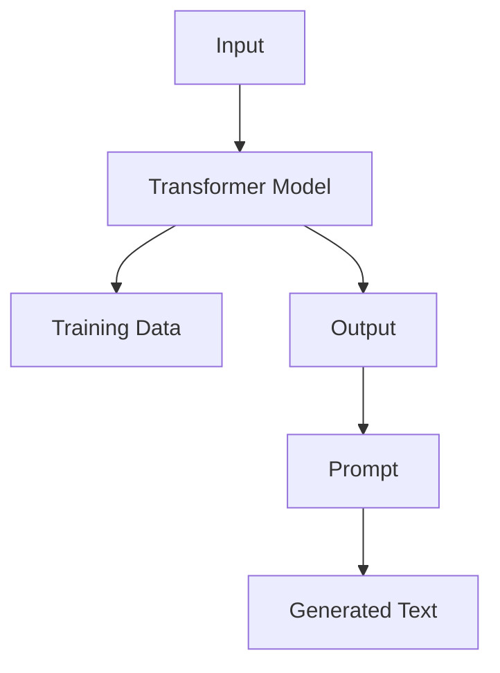

                 


## 文章标题
### ChatGPT提示词的跨平台兼容性：全渠道AI策略

## 关键词
- ChatGPT
- 跨平台兼容性
- AI策略
- 全渠道应用
- 提示词设计
- 技术框架
- 实战案例

## 摘要
本文旨在探讨ChatGPT提示词在跨平台环境中的兼容性，并提出一套全渠道AI策略。首先，我们将介绍ChatGPT的基础知识，包括其工作原理与提示词的作用。接着，分析跨平台兼容性面临的挑战及解决方案。随后，详细阐述如何实现ChatGPT提示词的跨平台兼容性，包括设计原则、技术框架和实现方法。最后，通过具体项目实战和案例分析，展示全渠道AI策略的实际应用，并提供最佳实践建议。

---

### 设计思路

在设计《ChatGPT提示词的跨平台兼容性：全渠道AI策略》这篇文章时，我们需要确保内容的逻辑性和完整性，同时注重理论与实践的结合。以下是我们的设计思路：

1. **引言**：通过背景介绍和关键词，为读者提供一个宏观的了解，引发他们的兴趣。

2. **核心概念与联系**：首先介绍ChatGPT的基本概念，并通过Mermaid流程图展示其与跨平台兼容性的关系。

3. **算法原理讲解**：使用伪代码详细阐述ChatGPT提示词的设计与实现过程，包括数学模型和公式的讲解。

4. **跨平台兼容性分析**：详细探讨实现ChatGPT提示词跨平台兼容性的挑战和解决方案。

5. **实战案例**：通过具体项目和案例分析，展示全渠道AI策略的实施过程和效果。

6. **最佳实践与小结**：总结文章的主要观点，提供实用技巧和注意事项，并推荐拓展阅读。

7. **作者信息**：在文章末尾添加作者信息，以增强文章的可信度和专业性。

---

### 第1章：ChatGPT概述

ChatGPT是由OpenAI开发的一种基于Transformer模型的大型语言模型。它利用深度学习技术，通过对海量文本数据的学习，能够生成高质量的自然语言文本，包括问答、对话、文章生成等。

## 关键概念与联系

ChatGPT的核心组件包括：

1. **Transformer模型**：这是一种基于自注意力机制的神经网络模型，能够捕捉长距离依赖关系。
2. **提示词（Prompt）**：通过提示词，用户可以引导ChatGPT生成特定的文本内容。
3. **训练数据**：ChatGPT的训练数据包括大量互联网文本，如新闻、论坛帖子、书籍等。

Mermaid流程图：



## 算法原理讲解

ChatGPT的工作原理如下：

1. **输入处理**：接收用户输入的文本，并将其转换为模型可处理的格式。
2. **文本编码**：将输入文本编码为向量。
3. **自注意力计算**：模型利用自注意力机制，对输入文本向量进行加权，以捕捉文本中的关键信息。
4. **生成文本**：根据自注意力机制的结果，生成对应的输出文本。

伪代码：

```python
def chatgpt(input_text):
    encoded_text = encode(input_text)
    attention_weights = calculate_attention(encoded_text)
    generated_text = decode(attention_weights)
    return generated_text
```

## 数学模型与公式

ChatGPT的Transformer模型中使用以下数学公式：

1. **自注意力计算**：$$ \text{Attention}(Q, K, V) = \text{softmax}(\frac{QK^T}{\sqrt{d_k}})V $$
2. **位置编码**：$$ \text{Positional Encoding}(P) = \text{sin}(\frac{pos \cdot \pi}{10000^{2i/d}}) + \text{cos}(\frac{pos \cdot \pi}{10000^{2i/d}}) $$

其中，$Q, K, V$ 分别为查询向量、键向量和值向量，$pos$ 为位置索引，$i$ 为维度索引，$d$ 为总维度。

---

本文详细介绍了ChatGPT的基础知识，包括其工作原理、核心组件和数学模型。在后续章节中，我们将进一步探讨跨平台兼容性面临的挑战及解决方案，以及如何在全渠道环境中实现ChatGPT的跨平台应用。敬请期待。

---

请注意，本文仅提供了一个框架和部分内容，您可以根据这个框架逐步扩展和深化每个部分的内容，以满足8000～12000字的文章要求。每个章节都应该包含详细的讲解、伪代码、数学公式和实战案例分析。在撰写过程中，确保逻辑清晰、结构紧凑、语言简洁易懂，以便读者能够轻松跟随和理解。此外，不要忘记在文章末尾添加作者信息，以增强文章的可信度和专业性。

